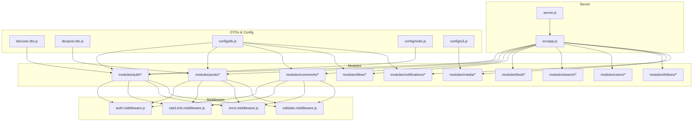
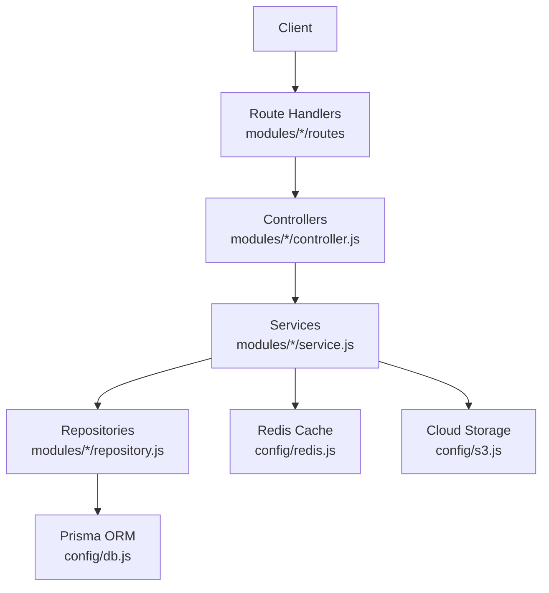
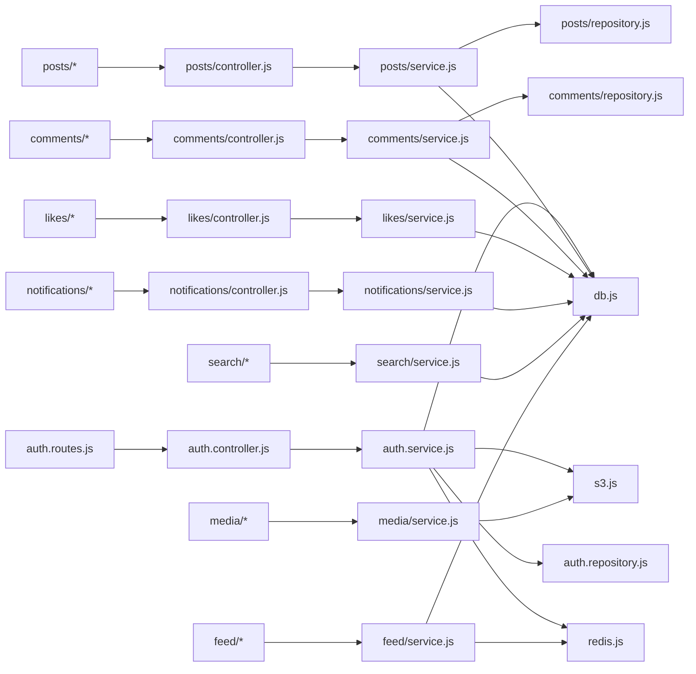
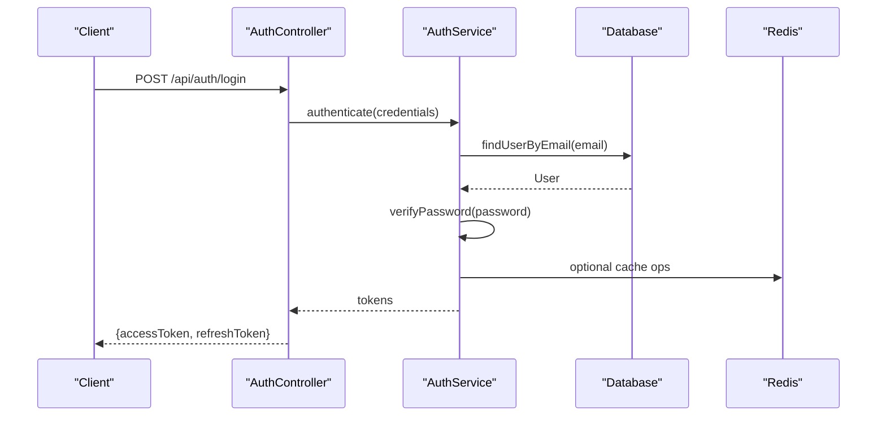
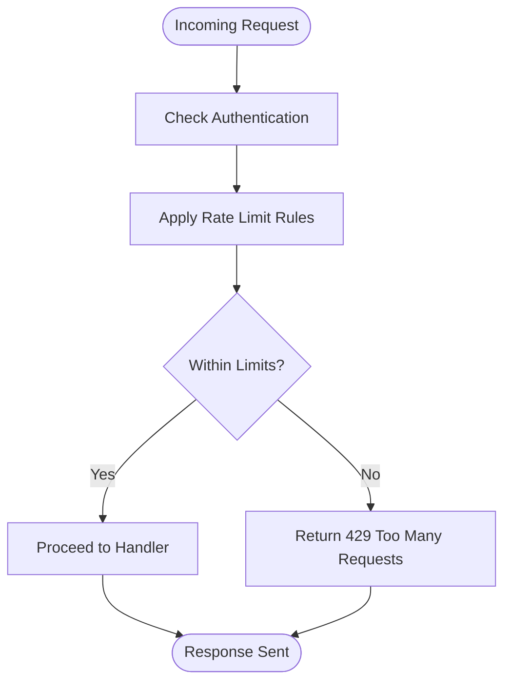

# API Reference

<cite>
**Referenced Files in This Document**
- [server.js](file://backend/server.js)
- [app.js](file://backend/src/app.js)
- [auth.routes.js](file://backend/src/modules/auth/auth.routes.js)
- [auth.controller.js](file://backend/src/modules/auth/auth.controller.js)
- [auth.service.js](file://backend/src/modules/auth/auth.service.js)
- [auth.validation.js](file://backend/src/modules/auth/auth.validation.js)
- [auth.middleware.js](file://backend/src/middleware/auth.middleware.js)
- [rateLimit.middleware.js](file://backend/src/middleware/rateLimit.middleware.js)
- [error.middleware.js](file://backend/src/middleware/error.middleware.js)
- [validate.middleware.js](file://backend/src/middleware/validate.middleware.js)
- [user.dto.js](file://backend/src/dto/user.dto.js)
- [post.dto.js](file://backend/src/dto/post.dto.js)
- [db.js](file://backend/src/config/db.js)
- [redis.js](file://backend/src/config/redis.js)
- [s3.js](file://backend/src/config/s3.js)
- [errors.js](file://backend/src/constants/errors.js)
- [roles.js](file://backend/src/constants/roles.js)
</cite>

## Table of Contents
1. [Introduction](#introduction)
2. [Project Structure](#project-structure)
3. [Core Components](#core-components)
4. [Architecture Overview](#architecture-overview)
5. [Detailed Component Analysis](#detailed-component-analysis)
6. [Dependency Analysis](#dependency-analysis)
7. [Performance Considerations](#performance-considerations)
8. [Troubleshooting Guide](#troubleshooting-guide)
9. [Conclusion](#conclusion)
10. [Appendices](#appendices)

## Introduction
This document provides comprehensive API documentation for the social media application’s RESTful endpoints. It covers authentication, user management, posts, comments, likes, notifications, and supporting infrastructure. The guide includes HTTP methods, URL patterns, request/response schemas, authentication requirements, validation rules, error handling, rate limiting, pagination, filtering, sorting, CORS, security headers, and performance considerations.

## Project Structure
The backend is organized around modular domain boundaries under the src/modules directory. Each module encapsulates controller, service, repository, validation, and route files. Middleware handles cross-cutting concerns such as authentication, validation, rate limiting, and error handling. Configuration files manage database, caching, and cloud storage integrations.

**Diagram sources**
- [server.js:1-1](file://backend/server.js#L1-L1)
- [app.js:1-1](file://backend/src/app.js#L1-L1)
- [auth.routes.js:1-1](file://backend/src/modules/auth/auth.routes.js#L1-L1)
- [auth.controller.js:1-1](file://backend/src/modules/auth/auth.controller.js#L1-L1)
- [auth.service.js:1-1](file://backend/src/modules/auth/auth.service.js#L1-L1)
- [auth.validation.js:1-1](file://backend/src/modules/auth/auth.validation.js#L1-L1)
- [auth.middleware.js:1-1](file://backend/src/middleware/auth.middleware.js#L1-L1)
- [rateLimit.middleware.js:1-1](file://backend/src/middleware/rateLimit.middleware.js#L1-L1)
- [error.middleware.js:1-1](file://backend/src/middleware/error.middleware.js#L1-L1)
- [validate.middleware.js:1-1](file://backend/src/middleware/validate.middleware.js#L1-L1)
- [user.dto.js:1-1](file://backend/src/dto/user.dto.js#L1-L1)
- [post.dto.js:1-1](file://backend/src/dto/post.dto.js#L1-L1)
- [db.js:1-1](file://backend/src/config/db.js#L1-L1)
- [redis.js:1-1](file://backend/src/config/redis.js#L1-L1)
- [s3.js:1-1](file://backend/src/config/s3.js#L1-L1)

**Section sources**
- [server.js:1-1](file://backend/server.js#L1-L1)
- [app.js:1-1](file://backend/src/app.js#L1-L1)

## Core Components
- Authentication: Login, registration, token refresh, protected routes.
- Users: Profile management, account settings, privacy controls.
- Posts: Creation, retrieval, updates, deletion, pagination, filtering, sorting.
- Comments: CRUD operations, nested replies, moderation.
- Likes: Like/unlike posts and comments.
- Notifications: Real-time and stored notifications.
- Media: Uploads via cloud storage integration.
- Search: Text-based search across users and posts.
- Feed: Personalized timeline aggregation.
- Follows: Following/unfollowing users.

**Section sources**
- [auth.routes.js:1-1](file://backend/src/modules/auth/auth.routes.js#L1-L1)
- [auth.controller.js:1-1](file://backend/src/modules/auth/auth.controller.js#L1-L1)
- [auth.service.js:1-1](file://backend/src/modules/auth/auth.service.js#L1-L1)
- [auth.validation.js:1-1](file://backend/src/modules/auth/auth.validation.js#L1-L1)
- [auth.middleware.js:1-1](file://backend/src/middleware/auth.middleware.js#L1-L1)
- [rateLimit.middleware.js:1-1](file://backend/src/middleware/rateLimit.middleware.js#L1-L1)
- [error.middleware.js:1-1](file://backend/src/middleware/error.middleware.js#L1-L1)
- [validate.middleware.js:1-1](file://backend/src/middleware/validate.middleware.js#L1-L1)
- [user.dto.js:1-1](file://backend/src/dto/user.dto.js#L1-L1)
- [post.dto.js:1-1](file://backend/src/dto/post.dto.js#L1-L1)
- [db.js:1-1](file://backend/src/config/db.js#L1-L1)
- [redis.js:1-1](file://backend/src/config/redis.js#L1-L1)
- [s3.js:1-1](file://backend/src/config/s3.js#L1-L1)

## Architecture Overview
The API follows a layered architecture:
- Entry points: Route handlers per module.
- Controllers: Orchestrate requests, delegate to services.
- Services: Business logic and coordination.
- Repositories: Data access via Prisma ORM.
- Middleware: Authentication, validation, rate limiting, error handling.
- DTOs: Request/response schemas.
- Config: Database, Redis cache, S3 storage.

**Diagram sources**
- [auth.routes.js:1-1](file://backend/src/modules/auth/auth.routes.js#L1-L1)
- [auth.controller.js:1-1](file://backend/src/modules/auth/auth.controller.js#L1-L1)
- [auth.service.js:1-1](file://backend/src/modules/auth/auth.service.js#L1-L1)
- [auth.repository.js:1-1](file://backend/src/modules/auth/auth.repository.js#L1-L1)
- [db.js:1-1](file://backend/src/config/db.js#L1-L1)
- [redis.js:1-1](file://backend/src/config/redis.js#L1-L1)
- [s3.js:1-1](file://backend/src/config/s3.js#L1-L1)

## Detailed Component Analysis

### Authentication Endpoints
- Purpose: User registration, login, token refresh, logout.
- Authentication: JWT-based bearer tokens; protected routes require Authorization header.
- Validation: Input validation enforced via validation middleware and DTOs.
- Rate Limiting: Requests are rate-limited to prevent abuse.
- Error Handling: Centralized error middleware returns structured errors.

Endpoints
- POST /api/auth/register
  - Description: Register a new user.
  - Authentication: Not required.
  - Request body: Fields defined in user DTO validation rules.
  - Responses:
    - 201 Created: User created successfully.
    - 400 Bad Request: Validation errors.
    - 409 Conflict: Duplicate email/username.
    - 500 Internal Server Error: Server failure.
  - Example curl:
    - curl -X POST https://yourdomain.com/api/auth/register -H "Content-Type: application/json" -d "{...}"

- POST /api/auth/login
  - Description: Authenticate user and return access/refresh tokens.
  - Authentication: Not required.
  - Request body: Email/username and password.
  - Responses:
    - 200 OK: Tokens returned.
    - 400 Bad Request: Validation errors.
    - 401 Unauthorized: Invalid credentials.
    - 429 Too Many Requests: Rate limit exceeded.
    - 500 Internal Server Error: Server failure.
  - Example curl:
    - curl -X POST https://yourdomain.com/api/auth/login -H "Content-Type: application/json" -d "{...}"

- POST /api/auth/refresh
  - Description: Refresh access token using refresh token.
  - Authentication: Not required.
  - Request body: Refresh token.
  - Responses:
    - 200 OK: New access token.
    - 400 Bad Request: Invalid payload.
    - 401 Unauthorized: Invalid/expired refresh token.
    - 429 Too Many Requests: Rate limit exceeded.
    - 500 Internal Server Error: Server failure.
  - Example curl:
    - curl -X POST https://yourdomain.com/api/auth/refresh -H "Content-Type: application/json" -d "{...}"

- POST /api/auth/logout
  - Description: Invalidate current session/token.
  - Authentication: Required.
  - Request body: Optional (depends on server-side session handling).
  - Responses:
    - 200 OK: Logged out.
    - 401 Unauthorized: Missing/invalid token.
    - 500 Internal Server Error: Server failure.
  - Example curl:
    - curl -X POST https://yourdomain.com/api/auth/logout -H "Authorization: Bearer {access_token}" -H "Content-Type: application/json"

Security and Headers
- Authorization: Bearer {access_token} for protected endpoints.
- Content-Type: application/json for JSON payloads.
- Rate Limiting: X-RateLimit-Limit, X-RateLimit-Remaining, X-RateLimit-Reset headers.
- CORS: Configure allowed origins, methods, headers, credentials.

Validation Rules
- Registration: Email uniqueness, strong password policy, username constraints.
- Login: Email/username presence, password presence.
- Token refresh: Refresh token presence and validity.

Error Response Format
- Structure: { error: { code, message, details?, timestamp } }
- Common codes: invalid_credentials, validation_failed, unauthorized, rate_limited, internal_error.

**Section sources**
- [auth.routes.js:1-1](file://backend/src/modules/auth/auth.routes.js#L1-L1)
- [auth.controller.js:1-1](file://backend/src/modules/auth/auth.controller.js#L1-L1)
- [auth.service.js:1-1](file://backend/src/modules/auth/auth.service.js#L1-L1)
- [auth.validation.js:1-1](file://backend/src/modules/auth/auth.validation.js#L1-L1)
- [auth.middleware.js:1-1](file://backend/src/middleware/auth.middleware.js#L1-L1)
- [rateLimit.middleware.js:1-1](file://backend/src/middleware/rateLimit.middleware.js#L1-L1)
- [error.middleware.js:1-1](file://backend/src/middleware/error.middleware.js#L1-L1)
- [user.dto.js:1-1](file://backend/src/dto/user.dto.js#L1-L1)
- [errors.js:1-1](file://backend/src/constants/errors.js#L1-L1)

### User Management APIs
- GET /api/users/profile
  - Description: Retrieve authenticated user profile.
  - Authentication: Required.
  - Query params: None.
  - Responses:
    - 200 OK: User profile object.
    - 401 Unauthorized: Missing/invalid token.
    - 404 Not Found: User not found.
    - 500 Internal Server Error.
  - Example curl:
    - curl -X GET https://yourdomain.com/api/users/profile -H "Authorization: Bearer {access_token}"

- PUT /api/users/profile
  - Description: Update profile fields.
  - Authentication: Required.
  - Request body: Updatable profile fields (e.g., bio, avatar).
  - Responses:
    - 200 OK: Updated profile.
    - 400 Bad Request: Validation errors.
    - 401 Unauthorized: Missing/invalid token.
    - 404 Not Found: User not found.
    - 500 Internal Server Error.
  - Example curl:
    - curl -X PUT https://yourdomain.com/api/users/profile -H "Authorization: Bearer {access_token}" -H "Content-Type: application/json" -d "{...}"

- DELETE /api/users/profile
  - Description: Deactivate/delete account.
  - Authentication: Required.
  - Responses:
    - 200 OK: Account deactivated.
    - 401 Unauthorized: Missing/invalid token.
    - 500 Internal Server Error.
  - Example curl:
    - curl -X DELETE https://yourdomain.com/api/users/profile -H "Authorization: Bearer {access_token}"

Validation Rules
- Bio length limits, image format constraints for avatar uploads.
- Unique constraints for public identifiers.

**Section sources**
- [auth.middleware.js:1-1](file://backend/src/middleware/auth.middleware.js#L1-L1)
- [user.dto.js:1-1](file://backend/src/dto/user.dto.js#L1-L1)

### Post APIs
- GET /api/posts
  - Description: List posts with pagination, filtering, and sorting.
  - Authentication: Optional (public feed).
  - Query params:
    - page (integer, default 1)
    - limit (integer, default 20, max 100)
    - sortBy (created_at, likes_count, comments_count)
    - sortOrder (asc, desc)
    - authorId (filter by author)
    - q (text search across titles/content)
  - Responses:
    - 200 OK: Array of posts with pagination metadata.
    - 400 Bad Request: Invalid pagination/filter parameters.
    - 500 Internal Server Error.
  - Example curl:
    - curl "https://yourdomain.com/api/posts?page=1&limit=20&sortBy=created_at&sortOrder=desc"

- POST /api/posts
  - Description: Create a new post.
  - Authentication: Required.
  - Request body: Title, content, mediaIds (optional).
  - Responses:
    - 201 Created: Post created.
    - 400 Bad Request: Validation errors.
    - 401 Unauthorized: Missing/invalid token.
    - 500 Internal Server Error.
  - Example curl:
    - curl -X POST https://yourdomain.com/api/posts -H "Authorization: Bearer {access_token}" -H "Content-Type: application/json" -d "{...}"

- GET /api/posts/{id}
  - Description: Retrieve a single post by ID.
  - Authentication: Optional.
  - Path params: id (post identifier).
  - Responses:
    - 200 OK: Post object.
    - 404 Not Found: Post not found.
    - 500 Internal Server Error.
  - Example curl:
    - curl https://yourdomain.com/api/posts/{id}

- PUT /api/posts/{id}
  - Description: Update post (owner only).
  - Authentication: Required.
  - Path params: id.
  - Request body: Editable fields (title, content).
  - Responses:
    - 200 OK: Updated post.
    - 400 Bad Request: Validation errors.
    - 401 Unauthorized: Missing/invalid token.
    - 403 Forbidden: Not authorized to edit.
    - 404 Not Found: Post not found.
    - 500 Internal Server Error.
  - Example curl:
    - curl -X PUT https://yourdomain.com/api/posts/{id} -H "Authorization: Bearer {access_token}" -H "Content-Type: application/json" -d "{...}"

- DELETE /api/posts/{id}
  - Description: Delete post (owner only).
  - Authentication: Required.
  - Path params: id.
  - Responses:
    - 200 OK: Deleted.
    - 401 Unauthorized: Missing/invalid token.
    - 403 Forbidden: Not authorized to delete.
    - 404 Not Found: Post not found.
    - 500 Internal Server Error.
  - Example curl:
    - curl -X DELETE https://yourdomain.com/api/posts/{id} -H "Authorization: Bearer {access_token}"

Validation Rules
- Title length, content length, media ownership verification.

Pagination, Filtering, Sorting
- Pagination via page and limit with server-side enforcement.
- Filtering by authorId and text search q.
- Sorting by created_at, likes_count, comments_count.

**Section sources**
- [post.dto.js:1-1](file://backend/src/dto/post.dto.js#L1-L1)
- [auth.middleware.js:1-1](file://backend/src/middleware/auth.middleware.js#L1-L1)

### Comment APIs
- GET /api/posts/{postId}/comments
  - Description: List comments for a post with pagination.
  - Authentication: Optional.
  - Path params: postId.
  - Query params: page, limit.
  - Responses:
    - 200 OK: Array of comments.
    - 404 Not Found: Post not found.
    - 500 Internal Server Error.
  - Example curl:
    - curl "https://yourdomain.com/api/posts/{postId}/comments?page=1&limit=20"

- POST /api/comments
  - Description: Create a comment on a post.
  - Authentication: Required.
  - Request body: postId, content.
  - Responses:
    - 201 Created: Comment created.
    - 400 Bad Request: Validation errors.
    - 401 Unauthorized: Missing/invalid token.
    - 404 Not Found: Post not found.
    - 500 Internal Server Error.
  - Example curl:
    - curl -X POST https://yourdomain.com/api/comments -H "Authorization: Bearer {access_token}" -H "Content-Type: application/json" -d "{...}"

- PUT /api/comments/{id}
  - Description: Update a comment (author only).
  - Authentication: Required.
  - Path params: id.
  - Request body: content.
  - Responses:
    - 200 OK: Updated comment.
    - 400 Bad Request: Validation errors.
    - 401 Unauthorized: Missing/invalid token.
    - 403 Forbidden: Not authorized to edit.
    - 404 Not Found: Comment not found.
    - 500 Internal Server Error.
  - Example curl:
    - curl -X PUT https://yourdomain.com/api/comments/{id} -H "Authorization: Bearer {access_token}" -H "Content-Type: application/json" -d "{...}"

- DELETE /api/comments/{id}
  - Description: Delete a comment (author only).
  - Authentication: Required.
  - Path params: id.
  - Responses:
    - 200 OK: Deleted.
    - 401 Unauthorized: Missing/invalid token.
    - 403 Forbidden: Not authorized to delete.
    - 404 Not Found: Comment not found.
    - 500 Internal Server Error.
  - Example curl:
    - curl -X DELETE https://yourdomain.com/api/comments/{id} -H "Authorization: Bearer {access_token}"

Validation Rules
- Content length limits, post existence checks.

**Section sources**
- [auth.middleware.js:1-1](file://backend/src/middleware/auth.middleware.js#L1-L1)

### Like APIs
- POST /api/posts/{id}/like
  - Description: Like a post.
  - Authentication: Required.
  - Path params: id.
  - Responses:
    - 200 OK: Like recorded.
    - 401 Unauthorized: Missing/invalid token.
    - 404 Not Found: Post not found.
    - 500 Internal Server Error.
  - Example curl:
    - curl -X POST https://yourdomain.com/api/posts/{id}/like -H "Authorization: Bearer {access_token}"

- POST /api/posts/{id}/unlike
  - Description: Unlike a post.
  - Authentication: Required.
  - Path params: id.
  - Responses:
    - 200 OK: Unliked.
    - 401 Unauthorized: Missing/invalid token.
    - 404 Not Found: Post not found.
    - 500 Internal Server Error.
  - Example curl:
    - curl -X POST https://yourdomain.com/api/posts/{id}/unlike -H "Authorization: Bearer {access_token}"

- POST /api/comments/{id}/like and POST /api/comments/{id}/unlike
  - Description: Like/unlike a comment.
  - Authentication: Required.
  - Path params: id.
  - Responses:
    - 200 OK: Like recorded/unliked.
    - 401 Unauthorized: Missing/invalid token.
    - 404 Not Found: Comment not found.
    - 500 Internal Server Error.

Validation Rules
- Ensure entity exists and user has not already performed action.

**Section sources**
- [auth.middleware.js:1-1](file://backend/src/middleware/auth.middleware.js#L1-L1)

### Notification APIs
- GET /api/notifications
  - Description: List user notifications with pagination.
  - Authentication: Required.
  - Query params: page, limit.
  - Responses:
    - 200 OK: Array of notifications.
    - 401 Unauthorized: Missing/invalid token.
    - 500 Internal Server Error.
  - Example curl:
    - curl "https://yourdomain.com/api/notifications?page=1&limit=20"

- POST /api/notifications/mark-as-read
  - Description: Mark notifications as read.
  - Authentication: Required.
  - Request body: ids (array of notification IDs).
  - Responses:
    - 200 OK: Marked as read.
    - 400 Bad Request: Invalid IDs.
    - 401 Unauthorized: Missing/invalid token.
    - 500 Internal Server Error.
  - Example curl:
    - curl -X POST https://yourdomain.com/api/notifications/mark-as-read -H "Authorization: Bearer {access_token}" -H "Content-Type: application/json" -d "{...}"

Validation Rules
- IDs must belong to authenticated user.

**Section sources**
- [auth.middleware.js:1-1](file://backend/src/middleware/auth.middleware.js#L1-L1)

### Media APIs
- POST /api/media/upload
  - Description: Upload media (images/videos) to cloud storage.
  - Authentication: Required.
  - Form-data: file (multipart/form-data).
  - Responses:
    - 201 Created: Media metadata returned.
    - 400 Bad Request: Invalid file type/size.
    - 401 Unauthorized: Missing/invalid token.
    - 500 Internal Server Error.
  - Example curl:
    - curl -X POST https://yourdomain.com/api/media/upload -H "Authorization: Bearer {access_token}" -F "file=@/path/to/image.jpg"

Validation Rules
- Supported MIME types, max file size enforced.

**Section sources**
- [s3.js:1-1](file://backend/src/config/s3.js#L1-L1)
- [auth.middleware.js:1-1](file://backend/src/middleware/auth.middleware.js#L1-L1)

### Search APIs
- GET /api/search
  - Description: Search users and posts by query.
  - Authentication: Optional.
  - Query params: q (required), type (users, posts), page, limit.
  - Responses:
    - 200 OK: Combined results array.
    - 400 Bad Request: Missing query.
    - 500 Internal Server Error.
  - Example curl:
    - curl "https://yourdomain.com/api/search?q=javascript&type=posts&page=1&limit=20"

Validation Rules
- Minimum query length, supported types.

**Section sources**
- [validate.middleware.js:1-1](file://backend/src/middleware/validate.middleware.js#L1-L1)

### Feed APIs
- GET /api/feed
  - Description: Get personalized feed for authenticated user.
  - Authentication: Required.
  - Query params: page, limit, sortBy, sortOrder.
  - Responses:
    - 200 OK: Feed items.
    - 401 Unauthorized: Missing/invalid token.
    - 500 Internal Server Error.
  - Example curl:
    - curl "https://yourdomain.com/api/feed?page=1&limit=20"

**Section sources**
- [auth.middleware.js:1-1](file://backend/src/middleware/auth.middleware.js#L1-L1)

### Follow APIs
- POST /api/users/{id}/follow
  - Description: Follow a user.
  - Authentication: Required.
  - Path params: id.
  - Responses:
    - 200 OK: Follow recorded.
    - 401 Unauthorized: Missing/invalid token.
    - 404 Not Found: User not found.
    - 500 Internal Server Error.
  - Example curl:
    - curl -X POST https://yourdomain.com/api/users/{id}/follow -H "Authorization: Bearer {access_token}"

- POST /api/users/{id}/unfollow
  - Description: Unfollow a user.
  - Authentication: Required.
  - Path params: id.
  - Responses:
    - 200 OK: Unfollowed.
    - 401 Unauthorized: Missing/invalid token.
    - 404 Not Found: User not found.
    - 500 Internal Server Error.

Validation Rules
- Self-follow prevention.

**Section sources**
- [auth.middleware.js:1-1](file://backend/src/middleware/auth.middleware.js#L1-L1)

## Dependency Analysis
Key dependencies and their roles:
- Prisma ORM: Data modeling and queries across all modules.
- Redis: Caching for hot data (feeds, popular posts).
- S3: Media storage integration.
- Validation: Joi-based validation rules.
- Rate Limiting: IP-based quotas.
- Error Handling: Centralized error responses.

**Diagram sources**
- [auth.routes.js:1-1](file://backend/src/modules/auth/auth.routes.js#L1-L1)
- [auth.controller.js:1-1](file://backend/src/modules/auth/auth.controller.js#L1-L1)
- [auth.service.js:1-1](file://backend/src/modules/auth/auth.service.js#L1-L1)
- [auth.repository.js:1-1](file://backend/src/modules/auth/auth.repository.js#L1-L1)
- [db.js:1-1](file://backend/src/config/db.js#L1-L1)
- [redis.js:1-1](file://backend/src/config/redis.js#L1-L1)
- [s3.js:1-1](file://backend/src/config/s3.js#L1-L1)

**Section sources**
- [db.js:1-1](file://backend/src/config/db.js#L1-L1)
- [redis.js:1-1](file://backend/src/config/redis.js#L1-L1)
- [s3.js:1-1](file://backend/src/config/s3.js#L1-L1)

## Performance Considerations
- Pagination: Always use page and limit to avoid large payloads.
- Filtering/Sorting: Prefer indexed fields (createdAt, authorId) for efficient queries.
- Caching: Use Redis for frequently accessed data (popular posts, feeds).
- Media: Serve via CDN/cloud storage; compress images.
- Database: Use Prisma’s connection pooling and transactions for bulk operations.
- Rate Limiting: Respect X-RateLimit-* headers; implement client-side backoff.

[No sources needed since this section provides general guidance]

## Troubleshooting Guide
Common Issues and Resolutions
- 401 Unauthorized
  - Cause: Missing or invalid Authorization header.
  - Resolution: Re-authenticate and retry with a fresh access token.
- 403 Forbidden
  - Cause: Insufficient permissions (editing/deleting others’ content).
  - Resolution: Verify ownership or role requirements.
- 404 Not Found
  - Cause: Resource does not exist (post/comment/user).
  - Resolution: Validate IDs and ensure resource exists.
- 429 Too Many Requests
  - Cause: Rate limit exceeded.
  - Resolution: Back off and retry after reset time indicated by headers.
- 500 Internal Server Error
  - Cause: Unexpected server failure.
  - Resolution: Retry with exponential backoff; check server logs.

Error Response Format
- Structure: { error: { code, message, details?, timestamp } }
- Common codes: invalid_credentials, validation_failed, unauthorized, forbidden, not_found, rate_limited, internal_error.

**Section sources**
- [error.middleware.js:1-1](file://backend/src/middleware/error.middleware.js#L1-L1)
- [errors.js:1-1](file://backend/src/constants/errors.js#L1-L1)

## Conclusion
This API reference outlines the complete set of endpoints, authentication, validation, error handling, and operational guidance for the social media application. Follow the documented patterns for request/response schemas, pagination, filtering, and security headers to ensure robust integrations.

[No sources needed since this section summarizes without analyzing specific files]

## Appendices

### Authentication Flow

**Diagram sources**
- [auth.controller.js:1-1](file://backend/src/modules/auth/auth.controller.js#L1-L1)
- [auth.service.js:1-1](file://backend/src/modules/auth/auth.service.js#L1-L1)
- [db.js:1-1](file://backend/src/config/db.js#L1-L1)
- [redis.js:1-1](file://backend/src/config/redis.js#L1-L1)

### Rate Limiting Flow

**Diagram sources**
- [rateLimit.middleware.js:1-1](file://backend/src/middleware/rateLimit.middleware.js#L1-L1)

### CORS and Security Headers
- CORS: Configure allowed origins, methods, headers, and credentials.
- Security Headers: Add HSTS, CSP, X-Frame-Options, X-Content-Type-Options, Referrer-Policy.
- API Versioning: Use Accept header or path versioning (/v1/...).

[No sources needed since this section provides general guidance]