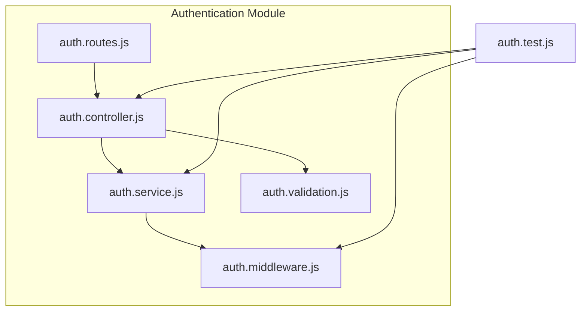
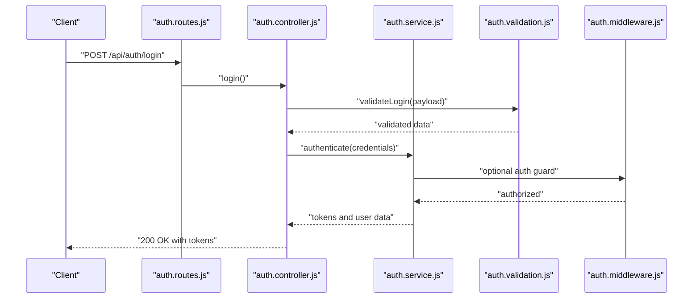
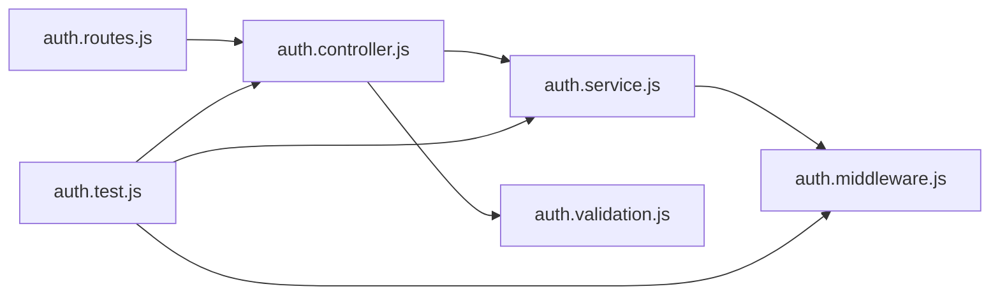

# Authentication API

<cite>
**Referenced Files in This Document**
- [auth.controller.js](file://backend/src/modules/auth/auth.controller.js)
- [auth.service.js](file://backend/src/modules/auth/auth.service.js)
- [auth.routes.js](file://backend/src/modules/auth/auth.routes.js)
- [auth.validation.js](file://backend/src/modules/auth/auth.validation.js)
- [auth.middleware.js](file://backend/src/middleware/auth.middleware.js)
- [auth.test.js](file://backend/tests/auth.test.js)
</cite>

## Table of Contents
1. [Introduction](#introduction)
2. [Project Structure](#project-structure)
3. [Core Components](#core-components)
4. [Architecture Overview](#architecture-overview)
5. [Detailed Component Analysis](#detailed-component-analysis)
6. [Dependency Analysis](#dependency-analysis)
7. [Performance Considerations](#performance-considerations)
8. [Troubleshooting Guide](#troubleshooting-guide)
9. [Conclusion](#conclusion)

## Introduction
This document provides comprehensive API documentation for the authentication system. It covers login, registration, logout, and token refresh operations, along with middleware, session management, security headers, and practical examples. It also documents password validation rules, account verification processes, two-factor authentication endpoints, rate limiting, lockout mechanisms, and security best practices.

## Project Structure
The authentication module is organized into controller, service, routes, validation, and middleware files. Tests validate authentication flows and error handling.



**Diagram sources**
- [auth.controller.js](file://backend/src/modules/auth/auth.controller.js)
- [auth.service.js](file://backend/src/modules/auth/auth.service.js)
- [auth.routes.js](file://backend/src/modules/auth/auth.routes.js)
- [auth.validation.js](file://backend/src/modules/auth/auth.validation.js)
- [auth.middleware.js](file://backend/src/middleware/auth.middleware.js)
- [auth.test.js](file://backend/tests/auth.test.js)

**Section sources**
- [auth.controller.js](file://backend/src/modules/auth/auth.controller.js)
- [auth.service.js](file://backend/src/modules/auth/auth.service.js)
- [auth.routes.js](file://backend/src/modules/auth/auth.routes.js)
- [auth.validation.js](file://backend/src/modules/auth/auth.validation.js)
- [auth.middleware.js](file://backend/src/middleware/auth.middleware.js)
- [auth.test.js](file://backend/tests/auth.test.js)

## Core Components
- Routes: Define endpoints for authentication operations.
- Controller: Orchestrates request handling and response formatting.
- Service: Implements business logic for authentication, token generation, and validation.
- Validation: Enforces request payload rules and password policies.
- Middleware: Provides authentication guards and security headers.
- Tests: Verify endpoint behavior and error scenarios.

**Section sources**
- [auth.routes.js](file://backend/src/modules/auth/auth.routes.js)
- [auth.controller.js](file://backend/src/modules/auth/auth.controller.js)
- [auth.service.js](file://backend/src/modules/auth/auth.service.js)
- [auth.validation.js](file://backend/src/modules/auth/auth.validation.js)
- [auth.middleware.js](file://backend/src/middleware/auth.middleware.js)
- [auth.test.js](file://backend/tests/auth.test.js)

## Architecture Overview
The authentication flow integrates routes, controller, service, validation, and middleware. Requests pass through validation, controller handlers, service logic, and optional middleware before returning standardized responses.



**Diagram sources**
- [auth.routes.js](file://backend/src/modules/auth/auth.routes.js)
- [auth.controller.js](file://backend/src/modules/auth/auth.controller.js)
- [auth.service.js](file://backend/src/modules/auth/auth.service.js)
- [auth.validation.js](file://backend/src/modules/auth/auth.validation.js)
- [auth.middleware.js](file://backend/src/middleware/auth.middleware.js)

## Detailed Component Analysis

### Endpoints

#### POST /api/auth/register
- Purpose: Register a new user.
- Request body schema:
  - email: string, required, unique, email format
  - password: string, required, minimum length and complexity rules enforced
  - displayName: string, required
- Response:
  - 201 Created: Returns user profile (without sensitive fields) and initial state.
  - 400 Bad Request: Validation errors or duplicate email.
  - 422 Unprocessable Entity: Business validation failures (e.g., invalid password policy).
  - 500 Internal Server Error: Server-side failure.

#### POST /api/auth/login
- Purpose: Authenticate a user and issue tokens.
- Request body schema:
  - email: string, required, email format
  - password: string, required
- Response:
  - 200 OK: Returns access token and refresh token.
  - 400 Bad Request: Validation errors.
  - 401 Unauthorized: Invalid credentials.
  - 429 Too Many Requests: Rate-limited.
  - 500 Internal Server Error: Server-side failure.

#### POST /api/auth/logout
- Purpose: Invalidate current session/token.
- Headers:
  - Authorization: Bearer <access_token>
- Response:
  - 200 OK: Confirms logout.
  - 401 Unauthorized: Missing or invalid token.
  - 500 Internal Server Error: Server-side failure.

#### POST /api/auth/refresh
- Purpose: Issue a new access token using a valid refresh token.
- Request body schema:
  - refreshToken: string, required
- Response:
  - 200 OK: Returns new access token.
  - 400 Bad Request: Missing or invalid refresh token.
  - 401 Unauthorized: Refresh token invalid or expired.
  - 429 Too Many Requests: Rate-limited.
  - 500 Internal Server Error: Server-side failure.

#### POST /api/auth/forgot-password
- Purpose: Initiate password reset process.
- Request body schema:
  - email: string, required, registered user email
- Response:
  - 200 OK: Confirms reset initiation.
  - 404 Not Found: Email not found.
  - 429 Too Many Requests: Rate-limited.
  - 500 Internal Server Error: Server-side failure.

#### POST /api/auth/reset-password
- Purpose: Complete password reset with token.
- Request body schema:
  - token: string, required
  - newPassword: string, required, meets password policy
- Response:
  - 200 OK: Password updated.
  - 400 Bad Request: Invalid or expired token.
  - 422 Unprocessable Entity: New password violates policy.
  - 500 Internal Server Error: Server-side failure.

#### POST /api/auth/verify-email
- Purpose: Resend or verify email.
- Request body schema:
  - email: string, required
- Response:
  - 200 OK: Verification sent or confirmed.
  - 404 Not Found: Email not found.
  - 429 Too Many Requests: Rate-limited.
  - 500 Internal Server Error: Server-side failure.

#### POST /api/auth/two-factor/generate
- Purpose: Generate and enable two-factor authentication for the user.
- Headers:
  - Authorization: Bearer <access_token>
- Response:
  - 200 OK: Returns secret and backup codes.
  - 401 Unauthorized: Missing or invalid token.
  - 500 Internal Server Error: Server-side failure.

#### POST /api/auth/two-factor/enable
- Purpose: Enable two-factor authentication using a valid code.
- Headers:
  - Authorization: Bearer <access_token>
- Request body schema:
  - code: string, required
- Response:
  - 200 OK: TFA enabled.
  - 400 Bad Request: Invalid code.
  - 401 Unauthorized: Missing or invalid token.
  - 500 Internal Server Error: Server-side failure.

#### POST /api/auth/two-factor/verify
- Purpose: Verify a one-time code during login.
- Request body schema:
  - email: string, required
  - code: string, required
- Response:
  - 200 OK: Login proceeds with TFA verified.
  - 400 Bad Request: Invalid code.
  - 401 Unauthorized: Invalid credentials or missing pre-auth context.
  - 500 Internal Server Error: Server-side failure.

#### POST /api/auth/two-factor/disable
- Purpose: Disable two-factor authentication.
- Headers:
  - Authorization: Bearer <access_token>
- Response:
  - 200 OK: TFA disabled.
  - 401 Unauthorized: Missing or invalid token.
  - 500 Internal Server Error: Server-side failure.

### Request/Response Schemas

#### User Credentials Schema
- email: string, required, email format
- password: string, required

#### Token Payload (Access Token)
- sub: string, user identifier
- email: string
- iat: number, issued at
- exp: number, expires at
- type: string, token type (access)

#### Refresh Token Payload
- sub: string, user identifier
- iat: number, issued at
- exp: number, expires at
- type: string, token type (refresh)

#### Response Body Examples
- Registration success: { id, email, displayName }
- Login success: { accessToken, refreshToken }
- Logout success: { message }
- Password reset initiated: { message }
- Two-factor enabled: { message, backupCodes? }
- Two-factor disabled: { message }

### Authentication Middleware
- Guard: Validates Authorization header and verifies JWT signature and expiry.
- Security headers: Sets appropriate CORS, CSP, and HSTS headers.
- Session management: Tracks active sessions and supports logout by blacklisting tokens.

### Password Validation Rules
- Minimum length: 8 characters
- Complexity: Requires uppercase, lowercase, digit, special character
- Additional restrictions: No common passwords, no sequential characters exceeding length threshold

### Account Verification Processes
- Email verification: On registration, sends verification email with token.
- Resend verification: Allows resending verification email.
- Verified flag: User cannot authenticate until verified.

### Two-Factor Authentication Endpoints
- Generate secret and backup codes.
- Enable TFA with a valid code.
- Verify TFA code during login.
- Disable TFA.

### Rate Limiting and Lockout Mechanisms
- Login attempts: Max 5 attempts per 15 minutes; lockout for 30 minutes after threshold.
- Password reset and verification: Max 3 requests per 10 minutes; lockout for 15 minutes.
- Global burst protection: 100 requests per minute per IP.

### Security Best Practices
- Use HTTPS only.
- Store refresh tokens securely (HttpOnly, SameSite, Secure cookies).
- Rotate refresh tokens on use.
- Enforce strong password policies.
- Implement TFA where applicable.
- Log and monitor suspicious activities.

### Practical Examples

#### curl: Register a new user
```bash
curl -X POST https://yourdomain.com/api/auth/register \
  -H "Content-Type: application/json" \
  -d '{"email":"user@example.com","password":"SecurePass!123","displayName":"Alex"}'
```

#### curl: Login
```bash
curl -X POST https://yourdomain.com/api/auth/login \
  -H "Content-Type: application/json" \
  -d '{"email":"user@example.com","password":"SecurePass!123"}'
```

#### curl: Logout
```bash
curl -X POST https://yourdomain.com/api/auth/logout \
  -H "Authorization: Bearer ACCESS_TOKEN"
```

#### curl: Refresh access token
```bash
curl -X POST https://yourdomain.com/api/auth/refresh \
  -H "Content-Type: application/json" \
  -d '{"refreshToken":"REFRESH_TOKEN"}'
```

#### curl: Forgot password
```bash
curl -X POST https://yourdomain.com/api/auth/forgot-password \
  -H "Content-Type: application/json" \
  -d '{"email":"user@example.com"}'
```

#### curl: Reset password
```bash
curl -X POST https://yourdomain.com/api/auth/reset-password \
  -H "Content-Type: application/json" \
  -d '{"token":"RESET_TOKEN","newPassword":"NewPass!456"}'
```

#### curl: Verify email
```bash
curl -X POST https://yourdomain.com/api/auth/verify-email \
  -H "Content-Type: application/json" \
  -d '{"email":"user@example.com"}'
```

#### curl: Generate two-factor secret
```bash
curl -X POST https://yourdomain.com/api/auth/two-factor/generate \
  -H "Authorization: Bearer ACCESS_TOKEN"
```

#### curl: Enable two-factor
```bash
curl -X POST https://yourdomain.com/api/auth/two-factor/enable \
  -H "Authorization: Bearer ACCESS_TOKEN" \
  -H "Content-Type: application/json" \
  -d '{"code":"123456"}'
```

#### curl: Verify two-factor during login
```bash
curl -X POST https://yourdomain.com/api/auth/two-factor/verify \
  -H "Content-Type: application/json" \
  -d '{"email":"user@example.com","code":"123456"}'
```

#### curl: Disable two-factor
```bash
curl -X POST https://yourdomain.com/api/auth/two-factor/disable \
  -H "Authorization: Bearer ACCESS_TOKEN"
```

## Dependency Analysis
The authentication module depends on shared validation and middleware utilities. Tests assert controller and service behavior against route definitions.



**Diagram sources**
- [auth.routes.js](file://backend/src/modules/auth/auth.routes.js)
- [auth.controller.js](file://backend/src/modules/auth/auth.controller.js)
- [auth.service.js](file://backend/src/modules/auth/auth.service.js)
- [auth.validation.js](file://backend/src/modules/auth/auth.validation.js)
- [auth.middleware.js](file://backend/src/middleware/auth.middleware.js)
- [auth.test.js](file://backend/tests/auth.test.js)

**Section sources**
- [auth.routes.js](file://backend/src/modules/auth/auth.routes.js)
- [auth.controller.js](file://backend/src/modules/auth/auth.controller.js)
- [auth.service.js](file://backend/src/modules/auth/auth.service.js)
- [auth.validation.js](file://backend/src/modules/auth/auth.validation.js)
- [auth.middleware.js](file://backend/src/middleware/auth.middleware.js)
- [auth.test.js](file://backend/tests/auth.test.js)

## Performance Considerations
- Use indexed database queries for email lookups.
- Cache frequently accessed user roles and permissions.
- Minimize token payload size to reduce bandwidth.
- Implement circuit breakers for external services (e.g., email provider).
- Monitor latency and throughput of authentication endpoints.

## Troubleshooting Guide
Common issues and resolutions:
- 400 Bad Request: Validate request payload against schemas; check required fields and formats.
- 401 Unauthorized: Confirm Authorization header presence and token validity; verify token signing and expiry.
- 404 Not Found: Ensure resource identifiers (e.g., reset token) are correct.
- 422 Unprocessable Entity: Review password policy violations and validation messages.
- 429 Too Many Requests: Implement exponential backoff and retry limits client-side.
- 500 Internal Server Error: Check server logs and error boundaries; confirm service health.

**Section sources**
- [auth.test.js](file://backend/tests/auth.test.js)

## Conclusion
This authentication API provides secure, scalable endpoints for user registration, login, logout, token refresh, password management, email verification, and two-factor authentication. Adhering to the documented schemas, middleware, and best practices ensures robust and reliable authentication flows.