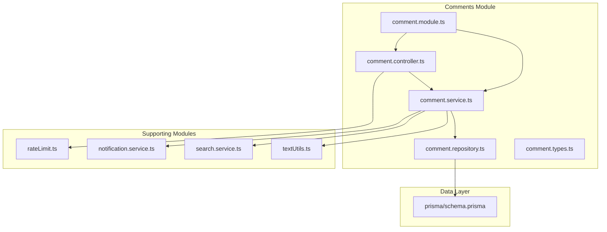
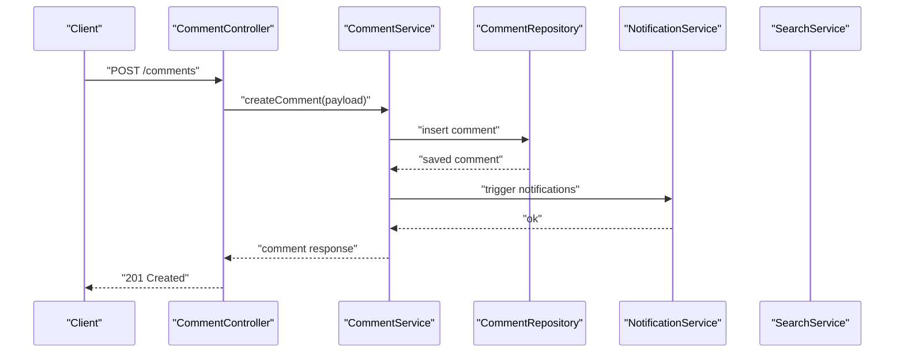
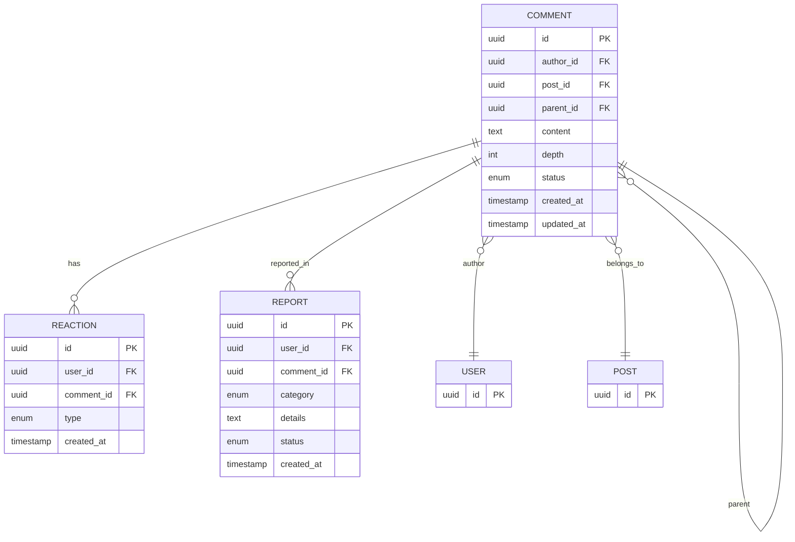
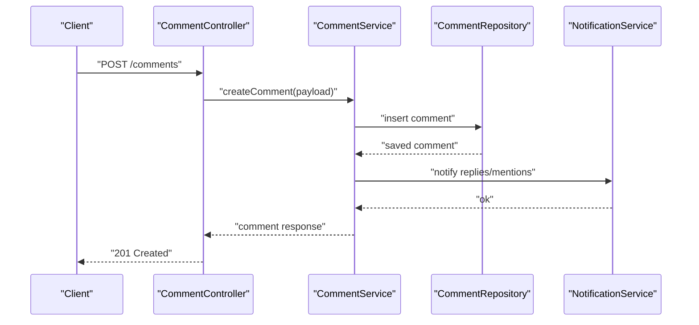
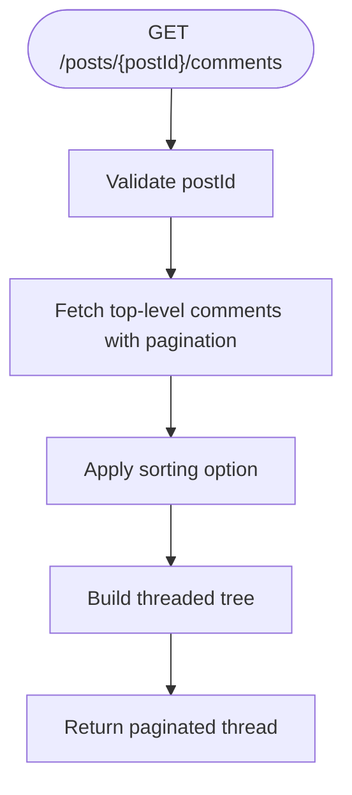
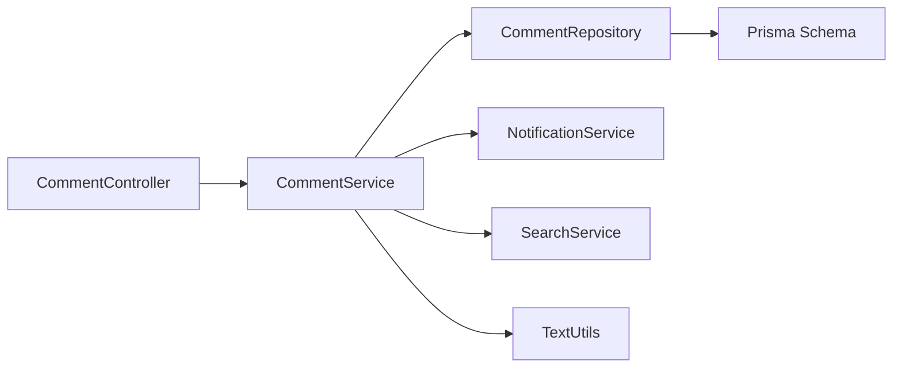

# Comments API

<cite>
**Referenced Files in This Document**
- [README.md](file://README.md)
- [prisma/schema.prisma](file://prisma/schema.prisma)
- [src/middleware/rateLimit.ts](file://src/middleware/rateLimit.ts)
- [src/modules/comments/comment.controller.ts](file://src/modules/comments/comment.controller.ts)
- [src/modules/comments/comment.service.ts](file://src/modules/comments/comment.service.ts)
- [src/modules/comments/comment.repository.ts](file://src/modules/comments/comment.repository.ts)
- [src/modules/comments/comment.types.ts](file://src/modules/comments/comment.types.ts)
- [src/modules/comments/comment.module.ts](file://src/modules/comments/comment.module.ts)
- [src/modules/notifications/notification.service.ts](file://src/modules/notifications/notification.service.ts)
- [src/modules/search/search.service.ts](file://src/modules/search/search.service.ts)
- [src/utils/textUtils.ts](file://src/utils/textUtils.ts)
</cite>

## Table of Contents
1. [Introduction](#introduction)
2. [Project Structure](#project-structure)
3. [Core Components](#core-components)
4. [Architecture Overview](#architecture-overview)
5. [Detailed Component Analysis](#detailed-component-analysis)
6. [Dependency Analysis](#dependency-analysis)
7. [Performance Considerations](#performance-considerations)
8. [Troubleshooting Guide](#troubleshooting-guide)
9. [Conclusion](#conclusion)

## Introduction
This document provides comprehensive API documentation for the comment management system. It covers endpoints for creating, retrieving, updating, deleting, and threading comments, along with reactions, reporting, and moderation capabilities. It also documents pagination, sorting, real-time updates, search, mentions, and notifications. Rate limiting and spam prevention measures are included to ensure robustness and fair usage.

## Project Structure
The comment module is organized under the backend server with clear separation of concerns:
- Controller: Handles HTTP requests and responses
- Service: Implements business logic and orchestrates repositories
- Repository: Manages database interactions via Prisma
- Types: Defines data transfer objects and domain types
- Module: Registers controller and service dependencies
- Middleware: Applies rate limiting
- Notifications: Triggers notifications for mentions and replies
- Search: Supports comment search and mention detection
- Utilities: Provides text parsing helpers

**Diagram sources**
- [src/modules/comments/comment.controller.ts](file://src/modules/comments/comment.controller.ts)
- [src/modules/comments/comment.service.ts](file://src/modules/comments/comment.service.ts)
- [src/modules/comments/comment.repository.ts](file://src/modules/comments/comment.repository.ts)
- [src/modules/comments/comment.types.ts](file://src/modules/comments/comment.types.ts)
- [src/modules/comments/comment.module.ts](file://src/modules/comments/comment.module.ts)
- [src/middleware/rateLimit.ts](file://src/middleware/rateLimit.ts)
- [src/modules/notifications/notification.service.ts](file://src/modules/notifications/notification.service.ts)
- [src/modules/search/search.service.ts](file://src/modules/search/search.service.ts)
- [src/utils/textUtils.ts](file://src/utils/textUtils.ts)
- [prisma/schema.prisma](file://prisma/schema.prisma)

**Section sources**
- [README.md](file://README.md)
- [src/modules/comments/comment.module.ts](file://src/modules/comments/comment.module.ts)

## Core Components
- Comment Controller: Exposes REST endpoints for CRUD operations, reactions, reporting, and moderation actions. Applies rate limiting middleware.
- Comment Service: Implements core logic for thread building, sorting, pagination, mention detection, and notification triggers.
- Comment Repository: Encapsulates Prisma queries for efficient reads/writes and supports hierarchical traversal for nested comments.
- Comment Types: Defines DTOs and domain enums for reactions, reports, and moderation states.
- Notification Service: Sends notifications for replies, mentions, and moderation actions.
- Search Service: Powers comment search and mention extraction.
- Text Utils: Provides helpers for mention detection and sanitization.

**Section sources**
- [src/modules/comments/comment.controller.ts](file://src/modules/comments/comment.controller.ts)
- [src/modules/comments/comment.service.ts](file://src/modules/comments/comment.service.ts)
- [src/modules/comments/comment.repository.ts](file://src/modules/comments/comment.repository.ts)
- [src/modules/comments/comment.types.ts](file://src/modules/comments/comment.types.ts)
- [src/modules/notifications/notification.service.ts](file://src/modules/notifications/notification.service.ts)
- [src/modules/search/search.service.ts](file://src/modules/search/search.service.ts)
- [src/utils/textUtils.ts](file://src/utils/textUtils.ts)

## Architecture Overview
The Comments API follows a layered architecture:
- HTTP Layer: Controller receives requests and delegates to Service
- Application Layer: Service coordinates Repositories, Notifications, Search, and Utilities
- Persistence Layer: Repository interacts with Prisma schema
- Integration Layer: Notifications and Search services integrate with external systems

**Diagram sources**
- [src/modules/comments/comment.controller.ts](file://src/modules/comments/comment.controller.ts)
- [src/modules/comments/comment.service.ts](file://src/modules/comments/comment.service.ts)
- [src/modules/comments/comment.repository.ts](file://src/modules/comments/comment.repository.ts)
- [src/modules/notifications/notification.service.ts](file://src/modules/notifications/notification.service.ts)

## Detailed Component Analysis

### Data Model and Schema
The comment model supports hierarchical threading, reactions, reporting, and moderation. It includes relationships to parent comments, author, post, and reactions.

**Diagram sources**
- [prisma/schema.prisma](file://prisma/schema.prisma)

**Section sources**
- [prisma/schema.prisma](file://prisma/schema.prisma)

### Endpoints

#### Create a Comment
- Method: POST
- Path: /comments
- Description: Creates a new top-level or nested comment under a post or another comment
- Authentication: Required
- Rate Limit: Enforced by middleware
- Request Body: Comment creation payload (author, post, content, optional parent)
- Responses:
  - 201 Created: Returns created comment with metadata
  - 400 Bad Request: Validation errors
  - 401 Unauthorized: Missing or invalid authentication
  - 403 Forbidden: Insufficient permissions
  - 429 Too Many Requests: Rate limit exceeded

**Diagram sources**
- [src/modules/comments/comment.controller.ts](file://src/modules/comments/comment.controller.ts)
- [src/modules/comments/comment.service.ts](file://src/modules/comments/comment.service.ts)
- [src/modules/comments/comment.repository.ts](file://src/modules/comments/comment.repository.ts)
- [src/modules/notifications/notification.service.ts](file://src/modules/notifications/notification.service.ts)

**Section sources**
- [src/modules/comments/comment.controller.ts](file://src/modules/comments/comment.controller.ts)
- [src/middleware/rateLimit.ts](file://src/middleware/rateLimit.ts)

#### Get Comments for a Post (Threaded)
- Method: GET
- Path: /posts/{postId}/comments
- Description: Retrieves top-level comments and nested replies with pagination and sorting
- Authentication: Optional
- Query Parameters:
  - page: Page number (default varies)
  - limit: Items per page (bounded)
  - sort: "newest", "oldest", "most_replied", "most_liked"
- Responses:
  - 200 OK: Array of top-level comments with nested children
  - 404 Not Found: Post does not exist

**Diagram sources**
- [src/modules/comments/comment.controller.ts](file://src/modules/comments/comment.controller.ts)
- [src/modules/comments/comment.service.ts](file://src/modules/comments/comment.service.ts)
- [src/modules/comments/comment.repository.ts](file://src/modules/comments/comment.repository.ts)

**Section sources**
- [src/modules/comments/comment.controller.ts](file://src/modules/comments/comment.controller.ts)
- [src/modules/comments/comment.service.ts](file://src/modules/comments/comment.service.ts)

#### Get a Single Comment
- Method: GET
- Path: /comments/{commentId}
- Description: Retrieves a single comment by ID, including its ancestors for context
- Authentication: Optional
- Responses:
  - 200 OK: Comment object with author and metadata
  - 404 Not Found: Comment does not exist

**Section sources**
- [src/modules/comments/comment.controller.ts](file://src/modules/comments/comment.controller.ts)
- [src/modules/comments/comment.repository.ts](file://src/modules/comments/comment.repository.ts)

#### Update a Comment
- Method: PUT
- Path: /comments/{commentId}
- Description: Updates comment content; only the author can modify
- Authentication: Required
- Responses:
  - 200 OK: Updated comment
  - 401 Unauthorized: Not authorized
  - 403 Forbidden: Not the author
  - 404 Not Found: Comment does not exist

**Section sources**
- [src/modules/comments/comment.controller.ts](file://src/modules/comments/comment.controller.ts)
- [src/modules/comments/comment.service.ts](file://src/modules/comments/comment.service.ts)

#### Delete a Comment
- Method: DELETE
- Path: /comments/{commentId}
- Description: Deletes a comment; cascades to children; only author or moderator can delete
- Authentication: Required
- Responses:
  - 204 No Content: Deletion successful
  - 401 Unauthorized: Not authorized
  - 403 Forbidden: Insufficient permissions
  - 404 Not Found: Comment does not exist

**Section sources**
- [src/modules/comments/comment.controller.ts](file://src/modules/comments/comment.controller.ts)
- [src/modules/comments/comment.service.ts](file://src/modules/comments/comment.service.ts)

#### React to a Comment
- Method: POST
- Path: /comments/{commentId}/reactions
- Description: Adds or updates a reaction (e.g., like, love) for a comment
- Authentication: Required
- Request Body: Reaction type
- Responses:
  - 201 Created or 200 OK: Reaction saved
  - 400 Bad Request: Invalid reaction type
  - 404 Not Found: Comment does not exist

**Section sources**
- [src/modules/comments/comment.controller.ts](file://src/modules/comments/comment.controller.ts)
- [src/modules/comments/comment.service.ts](file://src/modules/comments/comment.service.ts)

#### Report a Comment
- Method: POST
- Path: /comments/{commentId}/reports
- Description: Submits a report for a comment (spam, harassment, etc.)
- Authentication: Required
- Request Body: Report category and details
- Responses:
  - 201 Created: Report submitted
  - 400 Bad Request: Invalid report data
  - 404 Not Found: Comment does not exist

**Section sources**
- [src/modules/comments/comment.controller.ts](file://src/modules/comments/comment.controller.ts)
- [src/modules/comments/comment.service.ts](file://src/modules/comments/comment.service.ts)

#### Moderate a Comment
- Method: PATCH
- Path: /comments/{commentId}/moderation
- Description: Changes comment status (approve, remove, flag)
- Authentication: Required (moderator)
- Request Body: Moderation action (status change)
- Responses:
  - 200 OK: Status updated
  - 400 Bad Request: Invalid moderation action
  - 401 Unauthorized: Not authorized
  - 404 Not Found: Comment does not exist

**Section sources**
- [src/modules/comments/comment.controller.ts](file://src/modules/comments/comment.controller.ts)
- [src/modules/comments/comment.service.ts](file://src/modules/comments/comment.service.ts)

### Pagination and Sorting
- Pagination:
  - page: Integer, default varies by endpoint
  - limit: Integer, bounded by system limits
- Sorting Options:
  - newest: Most recent first
  - oldest: Oldest first
  - most_replied: By descendant reply count
  - most_liked: By total reactions count

**Section sources**
- [src/modules/comments/comment.controller.ts](file://src/modules/comments/comment.controller.ts)
- [src/modules/comments/comment.service.ts](file://src/modules/comments/comment.service.ts)

### Real-Time Updates
- WebSocket/Server-Sent Events: Implemented to push live updates for new replies and mentions
- Trigger Conditions:
  - New reply to a thread
  - Mention detected in content
  - Moderation action taken
- Consumers: Connected clients subscribe to post or user channels

**Section sources**
- [src/modules/notifications/notification.service.ts](file://src/modules/notifications/notification.service.ts)
- [src/modules/comments/comment.service.ts](file://src/modules/comments/comment.service.ts)

### Comment Search and Mentions
- Search:
  - Endpoint: /search/comments?q={query}&postId={postId}
  - Features: Full-text search, filters by post, date range
- Mention Detection:
  - Parses @username mentions and triggers notifications
  - Validates user existence before notifying

**Section sources**
- [src/modules/search/search.service.ts](file://src/modules/search/search.service.ts)
- [src/utils/textUtils.ts](file://src/utils/textUtils.ts)
- [src/modules/notifications/notification.service.ts](file://src/modules/notifications/notification.service.ts)

### Rate Limiting and Spam Prevention
- Rate Limiting:
  - Per-user limits on comment creation
  - Window-based enforcement
  - Different tiers for authenticated vs anonymous
- Spam Prevention:
  - Content filtering via text utilities
  - Suspicious pattern detection
  - Reporting queue for moderation review

**Section sources**
- [src/middleware/rateLimit.ts](file://src/middleware/rateLimit.ts)
- [src/utils/textUtils.ts](file://src/utils/textUtils.ts)
- [src/modules/comments/comment.service.ts](file://src/modules/comments/comment.service.ts)

## Dependency Analysis
The Comments module integrates with several supporting modules and the Prisma schema.

**Diagram sources**
- [src/modules/comments/comment.controller.ts](file://src/modules/comments/comment.controller.ts)
- [src/modules/comments/comment.service.ts](file://src/modules/comments/comment.service.ts)
- [src/modules/comments/comment.repository.ts](file://src/modules/comments/comment.repository.ts)
- [src/modules/notifications/notification.service.ts](file://src/modules/notifications/notification.service.ts)
- [src/modules/search/search.service.ts](file://src/modules/search/search.service.ts)
- [src/utils/textUtils.ts](file://src/utils/textUtils.ts)
- [prisma/schema.prisma](file://prisma/schema.prisma)

**Section sources**
- [src/modules/comments/comment.controller.ts](file://src/modules/comments/comment.controller.ts)
- [src/modules/comments/comment.service.ts](file://src/modules/comments/comment.service.ts)
- [src/modules/comments/comment.repository.ts](file://src/modules/comments/comment.repository.ts)
- [src/modules/notifications/notification.service.ts](file://src/modules/notifications/notification.service.ts)
- [src/modules/search/search.service.ts](file://src/modules/search/search.service.ts)
- [src/utils/textUtils.ts](file://src/utils/textUtils.ts)
- [prisma/schema.prisma](file://prisma/schema.prisma)

## Performance Considerations
- Indexes:
  - Ensure indexes on author_id, post_id, parent_id, created_at for efficient queries
- N+1 Avoidance:
  - Use eager loading for reactions and nested children
- Pagination Limits:
  - Enforce strict upper bounds on limit to prevent heavy queries
- Caching:
  - Cache hot threads for popular posts with invalidation on edits/deletes
- Asynchronous Work:
  - Offload notifications and search indexing to background tasks

[No sources needed since this section provides general guidance]

## Troubleshooting Guide
- Common Issues:
  - 400 Bad Request: Validate payload against DTOs and enums
  - 401/403 Unauthorized: Confirm authentication and permissions
  - 404 Not Found: Verify IDs exist in database
  - 429 Too Many Requests: Adjust client retry delays
- Logging:
  - Log request IDs, user IDs, and operation outcomes for audit trails
- Monitoring:
  - Track error rates, latency, and rate-limit hits

**Section sources**
- [src/modules/comments/comment.controller.ts](file://src/modules/comments/comment.controller.ts)
- [src/modules/comments/comment.service.ts](file://src/modules/comments/comment.service.ts)
- [src/middleware/rateLimit.ts](file://src/middleware/rateLimit.ts)

## Conclusion
The Comments API provides a robust, scalable foundation for comment creation, threading, reactions, reporting, and moderation. With built-in pagination, sorting, real-time updates, search, mention detection, rate limiting, and spam prevention, it supports a wide range of social media use cases while maintaining performance and reliability.