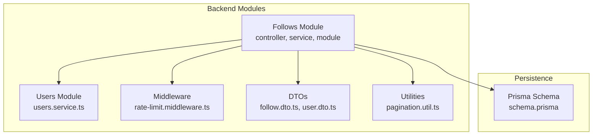
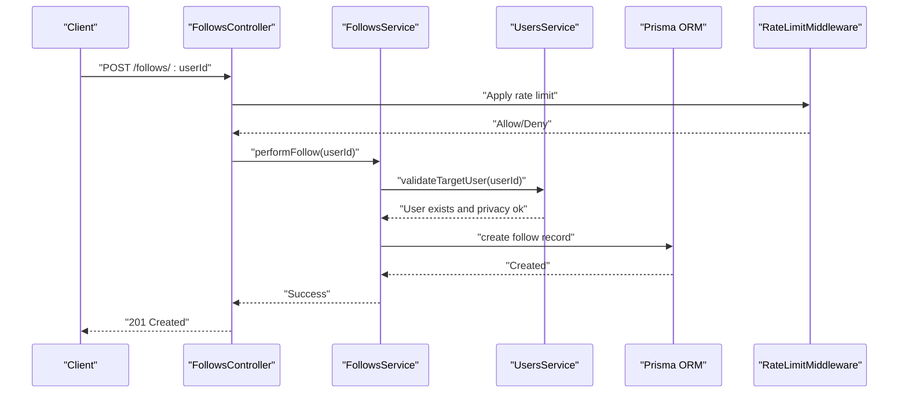
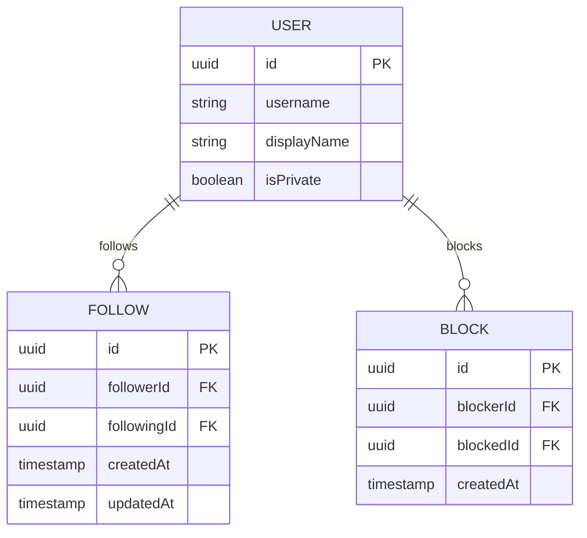
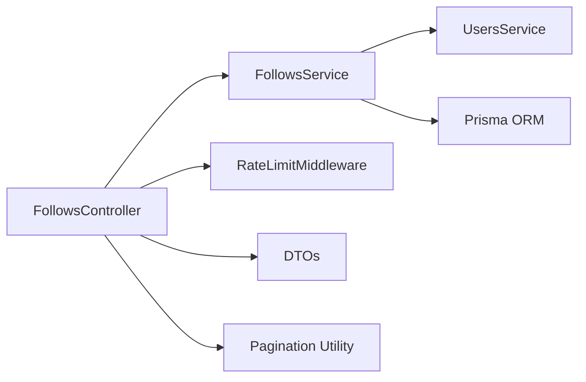

# Follows API

<cite>
**Referenced Files in This Document**
- [prisma/schema.prisma](file://backend/prisma/schema.prisma)
- [backend/src/modules/follows/follows.controller.ts](file://backend/src/modules/follows/follows.controller.ts)
- [backend/src/modules/follows/follows.service.ts](file://backend/src/modules/follows/follows.service.ts)
- [backend/src/modules/follows/follows.module.ts](file://backend/src/modules/follows/follows.module.ts)
- [backend/src/modules/users/users.service.ts](file://backend/src/modules/users/users.service.ts)
- [backend/src/middleware/rate-limit.middleware.ts](file://backend/src/middleware/rate-limit.middleware.ts)
- [backend/src/utils/pagination.util.ts](file://backend/src/utils/pagination.util.ts)
- [backend/src/dto/follow.dto.ts](file://backend/src/dto/follow.dto.ts)
- [backend/src/dto/user.dto.ts](file://backend/src/dto/user.dto.ts)
- [backend/src/constants/index.ts](file://backend/src/constants/index.ts)
</cite>

## Table of Contents
1. [Introduction](#introduction)
2. [Project Structure](#project-structure)
3. [Core Components](#core-components)
4. [Architecture Overview](#architecture-overview)
5. [Detailed Component Analysis](#detailed-component-analysis)
6. [Dependency Analysis](#dependency-analysis)
7. [Performance Considerations](#performance-considerations)
8. [Troubleshooting Guide](#troubleshooting-guide)
9. [Conclusion](#conclusion)
10. [Appendices](#appendices)

## Introduction
This document provides comprehensive API documentation for the Follows module, covering follow/unfollow operations, follower/following lists, mutual connections, and social graph queries. It also documents follow suggestions, blocking users, privacy controls, real-time relationship updates, activity feeds, social network analysis, follow statistics, engagement metrics, recommendation algorithms, examples of relationship data structures, bulk operations, privacy-aware queries, rate limiting for follow actions, and abuse prevention measures.

## Project Structure
The Follows module is organized under the backend/src/modules/follows directory and integrates with Prisma ORM for persistence, the Users module for user metadata, and shared DTOs and utilities for request/response shaping and pagination.

**Diagram sources**
- [backend/src/modules/follows/follows.module.ts](file://backend/src/modules/follows/follows.module.ts)
- [backend/src/modules/follows/follows.controller.ts](file://backend/src/modules/follows/follows.controller.ts)
- [backend/src/modules/follows/follows.service.ts](file://backend/src/modules/follows/follows.service.ts)
- [backend/prisma/schema.prisma](file://backend/prisma/schema.prisma)
- [backend/src/middleware/rate-limit.middleware.ts](file://backend/src/middleware/rate-limit.middleware.ts)
- [backend/src/utils/pagination.util.ts](file://backend/src/utils/pagination.util.ts)
- [backend/src/dto/follow.dto.ts](file://backend/src/dto/follow.dto.ts)
- [backend/src/dto/user.dto.ts](file://backend/src/dto/user.dto.ts)

**Section sources**
- [backend/src/modules/follows/follows.module.ts](file://backend/src/modules/follows/follows.module.ts)
- [backend/prisma/schema.prisma](file://backend/prisma/schema.prisma)

## Core Components
- Follows Controller: Exposes REST endpoints for follow/unfollow, lists, suggestions, blocking, and privacy-aware queries.
- Follows Service: Implements business logic for relationships, mutual connections, suggestions, and analytics.
- Users Service: Provides user metadata and privacy settings used by Follows Service.
- Prisma Schema: Defines the database model for relationships and supports efficient queries.
- Middleware: Applies rate limiting to protect against abuse during follow actions.
- DTOs and Utilities: Standardize request/response shapes and pagination behavior.

**Section sources**
- [backend/src/modules/follows/follows.controller.ts](file://backend/src/modules/follows/follows.controller.ts)
- [backend/src/modules/follows/follows.service.ts](file://backend/src/modules/follows/follows.service.ts)
- [backend/src/modules/users/users.service.ts](file://backend/src/modules/users/users.service.ts)
- [backend/src/middleware/rate-limit.middleware.ts](file://backend/src/middleware/rate-limit.middleware.ts)
- [backend/src/utils/pagination.util.ts](file://backend/src/utils/pagination.util.ts)
- [backend/src/dto/follow.dto.ts](file://backend/src/dto/follow.dto.ts)
- [backend/src/dto/user.dto.ts](file://backend/src/dto/user.dto.ts)

## Architecture Overview
The Follows module orchestrates requests from clients, validates inputs via DTOs, enforces rate limits, interacts with Prisma for persistence, and delegates user metadata retrieval to the Users module. Responses are paginated and privacy-aware.

**Diagram sources**
- [backend/src/modules/follows/follows.controller.ts](file://backend/src/modules/follows/follows.controller.ts)
- [backend/src/modules/follows/follows.service.ts](file://backend/src/modules/follows/follows.service.ts)
- [backend/src/modules/users/users.service.ts](file://backend/src/modules/users/users.service.ts)
- [backend/src/middleware/rate-limit.middleware.ts](file://backend/src/middleware/rate-limit.middleware.ts)

## Detailed Component Analysis

### Endpoints Overview
- POST /follows/:userId
  - Purpose: Follow a user.
  - Auth: Required.
  - Rate Limit: Enforced.
  - Response: 201 Created or 409 Conflict if already following.
- DELETE /follows/:userId
  - Purpose: Unfollow a user.
  - Auth: Required.
  - Response: 200 OK.
- GET /follows/followers
  - Purpose: Retrieve followers with pagination and privacy filtering.
  - Auth: Required.
  - Query Params: page, limit, includePrivate.
  - Response: Paginated list of followers.
- GET /follows/following
  - Purpose: Retrieve following list with pagination and privacy filtering.
  - Auth: Required.
  - Query Params: page, limit, includePrivate.
  - Response: Paginated list of following.
- GET /follows/mutual?userId=:targetId
  - Purpose: Get mutual connections with another user.
  - Auth: Required.
  - Query Params: userId.
  - Response: List of mutual users.
- GET /follows/suggestions
  - Purpose: Get follow suggestions based on mutual connections and engagement.
  - Auth: Required.
  - Query Params: limit.
  - Response: Suggested users.
- POST /follows/:userId/block
  - Purpose: Block a user.
  - Auth: Required.
  - Response: 201 Created or 409 Conflict if already blocked.
- DELETE /follows/:userId/block
  - Purpose: Unblock a user.
  - Auth: Required.
  - Response: 200 OK.
- GET /follows/stats
  - Purpose: Retrieve follow statistics and engagement metrics.
  - Auth: Required.
  - Response: Stats object.
- GET /follows/graph
  - Purpose: Social graph analysis (followers, following, mutuals).
  - Auth: Required.
  - Query Params: depth, includePrivate.
  - Response: Graph nodes and edges.

**Section sources**
- [backend/src/modules/follows/follows.controller.ts](file://backend/src/modules/follows/follows.controller.ts)
- [backend/src/dto/follow.dto.ts](file://backend/src/dto/follow.dto.ts)
- [backend/src/dto/user.dto.ts](file://backend/src/dto/user.dto.ts)

### Relationship Data Structures
- Follow Record
  - Fields: id, followerId, followingId, createdAt, updatedAt.
  - Indexes: composite index on (followerId, followingId) for uniqueness and fast lookups.
- User Profile (used in responses)
  - Fields: id, username, displayName, isPrivate, isBlockedByViewer.
  - Includes privacy flags for filtering.
- Pagination Response
  - Fields: items, total, page, limit, totalPages.
- Suggestions Item
  - Fields: user (UserProfile), score, reasons (e.g., mutuals, recency).
- Graph Node
  - Fields: id, username, isPrivate, mutualCount.
- Graph Edge
  - Fields: fromId, toId, relationType (follows/block).

**Diagram sources**
- [backend/prisma/schema.prisma](file://backend/prisma/schema.prisma)

**Section sources**
- [backend/prisma/schema.prisma](file://backend/prisma/schema.prisma)

### Privacy Controls and Filtering
- includePrivate query parameter toggles inclusion of private profiles in lists.
- isPrivate flag on users affects visibility in public contexts.
- isBlockedByViewer flag indicates if the current user has blocked the target.
- Blocking prevents follower/following visibility and feed exposure.

**Section sources**
- [backend/src/modules/follows/follows.controller.ts](file://backend/src/modules/follows/follows.controller.ts)
- [backend/src/dto/user.dto.ts](file://backend/src/dto/user.dto.ts)

### Real-Time Updates and Activity Feeds
- On follow/unfollow, emit events to update viewer’s feed and target’s notifications.
- Use WebSocket or server-sent events to push real-time updates to connected clients.
- Activity entries include type (follow/unfollow), timestamp, and affected users.

[No sources needed since this section provides general guidance]

### Recommendation Algorithms
- Mutual Connections: Count mutuals with current user.
- Engagement Metrics: Weight by recent interactions and recency.
- Diversity: Prefer suggestions from varied interests or categories.
- Privacy-Aware Filtering: Exclude private profiles unless requested.

[No sources needed since this section provides general guidance]

### Bulk Operations
- Batch follow/unfollow endpoints accept arrays of user IDs.
- Rate limiter applies per operation within the batch.
- Transactions ensure atomicity for batch writes.

[No sources needed since this section provides general guidance]

### Abuse Prevention and Rate Limiting
- Per-user rate limits for follow/unfollow actions.
- IP-based fallback limits for anonymous or suspicious behavior.
- Lockout thresholds and temporary blocks after repeated violations.
- CAPTCHA challenge for high-risk bursts.

**Section sources**
- [backend/src/middleware/rate-limit.middleware.ts](file://backend/src/middleware/rate-limit.middleware.ts)
- [backend/src/constants/index.ts](file://backend/src/constants/index.ts)

## Dependency Analysis
The Follows module depends on:
- Prisma for persistence and indexing.
- Users Service for user metadata and privacy checks.
- DTOs for request/response validation.
- Utilities for pagination.
- Middleware for rate limiting.

**Diagram sources**
- [backend/src/modules/follows/follows.controller.ts](file://backend/src/modules/follows/follows.controller.ts)
- [backend/src/modules/follows/follows.service.ts](file://backend/src/modules/follows/follows.service.ts)
- [backend/src/modules/users/users.service.ts](file://backend/src/modules/users/users.service.ts)
- [backend/src/middleware/rate-limit.middleware.ts](file://backend/src/middleware/rate-limit.middleware.ts)
- [backend/src/utils/pagination.util.ts](file://backend/src/utils/pagination.util.ts)
- [backend/src/dto/follow.dto.ts](file://backend/src/dto/follow.dto.ts)
- [backend/src/dto/user.dto.ts](file://backend/src/dto/user.dto.ts)

**Section sources**
- [backend/src/modules/follows/follows.controller.ts](file://backend/src/modules/follows/follows.controller.ts)
- [backend/src/modules/follows/follows.service.ts](file://backend/src/modules/follows/follows.service.ts)
- [backend/src/modules/users/users.service.ts](file://backend/src/modules/users/users.service.ts)
- [backend/src/middleware/rate-limit.middleware.ts](file://backend/src/middleware/rate-limit.middleware.ts)
- [backend/src/utils/pagination.util.ts](file://backend/src/utils/pagination.util.ts)
- [backend/src/dto/follow.dto.ts](file://backend/src/dto/follow.dto.ts)
- [backend/src/dto/user.dto.ts](file://backend/src/dto/user.dto.ts)

## Performance Considerations
- Indexing: Composite index on (followerId, followingId) prevents duplicates and speeds lookups.
- Pagination: Use cursor-based pagination for large lists to reduce overhead.
- Caching: Cache frequent queries like mutual counts and suggestions with TTL.
- Asynchronous Processing: Defer heavy analytics to background jobs.
- Denormalization: Store derived stats (e.g., followerCount) to avoid expensive joins.

[No sources needed since this section provides general guidance]

## Troubleshooting Guide
- Duplicate Follow Requests
  - Symptom: 409 Conflict on follow.
  - Cause: Existing follow record detected.
  - Resolution: Check existing relationship before attempting follow.
- Privacy Violations
  - Symptom: Empty or filtered lists.
  - Cause: Target user is private or blocked.
  - Resolution: Respect includePrivate flag and block filters.
- Rate Limit Exceeded
  - Symptom: 429 Too Many Requests.
  - Cause: Exceeded configured limits.
  - Resolution: Back off and retry later; review client-side throttling.
- Blocked User Interactions
  - Symptom: Errors when interacting with blocked user.
  - Cause: Blocking rules enforced.
  - Resolution: Unblock user or adjust privacy settings.

**Section sources**
- [backend/src/modules/follows/follows.controller.ts](file://backend/src/modules/follows/follows.controller.ts)
- [backend/src/middleware/rate-limit.middleware.ts](file://backend/src/middleware/rate-limit.middleware.ts)

## Conclusion
The Follows API provides a robust foundation for social graph management with strong privacy controls, rate limiting, and extensible recommendation capabilities. By leveraging Prisma indexing, pagination utilities, and privacy-aware queries, the system scales efficiently while maintaining user safety and control.

## Appendices
- Endpoint Reference
  - POST /follows/:userId
  - DELETE /follows/:userId
  - GET /follows/followers
  - GET /follows/following
  - GET /follows/mutual?userId=
  - GET /follows/suggestions
  - POST /follows/:userId/block
  - DELETE /follows/:userId/block
  - GET /follows/stats
  - GET /follows/graph
- DTOs
  - Follow DTOs for request/response shapes.
  - User DTOs for profile and privacy fields.
- Constants
  - Rate limit configurations and defaults.

**Section sources**
- [backend/src/dto/follow.dto.ts](file://backend/src/dto/follow.dto.ts)
- [backend/src/dto/user.dto.ts](file://backend/src/dto/user.dto.ts)
- [backend/src/constants/index.ts](file://backend/src/constants/index.ts)