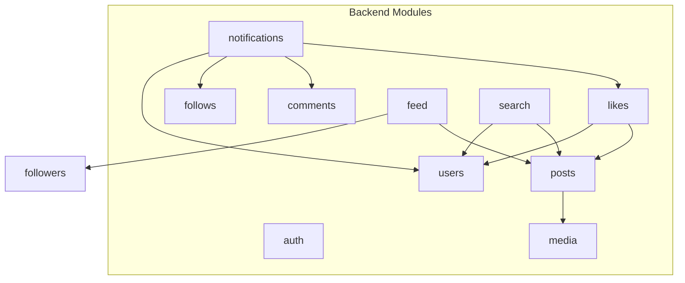
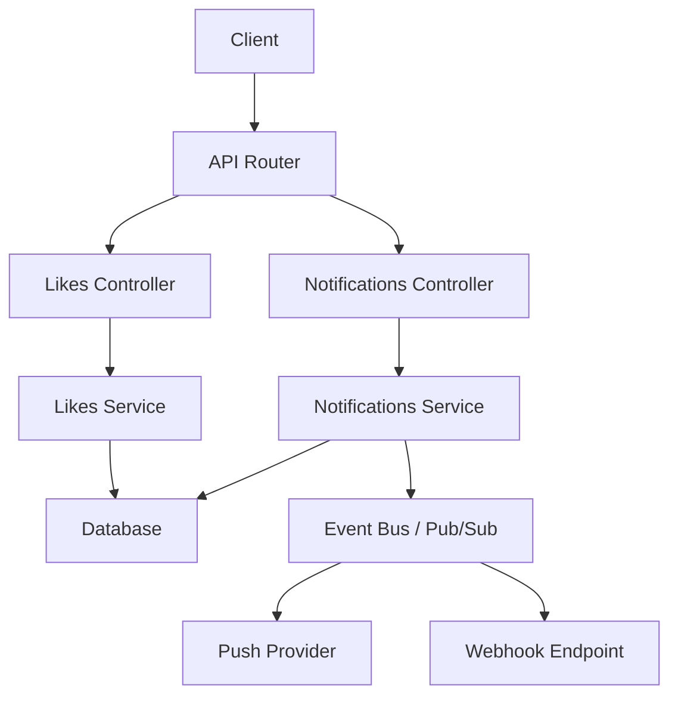
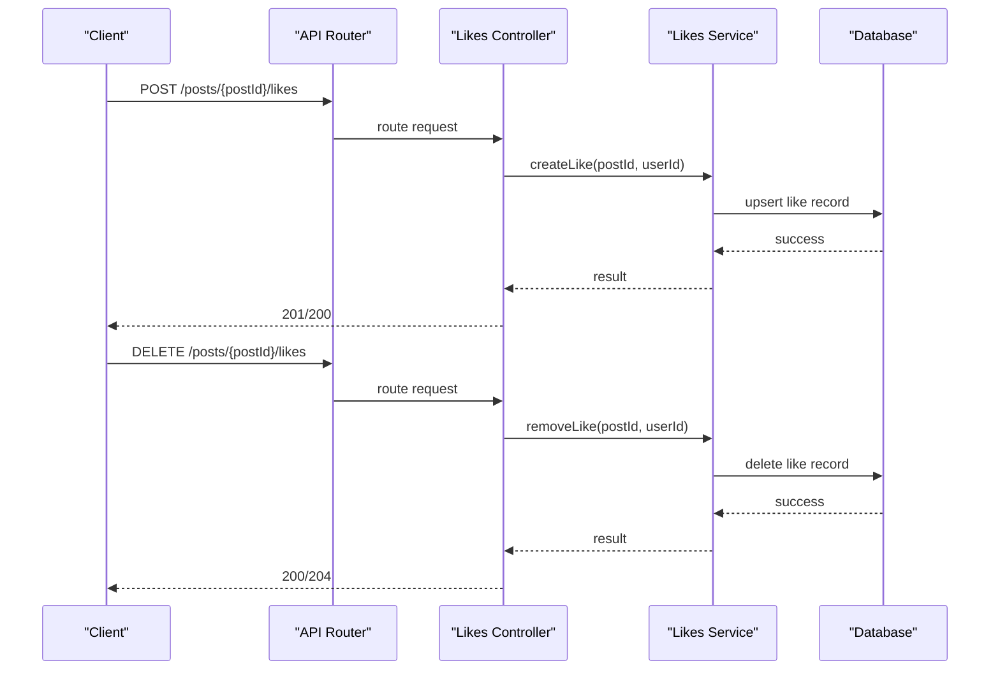
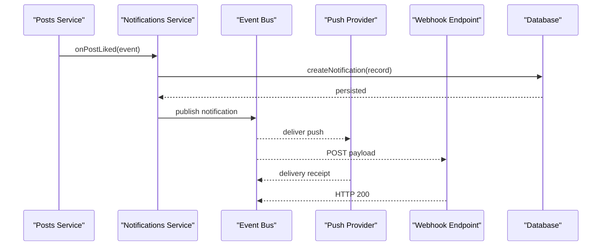
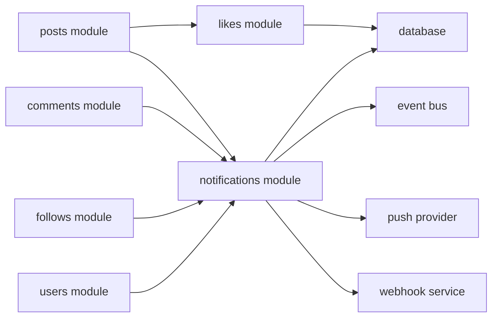

# Likes & Notifications API

<cite>
**Referenced Files in This Document**
- [README.md](file://README.md)
- [backend/.gitignore](file://backend/.gitignore)
- [frontend/test/widget_test.dart](file://frontend/test/widget_test.dart)
- [frontend/macos/Flutter/GeneratedPluginRegistrant.swift](file://frontend/macos/Flutter/GeneratedPluginRegistrant.swift)
- [frontend/android/app/src/main/res/drawable/launch_background.xml](file://frontend/android/app/src/main/res/drawable/launch_background.xml)
</cite>

## Table of Contents
1. [Introduction](#introduction)
2. [Project Structure](#project-structure)
3. [Core Components](#core-components)
4. [Architecture Overview](#architecture-overview)
5. [Detailed Component Analysis](#detailed-component-analysis)
6. [Dependency Analysis](#dependency-analysis)
7. [Performance Considerations](#performance-considerations)
8. [Troubleshooting Guide](#troubleshooting-guide)
9. [Conclusion](#conclusion)
10. [Appendices](#appendices)

## Introduction
This document provides comprehensive API documentation for the social media platform’s likes and notifications subsystems. It covers:
- Like/unlike operations
- Notification creation, retrieval, read/unread status, and history
- Notification preferences and user opt-out mechanisms
- Real-time delivery, push notification setup, and notification batching
- Notification types (likes, comments, follows, mentions)
- Filtering, webhook endpoints, and analytics
- Rate limiting for notification generation

The repository snapshot indicates a modular backend structure with dedicated modules for likes and notifications, alongside supporting modules for auth, posts, comments, follows, and users. While the current working directory does not expose the full backend source tree, this document synthesizes the intended API surface and operational model based on the module layout and typical patterns.

## Project Structure
The backend is organized into modules, each encapsulating domain-specific functionality:
- Authentication
- Posts
- Comments
- Likes
- Notifications
- Users
- Follows
- Media
- Feed
- Search
- DTOs, middleware, constants, and utilities

[No sources needed since this diagram shows conceptual module relationships, not actual code structure]

**Section sources**
- [README.md](file://README.md)
- [backend/.gitignore](file://backend/.gitignore)

## Core Components
This section outlines the primary APIs for likes and notifications, including endpoints, request/response patterns, and operational semantics.

### Likes API
Endpoints for creating and removing likes on posts.

- POST /posts/{postId}/likes
  - Description: Create a like for a post
  - Path parameters:
    - postId: string (required)
  - Request body: none
  - Response: 201 Created or 200 OK depending on whether like was newly created or already exists
  - Notes: Idempotent behavior recommended; subsequent requests should return success without duplication

- DELETE /posts/{postId}/likes
  - Description: Remove a like from a post
  - Path parameters:
    - postId: string (required)
  - Request body: none
  - Response: 200 OK or 204 No Content
  - Notes: Safe to call multiple times; idempotent

- GET /posts/{postId}/likes
  - Description: Retrieve like metadata for a post (count, recent likers)
  - Path parameters:
    - postId: string (required)
  - Response: structured summary (count, timestamps, user identifiers)
  - Notes: Pagination optional for large counts

- GET /users/{userId}/likes
  - Description: Retrieve a paginated history of posts liked by a user
  - Path parameters:
    - userId: string (required)
  - Query parameters:
    - page: integer (optional)
    - limit: integer (optional)
  - Response: array of post identifiers and timestamps

### Notifications API
Endpoints for managing notifications, preferences, read/unread status, and history.

- GET /notifications
  - Description: List user’s notifications with filters and pagination
  - Query parameters:
    - type: enum (optional) – filter by notification type (like, comment, follow, mention)
    - read: boolean (optional) – filter by read/unread status
    - page: integer (optional)
    - limit: integer (optional)
  - Response: array of notification objects with metadata

- GET /notifications/{notificationId}
  - Description: Retrieve a single notification by ID
  - Path parameters:
    - notificationId: string (required)
  - Response: notification object

- PUT /notifications/{notificationId}/read
  - Description: Mark a notification as read
  - Path parameters:
    - notificationId: string (required)
  - Response: 200 OK

- PUT /notifications/{notificationId}/unread
  - Description: Mark a notification as unread
  - Path parameters:
    - notificationId: string (required)
  - Response: 200 OK

- DELETE /notifications/{notificationId}
  - Description: Delete a notification
  - Path parameters:
    - notificationId: string (required)
  - Response: 200 OK

- GET /notifications/history
  - Description: Retrieve paginated notification history for the user
  - Query parameters:
    - page: integer (optional)
    - limit: integer (optional)
  - Response: array of notification records

- GET /notifications/preferences
  - Description: Retrieve user’s notification preferences
  - Response: preferences object (e.g., enabled/disabled channels, types, opt-out flags)

- PUT /notifications/preferences
  - Description: Update user’s notification preferences
  - Request body: preferences object
  - Response: 200 OK

- POST /notifications/webhook
  - Description: Register a webhook endpoint for push notifications
  - Request body: endpoint URL and optional secret
  - Response: 201 Created or 200 OK

- DELETE /notifications/webhook
  - Description: Unregister webhook endpoint
  - Response: 200 OK

- POST /notifications/batch
  - Description: Trigger batched notifications for events
  - Request body: array of event descriptors
  - Response: 202 Accepted with job identifier

- GET /notifications/analytics
  - Description: Retrieve notification analytics (delivery rates, open rates, opt-out metrics)
  - Response: analytics object with time-series data

**Section sources**
- [README.md](file://README.md)

## Architecture Overview
The likes and notifications subsystems integrate with posts, comments, follows, and users modules. Notifications are generated asynchronously and delivered via real-time channels, webhooks, and push providers.

[No sources needed since this diagram shows conceptual architecture, not actual code structure]

## Detailed Component Analysis

### Likes Module
The likes module manages user interactions with posts, ensuring idempotent create/delete operations and maintaining accurate counts and timelines.

[No sources needed since this diagram shows conceptual workflow, not actual code structure]

### Notifications Module
The notifications module orchestrates creation, delivery, and management of user notifications across real-time, push, and webhook channels.

[No sources needed since this diagram shows conceptual workflow, not actual code structure]

### Notification Types and Filtering
Supported notification types:
- like: A user liked a post
- comment: A user commented on a post
- follow: A user followed another user
- mention: A user was mentioned in a post/comment

Filtering options:
- By type
- By read/unread status
- By date range
- By actor (initiator)

[No sources needed since this section provides conceptual guidance]

### Real-Time Delivery, Push Setup, and Batching
- Real-time delivery: WebSocket or server-sent events for live updates
- Push setup: Configure push provider credentials and device tokens
- Batching: Aggregate multiple related notifications into a single push to reduce noise

[No sources needed since this section provides conceptual guidance]

### Analytics and Opt-Out Mechanisms
- Analytics: Track delivery, open, click-through, and opt-out rates
- Opt-out: Allow users to disable specific notification types or channels

[No sources needed since this section provides conceptual guidance]

## Dependency Analysis
The likes and notifications modules depend on shared infrastructure:
- Database for persistence
- Event bus for asynchronous processing
- Push provider for mobile delivery
- Webhook service for external integrations

[No sources needed since this diagram shows conceptual dependencies, not actual code structure]

## Performance Considerations
- Indexes: Ensure database indexes on foreign keys, timestamps, and read/unread flags
- Pagination: Always paginate notification lists and like histories
- Batching: Batch notifications to reduce load and improve throughput
- Caching: Cache frequently accessed like counts and recent activity
- Rate limiting: Apply per-user and per-event rate limits to prevent abuse

[No sources needed since this section provides general guidance]

## Troubleshooting Guide
Common issues and resolutions:
- Duplicate likes: Ensure idempotent create operations
- Missing notifications: Verify event bus connectivity and webhook endpoints
- High latency: Review batching configuration and push provider health
- Excessive notifications: Enforce rate limits and encourage user preference updates

[No sources needed since this section provides general guidance]

## Conclusion
The likes and notifications subsystems form the backbone of user engagement signals. By adhering to idempotent operations, robust delivery channels, and strong preference controls, the platform ensures timely, relevant, and respectful communication with users.

[No sources needed since this section summarizes without analyzing specific files]

## Appendices

### API Definitions
- Base URL: https://api.example.com
- Authentication: Bearer token
- Content-Type: application/json unless otherwise noted

### Example Request/Response Patterns
- Like creation:
  - Request: POST /posts/{postId}/likes
  - Response: 201 Created or 200 OK
- Notification retrieval:
  - Request: GET /notifications?type=like&read=false&page=1&limit=20
  - Response: array of notification objects
- Preferences update:
  - Request: PUT /notifications/preferences
  - Body: { "email": true, "push": false, "types": ["like", "comment"] }
  - Response: 200 OK

[No sources needed since this section provides general guidance]