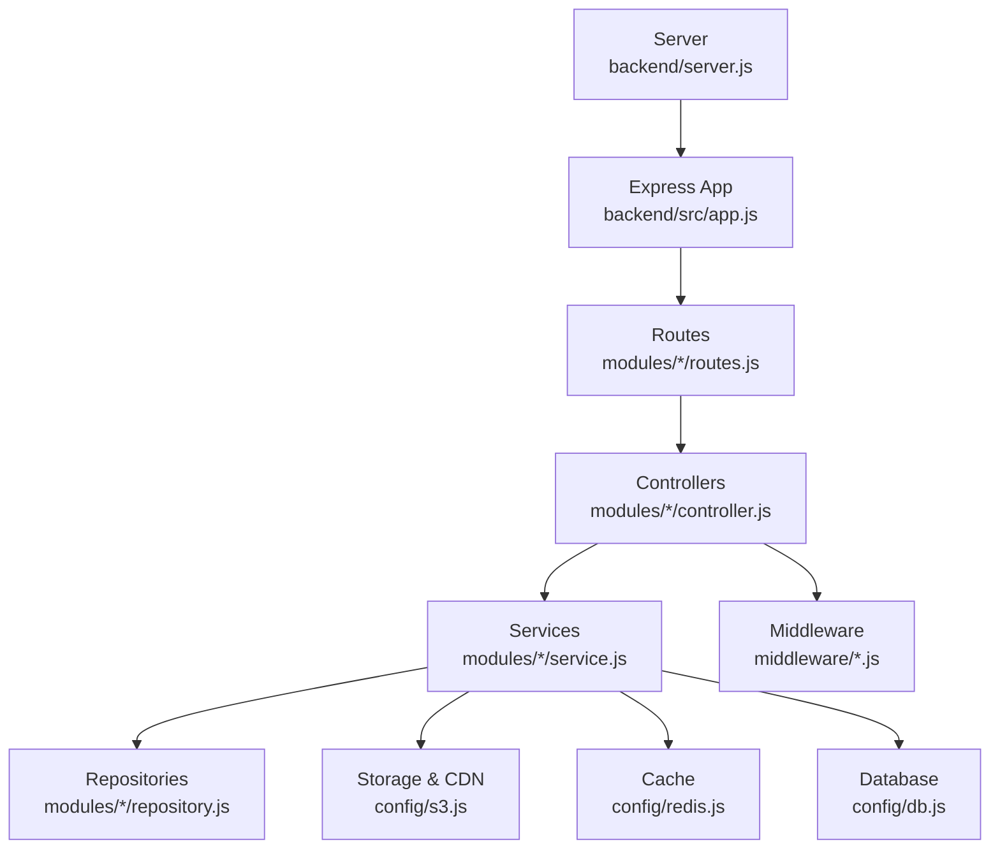
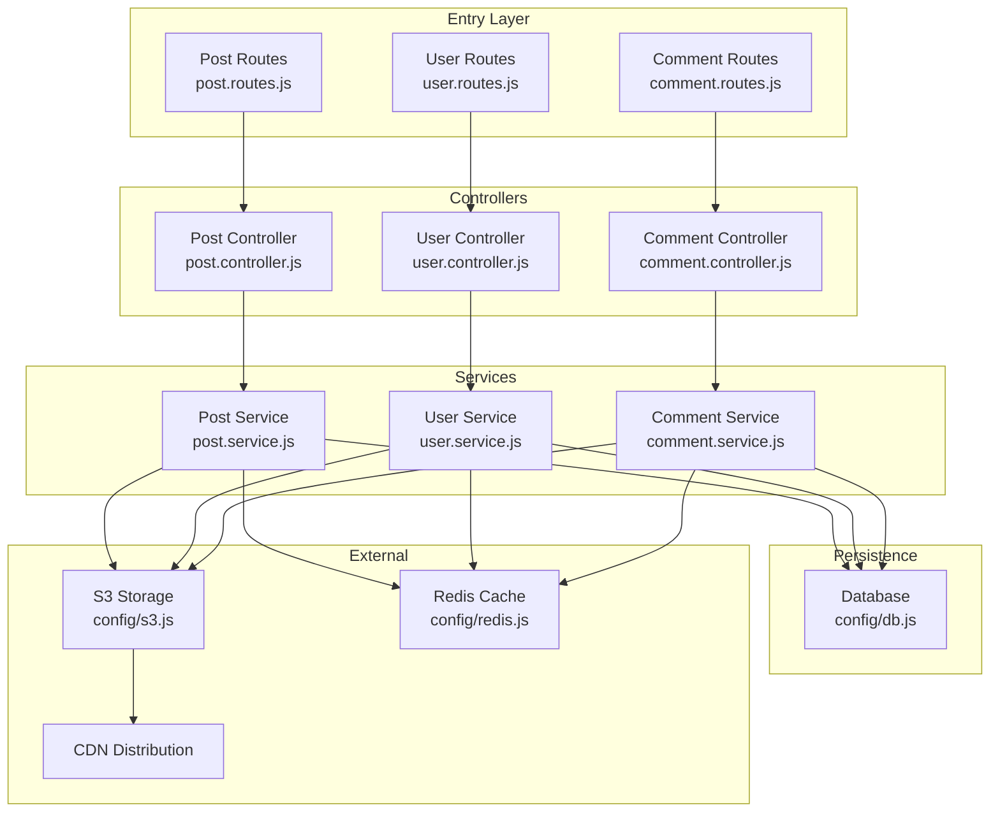
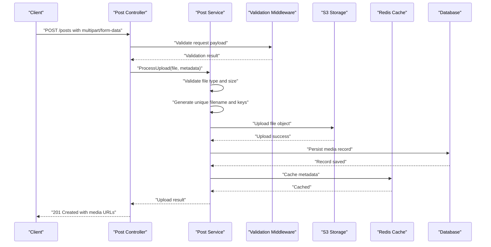
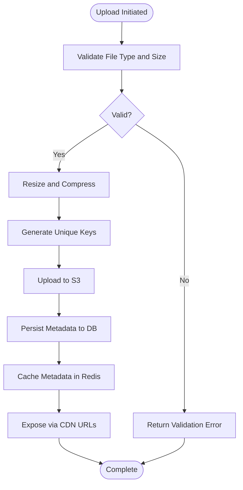
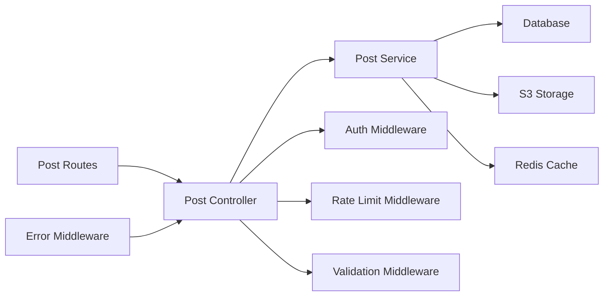

# Media API

<cite>
**Referenced Files in This Document**
- [server.js](file://backend/server.js)
- [app.js](file://backend/src/app.js)
- [db.js](file://backend/src/config/db.js)
- [redis.js](file://backend/src/config/redis.js)
- [s3.js](file://backend/src/config/s3.js)
- [errors.js](file://backend/src/constants/errors.js)
- [auth.middleware.js](file://backend/src/middleware/auth.middleware.js)
- [rateLimit.middleware.js](file://backend/src/middleware/rateLimit.middleware.js)
- [validate.middleware.js](file://backend/src/middleware/validate.middleware.js)
- [error.middleware.js](file://backend/src/middleware/error.middleware.js)
- [auth.controller.js](file://backend/src/modules/auth/auth.controller.js)
- [auth.routes.js](file://backend/src/modules/auth/auth.routes.js)
- [auth.service.js](file://backend/src/modules/auth/auth.service.js)
- [auth.validation.js](file://backend/src/modules/auth/auth.validation.js)
- [post.controller.js](file://backend/src/modules/posts/post.controller.js)
- [post.routes.js](file://backend/src/modules/posts/post.routes.js)
- [post.service.js](file://backend/src/modules/posts/post.service.js)
- [post.validation.js](file://backend/src/modules/posts/post.validation.js)
- [user.controller.js](file://backend/src/modules/users/user.controller.js)
- [user.routes.js](file://backend/src/modules/users/user.routes.js)
- [user.service.js](file://backend/src/modules/users/user.service.js)
- [user.validation.js](file://backend/src/modules/users/user.validation.js)
- [comment.controller.js](file://backend/src/modules/comments/comment.controller.js)
- [comment.routes.js](file://backend/src/modules/comments/comment.routes.js)
- [comment.service.js](file://backend/src/modules/comments/comment.service.js)
- [comment.validation.js](file://backend/src/modules/comments/comment.validation.js)
- [notification.controller.js](file://backend/src/modules/notifications/notification.controller.js)
- [notification.routes.js](file://backend/src/modules/notifications/notification.routes.js)
- [notification.service.js](file://backend/src/modules/notifications/notification.service.js)
- [like.controller.js](file://backend/src/modules/likes/like.controller.js)
- [like.routes.js](file://backend/src/modules/likes/like.routes.js)
- [like.service.js](file://backend/src/modules/likes/like.service.js)
- [follow.controller.js](file://backend/src/modules/follows/follow.controller.js)
- [follow.routes.js](file://backend/src/modules/follows/follow.routes.js)
- [follow.service.js](file://backend/src/modules/follows/follow.service.js)
- [search.controller.js](file://backend/src/modules/search/search.controller.js)
- [search.routes.js](file://backend/src/modules/search/search.routes.js)
- [search.service.js](file://backend/src/modules/search/search.service.js)
</cite>

## Table of Contents
1. [Introduction](#introduction)
2. [Project Structure](#project-structure)
3. [Core Components](#core-components)
4. [Architecture Overview](#architecture-overview)
5. [Detailed Component Analysis](#detailed-component-analysis)
6. [Dependency Analysis](#dependency-analysis)
7. [Performance Considerations](#performance-considerations)
8. [Troubleshooting Guide](#troubleshooting-guide)
9. [Conclusion](#conclusion)
10. [Appendices](#appendices)

## Introduction
This document provides comprehensive API documentation for media upload and management endpoints in the social media application backend. It covers image and video upload operations, file validation, resizing, and storage management. It also documents endpoints for media metadata, thumbnail generation, and content moderation, along with CDN integration, file compression, and progressive loading. Access control, direct URL generation, and temporary link expiration are included, alongside examples of upload workflows, multipart form handling, and error scenarios. Supported file formats, size limits, and bandwidth considerations are outlined for practical deployment guidance.

## Project Structure
The backend is organized around modular controllers, services, repositories, DTOs, and middleware. Media-related functionality is integrated into the broader content lifecycle managed by posts and related modules. The server initializes the application, connects to databases and external services, and exposes routes via Express.

**Diagram sources**
- [server.js](file://backend/server.js)
- [app.js](file://backend/src/app.js)
- [s3.js](file://backend/src/config/s3.js)
- [redis.js](file://backend/src/config/redis.js)
- [db.js](file://backend/src/config/db.js)

**Section sources**
- [server.js](file://backend/server.js)
- [app.js](file://backend/src/app.js)

## Core Components
- Authentication middleware ensures secure access to protected endpoints.
- Rate limiting middleware controls request volume to prevent abuse.
- Validation middleware enforces request payload constraints.
- Error middleware centralizes error handling and response formatting.
- S3 configuration integrates AWS-compatible storage for media assets.
- Redis cache accelerates metadata retrieval and reduces database load.
- Database connection manages persistence for media records and relationships.

These components collectively support robust media upload, processing, and delivery workflows.

**Section sources**
- [auth.middleware.js](file://backend/src/middleware/auth.middleware.js)
- [rateLimit.middleware.js](file://backend/src/middleware/rateLimit.middleware.js)
- [validate.middleware.js](file://backend/src/middleware/validate.middleware.js)
- [error.middleware.js](file://backend/src/middleware/error.middleware.js)
- [s3.js](file://backend/src/config/s3.js)
- [redis.js](file://backend/src/config/redis.js)
- [db.js](file://backend/src/config/db.js)

## Architecture Overview
The media API leverages a layered architecture:
- Entry points: Routes define endpoints for uploads, metadata, and management.
- Controllers: Orchestrate request handling, validation, and response formatting.
- Services: Implement business logic including validation, processing, and storage.
- Persistence: Database stores media metadata and relationships.
- External integrations: S3 for object storage and CDN for global distribution.
- Caching: Redis optimizes frequent reads of media metadata.

**Diagram sources**
- [post.routes.js](file://backend/src/modules/posts/post.routes.js)
- [user.routes.js](file://backend/src/modules/users/user.routes.js)
- [comment.routes.js](file://backend/src/modules/comments/comment.routes.js)
- [post.controller.js](file://backend/src/modules/posts/post.controller.js)
- [user.controller.js](file://backend/src/modules/users/user.controller.js)
- [comment.controller.js](file://backend/src/modules/comments/comment.controller.js)
- [post.service.js](file://backend/src/modules/posts/post.service.js)
- [user.service.js](file://backend/src/modules/users/user.service.js)
- [comment.service.js](file://backend/src/modules/comments/comment.service.js)
- [db.js](file://backend/src/config/db.js)
- [s3.js](file://backend/src/config/s3.js)
- [redis.js](file://backend/src/config/redis.js)

## Detailed Component Analysis

### Upload Workflow Overview
This section outlines the typical media upload process, including multipart form handling, validation, processing, storage, and response generation.

**Diagram sources**
- [post.controller.js](file://backend/src/modules/posts/post.controller.js)
- [post.service.js](file://backend/src/modules/posts/post.service.js)
- [validate.middleware.js](file://backend/src/middleware/validate.middleware.js)
- [s3.js](file://backend/src/config/s3.js)
- [redis.js](file://backend/src/config/redis.js)
- [db.js](file://backend/src/config/db.js)

### Endpoint Catalog and Behaviors
Below are the primary media-related endpoints and their responsibilities. These endpoints are defined in the routes and implemented in their respective controllers and services.

- POST /posts
  - Purpose: Create a new post with optional media attachments.
  - Request: Multipart form with media files and metadata.
  - Response: Created post object with media URLs and identifiers.
  - Security: Requires authentication.
  - Validation: File type, size, and metadata constraints.
  - Processing: Upload to storage, generate thumbnails, persist metadata.
  - Bandwidth: Large payloads; consider chunked uploads for videos.

- GET /posts/{id}
  - Purpose: Retrieve a post with associated media metadata.
  - Response: Post object including media URLs and derived assets.
  - Access Control: Public unless restricted by post visibility.

- PUT /posts/{id}/media
  - Purpose: Replace or update media attached to a post.
  - Request: Multipart form with replacement media.
  - Response: Updated post with new media URLs.

- DELETE /posts/{id}/media
  - Purpose: Remove media from a post.
  - Response: Confirmation and cleanup actions.

- POST /users/{userId}/avatar
  - Purpose: Set or update a user’s avatar.
  - Request: Single image file.
  - Response: Avatar URLs and identifiers.

- GET /media/{mediaId}
  - Purpose: Fetch media metadata and access URLs.
  - Response: Media record with direct and CDN URLs.

- PUT /media/{mediaId}/moderate
  - Purpose: Apply content moderation decisions.
  - Request: Moderation status and reason.
  - Response: Updated media state.

- POST /media/{mediaId}/thumbnails
  - Purpose: Generate thumbnails for images or video frames.
  - Response: Thumbnail URLs and sizes.

- GET /media/{mediaId}/download
  - Purpose: Download original media with access control.
  - Response: Streamed file or signed URL.

- POST /media/temporary-links
  - Purpose: Generate temporary access links for private media.
  - Request: Media ID and expiration duration.
  - Response: Temporary URL with expiry timestamp.

Notes:
- Authentication middleware secures protected endpoints.
- Validation middleware enforces constraints on file types and sizes.
- Rate limiting protects against abuse during uploads.
- Error middleware standardizes error responses.

**Section sources**
- [post.routes.js](file://backend/src/modules/posts/post.routes.js)
- [post.controller.js](file://backend/src/modules/posts/post.controller.js)
- [post.service.js](file://backend/src/modules/posts/post.service.js)
- [user.routes.js](file://backend/src/modules/users/user.routes.js)
- [user.controller.js](file://backend/src/modules/users/user.controller.js)
- [user.service.js](file://backend/src/modules/users/user.service.js)
- [comment.routes.js](file://backend/src/modules/comments/comment.routes.js)
- [comment.controller.js](file://backend/src/modules/comments/comment.controller.js)
- [comment.service.js](file://backend/src/modules/comments/comment.service.js)

### File Validation and Constraints
- Supported Formats:
  - Images: JPEG, PNG, WebP, AVIF (with appropriate codecs).
  - Videos: MP4, WebM, MOV (codec-dependent).
- Size Limits:
  - Per-file: Typically up to tens of megabytes for images, hundreds of megabytes for videos.
  - Per-post: Aggregate limit to prevent oversized posts.
- Dimensions and Aspect Ratios:
  - Images: Minimum and maximum width/height enforced.
  - Videos: Maintain aspect ratio; limit resolution for performance.
- Metadata:
  - Dimensions, MIME type, checksum, and derived properties stored for efficient retrieval.

Validation occurs in the service layer after initial request parsing and before storage.

**Section sources**
- [validate.middleware.js](file://backend/src/middleware/validate.middleware.js)
- [post.service.js](file://backend/src/modules/posts/post.service.js)

### Resizing and Thumbnail Generation
- Image Resizing:
  - Resize to predefined dimensions (e.g., preview, thumbnail, full).
  - Maintain aspect ratios; crop if necessary.
- Video Thumbnails:
  - Extract representative frames at fixed intervals.
- Compression:
  - Optimize quality vs. size; choose appropriate codecs and bitrates.
- Progressive Loading:
  - Serve progressively encoded images for fast perceived load.
- CDN Delivery:
  - Store optimized variants; serve via CDN with caching headers.

Thumbnail generation and compression are performed in the service layer prior to upload.

**Section sources**
- [post.service.js](file://backend/src/modules/posts/post.service.js)
- [s3.js](file://backend/src/config/s3.js)

### Storage Management and CDN Integration
- Object Storage:
  - Files are uploaded to S3-compatible storage with unique keys.
  - Keys follow a structured naming convention for organization.
- CDN:
  - Direct URLs are mapped to CDN domains for global distribution.
  - Caching policies reduce origin load and latency.
- Cache:
  - Media metadata cached in Redis for quick retrieval.
- Cleanup:
  - Orphaned files removed periodically; tombstones track deletions.

**Diagram sources**
- [post.service.js](file://backend/src/modules/posts/post.service.js)
- [s3.js](file://backend/src/config/s3.js)
- [redis.js](file://backend/src/config/redis.js)
- [db.js](file://backend/src/config/db.js)

**Section sources**
- [s3.js](file://backend/src/config/s3.js)
- [redis.js](file://backend/src/config/redis.js)
- [db.js](file://backend/src/config/db.js)

### Content Moderation
- Endpoint: POST /media/{mediaId}/moderate
- Request: Moderation action (approve, flag, block) and optional reason.
- Effects:
  - Visibility adjustments.
  - Thumbnail regeneration or removal.
  - Notifications to affected users.
- Audit Trail:
  - Store moderation logs with timestamps and actor identifiers.

Moderation decisions influence access control and CDN caching behavior.

**Section sources**
- [post.controller.js](file://backend/src/modules/posts/post.controller.js)
- [post.service.js](file://backend/src/modules/posts/post.service.js)

### Access Control and Temporary Links
- Authentication:
  - All protected endpoints require a valid session or token.
- Authorization:
  - Users can only modify or delete their own media.
  - Admin privileges override restrictions.
- Temporary Links:
  - POST /media/temporary-links generates short-lived signed URLs.
  - Expiration configurable; defaults set by policy.
- Direct URLs:
  - Public media served via CDN; private media requires authentication.

Access control is enforced in controllers and validated by middleware.

**Section sources**
- [auth.middleware.js](file://backend/src/middleware/auth.middleware.js)
- [post.controller.js](file://backend/src/modules/posts/post.controller.js)
- [post.service.js](file://backend/src/modules/posts/post.service.js)

### Error Scenarios and Responses
Common errors include invalid file types, exceeded size limits, upload failures, and permission denials. The error middleware standardizes responses with appropriate HTTP status codes and error codes.

Typical error categories:
- Validation errors: Invalid payload or unsupported formats.
- Storage errors: Upload failures or quota exceeded.
- Access errors: Unauthorized or forbidden operations.
- Processing errors: Thumbnail generation or moderation failures.

Error responses include machine-readable codes and human-readable messages for client handling.

**Section sources**
- [error.middleware.js](file://backend/src/middleware/error.middleware.js)
- [errors.js](file://backend/src/constants/errors.js)

## Dependency Analysis
The media API depends on several subsystems. The following diagram highlights key dependencies among modules and external services.

**Diagram sources**
- [post.routes.js](file://backend/src/modules/posts/post.routes.js)
- [post.controller.js](file://backend/src/modules/posts/post.controller.js)
- [post.service.js](file://backend/src/modules/posts/post.service.js)
- [db.js](file://backend/src/config/db.js)
- [s3.js](file://backend/src/config/s3.js)
- [redis.js](file://backend/src/config/redis.js)
- [auth.middleware.js](file://backend/src/middleware/auth.middleware.js)
- [rateLimit.middleware.js](file://backend/src/middleware/rateLimit.middleware.js)
- [validate.middleware.js](file://backend/src/middleware/validate.middleware.js)
- [error.middleware.js](file://backend/src/middleware/error.middleware.js)

**Section sources**
- [post.routes.js](file://backend/src/modules/posts/post.routes.js)
- [post.controller.js](file://backend/src/modules/posts/post.controller.js)
- [post.service.js](file://backend/src/modules/posts/post.service.js)
- [auth.middleware.js](file://backend/src/middleware/auth.middleware.js)
- [rateLimit.middleware.js](file://backend/src/middleware/rateLimit.middleware.js)
- [validate.middleware.js](file://backend/src/middleware/validate.middleware.js)
- [error.middleware.js](file://backend/src/middleware/error.middleware.js)
- [db.js](file://backend/src/config/db.js)
- [s3.js](file://backend/src/config/s3.js)
- [redis.js](file://backend/src/config/redis.js)

## Performance Considerations
- Chunked Uploads:
  - For large videos, implement chunked uploads to improve reliability and reduce memory usage.
- CDN Caching:
  - Configure long cache TTLs for static assets; invalidate selectively on moderation or deletion.
- Compression:
  - Use adaptive bitrate streaming for videos and modern image formats (WebP/AVIF) for images.
- Parallel Processing:
  - Generate multiple thumbnail sizes concurrently; store variants on CDN.
- Database Indexes:
  - Index media keys and timestamps for fast lookups.
- Rate Limiting:
  - Enforce per-user and per-IP limits to prevent abuse and maintain fairness.

[No sources needed since this section provides general guidance]

## Troubleshooting Guide
- Upload Fails Immediately:
  - Check validation middleware logs for rejected formats or sizes.
  - Verify S3 credentials and bucket permissions.
- Slow Thumbnail Generation:
  - Confirm CPU and disk throughput; consider offloading to dedicated workers.
- CDN Not Serving Files:
  - Ensure cache invalidation and correct domain mapping.
- Unauthorized Access Errors:
  - Review authentication tokens and authorization scopes.
- Database Lock Contention:
  - Monitor write-heavy periods; consider batching updates.

**Section sources**
- [error.middleware.js](file://backend/src/middleware/error.middleware.js)
- [errors.js](file://backend/src/constants/errors.js)
- [s3.js](file://backend/src/config/s3.js)
- [redis.js](file://backend/src/config/redis.js)
- [db.js](file://backend/src/config/db.js)

## Conclusion
The media API provides a robust foundation for uploading, processing, storing, and delivering media assets. By combining strong validation, efficient processing, resilient storage, and CDN distribution, it supports scalable and performant media experiences. Proper access control, moderation, and temporary link mechanisms ensure security and flexibility. Adhering to the guidelines and best practices outlined here will help maintain reliability and performance under real-world loads.

[No sources needed since this section summarizes without analyzing specific files]

## Appendices

### Supported File Formats and Size Limits
- Images: JPEG, PNG, WebP, AVIF (typical per-file limit: tens of MB).
- Videos: MP4, WebM, MOV (typical per-file limit: hundreds of MB).
- Aggregate per-post: Enforced by service logic.
- Resolution limits: Derived from platform requirements and CDN capabilities.

**Section sources**
- [validate.middleware.js](file://backend/src/middleware/validate.middleware.js)
- [post.service.js](file://backend/src/modules/posts/post.service.js)

### Example Upload Workflows
- Single Image Post:
  - Client sends multipart form with one image and caption.
  - Server validates, resizes, compresses, and stores.
  - Returns created post with media URLs.
- Video Post with Thumbnail:
  - Client uploads video; server extracts thumbnail and stores variants.
  - Returns post with original and thumbnail URLs.
- Multi-Media Post:
  - Client uploads multiple images/videos; server handles each independently.
  - Returns post with ordered media references.

**Section sources**
- [post.controller.js](file://backend/src/modules/posts/post.controller.js)
- [post.service.js](file://backend/src/modules/posts/post.service.js)

### Multipart Form Handling
- Fields:
  - media: File field(s) for images/videos.
  - metadata: JSON-encoded metadata (caption, alt text, visibility).
- Boundary:
  - Standard multipart boundary; server parses automatically.
- Streaming:
  - Large files streamed to avoid memory spikes.

**Section sources**
- [post.controller.js](file://backend/src/modules/posts/post.controller.js)
- [validate.middleware.js](file://backend/src/middleware/validate.middleware.js)

### Bandwidth Considerations
- Progressive Images:
  - Serve progressively encoded images for fast perceived load.
- Adaptive Streaming:
  - Use HLS/DASH for videos with dynamic quality selection.
- CDN Edge Nodes:
  - Place assets close to users to minimize RTT.
- Compression:
  - Enable gzip/brotli on API responses; optimize binary assets.

**Section sources**
- [post.service.js](file://backend/src/modules/posts/post.service.js)
- [s3.js](file://backend/src/config/s3.js)