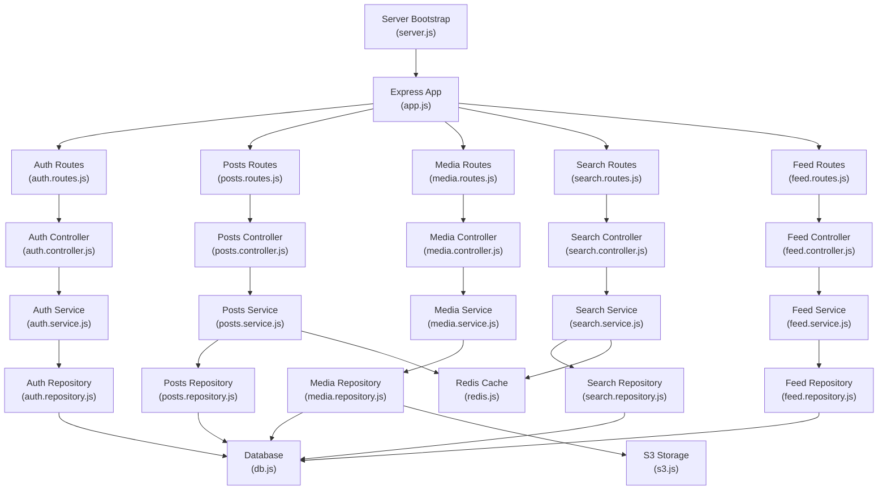
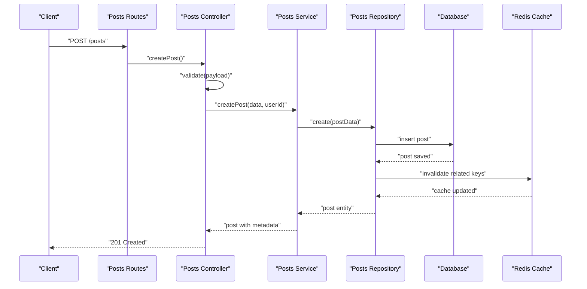
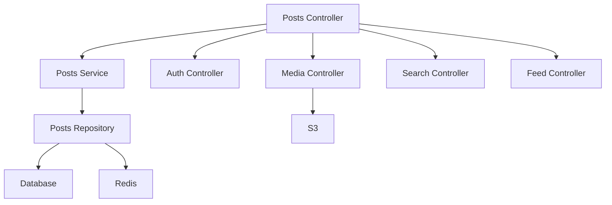

# Posts API

<cite>
**Referenced Files in This Document**
- [server.js](file://backend/server.js)
- [app.js](file://backend/src/app.js)
- [db.js](file://backend/src/config/db.js)
- [redis.js](file://backend/src/config/redis.js)
- [s3.js](file://backend/src/config/s3.js)
- [rateLimit.middleware.js](file://backend/src/middleware/rateLimit.middleware.js)
- [auth.middleware.js](file://backend/src/middleware/auth.middleware.js)
- [validate.middleware.js](file://backend/src/middleware/validate.middleware.js)
- [errors.js](file://backend/src/constants/errors.js)
- [roles.js](file://backend/src/constants/roles.js)
- [post.dto.js](file://backend/src/dto/post.dto.js)
- [auth.routes.js](file://backend/src/modules/auth/auth.routes.js)
- [auth.controller.js](file://backend/src/modules/auth/auth.controller.js)
- [auth.service.js](file://backend/src/modules/auth/auth.service.js)
- [auth.repository.js](file://backend/src/modules/auth/auth.repository.js)
- [comment.controller.js](file://backend/src/modules/comments/comment.controller.js)
- [comment.repository.js](file://backend/src/modules/comments/comment.repository.js)
- [media.controller.js](file://backend/src/modules/media/media.controller.js)
- [media.repository.js](file://backend/src/modules/media/media.repository.js)
- [search.controller.js](file://backend/src/modules/search/search.controller.js)
- [search.repository.js](file://backend/src/modules/search/search.repository.js)
- [feed.controller.js](file://backend/src/modules/feed/feed.controller.js)
- [feed.repository.js](file://backend/src/modules/feed/feed.repository.js)
- [users.controller.js](file://backend/src/modules/users/users.controller.js)
- [users.repository.js](file://backend/src/modules/users/users.repository.js)
</cite>

## Table of Contents
1. [Introduction](#introduction)
2. [Project Structure](#project-structure)
3. [Core Components](#core-components)
4. [Architecture Overview](#architecture-overview)
5. [Detailed Component Analysis](#detailed-component-analysis)
6. [Dependency Analysis](#dependency-analysis)
7. [Performance Considerations](#performance-considerations)
8. [Troubleshooting Guide](#troubleshooting-guide)
9. [Conclusion](#conclusion)

## Introduction
This document provides comprehensive API documentation for post management endpoints in a social media application. It covers post creation, retrieval, updates, deletion, and listing operations. It also documents media upload capabilities, rich text content handling, embedded media, pagination, filtering, reactions, bookmarks, sharing, search functionality, tagging, visibility controls, rate limiting, and content moderation workflows. The goal is to enable developers to integrate with the posts API effectively while understanding data structures, flows, and operational constraints.

## Project Structure
The backend is organized around modular controllers, repositories, services, DTOs, middleware, and configuration. The posts API integrates with authentication, media, search, and feed modules. Key components include:
- Application bootstrap and routing
- Authentication and authorization middleware
- Rate limiting and validation middleware
- Post DTOs and domain models
- Media handling for uploads and storage
- Search and feed aggregation
- Redis caching and S3 storage configuration

**Diagram sources**
- [server.js](file://backend/server.js)
- [app.js](file://backend/src/app.js)
- [auth.routes.js](file://backend/src/modules/auth/auth.routes.js)
- [auth.controller.js](file://backend/src/modules/auth/auth.controller.js)
- [auth.service.js](file://backend/src/modules/auth/auth.service.js)
- [auth.repository.js](file://backend/src/modules/auth/auth.repository.js)
- [db.js](file://backend/src/config/db.js)
- [redis.js](file://backend/src/config/redis.js)
- [s3.js](file://backend/src/config/s3.js)

**Section sources**
- [server.js](file://backend/server.js)
- [app.js](file://backend/src/app.js)

## Core Components
- Authentication and Authorization Middleware: Protects routes and validates JWT tokens.
- Validation Middleware: Ensures request payloads conform to DTOs.
- Rate Limiting Middleware: Controls request frequency for sensitive endpoints.
- Post DTOs: Define request/response shapes for posts and related operations.
- Controllers: Handle HTTP requests, delegate to services, and return standardized responses.
- Services: Encapsulate business logic for posts, media, search, and feed.
- Repositories: Manage database queries and cache operations.
- Configuration: Database connection, Redis cache, and S3 storage clients.

Key responsibilities:
- Enforce role-based access and permissions
- Validate inputs and sanitize outputs
- Apply rate limits for post creation
- Integrate with media storage and caching
- Support search, tagging, and visibility controls

**Section sources**
- [auth.middleware.js](file://backend/src/middleware/auth.middleware.js)
- [validate.middleware.js](file://backend/src/middleware/validate.middleware.js)
- [rateLimit.middleware.js](file://backend/src/middleware/rateLimit.middleware.js)
- [post.dto.js](file://backend/src/dto/post.dto.js)

## Architecture Overview
The Posts API follows a layered architecture:
- HTTP Layer: Routes define endpoints and bind to controllers.
- Controller Layer: Handles request parsing, validation, and response formatting.
- Service Layer: Implements domain logic, orchestrates repositories, and manages integrations.
- Persistence Layer: Uses Prisma ORM for database operations and Redis for caching.
- External Integrations: S3 for media storage and third-party APIs for advanced features.

**Diagram sources**
- [auth.middleware.js](file://backend/src/middleware/auth.middleware.js)
- [validate.middleware.js](file://backend/src/middleware/validate.middleware.js)
- [rateLimit.middleware.js](file://backend/src/middleware/rateLimit.middleware.js)
- [post.dto.js](file://backend/src/dto/post.dto.js)
- [db.js](file://backend/src/config/db.js)
- [redis.js](file://backend/src/config/redis.js)

## Detailed Component Analysis

### Post Management Endpoints
- POST /posts
  - Purpose: Create a new post with optional media and rich text content.
  - Authentication: Required (Bearer token).
  - Rate Limiting: Applied to prevent spam.
  - Request Body: Defined by Post DTO (title, content, mediaIds, tags, visibility).
  - Response: Created post object with metadata.
  - Error Codes: 400 (validation), 401 (unauthorized), 403 (insufficient permissions), 429 (rate limit), 500 (internal error).

- GET /posts
  - Purpose: List posts with pagination and filters.
  - Query Parameters: page, limit, sortBy, sortOrder, dateFrom, dateTo, userId, trending.
  - Response: Paginated list of posts with summary fields.
  - Error Codes: 400 (invalid parameters), 500 (internal error).

- GET /posts/{id}
  - Purpose: Retrieve a single post by ID.
  - Response: Full post object including media and engagement metrics.
  - Error Codes: 404 (not found), 500 (internal error).

- PUT /posts/{id}
  - Purpose: Update an existing post.
  - Authentication: Required; author or admin.
  - Request Body: Partial update fields (title, content, mediaIds, tags, visibility).
  - Response: Updated post object.
  - Error Codes: 400 (validation), 401 (unauthorized), 403 (permission denied), 404 (not found), 500 (internal error).

- DELETE /posts/{id}
  - Purpose: Delete a post.
  - Authentication: Required; author or admin.
  - Response: Deletion confirmation.
  - Error Codes: 401 (unauthorized), 403 (permission denied), 404 (not found), 500 (internal error).

- GET /posts/{id}/reactions
  - Purpose: List reactions for a post.
  - Response: Reaction counts and user lists per reaction type.
  - Error Codes: 404 (not found), 500 (internal error).

- POST /posts/{id}/reactions
  - Purpose: Add or update a reaction (e.g., like, love).
  - Authentication: Required.
  - Request Body: Reaction type.
  - Response: Updated reaction counts.
  - Error Codes: 400 (invalid reaction), 401 (unauthorized), 404 (not found), 500 (internal error).

- POST /posts/{id}/bookmark
  - Purpose: Bookmark a post for later viewing.
  - Authentication: Required.
  - Response: Bookmark status.
  - Error Codes: 401 (unauthorized), 404 (not found), 500 (internal error).

- POST /posts/{id}/share
  - Purpose: Share a post (record share event).
  - Authentication: Required.
  - Response: Share confirmation.
  - Error Codes: 401 (unauthorized), 404 (not found), 500 (internal error).

- POST /posts/{id}/moderate
  - Purpose: Moderate a post (approve, flag, remove).
  - Authentication: Required; moderator or admin.
  - Request Body: Action (approve, flag, remove) and reason.
  - Response: Moderation result.
  - Error Codes: 400 (invalid action), 401 (unauthorized), 403 (permission denied), 404 (not found), 500 (internal error).

**Section sources**
- [post.dto.js](file://backend/src/dto/post.dto.js)
- [rateLimit.middleware.js](file://backend/src/middleware/rateLimit.middleware.js)
- [auth.middleware.js](file://backend/src/middleware/auth.middleware.js)

### Media Uploads and Rich Text Content
- POST /media/upload
  - Purpose: Upload media files (images, videos).
  - Authentication: Required.
  - Request: Multipart form-data with file field.
  - Response: Media object with secure URL and metadata.
  - Storage: S3 integration via configured client.
  - Error Codes: 400 (invalid file), 401 (unauthorized), 500 (storage failure).

- GET /media/{mediaId}
  - Purpose: Retrieve media metadata and signed URLs.
  - Response: Media details and access URL.
  - Error Codes: 404 (not found), 500 (internal error).

- Embedded Media
  - Posts can reference media via mediaIds array in the Post DTO.
  - Media URLs are served through signed links for controlled access.

**Section sources**
- [s3.js](file://backend/src/config/s3.js)
- [media.controller.js](file://backend/src/modules/media/media.controller.js)
- [media.repository.js](file://backend/src/modules/media/media.repository.js)
- [post.dto.js](file://backend/src/dto/post.dto.js)

### Search, Tagging, and Visibility Controls
- GET /search/posts
  - Purpose: Search posts by keywords, tags, and authors.
  - Query Parameters: q (keywords), tags[], authorId, dateFrom, dateTo, sortBy, sortOrder, page, limit.
  - Response: Paginated results with relevance scoring.
  - Error Codes: 400 (invalid parameters), 500 (internal error).

- Tagging System
  - Posts support tags array in DTO.
  - Filtering by tags is supported in listing and search endpoints.

- Visibility Controls
  - Post DTO includes visibility field (public, private, friends_only).
  - Access checks enforced in controllers and repositories.

**Section sources**
- [search.controller.js](file://backend/src/modules/search/search.controller.js)
- [search.repository.js](file://backend/src/modules/search/search.repository.js)
- [post.dto.js](file://backend/src/dto/post.dto.js)

### Pagination, Filtering, and Trending
- Pagination
  - Standardized page and limit parameters across listing endpoints.
  - Cursor-based pagination recommended for large datasets.

- Filtering
  - Date range filters (dateFrom, dateTo).
  - Author-specific filtering via userId.
  - Tag-based filtering via tags[].

- Trending
  - Optional trending parameter to sort by engagement metrics.
  - Trending algorithm can leverage cached metrics in Redis.

**Section sources**
- [feed.controller.js](file://backend/src/modules/feed/feed.controller.js)
- [feed.repository.js](file://backend/src/modules/feed/feed.repository.js)
- [redis.js](file://backend/src/config/redis.js)

### Reactions, Bookmarks, and Sharing
- Reactions
  - Supported reaction types defined in DTOs.
  - Users can add/update reactions; duplicates are prevented.

- Bookmarks
  - Per-user bookmark storage managed via repository and cache.

- Sharing
  - Tracks share events for analytics and engagement metrics.

**Section sources**
- [post.dto.js](file://backend/src/dto/post.dto.js)
- [users.controller.js](file://backend/src/modules/users/users.controller.js)
- [users.repository.js](file://backend/src/modules/users/users.repository.js)

### Content Moderation Workflows
- Approve/Flag/Remove Actions
  - Requires moderator or admin role.
  - Logs moderation decisions with timestamps and reasons.
  - Updates post visibility and notifies stakeholders.

- Role-Based Access
  - Roles defined centrally; moderation endpoints enforce role checks.

**Section sources**
- [roles.js](file://backend/src/constants/roles.js)
- [errors.js](file://backend/src/constants/errors.js)

### Rate Limiting for Post Creation
- Policy
  - Strict limits on POST /posts per user IP/userId.
  - Exceeding limits returns 429 with retry-after header.

- Implementation
  - Middleware applies sliding window or token bucket algorithm.
  - Redis used to track counters.

**Section sources**
- [rateLimit.middleware.js](file://backend/src/middleware/rateLimit.middleware.js)
- [redis.js](file://backend/src/config/redis.js)

## Dependency Analysis
The Posts API depends on:
- Authentication module for user identity and roles.
- Media module for file storage and retrieval.
- Search module for indexing and querying posts.
- Feed module for trending and aggregated views.
- Database and Redis for persistence and caching.
- S3 for scalable media storage.

**Diagram sources**
- [auth.controller.js](file://backend/src/modules/auth/auth.controller.js)
- [media.controller.js](file://backend/src/modules/media/media.controller.js)
- [search.controller.js](file://backend/src/modules/search/search.controller.js)
- [feed.controller.js](file://backend/src/modules/feed/feed.controller.js)
- [db.js](file://backend/src/config/db.js)
- [redis.js](file://backend/src/config/redis.js)
- [s3.js](file://backend/src/config/s3.js)

**Section sources**
- [auth.controller.js](file://backend/src/modules/auth/auth.controller.js)
- [media.controller.js](file://backend/src/modules/media/media.controller.js)
- [search.controller.js](file://backend/src/modules/search/search.controller.js)
- [feed.controller.js](file://backend/src/modules/feed/feed.controller.js)
- [db.js](file://backend/src/config/db.js)
- [redis.js](file://backend/src/config/redis.js)
- [s3.js](file://backend/src/config/s3.js)

## Performance Considerations
- Use Redis for caching frequently accessed posts, search results, and trending lists.
- Implement cursor-based pagination for efficient large-scale listings.
- Batch media operations to minimize S3 round trips.
- Index database fields commonly used in filters (userId, createdAt, tags).
- Apply rate limiting judiciously to balance user experience and abuse prevention.

## Troubleshooting Guide
Common issues and resolutions:
- Authentication failures: Verify JWT token validity and expiration.
- Validation errors: Ensure payload matches Post DTO schema.
- Rate limit exceeded: Respect retry-after header and reduce request frequency.
- Media upload failures: Check S3 credentials and bucket policies.
- Permission denied: Confirm user role and ownership of the target post.
- Internal server errors: Review service logs and repository queries.

**Section sources**
- [errors.js](file://backend/src/constants/errors.js)
- [auth.middleware.js](file://backend/src/middleware/auth.middleware.js)
- [rateLimit.middleware.js](file://backend/src/middleware/rateLimit.middleware.js)

## Conclusion
The Posts API provides a robust foundation for managing social media content with strong support for media, search, reactions, bookmarks, sharing, and moderation. By following the documented endpoints, DTOs, and operational guidelines, developers can implement reliable integrations while maintaining performance and security.