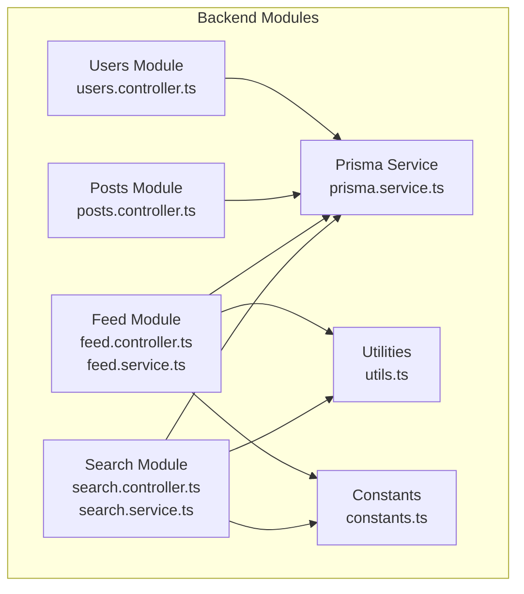
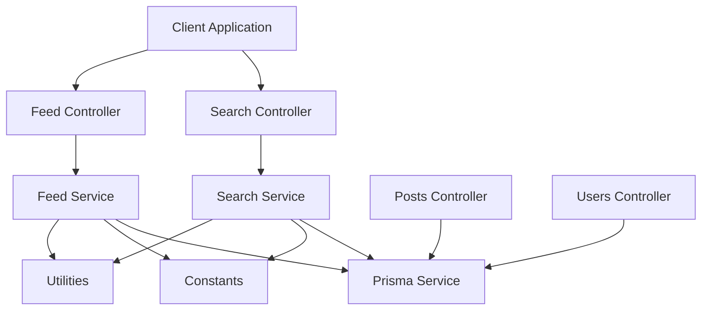
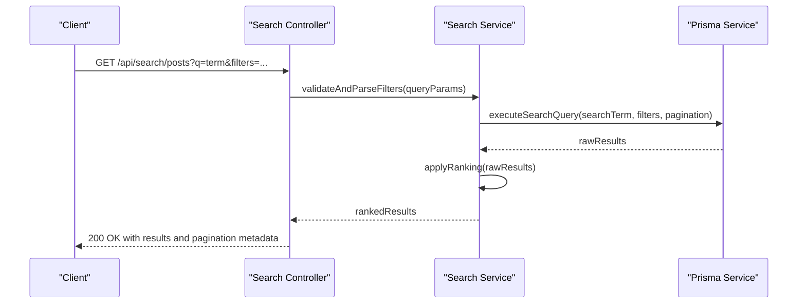
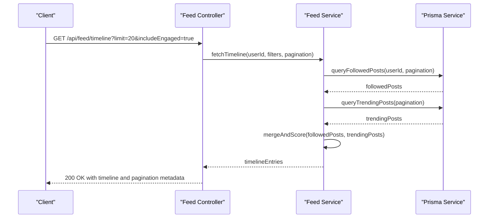
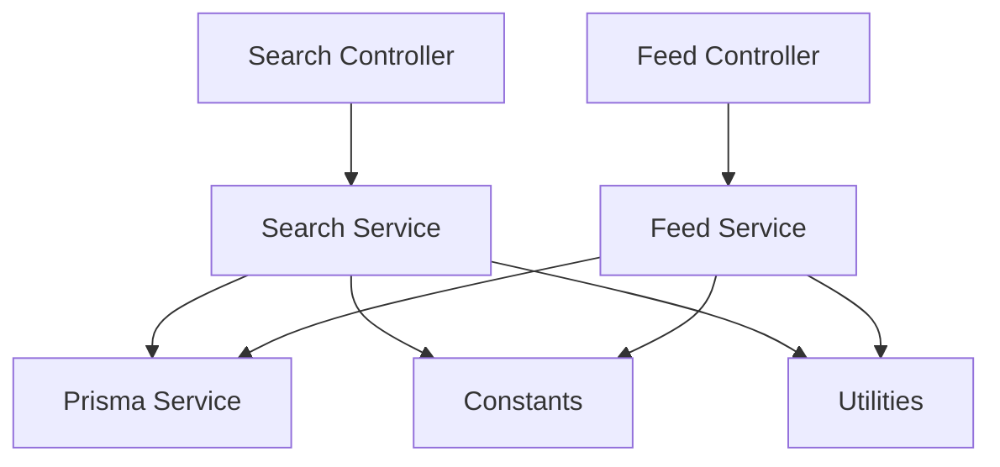

# Search & Feed API

<cite>
**Referenced Files in This Document**
- [search.controller.ts](file://backend/src/modules/search/search.controller.ts)
- [search.service.ts](file://backend/src/modules/search/search.service.ts)
- [feed.controller.ts](file://backend/src/modules/feed/feed.controller.ts)
- [feed.service.ts](file://backend/src/modules/feed/feed.service.ts)
- [posts.controller.ts](file://backend/src/modules/posts/posts.controller.ts)
- [users.controller.ts](file://backend/src/modules/users/users.controller.ts)
- [prisma.service.ts](file://backend/src/prisma/prisma.service.ts)
- [constants.ts](file://backend/src/constants/constants.ts)
- [utils.ts](file://backend/src/utils/utils.ts)
</cite>

## Table of Contents
1. [Introduction](#introduction)
2. [Project Structure](#project-structure)
3. [Core Components](#core-components)
4. [Architecture Overview](#architecture-overview)
5. [Detailed Component Analysis](#detailed-component-analysis)
6. [Dependency Analysis](#dependency-analysis)
7. [Performance Considerations](#performance-considerations)
8. [Troubleshooting Guide](#troubleshooting-guide)
9. [Conclusion](#conclusion)

## Introduction
This document provides comprehensive API documentation for the Search and Feed subsystems of the social media platform. It covers:
- Search endpoints for users, posts, hashtags, and content discovery
- Feed generation algorithms, timeline construction, and personalized recommendations
- Search filters, ranking algorithms, and relevance scoring
- Feed pagination, infinite scrolling, and real-time feed updates
- Examples of search query syntax, filter combinations, and feed customization options
- Trending topics, hashtag discovery, and content suggestion algorithms

The goal is to enable developers to integrate and extend the search and feed capabilities effectively while maintaining performance and scalability.

## Project Structure
The backend is organized into modular components under the `backend/src/modules` directory. The search and feed modules are central to content discovery and user experience.

**Diagram sources**
- [search.controller.ts](file://backend/src/modules/search/search.controller.ts)
- [search.service.ts](file://backend/src/modules/search/search.service.ts)
- [feed.controller.ts](file://backend/src/modules/feed/feed.controller.ts)
- [feed.service.ts](file://backend/src/modules/feed/feed.service.ts)
- [posts.controller.ts](file://backend/src/modules/posts/posts.controller.ts)
- [users.controller.ts](file://backend/src/modules/users/users.controller.ts)
- [prisma.service.ts](file://backend/src/prisma/prisma.service.ts)
- [constants.ts](file://backend/src/constants/constants.ts)
- [utils.ts](file://backend/src/utils/utils.ts)

**Section sources**
- [search.controller.ts](file://backend/src/modules/search/search.controller.ts)
- [search.service.ts](file://backend/src/modules/search/search.service.ts)
- [feed.controller.ts](file://backend/src/modules/feed/feed.controller.ts)
- [feed.service.ts](file://backend/src/modules/feed/feed.service.ts)
- [posts.controller.ts](file://backend/src/modules/posts/posts.controller.ts)
- [users.controller.ts](file://backend/src/modules/users/users.controller.ts)
- [prisma.service.ts](file://backend/src/prisma/prisma.service.ts)
- [constants.ts](file://backend/src/constants/constants.ts)
- [utils.ts](file://backend/src/utils/utils.ts)

## Core Components
This section outlines the primary components involved in search and feed operations, their responsibilities, and interactions.

- Search Controller and Service
  - Expose REST endpoints for searching users, posts, and hashtags
  - Apply filters, ranking, and relevance scoring
  - Integrate with database queries via Prisma service

- Feed Controller and Service
  - Generate timelines for authenticated users
  - Personalize feeds based on user preferences and relationships
  - Support pagination and infinite scrolling patterns

- Posts and Users Controllers
  - Provide auxiliary endpoints for post and user data used in search and feed
  - Supply metadata and relationships for ranking and recommendation

- Prisma Service
  - Centralized database access layer
  - Execute optimized queries for search and feed operations

- Constants and Utilities
  - Define search and feed configuration constants
  - Provide helper functions for ranking, filtering, and pagination

**Section sources**
- [search.controller.ts](file://backend/src/modules/search/search.controller.ts)
- [search.service.ts](file://backend/src/modules/search/search.service.ts)
- [feed.controller.ts](file://backend/src/modules/feed/feed.controller.ts)
- [feed.service.ts](file://backend/src/modules/feed/feed.service.ts)
- [posts.controller.ts](file://backend/src/modules/posts/posts.controller.ts)
- [users.controller.ts](file://backend/src/modules/users/users.controller.ts)
- [prisma.service.ts](file://backend/src/prisma/prisma.service.ts)
- [constants.ts](file://backend/src/constants/constants.ts)
- [utils.ts](file://backend/src/utils/utils.ts)

## Architecture Overview
The search and feed architecture integrates controller-layer endpoints with service-layer logic and database access through Prisma. Ranking and filtering are handled in services, while constants and utilities provide shared configuration and helpers.

**Diagram sources**
- [search.controller.ts](file://backend/src/modules/search/search.controller.ts)
- [search.service.ts](file://backend/src/modules/search/search.service.ts)
- [feed.controller.ts](file://backend/src/modules/feed/feed.controller.ts)
- [feed.service.ts](file://backend/src/modules/feed/feed.service.ts)
- [posts.controller.ts](file://backend/src/modules/posts/posts.controller.ts)
- [users.controller.ts](file://backend/src/modules/users/users.controller.ts)
- [prisma.service.ts](file://backend/src/prisma/prisma.service.ts)
- [constants.ts](file://backend/src/constants/constants.ts)
- [utils.ts](file://backend/src/utils/utils.ts)

## Detailed Component Analysis

### Search API
The Search API enables discovery across users, posts, and hashtags with flexible filters and ranking.

- Endpoints
  - GET /api/search/users
    - Query parameters: q (search term), limit, offset
    - Returns paginated user results with relevance scores
  - GET /api/search/posts
    - Query parameters: q (search term), limit, offset, filters (e.g., date range, author)
    - Returns paginated post results with relevance scores
  - GET /api/search/hashtags
    - Query parameters: q (hashtag term), limit, offset
    - Returns paginated hashtag suggestions with usage metrics

- Filters and Ranking
  - Text matching: Full-text search or prefix matching depending on configuration
  - Relevance scoring: Combines textual match quality, recency, engagement signals, and user relationships
  - Filters: Date range, author ID, content type, location, and engagement thresholds
  - Sorting: By relevance score, creation time, or engagement count

- Pagination and Infinite Scrolling
  - limit: Maximum number of items per page
  - offset: Starting position for pagination
  - Cursor-based pagination: Optional future enhancement for smoother infinite scrolling

- Real-time Updates
  - Not implemented in current search; new content appears on subsequent searches

- Examples
  - Search users: GET /api/search/users?q=john&limit=20&offset=0
  - Search posts: GET /api/search/posts?q=javascript&filters[dateFrom]=2023-01-01&limit=10
  - Discover hashtags: GET /api/search/hashtags?q=web&limit=15

**Diagram sources**
- [search.controller.ts](file://backend/src/modules/search/search.controller.ts)
- [search.service.ts](file://backend/src/modules/search/search.service.ts)
- [prisma.service.ts](file://backend/src/prisma/prisma.service.ts)

**Section sources**
- [search.controller.ts](file://backend/src/modules/search/search.controller.ts)
- [search.service.ts](file://backend/src/modules/search/search.service.ts)
- [constants.ts](file://backend/src/constants/constants.ts)
- [utils.ts](file://backend/src/utils/utils.ts)

### Feed API
The Feed API constructs personalized timelines for authenticated users, combining content from followed users and algorithmic suggestions.

- Endpoints
  - GET /api/feed/timeline
    - Query parameters: limit, offset, includeEngaged, includeBookmarked
    - Returns paginated timeline entries ordered by personalization score
  - GET /api/feed/discover
    - Query parameters: limit, offset, category
    - Returns suggested content for discovery

- Timeline Construction
  - Source aggregation: Posts from followed users, trending posts, and algorithmic suggestions
  - Personalization: Weighted combination of recency, engagement, and user interests
  - Filtering: Exclude content the user has hidden or muted

- Ranking and Relevance
  - Score components: recency decay, engagement rate, similarity to user interests, and relationship strength
  - Dynamic weights: Adjustable via configuration constants

- Pagination and Infinite Scrolling
  - Standard limit/offset pagination
  - Future: Cursor-based pagination for seamless infinite scrolling

- Real-time Updates
  - Not implemented; new content appears after refresh

- Examples
  - Timeline: GET /api/feed/timeline?limit=20&includeEngaged=true
  - Discover: GET /api/feed/discover?category=technology&limit=10

**Diagram sources**
- [feed.controller.ts](file://backend/src/modules/feed/feed.controller.ts)
- [feed.service.ts](file://backend/src/modules/feed/feed.service.ts)
- [prisma.service.ts](file://backend/src/prisma/prisma.service.ts)

**Section sources**
- [feed.controller.ts](file://backend/src/modules/feed/feed.controller.ts)
- [feed.service.ts](file://backend/src/modules/feed/feed.service.ts)
- [constants.ts](file://backend/src/constants/constants.ts)
- [utils.ts](file://backend/src/utils/utils.ts)

### Hashtag Discovery and Trending Topics
Hashtag discovery complements search by suggesting popular and relevant hashtags.

- Endpoint
  - GET /api/search/hashtags
    - Query parameters: q (partial hashtag), limit
    - Returns top hashtags by recent usage and engagement

- Algorithm
  - Aggregation: Count recent posts containing each hashtag
  - Scoring: Weighted by recency and total engagements
  - Filtering: Exclude low-volume or inappropriate hashtags

- Examples
  - Discover: GET /api/search/hashtags?q=ai&limit=10

**Section sources**
- [search.controller.ts](file://backend/src/modules/search/search.controller.ts)
- [search.service.ts](file://backend/src/modules/search/search.service.ts)
- [utils.ts](file://backend/src/utils/utils.ts)

### Content Suggestions
Content suggestions enhance feed personalization by recommending relevant posts based on user behavior and interests.

- Algorithm
  - Collaborative filtering: Recommend posts liked/read by similar users
  - Content-based filtering: Recommend posts similar to previously engaged content
  - Hybrid scoring: Combine similarity scores with recency and engagement

- Endpoint
  - GET /api/feed/suggestions
    - Query parameters: limit, excludeIds (comma-separated)

- Examples
  - Suggestions: GET /api/feed/suggestions?limit=5&excludeIds=1,2,3

**Section sources**
- [feed.controller.ts](file://backend/src/modules/feed/feed.controller.ts)
- [feed.service.ts](file://backend/src/modules/feed/feed.service.ts)
- [utils.ts](file://backend/src/utils/utils.ts)

## Dependency Analysis
The search and feed modules depend on shared utilities and constants for configuration and helper functions. They rely on Prisma for database operations.

**Diagram sources**
- [search.controller.ts](file://backend/src/modules/search/search.controller.ts)
- [search.service.ts](file://backend/src/modules/search/search.service.ts)
- [feed.controller.ts](file://backend/src/modules/feed/feed.controller.ts)
- [feed.service.ts](file://backend/src/modules/feed/feed.service.ts)
- [prisma.service.ts](file://backend/src/prisma/prisma.service.ts)
- [constants.ts](file://backend/src/constants/constants.ts)
- [utils.ts](file://backend/src/utils/utils.ts)

**Section sources**
- [search.controller.ts](file://backend/src/modules/search/search.controller.ts)
- [search.service.ts](file://backend/src/modules/search/search.service.ts)
- [feed.controller.ts](file://backend/src/modules/feed/feed.controller.ts)
- [feed.service.ts](file://backend/src/modules/feed/feed.service.ts)
- [prisma.service.ts](file://backend/src/prisma/prisma.service.ts)
- [constants.ts](file://backend/src/constants/constants.ts)
- [utils.ts](file://backend/src/utils/utils.ts)

## Performance Considerations
- Indexing
  - Ensure database indexes on frequently queried fields (e.g., post timestamps, user IDs, hashtag text)
- Query Optimization
  - Use selective projections and pagination to minimize payload sizes
  - Cache frequent queries (e.g., trending hashtags) with appropriate invalidation
- Ranking Computation
  - Precompute engagement-based features where possible to reduce runtime cost
- Pagination
  - Prefer cursor-based pagination for large datasets to avoid deep offset scans
- Real-time Updates
  - Implement server-sent events or WebSocket channels for live feed updates (future enhancement)

[No sources needed since this section provides general guidance]

## Troubleshooting Guide
Common issues and resolutions:
- Empty or stale search results
  - Verify search term length and indexing configuration
  - Confirm filters are not overly restrictive
- Slow feed generation
  - Review ranking algorithm complexity and database query plans
  - Enable query logging and optimize slow queries
- Pagination inconsistencies
  - Ensure consistent ordering fields and stable sort keys
  - Validate limit/offset boundaries and cursor encoding/decoding
- Authentication errors
  - Confirm user session validity and endpoint authorization checks

**Section sources**
- [search.controller.ts](file://backend/src/modules/search/search.controller.ts)
- [feed.controller.ts](file://backend/src/modules/feed/feed.controller.ts)
- [prisma.service.ts](file://backend/src/prisma/prisma.service.ts)

## Conclusion
The Search and Feed APIs provide robust mechanisms for content discovery and personalized timelines. By leveraging configurable ranking, flexible filters, and scalable pagination, the system supports both broad exploration and targeted personalization. Future enhancements such as real-time updates and advanced recommendation algorithms can further improve user engagement and retention.

[No sources needed since this section summarizes without analyzing specific files]