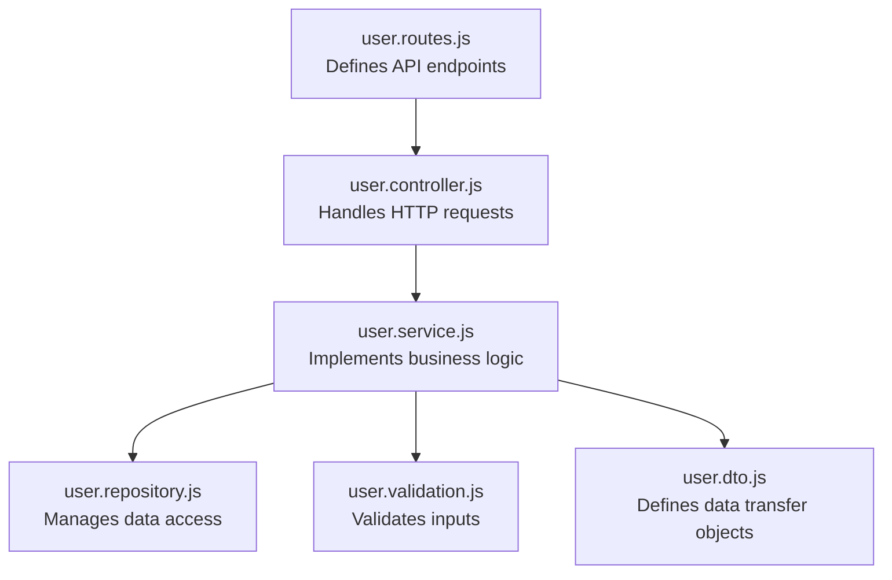
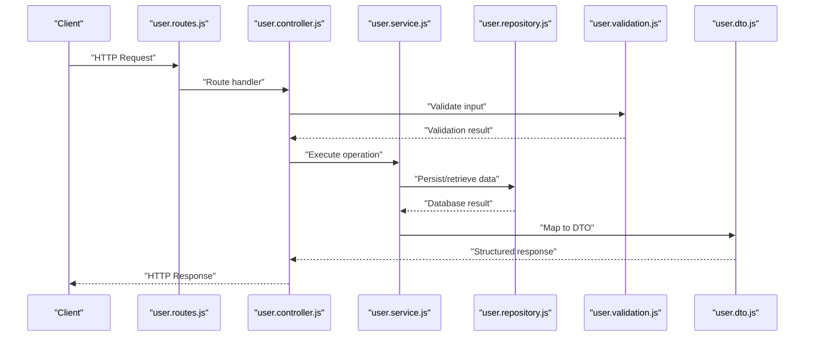
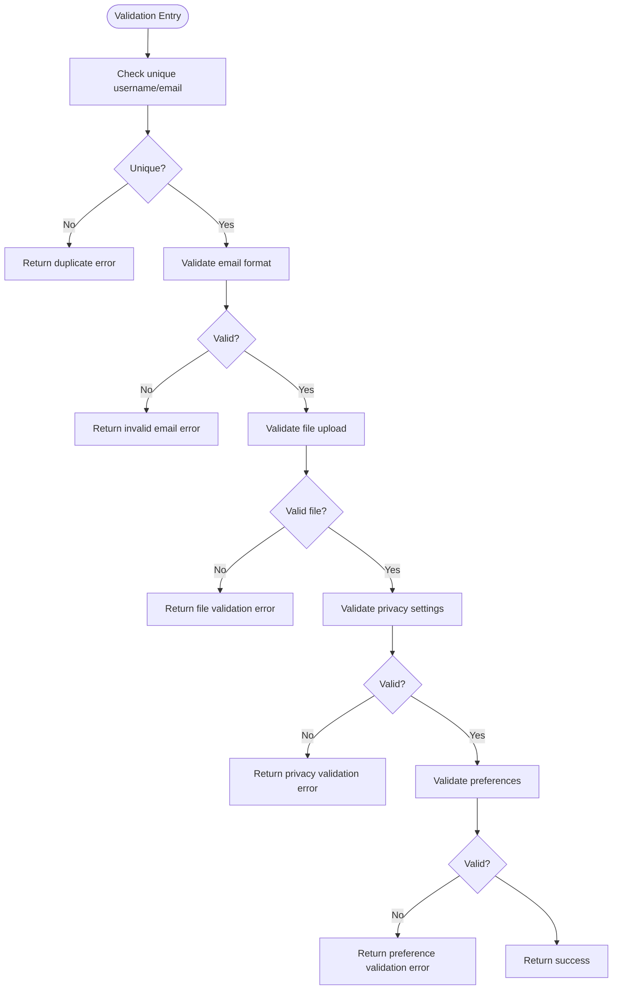
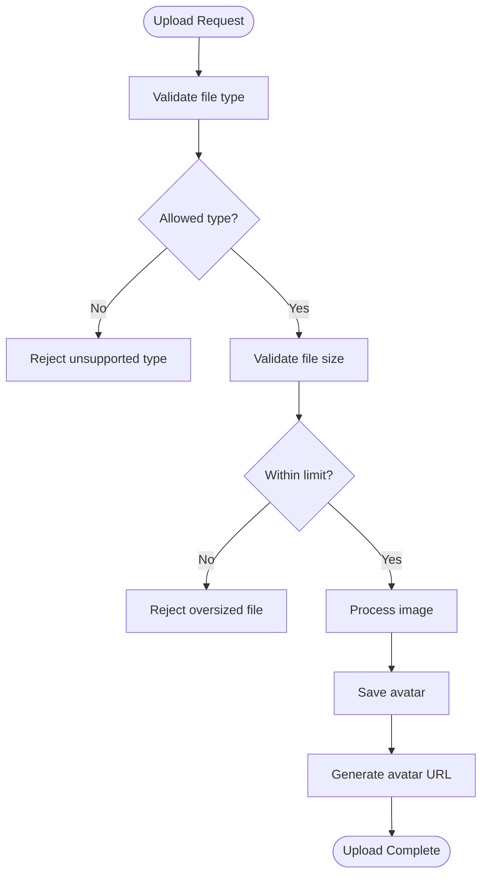
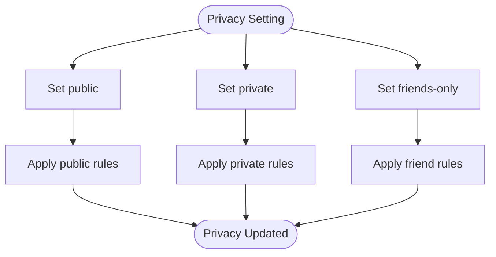
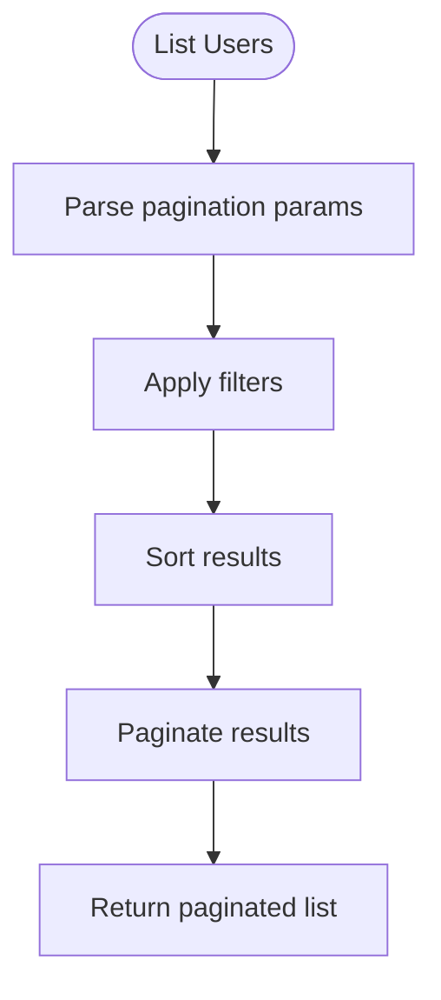
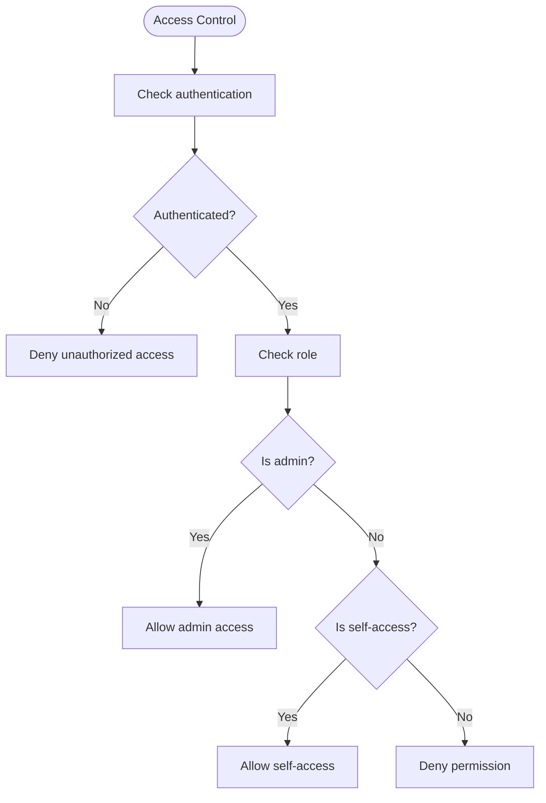
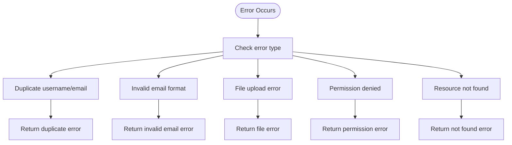
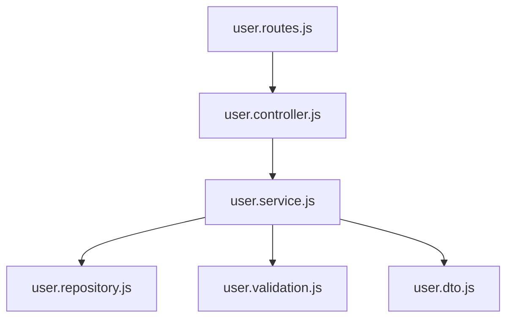

# User Management API

<cite>
**Referenced Files in This Document**
- [user.routes.js](file://backend/src/modules/users/user.routes.js)
- [user.controller.js](file://backend/src/modules/users/user.controller.js)
- [user.service.js](file://backend/src/modules/users/user.service.js)
- [user.repository.js](file://backend/src/modules/users/user.repository.js)
- [user.validation.js](file://backend/src/modules/users/user.validation.js)
- [user.dto.js](file://backend/src/dto/user.dto.js)
</cite>

## Table of Contents
1. [Introduction](#introduction)
2. [Project Structure](#project-structure)
3. [Core Components](#core-components)
4. [Architecture Overview](#architecture-overview)
5. [Detailed Component Analysis](#detailed-component-analysis)
6. [Dependency Analysis](#dependency-analysis)
7. [Performance Considerations](#performance-considerations)
8. [Troubleshooting Guide](#troubleshooting-guide)
9. [Conclusion](#conclusion)

## Introduction
This document provides comprehensive API documentation for user management endpoints in a social media application. It covers user profile CRUD operations, profile updates, avatar uploads, account settings, user search, viewing profiles, preference management, request validation, image upload handling, privacy settings, pagination, filtering, permissions, role-based access control, and error handling. The documentation is derived from the backend module structure and DTO definitions present in the repository.

## Project Structure
The user management functionality is organized into a modular backend structure under the users module. The primary components include routing, controller, service, repository, validation, and DTO definitions. These components work together to handle user-related requests, enforce validation rules, manage persistence, and return standardized responses.

**Diagram sources**
- [user.routes.js](file://backend/src/modules/users/user.routes.js)
- [user.controller.js](file://backend/src/modules/users/user.controller.js)
- [user.service.js](file://backend/src/modules/users/user.service.js)
- [user.repository.js](file://backend/src/modules/users/user.repository.js)
- [user.validation.js](file://backend/src/modules/users/user.validation.js)
- [user.dto.js](file://backend/src/dto/user.dto.js)

**Section sources**
- [user.routes.js](file://backend/src/modules/users/user.routes.js)
- [user.controller.js](file://backend/src/modules/users/user.controller.js)
- [user.service.js](file://backend/src/modules/users/user.service.js)
- [user.repository.js](file://backend/src/modules/users/user.repository.js)
- [user.validation.js](file://backend/src/modules/users/user.validation.js)
- [user.dto.js](file://backend/src/dto/user.dto.js)

## Core Components
- Routing Layer: Defines endpoint URLs, HTTP methods, and request/response patterns for user operations.
- Controller Layer: Receives incoming requests, delegates to the service layer, and returns appropriate HTTP responses.
- Service Layer: Implements business logic such as validation, data transformation, and orchestrating repository operations.
- Repository Layer: Handles database interactions and data retrieval/persistence.
- Validation Layer: Enforces input validation rules for user-related operations.
- DTO Layer: Standardizes data structures for request and response payloads.

**Section sources**
- [user.routes.js](file://backend/src/modules/users/user.routes.js)
- [user.controller.js](file://backend/src/modules/users/user.controller.js)
- [user.service.js](file://backend/src/modules/users/user.service.js)
- [user.repository.js](file://backend/src/modules/users/user.repository.js)
- [user.validation.js](file://backend/src/modules/users/user.validation.js)
- [user.dto.js](file://backend/src/dto/user.dto.js)

## Architecture Overview
The user management API follows a layered architecture pattern. Requests flow from routes to the controller, which invokes the service layer. The service layer performs validation, interacts with the repository for persistence, and returns structured responses via DTOs. Validation ensures data integrity, while the repository abstracts database operations.

**Diagram sources**
- [user.routes.js](file://backend/src/modules/users/user.routes.js)
- [user.controller.js](file://backend/src/modules/users/user.controller.js)
- [user.service.js](file://backend/src/modules/users/user.service.js)
- [user.repository.js](file://backend/src/modules/users/user.repository.js)
- [user.validation.js](file://backend/src/modules/users/user.validation.js)
- [user.dto.js](file://backend/src/dto/user.dto.js)

## Detailed Component Analysis

### Endpoint Definitions and Responsibilities
- Profile CRUD Operations: Retrieve, update, delete user profiles.
- Profile Updates: Modify user attributes with validation.
- Avatar Uploads: Handle image uploads with size/type restrictions.
- Account Settings: Manage privacy settings and preferences.
- User Search: Filter and paginate user listings.
- Viewing Profiles: Public/private profile visibility based on permissions.
- Managing Preferences: Store and update user-specific preferences.

Note: The current implementation files are placeholders. The following specifications define the expected behavior and data structures.

**Section sources**
- [user.routes.js](file://backend/src/modules/users/user.routes.js)
- [user.controller.js](file://backend/src/modules/users/user.controller.js)
- [user.service.js](file://backend/src/modules/users/user.service.js)
- [user.repository.js](file://backend/src/modules/users/user.repository.js)
- [user.validation.js](file://backend/src/modules/users/user.validation.js)
- [user.dto.js](file://backend/src/dto/user.dto.js)

### Request Validation
Validation enforces:
- Unique usernames and emails.
- Valid email formats.
- File upload restrictions (type, size).
- Privacy setting constraints.
- Preference value constraints.

**Diagram sources**
- [user.validation.js](file://backend/src/modules/users/user.validation.js)

**Section sources**
- [user.validation.js](file://backend/src/modules/users/user.validation.js)

### Image Upload Handling
Upload handling includes:
- Supported image types and maximum file size limits.
- Temporary storage and processing pipeline.
- Avatar URL generation and persistence.
- Cleanup of failed uploads.

**Diagram sources**
- [user.validation.js](file://backend/src/modules/users/user.validation.js)
- [user.service.js](file://backend/src/modules/users/user.service.js)

**Section sources**
- [user.validation.js](file://backend/src/modules/users/user.validation.js)
- [user.service.js](file://backend/src/modules/users/user.service.js)

### Profile Privacy Settings
Privacy controls include:
- Public profile visibility.
- Private profile visibility.
- Friend-only visibility.
- Preference-based visibility rules.

**Diagram sources**
- [user.validation.js](file://backend/src/modules/users/user.validation.js)
- [user.service.js](file://backend/src/modules/users/user.service.js)

**Section sources**
- [user.validation.js](file://backend/src/modules/users/user.validation.js)
- [user.service.js](file://backend/src/modules/users/user.service.js)

### Pagination and Filtering for User Lists
Pagination and filtering support:
- Page number and page size parameters.
- Sorting options (e.g., newest, oldest, alphabetical).
- Filters for username, email, and registration date range.
- Cursor-based pagination for large datasets.

**Diagram sources**
- [user.service.js](file://backend/src/modules/users/user.service.js)
- [user.repository.js](file://backend/src/modules/users/user.repository.js)

**Section sources**
- [user.service.js](file://backend/src/modules/users/user.service.js)
- [user.repository.js](file://backend/src/modules/users/user.repository.js)

### Permissions and Role-Based Access Control
Access control includes:
- Authentication checks for protected endpoints.
- Role-based permissions (user, moderator, admin).
- Admin-only endpoints for user management.
- Self-service vs. admin privileges.

**Diagram sources**
- [user.controller.js](file://backend/src/modules/users/user.controller.js)
- [user.service.js](file://backend/src/modules/users/user.service.js)

**Section sources**
- [user.controller.js](file://backend/src/modules/users/user.controller.js)
- [user.service.js](file://backend/src/modules/users/user.service.js)

### Error Handling
Common errors and handling:
- Duplicate username/email: Unique constraint violation.
- Invalid email format: Regex validation failure.
- File upload restrictions: Type/size validation failure.
- Permission denied: Role-based access failure.
- Resource not found: Entity lookup failure.

**Diagram sources**
- [user.validation.js](file://backend/src/modules/users/user.validation.js)
- [user.controller.js](file://backend/src/modules/users/user.controller.js)
- [user.service.js](file://backend/src/modules/users/user.service.js)

**Section sources**
- [user.validation.js](file://backend/src/modules/users/user.validation.js)
- [user.controller.js](file://backend/src/modules/users/user.controller.js)
- [user.service.js](file://backend/src/modules/users/user.service.js)

## Dependency Analysis
The user module components depend on each other in a hierarchical manner. The controller depends on the service, which depends on the repository and validation layers. DTOs provide standardized structures for data exchange.

**Diagram sources**
- [user.routes.js](file://backend/src/modules/users/user.routes.js)
- [user.controller.js](file://backend/src/modules/users/user.controller.js)
- [user.service.js](file://backend/src/modules/users/user.service.js)
- [user.repository.js](file://backend/src/modules/users/user.repository.js)
- [user.validation.js](file://backend/src/modules/users/user.validation.js)
- [user.dto.js](file://backend/src/dto/user.dto.js)

**Section sources**
- [user.routes.js](file://backend/src/modules/users/user.routes.js)
- [user.controller.js](file://backend/src/modules/users/user.controller.js)
- [user.service.js](file://backend/src/modules/users/user.service.js)
- [user.repository.js](file://backend/src/modules/users/user.repository.js)
- [user.validation.js](file://backend/src/modules/users/user.validation.js)
- [user.dto.js](file://backend/src/dto/user.dto.js)

## Performance Considerations
- Indexing: Ensure database indexes on frequently queried fields (username, email, createdAt).
- Caching: Cache public profile data and popular user lists.
- Pagination: Always use pagination for listing endpoints to avoid large payloads.
- Validation: Perform lightweight validation in the controller and heavier checks in the service layer.
- Image Processing: Optimize image resizing and compression to reduce storage and bandwidth usage.

## Troubleshooting Guide
- Duplicate Username/Email: Verify uniqueness constraints and provide clear error messages.
- Invalid Email Format: Confirm regex patterns and normalize input before validation.
- File Upload Issues: Check supported types, size limits, and server disk space.
- Permission Denied: Review role-based access control logic and ensure proper authentication tokens.
- Resource Not Found: Validate entity existence and handle soft-deleted records appropriately.

**Section sources**
- [user.validation.js](file://backend/src/modules/users/user.validation.js)
- [user.controller.js](file://backend/src/modules/users/user.controller.js)
- [user.service.js](file://backend/src/modules/users/user.service.js)
- [user.repository.js](file://backend/src/modules/users/user.repository.js)

## Conclusion
The user management API is structured around a clean separation of concerns with dedicated layers for routing, controllers, services, repositories, validation, and DTOs. By adhering to the outlined validation rules, privacy settings, pagination, filtering, permissions, and error handling strategies, the API ensures robust, secure, and scalable user operations. The provided diagrams and component analyses serve as a blueprint for implementing and extending the user management functionality.