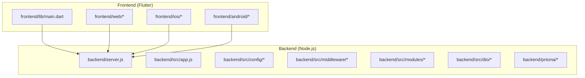
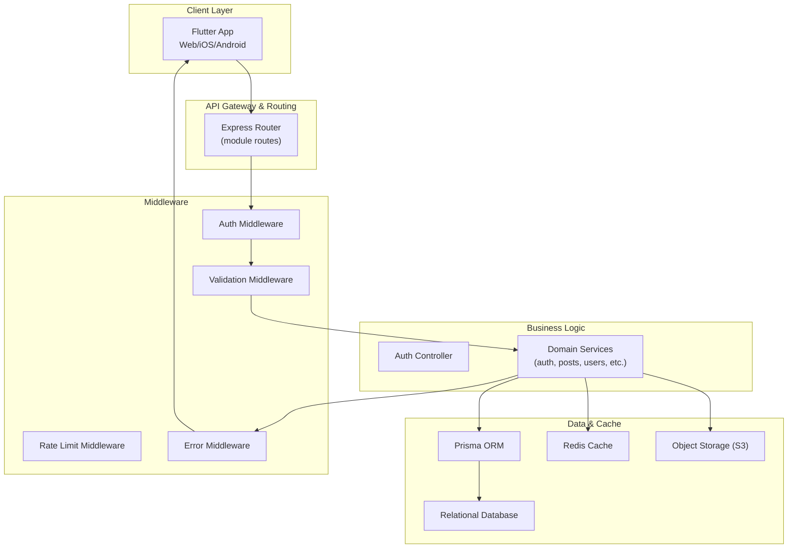
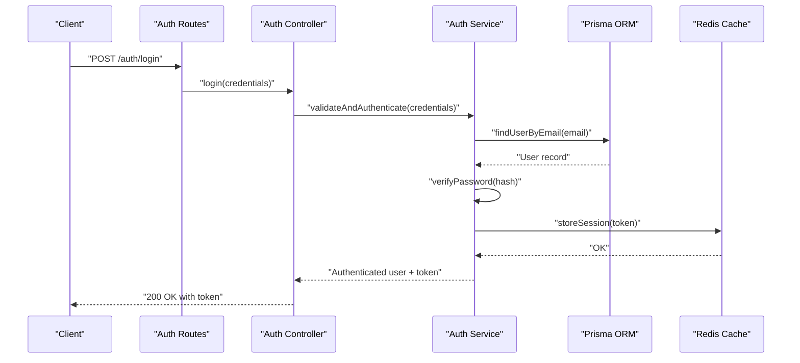
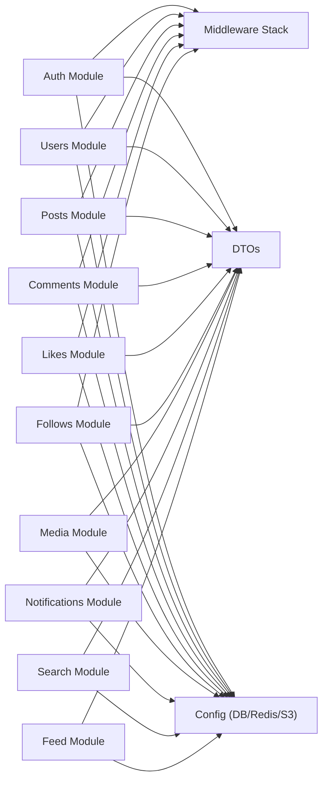
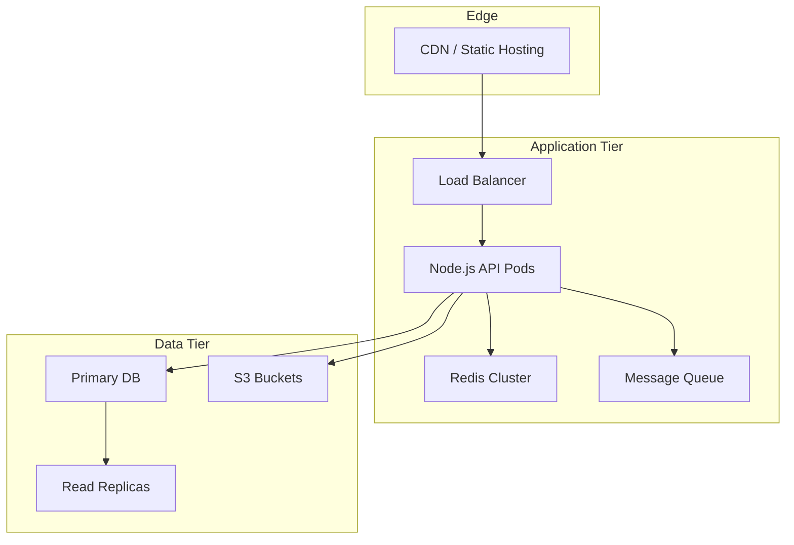

# Architecture Overview

<cite>
**Referenced Files in This Document**
- [main.dart](file://frontend/lib/main.dart)
- [server.js](file://backend/server.js)
- [app.js](file://backend/src/app.js)
- [db.js](file://backend/src/config/db.js)
- [redis.js](file://backend/src/config/redis.js)
- [s3.js](file://backend/src/config/s3.js)
- [auth.middleware.js](file://backend/src/middleware/auth.middleware.js)
- [error.middleware.js](file://backend/src/middleware/error.middleware.js)
- [rateLimit.middleware.js](file://backend/src/middleware/rateLimit.middleware.js)
- [validate.middleware.js](file://backend/src/middleware/validate.middleware.js)
- [auth.controller.js](file://backend/src/modules/auth/auth.controller.js)
- [auth.service.js](file://backend/src/modules/auth/auth.service.js)
- [auth.routes.js](file://backend/src/modules/auth/auth.routes.js)
- [auth.validation.js](file://backend/src/modules/auth/auth.validation.js)
- [user.dto.js](file://backend/src/dto/user.dto.js)
- [post.dto.js](file://backend/src/dto/post.dto.js)
- [roles.js](file://backend/src/constants/roles.js)
- [errors.js](file://backend/src/constants/errors.js)
- [schema.prisma](file://backend/prisma/schema.prisma)
</cite>

## Table of Contents
1. [Introduction](#introduction)
2. [Project Structure](#project-structure)
3. [Core Components](#core-components)
4. [Architecture Overview](#architecture-overview)
5. [Detailed Component Analysis](#detailed-component-analysis)
6. [Dependency Analysis](#dependency-analysis)
7. [Performance Considerations](#performance-considerations)
8. [Security Architecture](#security-architecture)
9. [Scalability Considerations](#scalability-considerations)
10. [Deployment Topology](#deployment-topology)
11. [Troubleshooting Guide](#troubleshooting-guide)
12. [Conclusion](#conclusion)

## Introduction
This document presents the architectural overview of a social media application featuring a Flutter-based mobile/web frontend and a Node.js-powered backend. The backend employs Prisma ORM for database abstraction and follows a modular structure organized by domain capabilities such as authentication, users, posts, comments, likes, follows, media, notifications, search, and feed. The system emphasizes separation of concerns, layered architecture, and scalable integration points for future growth.

## Project Structure
The repository is organized into two primary areas:
- Frontend: Flutter application entry point and platform-specific configurations
- Backend: Node.js server with modular domain modules, configuration, DTOs, middleware, and Prisma schema

**Diagram sources**
- [main.dart:1-126](file://frontend/lib/main.dart#L1-L126)
- [server.js:1-1](file://backend/server.js#L1-L1)
- [app.js:1-1](file://backend/src/app.js#L1-L1)

**Section sources**
- [main.dart:1-126](file://frontend/lib/main.dart#L1-L126)
- [server.js:1-1](file://backend/server.js#L1-L1)
- [app.js:1-1](file://backend/src/app.js#L1-L1)

## Core Components
- Frontend entry point initializes the Flutter application and sets up the base UI scaffold.
- Backend entry point defines the server bootstrap and integrates middleware and routing.
- Configuration layer manages database connections, Redis cache, and S3 storage integrations.
- Middleware stack enforces authentication, validation, rate limiting, and centralized error handling.
- Modular domain modules encapsulate business logic for authentication, users, posts, comments, likes, follows, media, notifications, search, and feed.
- DTOs define structured request/response contracts for type safety and validation.
- Prisma schema models the relational data layer and enables database migrations and queries.

**Section sources**
- [main.dart:1-126](file://frontend/lib/main.dart#L1-L126)
- [server.js:1-1](file://backend/server.js#L1-L1)
- [db.js:1-1](file://backend/src/config/db.js#L1-L1)
- [redis.js:1-1](file://backend/src/config/redis.js#L1-L1)
- [s3.js:1-1](file://backend/src/config/s3.js#L1-L1)
- [auth.middleware.js:1-1](file://backend/src/middleware/auth.middleware.js#L1-L1)
- [error.middleware.js:1-1](file://backend/src/middleware/error.middleware.js#L1-L1)
- [rateLimit.middleware.js:1-1](file://backend/src/middleware/rateLimit.middleware.js#L1-L1)
- [validate.middleware.js:1-1](file://backend/src/middleware/validate.middleware.js#L1-L1)
- [auth.controller.js:1-1](file://backend/src/modules/auth/auth.controller.js#L1-L1)
- [auth.service.js:1-1](file://backend/src/modules/auth/auth.service.js#L1-L1)
- [auth.routes.js:1-1](file://backend/src/modules/auth/auth.routes.js#L1-L1)
- [auth.validation.js:1-1](file://backend/src/modules/auth/auth.validation.js#L1-L1)
- [user.dto.js:1-1](file://backend/src/dto/user.dto.js#L1-L1)
- [post.dto.js:1-1](file://backend/src/dto/post.dto.js#L1-L1)
- [roles.js:1-1](file://backend/src/constants/roles.js#L1-L1)
- [errors.js:1-1](file://backend/src/constants/errors.js#L1-L1)
- [schema.prisma:1-1](file://backend/prisma/schema.prisma#L1-L1)

## Architecture Overview
The system follows a full-stack architecture:
- Frontend: Flutter mobile/web application rendering UI and orchestrating user interactions
- Backend: Node.js server exposing RESTful APIs and managing domain logic
- Data Access: Prisma ORM abstracting database operations
- Storage: Redis for caching and S3 for media assets
- Authentication: JWT-based middleware enforcing secure access

**Diagram sources**
- [server.js:1-1](file://backend/server.js#L1-L1)
- [auth.middleware.js:1-1](file://backend/src/middleware/auth.middleware.js#L1-L1)
- [validate.middleware.js:1-1](file://backend/src/middleware/validate.middleware.js#L1-L1)
- [rateLimit.middleware.js:1-1](file://backend/src/middleware/rateLimit.middleware.js#L1-L1)
- [error.middleware.js:1-1](file://backend/src/middleware/error.middleware.js#L1-L1)
- [auth.controller.js:1-1](file://backend/src/modules/auth/auth.controller.js#L1-L1)
- [auth.service.js:1-1](file://backend/src/modules/auth/auth.service.js#L1-L1)
- [auth.routes.js:1-1](file://backend/src/modules/auth/auth.routes.js#L1-L1)
- [db.js:1-1](file://backend/src/config/db.js#L1-L1)
- [redis.js:1-1](file://backend/src/config/redis.js#L1-L1)
- [s3.js:1-1](file://backend/src/config/s3.js#L1-L1)
- [schema.prisma:1-1](file://backend/prisma/schema.prisma#L1-L1)

## Detailed Component Analysis

### Frontend Entry Point
- Initializes the Flutter application and sets up the base Material theme and home page scaffold.
- Provides a foundation for navigation and widget composition across platforms.

**Section sources**
- [main.dart:1-126](file://frontend/lib/main.dart#L1-L126)

### Backend Entry Point and Application Bootstrap
- Defines the server initialization and integrates middleware and module routes.
- Acts as the central coordination point for incoming requests.

**Section sources**
- [server.js:1-1](file://backend/server.js#L1-L1)
- [app.js:1-1](file://backend/src/app.js#L1-L1)

### Authentication Module
- Controller handles authentication endpoints (login, register, logout).
- Service encapsulates business logic for token generation, password hashing, and user verification.
- Routes define endpoint contracts for authentication operations.
- Validation enforces input constraints and sanitization.
- Middleware enforces authentication checks across protected routes.

**Diagram sources**
- [auth.routes.js:1-1](file://backend/src/modules/auth/auth.routes.js#L1-L1)
- [auth.controller.js:1-1](file://backend/src/modules/auth/auth.controller.js#L1-L1)
- [auth.service.js:1-1](file://backend/src/modules/auth/auth.service.js#L1-L1)
- [db.js:1-1](file://backend/src/config/db.js#L1-L1)
- [redis.js:1-1](file://backend/src/config/redis.js#L1-L1)

**Section sources**
- [auth.controller.js:1-1](file://backend/src/modules/auth/auth.controller.js#L1-L1)
- [auth.service.js:1-1](file://backend/src/modules/auth/auth.service.js#L1-L1)
- [auth.routes.js:1-1](file://backend/src/modules/auth/auth.routes.js#L1-L1)
- [auth.validation.js:1-1](file://backend/src/modules/auth/auth.validation.js#L1-L1)
- [auth.middleware.js:1-1](file://backend/src/middleware/auth.middleware.js#L1-L1)

### DTOs and Validation
- User DTO defines standardized user input/output structures.
- Post DTO structures post-related payloads.
- Validation middleware ensures request payloads conform to defined schemas.

**Section sources**
- [user.dto.js:1-1](file://backend/src/dto/user.dto.js#L1-L1)
- [post.dto.js:1-1](file://backend/src/dto/post.dto.js#L1-L1)
- [validate.middleware.js:1-1](file://backend/src/middleware/validate.middleware.js#L1-L1)

### Data Access and Caching
- Prisma ORM abstracts database operations and enforces schema-driven data modeling.
- Redis cache accelerates read-heavy operations and session storage.
- S3 integration stores and serves media assets.

**Section sources**
- [schema.prisma:1-1](file://backend/prisma/schema.prisma#L1-L1)
- [db.js:1-1](file://backend/src/config/db.js#L1-L1)
- [redis.js:1-1](file://backend/src/config/redis.js#L1-L1)
- [s3.js:1-1](file://backend/src/config/s3.js#L1-L1)

### Error Handling and Rate Limiting
- Centralized error middleware standardizes error responses.
- Rate limit middleware protects endpoints from abuse.

**Section sources**
- [error.middleware.js:1-1](file://backend/src/middleware/error.middleware.js#L1-L1)
- [rateLimit.middleware.js:1-1](file://backend/src/middleware/rateLimit.middleware.js#L1-L1)

## Dependency Analysis
The backend modules depend on shared configuration, middleware, and DTOs. Authentication is a foundational module that influences other modules via middleware and shared constants.

**Diagram sources**
- [auth.middleware.js:1-1](file://backend/src/middleware/auth.middleware.js#L1-L1)
- [auth.controller.js:1-1](file://backend/src/modules/auth/auth.controller.js#L1-L1)
- [auth.service.js:1-1](file://backend/src/modules/auth/auth.service.js#L1-L1)
- [auth.routes.js:1-1](file://backend/src/modules/auth/auth.routes.js#L1-L1)
- [user.dto.js:1-1](file://backend/src/dto/user.dto.js#L1-L1)
- [post.dto.js:1-1](file://backend/src/dto/post.dto.js#L1-L1)
- [db.js:1-1](file://backend/src/config/db.js#L1-L1)
- [redis.js:1-1](file://backend/src/config/redis.js#L1-L1)
- [s3.js:1-1](file://backend/src/config/s3.js#L1-L1)

**Section sources**
- [roles.js:1-1](file://backend/src/constants/roles.js#L1-L1)
- [errors.js:1-1](file://backend/src/constants/errors.js#L1-L1)

## Performance Considerations
- Caching: Use Redis for frequently accessed data (e.g., user sessions, feed items) to reduce database load.
- Database Indexing: Ensure Prisma schema includes appropriate indexes for high-traffic fields (e.g., user email, post timestamps).
- Pagination: Implement cursor-based pagination for feed and comment lists to limit payload sizes.
- Asynchronous Processing: Offload heavy tasks (e.g., image resizing, notifications) to background workers.
- CDN: Serve media assets via S3 with CDN acceleration for global distribution.

## Security Architecture
- Authentication: JWT tokens issued after successful login; protected routes enforced by middleware.
- Authorization: Role-based access control using constants and middleware guards.
- Input Validation: Strict DTO validation and sanitization to prevent injection attacks.
- Rate Limiting: Throttling to mitigate brute force and abuse attempts.
- Secure Storage: Sensitive credentials stored via environment variables and secret managers.

**Section sources**
- [auth.middleware.js:1-1](file://backend/src/middleware/auth.middleware.js#L1-L1)
- [roles.js:1-1](file://backend/src/constants/roles.js#L1-L1)
- [rateLimit.middleware.js:1-1](file://backend/src/middleware/rateLimit.middleware.js#L1-L1)
- [validate.middleware.js:1-1](file://backend/src/middleware/validate.middleware.js#L1-L1)

## Scalability Considerations
- Horizontal Scaling: Stateless backend allows easy scaling behind load balancers.
- Microservice Boundaries: Consider extracting modules (e.g., notifications, media) into dedicated services as traffic grows.
- Database Sharding: Partition data by user ID or region for large-scale deployments.
- Queue-Based Workflows: Use message queues for asynchronous tasks (likes, comments, notifications).
- Monitoring: Add metrics and logging for latency, error rates, and throughput.

## Deployment Topology
- Frontend: Host Flutter web builds on static hosting or CDN; native apps distributed via respective stores.
- Backend: Deploy Node.js server on container orchestration platforms (e.g., Kubernetes) with autoscaling.
- Database: Managed relational database service with read replicas and backups.
- Cache: Managed Redis service or self-hosted cluster.
- Storage: S3-compatible object storage for media and backups.

[No sources needed since this diagram shows conceptual deployment topology]

## Troubleshooting Guide
- Authentication Failures: Verify JWT token issuance and middleware enforcement; check Redis connectivity for session storage.
- Validation Errors: Review DTO schemas and validation middleware logs.
- Database Connectivity: Confirm Prisma connection settings and network policies.
- Rate Limit Exceeded: Adjust limits or implement client-side retry with exponential backoff.
- Media Upload Issues: Validate S3 permissions and CORS configuration.

**Section sources**
- [error.middleware.js:1-1](file://backend/src/middleware/error.middleware.js#L1-L1)
- [rateLimit.middleware.js:1-1](file://backend/src/middleware/rateLimit.middleware.js#L1-L1)
- [db.js:1-1](file://backend/src/config/db.js#L1-L1)
- [redis.js:1-1](file://backend/src/config/redis.js#L1-L1)
- [s3.js:1-1](file://backend/src/config/s3.js#L1-L1)

## Conclusion
The social media application adopts a clean, modular backend architecture with clear separation of concerns and robust integration points. The Flutter frontend provides a unified UX across platforms, while the Node.js backend leverages Prisma ORM, Redis, and S3 to support scalable and secure operations. The documented patterns and components offer a solid foundation for iterative development and future enhancements.