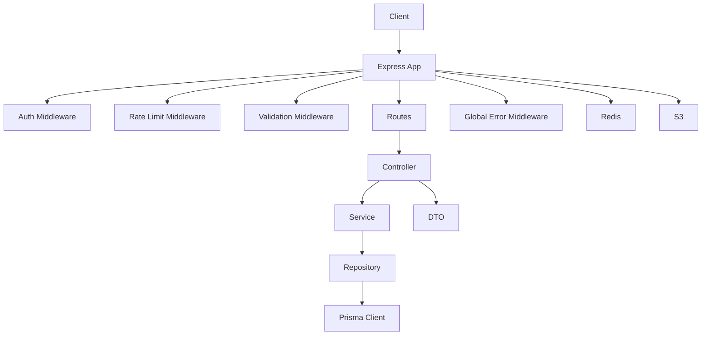
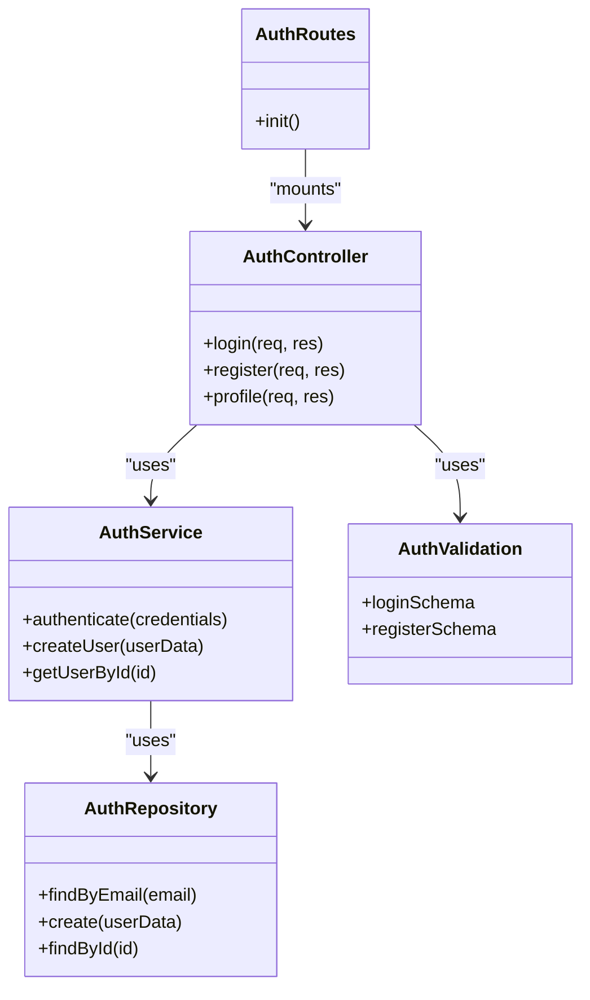
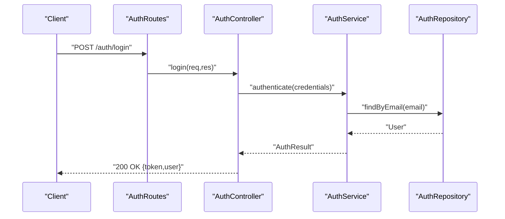
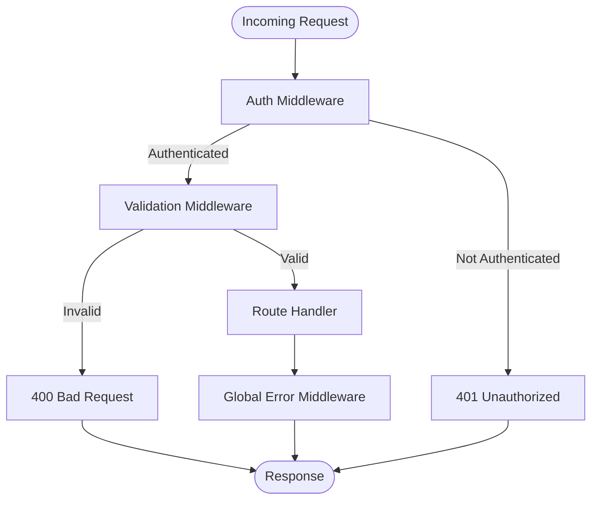
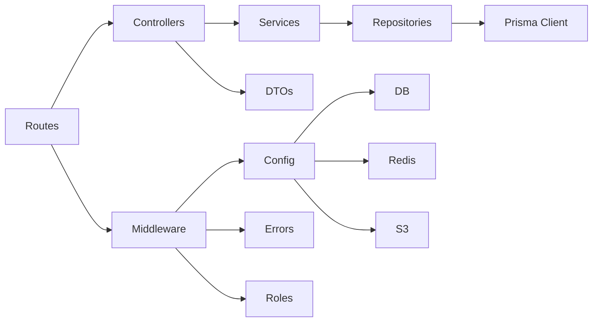

# Backend Architecture

<cite>
**Referenced Files in This Document**
- [server.js](file://backend/server.js)
- [app.js](file://backend/src/app.js)
- [db.js](file://backend/src/config/db.js)
- [redis.js](file://backend/src/config/redis.js)
- [s3.js](file://backend/src/config/s3.js)
- [auth.middleware.js](file://backend/src/middleware/auth.middleware.js)
- [error.middleware.js](file://backend/src/middleware/error.middleware.js)
- [rateLimit.middleware.js](file://backend/src/middleware/rateLimit.middleware.js)
- [validate.middleware.js](file://backend/src/middleware/validate.middleware.js)
- [auth.controller.js](file://backend/src/modules/auth/auth.controller.js)
- [auth.service.js](file://backend/src/modules/auth/auth.service.js)
- [auth.repository.js](file://backend/src/modules/auth/auth.repository.js)
- [auth.routes.js](file://backend/src/modules/auth/auth.routes.js)
- [auth.validation.js](file://backend/src/modules/auth/auth.validation.js)
- [post.dto.js](file://backend/src/dto/post.dto.js)
- [user.dto.js](file://backend/src/dto/user.dto.js)
- [errors.js](file://backend/src/constants/errors.js)
- [roles.js](file://backend/src/constants/roles.js)
</cite>

## Table of Contents
1. [Introduction](#introduction)
2. [Project Structure](#project-structure)
3. [Core Components](#core-components)
4. [Architecture Overview](#architecture-overview)
5. [Detailed Component Analysis](#detailed-component-analysis)
6. [Dependency Analysis](#dependency-analysis)
7. [Performance Considerations](#performance-considerations)
8. [Troubleshooting Guide](#troubleshooting-guide)
9. [Conclusion](#conclusion)

## Introduction
This document describes the backend architecture of a Node.js-based social media API. The system is organized around a modular structure with clear separation of concerns across authentication, posts, users, comments, likes, follows, notifications, media, and search modules. It documents the middleware stack, DTO patterns, utility functions, Express.js routing, error handling, configuration management, dependency injection patterns, service-layer architecture, business logic organization, inter-module communication, security middleware, validation patterns, and logging strategies.

## Project Structure
The backend is structured into feature-focused modules under a layered architecture:
- Configuration: database, Redis cache, and S3 storage integrations
- Middleware: authentication, rate limiting, validation, and global error handling
- DTOs: request/response data transfer objects
- Modules: feature-specific controllers, services, repositories, validations, and routes
- Routes: module-specific route definitions
- Constants: error messages and roles
- Utilities: shared helpers

```mermaid
graph TB
subgraph "Entry Point"
Server["server.js"]
App["src/app.js"]
end
subgraph "Configuration"
DB["src/config/db.js"]
Redis["src/config/redis.js"]
S3["src/config/s3.js"]
end
subgraph "Middleware"
AuthMW["src/middleware/auth.middleware.js"]
RateMW["src/middleware/rateLimit.middleware.js"]
ValidateMW["src/middleware/validate.middleware.js"]
ErrorMW["src/middleware/error.middleware.js"]
end
subgraph "DTOs"
PostDTO["src/dto/post.dto.js"]
UserDTO["src/dto/user.dto.js"]
end
subgraph "Constants"
Errors["src/constants/errors.js"]
Roles["src/constants/roles.js"]
end
subgraph "Modules"
Auth["src/modules/auth/*"]
Posts["src/modules/posts/*"]
Users["src/modules/users/*"]
Comments["src/modules/comments/*"]
Likes["src/modules/likes/*"]
Follows["src/modules/follows/*"]
Notifications["src/modules/notifications/*"]
Media["src/modules/media/*"]
Feed["src/modules/feed/*"]
Search["src/modules/search/*"]
end
Server --> App
App --> DB
App --> Redis
App --> S3
App --> AuthMW
App --> RateMW
App --> ValidateMW
App --> ErrorMW
App --> Auth
App --> Posts
App --> Users
App --> Comments
App --> Likes
App --> Follows
App --> Notifications
App --> Media
App --> Feed
App --> Search
App --> PostDTO
App --> UserDTO
App --> Errors
App --> Roles
```

**Diagram sources**
- [server.js](file://backend/server.js)
- [app.js](file://backend/src/app.js)
- [db.js](file://backend/src/config/db.js)
- [redis.js](file://backend/src/config/redis.js)
- [s3.js](file://backend/src/config/s3.js)
- [auth.middleware.js](file://backend/src/middleware/auth.middleware.js)
- [rateLimit.middleware.js](file://backend/src/middleware/rateLimit.middleware.js)
- [validate.middleware.js](file://backend/src/middleware/validate.middleware.js)
- [error.middleware.js](file://backend/src/middleware/error.middleware.js)
- [post.dto.js](file://backend/src/dto/post.dto.js)
- [user.dto.js](file://backend/src/dto/user.dto.js)
- [errors.js](file://backend/src/constants/errors.js)
- [roles.js](file://backend/src/constants/roles.js)

**Section sources**
- [server.js](file://backend/server.js)
- [app.js](file://backend/src/app.js)

## Core Components
- Configuration Management
  - Database connection initialization and lifecycle management
  - Redis client setup for caching and session-like storage
  - S3 client configuration for media uploads and retrieval
- Middleware Stack
  - Authentication middleware to enforce bearer tokens and attach user context
  - Validation middleware to standardize request validation errors
  - Rate limiting middleware to protect endpoints from abuse
  - Global error middleware to normalize error responses
- DTO Patterns
  - Request/response DTOs define canonical shapes for cross-module contracts
- Constants
  - Centralized error messages and role definitions for consistent behavior

**Section sources**
- [db.js](file://backend/src/config/db.js)
- [redis.js](file://backend/src/config/redis.js)
- [s3.js](file://backend/src/config/s3.js)
- [auth.middleware.js](file://backend/src/middleware/auth.middleware.js)
- [validate.middleware.js](file://backend/src/middleware/validate.middleware.js)
- [rateLimit.middleware.js](file://backend/src/middleware/rateLimit.middleware.js)
- [error.middleware.js](file://backend/src/middleware/error.middleware.js)
- [post.dto.js](file://backend/src/dto/post.dto.js)
- [user.dto.js](file://backend/src/dto/user.dto.js)
- [errors.js](file://backend/src/constants/errors.js)
- [roles.js](file://backend/src/constants/roles.js)

## Architecture Overview
The system follows a layered architecture:
- Entry point initializes the Express app and loads configuration
- Middleware stack runs before route handlers
- Controllers orchestrate requests, delegate to services, and return responses
- Services encapsulate business logic and coordinate repositories
- Repositories handle persistence via Prisma
- DTOs standardize data contracts
- Constants and utilities support cross-cutting concerns

**Diagram sources**
- [server.js](file://backend/server.js)
- [app.js](file://backend/src/app.js)
- [auth.middleware.js](file://backend/src/middleware/auth.middleware.js)
- [rateLimit.middleware.js](file://backend/src/middleware/rateLimit.middleware.js)
- [validate.middleware.js](file://backend/src/middleware/validate.middleware.js)
- [error.middleware.js](file://backend/src/middleware/error.middleware.js)
- [auth.controller.js](file://backend/src/modules/auth/auth.controller.js)
- [auth.service.js](file://backend/src/modules/auth/auth.service.js)
- [auth.repository.js](file://backend/src/modules/auth/auth.repository.js)
- [db.js](file://backend/src/config/db.js)
- [redis.js](file://backend/src/config/redis.js)
- [s3.js](file://backend/src/config/s3.js)

## Detailed Component Analysis

### Authentication Module
The authentication module demonstrates a clean separation of concerns:
- Controller handles HTTP concerns and delegates to the service
- Service encapsulates business logic (e.g., token generation, user lookup)
- Repository abstracts Prisma operations
- Validation enforces request schemas
- Routes define endpoint contracts
- Middleware enforces authentication for protected routes

**Diagram sources**
- [auth.controller.js](file://backend/src/modules/auth/auth.controller.js)
- [auth.service.js](file://backend/src/modules/auth/auth.service.js)
- [auth.repository.js](file://backend/src/modules/auth/auth.repository.js)
- [auth.validation.js](file://backend/src/modules/auth/auth.validation.js)
- [auth.routes.js](file://backend/src/modules/auth/auth.routes.js)

**Diagram sources**
- [auth.routes.js](file://backend/src/modules/auth/auth.routes.js)
- [auth.controller.js](file://backend/src/modules/auth/auth.controller.js)
- [auth.service.js](file://backend/src/modules/auth/auth.service.js)
- [auth.repository.js](file://backend/src/modules/auth/auth.repository.js)

**Section sources**
- [auth.controller.js](file://backend/src/modules/auth/auth.controller.js)
- [auth.service.js](file://backend/src/modules/auth/auth.service.js)
- [auth.repository.js](file://backend/src/modules/auth/auth.repository.js)
- [auth.validation.js](file://backend/src/modules/auth/auth.validation.js)
- [auth.routes.js](file://backend/src/modules/auth/auth.routes.js)

### DTO Patterns
DTOs define standardized request/response shapes:
- User DTO: defines shape for user-related payloads
- Post DTO: defines shape for post-related payloads

These DTOs are consumed by controllers and validated by the validation middleware to ensure consistent contracts across modules.

**Section sources**
- [user.dto.js](file://backend/src/dto/user.dto.js)
- [post.dto.js](file://backend/src/dto/post.dto.js)
- [validate.middleware.js](file://backend/src/middleware/validate.middleware.js)

### Middleware Stack
- Authentication middleware: verifies tokens and attaches user context
- Validation middleware: centralizes Joi/Zod-style validation and error formatting
- Rate limiting middleware: protects endpoints from excessive requests
- Global error middleware: normalizes thrown and caught errors into HTTP responses

**Diagram sources**
- [auth.middleware.js](file://backend/src/middleware/auth.middleware.js)
- [validate.middleware.js](file://backend/src/middleware/validate.middleware.js)
- [rateLimit.middleware.js](file://backend/src/middleware/rateLimit.middleware.js)
- [error.middleware.js](file://backend/src/middleware/error.middleware.js)

**Section sources**
- [auth.middleware.js](file://backend/src/middleware/auth.middleware.js)
- [validate.middleware.js](file://backend/src/middleware/validate.middleware.js)
- [rateLimit.middleware.js](file://backend/src/middleware/rateLimit.middleware.js)
- [error.middleware.js](file://backend/src/middleware/error.middleware.js)

### Configuration Management
- Database: Prisma client initialization and lifecycle
- Redis: client setup for caching and session-like storage
- S3: client configuration for media operations

Environment variables are expected to configure these clients; the configuration files act as factories or singletons.

**Section sources**
- [db.js](file://backend/src/config/db.js)
- [redis.js](file://backend/src/config/redis.js)
- [s3.js](file://backend/src/config/s3.js)

### Security and Validation
- Role-based access control is centralized in constants
- Validation middleware ensures consistent schema enforcement across endpoints
- Authentication middleware enforces bearer tokens and user context

**Section sources**
- [roles.js](file://backend/src/constants/roles.js)
- [validate.middleware.js](file://backend/src/middleware/validate.middleware.js)
- [auth.middleware.js](file://backend/src/middleware/auth.middleware.js)

### Logging Strategies
Logging is implemented at the middleware level to capture request lifecycle events and errors. The global error middleware ensures consistent error logging and response formatting.

**Section sources**
- [error.middleware.js](file://backend/src/middleware/error.middleware.js)

## Dependency Analysis
The modules depend on shared configuration, middleware, DTOs, and constants. Controllers depend on services, services depend on repositories, and repositories depend on Prisma. Routes mount controllers, and middleware intercept requests before they reach routes.

**Diagram sources**
- [auth.routes.js](file://backend/src/modules/auth/auth.routes.js)
- [auth.controller.js](file://backend/src/modules/auth/auth.controller.js)
- [auth.service.js](file://backend/src/modules/auth/auth.service.js)
- [auth.repository.js](file://backend/src/modules/auth/auth.repository.js)
- [db.js](file://backend/src/config/db.js)
- [redis.js](file://backend/src/config/redis.js)
- [s3.js](file://backend/src/config/s3.js)
- [error.middleware.js](file://backend/src/middleware/error.middleware.js)
- [errors.js](file://backend/src/constants/errors.js)
- [roles.js](file://backend/src/constants/roles.js)

**Section sources**
- [auth.routes.js](file://backend/src/modules/auth/auth.routes.js)
- [auth.controller.js](file://backend/src/modules/auth/auth.controller.js)
- [auth.service.js](file://backend/src/modules/auth/auth.service.js)
- [auth.repository.js](file://backend/src/modules/auth/auth.repository.js)
- [db.js](file://backend/src/config/db.js)
- [redis.js](file://backend/src/config/redis.js)
- [s3.js](file://backend/src/config/s3.js)
- [error.middleware.js](file://backend/src/middleware/error.middleware.js)
- [errors.js](file://backend/src/constants/errors.js)
- [roles.js](file://backend/src/constants/roles.js)

## Performance Considerations
- Use Redis for caching frequently accessed data and reducing database load
- Apply rate limiting to protect endpoints from abuse while maintaining responsiveness
- Validate requests early to fail fast and reduce unnecessary processing
- Keep DTOs minimal and aligned with actual use cases to reduce serialization overhead
- Ensure Prisma queries are efficient and use appropriate indexing

## Troubleshooting Guide
- Authentication failures: verify token presence and validity in the authentication middleware
- Validation errors: check validation schemas and ensure DTOs match expected shapes
- Database connectivity: confirm Prisma client initialization and environment variables
- Redis connectivity: verify Redis client configuration and network access
- S3 connectivity: validate S3 credentials and bucket permissions
- Global errors: inspect the global error middleware for consistent error responses

**Section sources**
- [auth.middleware.js](file://backend/src/middleware/auth.middleware.js)
- [validate.middleware.js](file://backend/src/middleware/validate.middleware.js)
- [db.js](file://backend/src/config/db.js)
- [redis.js](file://backend/src/config/redis.js)
- [s3.js](file://backend/src/config/s3.js)
- [error.middleware.js](file://backend/src/middleware/error.middleware.js)
- [errors.js](file://backend/src/constants/errors.js)

## Conclusion
The backend employs a modular, layered architecture with clear separation of concerns. The authentication module exemplifies the controller-service-repository pattern, while middleware ensures consistent security, validation, and error handling. Configuration management centralizes external integrations, and DTOs standardize contracts across modules. This design supports maintainability, scalability, and robustness for a social media API.