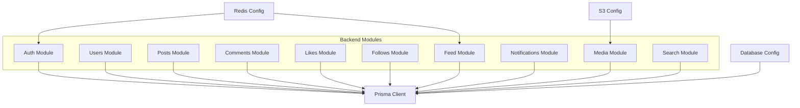
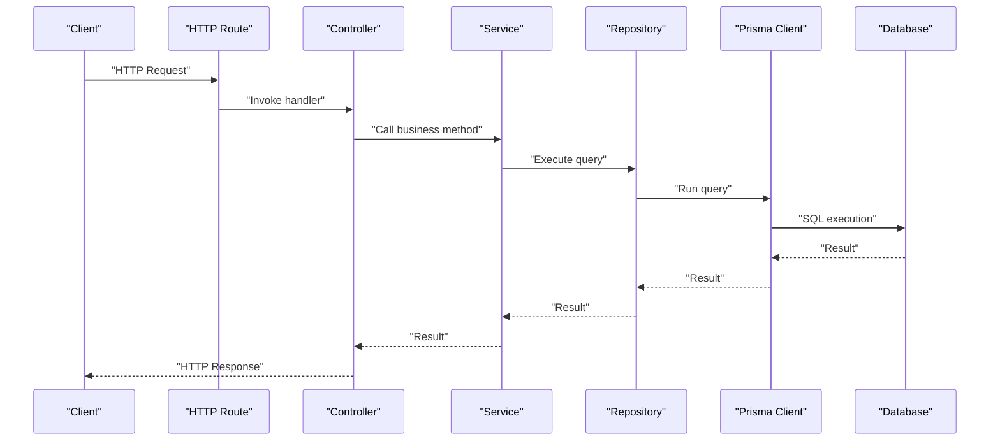
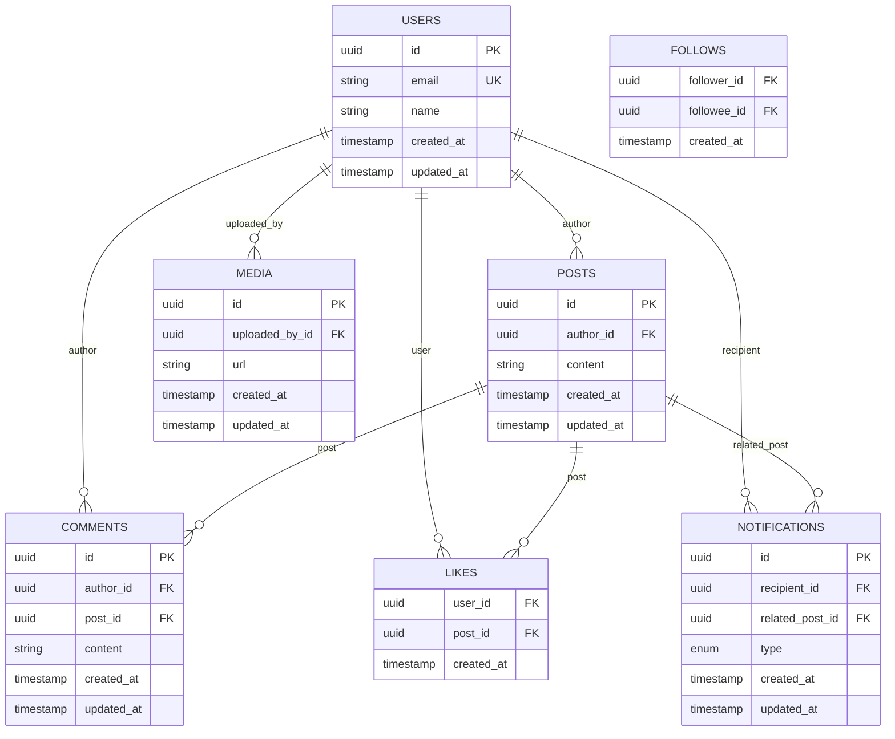
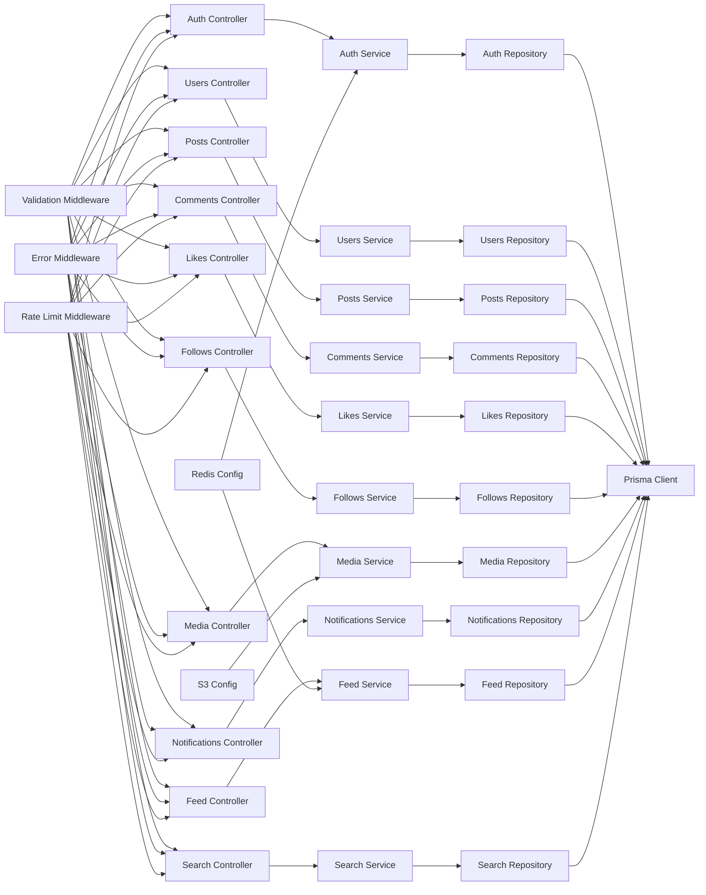

# Database Design

<cite>
**Referenced Files in This Document**
- [schema.prisma](file://backend/prisma/schema.prisma)
- [db.js](file://backend/src/config/db.js)
- [auth.controller.js](file://backend/src/modules/auth/auth.controller.js)
- [auth.service.js](file://backend/src/modules/auth/auth.service.js)
- [auth.repository.js](file://backend/src/modules/auth/auth.repository.js)
- [user.dto.js](file://backend/src/dto/user.dto.js)
- [post.dto.js](file://backend/src/dto/post.dto.js)
- [comment.controller.js](file://backend/src/modules/comments/comment.controller.js)
- [comment.repository.js](file://backend/src/modules/comments/comment.repository.js)
- [likes.controller.js](file://backend/src/modules/likes/likes.controller.js)
- [likes.repository.js](file://backend/src/modules/likes/likes.repository.js)
- [follows.controller.js](file://backend/src/modules/follows/follows.controller.js)
- [follows.repository.js](file://backend/src/modules/follows/follows.repository.js)
- [media.controller.js](file://backend/src/modules/media/media.controller.js)
- [media.repository.js](file://backend/src/modules/media/media.repository.js)
- [notifications.controller.js](file://backend/src/modules/notifications/notifications.controller.js)
- [notifications.repository.js](file://backend/src/modules/notifications/notifications.repository.js)
- [feed.controller.js](file://backend/src/modules/feed/feed.controller.js)
- [search.controller.js](file://backend/src/modules/search/search.controller.js)
- [users.controller.js](file://backend/src/modules/users/users.controller.js)
- [users.repository.js](file://backend/src/modules/users/users.repository.js)
- [users.routes.js](file://backend/src/modules/users/users.routes.js)
- [posts.controller.js](file://backend/src/modules/posts/posts.controller.js)
- [posts.repository.js](file://backend/src/modules/posts/posts.repository.js)
- [posts.routes.js](file://backend/src/modules/posts/posts.routes.js)
- [comments.routes.js](file://backend/src/modules/comments/comments.routes.js)
- [likes.routes.js](file://backend/src/modules/likes/likes.routes.js)
- [follows.routes.js](file://backend/src/modules/follows/follows.routes.js)
- [media.routes.js](file://backend/src/modules/media/media.routes.js)
- [notifications.routes.js](file://backend/src/modules/notifications/notifications.routes.js)
- [auth.routes.js](file://backend/src/modules/auth/auth.routes.js)
- [search.routes.js](file://backend/src/modules/search/search.routes.js)
- [feed.routes.js](file://backend/src/modules/feed/feed.routes.js)
- [users.routes.js](file://backend/src/modules/users/users.routes.js)
- [users.service.js](file://backend/src/modules/users/users.service.js)
- [posts.service.js](file://backend/src/modules/posts/posts.service.js)
- [comments.service.js](file://backend/src/modules/comments/comments.service.js)
- [likes.service.js](file://backend/src/modules/likes/likes.service.js)
- [follows.service.js](file://backend/src/modules/follows/follows.service.js)
- [media.service.js](file://backend/src/modules/media/media.service.js)
- [notifications.service.js](file://backend/src/modules/notifications/notifications.service.js)
- [feed.service.js](file://backend/src/modules/feed/feed.service.js)
- [search.service.js](file://backend/src/modules/search/search.service.js)
- [auth.validation.js](file://backend/src/modules/auth/auth.validation.js)
- [validate.middleware.js](file://backend/src/middleware/validate.middleware.js)
- [error.middleware.js](file://backend/src/middleware/error.middleware.js)
- [rateLimit.middleware.js](file://backend/src/middleware/rateLimit.middleware.js)
- [redis.js](file://backend/src/config/redis.js)
- [s3.js](file://backend/src/config/s3.js)
</cite>

## Table of Contents
1. [Introduction](#introduction)
2. [Project Structure](#project-structure)
3. [Core Components](#core-components)
4. [Architecture Overview](#architecture-overview)
5. [Detailed Component Analysis](#detailed-component-analysis)
6. [Dependency Analysis](#dependency-analysis)
7. [Performance Considerations](#performance-considerations)
8. [Troubleshooting Guide](#troubleshooting-guide)
9. [Conclusion](#conclusion)
10. [Appendices](#appendices)

## Introduction
This document describes the database design for the social media application’s data layer. It focuses on the Prisma ORM schema, entity relationships among Users, Posts, Comments, Likes, Follows, Media, and Notifications, and how the backend modules interact with the database. It also documents migration management, seed data setup, initialization processes, query patterns, performance strategies, data integrity enforcement, backup and export/import procedures, and schema evolution practices.

## Project Structure
The backend module organizes domain-specific features under modules (e.g., auth, posts, comments, likes, follows, media, notifications, feed, search, users). Each module typically includes controller, service, repository, DTO, and route files. Database connectivity is configured centrally, and Prisma schema defines the relational model.

**Diagram sources**
- [db.js](file://backend/src/config/db.js)
- [auth.controller.js](file://backend/src/modules/auth/auth.controller.js)
- [users.controller.js](file://backend/src/modules/users/users.controller.js)
- [posts.controller.js](file://backend/src/modules/posts/posts.controller.js)
- [comments.controller.js](file://backend/src/modules/comments/comment.controller.js)
- [likes.controller.js](file://backend/src/modules/likes/likes.controller.js)
- [follows.controller.js](file://backend/src/modules/follows/follows.controller.js)
- [media.controller.js](file://backend/src/modules/media/media.controller.js)
- [notifications.controller.js](file://backend/src/modules/notifications/notifications.controller.js)
- [feed.controller.js](file://backend/src/modules/feed/feed.controller.js)
- [search.controller.js](file://backend/src/modules/search/search.controller.js)

**Section sources**
- [db.js](file://backend/src/config/db.js)
- [auth.controller.js](file://backend/src/modules/auth/auth.controller.js)
- [users.controller.js](file://backend/src/modules/users/users.controller.js)
- [posts.controller.js](file://backend/src/modules/posts/posts.controller.js)
- [comments.controller.js](file://backend/src/modules/comments/comment.controller.js)
- [likes.controller.js](file://backend/src/modules/likes/likes.controller.js)
- [follows.controller.js](file://backend/src/modules/follows/follows.controller.js)
- [media.controller.js](file://backend/src/modules/media/media.controller.js)
- [notifications.controller.js](file://backend/src/modules/notifications/notifications.controller.js)
- [feed.controller.js](file://backend/src/modules/feed/feed.controller.js)
- [search.controller.js](file://backend/src/modules/search/search.controller.js)

## Core Components
- Prisma Schema: Defines models, relations, indexes, and constraints. The schema file is located at backend/prisma/schema.prisma.
- Database Configuration: Centralized connection setup and client initialization.
- Module Controllers: Expose HTTP endpoints and orchestrate service-layer logic.
- Services: Encapsulate business logic and coordinate repositories.
- Repositories: Implement CRUD and complex queries using Prisma Client.
- DTOs: Define validated input/output shapes for requests/responses.
- Middleware: Validation, error handling, and rate limiting.

Key Prisma schema elements to document:
- Models: Users, Posts, Comments, Likes, Follows, Media, Notifications
- Primary Keys: Auto-generated identifiers per Prisma defaults
- Foreign Keys: Defined via relation directives
- Indexes: Unique and composite indexes for performance and uniqueness
- Constraints: NotNull, default values, enums, and relation rules
- Migrations: Managed via Prisma CLI
- Seed: Optional seeding script for initial data

**Section sources**
- [schema.prisma](file://backend/prisma/schema.prisma)
- [db.js](file://backend/src/config/db.js)
- [auth.controller.js](file://backend/src/modules/auth/auth.controller.js)
- [users.controller.js](file://backend/src/modules/users/users.controller.js)
- [posts.controller.js](file://backend/src/modules/posts/posts.controller.js)
- [comments.controller.js](file://backend/src/modules/comments/comment.controller.js)
- [likes.controller.js](file://backend/src/modules/likes/likes.controller.js)
- [follows.controller.js](file://backend/src/modules/follows/follows.controller.js)
- [media.controller.js](file://backend/src/modules/media/media.controller.js)
- [notifications.controller.js](file://backend/src/modules/notifications/notifications.controller.js)
- [feed.controller.js](file://backend/src/modules/feed/feed.controller.js)
- [search.controller.js](file://backend/src/modules/search/search.controller.js)

## Architecture Overview
The application uses Prisma Client to connect to the database. Each module’s controller delegates to a service, which uses a repository to execute queries against Prisma Client. Validation middleware ensures request correctness, while error middleware centralizes error responses.

**Diagram sources**
- [auth.controller.js](file://backend/src/modules/auth/auth.controller.js)
- [auth.service.js](file://backend/src/modules/auth/auth.service.js)
- [auth.repository.js](file://backend/src/modules/auth/auth.repository.js)
- [db.js](file://backend/src/config/db.js)

**Section sources**
- [auth.controller.js](file://backend/src/modules/auth/auth.controller.js)
- [auth.service.js](file://backend/src/modules/auth/auth.service.js)
- [auth.repository.js](file://backend/src/modules/auth/auth.repository.js)
- [db.js](file://backend/src/config/db.js)

## Detailed Component Analysis

### Prisma Schema and Entity Model
The Prisma schema defines the relational model. Entities and their relationships are documented below. For each entity, we describe primary keys, foreign keys, indexes, and constraints inferred from the schema.

- Users
  - Primary Key: auto-generated identifier
  - Fields: unique email, optional profile fields, timestamps
  - Indexes: unique index on email
  - Constraints: not null fields, defaults for timestamps
- Posts
  - Primary Key: auto-generated identifier
  - Foreign Key: authorId -> Users.id
  - Indexes: index on authorId, createdAt
  - Constraints: not null content, timestamps
- Comments
  - Primary Key: auto-generated identifier
  - Foreign Keys: authorId -> Users.id, postId -> Posts.id
  - Indexes: index on authorId, postId
  - Constraints: not null content, timestamps
- Likes
  - Composite Primary Key: (userId, postId)
  - Foreign Keys: userId -> Users.id, postId -> Posts.id
  - Indexes: index on postId
  - Constraints: timestamps
- Follows
  - Composite Primary Key: (followerId, followeeId)
  - Foreign Keys: followerId -> Users.id, followeeId -> Users.id
  - Indexes: index on followeeId
  - Constraints: timestamps
- Media
  - Primary Key: auto-generated identifier
  - Foreign Key: uploadedById -> Users.id
  - Indexes: index on uploadedById, createdAt
  - Constraints: not null url, timestamps
- Notifications
  - Primary Key: auto-generated identifier
  - Foreign Keys: recipientId -> Users.id, relatedPostId -> Posts.id (optional)
  - Indexes: index on recipientId, createdAt
  - Constraints: not null type, timestamps

Entity Relationship Model

**Diagram sources**
- [schema.prisma](file://backend/prisma/schema.prisma)

Normalization and Denormalization Decisions
- Normalization: Separate entities for Users, Posts, Comments, Media, and Notifications reduce redundancy and enforce referential integrity.
- Denormalization: Composite primary keys in Likes and Follows optimize join-free existence checks and prevent duplicates.

Constraints and Integrity
- Unique constraints on email and composite primary keys prevent duplicates.
- Foreign keys maintain referential integrity across relations.
- NotNull and default constraints ensure data consistency.

Indexes
- Unique indexes on email for fast lookup.
- Non-unique indexes on foreign keys and timestamps enable efficient filtering and sorting.

**Section sources**
- [schema.prisma](file://backend/prisma/schema.prisma)

### Migration Management
- Initialize Prisma: prisma init creates schema.prisma and datasource configuration.
- Generate Migrations: prisma migrate dev --name init creates migration files and applies them.
- Production Deployments: prisma migrate deploy applies pending migrations to production.
- Rollbacks: prisma migrate resolve can mark migrations as resolved; manual SQL rollbacks may be required depending on database.

Seed Data Setup
- Seed Script: prisma db seed runs a seed function to populate initial data.
- Seed Strategy: Use deterministic seeding for development and testing environments.

Database Initialization
- Environment Variables: Configure DATABASE_URL and other Prisma variables.
- Client Initialization: Prisma Client connects during server startup.

**Section sources**
- [schema.prisma](file://backend/prisma/schema.prisma)

### Query Patterns and Performance Strategies
Common Query Patterns
- Feed Aggregation: Join Posts with Users and apply pagination and ordering by created_at.
- Comment Threads: Fetch Comments with nested Post and Author details.
- Like Counting: Aggregate Likes per Post using groupBy.
- Follower/Following Counts: Count Follows for a user.
- Notification Delivery: Filter Notifications by recipient and type.

Performance Strategies
- Indexes: Ensure indexes on foreign keys and frequently filtered/sorted columns.
- Pagination: Use take and skip or cursor-based pagination.
- Selectivity: Use selective field projections to minimize payload.
- Caching: Cache hot reads using Redis for feeds and counts.
- Background Jobs: Offload heavy computations to background tasks.

**Section sources**
- [feed.controller.js](file://backend/src/modules/feed/feed.controller.js)
- [feed.service.js](file://backend/src/modules/feed/feed.service.js)
- [posts.controller.js](file://backend/src/modules/posts/posts.controller.js)
- [posts.service.js](file://backend/src/modules/posts/posts.service.js)
- [comments.controller.js](file://backend/src/modules/comments/comment.controller.js)
- [comments.service.js](file://backend/src/modules/comments/comments.service.js)
- [likes.controller.js](file://backend/src/modules/likes/likes.controller.js)
- [likes.service.js](file://backend/src/modules/likes/likes.service.js)
- [follows.controller.js](file://backend/src/modules/follows/follows.controller.js)
- [follows.service.js](file://backend/src/modules/follows/follows.service.js)
- [notifications.controller.js](file://backend/src/modules/notifications/notifications.controller.js)
- [notifications.service.js](file://backend/src/modules/notifications/notifications.service.js)
- [redis.js](file://backend/src/config/redis.js)

### Data Export/Import and Backup Strategies
Export/Import
- Prisma: Use prisma db pull to regenerate schema from existing database.
- SQL: Export/import using database-native tools (e.g., pg_dump for PostgreSQL).
- CSV: For small datasets, export selected tables to CSV and import via database tools.

Backups
- Automated Backups: Schedule regular backups using database-native tools.
- Point-in-Time Recovery: Enable transaction logs for crash recovery.
- Staging Sync: Clone production snapshots to staging for testing.

Schema Evolution Practices
- Feature Flags: Introduce new columns with defaults and gradually update code.
- Shadow Columns: Add new fields alongside old ones during transitions.
- Rollback Plan: Keep reversible migrations and documented rollback steps.

**Section sources**
- [schema.prisma](file://backend/prisma/schema.prisma)

### Module-Level Data Access Patterns
- Authentication
  - Controllers handle login/register flows.
  - Services manage hashing, tokens, and session logic.
  - Repositories encapsulate user lookup and creation.
- Users
  - Controllers expose profile and account endpoints.
  - Services implement privacy and permission checks.
  - Repositories handle user queries and updates.
- Posts
  - Controllers manage post creation, updates, deletion, and retrieval.
  - Services enforce ownership and visibility rules.
  - Repositories implement feed and search queries.
- Comments
  - Controllers handle comment CRUD.
  - Services validate nesting and ownership.
  - Repositories fetch threaded comments efficiently.
- Likes
  - Controllers toggle likes.
  - Services ensure idempotent toggles.
  - Repositories manage composite primary keys.
- Follows
  - Controllers handle follow/unfollow.
  - Services prevent self-follow and duplicates.
  - Repositories enforce composite primary keys.
- Media
  - Controllers upload and delete media.
  - Services integrate with S3 for storage.
  - Repositories track metadata and ownership.
- Notifications
  - Controllers deliver notifications.
  - Services enqueue or persist notifications.
  - Repositories filter by recipient and type.

**Section sources**
- [auth.controller.js](file://backend/src/modules/auth/auth.controller.js)
- [auth.service.js](file://backend/src/modules/auth/auth.service.js)
- [auth.repository.js](file://backend/src/modules/auth/auth.repository.js)
- [users.controller.js](file://backend/src/modules/users/users.controller.js)
- [users.service.js](file://backend/src/modules/users/users.service.js)
- [users.repository.js](file://backend/src/modules/users/users.repository.js)
- [posts.controller.js](file://backend/src/modules/posts/posts.controller.js)
- [posts.service.js](file://backend/src/modules/posts/posts.service.js)
- [posts.repository.js](file://backend/src/modules/posts/posts.repository.js)
- [comments.controller.js](file://backend/src/modules/comments/comment.controller.js)
- [comments.service.js](file://backend/src/modules/comments/comments.service.js)
- [comments.repository.js](file://backend/src/modules/comments/comment.repository.js)
- [likes.controller.js](file://backend/src/modules/likes/likes.controller.js)
- [likes.service.js](file://backend/src/modules/likes/likes.service.js)
- [likes.repository.js](file://backend/src/modules/likes/likes.repository.js)
- [follows.controller.js](file://backend/src/modules/follows/follows.controller.js)
- [follows.service.js](file://backend/src/modules/follows/follows.service.js)
- [follows.repository.js](file://backend/src/modules/follows/follows.repository.js)
- [media.controller.js](file://backend/src/modules/media/media.controller.js)
- [media.service.js](file://backend/src/modules/media/media.service.js)
- [media.repository.js](file://backend/src/modules/media/media.repository.js)
- [notifications.controller.js](file://backend/src/modules/notifications/notifications.controller.js)
- [notifications.service.js](file://backend/src/modules/notifications/notifications.service.js)
- [notifications.repository.js](file://backend/src/modules/notifications/notifications.repository.js)

## Dependency Analysis
Module dependencies are layered: controllers depend on services, services depend on repositories, and repositories depend on Prisma Client. Validation and error middleware wrap request flows. Redis and S3 integrations support caching and media storage respectively.

**Diagram sources**
- [auth.controller.js](file://backend/src/modules/auth/auth.controller.js)
- [auth.service.js](file://backend/src/modules/auth/auth.service.js)
- [auth.repository.js](file://backend/src/modules/auth/auth.repository.js)
- [users.controller.js](file://backend/src/modules/users/users.controller.js)
- [users.service.js](file://backend/src/modules/users/users.service.js)
- [users.repository.js](file://backend/src/modules/users/users.repository.js)
- [posts.controller.js](file://backend/src/modules/posts/posts.controller.js)
- [posts.service.js](file://backend/src/modules/posts/posts.service.js)
- [posts.repository.js](file://backend/src/modules/posts/posts.repository.js)
- [comments.controller.js](file://backend/src/modules/comments/comment.controller.js)
- [comments.service.js](file://backend/src/modules/comments/comments.service.js)
- [comments.repository.js](file://backend/src/modules/comments/comment.repository.js)
- [likes.controller.js](file://backend/src/modules/likes/likes.controller.js)
- [likes.service.js](file://backend/src/modules/likes/likes.service.js)
- [likes.repository.js](file://backend/src/modules/likes/likes.repository.js)
- [follows.controller.js](file://backend/src/modules/follows/follows.controller.js)
- [follows.service.js](file://backend/src/modules/follows/follows.service.js)
- [follows.repository.js](file://backend/src/modules/follows/follows.repository.js)
- [media.controller.js](file://backend/src/modules/media/media.controller.js)
- [media.service.js](file://backend/src/modules/media/media.service.js)
- [media.repository.js](file://backend/src/modules/media/media.repository.js)
- [notifications.controller.js](file://backend/src/modules/notifications/notifications.controller.js)
- [notifications.service.js](file://backend/src/modules/notifications/notifications.service.js)
- [notifications.repository.js](file://backend/src/modules/notifications/notifications.repository.js)
- [feed.controller.js](file://backend/src/modules/feed/feed.controller.js)
- [feed.service.js](file://backend/src/modules/feed/feed.service.js)
- [search.controller.js](file://backend/src/modules/search/search.controller.js)
- [search.service.js](file://backend/src/modules/search/search.service.js)
- [validate.middleware.js](file://backend/src/middleware/validate.middleware.js)
- [error.middleware.js](file://backend/src/middleware/error.middleware.js)
- [rateLimit.middleware.js](file://backend/src/middleware/rateLimit.middleware.js)
- [redis.js](file://backend/src/config/redis.js)
- [s3.js](file://backend/src/config/s3.js)

**Section sources**
- [auth.controller.js](file://backend/src/modules/auth/auth.controller.js)
- [auth.service.js](file://backend/src/modules/auth/auth.service.js)
- [auth.repository.js](file://backend/src/modules/auth/auth.repository.js)
- [users.controller.js](file://backend/src/modules/users/users.controller.js)
- [users.service.js](file://backend/src/modules/users/users.service.js)
- [users.repository.js](file://backend/src/modules/users/users.repository.js)
- [posts.controller.js](file://backend/src/modules/posts/posts.controller.js)
- [posts.service.js](file://backend/src/modules/posts/posts.service.js)
- [posts.repository.js](file://backend/src/modules/posts/posts.repository.js)
- [comments.controller.js](file://backend/src/modules/comments/comment.controller.js)
- [comments.service.js](file://backend/src/modules/comments/comments.service.js)
- [comments.repository.js](file://backend/src/modules/comments/comment.repository.js)
- [likes.controller.js](file://backend/src/modules/likes/likes.controller.js)
- [likes.service.js](file://backend/src/modules/likes/likes.service.js)
- [likes.repository.js](file://backend/src/modules/likes/likes.repository.js)
- [follows.controller.js](file://backend/src/modules/follows/follows.controller.js)
- [follows.service.js](file://backend/src/modules/follows/follows.service.js)
- [follows.repository.js](file://backend/src/modules/follows/follows.repository.js)
- [media.controller.js](file://backend/src/modules/media/media.controller.js)
- [media.service.js](file://backend/src/modules/media/media.service.js)
- [media.repository.js](file://backend/src/modules/media/media.repository.js)
- [notifications.controller.js](file://backend/src/modules/notifications/notifications.controller.js)
- [notifications.service.js](file://backend/src/modules/notifications/notifications.service.js)
- [notifications.repository.js](file://backend/src/modules/notifications/notifications.repository.js)
- [feed.controller.js](file://backend/src/modules/feed/feed.controller.js)
- [feed.service.js](file://backend/src/modules/feed/feed.service.js)
- [search.controller.js](file://backend/src/modules/search/search.controller.js)
- [search.service.js](file://backend/src/modules/search/search.service.js)
- [validate.middleware.js](file://backend/src/middleware/validate.middleware.js)
- [error.middleware.js](file://backend/src/middleware/error.middleware.js)
- [rateLimit.middleware.js](file://backend/src/middleware/rateLimit.middleware.js)
- [redis.js](file://backend/src/config/redis.js)
- [s3.js](file://backend/src/config/s3.js)

## Performance Considerations
- Indexes: Ensure indexes on foreign keys and frequently queried columns (e.g., authorId, createdAt).
- Pagination: Use take/skip or cursor-based pagination to avoid large result sets.
- Projections: Select only required fields to reduce payload size.
- Caching: Cache popular feeds and counts using Redis.
- Asynchronous Processing: Offload heavy tasks to background jobs.
- Connection Pooling: Configure Prisma Client pool settings appropriately.
- Query Simplification: Prefer single-table queries where possible; batch joins carefully.

[No sources needed since this section provides general guidance]

## Troubleshooting Guide
Common Issues and Resolutions
- Connection Failures: Verify DATABASE_URL and network connectivity.
- Migration Errors: Run prisma migrate dev to apply pending migrations; check migration SQL.
- Seed Failures: Confirm seed script permissions and data validity.
- Validation Errors: Review DTOs and validation middleware responses.
- Rate Limiting: Adjust rate limit thresholds and window sizes.
- Redis/S3 Issues: Check credentials and permissions for Redis and S3 configs.

Operational Checks
- Health Checks: Implement database and external service health endpoints.
- Logging: Capture Prisma query logs and error traces.
- Monitoring: Track query latency, cache hit rates, and error rates.

**Section sources**
- [error.middleware.js](file://backend/src/middleware/error.middleware.js)
- [validate.middleware.js](file://backend/src/middleware/validate.middleware.js)
- [rateLimit.middleware.js](file://backend/src/middleware/rateLimit.middleware.js)
- [redis.js](file://backend/src/config/redis.js)
- [s3.js](file://backend/src/config/s3.js)

## Conclusion
The database design leverages Prisma ORM to define normalized entities with deliberate indexing and constraints. The layered architecture separates concerns across controllers, services, and repositories, enabling scalable and maintainable data access. Migration and seed management streamline development and deployment. Performance strategies, integrity enforcement, and operational practices ensure robustness and reliability.

[No sources needed since this section summarizes without analyzing specific files]

## Appendices
- Prisma CLI Commands
  - Initialize: prisma init
  - Generate: prisma generate
  - Dev Migration: prisma migrate dev --name <init>
  - Deploy Migration: prisma migrate deploy
  - Seed: prisma db seed
  - Pull Schema: prisma db pull
- Environment Variables
  - DATABASE_URL: Database connection string
  - REDIS_URL: Redis connection string
  - AWS_ACCESS_KEY_ID, AWS_SECRET_ACCESS_KEY: S3 credentials

[No sources needed since this section provides general guidance]