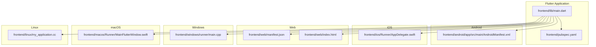
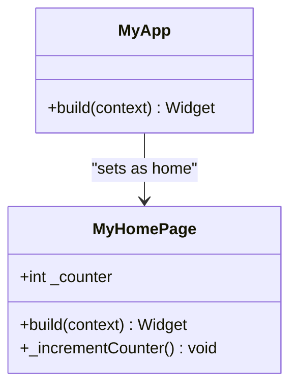
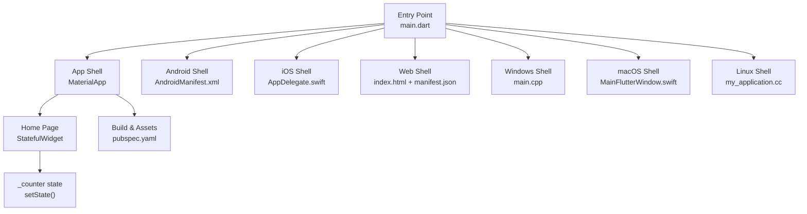
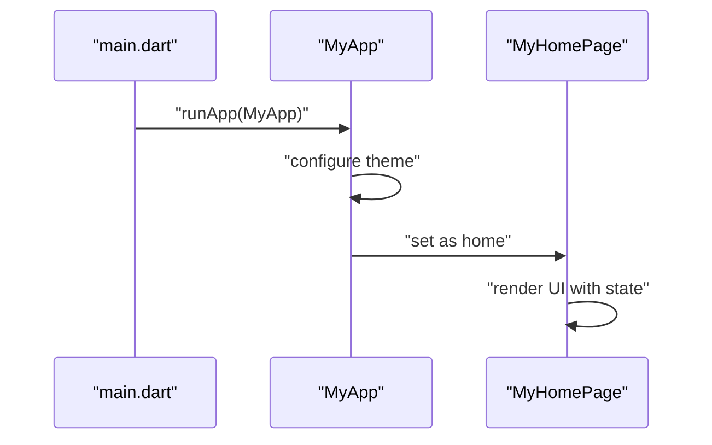
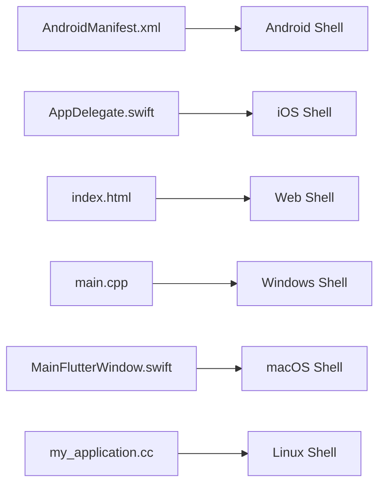
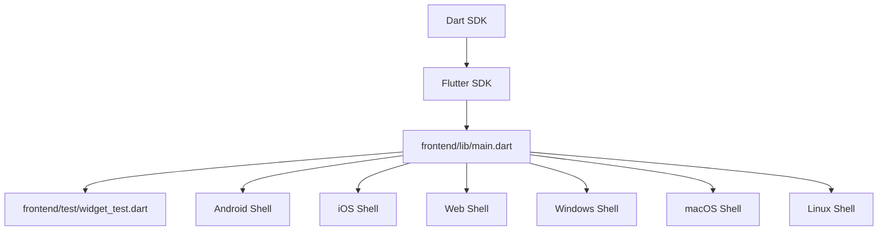

# Frontend Architecture

<cite>
**Referenced Files in This Document**
- [main.dart](file://frontend/lib/main.dart)
- [pubspec.yaml](file://frontend/pubspec.yaml)
- [AndroidManifest.xml](file://frontend/android/app/src/main/AndroidManifest.xml)
- [AppDelegate.swift](file://frontend/ios/Runner/AppDelegate.swift)
- [index.html](file://frontend/web/index.html)
- [manifest.json](file://frontend/web/manifest.json)
- [my_application.cc](file://frontend/linux/my_application.cc)
- [MainFlutterWindow.swift](file://frontend/macos/Runner/MainFlutterWindow.swift)
- [main.cpp](file://frontend/windows/runner/main.cpp)
- [widget_test.dart](file://frontend/test/widget_test.dart)
- [analysis_options.yaml](file://frontend/analysis_options.yaml)
</cite>

## Table of Contents
1. [Introduction](#introduction)
2. [Project Structure](#project-structure)
3. [Core Components](#core-components)
4. [Architecture Overview](#architecture-overview)
5. [Detailed Component Analysis](#detailed-component-analysis)
6. [Dependency Analysis](#dependency-analysis)
7. [Performance Considerations](#performance-considerations)
8. [Troubleshooting Guide](#troubleshooting-guide)
9. [Conclusion](#conclusion)

## Introduction
This document describes the frontend architecture of a Flutter-based social media application. It focuses on the Flutter application structure, widget hierarchy, and state management patterns. It documents the mobile-first approach with cross-platform support for Android, iOS, Web, Windows, macOS, and Linux. It explains the main application entry point, routing configuration, and navigation patterns. It covers responsive design principles and platform-specific adaptations. It documents asset management, internationalization setup, and build configuration. Finally, it includes performance optimization strategies, memory management, and debugging approaches specific to Flutter development.

## Project Structure
The frontend project is organized around Flutter conventions and platform-specific native integrations:
- Application entry point and core UI live under frontend/lib.
- Platform-specific native shells reside under frontend/android, frontend/ios, frontend/web, frontend/windows, frontend/macos, and frontend/linux.
- Build and dependency configuration is centralized in frontend/pubspec.yaml.
- Tests and analysis configuration are under frontend/test and frontend/analysis_options.yaml.

**Diagram sources**
- [main.dart:1-126](file://frontend/lib/main.dart#L1-L126)
- [pubspec.yaml:1-91](file://frontend/pubspec.yaml#L1-L91)
- [AndroidManifest.xml:1-46](file://frontend/android/app/src/main/AndroidManifest.xml#L1-L46)
- [AppDelegate.swift:1-14](file://frontend/ios/Runner/AppDelegate.swift#L1-L14)
- [index.html:1-39](file://frontend/web/index.html#L1-L39)
- [manifest.json:1-36](file://frontend/web/manifest.json#L1-L36)
- [main.cpp:1-44](file://frontend/windows/runner/main.cpp#L1-L44)
- [MainFlutterWindow.swift:1-16](file://frontend/macos/Runner/MainFlutterWindow.swift#L1-L16)
- [my_application.cc:1-125](file://frontend/linux/my_application.cc#L1-L125)

**Section sources**
- [main.dart:1-126](file://frontend/lib/main.dart#L1-L126)
- [pubspec.yaml:1-91](file://frontend/pubspec.yaml#L1-L91)

## Core Components
The core application is bootstrapped via the main entry point and configured with a Material theme. The application uses a top-level StatelessWidget (MyApp) that builds a MaterialApp with a primary theme and a home page (MyHomePage). The home page is a StatefulWidget that manages a counter state and updates the UI reactively using setState.

Key characteristics:
- Entry point: main() invokes runApp with MyApp.
- Root widget: MyApp configures theme and sets the home page.
- State management: MyHomePage uses a StatefulWidget with internal state and setState to trigger rebuilds.
- Navigation: The current code sets a home page; deeper navigation patterns are not present in the provided files.

**Diagram sources**
- [main.dart:7-37](file://frontend/lib/main.dart#L7-L37)
- [main.dart:39-125](file://frontend/lib/main.dart#L39-L125)

**Section sources**
- [main.dart:1-126](file://frontend/lib/main.dart#L1-L126)

## Architecture Overview
The Flutter application follows a layered architecture:
- Presentation Layer: Widgets define UI and handle user interactions.
- State Management: Internal state via StatefulWidget and setState.
- Platform Embedding: Platform-specific shells initialize the Flutter engine and host the app.
- Asset and Build Pipeline: pubspec.yaml defines assets and build metadata; platform manifests configure runtime behavior.

**Diagram sources**
- [main.dart:3-37](file://frontend/lib/main.dart#L3-L37)
- [AndroidManifest.xml:1-46](file://frontend/android/app/src/main/AndroidManifest.xml#L1-L46)
- [AppDelegate.swift:1-14](file://frontend/ios/Runner/AppDelegate.swift#L1-L14)
- [index.html:1-39](file://frontend/web/index.html#L1-L39)
- [manifest.json:1-36](file://frontend/web/manifest.json#L1-L36)
- [main.cpp:1-44](file://frontend/windows/runner/main.cpp#L1-L44)
- [MainFlutterWindow.swift:1-16](file://frontend/macos/Runner/MainFlutterWindow.swift#L1-L16)
- [my_application.cc:1-125](file://frontend/linux/my_application.cc#L1-L125)
- [pubspec.yaml:54-91](file://frontend/pubspec.yaml#L54-L91)

## Detailed Component Analysis

### Entry Point and Application Bootstrap
- The application starts at main(), which runs MyApp.
- MyApp configures the app theme and sets the initial route/home page.
- The home page is a StatefulWidget that encapsulates UI state and rebuild logic.

**Diagram sources**
- [main.dart:3-37](file://frontend/lib/main.dart#L3-L37)
- [main.dart:39-125](file://frontend/lib/main.dart#L39-L125)

**Section sources**
- [main.dart:1-126](file://frontend/lib/main.dart#L1-L126)

### Platform Shells and Native Integrations
- Android: The AndroidManifest.xml registers the MainActivity and embedding metadata, enabling Flutter’s Android shell to host the app.
- iOS: AppDelegate.swift registers plugins and delegates app lifecycle to Flutter.
- Web: index.html hosts the Flutter web bootstrap script and manifest.json provides PWA metadata.
- Windows: main.cpp initializes the Flutter project and creates a window hosting the Flutter view.
- macOS: MainFlutterWindow.swift sets up a FlutterViewController inside an NSWindow.
- Linux: my_application.cc creates a GTK window, loads the Flutter project, and registers plugins.

**Diagram sources**
- [AndroidManifest.xml:1-46](file://frontend/android/app/src/main/AndroidManifest.xml#L1-L46)
- [AppDelegate.swift:1-14](file://frontend/ios/Runner/AppDelegate.swift#L1-L14)
- [index.html:1-39](file://frontend/web/index.html#L1-L39)
- [main.cpp:1-44](file://frontend/windows/runner/main.cpp#L1-L44)
- [MainFlutterWindow.swift:1-16](file://frontend/macos/Runner/MainFlutterWindow.swift#L1-L16)
- [my_application.cc:1-125](file://frontend/linux/my_application.cc#L1-L125)

**Section sources**
- [AndroidManifest.xml:1-46](file://frontend/android/app/src/main/AndroidManifest.xml#L1-L46)
- [AppDelegate.swift:1-14](file://frontend/ios/Runner/AppDelegate.swift#L1-L14)
- [index.html:1-39](file://frontend/web/index.html#L1-L39)
- [manifest.json:1-36](file://frontend/web/manifest.json#L1-L36)
- [main.cpp:1-44](file://frontend/windows/runner/main.cpp#L1-L44)
- [MainFlutterWindow.swift:1-16](file://frontend/macos/Runner/MainFlutterWindow.swift#L1-L16)
- [my_application.cc:1-125](file://frontend/linux/my_application.cc#L1-L125)

### Routing and Navigation Patterns
- Current implementation sets a home page in MyApp.
- Deeper navigation patterns (e.g., named routes, navigation bars) are not present in the provided files.
- For a social media app, typical patterns include bottom navigation, drawer navigation, and page transitions. These are not implemented in the current codebase.

**Section sources**
- [main.dart:13-35](file://frontend/lib/main.dart#L13-L35)

### Responsive Design and Cross-Platform Adaptations
- The app uses Material 3 theming and a central theme configuration, which adapts to platform conventions.
- Platform-specific adaptations are handled by each platform shell:
  - Android: Hardware acceleration and orientation handling.
  - iOS: Plugin registration and app lifecycle delegation.
  - Web: PWA manifest and bootstrap script.
  - Windows/macOS/Linux: Platform-specific window creation and plugin registration.

**Section sources**
- [main.dart:15-33](file://frontend/lib/main.dart#L15-L33)
- [AndroidManifest.xml:12-14](file://frontend/android/app/src/main/AndroidManifest.xml#L12-L14)
- [index.html:1-39](file://frontend/web/index.html#L1-L39)
- [main.cpp:20-33](file://frontend/windows/runner/main.cpp#L20-L33)
- [MainFlutterWindow.swift:4-14](file://frontend/macos/Runner/MainFlutterWindow.swift#L4-L14)
- [my_application.cc:18-62](file://frontend/linux/my_application.cc#L18-L62)

### Asset Management and Internationalization Setup
- Assets: The pubspec.yaml includes Material icons and provides hooks for adding images and fonts. Resolution-aware images and custom fonts are supported by the Flutter asset pipeline.
- Internationalization: No i18n setup is present in the provided files. Typically, this involves generating localized messages and configuring locale resolution.

**Section sources**
- [pubspec.yaml:54-91](file://frontend/pubspec.yaml#L54-L91)

### Build Configuration
- Versioning: The pubspec.yaml defines version and build metadata aligned with Flutter conventions for Android, iOS, and Windows.
- SDK: The environment specifies the Dart SDK constraint.
- Dev dependencies: flutter_test and flutter_lints are included for testing and code quality.

**Section sources**
- [pubspec.yaml:7-48](file://frontend/pubspec.yaml#L7-L48)

## Dependency Analysis
The application depends on Flutter SDK and standard platform plugins. Platform shells depend on their respective native frameworks and the Flutter engine. Tests rely on flutter_test and the app’s public API.

**Diagram sources**
- [main.dart:1-5](file://frontend/lib/main.dart#L1-L5)
- [widget_test.dart:8-11](file://frontend/test/widget_test.dart#L8-L11)
- [pubspec.yaml:21-48](file://frontend/pubspec.yaml#L21-L48)

**Section sources**
- [main.dart:1-5](file://frontend/lib/main.dart#L1-L5)
- [widget_test.dart:8-11](file://frontend/test/widget_test.dart#L8-L11)
- [pubspec.yaml:21-48](file://frontend/pubspec.yaml#L21-L48)

## Performance Considerations
- Use lightweight widgets and minimize rebuild scope. Prefer const constructors and immutable data to reduce unnecessary rebuilds.
- Optimize rendering by avoiding heavy computations in build methods. Use Future.delayed or isolate heavy tasks off the UI thread.
- Leverage caching for network requests and images. Use efficient image loading and dispose resources in initState/dispose.
- Profile memory usage with Flutter DevTools. Monitor retained objects and avoid retaining large closures or streams.
- Enable tree shaking and release builds for production. Use --release flag and analyze bundle size.
- On Web, ensure PWA assets are optimized and preloaded appropriately.

## Troubleshooting Guide
- Testing: The project includes a smoke test that verifies UI state changes. Use WidgetTester to simulate taps and assert UI updates.
- Code quality: The analysis_options.yaml enforces Flutter lints. Customize rules per project needs and suppress selectively when necessary.
- Platform-specific issues:
  - Android: Verify manifest permissions and hardware acceleration flags.
  - iOS: Confirm plugin registration in AppDelegate.
  - Web: Validate manifest.json entries and base href configuration.
  - Windows/macOS/Linux: Ensure window sizing and plugin registration are correct.

**Section sources**
- [widget_test.dart:13-30](file://frontend/test/widget_test.dart#L13-L30)
- [analysis_options.yaml:10-29](file://frontend/analysis_options.yaml#L10-L29)

## Conclusion
The Flutter application follows a clean, modular structure with a clear entry point and a Material-based theme. The current implementation demonstrates foundational state management with a StatefulWidget and a home page. Cross-platform support is achieved through dedicated platform shells that initialize the Flutter engine and host the app. While routing, navigation, and internationalization are not yet implemented, the project is well-positioned to scale into a full-featured social media application. The provided configuration and platform integrations offer a solid foundation for performance, testing, and deployment across Android, iOS, Web, Windows, macOS, and Linux.