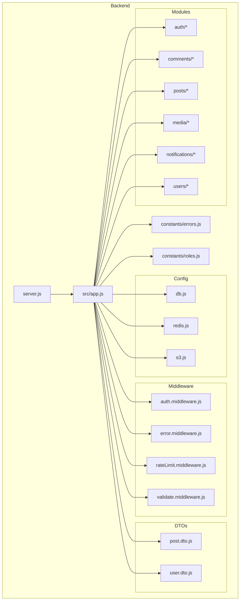
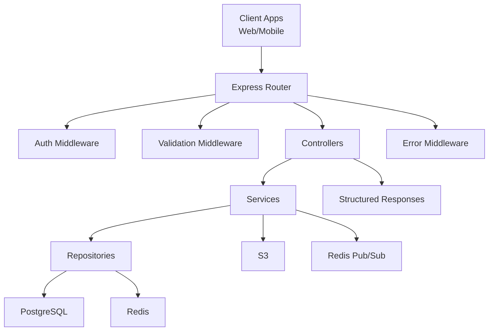
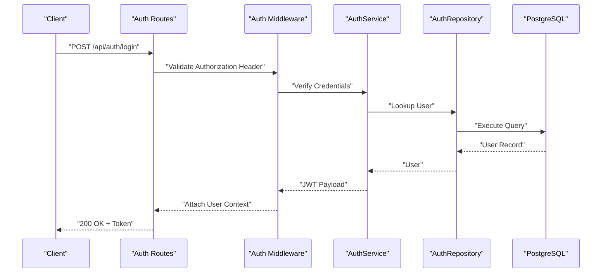
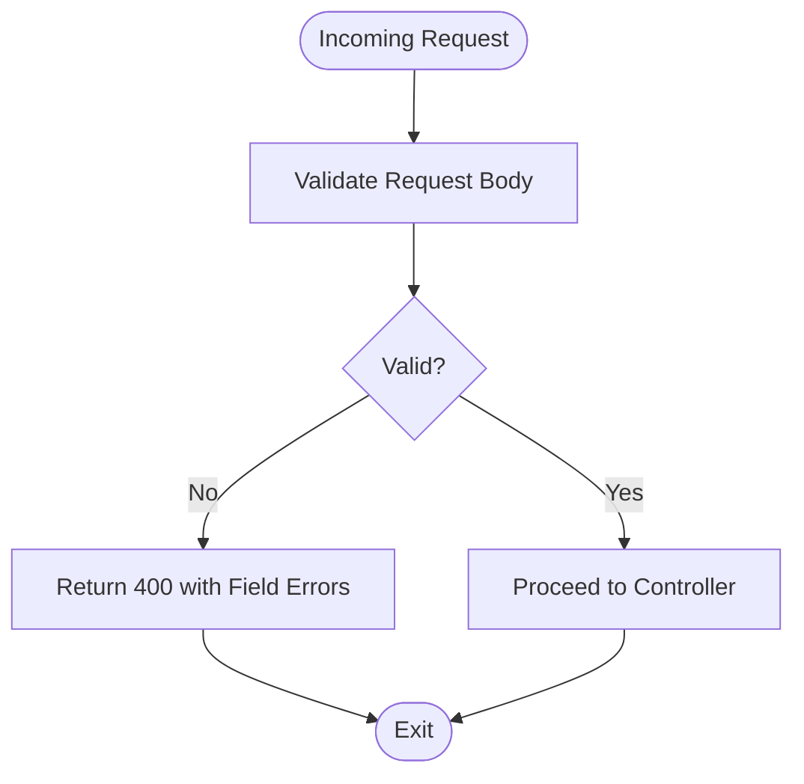
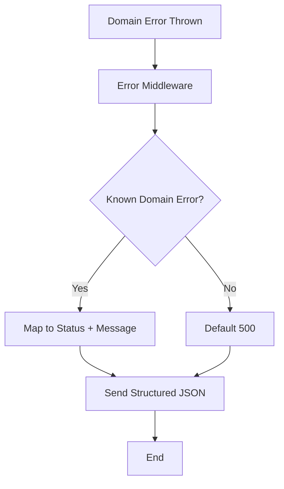
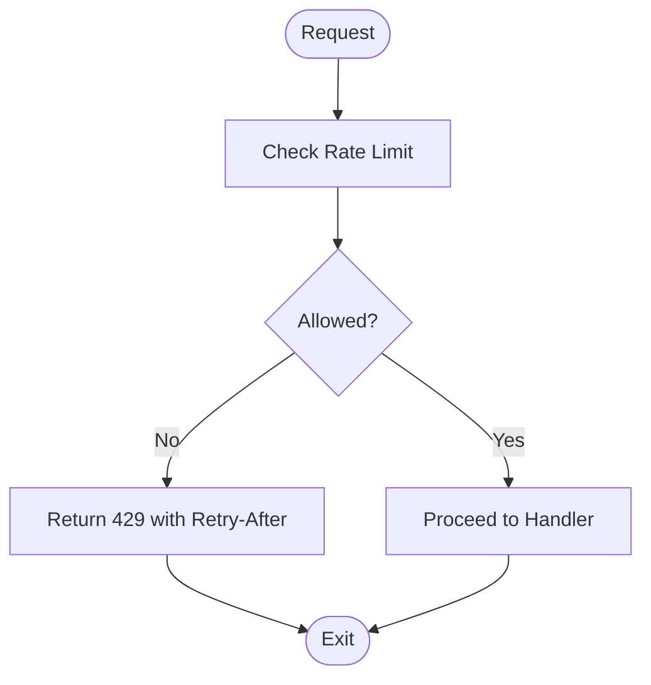
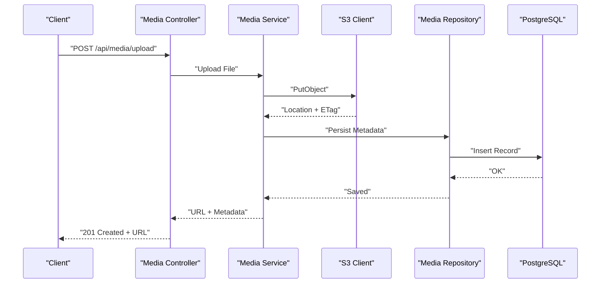
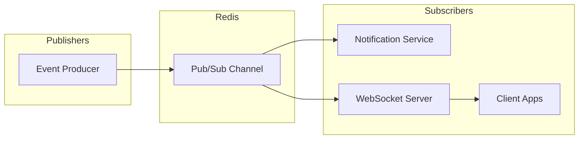
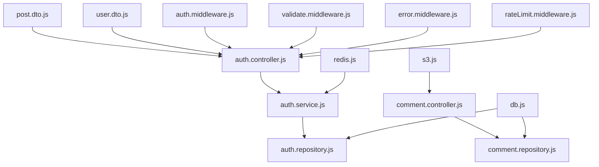

# Integration Patterns

<cite>
**Referenced Files in This Document**
- [server.js](file://backend/server.js)
- [app.js](file://backend/src/app.js)
- [db.js](file://backend/src/config/db.js)
- [redis.js](file://backend/src/config/redis.js)
- [s3.js](file://backend/src/config/s3.js)
- [auth.middleware.js](file://backend/src/middleware/auth.middleware.js)
- [error.middleware.js](file://backend/src/middleware/error.middleware.js)
- [rateLimit.middleware.js](file://backend/src/middleware/rateLimit.middleware.js)
- [validate.middleware.js](file://backend/src/middleware/validate.middleware.js)
- [auth.controller.js](file://backend/src/modules/auth/auth.controller.js)
- [auth.service.js](file://backend/src/modules/auth/auth.service.js)
- [auth.repository.js](file://backend/src/modules/auth/auth.repository.js)
- [auth.routes.js](file://backend/src/modules/auth/auth.routes.js)
- [auth.validation.js](file://backend/src/modules/auth/auth.validation.js)
- [comment.controller.js](file://backend/src/modules/comments/comment.controller.js)
- [comment.repository.js](file://backend/src/modules/comments/comment.repository.js)
- [post.dto.js](file://backend/src/dto/post.dto.js)
- [user.dto.js](file://backend/src/dto/user.dto.js)
- [errors.js](file://backend/src/constants/errors.js)
- [roles.js](file://backend/src/constants/roles.js)
</cite>

## Table of Contents
1. [Introduction](#introduction)
2. [Project Structure](#project-structure)
3. [Core Components](#core-components)
4. [Architecture Overview](#architecture-overview)
5. [Detailed Component Analysis](#detailed-component-analysis)
6. [Dependency Analysis](#dependency-analysis)
7. [Performance Considerations](#performance-considerations)
8. [Troubleshooting Guide](#troubleshooting-guide)
9. [Conclusion](#conclusion)

## Introduction
This document describes the integration patterns for the full-stack social media application. It focuses on RESTful API design principles, HTTP status codes, response formatting standards, frontend-backend communication protocols, authentication and session handling, real-time features, media upload and storage integration, third-party service integrations, rate limiting, error propagation strategies, and CORS and security headers policies. The goal is to provide a comprehensive guide for developers integrating with or extending the platform.

## Project Structure
The backend is organized around modular domain boundaries with clear separation of concerns:
- Configuration: database, Redis cache, and S3 storage clients
- Middleware: authentication, validation, error handling, and rate limiting
- DTOs: data transfer objects for request/response shaping
- Modules: feature-specific controllers, services, repositories, validations, and routes
- Constants: error messages and roles

**Diagram sources**
- [server.js](file://backend/server.js)
- [app.js](file://backend/src/app.js)
- [db.js](file://backend/src/config/db.js)
- [redis.js](file://backend/src/config/redis.js)
- [s3.js](file://backend/src/config/s3.js)
- [auth.middleware.js](file://backend/src/middleware/auth.middleware.js)
- [error.middleware.js](file://backend/src/middleware/error.middleware.js)
- [rateLimit.middleware.js](file://backend/src/middleware/rateLimit.middleware.js)
- [validate.middleware.js](file://backend/src/middleware/validate.middleware.js)
- [post.dto.js](file://backend/src/dto/post.dto.js)
- [user.dto.js](file://backend/src/dto/user.dto.js)
- [errors.js](file://backend/src/constants/errors.js)
- [roles.js](file://backend/src/constants/roles.js)

**Section sources**
- [server.js](file://backend/server.js)
- [app.js](file://backend/src/app.js)

## Core Components
- Authentication pipeline: validation, JWT issuance, role checks, and protected routes
- Request validation: centralized DTO-driven validation
- Error handling: unified error responses and status mapping
- Rate limiting: per-route and global limits
- Media storage: S3 integration for uploads and retrieval
- Real-time: Redis-backed pub/sub for notifications and potential WebSocket signaling
- Constants: standardized error messages and roles

Key integration touchpoints:
- Controllers orchestrate service calls and return structured responses
- Services encapsulate business logic and coordinate repositories
- Repositories abstract persistence and caching
- Middleware enforces security and quality gates

**Section sources**
- [auth.controller.js](file://backend/src/modules/auth/auth.controller.js)
- [auth.service.js](file://backend/src/modules/auth/auth.service.js)
- [auth.repository.js](file://backend/src/modules/auth/auth.repository.js)
- [auth.validation.js](file://backend/src/modules/auth/auth.validation.js)
- [validate.middleware.js](file://backend/src/middleware/validate.middleware.js)
- [error.middleware.js](file://backend/src/middleware/error.middleware.js)
- [rateLimit.middleware.js](file://backend/src/middleware/rateLimit.middleware.js)
- [s3.js](file://backend/src/config/s3.js)
- [redis.js](file://backend/src/config/redis.js)
- [errors.js](file://backend/src/constants/errors.js)
- [roles.js](file://backend/src/constants/roles.js)

## Architecture Overview
The backend exposes REST endpoints via a central application instance. Requests flow through middleware, then to controllers, services, and repositories. Persistence and caching are handled by configured clients. Media operations integrate with S3, while real-time updates leverage Redis pub/sub.

**Diagram sources**
- [server.js](file://backend/server.js)
- [app.js](file://backend/src/app.js)
- [auth.middleware.js](file://backend/src/middleware/auth.middleware.js)
- [validate.middleware.js](file://backend/src/middleware/validate.middleware.js)
- [auth.controller.js](file://backend/src/modules/auth/auth.controller.js)
- [auth.service.js](file://backend/src/modules/auth/auth.service.js)
- [auth.repository.js](file://backend/src/modules/auth/auth.repository.js)
- [db.js](file://backend/src/config/db.js)
- [redis.js](file://backend/src/config/redis.js)
- [s3.js](file://backend/src/config/s3.js)
- [error.middleware.js](file://backend/src/middleware/error.middleware.js)

## Detailed Component Analysis

### Authentication Integration Pattern
Authentication is enforced via a dedicated middleware that validates bearer tokens and attaches user context to requests. Controllers protect routes using this middleware, and services enforce role-based access where applicable.

**Diagram sources**
- [auth.middleware.js](file://backend/src/middleware/auth.middleware.js)
- [auth.controller.js](file://backend/src/modules/auth/auth.controller.js)
- [auth.service.js](file://backend/src/modules/auth/auth.service.js)
- [auth.repository.js](file://backend/src/modules/auth/auth.repository.js)
- [auth.routes.js](file://backend/src/modules/auth/auth.routes.js)

**Section sources**
- [auth.middleware.js](file://backend/src/middleware/auth.middleware.js)
- [auth.controller.js](file://backend/src/modules/auth/auth.controller.js)
- [auth.service.js](file://backend/src/modules/auth/auth.service.js)
- [auth.repository.js](file://backend/src/modules/auth/auth.repository.js)
- [auth.routes.js](file://backend/src/modules/auth/auth.routes.js)
- [roles.js](file://backend/src/constants/roles.js)

### Validation and Request Contract
Validation middleware enforces DTO schemas and returns structured errors for invalid inputs. Controllers rely on validated data to reduce branching and improve reliability.

**Diagram sources**
- [validate.middleware.js](file://backend/src/middleware/validate.middleware.js)
- [auth.validation.js](file://backend/src/modules/auth/auth.validation.js)
- [post.dto.js](file://backend/src/dto/post.dto.js)
- [user.dto.js](file://backend/src/dto/user.dto.js)

**Section sources**
- [validate.middleware.js](file://backend/src/middleware/validate.middleware.js)
- [auth.validation.js](file://backend/src/modules/auth/auth.validation.js)
- [post.dto.js](file://backend/src/dto/post.dto.js)
- [user.dto.js](file://backend/src/dto/user.dto.js)

### Error Propagation and Response Formatting
Errors are normalized through a centralized error middleware that maps domain errors to appropriate HTTP status codes and standard response bodies. This ensures consistent client-side handling.

**Diagram sources**
- [error.middleware.js](file://backend/src/middleware/error.middleware.js)
- [errors.js](file://backend/src/constants/errors.js)

**Section sources**
- [error.middleware.js](file://backend/src/middleware/error.middleware.js)
- [errors.js](file://backend/src/constants/errors.js)

### Rate Limiting Integration
Rate limiting middleware applies configurable quotas per route and IP, preventing abuse and protecting downstream services.

**Diagram sources**
- [rateLimit.middleware.js](file://backend/src/middleware/rateLimit.middleware.js)

**Section sources**
- [rateLimit.middleware.js](file://backend/src/middleware/rateLimit.middleware.js)

### Media Upload and Storage Integration
Media uploads integrate with S3 for storage and retrieval. Controllers handle multipart uploads, services manage S3 operations, and repositories track metadata.

**Diagram sources**
- [s3.js](file://backend/src/config/s3.js)
- [comment.controller.js](file://backend/src/modules/comments/comment.controller.js)
- [comment.repository.js](file://backend/src/modules/comments/comment.repository.js)

**Section sources**
- [s3.js](file://backend/src/config/s3.js)
- [comment.controller.js](file://backend/src/modules/comments/comment.controller.js)
- [comment.repository.js](file://backend/src/modules/comments/comment.repository.js)

### Real-Time Notifications and WebSocket Considerations
Real-time notifications are implemented using Redis pub/sub. Services publish events, and clients can subscribe via WebSocket connections. This pattern supports scalable, decoupled updates.

**Diagram sources**
- [redis.js](file://backend/src/config/redis.js)

**Section sources**
- [redis.js](file://backend/src/config/redis.js)

### Frontend-Backend Communication Protocols
- REST endpoints: JSON payloads, consistent header expectations (Authorization), and standardized error responses
- Authentication: Bearer tokens in Authorization header
- Media: Signed URLs or direct S3 uploads depending on policy
- Real-time: WebSocket connections to a dedicated endpoint with event namespaced by channel

[No sources needed since this section provides general guidance]

### CORS and Security Headers
- CORS: Origins, methods, and headers should be explicitly configured to minimize exposure
- Security headers: Content-Security-Policy, X-Frame-Options, X-Content-Type-Options, Referrer-Policy, Strict-Transport-Security
- CSRF protection: Not applicable for stateless APIs; rely on token-based auth and secure headers

[No sources needed since this section provides general guidance]

## Dependency Analysis
The module graph highlights tight coupling between controllers and services, with repositories abstracting persistence and caching. Middleware layers enforce cross-cutting concerns consistently.

**Diagram sources**
- [auth.controller.js](file://backend/src/modules/auth/auth.controller.js)
- [auth.service.js](file://backend/src/modules/auth/auth.service.js)
- [auth.repository.js](file://backend/src/modules/auth/auth.repository.js)
- [comment.controller.js](file://backend/src/modules/comments/comment.controller.js)
- [comment.repository.js](file://backend/src/modules/comments/comment.repository.js)
- [post.dto.js](file://backend/src/dto/post.dto.js)
- [user.dto.js](file://backend/src/dto/user.dto.js)
- [auth.middleware.js](file://backend/src/middleware/auth.middleware.js)
- [validate.middleware.js](file://backend/src/middleware/validate.middleware.js)
- [error.middleware.js](file://backend/src/middleware/error.middleware.js)
- [rateLimit.middleware.js](file://backend/src/middleware/rateLimit.middleware.js)
- [redis.js](file://backend/src/config/redis.js)
- [s3.js](file://backend/src/config/s3.js)
- [db.js](file://backend/src/config/db.js)

**Section sources**
- [auth.controller.js](file://backend/src/modules/auth/auth.controller.js)
- [auth.service.js](file://backend/src/modules/auth/auth.service.js)
- [auth.repository.js](file://backend/src/modules/auth/auth.repository.js)
- [comment.controller.js](file://backend/src/modules/comments/comment.controller.js)
- [comment.repository.js](file://backend/src/modules/comments/comment.repository.js)
- [post.dto.js](file://backend/src/dto/post.dto.js)
- [user.dto.js](file://backend/src/dto/user.dto.js)
- [auth.middleware.js](file://backend/src/middleware/auth.middleware.js)
- [validate.middleware.js](file://backend/src/middleware/validate.middleware.js)
- [error.middleware.js](file://backend/src/middleware/error.middleware.js)
- [rateLimit.middleware.js](file://backend/src/middleware/rateLimit.middleware.js)
- [redis.js](file://backend/src/config/redis.js)
- [s3.js](file://backend/src/config/s3.js)
- [db.js](file://backend/src/config/db.js)

## Performance Considerations
- Use Redis for caching frequently accessed data and reducing DB load
- Apply rate limiting to prevent hot endpoints from overwhelming the system
- Offload media processing to background jobs and use S3 presigned URLs for downloads
- Keep DTOs minimal and avoid N+1 queries by batching and eager-loading relations
- Monitor latency and throughput at each middleware boundary

[No sources needed since this section provides general guidance]

## Troubleshooting Guide
Common issues and resolutions:
- Authentication failures: verify token format, expiration, and issuer; check role permissions
- Validation errors: inspect field-level messages returned by the validation middleware
- Rate limit exceeded: adjust client retry-after behavior and request pacing
- Media upload failures: confirm S3 credentials, bucket policies, and CORS configuration
- Real-time delivery gaps: verify Redis connectivity and channel subscriptions

**Section sources**
- [auth.middleware.js](file://backend/src/middleware/auth.middleware.js)
- [validate.middleware.js](file://backend/src/middleware/validate.middleware.js)
- [rateLimit.middleware.js](file://backend/src/middleware/rateLimit.middleware.js)
- [s3.js](file://backend/src/config/s3.js)
- [redis.js](file://backend/src/config/redis.js)
- [errors.js](file://backend/src/constants/errors.js)

## Conclusion
The application employs a clean, layered architecture with explicit integration points for authentication, validation, error handling, rate limiting, media storage, and real-time features. By adhering to standardized response formats, consistent HTTP status codes, and robust middleware enforcement, the system remains maintainable and extensible. Teams integrating with the platform should focus on token-based auth, DTO-driven contracts, and Redis/S3 integration patterns described here.