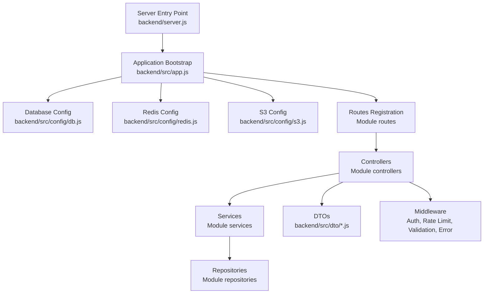
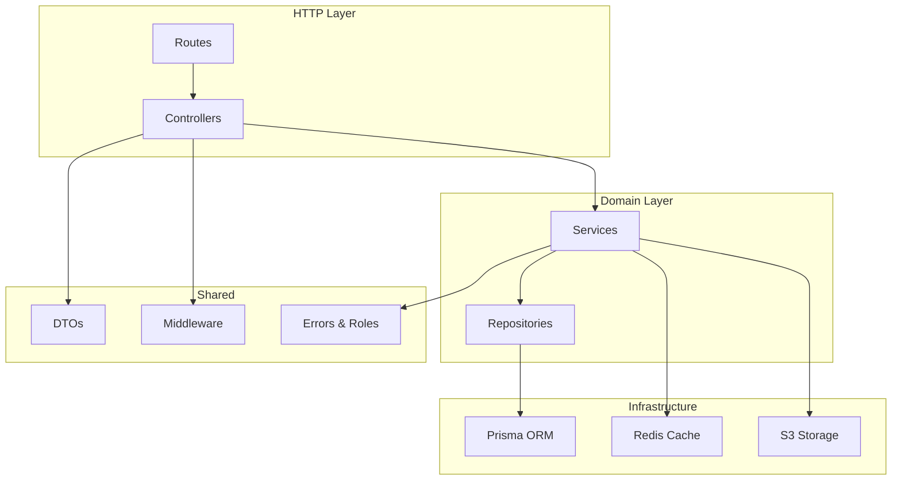
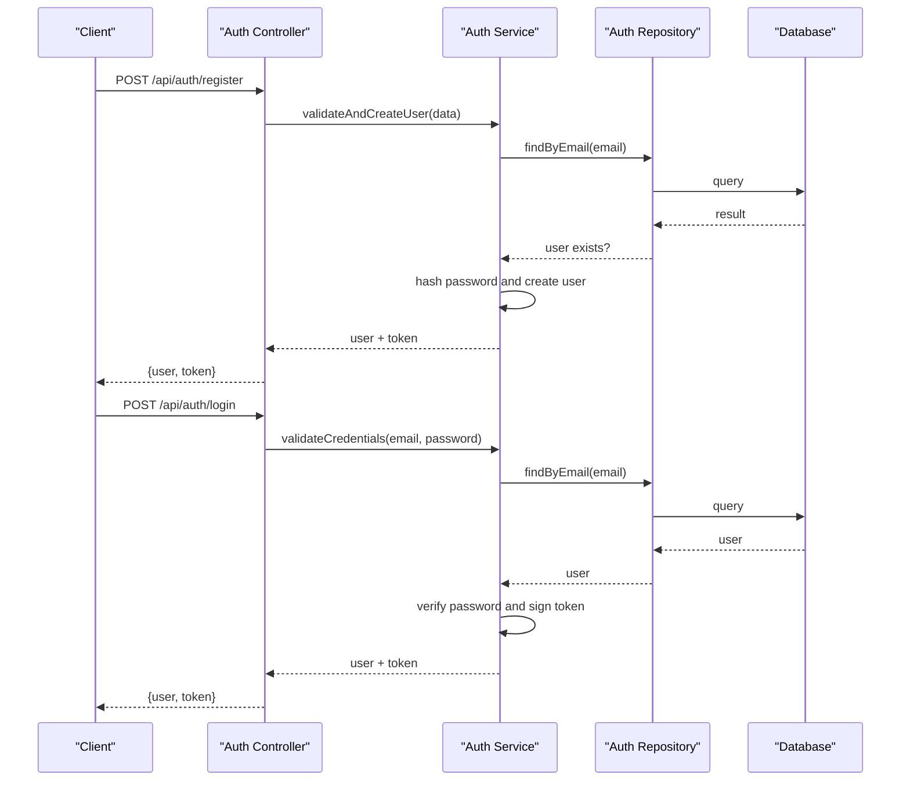
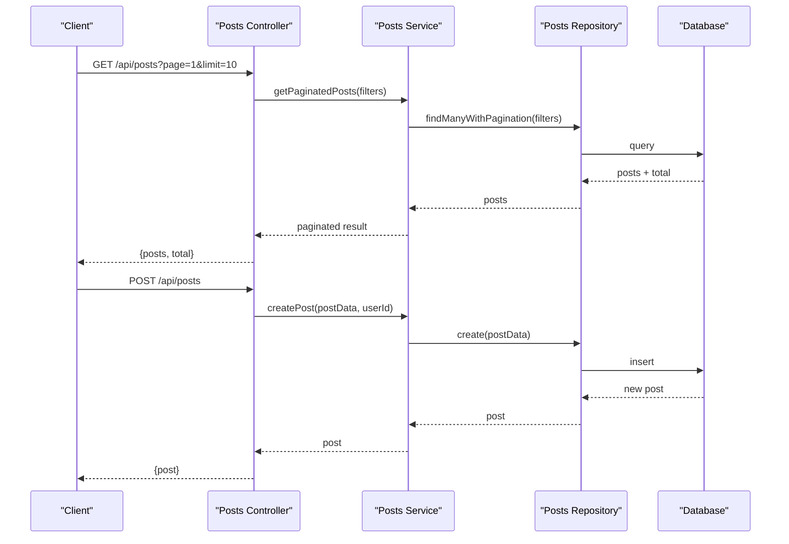
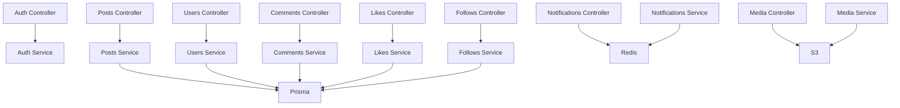

# API Modules

<cite>
**Referenced Files in This Document**
- [server.js](file://backend/server.js)
- [app.js](file://backend/src/app.js)
- [db.js](file://backend/src/config/db.js)
- [redis.js](file://backend/src/config/redis.js)
- [s3.js](file://backend/src/config/s3.js)
- [errors.js](file://backend/src/constants/errors.js)
- [roles.js](file://backend/src/constants/roles.js)
- [auth.middleware.js](file://backend/src/middleware/auth.middleware.js)
- [error.middleware.js](file://backend/src/middleware/error.middleware.js)
- [rateLimit.middleware.js](file://backend/src/middleware/rateLimit.middleware.js)
- [validate.middleware.js](file://backend/src/middleware/validate.middleware.js)
- [auth.controller.js](file://backend/src/modules/auth/auth.controller.js)
- [auth.service.js](file://backend/src/modules/auth/auth.service.js)
- [auth.repository.js](file://backend/src/modules/auth/auth.repository.js)
- [auth.routes.js](file://backend/src/modules/auth/auth.routes.js)
- [auth.validation.js](file://backend/src/modules/auth/auth.validation.js)
- [post.dto.js](file://backend/src/dto/post.dto.js)
- [user.dto.js](file://backend/src/dto/user.dto.js)
- [comments.controller.js](file://backend/src/modules/comments/comments.controller.js)
- [comments.repository.js](file://backend/src/modules/comments/comments.repository.js)
- [feed.controller.js](file://backend/src/modules/feed/feed.controller.js)
- [follows.controller.js](file://backend/src/modules/follows/follows.controller.js)
- [likes.controller.js](file://backend/src/modules/likes/likes.controller.js)
- [media.controller.js](file://backend/src/modules/media/media.controller.js)
- [notifications.controller.js](file://backend/src/modules/notifications/notifications.controller.js)
- [posts.controller.js](file://backend/src/modules/posts/posts.controller.js)
- [search.controller.js](file://backend/src/modules/search/search.controller.js)
- [users.controller.js](file://backend/src/modules/users/users.controller.js)
</cite>

## Table of Contents
1. [Introduction](#introduction)
2. [Project Structure](#project-structure)
3. [Core Components](#core-components)
4. [Architecture Overview](#architecture-overview)
5. [Detailed Module Analysis](#detailed-module-analysis)
6. [Dependency Analysis](#dependency-analysis)
7. [Performance Considerations](#performance-considerations)
8. [Troubleshooting Guide](#troubleshooting-guide)
9. [Conclusion](#conclusion)

## Introduction
This document provides comprehensive API module documentation for a social media platform backend. It covers the modular architecture with dedicated modules for authentication, posts, users, comments, likes, follows, notifications, media, search, and feed. For each module, we outline domain models, business logic, API endpoints, request/response schemas, validation rules, error handling patterns, and module interactions. The goal is to enable developers to integrate and extend the system effectively while maintaining consistency across modules.

## Project Structure
The backend is organized around a layered architecture:
- Entry point initializes the server and application
- Configuration modules manage database, caching, and storage integrations
- DTOs define standardized request/response schemas
- Middleware handles authentication, rate limiting, validation, and error management
- Modules encapsulate domain-specific controllers, services, repositories, routes, and validations
- Routes register module endpoints under unified base paths

**Diagram sources**
- [server.js](file://backend/server.js)
- [app.js](file://backend/src/app.js)
- [db.js](file://backend/src/config/db.js)
- [redis.js](file://backend/src/config/redis.js)
- [s3.js](file://backend/src/config/s3.js)

**Section sources**
- [server.js](file://backend/server.js)
- [app.js](file://backend/src/app.js)

## Core Components
- Authentication middleware enforces protected routes and validates tokens
- Error middleware centralizes error responses and logging
- Rate limit middleware controls request frequency per client/IP
- Validation middleware ensures request bodies conform to DTO schemas
- Constants define shared error messages and role-based permissions
- DTOs standardize request/response shapes across modules

Key responsibilities:
- Centralized error handling and response formatting
- Request validation and sanitization
- Access control via roles and JWT verification
- Resource access via repositories with Prisma ORM
- Media operations via S3 integration
- Caching via Redis for performance

**Section sources**
- [auth.middleware.js](file://backend/src/middleware/auth.middleware.js)
- [error.middleware.js](file://backend/src/middleware/error.middleware.js)
- [rateLimit.middleware.js](file://backend/src/middleware/rateLimit.middleware.js)
- [validate.middleware.js](file://backend/src/middleware/validate.middleware.js)
- [errors.js](file://backend/src/constants/errors.js)
- [roles.js](file://backend/src/constants/roles.js)

## Architecture Overview
The system follows a clean architecture pattern:
- Controllers handle HTTP requests and delegate to services
- Services orchestrate business logic and coordinate repositories
- Repositories abstract data access using Prisma
- DTOs enforce consistent input/output schemas
- Middleware layers handle cross-cutting concerns

**Diagram sources**
- [auth.controller.js](file://backend/src/modules/auth/auth.controller.js)
- [auth.service.js](file://backend/src/modules/auth/auth.service.js)
- [auth.repository.js](file://backend/src/modules/auth/auth.repository.js)
- [auth.routes.js](file://backend/src/modules/auth/auth.routes.js)
- [post.dto.js](file://backend/src/dto/post.dto.js)
- [user.dto.js](file://backend/src/dto/user.dto.js)
- [db.js](file://backend/src/config/db.js)
- [redis.js](file://backend/src/config/redis.js)
- [s3.js](file://backend/src/config/s3.js)

## Detailed Module Analysis

### Authentication Module
Purpose: User registration, login, logout, and session management with JWT-based authentication.

Domain model:
- User entity stored in the database with unique identifiers and credentials
- Session tokens managed via JWT and optional refresh mechanisms

Business logic:
- Validate registration inputs and prevent duplicates
- Verify credentials against stored hashes
- Generate secure tokens with expiration policies
- Enforce role-based access for admin features

API endpoints:
- POST /api/auth/register
  - Request body: validated user DTO fields
  - Response: user profile and token
- POST /api/auth/login
  - Request body: email and password
  - Response: user profile and token
- POST /api/auth/logout
  - Requires Authorization header
  - Response: success confirmation

Validation rules:
- Email uniqueness and format
- Password strength requirements
- Token presence and signature verification

Error handling:
- Duplicate email errors
- Invalid credentials
- Token parsing and expiry errors
- Role-based access denied

**Diagram sources**
- [auth.controller.js](file://backend/src/modules/auth/auth.controller.js)
- [auth.service.js](file://backend/src/modules/auth/auth.service.js)
- [auth.repository.js](file://backend/src/modules/auth/auth.repository.js)
- [auth.routes.js](file://backend/src/modules/auth/auth.routes.js)

**Section sources**
- [auth.controller.js](file://backend/src/modules/auth/auth.controller.js)
- [auth.service.js](file://backend/src/modules/auth/auth.service.js)
- [auth.repository.js](file://backend/src/modules/auth/auth.repository.js)
- [auth.routes.js](file://backend/src/modules/auth/auth.routes.js)
- [auth.validation.js](file://backend/src/modules/auth/auth.validation.js)
- [user.dto.js](file://backend/src/dto/user.dto.js)
- [errors.js](file://backend/src/constants/errors.js)
- [roles.js](file://backend/src/constants/roles.js)

### Posts Module
Purpose: Create, read, update, delete, and list posts with pagination and filtering.

Domain model:
- Post entity with author, content, metadata, and timestamps
- Optional media associations via media module

Business logic:
- Author-only updates/deletes
- Feed aggregation for timeline retrieval
- Content moderation checks
- Pagination and sorting by creation date

API endpoints:
- GET /api/posts
  - Query params: page, limit, sortBy, sortOrder
  - Response: paginated post list
- GET /api/posts/:id
  - Path param: post ID
  - Response: single post with author info
- POST /api/posts
  - Requires Authorization
  - Request body: post DTO fields
  - Response: created post
- PUT /api/posts/:id
  - Requires Authorization and ownership
  - Response: updated post
- DELETE /api/posts/:id
  - Requires Authorization and ownership
  - Response: success confirmation

Validation rules:
- Content length limits
- Allowed media IDs (if attaching media)
- Sorting and pagination bounds

Error handling:
- Not found for missing post
- Forbidden for unauthorized edits
- Validation errors for malformed data

**Diagram sources**
- [posts.controller.js](file://backend/src/modules/posts/posts.controller.js)
- [auth.middleware.js](file://backend/src/middleware/auth.middleware.js)

**Section sources**
- [posts.controller.js](file://backend/src/modules/posts/posts.controller.js)
- [post.dto.js](file://backend/src/dto/post.dto.js)
- [errors.js](file://backend/src/constants/errors.js)

### Users Module
Purpose: Manage user profiles, account settings, and personal data.

Domain model:
- User entity with profile fields, privacy settings, and metadata
- Relationships: authored posts, followers/following, likes, comments

Business logic:
- Profile visibility rules
- Self-only updates for sensitive fields
- Avatar/media association via media module

API endpoints:
- GET /api/users/profile
  - Requires Authorization
  - Response: current user profile
- GET /api/users/:userId
  - Path param: target user ID
  - Response: public profile
- PUT /api/users/profile
  - Requires Authorization
  - Request body: user DTO fields
  - Response: updated profile

Validation rules:
- Email uniqueness (when updating)
- Privacy field constraints
- Avatar/media ID validation

Error handling:
- Not found for invalid user ID
- Forbidden for restricted access
- Validation errors for malformed data

**Section sources**
- [users.controller.js](file://backend/src/modules/users/users.controller.js)
- [user.dto.js](file://backend/src/dto/user.dto.js)
- [errors.js](file://backend/src/constants/errors.js)

### Comments Module
Purpose: Create, read, update, delete, and list comments on posts.

Domain model:
- Comment entity linked to post and author
- Nested comment support (optional)

Business logic:
- Author-only edits/deletes
- Post ownership validation for deletion
- Real-time notification triggers

API endpoints:
- GET /api/posts/:postId/comments
  - Path param: post ID
  - Query params: page, limit
  - Response: paginated comments
- POST /api/posts/:postId/comments
  - Path param: post ID
  - Requires Authorization
  - Request body: comment DTO fields
  - Response: created comment
- PUT /api/comments/:commentId
  - Requires Authorization and ownership
  - Response: updated comment
- DELETE /api/comments/:commentId
  - Requires Authorization and ownership
  - Response: success confirmation

Validation rules:
- Content length limits
- Post existence and visibility checks

Error handling:
- Not found for missing post/comment
- Forbidden for unauthorized edits

**Section sources**
- [comments.controller.js](file://backend/src/modules/comments/comments.controller.js)
- [comments.repository.js](file://backend/src/modules/comments/comments.repository.js)
- [errors.js](file://backend/src/constants/errors.js)

### Likes Module
Purpose: Toggle likes on posts and fetch like counts.

Domain model:
- Like entity linking user to post
- Aggregated like counts per post

Business logic:
- One like per user per post
- Like/unlike toggling semantics
- Real-time counters and cache invalidation

API endpoints:
- POST /api/posts/:postId/likes
  - Path param: post ID
  - Requires Authorization
  - Response: like status
- DELETE /api/posts/:postId/likes
  - Requires Authorization
  - Response: unliked confirmation

Validation rules:
- Post existence and visibility
- User ownership checks for cache updates

Error handling:
- Not found for missing post
- Conflict for duplicate like attempts

**Section sources**
- [likes.controller.js](file://backend/src/modules/likes/likes.controller.js)
- [errors.js](file://backend/src/constants/errors.js)

### Follows Module
Purpose: Manage user follow/unfollow relationships.

Domain model:
- Follow entity linking follower to followee
- Follower/following counts per user

Business logic:
- Prevent self-follow
- Real-time counter updates and cache invalidation
- Notification triggers for new followers

API endpoints:
- POST /api/users/:userId/follows
  - Path param: target user ID
  - Requires Authorization
  - Response: follow status
- DELETE /api/users/:userId/follows
  - Requires Authorization
  - Response: unfollow confirmation

Validation rules:
- Target user existence
- Self-follow prevention

Error handling:
- Not found for invalid user
- Conflict for duplicate follow attempts

**Section sources**
- [follows.controller.js](file://backend/src/modules/follows/follows.controller.js)
- [errors.js](file://backend/src/constants/errors.js)

### Notifications Module
Purpose: Deliver real-time notifications for likes, comments, follows, and mentions.

Domain model:
- Notification entity with type, target user, related resource, and read status
- Push and in-app delivery channels

Business logic:
- Event-driven creation upon likes, comments, follows
- Unread count aggregation
- Delivery to connected clients via Redis pub/sub

API endpoints:
- GET /api/notifications
  - Requires Authorization
  - Query params: page, limit
  - Response: paginated notifications
- PUT /api/notifications/read-all
  - Requires Authorization
  - Response: success confirmation
- GET /api/notifications/unread-count
  - Requires Authorization
  - Response: unread count

Validation rules:
- Ownership checks for accessing notifications
- Pagination bounds

Error handling:
- Not found for missing notifications
- Forbidden for unauthorized access

**Section sources**
- [notifications.controller.js](file://backend/src/modules/notifications/notifications.controller.js)
- [redis.js](file://backend/src/config/redis.js)
- [errors.js](file://backend/src/constants/errors.js)

### Media Module
Purpose: Upload, manage, and serve media assets (images, videos).

Domain model:
- Media entity with storage keys, metadata, and access controls
- S3 integration for storage and CDN delivery

Business logic:
- File type and size validation
- Secure upload URLs and signed requests
- Cleanup on post/comment deletion

API endpoints:
- POST /api/media/upload
  - Requires Authorization
  - Request: multipart/form-data
  - Response: media metadata
- DELETE /api/media/:mediaId
  - Requires Authorization and ownership
  - Response: success confirmation

Validation rules:
- Allowed MIME types and max file size
- Ownership verification for deletion

Error handling:
- Unsupported media type
- Upload failures
- Not found for missing media

**Section sources**
- [media.controller.js](file://backend/src/modules/media/media.controller.js)
- [s3.js](file://backend/src/config/s3.js)
- [errors.js](file://backend/src/constants/errors.js)

### Search Module
Purpose: Provide global search across posts, users, and hashtags.

Domain model:
- Full-text search indices and filters
- Paginated results with relevance scoring

Business logic:
- Query parsing and sanitization
- Multi-index search with ranking
- Caching of popular queries

API endpoints:
- GET /api/search
  - Query params: q, type, page, limit
  - Response: mixed results by type
- GET /api/search/suggestions
  - Query params: q
  - Response: autocomplete suggestions

Validation rules:
- Minimum query length
- Supported search types

Error handling:
- Empty results return empty arrays
- Validation errors for malformed queries

**Section sources**
- [search.controller.js](file://backend/src/modules/search/search.controller.js)
- [errors.js](file://backend/src/constants/errors.js)

### Feed Module
Purpose: Curate personalized timelines for logged-in users.

Domain model:
- Aggregated feed combining posts from followed users
- Sorting by recency and engagement

Business logic:
- Following-based aggregation
- Pagination and deduplication
- Real-time updates via subscriptions

API endpoints:
- GET /api/feed
  - Requires Authorization
  - Query params: page, limit
  - Response: paginated feed items

Validation rules:
- Pagination bounds
- Sorting preferences

Error handling:
- Not found for invalid pagination
- Empty feed returns empty arrays

**Section sources**
- [feed.controller.js](file://backend/src/modules/feed/feed.controller.js)
- [errors.js](file://backend/src/constants/errors.js)

## Dependency Analysis
Module dependencies and interactions:
- Controllers depend on services and DTOs
- Services depend on repositories and infrastructure configs
- Repositories depend on Prisma ORM
- Notifications rely on Redis pub/sub
- Media relies on S3 integration
- Authentication middleware is applied globally to protected routes
- Validation middleware ensures DTO compliance before controller execution

**Diagram sources**
- [auth.controller.js](file://backend/src/modules/auth/auth.controller.js)
- [auth.service.js](file://backend/src/modules/auth/auth.service.js)
- [posts.controller.js](file://backend/src/modules/posts/posts.controller.js)
- [posts.controller.js](file://backend/src/modules/posts/posts.controller.js)
- [users.controller.js](file://backend/src/modules/users/users.controller.js)
- [comments.controller.js](file://backend/src/modules/comments/comments.controller.js)
- [likes.controller.js](file://backend/src/modules/likes/likes.controller.js)
- [follows.controller.js](file://backend/src/modules/follows/follows.controller.js)
- [notifications.controller.js](file://backend/src/modules/notifications/notifications.controller.js)
- [media.controller.js](file://backend/src/modules/media/media.controller.js)
- [db.js](file://backend/src/config/db.js)
- [redis.js](file://backend/src/config/redis.js)
- [s3.js](file://backend/src/config/s3.js)

**Section sources**
- [auth.controller.js](file://backend/src/modules/auth/auth.controller.js)
- [auth.service.js](file://backend/src/modules/auth/auth.service.js)
- [posts.controller.js](file://backend/src/modules/posts/posts.controller.js)
- [users.controller.js](file://backend/src/modules/users/users.controller.js)
- [comments.controller.js](file://backend/src/modules/comments/comments.controller.js)
- [likes.controller.js](file://backend/src/modules/likes/likes.controller.js)
- [follows.controller.js](file://backend/src/modules/follows/follows.controller.js)
- [notifications.controller.js](file://backend/src/modules/notifications/notifications.controller.js)
- [media.controller.js](file://backend/src/modules/media/media.controller.js)
- [db.js](file://backend/src/config/db.js)
- [redis.js](file://backend/src/config/redis.js)
- [s3.js](file://backend/src/config/s3.js)

## Performance Considerations
- Use pagination for lists (posts, comments, notifications)
- Leverage Redis for caching hot data (counts, recent activity)
- Apply rate limiting to prevent abuse
- Optimize database queries with proper indexing
- Minimize payload sizes by selecting only required fields
- Use streaming uploads for large media files

## Troubleshooting Guide
Common issues and resolutions:
- Authentication failures: verify token presence and validity; check role permissions
- Validation errors: ensure request bodies match DTO schemas; review field constraints
- Not found errors: confirm resource IDs exist and are accessible
- Forbidden errors: verify ownership and access rights
- Database connectivity: check connection strings and Prisma migrations
- Redis connectivity: verify host/port and authentication
- S3 errors: confirm credentials and bucket permissions

**Section sources**
- [error.middleware.js](file://backend/src/middleware/error.middleware.js)
- [errors.js](file://backend/src/constants/errors.js)

## Conclusion
The API modules provide a cohesive, scalable foundation for a social media platform. By adhering to consistent patterns—DTOs, middleware, layered services, and repository abstractions—the system remains maintainable and extensible. Developers can integrate new features by following existing module templates, ensuring uniform validation, error handling, and performance characteristics across the platform.