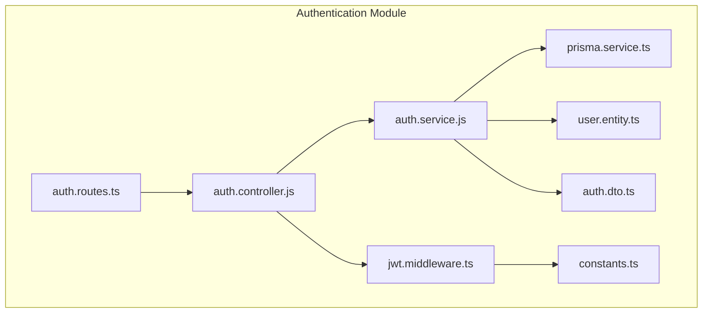
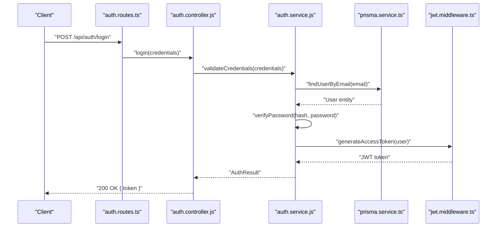
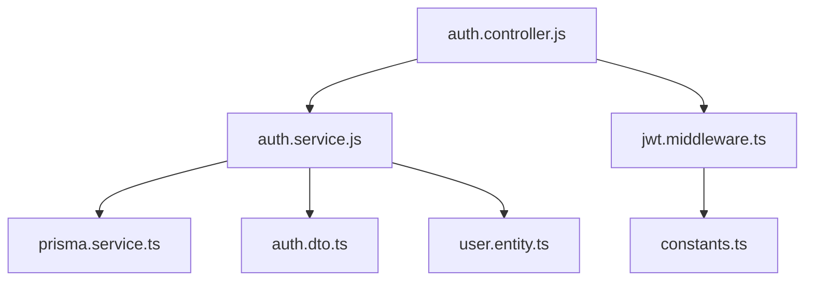

# Authentication Module

<cite>
**Referenced Files in This Document**
- [auth.controller.js](file://backend/src/modules/auth/auth.controller.js)
- [auth.service.js](file://backend/src/modules/auth/auth.service.js)
- [auth.routes.ts](file://backend/src/routes/auth.routes.ts)
- [jwt.middleware.ts](file://backend/src/middleware/jwt.middleware.ts)
- [auth.dto.ts](file://backend/src/dto/auth.dto.ts)
- [user.entity.ts](file://backend/src/modules/users/user.entity.ts)
- [prisma.service.ts](file://backend/src/prisma/prisma.service.ts)
- [constants.ts](file://backend/src/constants/constants.ts)
</cite>

## Table of Contents
1. [Introduction](#introduction)
2. [Project Structure](#project-structure)
3. [Core Components](#core-components)
4. [Architecture Overview](#architecture-overview)
5. [Detailed Component Analysis](#detailed-component-analysis)
6. [Dependency Analysis](#dependency-analysis)
7. [Performance Considerations](#performance-considerations)
8. [Troubleshooting Guide](#troubleshooting-guide)
9. [Conclusion](#conclusion)

## Introduction
This document provides comprehensive API documentation for the Authentication module of the social media application backend. It covers login, logout, registration, password reset, and token management endpoints. It also details JWT token handling, session management, security middleware, request/response schemas, validation rules, error handling patterns, and integration with authorization middleware and role-based access control.

## Project Structure
The authentication module is organized under the backend/src/modules/auth directory and integrates with shared DTOs, middleware, and database services. Key components include:
- Controller: Handles HTTP requests and delegates to the service layer
- Service: Implements business logic for authentication operations
- Routes: Defines endpoint paths and HTTP methods
- Middleware: Provides JWT verification and authorization checks
- DTOs: Standardizes request/response schemas
- Entities and Prisma: Data access and persistence
- Constants: Security-related configuration values

**Diagram sources**
- [auth.controller.js](file://backend/src/modules/auth/auth.controller.js)
- [auth.service.js](file://backend/src/modules/auth/auth.service.js)
- [auth.routes.ts](file://backend/src/routes/auth.routes.ts)
- [jwt.middleware.ts](file://backend/src/middleware/jwt.middleware.ts)
- [auth.dto.ts](file://backend/src/dto/auth.dto.ts)
- [user.entity.ts](file://backend/src/modules/users/user.entity.ts)
- [prisma.service.ts](file://backend/src/prisma/prisma.service.ts)
- [constants.ts](file://backend/src/constants/constants.ts)

**Section sources**
- [auth.controller.js](file://backend/src/modules/auth/auth.controller.js)
- [auth.service.js](file://backend/src/modules/auth/auth.service.js)
- [auth.routes.ts](file://backend/src/routes/auth.routes.ts)
- [jwt.middleware.ts](file://backend/src/middleware/jwt.middleware.ts)
- [auth.dto.ts](file://backend/src/dto/auth.dto.ts)
- [user.entity.ts](file://backend/src/modules/users/user.entity.ts)
- [prisma.service.ts](file://backend/src/prisma/prisma.service.ts)
- [constants.ts](file://backend/src/constants/constants.ts)

## Core Components
- Authentication Controller: Exposes endpoints for login, logout, registration, password reset, and token refresh. It validates inputs via DTOs, invokes service methods, and manages response formatting.
- Authentication Service: Implements core logic for user authentication, token generation/refresh, password hashing, and database interactions using Prisma.
- Authentication Routes: Declares endpoint paths and HTTP methods for authentication operations.
- JWT Middleware: Verifies JWT tokens, extracts user identity, and enforces authorization policies.
- Authentication DTOs: Define structured request/response schemas for validation and serialization.
- User Entity: Represents user data model and relationships.
- Prisma Service: Provides database connectivity and query abstraction.
- Constants: Stores security-related configuration such as JWT secret, expiration times, and token refresh windows.

**Section sources**
- [auth.controller.js](file://backend/src/modules/auth/auth.controller.js)
- [auth.service.js](file://backend/src/modules/auth/auth.service.js)
- [auth.routes.ts](file://backend/src/routes/auth.routes.ts)
- [jwt.middleware.ts](file://backend/src/middleware/jwt.middleware.ts)
- [auth.dto.ts](file://backend/src/dto/auth.dto.ts)
- [user.entity.ts](file://backend/src/modules/users/user.entity.ts)
- [prisma.service.ts](file://backend/src/prisma/prisma.service.ts)
- [constants.ts](file://backend/src/constants/constants.ts)

## Architecture Overview
The authentication flow integrates route handlers, controller actions, service logic, middleware, and database access. JWT middleware ensures protected endpoints require valid tokens. Authorization middleware enforces role-based access control.

**Diagram sources**
- [auth.routes.ts](file://backend/src/routes/auth.routes.ts)
- [auth.controller.js](file://backend/src/modules/auth/auth.controller.js)
- [auth.service.js](file://backend/src/modules/auth/auth.service.js)
- [prisma.service.ts](file://backend/src/prisma/prisma.service.ts)
- [jwt.middleware.ts](file://backend/src/middleware/jwt.middleware.ts)

## Detailed Component Analysis

### Authentication Controller
Responsibilities:
- Accepts login, logout, registration, password reset, and token refresh requests
- Validates inputs using DTOs
- Delegates business logic to the service layer
- Returns standardized responses and handles errors

Key endpoints:
- POST /api/auth/login
- POST /api/auth/logout
- POST /api/auth/register
- POST /api/auth/password-reset
- POST /api/auth/token-refresh

Response patterns:
- Success responses return appropriate status codes and payload structures
- Error responses include status codes, error messages, and optional details

**Section sources**
- [auth.controller.js](file://backend/src/modules/auth/auth.controller.js)

### Authentication Service
Responsibilities:
- User registration with password hashing
- Login validation and JWT token generation
- Password reset initiation and verification
- Token refresh and rotation
- Secure logout procedures

Token management:
- Access tokens are generated with defined expiration
- Refresh tokens are issued and validated for rotation
- Logout invalidates current session tokens

Security measures:
- Password hashing before storage
- Input sanitization and validation
- Secure token signing and verification

**Section sources**
- [auth.service.js](file://backend/src/modules/auth/auth.service.js)

### Authentication Routes
Endpoints:
- POST /api/auth/login
- POST /api/auth/logout
- POST /api/auth/register
- POST /api/auth/password-reset
- POST /api/auth/token-refresh

HTTP methods and path parameters:
- All endpoints use POST except where otherwise noted
- Path parameters are minimal and rely on request body validation

**Section sources**
- [auth.routes.ts](file://backend/src/routes/auth.routes.ts)

### JWT Middleware
Responsibilities:
- Verify JWT tokens in incoming requests
- Extract user identity and roles
- Enforce authorization policies
- Reject invalid or expired tokens

Integration:
- Applied to protected routes
- Supports role-based access control

**Section sources**
- [jwt.middleware.ts](file://backend/src/middleware/jwt.middleware.ts)

### Authentication DTOs
Purpose:
- Define request/response schemas for validation
- Ensure consistent data structures across endpoints

Common fields:
- Credentials: email, password
- Registration: email, password, confirm password
- Password reset: email, reset token, new password
- Token refresh: refresh token

Validation rules:
- Email format validation
- Password strength requirements
- Token presence and validity checks

**Section sources**
- [auth.dto.ts](file://backend/src/dto/auth.dto.ts)

### User Entity and Prisma Service
User entity:
- Represents user data model
- Includes identifiers, credentials, and metadata

Prisma integration:
- Database queries for user lookup and updates
- Transaction support for atomic operations

**Section sources**
- [user.entity.ts](file://backend/src/modules/users/user.entity.ts)
- [prisma.service.ts](file://backend/src/prisma/prisma.service.ts)

### Constants
Security configuration:
- JWT secret key
- Access token expiration
- Refresh token expiration
- Token refresh window

**Section sources**
- [constants.ts](file://backend/src/constants/constants.ts)

## Dependency Analysis
The authentication module depends on shared DTOs, middleware, and database services. JWT middleware enforces authorization policies across protected endpoints.

**Diagram sources**
- [auth.controller.js](file://backend/src/modules/auth/auth.controller.js)
- [auth.service.js](file://backend/src/modules/auth/auth.service.js)
- [auth.dto.ts](file://backend/src/dto/auth.dto.ts)
- [jwt.middleware.ts](file://backend/src/middleware/jwt.middleware.ts)
- [user.entity.ts](file://backend/src/modules/users/user.entity.ts)
- [prisma.service.ts](file://backend/src/prisma/prisma.service.ts)
- [constants.ts](file://backend/src/constants/constants.ts)

**Section sources**
- [auth.controller.js](file://backend/src/modules/auth/auth.controller.js)
- [auth.service.js](file://backend/src/modules/auth/auth.service.js)
- [auth.dto.ts](file://backend/src/dto/auth.dto.ts)
- [jwt.middleware.ts](file://backend/src/middleware/jwt.middleware.ts)
- [user.entity.ts](file://backend/src/modules/users/user.entity.ts)
- [prisma.service.ts](file://backend/src/prisma/prisma.service.ts)
- [constants.ts](file://backend/src/constants/constants.ts)

## Performance Considerations
- Token caching: Consider caching frequently accessed user roles to reduce database queries
- Asynchronous operations: Ensure long-running tasks (e.g., password resets) are handled asynchronously
- Database indexing: Index user email for fast lookup during authentication
- Rate limiting: Implement rate limits on login attempts to prevent brute force attacks
- Token lifecycle: Optimize token expiration and refresh intervals to balance security and usability

## Troubleshooting Guide
Common issues and resolutions:
- Invalid credentials: Ensure email format and password requirements are met
- Token verification failures: Confirm JWT secret and expiration settings match client configuration
- Database connection errors: Verify Prisma configuration and connection pool settings
- Role-based access denials: Check user roles and middleware authorization rules
- Password reset failures: Validate reset token and ensure it is within the allowed time window

Error handling patterns:
- Standardized error responses with status codes and messages
- Logging of authentication events for audit trails
- Graceful degradation for service outages

**Section sources**
- [auth.controller.js](file://backend/src/modules/auth/auth.controller.js)
- [auth.service.js](file://backend/src/modules/auth/auth.service.js)
- [jwt.middleware.ts](file://backend/src/middleware/jwt.middleware.ts)

## Conclusion
The Authentication module provides a robust foundation for user authentication, secure token management, and authorization enforcement. By leveraging DTOs, middleware, and Prisma, it ensures consistent validation, secure operations, and scalable performance. Integrating with role-based access control enables fine-grained permissions across the application.