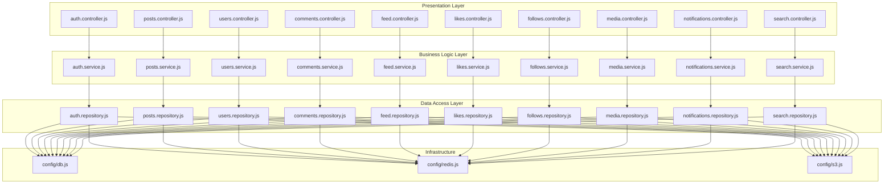
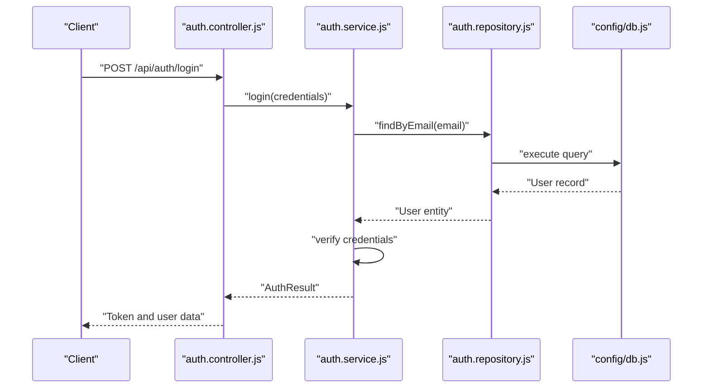
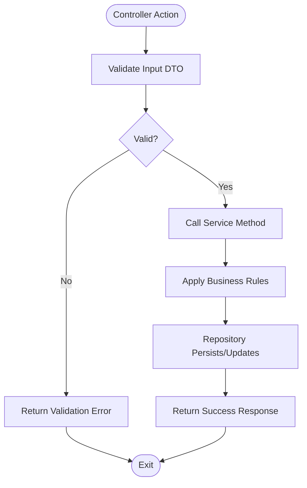
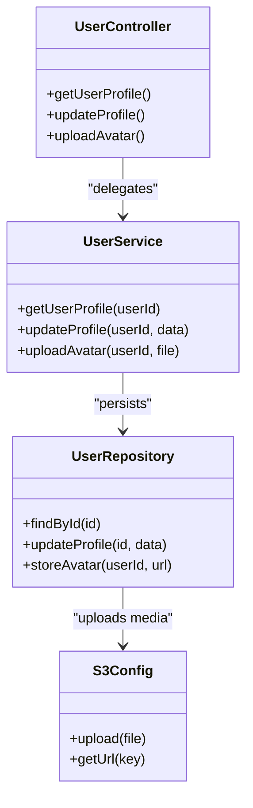
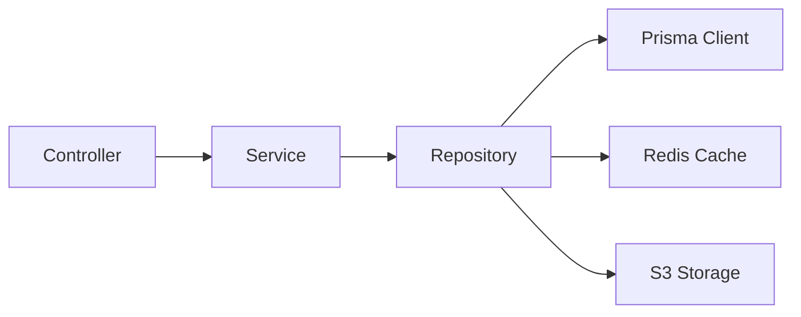
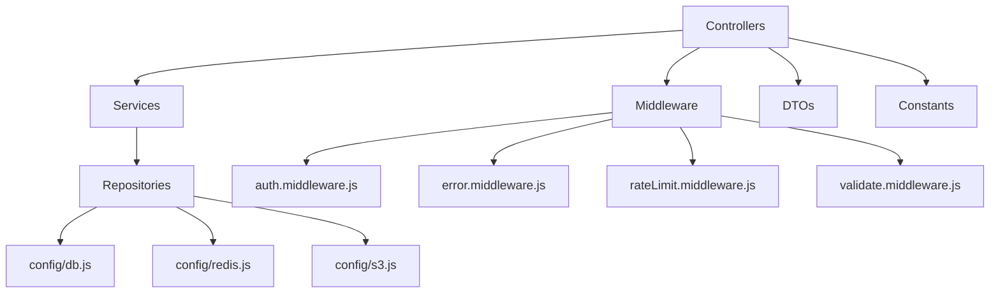

# Architecture Overview

<cite>
**Referenced Files in This Document**
- [server.js](file://backend/server.js)
- [app.js](file://backend/src/app.js)
- [db.js](file://backend/src/config/db.js)
- [redis.js](file://backend/src/config/redis.js)
- [s3.js](file://backend/src/config/s3.js)
- [auth.controller.js](file://backend/src/modules/auth/auth.controller.js)
- [auth.service.js](file://backend/src/modules/auth/auth.service.js)
- [auth.repository.js](file://backend/src/modules/auth/auth.repository.js)
- [auth.routes.js](file://backend/src/modules/auth/auth.routes.js)
- [auth.middleware.js](file://backend/src/middleware/auth.middleware.js)
- [error.middleware.js](file://backend/src/middleware/error.middleware.js)
- [rateLimit.middleware.js](file://backend/src/middleware/rateLimit.middleware.js)
- [validate.middleware.js](file://backend/src/middleware/validate.middleware.js)
- [posts.controller.js](file://backend/src/modules/posts/posts.controller.js)
- [posts.service.js](file://backend/src/modules/posts/posts.service.js)
- [posts.repository.js](file://backend/src/modules/posts/posts.repository.js)
- [users.controller.js](file://backend/src/modules/users/users.controller.js)
- [users.service.js](file://backend/src/modules/users/users.service.js)
- [users.repository.js](file://backend/src/modules/users/users.repository.js)
- [comments.controller.js](file://backend/src/modules/comments/comments.controller.js)
- [comments.service.js](file://backend/src/modules/comments/comments.service.js)
- [comments.repository.js](file://backend/src/modules/comments/comments.repository.js)
- [feed.controller.js](file://backend/src/modules/feed/feed.controller.js)
- [feed.service.js](file://backend/src/modules/feed/feed.service.js)
- [follows.controller.js](file://backend/src/modules/follows/follows.controller.js)
- [follows.service.js](file://backend/src/modules/follows/follows.service.js)
- [likes.controller.js](file://backend/src/modules/likes/likes.controller.js)
- [likes.service.js](file://backend/src/modules/likes/likes.service.js)
- [media.controller.js](file://backend/src/modules/media/media.controller.js)
- [media.service.js](file://backend/src/modules/media/media.service.js)
- [notifications.controller.js](file://backend/src/modules/notifications/notifications.controller.js)
- [notifications.service.js](file://backend/src/modules/notifications/notifications.service.js)
- [search.controller.js](file://backend/src/modules/search/search.controller.js)
- [search.service.js](file://backend/src/modules/search/search.service.js)
- [errors.js](file://backend/src/constants/errors.js)
- [roles.js](file://backend/src/constants/roles.js)
- [post.dto.js](file://backend/src/dto/post.dto.js)
- [user.dto.js](file://backend/src/dto/user.dto.js)
</cite>

## Table of Contents
1. [Introduction](#introduction)
2. [Project Structure](#project-structure)
3. [Core Components](#core-components)
4. [Architecture Overview](#architecture-overview)
5. [Detailed Component Analysis](#detailed-component-analysis)
6. [Dependency Analysis](#dependency-analysis)
7. [Performance Considerations](#performance-considerations)
8. [Troubleshooting Guide](#troubleshooting-guide)
9. [Conclusion](#conclusion)

## Introduction
This document presents a comprehensive architecture overview of the Node.js social media backend. It explains the modular architecture pattern, layered design (presentation, business logic, data access), technology stack choices, dependency injection patterns, and service layer organization. It also documents module interactions, data flow patterns, cross-cutting concerns, system boundaries, external integrations, scalability considerations, and maintainability strategies.

## Project Structure
The backend follows a feature-based modular structure under the src directory, organized into:
- config: Environment-specific configurations for database, caching, and cloud storage
- constants: Shared constants for errors and roles
- dto: Data Transfer Objects for request/response shaping
- middleware: Cross-cutting concerns (authentication, validation, rate limiting, error handling)
- modules: Feature-focused modules (auth, posts, users, comments, feed, follows, likes, media, notifications, search)
- routes: Route registration and endpoint definitions per module
- utils: Utility functions and helpers

```mermaid
graph TB
subgraph "Backend Root"
S["server.js"]
A["src/app.js"]
end
subgraph "Config"
DB["config/db.js"]
RD["config/redis.js"]
S3["config/s3.js"]
end
subgraph "Constants"
ERR["constants/errors.js"]
RL["constants/roles.js"]
end
subgraph "DTO"
PD["dto/post.dto.js"]
UD["dto/user.dto.js"]
end
subgraph "Middleware"
AMW["middleware/auth.middleware.js"]
EMW["middleware/error.middleware.js"]
RMW["middleware/rateLimit.middleware.js"]
VMW["middleware/validate.middleware.js"]
end
subgraph "Modules"
AUTH["modules/auth/*"]
POSTS["modules/posts/*"]
USERS["modules/users/*"]
COMMENTS["modules/comments/*"]
FEED["modules/feed/*"]
FOLLOWS["modules/follows/*"]
LIKES["modules/likes/*"]
MEDIA["modules/media/*"]
NOTIF["modules/notifications/*"]
SEARCH["modules/search/*"]
end
S --> A
A --> DB
A --> RD
A --> S3
A --> AUTH
A --> POSTS
A --> USERS
A --> COMMENTS
A --> FEED
A --> FOLLOWS
A --> LIKES
A --> MEDIA
A --> NOTIF
A --> SEARCH
A --> AMW
A --> EMW
A --> RMW
A --> VMW
A --> ERR
A --> RL
A --> PD
A --> UD
```

**Diagram sources**
- [server.js:1-1](file://backend/server.js#L1-L1)
- [app.js:1-1](file://backend/src/app.js#L1-L1)
- [db.js:1-1](file://backend/src/config/db.js#L1-L1)
- [redis.js:1-1](file://backend/src/config/redis.js#L1-L1)
- [s3.js:1-1](file://backend/src/config/s3.js#L1-L1)
- [auth.controller.js](file://backend/src/modules/auth/auth.controller.js)
- [posts.controller.js](file://backend/src/modules/posts/posts.controller.js)
- [users.controller.js](file://backend/src/modules/users/users.controller.js)
- [comments.controller.js](file://backend/src/modules/comments/comments.controller.js)
- [feed.controller.js](file://backend/src/modules/feed/feed.controller.js)
- [follows.controller.js](file://backend/src/modules/follows/follows.controller.js)
- [likes.controller.js](file://backend/src/modules/likes/likes.controller.js)
- [media.controller.js](file://backend/src/modules/media/media.controller.js)
- [notifications.controller.js](file://backend/src/modules/notifications/notifications.controller.js)
- [search.controller.js](file://backend/src/modules/search/search.controller.js)
- [auth.middleware.js](file://backend/src/middleware/auth.middleware.js)
- [error.middleware.js](file://backend/src/middleware/error.middleware.js)
- [rateLimit.middleware.js](file://backend/src/middleware/rateLimit.middleware.js)
- [validate.middleware.js](file://backend/src/middleware/validate.middleware.js)
- [errors.js](file://backend/src/constants/errors.js)
- [roles.js](file://backend/src/constants/roles.js)
- [post.dto.js](file://backend/src/dto/post.dto.js)
- [user.dto.js](file://backend/src/dto/user.dto.js)

**Section sources**
- [server.js:1-1](file://backend/server.js#L1-L1)
- [app.js:1-1](file://backend/src/app.js#L1-L1)

## Core Components
- Application bootstrap: server.js initializes the runtime and delegates to the application factory in app.js
- Application factory: app.js composes middleware, routes, and configuration modules
- Configuration: db.js, redis.js, s3.js encapsulate external service connections
- Middleware: auth, error, rate limit, and validation middleware enforce cross-cutting policies
- Modules: Each feature module exposes controller, service, repository, DTO, validation, and route files
- Constants: errors and roles define shared domain semantics
- DTOs: post.dto.js and user.dto.js standardize request/response shapes

Key architectural decisions:
- Feature-based modularity improves cohesion and reduces coupling
- Clear separation of concerns across presentation, business logic, and data access layers
- Centralized configuration and constants promote maintainability
- Middleware ensures consistent cross-cutting behavior

**Section sources**
- [server.js:1-1](file://backend/server.js#L1-L1)
- [app.js:1-1](file://backend/src/app.js#L1-L1)
- [db.js:1-1](file://backend/src/config/db.js#L1-L1)
- [redis.js:1-1](file://backend/src/config/redis.js#L1-L1)
- [s3.js:1-1](file://backend/src/config/s3.js#L1-L1)
- [auth.middleware.js](file://backend/src/middleware/auth.middleware.js)
- [error.middleware.js](file://backend/src/middleware/error.middleware.js)
- [rateLimit.middleware.js](file://backend/src/middleware/rateLimit.middleware.js)
- [validate.middleware.js](file://backend/src/middleware/validate.middleware.js)
- [errors.js](file://backend/src/constants/errors.js)
- [roles.js](file://backend/src/constants/roles.js)
- [post.dto.js](file://backend/src/dto/post.dto.js)
- [user.dto.js](file://backend/src/dto/user.dto.js)

## Architecture Overview
The system employs a layered architecture:
- Presentation Layer: Controllers expose REST endpoints via route definitions
- Business Logic Layer: Services orchestrate use-case logic, coordinate repositories, and apply validations
- Data Access Layer: Repositories abstract persistence operations and integrate with Prisma and external services
- Infrastructure: Configuration modules manage database, Redis cache, and S3 storage

**Diagram sources**
- [auth.controller.js](file://backend/src/modules/auth/auth.controller.js)
- [auth.service.js](file://backend/src/modules/auth/auth.service.js)
- [auth.repository.js](file://backend/src/modules/auth/auth.repository.js)
- [posts.controller.js](file://backend/src/modules/posts/posts.controller.js)
- [posts.service.js](file://backend/src/modules/posts/posts.service.js)
- [posts.repository.js](file://backend/src/modules/posts/posts.repository.js)
- [users.controller.js](file://backend/src/modules/users/users.controller.js)
- [users.service.js](file://backend/src/modules/users/users.service.js)
- [users.repository.js](file://backend/src/modules/users/users.repository.js)
- [comments.controller.js](file://backend/src/modules/comments/comments.controller.js)
- [comments.service.js](file://backend/src/modules/comments/comments.service.js)
- [comments.repository.js](file://backend/src/modules/comments/comments.repository.js)
- [feed.controller.js](file://backend/src/modules/feed/feed.controller.js)
- [feed.service.js](file://backend/src/modules/feed/feed.service.js)
- [follows.controller.js](file://backend/src/modules/follows/follows.controller.js)
- [follows.service.js](file://backend/src/modules/follows/follows.service.js)
- [likes.controller.js](file://backend/src/modules/likes/likes.controller.js)
- [likes.service.js](file://backend/src/modules/likes/likes.service.js)
- [media.controller.js](file://backend/src/modules/media/media.controller.js)
- [media.service.js](file://backend/src/modules/media/media.service.js)
- [notifications.controller.js](file://backend/src/modules/notifications/notifications.controller.js)
- [notifications.service.js](file://backend/src/modules/notifications/notifications.service.js)
- [search.controller.js](file://backend/src/modules/search/search.controller.js)
- [search.service.js](file://backend/src/modules/search/search.service.js)
- [db.js](file://backend/src/config/db.js)
- [redis.js](file://backend/src/config/redis.js)
- [s3.js](file://backend/src/config/s3.js)

## Detailed Component Analysis

### Authentication Module
The auth module demonstrates the standard layered pattern:
- Controller handles HTTP requests and responses
- Service encapsulates business logic (e.g., token generation, credential verification)
- Repository abstracts persistence operations
- Routes register endpoints
- Middleware enforces authentication and validation
- DTOs shape request/response payloads

**Diagram sources**
- [auth.controller.js](file://backend/src/modules/auth/auth.controller.js)
- [auth.service.js](file://backend/src/modules/auth/auth.service.js)
- [auth.repository.js](file://backend/src/modules/auth/auth.repository.js)
- [db.js](file://backend/src/config/db.js)

**Section sources**
- [auth.controller.js](file://backend/src/modules/auth/auth.controller.js)
- [auth.service.js](file://backend/src/modules/auth/auth.service.js)
- [auth.repository.js](file://backend/src/modules/auth/auth.repository.js)
- [auth.routes.js](file://backend/src/modules/auth/auth.routes.js)
- [auth.middleware.js](file://backend/src/middleware/auth.middleware.js)
- [auth.validation.js](file://backend/src/modules/auth/auth.validation.js)
- [post.dto.js](file://backend/src/dto/post.dto.js)
- [user.dto.js](file://backend/src/dto/user.dto.js)

### Posts Module
Posts module mirrors the auth module’s structure:
- Controller manages CRUD endpoints
- Service applies business rules (e.g., ownership checks, visibility)
- Repository integrates with Prisma and optional caching
- Routes bind endpoints to controller actions

**Diagram sources**
- [posts.controller.js](file://backend/src/modules/posts/posts.controller.js)
- [posts.service.js](file://backend/src/modules/posts/posts.service.js)
- [posts.repository.js](file://backend/src/modules/posts/posts.repository.js)

**Section sources**
- [posts.controller.js](file://backend/src/modules/posts/posts.controller.js)
- [posts.service.js](file://backend/src/modules/posts/posts.service.js)
- [posts.repository.js](file://backend/src/modules/posts/posts.repository.js)

### Users Module
Users module focuses on profile management, account operations, and role-based access:
- Controller handles profile updates, avatar uploads, and account settings
- Service enforces role checks and normalization
- Repository persists user data and integrates with S3 for media

**Diagram sources**
- [users.controller.js](file://backend/src/modules/users/users.controller.js)
- [users.service.js](file://backend/src/modules/users/users.service.js)
- [users.repository.js](file://backend/src/modules/users/users.repository.js)
- [s3.js](file://backend/src/config/s3.js)

**Section sources**
- [users.controller.js](file://backend/src/modules/users/users.controller.js)
- [users.service.js](file://backend/src/modules/users/users.service.js)
- [users.repository.js](file://backend/src/modules/users/users.repository.js)

### Comments, Feed, Follows, Likes, Media, Notifications, Search Modules
Each module follows the same layered pattern:
- Controller: Endpoint handlers
- Service: Use-case orchestration
- Repository: Persistence and integration
- Routes: Endpoint registration
- Middleware: Validation and auth enforcement
- DTOs: Request/response shaping

**Diagram sources**
- [comments.controller.js](file://backend/src/modules/comments/comments.controller.js)
- [comments.service.js](file://backend/src/modules/comments/comments.service.js)
- [comments.repository.js](file://backend/src/modules/comments/comments.repository.js)
- [feed.controller.js](file://backend/src/modules/feed/feed.controller.js)
- [feed.service.js](file://backend/src/modules/feed/feed.service.js)
- [follows.controller.js](file://backend/src/modules/follows/follows.controller.js)
- [follows.service.js](file://backend/src/modules/follows/follows.service.js)
- [likes.controller.js](file://backend/src/modules/likes/likes.controller.js)
- [likes.service.js](file://backend/src/modules/likes/likes.service.js)
- [media.controller.js](file://backend/src/modules/media/media.controller.js)
- [media.service.js](file://backend/src/modules/media/media.service.js)
- [notifications.controller.js](file://backend/src/modules/notifications/notifications.controller.js)
- [notifications.service.js](file://backend/src/modules/notifications/notifications.service.js)
- [search.controller.js](file://backend/src/modules/search/search.controller.js)
- [search.service.js](file://backend/src/modules/search/search.service.js)
- [db.js](file://backend/src/config/db.js)
- [redis.js](file://backend/src/config/redis.js)
- [s3.js](file://backend/src/config/s3.js)

**Section sources**
- [comments.controller.js](file://backend/src/modules/comments/comments.controller.js)
- [comments.service.js](file://backend/src/modules/comments/comments.service.js)
- [comments.repository.js](file://backend/src/modules/comments/comments.repository.js)
- [feed.controller.js](file://backend/src/modules/feed/feed.controller.js)
- [feed.service.js](file://backend/src/modules/feed/feed.service.js)
- [follows.controller.js](file://backend/src/modules/follows/follows.controller.js)
- [follows.service.js](file://backend/src/modules/follows/follows.service.js)
- [likes.controller.js](file://backend/src/modules/likes/likes.controller.js)
- [likes.service.js](file://backend/src/modules/likes/likes.service.js)
- [media.controller.js](file://backend/src/modules/media/media.controller.js)
- [media.service.js](file://backend/src/modules/media/media.service.js)
- [notifications.controller.js](file://backend/src/modules/notifications/notifications.controller.js)
- [notifications.service.js](file://backend/src/modules/notifications/notifications.service.js)
- [search.controller.js](file://backend/src/modules/search/search.controller.js)
- [search.service.js](file://backend/src/modules/search/search.service.js)

## Dependency Analysis
- Internal dependencies: Controllers depend on Services; Services depend on Repositories; Repositories depend on configuration modules (database, Redis, S3)
- External dependencies: Prisma client, Redis client, AWS SDK for S3
- Cross-cutting concerns: Middleware applied globally or per-route to enforce auth, validation, rate limits, and error handling
- DTOs and constants: Shared across modules to reduce duplication and improve consistency

**Diagram sources**
- [auth.controller.js](file://backend/src/modules/auth/auth.controller.js)
- [auth.service.js](file://backend/src/modules/auth/auth.service.js)
- [auth.repository.js](file://backend/src/modules/auth/auth.repository.js)
- [auth.middleware.js](file://backend/src/middleware/auth.middleware.js)
- [error.middleware.js](file://backend/src/middleware/error.middleware.js)
- [rateLimit.middleware.js](file://backend/src/middleware/rateLimit.middleware.js)
- [validate.middleware.js](file://backend/src/middleware/validate.middleware.js)
- [db.js](file://backend/src/config/db.js)
- [redis.js](file://backend/src/config/redis.js)
- [s3.js](file://backend/src/config/s3.js)
- [post.dto.js](file://backend/src/dto/post.dto.js)
- [user.dto.js](file://backend/src/dto/user.dto.js)
- [errors.js](file://backend/src/constants/errors.js)
- [roles.js](file://backend/src/constants/roles.js)

**Section sources**
- [errors.js](file://backend/src/constants/errors.js)
- [roles.js](file://backend/src/constants/roles.js)
- [validate.middleware.js](file://backend/src/middleware/validate.middleware.js)
- [rateLimit.middleware.js](file://backend/src/middleware/rateLimit.middleware.js)
- [error.middleware.js](file://backend/src/middleware/error.middleware.js)
- [auth.middleware.js](file://backend/src/middleware/auth.middleware.js)

## Performance Considerations
- Caching: Redis integration in repositories can reduce database load for frequently accessed data
- Asynchronous operations: Use async/await consistently to avoid blocking the event loop
- Pagination: Implement cursor-based pagination for feed and lists to limit payload sizes
- Compression: Enable gzip/brotli for API responses
- CDN: Offload media assets to S3 with CloudFront or similar CDN
- Connection pooling: Configure Prisma and Redis clients for optimal concurrency
- Monitoring: Add metrics and tracing for latency and error rates

## Troubleshooting Guide
- Error middleware: Centralized error handling transforms exceptions into structured responses
- Validation middleware: Ensures request payloads conform to DTOs and returns validation errors early
- Rate limiting: Protects endpoints from abuse while allowing legitimate traffic
- Authentication middleware: Enforces bearer tokens and scopes for protected routes

Operational tips:
- Review error logs and correlation IDs to trace failures
- Monitor Redis hit rates and cache TTLs
- Audit database queries and slow transactions
- Validate S3 upload permissions and presigned URLs

**Section sources**
- [error.middleware.js](file://backend/src/middleware/error.middleware.js)
- [validate.middleware.js](file://backend/src/middleware/validate.middleware.js)
- [rateLimit.middleware.js](file://backend/src/middleware/rateLimit.middleware.js)
- [auth.middleware.js](file://backend/src/middleware/auth.middleware.js)

## Conclusion
The backend employs a clean, modular architecture with clear separation of concerns across presentation, business logic, and data access layers. Feature-based modules promote maintainability and scalability. Cross-cutting concerns are centralized via middleware, while configuration modules encapsulate infrastructure dependencies. The design supports extensibility, observability, and robustness through caching, validation, and error handling. Adopting the recommended performance and monitoring practices will further strengthen the system’s reliability and scalability.