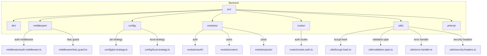
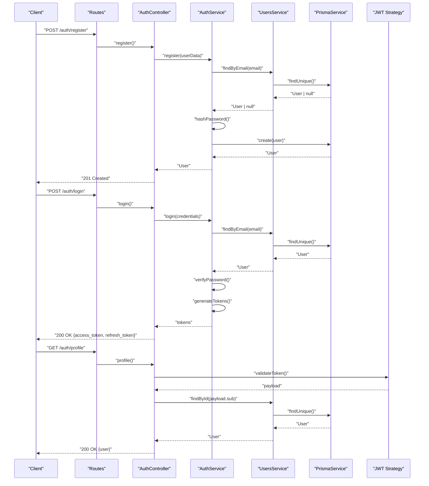
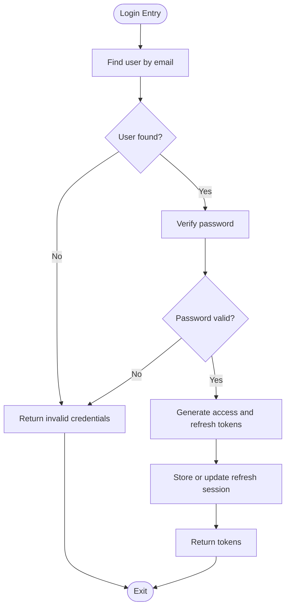
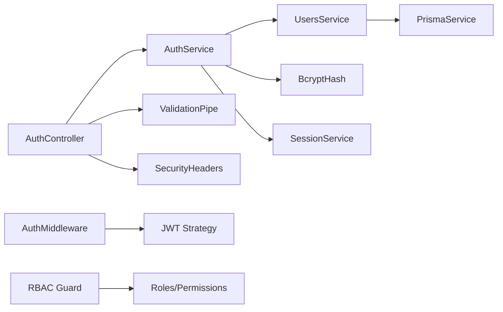

# Authentication System

<cite>
**Referenced Files in This Document**
- [package.json](file://backend/package.json)
- [auth.controller.ts](file://backend/src/modules/auth/auth.controller.ts)
- [auth.service.ts](file://backend/src/modules/auth/auth.service.ts)
- [auth.middleware.ts](file://backend/src/middleware/auth.middleware.ts)
- [jwt.strategy.ts](file://backend/src/config/jwt.strategy.ts)
- [local.strategy.ts](file://backend/src/config/local.strategy.ts)
- [user.entity.ts](file://backend/src/modules/users/user.entity.ts)
- [users.service.ts](file://backend/src/modules/users/users.service.ts)
- [prisma.service.ts](file://backend/src/prisma/prisma.service.ts)
- [bcrypt.hash.ts](file://backend/src/utils/bcrypt.hash.ts)
- [validation.pipe.ts](file://backend/src/utils/validation.pipe.ts)
- [auth.dto.ts](file://backend/src/dto/auth.dto.ts)
- [user.dto.ts](file://backend/src/dto/user.dto.ts)
- [error.handler.ts](file://backend/src/utils/error.handler.ts)
- [security.headers.ts](file://backend/src/utils/security.headers.ts)
- [session.service.ts](file://backend/src/modules/auth/session.service.ts)
- [refresh.token.service.ts](file://backend/src/modules/auth/refresh.token.service.ts)
- [rbac.guard.ts](file://backend/src/middleware/rbac.guard.ts)
- [permissions.ts](file://backend/src/constants/permissions.ts)
- [roles.ts](file://backend/src/constants/roles.ts)
- [routes.auth.ts](file://backend/src/routes/routes.auth.ts)
- [app.module.ts](file://backend/src/app.module.ts)
</cite>

## Table of Contents
1. [Introduction](#introduction)
2. [Project Structure](#project-structure)
3. [Core Components](#core-components)
4. [Architecture Overview](#architecture-overview)
5. [Detailed Component Analysis](#detailed-component-analysis)
6. [Dependency Analysis](#dependency-analysis)
7. [Performance Considerations](#performance-considerations)
8. [Troubleshooting Guide](#troubleshooting-guide)
9. [Conclusion](#conclusion)

## Introduction
This document provides comprehensive documentation for the authentication and authorization system of the social media application. It covers JWT token implementation, session management, user registration and login processes, authentication middleware, role-based access control (RBAC), permissions, password hashing, token refresh mechanisms, security headers, DTOs, validation rules, error handling, and practical examples for protected routes and secure token storage. The goal is to make the system understandable for both developers and security practitioners while maintaining accessibility for readers with limited technical backgrounds.

## Project Structure
The backend is organized around modular components with clear separation of concerns:
- Modules: Feature-based grouping (e.g., auth, users, posts)
- DTOs: Request/response data transfer objects
- Middleware: Authentication and RBAC guards
- Config: Passport strategies and JWT configuration
- Utils: Validation pipes, hashing utilities, error handlers, and security headers
- Routes: Public and protected route definitions
- Prisma: Database service for persistence

**Diagram sources**
- [app.module.ts](file://backend/src/app.module.ts)
- [routes.auth.ts](file://backend/src/routes/routes.auth.ts)
- [auth.middleware.ts](file://backend/src/middleware/auth.middleware.ts)
- [rbac.guard.ts](file://backend/src/middleware/rbac.guard.ts)
- [jwt.strategy.ts](file://backend/src/config/jwt.strategy.ts)
- [local.strategy.ts](file://backend/src/config/local.strategy.ts)
- [bcrypt.hash.ts](file://backend/src/utils/bcrypt.hash.ts)
- [validation.pipe.ts](file://backend/src/utils/validation.pipe.ts)
- [error.handler.ts](file://backend/src/utils/error.handler.ts)
- [security.headers.ts](file://backend/src/utils/security.headers.ts)

**Section sources**
- [package.json](file://backend/package.json)

## Core Components
- Authentication controller: Orchestrates registration, login, logout, and refresh flows
- Authentication service: Implements business logic for user creation, credential verification, token generation, and session management
- Authentication middleware: Extracts and validates JWT tokens for protected routes
- RBAC guard: Enforces role-based access control for protected endpoints
- Passport strategies: Local strategy for username/password and JWT strategy for bearer tokens
- DTOs: Strongly typed request/response contracts for auth operations
- Validation pipe: Centralized validation and sanitization
- Security utilities: Password hashing, error handling, and security headers
- Session and refresh token services: Manage user sessions and refresh tokens
- Permissions and roles constants: Define access policies

**Section sources**
- [auth.controller.ts](file://backend/src/modules/auth/auth.controller.ts)
- [auth.service.ts](file://backend/src/modules/auth/auth.service.ts)
- [auth.middleware.ts](file://backend/src/middleware/auth.middleware.ts)
- [rbac.guard.ts](file://backend/src/middleware/rbac.guard.ts)
- [jwt.strategy.ts](file://backend/src/config/jwt.strategy.ts)
- [local.strategy.ts](file://backend/src/config/local.strategy.ts)
- [auth.dto.ts](file://backend/src/dto/auth.dto.ts)
- [validation.pipe.ts](file://backend/src/utils/validation.pipe.ts)
- [bcrypt.hash.ts](file://backend/src/utils/bcrypt.hash.ts)
- [error.handler.ts](file://backend/src/utils/error.handler.ts)
- [security.headers.ts](file://backend/src/utils/security.headers.ts)
- [session.service.ts](file://backend/src/modules/auth/session.service.ts)
- [refresh.token.service.ts](file://backend/src/modules/auth/refresh.token.service.ts)
- [permissions.ts](file://backend/src/constants/permissions.ts)
- [roles.ts](file://backend/src/constants/roles.ts)

## Architecture Overview
The authentication system integrates Passport strategies, NestJS guards, and domain services to provide secure authentication and authorization.

**Diagram sources**
- [routes.auth.ts](file://backend/src/routes/routes.auth.ts)
- [auth.controller.ts](file://backend/src/modules/auth/auth.controller.ts)
- [auth.service.ts](file://backend/src/modules/auth/auth.service.ts)
- [users.service.ts](file://backend/src/modules/users/users.service.ts)
- [prisma.service.ts](file://backend/src/prisma/prisma.service.ts)
- [jwt.strategy.ts](file://backend/src/config/jwt.strategy.ts)

## Detailed Component Analysis

### Authentication Controller
Responsibilities:
- Expose endpoints for registration, login, logout, refresh, and profile retrieval
- Delegate business logic to AuthService
- Apply validation pipes for DTOs
- Set security headers and manage cookies for refresh tokens

Key flows:
- Registration: Validates DTO, checks uniqueness, hashes password, persists user
- Login: Verifies credentials, generates access and refresh tokens
- Profile: Uses JWT strategy to extract user identity from access token
- Logout: Invalidates refresh token session

Security considerations:
- DTO validation prevents malformed requests
- Secure cookie flags for refresh token
- CORS and HSTS headers applied via utilities

**Section sources**
- [auth.controller.ts](file://backend/src/modules/auth/auth.controller.ts)
- [auth.dto.ts](file://backend/src/dto/auth.dto.ts)
- [validation.pipe.ts](file://backend/src/utils/validation.pipe.ts)
- [security.headers.ts](file://backend/src/utils/security.headers.ts)

### Authentication Service
Responsibilities:
- User lifecycle operations: create, find by email, find by ID
- Credential verification: compare hashed passwords
- Token generation: access and refresh tokens with expiration
- Session management: store refresh tokens and track sessions
- Password hashing: bcrypt integration

Processing logic:
- Registration: check existing user, hash password, persist
- Login: locate user, verify password, issue tokens
- Token generation: payload includes user ID and role, signed with secret
- Refresh: validate refresh token, regenerate access token, rotate refresh token

**Diagram sources**
- [auth.service.ts](file://backend/src/modules/auth/auth.service.ts)
- [bcrypt.hash.ts](file://backend/src/utils/bcrypt.hash.ts)
- [session.service.ts](file://backend/src/modules/auth/session.service.ts)

**Section sources**
- [auth.service.ts](file://backend/src/modules/auth/auth.service.ts)
- [bcrypt.hash.ts](file://backend/src/utils/bcrypt.hash.ts)
- [session.service.ts](file://backend/src/modules/auth/session.service.ts)

### Authentication Middleware (JWT)
Responsibilities:
- Extract Authorization header
- Validate JWT signature and claims
- Attach user payload to request for downstream handlers

Behavior:
- Supports bearer token scheme
- Handles expired or invalid tokens
- Integrates with Passport JWT strategy

**Section sources**
- [auth.middleware.ts](file://backend/src/middleware/auth.middleware.ts)
- [jwt.strategy.ts](file://backend/src/config/jwt.strategy.ts)

### Role-Based Access Control (RBAC)
Responsibilities:
- Guard protected routes based on user roles and permissions
- Enforce policy rules centrally
- Integrate with controllers and routes

Implementation pattern:
- Decorators define required roles/permissions
- Guard resolves current user from request and evaluates access

**Section sources**
- [rbac.guard.ts](file://backend/src/middleware/rbac.guard.ts)
- [roles.ts](file://backend/src/constants/roles.ts)
- [permissions.ts](file://backend/src/constants/permissions.ts)

### Passport Strategies
- Local strategy: Authenticates users via username/email and password
- JWT strategy: Authenticates via access token and extracts user identity

Integration:
- Strategies configured in application module
- Used by middleware and controllers

**Section sources**
- [local.strategy.ts](file://backend/src/config/local.strategy.ts)
- [jwt.strategy.ts](file://backend/src/config/jwt.strategy.ts)
- [app.module.ts](file://backend/src/app.module.ts)

### DTOs and Validation
- Auth DTOs: Registration, login, and token refresh DTOs with validation decorators
- User DTOs: Profile and update DTOs
- Validation pipe: Transforms and validates incoming requests

Validation rules:
- Email format and presence
- Password length and complexity
- Unique constraints enforced at service level

**Section sources**
- [auth.dto.ts](file://backend/src/dto/auth.dto.ts)
- [user.dto.ts](file://backend/src/dto/user.dto.ts)
- [validation.pipe.ts](file://backend/src/utils/validation.pipe.ts)

### Password Hashing
- bcrypt integration for secure password hashing
- Salt rounds configured for performance vs security balance
- Hashing performed during registration and password updates

**Section sources**
- [bcrypt.hash.ts](file://backend/src/utils/bcrypt.hash.ts)
- [auth.service.ts](file://backend/src/modules/auth/auth.service.ts)

### Token Refresh Mechanism
- Refresh tokens stored securely (database/session store)
- Rotation on successful refresh to mitigate replay attacks
- Expiration handling and cleanup

**Section sources**
- [refresh.token.service.ts](file://backend/src/modules/auth/refresh.token.service.ts)
- [session.service.ts](file://backend/src/modules/auth/session.service.ts)

### Security Headers
- CORS configuration for trusted origins
- HSTS, CSP, X-Content-Type-Options, X-Frame-Options headers
- Cookie security flags (HttpOnly, Secure, SameSite)

**Section sources**
- [security.headers.ts](file://backend/src/utils/security.headers.ts)

### Protected Routes and Examples
Protected routes:
- Profile endpoint secured by JWT middleware
- Admin-only endpoints guarded by RBAC

Example usage:
- Client sends Authorization: Bearer <access_token>
- Server validates token and attaches user to request
- Controllers return protected data

**Section sources**
- [routes.auth.ts](file://backend/src/routes/routes.auth.ts)
- [auth.middleware.ts](file://backend/src/middleware/auth.middleware.ts)
- [rbac.guard.ts](file://backend/src/middleware/rbac.guard.ts)

## Dependency Analysis
The authentication system exhibits low coupling and high cohesion:
- Controller depends on service interface
- Service depends on domain entities and database service
- Middleware depends on Passport strategies
- RBAC guard depends on roles and permissions constants
- Utilities encapsulate cross-cutting concerns

**Diagram sources**
- [auth.controller.ts](file://backend/src/modules/auth/auth.controller.ts)
- [auth.service.ts](file://backend/src/modules/auth/auth.service.ts)
- [users.service.ts](file://backend/src/modules/users/users.service.ts)
- [bcrypt.hash.ts](file://backend/src/utils/bcrypt.hash.ts)
- [session.service.ts](file://backend/src/modules/auth/session.service.ts)
- [auth.middleware.ts](file://backend/src/middleware/auth.middleware.ts)
- [jwt.strategy.ts](file://backend/src/config/jwt.strategy.ts)
- [rbac.guard.ts](file://backend/src/middleware/rbac.guard.ts)
- [roles.ts](file://backend/src/constants/roles.ts)
- [permissions.ts](file://backend/src/constants/permissions.ts)
- [prisma.service.ts](file://backend/src/prisma/prisma.service.ts)

**Section sources**
- [auth.controller.ts](file://backend/src/modules/auth/auth.controller.ts)
- [auth.service.ts](file://backend/src/modules/auth/auth.service.ts)
- [users.service.ts](file://backend/src/modules/users/users.service.ts)
- [bcrypt.hash.ts](file://backend/src/utils/bcrypt.hash.ts)
- [session.service.ts](file://backend/src/modules/auth/session.service.ts)
- [auth.middleware.ts](file://backend/src/middleware/auth.middleware.ts)
- [jwt.strategy.ts](file://backend/src/config/jwt.strategy.ts)
- [rbac.guard.ts](file://backend/src/middleware/rbac.guard.ts)
- [roles.ts](file://backend/src/constants/roles.ts)
- [permissions.ts](file://backend/src/constants/permissions.ts)
- [prisma.service.ts](file://backend/src/prisma/prisma.service.ts)

## Performance Considerations
- Use indexed database queries for email lookups
- Optimize bcrypt cost for acceptable latency under load
- Cache frequently accessed user profiles with TTL
- Implement rate limiting for login attempts
- Minimize token payload size to reduce bandwidth
- Use connection pooling for database operations

## Troubleshooting Guide
Common issues and resolutions:
- Invalid credentials: Ensure email exists and password matches hash
- Token expired: Use refresh token to obtain new access token
- Missing Authorization header: Include Bearer token in request
- Insufficient permissions: Verify user role and required permissions
- Duplicate email: Ensure uniqueness constraint enforcement
- Validation errors: Review DTO validation rules and request payload

Diagnostic steps:
- Log authentication attempts and failures
- Verify JWT secret and algorithm configuration
- Check database connectivity and indexes
- Confirm CORS and cookie settings for cross-origin requests

**Section sources**
- [error.handler.ts](file://backend/src/utils/error.handler.ts)
- [auth.service.ts](file://backend/src/modules/auth/auth.service.ts)
- [auth.middleware.ts](file://backend/src/middleware/auth.middleware.ts)
- [rbac.guard.ts](file://backend/src/middleware/rbac.guard.ts)

## Conclusion
The authentication and authorization system provides a robust, modular, and secure foundation for the social media application. By leveraging JWT, Passport strategies, RBAC, and strong validation, it ensures secure user management, controlled access, and maintainable code. Following the best practices outlined here will help sustain security and performance as the application evolves.