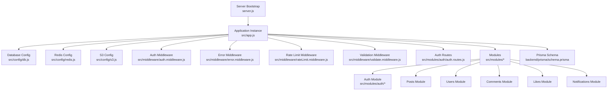
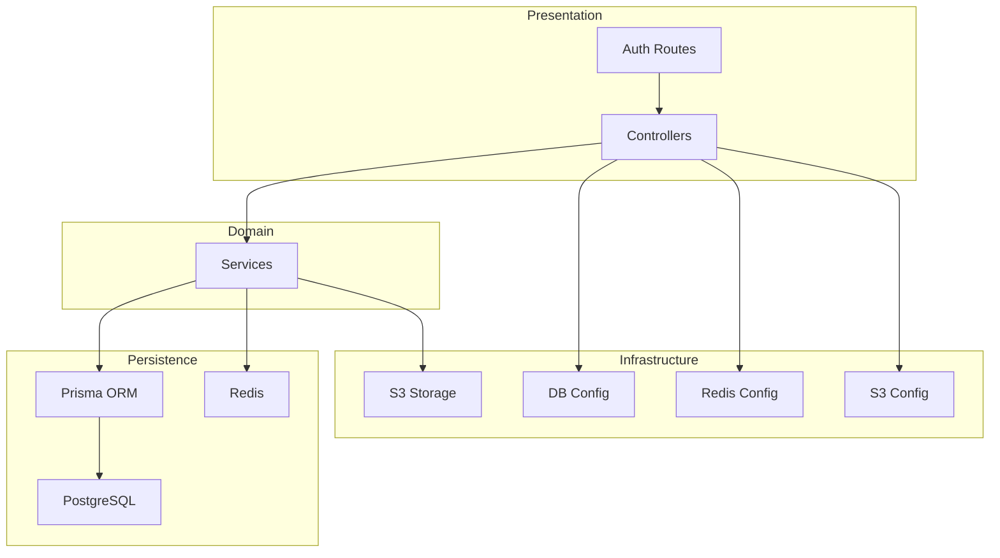
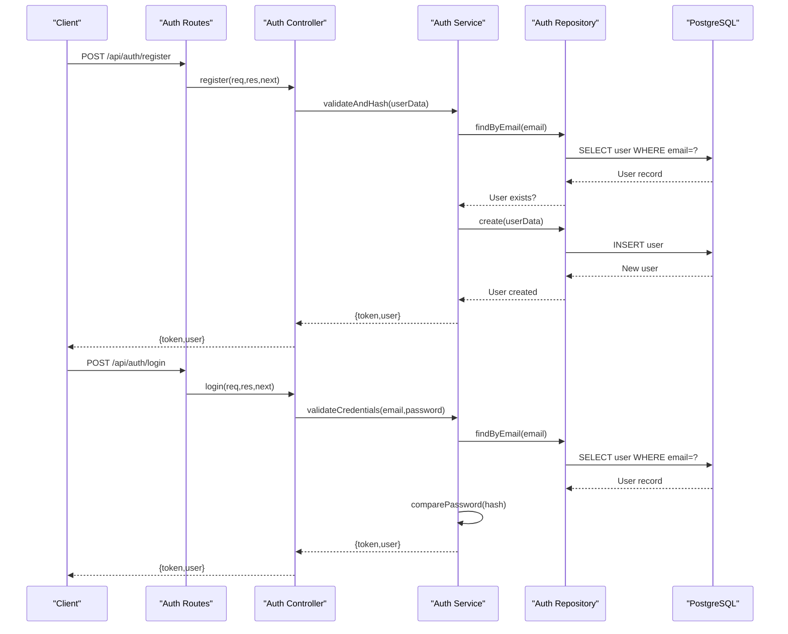
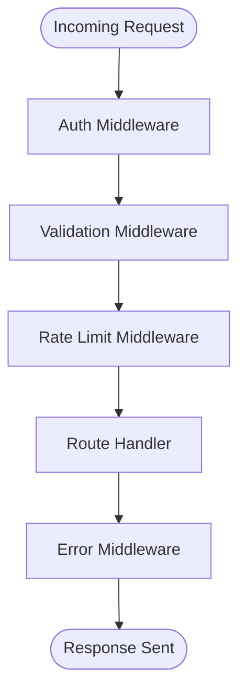
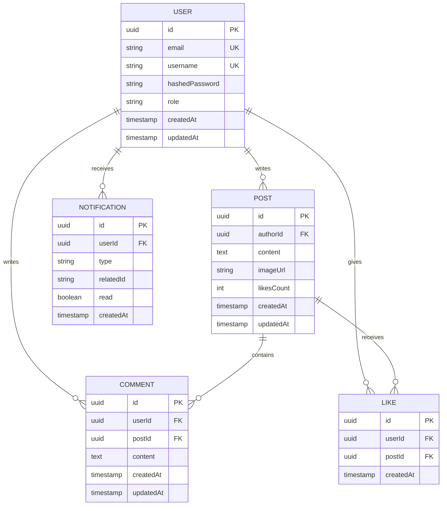
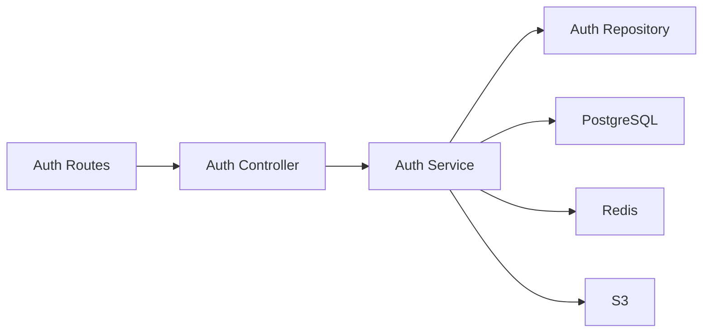

# Backend Development

<cite>
**Referenced Files in This Document**
- [server.js](file://backend/server.js)
- [app.js](file://backend/src/app.js)
- [db.js](file://backend/src/config/db.js)
- [redis.js](file://backend/src/config/redis.js)
- [s3.js](file://backend/src/config/s3.js)
- [auth.middleware.js](file://backend/src/middleware/auth.middleware.js)
- [error.middleware.js](file://backend/src/middleware/error.middleware.js)
- [rateLimit.middleware.js](file://backend/src/middleware/rateLimit.middleware.js)
- [validate.middleware.js](file://backend/src/middleware/validate.middleware.js)
- [auth.routes.js](file://backend/src/modules/auth/auth.routes.js)
- [auth.controller.js](file://backend/src/modules/auth/auth.controller.js)
- [auth.service.js](file://backend/src/modules/auth/auth.service.js)
- [auth.repository.js](file://backend/src/modules/auth/auth.repository.js)
- [auth.validation.js](file://backend/src/modules/auth/auth.validation.js)
- [post.dto.js](file://backend/src/dto/post.dto.js)
- [user.dto.js](file://backend/src/dto/user.dto.js)
- [errors.js](file://backend/src/constants/errors.js)
- [roles.js](file://backend/src/constants/roles.js)
- [schema.prisma](file://backend/prisma/schema.prisma)
</cite>

## Table of Contents
1. [Introduction](#introduction)
2. [Project Structure](#project-structure)
3. [Core Components](#core-components)
4. [Architecture Overview](#architecture-overview)
5. [Detailed Component Analysis](#detailed-component-analysis)
6. [Dependency Analysis](#dependency-analysis)
7. [Performance Considerations](#performance-considerations)
8. [Troubleshooting Guide](#troubleshooting-guide)
9. [Conclusion](#conclusion)
10. [Appendices](#appendices)

## Introduction
This document provides comprehensive backend development documentation for a Node.js social media API. It covers the modular architecture, authentication, posts, users, comments, likes, and notifications modules. It also documents the Prisma ORM setup, database schema design, RESTful API endpoints, request/response patterns, authentication mechanisms, middleware implementation, error handling strategies, validation approaches, database operations, query optimization, data migration procedures, security considerations, rate limiting, performance monitoring, and guidance for extending the API with new features while maintaining code quality.

## Project Structure
The backend is organized into a modular structure with dedicated folders for configuration, DTOs, middleware, modules, routes, and utilities. The server initialization and application bootstrap are centralized, with each module encapsulating its controller, service, repository, validation, and routes.

**Diagram sources**
- [server.js:1-1](file://backend/server.js#L1-L1)
- [app.js:1-1](file://backend/src/app.js#L1-L1)
- [db.js:1-1](file://backend/src/config/db.js#L1-L1)
- [redis.js:1-1](file://backend/src/config/redis.js#L1-L1)
- [s3.js:1-1](file://backend/src/config/s3.js#L1-L1)
- [auth.middleware.js:1-1](file://backend/src/middleware/auth.middleware.js#L1-L1)
- [error.middleware.js:1-1](file://backend/src/middleware/error.middleware.js#L1-L1)
- [rateLimit.middleware.js:1-1](file://backend/src/middleware/rateLimit.middleware.js#L1-L1)
- [validate.middleware.js:1-1](file://backend/src/middleware/validate.middleware.js#L1-L1)
- [auth.routes.js:1-1](file://backend/src/modules/auth/auth.routes.js#L1-L1)

**Section sources**
- [server.js:1-1](file://backend/server.js#L1-L1)
- [app.js:1-1](file://backend/src/app.js#L1-L1)

## Core Components
- Server Bootstrap: Initializes the Express application and loads configuration.
- Application Instance: Centralizes middleware registration, route wiring, and environment configuration.
- Configuration Layer: Manages database, Redis, and S3 connections.
- Middleware Stack: Provides authentication, validation, rate limiting, and global error handling.
- Modules: Feature-based modules for auth, posts, users, comments, likes, notifications, and others.
- DTOs: Data Transfer Objects for request/response shaping.
- Constants: Shared error messages and roles.
- Prisma Schema: Defines the data model and relations.

Key implementation patterns:
- Modular controllers/services/repositories per feature.
- Validation via shared middleware and module-specific validators.
- Centralized error handling and standardized response envelopes.
- Environment-driven configuration for database, cache, and storage.

**Section sources**
- [server.js:1-1](file://backend/server.js#L1-L1)
- [app.js:1-1](file://backend/src/app.js#L1-L1)
- [db.js:1-1](file://backend/src/config/db.js#L1-L1)
- [redis.js:1-1](file://backend/src/config/redis.js#L1-L1)
- [s3.js:1-1](file://backend/src/config/s3.js#L1-L1)
- [auth.middleware.js:1-1](file://backend/src/middleware/auth.middleware.js#L1-L1)
- [error.middleware.js:1-1](file://backend/src/middleware/error.middleware.js#L1-L1)
- [rateLimit.middleware.js:1-1](file://backend/src/middleware/rateLimit.middleware.js#L1-L1)
- [validate.middleware.js:1-1](file://backend/src/middleware/validate.middleware.js#L1-L1)
- [auth.routes.js:1-1](file://backend/src/modules/auth/auth.routes.js#L1-L1)
- [auth.controller.js:1-1](file://backend/src/modules/auth/auth.controller.js#L1-L1)
- [auth.service.js:1-1](file://backend/src/modules/auth/auth.service.js#L1-L1)
- [auth.repository.js:1-1](file://backend/src/modules/auth/auth.repository.js#L1-L1)
- [auth.validation.js:1-1](file://backend/src/modules/auth/auth.validation.js#L1-L1)
- [post.dto.js:1-1](file://backend/src/dto/post.dto.js#L1-L1)
- [user.dto.js:1-1](file://backend/src/dto/user.dto.js#L1-L1)
- [errors.js:1-1](file://backend/src/constants/errors.js#L1-L1)
- [roles.js:1-1](file://backend/src/constants/roles.js#L1-L1)
- [schema.prisma:1-1](file://backend/prisma/schema.prisma#L1-L1)

## Architecture Overview
The backend follows a layered architecture:
- Presentation Layer: Express routes and controllers.
- Domain Layer: Services implementing business logic.
- Persistence Layer: Prisma ORM with PostgreSQL and Redis caching.
- Infrastructure Layer: S3 for media storage, environment configuration, and middleware stack.

**Diagram sources**
- [server.js:1-1](file://backend/server.js#L1-L1)
- [app.js:1-1](file://backend/src/app.js#L1-L1)
- [db.js:1-1](file://backend/src/config/db.js#L1-L1)
- [redis.js:1-1](file://backend/src/config/redis.js#L1-L1)
- [s3.js:1-1](file://backend/src/config/s3.js#L1-L1)
- [auth.controller.js:1-1](file://backend/src/modules/auth/auth.controller.js#L1-L1)
- [auth.service.js:1-1](file://backend/src/modules/auth/auth.service.js#L1-L1)
- [auth.repository.js:1-1](file://backend/src/modules/auth/auth.repository.js#L1-L1)
- [schema.prisma:1-1](file://backend/prisma/schema.prisma#L1-L1)

## Detailed Component Analysis

### Authentication Module
The authentication module handles user registration, login, logout, and session management. It integrates with JWT-based authentication, password hashing, and role-based access control.

**Diagram sources**
- [auth.routes.js:1-1](file://backend/src/modules/auth/auth.routes.js#L1-L1)
- [auth.controller.js:1-1](file://backend/src/modules/auth/auth.controller.js#L1-L1)
- [auth.service.js:1-1](file://backend/src/modules/auth/auth.service.js#L1-L1)
- [auth.repository.js:1-1](file://backend/src/modules/auth/auth.repository.js#L1-L1)
- [db.js:1-1](file://backend/src/config/db.js#L1-L1)

Key responsibilities:
- Route definition for auth endpoints.
- Controller orchestrating requests and delegating to services.
- Service implementing business logic (validation, hashing, token generation).
- Repository abstracting database operations.
- Validation rules for request payloads.

Security considerations:
- Password hashing before persistence.
- JWT token generation and refresh strategies.
- Role-based access control for admin features.

**Section sources**
- [auth.routes.js:1-1](file://backend/src/modules/auth/auth.routes.js#L1-L1)
- [auth.controller.js:1-1](file://backend/src/modules/auth/auth.controller.js#L1-L1)
- [auth.service.js:1-1](file://backend/src/modules/auth/auth.service.js#L1-L1)
- [auth.repository.js:1-1](file://backend/src/modules/auth/auth.repository.js#L1-L1)
- [auth.validation.js:1-1](file://backend/src/modules/auth/auth.validation.js#L1-L1)
- [roles.js:1-1](file://backend/src/constants/roles.js#L1-L1)

### Middleware Stack
Middleware components provide cross-cutting concerns:
- Authentication: Extracts and validates tokens.
- Validation: Validates DTOs using shared rules.
- Rate Limiting: Throttles requests per IP or user.
- Error Handling: Converts errors to standardized responses.

**Diagram sources**
- [auth.middleware.js:1-1](file://backend/src/middleware/auth.middleware.js#L1-L1)
- [validate.middleware.js:1-1](file://backend/src/middleware/validate.middleware.js#L1-L1)
- [rateLimit.middleware.js:1-1](file://backend/src/middleware/rateLimit.middleware.js#L1-L1)
- [error.middleware.js:1-1](file://backend/src/middleware/error.middleware.js#L1-L1)

Implementation highlights:
- Token extraction from Authorization header.
- DTO validation before controller execution.
- Sliding window or fixed-window rate limiting.
- Standardized error envelope with status codes and messages.

**Section sources**
- [auth.middleware.js:1-1](file://backend/src/middleware/auth.middleware.js#L1-L1)
- [validate.middleware.js:1-1](file://backend/src/middleware/validate.middleware.js#L1-L1)
- [rateLimit.middleware.js:1-1](file://backend/src/middleware/rateLimit.middleware.js#L1-L1)
- [error.middleware.js:1-1](file://backend/src/middleware/error.middleware.js#L1-L1)

### DTOs and Validation
DTOs define request/response shapes and are validated centrally:
- Post DTO: Enforces post creation/update constraints.
- User DTO: Enforces user profile update constraints.

Validation approach:
- Shared validation middleware applies module-specific validators.
- Errors mapped to consistent error codes and messages.

**Section sources**
- [post.dto.js:1-1](file://backend/src/dto/post.dto.js#L1-L1)
- [user.dto.js:1-1](file://backend/src/dto/user.dto.js#L1-L1)
- [validate.middleware.js:1-1](file://backend/src/middleware/validate.middleware.js#L1-L1)
- [errors.js:1-1](file://backend/src/constants/errors.js#L1-L1)

### Prisma ORM Setup and Database Schema Design
Prisma is configured as the ORM with PostgreSQL as the primary database and Redis for caching. The schema defines entities and relationships.

**Diagram sources**
- [schema.prisma:1-1](file://backend/prisma/schema.prisma#L1-L1)

Data modeling patterns:
- UUID primary keys for global uniqueness.
- Unique constraints on email and username.
- Timestamps for auditability.
- Foreign keys for referential integrity.
- Denormalization for counters (e.g., likes count) to optimize reads.

**Section sources**
- [schema.prisma:1-1](file://backend/prisma/schema.prisma#L1-L1)
- [db.js:1-1](file://backend/src/config/db.js#L1-L1)

### RESTful API Endpoints and Patterns
Endpoints follow REST conventions with plural nouns and consistent HTTP verbs. Responses use standardized envelopes with metadata and pagination where applicable.

Common patterns:
- Resource-based routing (e.g., /api/posts, /api/users).
- CRUD endpoints with appropriate status codes.
- Pagination via query parameters (page, limit).
- Filtering and sorting via query parameters.

Authentication and authorization:
- Protected routes require a valid JWT bearer token.
- Role-based access control restricts administrative actions.

Rate limiting:
- Per-endpoint limits with sliding window or fixed window strategies.
- Distinguish between authenticated and anonymous requests.

**Section sources**
- [auth.routes.js:1-1](file://backend/src/modules/auth/auth.routes.js#L1-L1)
- [auth.controller.js:1-1](file://backend/src/modules/auth/auth.controller.js#L1-L1)
- [rateLimit.middleware.js:1-1](file://backend/src/middleware/rateLimit.middleware.js#L1-L1)

### Database Operations and Query Optimization
Operations:
- Read: Fetch user profiles, posts with author info, comments with user info.
- Write: Create posts, comments, likes; update user profiles.
- Upsert: Toggle likes with conflict resolution.
- Delete: Soft delete for auditability or hard delete with cascade.

Optimization strategies:
- Indexes on foreign keys and frequently queried columns.
- Aggregated counters to avoid expensive COUNT queries.
- Cursor-based pagination for large datasets.
- Caching hot data in Redis with TTL.

Migrations:
- Use Prisma migrations to evolve the schema safely.
- Backfill counters after adding denormalized fields.
- Test migrations in staging before production deployment.

**Section sources**
- [auth.repository.js:1-1](file://backend/src/modules/auth/auth.repository.js#L1-L1)
- [auth.service.js:1-1](file://backend/src/modules/auth/auth.service.js#L1-L1)
- [redis.js:1-1](file://backend/src/config/redis.js#L1-L1)
- [schema.prisma:1-1](file://backend/prisma/schema.prisma#L1-L1)

### Security Considerations
- Authentication: JWT bearer tokens with secure, HttpOnly cookies for web clients.
- Authorization: Role-based checks for sensitive endpoints.
- Input validation: Strict DTO validation and sanitization.
- CORS and CSRF protection: Configure origin policies and anti-CSRF tokens for web.
- Secrets management: Store credentials in environment variables or secret managers.
- Audit logging: Track critical operations (login, delete, role changes).

**Section sources**
- [auth.middleware.js:1-1](file://backend/src/middleware/auth.middleware.js#L1-L1)
- [validate.middleware.js:1-1](file://backend/src/middleware/validate.middleware.js#L1-L1)
- [roles.js:1-1](file://backend/src/constants/roles.js#L1-L1)

### Error Handling Strategies
Centralized error handling converts thrown errors into structured responses with:
- Status codes aligned with HTTP semantics.
- Error codes for client-side handling.
- Optional debug info in development mode.

Validation errors:
- Map Joi-style validation errors to field-specific messages.

Unhandled exceptions:
- Catch-all handler prevents server crashes and logs stack traces.

**Section sources**
- [error.middleware.js:1-1](file://backend/src/middleware/error.middleware.js#L1-L1)
- [errors.js:1-1](file://backend/src/constants/errors.js#L1-L1)

## Dependency Analysis
The application exhibits low coupling and high cohesion:
- Routes depend on controllers.
- Controllers depend on services.
- Services depend on repositories and external systems (database, Redis, S3).
- Middleware is globally registered and reusable.

**Diagram sources**
- [auth.routes.js:1-1](file://backend/src/modules/auth/auth.routes.js#L1-L1)
- [auth.controller.js:1-1](file://backend/src/modules/auth/auth.controller.js#L1-L1)
- [auth.service.js:1-1](file://backend/src/modules/auth/auth.service.js#L1-L1)
- [auth.repository.js:1-1](file://backend/src/modules/auth/auth.repository.js#L1-L1)
- [db.js:1-1](file://backend/src/config/db.js#L1-L1)
- [redis.js:1-1](file://backend/src/config/redis.js#L1-L1)
- [s3.js:1-1](file://backend/src/config/s3.js#L1-L1)

**Section sources**
- [auth.routes.js:1-1](file://backend/src/modules/auth/auth.routes.js#L1-L1)
- [auth.controller.js:1-1](file://backend/src/modules/auth/auth.controller.js#L1-L1)
- [auth.service.js:1-1](file://backend/src/modules/auth/auth.service.js#L1-L1)
- [auth.repository.js:1-1](file://backend/src/modules/auth/auth.repository.js#L1-L1)

## Performance Considerations
- Database:
  - Use indexes on foreign keys and frequently filtered/sorted columns.
  - Prefer batch operations for bulk updates.
  - Use connection pooling and limit concurrent queries.
- Caching:
  - Cache user feeds and popular posts in Redis with short TTLs.
  - Invalidate cache on write operations.
- Media:
  - Store images on S3 with optimized URLs and CDN.
  - Use signed URLs for temporary access.
- Monitoring:
  - Instrument slow queries and endpoint latency.
  - Track error rates and cache hit ratios.

[No sources needed since this section provides general guidance]

## Troubleshooting Guide
Common issues and resolutions:
- Authentication failures:
  - Verify token presence and expiration.
  - Check role permissions for protected routes.
- Validation errors:
  - Review DTO constraints and error codes.
  - Confirm request payload matches expected shape.
- Database connectivity:
  - Validate connection string and network access.
  - Check for deadlocks during concurrent writes.
- Redis cache misses:
  - Confirm cache keys and TTLs.
  - Rebuild cache on demand for cold starts.
- S3 upload failures:
  - Verify IAM permissions and bucket policies.
  - Check region alignment and signed URL expiry.

**Section sources**
- [auth.middleware.js:1-1](file://backend/src/middleware/auth.middleware.js#L1-L1)
- [validate.middleware.js:1-1](file://backend/src/middleware/validate.middleware.js#L1-L1)
- [error.middleware.js:1-1](file://backend/src/middleware/error.middleware.js#L1-L1)
- [errors.js:1-1](file://backend/src/constants/errors.js#L1-L1)

## Conclusion
The backend employs a clean, modular architecture with strong separation of concerns. Prisma ORM provides robust data modeling and migrations, while Redis and S3 enhance scalability and media handling. The middleware stack ensures consistent authentication, validation, rate limiting, and error handling. By following the outlined patterns and best practices, the API can be extended reliably and maintained with high code quality.

[No sources needed since this section summarizes without analyzing specific files]

## Appendices
- Extending with new features:
  - Add a new module folder under src/modules/<feature>.
  - Define routes, controller, service, repository, and validation files.
  - Integrate routes in the central application bootstrap.
  - Add DTOs and constants as needed.
- Migration procedures:
  - Modify Prisma schema and run migrations.
  - Backfill data for new denormalized fields.
  - Test in staging and monitor performance.

[No sources needed since this section provides general guidance]