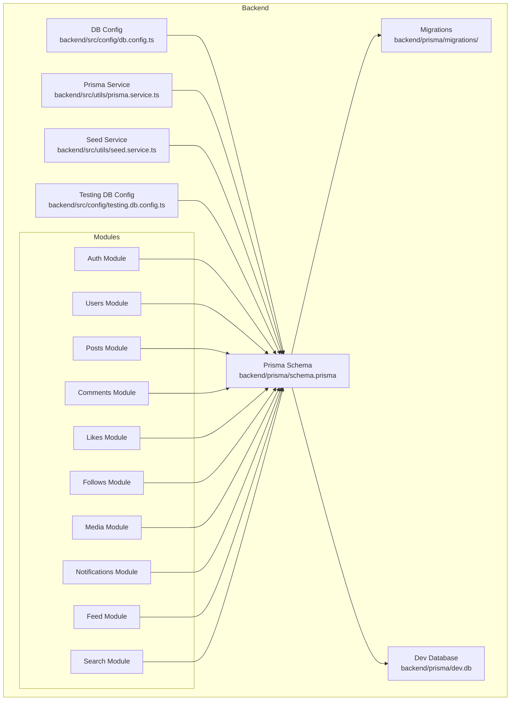
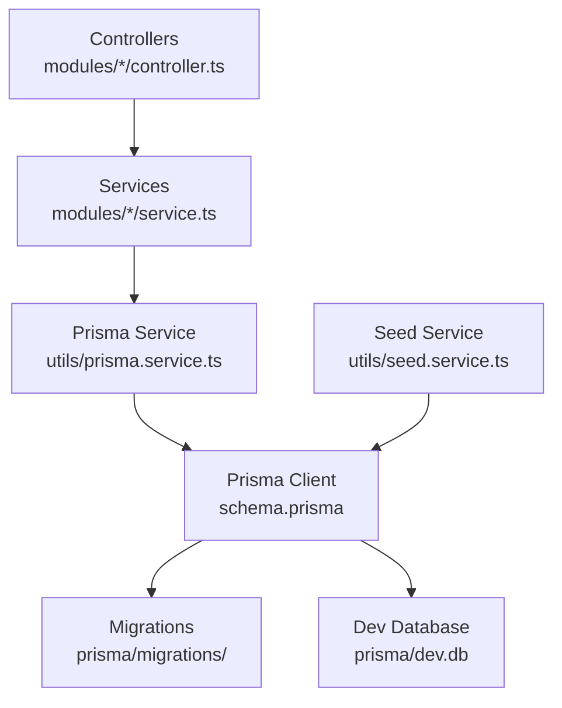
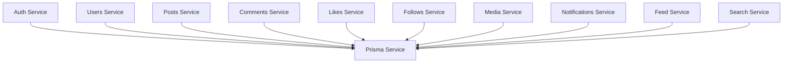
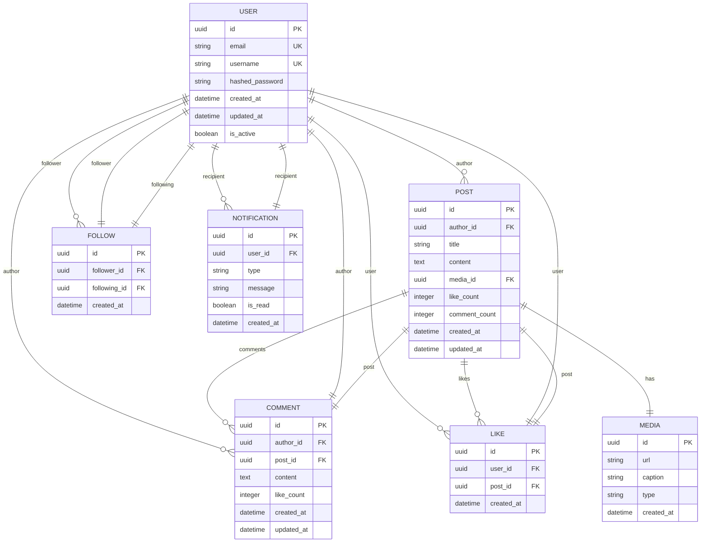

# Database Design

<cite>
**Referenced Files in This Document**
- [schema.prisma](file://backend/prisma/schema.prisma)
- [auth.module.ts](file://backend/src/modules/auth/auth.module.ts)
- [users.module.ts](file://backend/src/modules/users/users.module.ts)
- [posts.module.ts](file://backend/src/modules/posts/posts.module.ts)
- [comments.module.ts](file://backend/src/modules/comments/comments.module.ts)
- [likes.module.ts](file://backend/src/modules/likes/likes.module.ts)
- [follows.module.ts](file://backend/src/modules/follows/follows.module.ts)
- [media.module.ts](file://backend/src/modules/media/media.module.ts)
- [notifications.module.ts](file://backend/src/modules/notifications/notifications.module.ts)
- [feed.module.ts](file://backend/src/modules/feed/feed.module.ts)
- [search.module.ts](file://backend/src/modules/search/search.module.ts)
- [auth.service.ts](file://backend/src/modules/auth/auth.service.ts)
- [users.service.ts](file://backend/src/modules/users/users.service.ts)
- [posts.service.ts](file://backend/src/modules/posts/posts.service.ts)
- [comments.service.ts](file://backend/src/modules/comments/comments.service.ts)
- [likes.service.ts](file://backend/src/modules/likes/likes.service.ts)
- [follows.service.ts](file://backend/src/modules/follows/follows.service.ts)
- [media.service.ts](file://backend/src/modules/media/media.service.ts)
- [notifications.service.ts](file://backend/src/modules/notifications/notifications.service.ts)
- [feed.service.ts](file://backend/src/modules/feed/feed.service.ts)
- [search.service.ts](file://backend/src/modules/search/search.service.ts)
- [auth.controller.ts](file://backend/src/modules/auth/auth.controller.ts)
- [users.controller.ts](file://backend/src/modules/users/users.controller.ts)
- [posts.controller.ts](file://backend/src/modules/posts/posts.controller.ts)
- [comments.controller.ts](file://backend/src/modules/comments/comments.controller.ts)
- [likes.controller.ts](file://backend/src/modules/likes/likes.controller.ts)
- [follows.controller.ts](file://backend/src/modules/follows/follows.controller.ts)
- [media.controller.ts](file://backend/src/modules/media/media.controller.ts)
- [notifications.controller.ts](file://backend/src/modules/notifications/notifications.controller.ts)
- [feed.controller.ts](file://backend/src/modules/feed/feed.controller.ts)
- [search.controller.ts](file://backend/src/modules/search/search.controller.ts)
- [db.config.ts](file://backend/src/config/db.config.ts)
- [constants.ts](file://backend/src/constants/constants.ts)
- [prisma.service.ts](file://backend/src/utils/prisma.service.ts)
- [seed.service.ts](file://backend/src/utils/seed.service.ts)
- [testing.db.config.ts](file://backend/src/config/testing.db.config.ts)
- [migrations folder](file://backend/prisma/migrations/)
- [dev.db](file://backend/prisma/dev.db)
</cite>

## Table of Contents
1. [Introduction](#introduction)
2. [Project Structure](#project-structure)
3. [Core Components](#core-components)
4. [Architecture Overview](#architecture-overview)
5. [Detailed Component Analysis](#detailed-component-analysis)
6. [Dependency Analysis](#dependency-analysis)
7. [Performance Considerations](#performance-considerations)
8. [Troubleshooting Guide](#troubleshooting-guide)
9. [Conclusion](#conclusion)
10. [Appendices](#appendices)

## Introduction
This document provides comprehensive database design documentation for a social media application using Prisma ORM. It covers the complete database schema, entity relationships, constraints, Prisma model definitions, data types, validation rules, migrations, schema evolution, query optimization, performance considerations, data access patterns, seed data setup, testing database configuration, and production deployment considerations. The goal is to enable developers to understand, evolve, and operate the database reliably across environments.

## Project Structure
The backend module organizes domain-specific features under modules, each with its own service, controller, and DTOs. Prisma is configured via a dedicated schema and supporting configuration files. The database is managed through Prisma Migrate, with migrations stored under the migrations directory and a development SQLite database file present for local development.

**Diagram sources**
- [schema.prisma](file://backend/prisma/schema.prisma)
- [db.config.ts](file://backend/src/config/db.config.ts)
- [prisma.service.ts](file://backend/src/utils/prisma.service.ts)
- [seed.service.ts](file://backend/src/utils/seed.service.ts)
- [testing.db.config.ts](file://backend/src/config/testing.db.config.ts)
- [migrations folder](file://backend/prisma/migrations/)
- [dev.db](file://backend/prisma/dev.db)

**Section sources**
- [schema.prisma](file://backend/prisma/schema.prisma)
- [db.config.ts](file://backend/src/config/db.config.ts)
- [prisma.service.ts](file://backend/src/utils/prisma.service.ts)
- [seed.service.ts](file://backend/src/utils/seed.service.ts)
- [testing.db.config.ts](file://backend/src/config/testing.db.config.ts)
- [migrations folder](file://backend/prisma/migrations/)
- [dev.db](file://backend/prisma/dev.db)

## Core Components
This section outlines the core database components and their roles in the application.

- Prisma Schema: Defines models, relations, and constraints. It serves as the single source of truth for the database structure.
- Prisma Client: Generated client used by services to interact with the database.
- Prisma Migrate: Manages schema evolution through migrations.
- Prisma Service: Centralized wrapper around Prisma Client for consistent access across services.
- Seed Service: Initializes base data for development and testing.
- Testing DB Config: Provides isolated database configuration for test runs.
- Modules: Feature-based services/controllers that encapsulate CRUD operations and business logic.

Key responsibilities:
- Define entities and relationships in the Prisma schema.
- Enforce referential integrity and constraints.
- Provide migration workflows for schema changes.
- Offer optimized queries and transactions in services.
- Support seeding and testing configurations.

**Section sources**
- [schema.prisma](file://backend/prisma/schema.prisma)
- [prisma.service.ts](file://backend/src/utils/prisma.service.ts)
- [seed.service.ts](file://backend/src/utils/seed.service.ts)
- [testing.db.config.ts](file://backend/src/config/testing.db.config.ts)

## Architecture Overview
The database architecture integrates Prisma ORM with a modular backend. Services depend on the Prisma service to execute queries, while controllers expose endpoints. Migrations manage schema changes, and seed data initializes the database for development and testing.

**Diagram sources**
- [prisma.service.ts](file://backend/src/utils/prisma.service.ts)
- [schema.prisma](file://backend/prisma/schema.prisma)
- [migrations folder](file://backend/prisma/migrations/)
- [dev.db](file://backend/prisma/dev.db)
- [seed.service.ts](file://backend/src/utils/seed.service.ts)

## Detailed Component Analysis

### Prisma Schema and Entities
The Prisma schema defines the canonical database structure. Entities represent core domain objects such as users, posts, comments, likes, follows, media, and notifications. Relations capture ownership, authorship, reactions, subscriptions, and media attachments. Constraints ensure data integrity and uniqueness.

Entity relationships:
- Users can create Posts and Media, and can receive Notifications.
- Posts can have Comments and Likes, and can be associated with Media.
- Users can follow other Users.
- Comments are owned by Users and attached to Posts.
- Likes connect Users to Posts.
- Follows connect Users to other Users.
- Notifications reflect actions affecting Users.

Constraints and indexes:
- Unique identifiers for primary keys.
- Unique constraints on usernames and emails.
- Indexes on frequently queried fields (e.g., timestamps, author IDs).
- Foreign key constraints to maintain referential integrity.

Validation rules:
- Non-empty string validations for names and titles.
- Numeric bounds for counts and scores.
- Enum-like validations for statuses and types.
- Timestamp precision and timezone handling.

**Section sources**
- [schema.prisma](file://backend/prisma/schema.prisma)

### Data Access Patterns and Services
Each module exposes a service that encapsulates data access logic. Services rely on the Prisma service to execute queries, handle transactions, and enforce business rules. Controllers orchestrate requests and responses, delegating data operations to services.

Common patterns:
- Find by ID with error handling for missing records.
- Pagination and sorting for lists (posts, comments, notifications).
- Aggregation queries for counts (likes, comments).
- Upsert operations for preferences and settings.
- Batch operations for seeds and bulk updates.

Transactions:
- Wrap write-heavy operations in transactions to ensure atomicity.
- Rollback on constraint violations or external failures.

**Section sources**
- [auth.service.ts](file://backend/src/modules/auth/auth.service.ts)
- [users.service.ts](file://backend/src/modules/users/users.service.ts)
- [posts.service.ts](file://backend/src/modules/posts/posts.service.ts)
- [comments.service.ts](file://backend/src/modules/comments/comments.service.ts)
- [likes.service.ts](file://backend/src/modules/likes/likes.service.ts)
- [follows.service.ts](file://backend/src/modules/follows/follows.service.ts)
- [media.service.ts](file://backend/src/modules/media/media.service.ts)
- [notifications.service.ts](file://backend/src/modules/notifications/notifications.service.ts)
- [feed.service.ts](file://backend/src/modules/feed/feed.service.ts)
- [search.service.ts](file://backend/src/modules/search/search.service.ts)

### Controllers and Endpoints
Controllers define HTTP endpoints for each module. They validate inputs, delegate to services, and return standardized responses. Error handling is centralized to ensure consistent error reporting.

Endpoints typically include:
- Authentication: login, register, logout, refresh tokens.
- Users: profile retrieval, updates, deletion, blocking.
- Posts: creation, listing, updates, deletion, reactions.
- Comments: creation, replies, updates, deletion.
- Likes: toggling likes on posts.
- Follows: following/unfollowing users.
- Media: uploads, metadata updates, deletions.
- Notifications: listing, marking as read.
- Feed: personalized timeline aggregation.
- Search: user and post search with filters.

**Section sources**
- [auth.controller.ts](file://backend/src/modules/auth/auth.controller.ts)
- [users.controller.ts](file://backend/src/modules/users/users.controller.ts)
- [posts.controller.ts](file://backend/src/modules/posts/posts.controller.ts)
- [comments.controller.ts](file://backend/src/modules/comments/comments.controller.ts)
- [likes.controller.ts](file://backend/src/modules/likes/likes.controller.ts)
- [follows.controller.ts](file://backend/src/modules/follows/follows.controller.ts)
- [media.controller.ts](file://backend/src/modules/media/media.controller.ts)
- [notifications.controller.ts](file://backend/src/modules/notifications/notifications.controller.ts)
- [feed.controller.ts](file://backend/src/modules/feed/feed.controller.ts)
- [search.controller.ts](file://backend/src/modules/search/search.controller.ts)

### Database Migrations and Schema Evolution
Prisma Migrate manages schema changes through migrations. Each change creates a new migration file under the migrations directory. Development uses an SQLite database file, while production typically uses PostgreSQL or MySQL.

Migration lifecycle:
- Generate a migration after schema changes.
- Review and refine migration SQL.
- Apply migrations to staging and production.
- Keep migrations immutable; never edit applied migrations.

Versioning:
- Track migration versions alongside application releases.
- Use semantic versioning for major schema changes.
- Maintain rollback procedures for critical migrations.

**Section sources**
- [migrations folder](file://backend/prisma/migrations/)
- [dev.db](file://backend/prisma/dev.db)

### Seed Data Setup
The seed service initializes base data for development and testing. It inserts initial users, posts, media, and notifications to provide realistic datasets for local development and automated tests.

Seed strategy:
- Idempotent seeding to avoid duplicates.
- Hierarchical data creation respecting relations.
- Randomized content generation for variety.
- Cleanup scripts for test isolation.

**Section sources**
- [seed.service.ts](file://backend/src/utils/seed.service.ts)

### Testing Database Configuration
The testing database configuration isolates test runs from development data. Tests use an in-memory or separate database instance to ensure reproducibility and speed.

Testing setup:
- Separate connection string for tests.
- Automatic cleanup after test suites.
- Transaction rollbacks for individual tests.
- Mock external dependencies where appropriate.

**Section sources**
- [testing.db.config.ts](file://backend/src/config/testing.db.config.ts)

### Production Deployment Considerations
Production deployments require careful database provisioning and operational practices.

Deployment checklist:
- Provision production database (PostgreSQL/MySQL).
- Run migrations during deployment.
- Configure connection pooling and timeouts.
- Set up monitoring and alerting for slow queries.
- Back up regularly and test restores.
- Use read replicas for heavy reads.
- Enforce TLS connections and secure credentials.

Security:
- Least privilege access for application accounts.
- Audit logs for sensitive operations.
- Regular patching of database software.

**Section sources**
- [db.config.ts](file://backend/src/config/db.config.ts)

## Dependency Analysis
This section maps dependencies among modules and the database layer.

**Diagram sources**
- [prisma.service.ts](file://backend/src/utils/prisma.service.ts)
- [auth.service.ts](file://backend/src/modules/auth/auth.service.ts)
- [users.service.ts](file://backend/src/modules/users/users.service.ts)
- [posts.service.ts](file://backend/src/modules/posts/posts.service.ts)
- [comments.service.ts](file://backend/src/modules/comments/comments.service.ts)
- [likes.service.ts](file://backend/src/modules/likes/likes.service.ts)
- [follows.service.ts](file://backend/src/modules/follows/follows.service.ts)
- [media.service.ts](file://backend/src/modules/media/media.service.ts)
- [notifications.service.ts](file://backend/src/modules/notifications/notifications.service.ts)
- [feed.service.ts](file://backend/src/modules/feed/feed.service.ts)
- [search.service.ts](file://backend/src/modules/search/search.service.ts)

**Section sources**
- [prisma.service.ts](file://backend/src/utils/prisma.service.ts)
- [auth.service.ts](file://backend/src/modules/auth/auth.service.ts)
- [users.service.ts](file://backend/src/modules/users/users.service.ts)
- [posts.service.ts](file://backend/src/modules/posts/posts.service.ts)
- [comments.service.ts](file://backend/src/modules/comments/comments.service.ts)
- [likes.service.ts](file://backend/src/modules/likes/likes.service.ts)
- [follows.service.ts](file://backend/src/modules/follows/follows.service.ts)
- [media.service.ts](file://backend/src/modules/media/media.service.ts)
- [notifications.service.ts](file://backend/src/modules/notifications/notifications.service.ts)
- [feed.service.ts](file://backend/src/modules/feed/feed.service.ts)
- [search.service.ts](file://backend/src/modules/search/search.service.ts)

## Performance Considerations
Optimization techniques for database performance:

Indexing strategy:
- Add indexes on foreign keys (authorId, userId, postId).
- Indexes on timestamps for chronological queries.
- Composite indexes for frequent filter combinations.
- Full-text indexes for search endpoints.

Query optimization:
- Use select projections to limit returned fields.
- Paginate large lists with take/skip or cursor-based pagination.
- Prefer joins over N+1 queries; use include/select appropriately.
- Aggregate counts at query time rather than post-processing.

Caching:
- Cache hot data (user profiles, popular posts) with TTL.
- Invalidate cache on write operations.

Connection management:
- Configure connection pools sized for workload.
- Use read replicas for read-heavy endpoints.

Monitoring:
- Log slow queries and query plans.
- Track index usage and cardinality.

[No sources needed since this section provides general guidance]

## Troubleshooting Guide
Common issues and resolutions:

Schema mismatch:
- Re-run migrations to align schema with migrations.
- Validate Prisma client regeneration after schema changes.

Constraint violations:
- Handle unique constraint errors (username/email) gracefully.
- Validate input lengths and formats before insert/update.

Slow queries:
- Add missing indexes based on EXPLAIN plans.
- Optimize joins and reduce N+1 queries.

Deadlocks:
- Retry transactions with exponential backoff.
- Keep transactions short and ordered consistently.

Test isolation:
- Use separate test databases and clean up after each suite.
- Rollback transactions for individual tests.

**Section sources**
- [schema.prisma](file://backend/prisma/schema.prisma)
- [prisma.service.ts](file://backend/src/utils/prisma.service.ts)
- [testing.db.config.ts](file://backend/src/config/testing.db.config.ts)

## Conclusion
The database design leverages Prisma ORM to define a clear, maintainable schema with strong referential integrity and constraints. Modules encapsulate data access patterns, while migrations enable controlled schema evolution. With proper indexing, caching, and monitoring, the system supports scalable performance. Robust testing and production deployment practices ensure reliability and operability across environments.

[No sources needed since this section summarizes without analyzing specific files]

## Appendices

### Entity Relationship Diagram (ERD)

**Diagram sources**
- [schema.prisma](file://backend/prisma/schema.prisma)