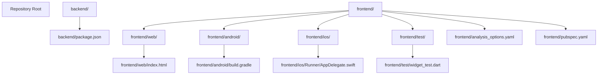
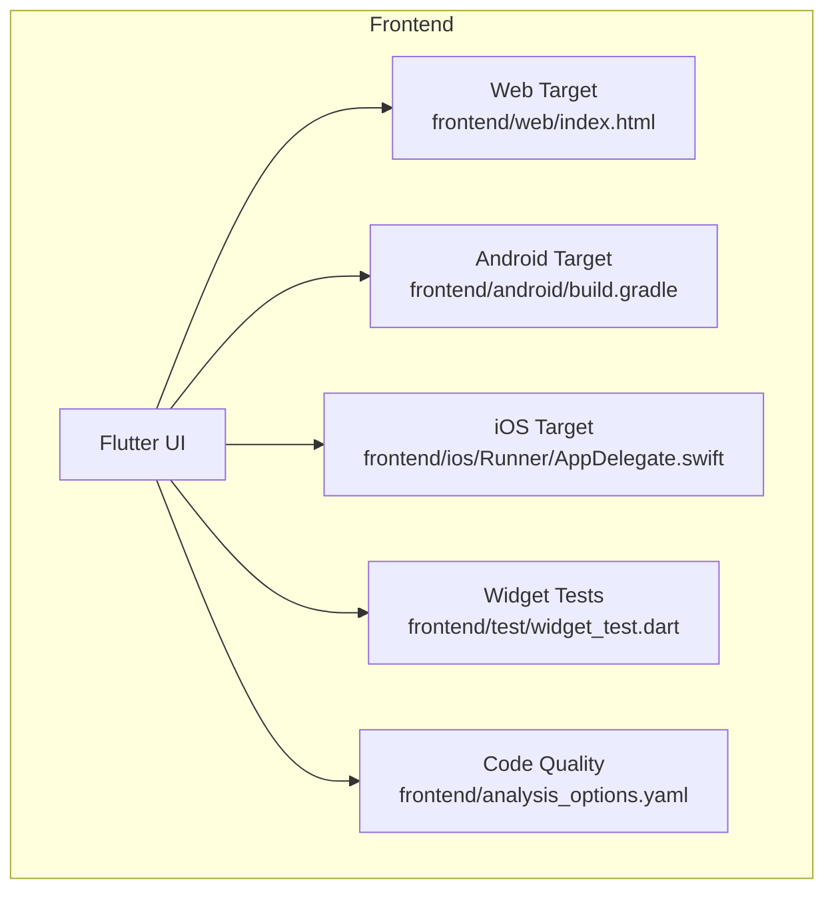
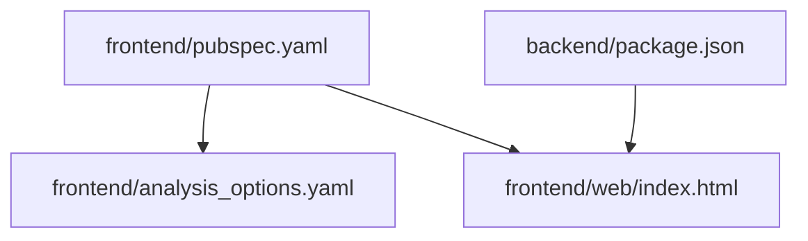

# Development Workflow

<cite>
**Referenced Files in This Document**
- [package.json](file://backend/package.json)
- [index.html](file://frontend/web/index.html)
- [pubspec.yaml](file://frontend/pubspec.yaml)
- [analysis_options.yaml](file://frontend/analysis_options.yaml)
- [widget_test.dart](file://frontend/test/widget_test.dart)
- [AppDelegate.swift](file://frontend/ios/Runner/AppDelegate.swift)
- [build.gradle](file://frontend/android/build.gradle)
</cite>

## Table of Contents
1. [Introduction](#introduction)
2. [Project Structure](#project-structure)
3. [Core Components](#core-components)
4. [Architecture Overview](#architecture-overview)
5. [Detailed Component Analysis](#detailed-component-analysis)
6. [Dependency Analysis](#dependency-analysis)
7. [Performance Considerations](#performance-considerations)
8. [Troubleshooting Guide](#troubleshooting-guide)
9. [Conclusion](#conclusion)
10. [Appendices](#appendices)

## Introduction
This document describes the development workflow for the social media application, focusing on setup, testing, and deployment processes. It covers environment configuration, development server setup, debugging techniques, testing strategies (unit, integration, and API testing), code quality tools, linting and formatting standards, database seeding and migrations, environment-specific configurations, deployment workflows, CI/CD considerations, production monitoring, development best practices, code review processes, and team collaboration guidelines. The repository includes a Flutter frontend and a backend directory structure, though the backend source code is not accessible in this workspace snapshot. The frontend configuration and testing setup are documented here to guide development and testing activities.

## Project Structure
The repository is organized into two primary areas:
- Backend: Contains backend-related assets and configuration, including Prisma schema and source modules. The backend source directory is not accessible in this workspace snapshot.
- Frontend: A Flutter application with platform-specific configurations for Android, iOS, macOS, Windows, Linux, and Web targets, along with tests and analysis options.

**Diagram sources**
- [package.json](file://backend/package.json)
- [index.html](file://frontend/web/index.html)
- [pubspec.yaml](file://frontend/pubspec.yaml)
- [analysis_options.yaml](file://frontend/analysis_options.yaml)
- [widget_test.dart](file://frontend/test/widget_test.dart)
- [AppDelegate.swift](file://frontend/ios/Runner/AppDelegate.swift)
- [build.gradle](file://frontend/android/build.gradle)

**Section sources**
- [package.json](file://backend/package.json)
- [index.html](file://frontend/web/index.html)
- [pubspec.yaml](file://frontend/pubspec.yaml)
- [analysis_options.yaml](file://frontend/analysis_options.yaml)
- [widget_test.dart](file://frontend/test/widget_test.dart)
- [AppDelegate.swift](file://frontend/ios/Runner/AppDelegate.swift)
- [build.gradle](file://frontend/android/build.gradle)

## Core Components
- Backend configuration and Prisma schema are present but the source code is not accessible in this workspace snapshot. Backend setup and testing should be coordinated with the backend team.
- Frontend Flutter application with platform-specific builds and a test suite for widget verification.
- Code quality enforced via analysis options and pubspec dependencies.

**Section sources**
- [package.json](file://backend/package.json)
- [pubspec.yaml](file://frontend/pubspec.yaml)
- [analysis_options.yaml](file://frontend/analysis_options.yaml)
- [widget_test.dart](file://frontend/test/widget_test.dart)

## Architecture Overview
The application follows a typical Flutter frontend architecture with platform-specific targets. The backend is separate and not visible in this workspace snapshot. The frontend includes:
- Web target with a base href configuration.
- Android and iOS native integrations.
- A test harness for widget-level verification.
- Code quality enforcement via analysis options.

**Diagram sources**
- [index.html](file://frontend/web/index.html)
- [build.gradle](file://frontend/android/build.gradle)
- [AppDelegate.swift](file://frontend/ios/Runner/AppDelegate.swift)
- [widget_test.dart](file://frontend/test/widget_test.dart)
- [analysis_options.yaml](file://frontend/analysis_options.yaml)

## Detailed Component Analysis

### Environment Configuration
- Flutter project configuration is defined in the pubspec file. Dependencies and SDK constraints are declared there.
- Code quality rules are configured via analysis options to enforce style and static analysis.
- Web target uses a base href placeholder for routing support.

**Section sources**
- [pubspec.yaml](file://frontend/pubspec.yaml)
- [analysis_options.yaml](file://frontend/analysis_options.yaml)
- [index.html](file://frontend/web/index.html)

### Development Server Setup
- The Flutter web target relies on the base href configuration in the HTML entry point. Ensure the base href is set appropriately for hosting environments.
- Platform-specific builds (Android/iOS) require their respective SDKs and toolchains installed per Flutter requirements.

**Section sources**
- [index.html](file://frontend/web/index.html)
- [build.gradle](file://frontend/android/build.gradle)
- [AppDelegate.swift](file://frontend/ios/Runner/AppDelegate.swift)

### Debugging Techniques
- Use Flutter DevTools for profiling and debugging the UI.
- For iOS, Xcode can be used to attach to the simulator/device for native debugging.
- For Android, Android Studio can be used to debug the app.

[No sources needed since this section provides general guidance]

### Testing Strategies
- Unit tests: Use Dart’s testing framework to write unit tests for business logic and utilities.
- Integration tests: Coordinate with backend team for integration tests that validate end-to-end flows.
- API tests: Backend team should define API tests; frontend tests can validate client-side behavior against API responses.

**Section sources**
- [widget_test.dart](file://frontend/test/widget_test.dart)

### Code Quality Tools, Linting, and Formatting Standards
- Static analysis and linting rules are defined in the analysis options file.
- Formatting standards should align with Flutter/Dart conventions and the project’s analysis configuration.

**Section sources**
- [analysis_options.yaml](file://frontend/analysis_options.yaml)

### Database Seeding and Migration Procedures
- Prisma schema and migrations are located under the backend prisma directory. Backend team should manage seeding and migration scripts.
- Frontend does not handle database operations.

**Section sources**
- [package.json](file://backend/package.json)

### Environment-Specific Configurations
- Flutter supports environment-specific configurations via environment variables and build flavors. Configure these according to project needs.
- Backend environment variables should be managed separately by the backend team.

**Section sources**
- [pubspec.yaml](file://frontend/pubspec.yaml)
- [package.json](file://backend/package.json)

### Deployment Workflows
- Web deployment: Build the web target and serve the output from the build artifacts.
- Mobile deployment: Use platform-specific build commands to produce APK/APK for Android and IPA for iOS.
- CI/CD: Integrate automated builds and tests in CI pipelines for both platforms.

**Section sources**
- [index.html](file://frontend/web/index.html)
- [build.gradle](file://frontend/android/build.gradle)
- [AppDelegate.swift](file://frontend/ios/Runner/AppDelegate.swift)

### CI/CD Considerations
- Define jobs for building and testing on multiple platforms.
- Cache dependencies to speed up builds.
- Run static analysis and tests in CI to maintain quality.

[No sources needed since this section provides general guidance]

### Production Monitoring
- Monitor app performance and errors using platform-specific analytics and crash reporting tools.
- Backend team should provide monitoring dashboards and alerting for API health.

[No sources needed since this section provides general guidance]

### Development Best Practices
- Keep commits small and focused with clear messages.
- Use feature branches and pull requests for collaborative development.
- Review code regularly and follow the project’s style guide.

[No sources needed since this section provides general guidance]

### Code Review Processes
- Establish reviewer assignments and checklist items for PRs.
- Ensure tests pass and code meets quality standards before merging.

[No sources needed since this section provides general guidance]

### Team Collaboration Guidelines
- Use shared documentation and issue trackers.
- Align on branching strategies and release cycles.

[No sources needed since this section provides general guidance]

## Dependency Analysis
The frontend depends on Flutter SDK and platform plugins defined in the pubspec. The backend uses Prisma for data modeling and migrations. The frontend’s HTML entry point configures the web base href for routing.

**Diagram sources**
- [pubspec.yaml](file://frontend/pubspec.yaml)
- [analysis_options.yaml](file://frontend/analysis_options.yaml)
- [index.html](file://frontend/web/index.html)
- [package.json](file://backend/package.json)

**Section sources**
- [pubspec.yaml](file://frontend/pubspec.yaml)
- [analysis_options.yaml](file://frontend/analysis_options.yaml)
- [index.html](file://frontend/web/index.html)
- [package.json](file://backend/package.json)

## Performance Considerations
- Optimize UI rendering and avoid unnecessary rebuilds.
- Profile memory and CPU usage during development.
- Minimize network requests and cache data where appropriate.

[No sources needed since this section provides general guidance]

## Troubleshooting Guide
- If web routes are incorrect, verify the base href configuration in the HTML entry point.
- For Android/iOS build issues, ensure SDKs and toolchains are installed and configured correctly.
- Run tests locally to catch regressions early.

**Section sources**
- [index.html](file://frontend/web/index.html)
- [build.gradle](file://frontend/android/build.gradle)
- [AppDelegate.swift](file://frontend/ios/Runner/AppDelegate.swift)
- [widget_test.dart](file://frontend/test/widget_test.dart)

## Conclusion
This document outlines the development workflow for the social media application with a focus on the frontend and backend separation. While the backend source is not accessible in this workspace snapshot, the frontend configuration, testing, and deployment guidance provide a solid foundation for development. Coordinate closely with the backend team for backend-specific tasks such as database migrations, seeding, and API testing.

[No sources needed since this section summarizes without analyzing specific files]

## Appendices
- Flutter web base href configuration reference: [index.html](file://frontend/web/index.html)
- Flutter pubspec dependencies reference: [pubspec.yaml](file://frontend/pubspec.yaml)
- Flutter analysis options reference: [analysis_options.yaml](file://frontend/analysis_options.yaml)
- Flutter widget test reference: [widget_test.dart](file://frontend/test/widget_test.dart)
- Android build configuration reference: [build.gradle](file://frontend/android/build.gradle)
- iOS application delegate reference: [AppDelegate.swift](file://frontend/ios/Runner/AppDelegate.swift)