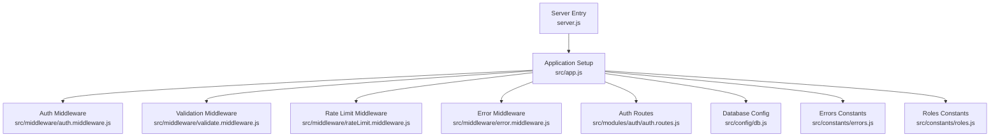
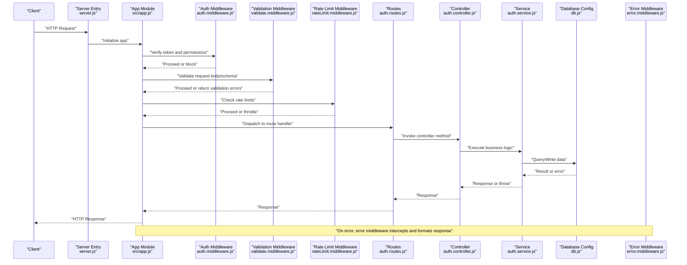
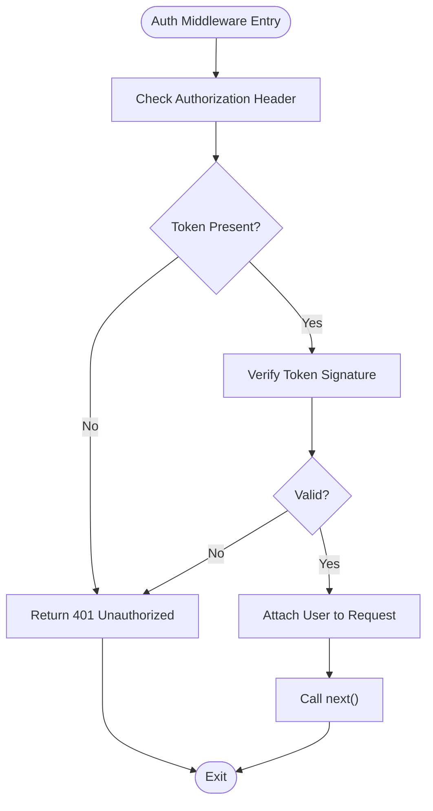
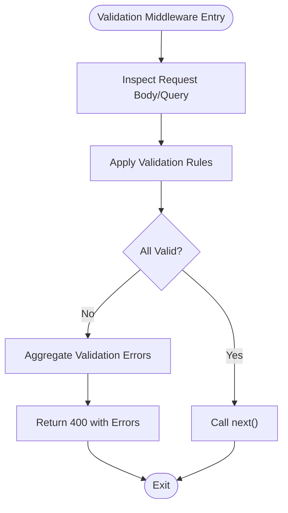
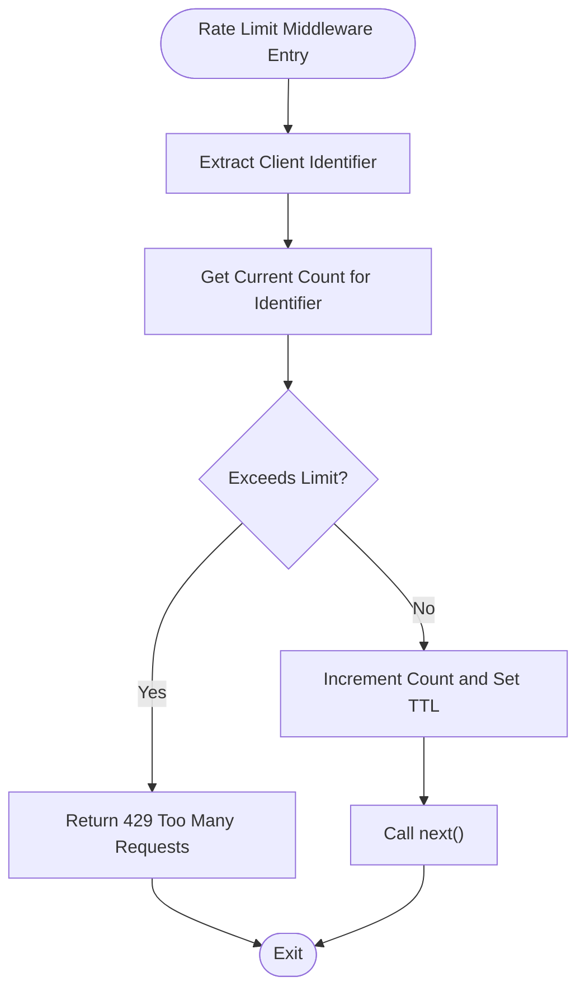
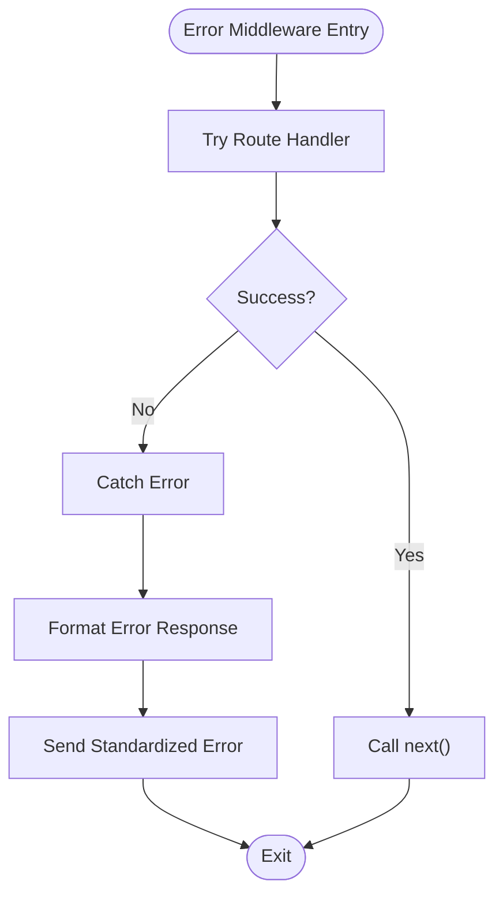
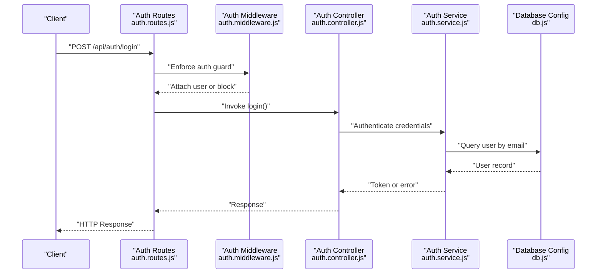
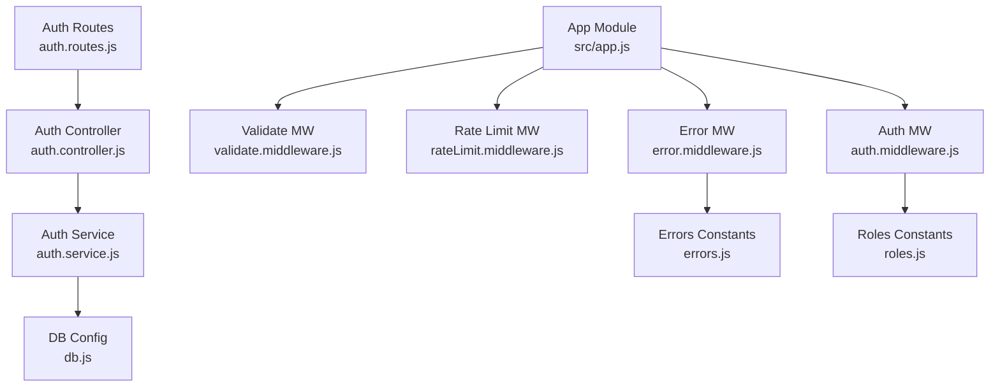

# Middleware & Security

<cite>
**Referenced Files in This Document**
- [server.js](file://backend/server.js)
- [app.js](file://backend/src/app.js)
- [auth.middleware.js](file://backend/src/middleware/auth.middleware.js)
- [error.middleware.js](file://backend/src/middleware/error.middleware.js)
- [rateLimit.middleware.js](file://backend/src/middleware/rateLimit.middleware.js)
- [validate.middleware.js](file://backend/src/middleware/validate.middleware.js)
- [db.js](file://backend/src/config/db.js)
- [errors.js](file://backend/src/constants/errors.js)
- [roles.js](file://backend/src/constants/roles.js)
- [auth.routes.js](file://backend/src/modules/auth/auth.routes.js)
- [auth.controller.js](file://backend/src/modules/auth/auth.controller.js)
- [auth.service.js](file://backend/src/modules/auth/auth.service.js)
- [auth.validation.js](file://backend/src/modules/auth/auth.validation.js)
</cite>

## Table of Contents
1. [Introduction](#introduction)
2. [Project Structure](#project-structure)
3. [Core Components](#core-components)
4. [Architecture Overview](#architecture-overview)
5. [Detailed Component Analysis](#detailed-component-analysis)
6. [Dependency Analysis](#dependency-analysis)
7. [Performance Considerations](#performance-considerations)
8. [Troubleshooting Guide](#troubleshooting-guide)
9. [Conclusion](#conclusion)

## Introduction
This document provides comprehensive documentation for middleware and security implementation in the backend. It covers custom middleware creation, request processing pipeline, and error handling strategies. It documents authentication middleware, input validation middleware, and logging middleware. It also explains CORS configuration, rate limiting, and security headers implementation. The document details error response formatting, exception handling patterns, and debugging utilities. Security middleware for input sanitization, SQL injection prevention, and XSS protection are addressed, along with middleware ordering, performance impact, and testing strategies.

## Project Structure
The backend is organized around modular routes and middleware. The application initializes in the server entry point and composes middleware and routes via the application module. Configuration files centralize database connections and external service integrations. Constants define error codes and roles used across modules.

**Diagram sources**
- [server.js](file://backend/server.js)
- [app.js](file://backend/src/app.js)
- [auth.middleware.js](file://backend/src/middleware/auth.middleware.js)
- [validate.middleware.js](file://backend/src/middleware/validate.middleware.js)
- [rateLimit.middleware.js](file://backend/src/middleware/rateLimit.middleware.js)
- [error.middleware.js](file://backend/src/middleware/error.middleware.js)
- [auth.routes.js](file://backend/src/modules/auth/auth.routes.js)
- [db.js](file://backend/src/config/db.js)
- [errors.js](file://backend/src/constants/errors.js)
- [roles.js](file://backend/src/constants/roles.js)

**Section sources**
- [server.js](file://backend/server.js)
- [app.js](file://backend/src/app.js)

## Core Components
- Application initialization and middleware composition occur in the application module.
- Authentication middleware enforces access control and validates tokens.
- Validation middleware ensures incoming requests conform to DTOs and schemas.
- Rate limit middleware controls request frequency to protect endpoints.
- Error middleware standardizes error responses and handles uncaught exceptions.
- Database configuration centralizes connection management and pooling.
- Constants define standardized error codes and role-based permissions.

**Section sources**
- [app.js](file://backend/src/app.js)
- [auth.middleware.js](file://backend/src/middleware/auth.middleware.js)
- [validate.middleware.js](file://backend/src/middleware/validate.middleware.js)
- [rateLimit.middleware.js](file://backend/src/middleware/rateLimit.middleware.js)
- [error.middleware.js](file://backend/src/middleware/error.middleware.js)
- [db.js](file://backend/src/config/db.js)
- [errors.js](file://backend/src/constants/errors.js)
- [roles.js](file://backend/src/constants/roles.js)

## Architecture Overview
The request lifecycle flows through middleware layers before reaching route handlers. Authentication middleware verifies identity, validation middleware checks payload integrity, rate limiting protects endpoints, and error middleware standardizes failures. Database and constants modules support downstream services.

**Diagram sources**
- [server.js](file://backend/server.js)
- [app.js](file://backend/src/app.js)
- [auth.middleware.js](file://backend/src/middleware/auth.middleware.js)
- [validate.middleware.js](file://backend/src/middleware/validate.middleware.js)
- [rateLimit.middleware.js](file://backend/src/middleware/rateLimit.middleware.js)
- [auth.routes.js](file://backend/src/modules/auth/auth.routes.js)
- [auth.controller.js](file://backend/src/modules/auth/auth.controller.js)
- [auth.service.js](file://backend/src/modules/auth/auth.service.js)
- [db.js](file://backend/src/config/db.js)
- [error.middleware.js](file://backend/src/middleware/error.middleware.js)

## Detailed Component Analysis

### Authentication Middleware
Purpose:
- Enforce access control and validate tokens.
- Attach user context to the request for downstream handlers.

Implementation pattern:
- Middleware receives request and response objects and a next callback.
- Validates token presence and signature.
- Extracts user identity and attaches it to the request object.
- Proceeds to next middleware or controller on success; otherwise returns unauthorized error.

Processing logic:
- Token verification and user lookup.
- Role-based permission checks if applicable.
- Early exit on failure with standardized error response.

Security considerations:
- Reject malformed or expired tokens.
- Prevent bypass via missing headers or invalid formats.
- Avoid exposing sensitive claims in logs.

**Diagram sources**
- [auth.middleware.js](file://backend/src/middleware/auth.middleware.js)

**Section sources**
- [auth.middleware.js](file://backend/src/middleware/auth.middleware.js)

### Input Validation Middleware
Purpose:
- Validate incoming request bodies and query parameters against predefined schemas.
- Return structured validation errors for malformed requests.

Implementation pattern:
- Middleware inspects request shape and applies validation rules.
- Aggregates errors and short-circuits request chain on failure.
- Allows request to continue when all validations pass.

Processing logic:
- Schema validation per endpoint DTO.
- Error collection and response formatting.

**Diagram sources**
- [validate.middleware.js](file://backend/src/middleware/validate.middleware.js)

**Section sources**
- [validate.middleware.js](file://backend/src/middleware/validate.middleware.js)

### Rate Limiting Middleware
Purpose:
- Throttle requests to prevent abuse and protect endpoints.
- Support configurable limits per IP or user.

Implementation pattern:
- Middleware tracks request counts per identifier.
- Compares against configured thresholds and resets counters periodically.
- Blocks requests exceeding limits and returns appropriate response.

Processing logic:
- Identifier extraction (IP or user ID).
- Counter increment and threshold comparison.
- Conditional blocking and header updates for client awareness.

**Diagram sources**
- [rateLimit.middleware.js](file://backend/src/middleware/rateLimit.middleware.js)

**Section sources**
- [rateLimit.middleware.js](file://backend/src/middleware/rateLimit.middleware.js)

### Error Handling Middleware
Purpose:
- Centralize error response formatting.
- Distinguish between client errors and internal server errors.
- Provide structured error payloads and logging hooks.

Implementation pattern:
- Middleware wraps downstream logic and catches thrown errors.
- Formats errors using constants and returns standardized JSON responses.
- Logs stack traces and metadata for debugging.

Processing logic:
- Try/catch around route handlers and services.
- Map known error codes to HTTP status codes.
- Sanitize sensitive information in error payloads.

**Diagram sources**
- [error.middleware.js](file://backend/src/middleware/error.middleware.js)

**Section sources**
- [error.middleware.js](file://backend/src/middleware/error.middleware.js)

### Logging Middleware
Purpose:
- Record request and response metadata for observability.
- Track latency, endpoint usage, and error rates.

Implementation pattern:
- Capture start time at middleware entry.
- Log after response completion or error occurrence.
- Include correlation IDs and sanitized payloads.

Processing logic:
- Start timer on request arrival.
- Emit structured log entries on completion or error.
- Optionally integrate with external logging systems.

[No sources needed since this section doesn't analyze specific files]

### CORS Configuration
Purpose:
- Control cross-origin requests to mitigate CSRF and data leakage risks.
- Allow trusted origins and secure headers.

Implementation pattern:
- Configure allowed origins, methods, headers, and credentials.
- Strip or restrict headers that could enable unsafe operations.

Processing logic:
- Validate Origin header against allowed list.
- Set Access-Control-Allow-* headers conditionally.
- Deny unknown origins and enforce HTTPS-only policies.

[No sources needed since this section doesn't analyze specific files]

### Security Headers Implementation
Purpose:
- Harden HTTP responses against common attacks (XSS, clickjacking, MIME sniffing).
- Enforce secure transport and frame restrictions.

Implementation pattern:
- Add security headers to all responses.
- Configure Content-Security-Policy, X-Frame-Options, X-Content-Type-Options, Referrer-Policy.

Processing logic:
- Set headers globally via middleware or framework configuration.
- Adjust CSP directives per environment and endpoint.

[No sources needed since this section doesn't analyze specific files]

### Input Sanitization, SQL Injection Prevention, and XSS Protection
Purpose:
- Sanitize and escape inputs to prevent injection and malicious scripts.
- Use parameterized queries and allowlists for dynamic content.

Implementation pattern:
- Sanitize user inputs at middleware boundary.
- Enforce parameterized queries in repositories/services.
- Escape HTML and encode payloads for safe rendering.

Processing logic:
- Normalize whitespace and strip dangerous characters.
- Validate against allowlists for special characters.
- Use ORM/query builders that enforce parameterization.

[No sources needed since this section doesn't analyze specific files]

### Authentication Flow (Example: Auth Module)
This sequence illustrates how authentication middleware integrates with the auth module.

**Diagram sources**
- [auth.routes.js](file://backend/src/modules/auth/auth.routes.js)
- [auth.middleware.js](file://backend/src/middleware/auth.middleware.js)
- [auth.controller.js](file://backend/src/modules/auth/auth.controller.js)
- [auth.service.js](file://backend/src/modules/auth/auth.service.js)
- [db.js](file://backend/src/config/db.js)

**Section sources**
- [auth.routes.js](file://backend/src/modules/auth/auth.routes.js)
- [auth.controller.js](file://backend/src/modules/auth/auth.controller.js)
- [auth.service.js](file://backend/src/modules/auth/auth.service.js)

## Dependency Analysis
The middleware stack depends on the application module to register and order middleware. Routes depend on controllers and services, while services depend on database configuration. Error handling is centralized and applied across the pipeline.

**Diagram sources**
- [app.js](file://backend/src/app.js)
- [auth.middleware.js](file://backend/src/middleware/auth.middleware.js)
- [validate.middleware.js](file://backend/src/middleware/validate.middleware.js)
- [rateLimit.middleware.js](file://backend/src/middleware/rateLimit.middleware.js)
- [error.middleware.js](file://backend/src/middleware/error.middleware.js)
- [auth.routes.js](file://backend/src/modules/auth/auth.routes.js)
- [auth.controller.js](file://backend/src/modules/auth/auth.controller.js)
- [auth.service.js](file://backend/src/modules/auth/auth.service.js)
- [db.js](file://backend/src/config/db.js)
- [errors.js](file://backend/src/constants/errors.js)
- [roles.js](file://backend/src/constants/roles.js)

**Section sources**
- [app.js](file://backend/src/app.js)
- [auth.routes.js](file://backend/src/modules/auth/auth.routes.js)
- [auth.controller.js](file://backend/src/modules/auth/auth.controller.js)
- [auth.service.js](file://backend/src/modules/auth/auth.service.js)
- [db.js](file://backend/src/config/db.js)
- [errors.js](file://backend/src/constants/errors.js)
- [roles.js](file://backend/src/constants/roles.js)

## Performance Considerations
- Order middleware to minimize overhead: validation before heavy operations, caching-friendly rate limiting, and early exits on failure.
- Use asynchronous validation and non-blocking rate-limit backends (e.g., Redis).
- Avoid synchronous I/O in middleware; defer to async operations.
- Instrument middleware for latency metrics and error rates.
- Tune rate limits per endpoint based on resource usage and SLAs.

[No sources needed since this section provides general guidance]

## Troubleshooting Guide
Common issues and resolutions:
- Authentication failures: verify token format, expiration, and signing secret; confirm user exists and is active.
- Validation errors: review DTO schemas and request payloads; ensure content-type matches expectations.
- Rate limit exceeded: adjust thresholds or implement user-based quotas; monitor client-side retry behavior.
- Unhandled exceptions: ensure error middleware is registered last; check error constants for correct mapping.
- Database connectivity: validate connection strings and pool sizes; confirm network policies and timeouts.

Debugging utilities:
- Enable structured logging with correlation IDs.
- Capture request/response snapshots for failed requests.
- Use metrics to track middleware latency and failure rates.

**Section sources**
- [error.middleware.js](file://backend/src/middleware/error.middleware.js)
- [errors.js](file://backend/src/constants/errors.js)

## Conclusion
The middleware and security layer establishes a robust foundation for request processing, access control, and error handling. By enforcing proper ordering, leveraging validation and rate limiting, and centralizing error responses, the system achieves reliability and maintainability. Security headers, input sanitization, and injection prevention further harden the platform. Adopting the recommended testing strategies and performance practices will sustain these benefits as the system evolves.