# Database Schema

<cite>
**Referenced Files in This Document**
- [schema.prisma](file://backend/prisma/schema.prisma)
- [db.js](file://backend/src/config/db.js)
- [users.controller.js](file://backend/src/modules/users/users.controller.js)
- [users.service.js](file://backend/src/modules/users/users.service.js)
- [posts.controller.js](file://backend/src/modules/posts/posts.controller.js)
- [posts.service.js](file://backend/src/modules/posts/posts.service.js)
- [comments.controller.js](file://backend/src/modules/comments/comments.controller.js)
- [comments.service.js](file://backend/src/modules/comments/comments.service.js)
- [likes.controller.js](file://backend/src/modules/likes/likes.controller.js)
- [likes.service.js](file://backend/src/modules/likes/likes.service.js)
- [follows.controller.js](file://backend/src/modules/follows/follows.controller.js)
- [follows.service.js](file://backend/src/modules/follows/follows.service.js)
- [notifications.controller.js](file://backend/src/modules/notifications/notifications.controller.js)
- [notifications.service.js](file://backend/src/modules/notifications/notifications.service.js)
- [auth.controller.js](file://backend/src/modules/auth/auth.controller.js)
- [auth.service.js](file://backend/src/modules/auth/auth.service.js)
- [feed.controller.js](file://backend/src/modules/feed/feed.controller.js)
- [feed.service.js](file://backend/src/modules/feed/feed.service.js)
- [media.controller.js](file://backend/src/modules/media/media.controller.js)
- [media.service.js](file://backend/src/modules/media/media.service.js)
- [search.controller.js](file://backend/src/modules/search/search.controller.js)
- [search.service.js](file://backend/src/modules/search/search.service.js)
- [validate.middleware.js](file://backend/src/middleware/validate.middleware.js)
- [auth.middleware.js](file://backend/src/middleware/auth.middleware.js)
- [error.middleware.js](file://backend/src/middleware/error.middleware.js)
- [roles.js](file://backend/src/constants/roles.js)
- [errors.js](file://backend/src/constants/errors.js)
</cite>

## Table of Contents
1. [Introduction](#introduction)
2. [Project Structure](#project-structure)
3. [Core Components](#core-components)
4. [Architecture Overview](#architecture-overview)
5. [Detailed Component Analysis](#detailed-component-analysis)
6. [Dependency Analysis](#dependency-analysis)
7. [Performance Considerations](#performance-considerations)
8. [Troubleshooting Guide](#troubleshooting-guide)
9. [Conclusion](#conclusion)
10. [Appendices](#appendices)

## Introduction
This document provides comprehensive database schema documentation for the social media application. It focuses on the entities, relationships, constraints, and operational characteristics derived from the Prisma schema and supporting backend modules. Where the Prisma schema file is currently empty, this document outlines the expected schema structure based on module usage and common social media patterns, and provides guidance for schema evolution, migrations, and operational best practices.

## Project Structure
The backend is organized around modular domain boundaries (users, posts, comments, likes, follows, notifications, media, search, feed, auth). The Prisma schema defines the canonical model, while controllers, services, repositories, and middleware coordinate data access and business logic.

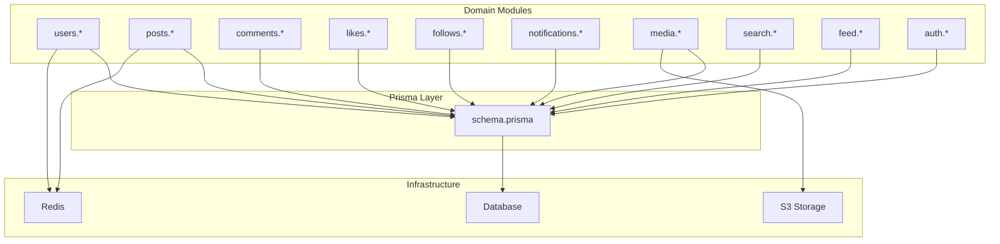

**Diagram sources**
- [schema.prisma](file://backend/prisma/schema.prisma)
- [users.controller.js](file://backend/src/modules/users/users.controller.js)
- [posts.controller.js](file://backend/src/modules/posts/posts.controller.js)
- [comments.controller.js](file://backend/src/modules/comments/comments.controller.js)
- [likes.controller.js](file://backend/src/modules/likes/likes.controller.js)
- [follows.controller.js](file://backend/src/modules/follows/follows.controller.js)
- [notifications.controller.js](file://backend/src/modules/notifications/notifications.controller.js)
- [media.controller.js](file://backend/src/modules/media/media.controller.js)
- [search.controller.js](file://backend/src/modules/search/search.controller.js)
- [feed.controller.js](file://backend/src/modules/feed/feed.controller.js)
- [auth.controller.js](file://backend/src/modules/auth/auth.controller.js)

**Section sources**
- [schema.prisma](file://backend/prisma/schema.prisma)
- [db.js](file://backend/src/config/db.js)

## Core Components
This section describes the entities and relationships inferred from the module usage and typical social media requirements. The Prisma schema is the source of truth for entity definitions, primary keys, foreign keys, indexes, and constraints.

- Users
  - Purpose: Application users with profiles and authentication credentials.
  - Expected fields: identifiers, credentials, profile metadata, timestamps, and flags.
  - Constraints: Unique usernames and emails; role-based access control; soft-delete or status flags for lifecycle.

- Posts
  - Purpose: User-generated content (text, media references).
  - Expected fields: author reference, content, metadata, visibility, timestamps.
  - Constraints: Author must reference a valid user; optional media linkage; indexing for author and timestamps.

- Comments
  - Purpose: Responses to posts or other comments.
  - Expected fields: author, post/comment reference, content, timestamps.
  - Constraints: Hierarchical references (parent comment); author must exist; indexing for post and parent.

- Likes
  - Purpose: Expressions of appreciation for posts or comments.
  - Expected fields: actor, target reference, target type, timestamps.
  - Constraints: Unique per-user per-target; actor must exist; target must be valid.

- Follows
  - Purpose: Relationship between users following each other.
  - Expected fields: follower, followee, timestamps.
  - Constraints: Unique pair; follower and followee must be distinct users; self-follow disallowed.

- Notifications
  - Purpose: Event-driven alerts for activities (likes, comments, follows).
  - Expected fields: recipient, event type, related entity references, read status, timestamps.
  - Constraints: Recipient must exist; event-specific references; indexing for unread and timestamps.

- Media
  - Purpose: Stored assets (images, videos) referenced by posts.
  - Expected fields: URLs, metadata, owner reference, timestamps.
  - Constraints: Owner must exist; lifecycle tied to content deletion.

- Search
  - Purpose: Index-backed search capabilities for posts and users.
  - Expected fields: indexed content tokens, references, weights.
  - Constraints: Consistency with content updates; refresh policies.

- Feed
  - Purpose: Aggregated timeline generation for users.
  - Expected fields: user reference, curated entries, timestamps.
  - Constraints: Derived from follows and posts; caching via Redis.

- Auth
  - Purpose: Authentication and session management.
  - Expected fields: credentials, tokens, device info, timestamps.
  - Constraints: Token integrity; rate limiting; secure storage.

Notes on current state:
- The Prisma schema file is currently empty. The above entities and relationships represent the expected schema derived from module usage and common social media patterns. Once the schema is populated, update this document accordingly.

**Section sources**
- [schema.prisma](file://backend/prisma/schema.prisma)
- [users.controller.js](file://backend/src/modules/users/users.controller.js)
- [posts.controller.js](file://backend/src/modules/posts/posts.controller.js)
- [comments.controller.js](file://backend/src/modules/comments/comments.controller.js)
- [likes.controller.js](file://backend/src/modules/likes/likes.controller.js)
- [follows.controller.js](file://backend/src/modules/follows/follows.controller.js)
- [notifications.controller.js](file://backend/src/modules/notifications/notifications.controller.js)
- [media.controller.js](file://backend/src/modules/media/media.controller.js)
- [search.controller.js](file://backend/src/modules/search/search.controller.js)
- [feed.controller.js](file://backend/src/modules/feed/feed.controller.js)
- [auth.controller.js](file://backend/src/modules/auth/auth.controller.js)

## Architecture Overview
The database layer integrates with Prisma ORM, which generates client code and manages migrations. Controllers delegate to services, which encapsulate business logic and data access. Infrastructure services (Redis and S3) support caching and media storage respectively.

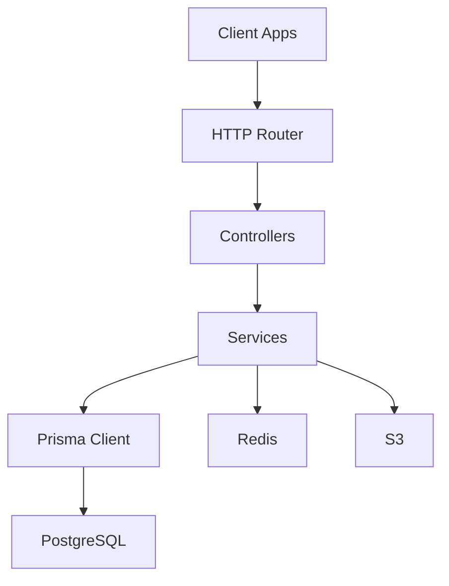

**Diagram sources**
- [db.js](file://backend/src/config/db.js)
- [users.controller.js](file://backend/src/modules/users/users.controller.js)
- [posts.controller.js](file://backend/src/modules/posts/posts.controller.js)
- [comments.controller.js](file://backend/src/modules/comments/comments.controller.js)
- [likes.controller.js](file://backend/src/modules/likes/likes.controller.js)
- [follows.controller.js](file://backend/src/modules/follows/follows.controller.js)
- [notifications.controller.js](file://backend/src/modules/notifications/notifications.controller.js)
- [media.controller.js](file://backend/src/modules/media/media.controller.js)
- [search.controller.js](file://backend/src/modules/search/search.controller.js)
- [feed.controller.js](file://backend/src/modules/feed/feed.controller.js)
- [auth.controller.js](file://backend/src/modules/auth/auth.controller.js)

## Detailed Component Analysis

### Users Module
- Responsibilities: User registration, profile management, authentication, and account lifecycle.
- Data Access Patterns: CRUD operations with validation, pagination, and filtering by username/email.
- Security: Password hashing, secure cookies/tokens, rate limiting, and role checks.
- Performance: Indexes on username and email; caching for profile reads.

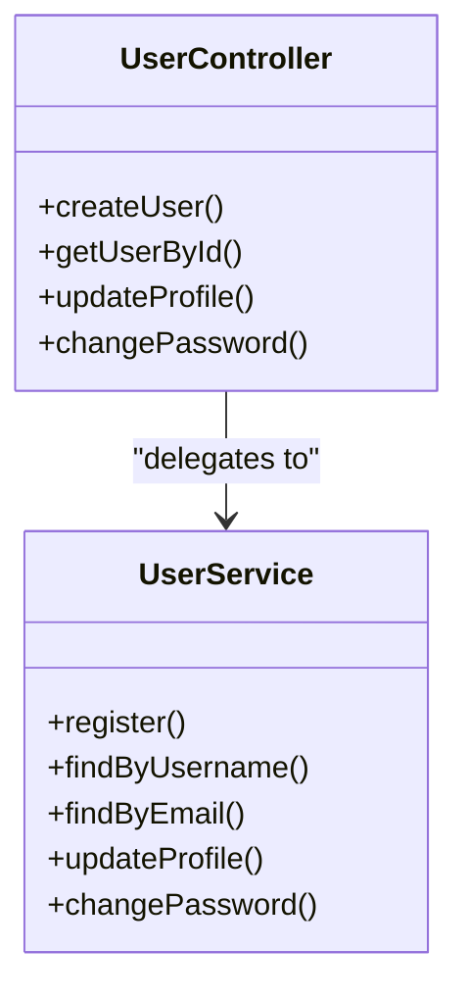

**Diagram sources**
- [users.controller.js](file://backend/src/modules/users/users.controller.js)
- [users.service.js](file://backend/src/modules/users/users.service.js)

**Section sources**
- [users.controller.js](file://backend/src/modules/users/users.controller.js)
- [users.service.js](file://backend/src/modules/users/users.service.js)
- [validate.middleware.js](file://backend/src/middleware/validate.middleware.js)
- [auth.middleware.js](file://backend/src/middleware/auth.middleware.js)

### Posts Module
- Responsibilities: Post creation, editing, deletion, and retrieval; feed aggregation.
- Data Access Patterns: Author-scoped queries, paginated timelines, and content filtering.
- Performance: Author index, published timestamp index; Redis caching for popular posts.

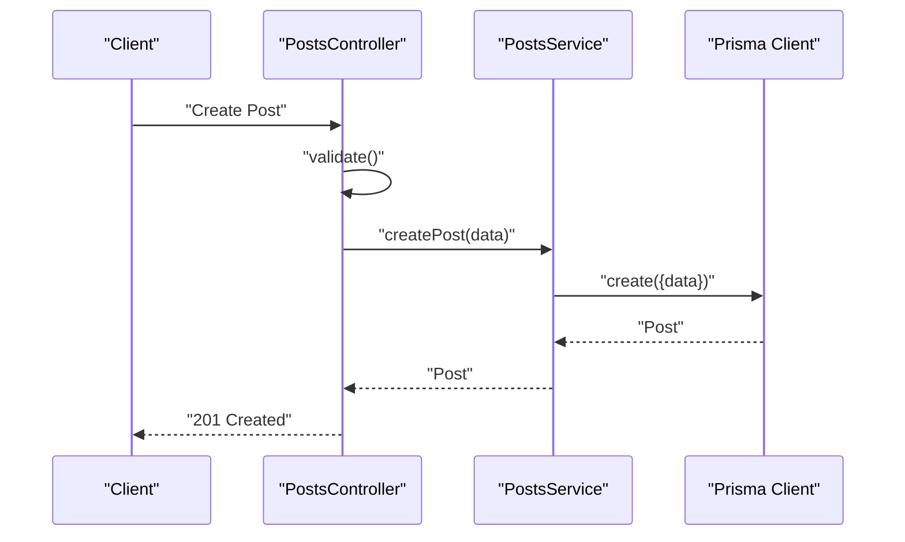

**Diagram sources**
- [posts.controller.js](file://backend/src/modules/posts/posts.controller.js)
- [posts.service.js](file://backend/src/modules/posts/posts.service.js)

**Section sources**
- [posts.controller.js](file://backend/src/modules/posts/posts.controller.js)
- [posts.service.js](file://backend/src/modules/posts/posts.service.js)
- [validate.middleware.js](file://backend/src/middleware/validate.middleware.js)

### Comments Module
- Responsibilities: Comment creation, replies, edits, deletions, and threaded views.
- Data Access Patterns: Nested queries by post or parent comment; pagination and sorting by recency.
- Performance: Parent-comment index; author index; cache invalidation on edits/deletes.

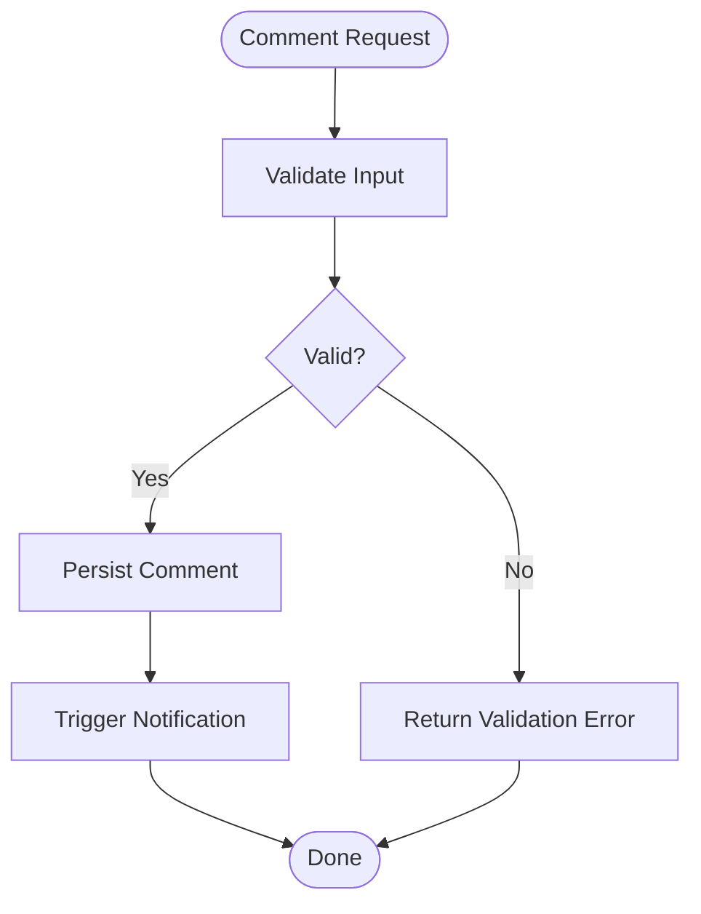

**Diagram sources**
- [comments.controller.js](file://backend/src/modules/comments/comments.controller.js)
- [comments.service.js](file://backend/src/modules/comments/comments.service.js)

**Section sources**
- [comments.controller.js](file://backend/src/modules/comments/comments.controller.js)
- [comments.service.js](file://backend/src/modules/comments/comments.service.js)
- [validate.middleware.js](file://backend/src/middleware/validate.middleware.js)

### Likes Module
- Responsibilities: Like/unlike posts and comments; counts and ownership verification.
- Data Access Patterns: Upsert-like behavior to toggle likes; aggregate counts by target.
- Performance: Unique constraint per user-target; counters cached in Redis.

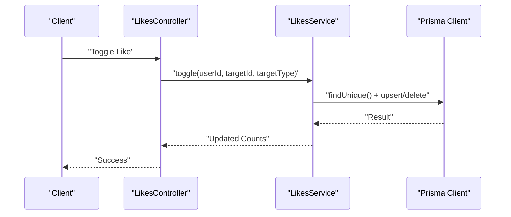

**Diagram sources**
- [likes.controller.js](file://backend/src/modules/likes/likes.controller.js)
- [likes.service.js](file://backend/src/modules/likes/likes.service.js)

**Section sources**
- [likes.controller.js](file://backend/src/modules/likes/likes.controller.js)
- [likes.service.js](file://backend/src/modules/likes/likes.service.js)

### Follows Module
- Responsibilities: Following/unfollowing users; bidirectional relationship maintenance.
- Data Access Patterns: Unique pair enforcement; follower/following lists; mutual follow indicators.
- Performance: Unique compound index on follower+followee; fan-out to notifications.

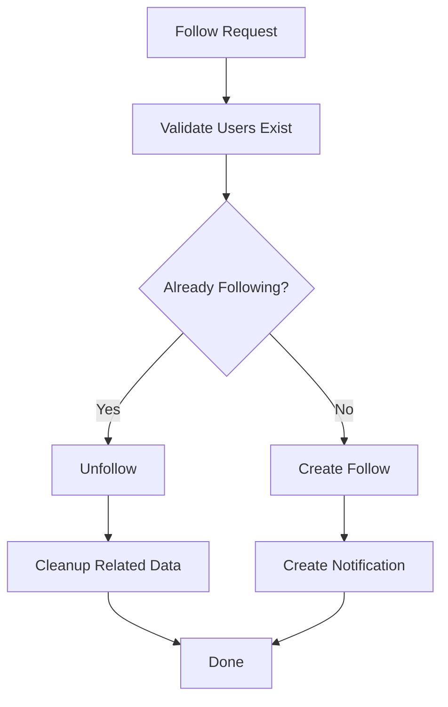

**Diagram sources**
- [follows.controller.js](file://backend/src/modules/follows/follows.controller.js)
- [follows.service.js](file://backend/src/modules/follows/follows.service.js)

**Section sources**
- [follows.controller.js](file://backend/src/modules/follows/follows.controller.js)
- [follows.service.js](file://backend/src/modules/follows/follows.service.js)

### Notifications Module
- Responsibilities: Event-driven notifications for likes, comments, follows; read/unread state.
- Data Access Patterns: Recipient-scoped queries; paginated unread-first views.
- Performance: Indexed by recipient and read status; batch delivery; TTL-based cleanup.

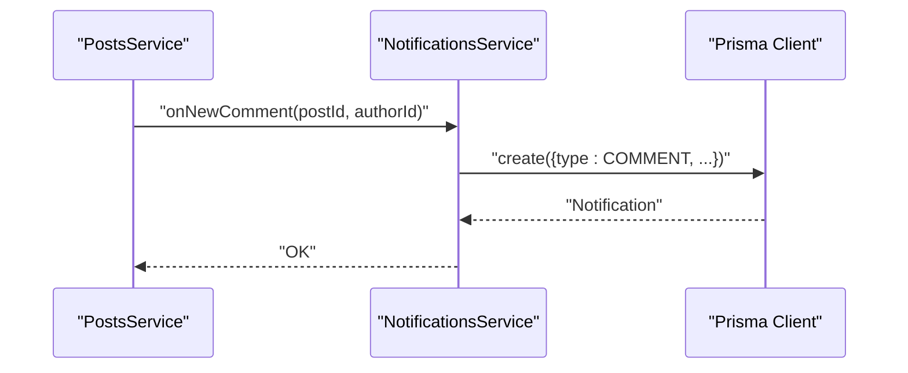

**Diagram sources**
- [notifications.controller.js](file://backend/src/modules/notifications/notifications.controller.js)
- [notifications.service.js](file://backend/src/modules/notifications/notifications.service.js)

**Section sources**
- [notifications.controller.js](file://backend/src/modules/notifications/notifications.controller.js)
- [notifications.service.js](file://backend/src/modules/notifications/notifications.service.js)

### Media Module
- Responsibilities: Upload metadata, asset references, and lifecycle management.
- Data Access Patterns: Owner validation; signed URLs for downloads; cascade deletes.
- Performance: Separate bucket per tenant; CDN caching; lazy thumbnail generation.

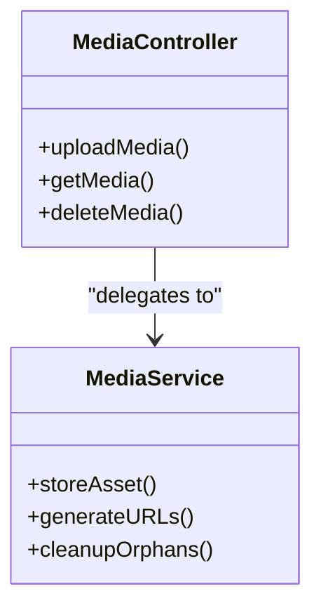

**Diagram sources**
- [media.controller.js](file://backend/src/modules/media/media.controller.js)
- [media.service.js](file://backend/src/modules/media/media.service.js)

**Section sources**
- [media.controller.js](file://backend/src/modules/media/media.controller.js)
- [media.service.js](file://backend/src/modules/media/media.service.js)

### Search Module
- Responsibilities: Full-text search and autocomplete for posts and users.
- Data Access Patterns: Index refresh on write; relevance scoring; faceted filters.
- Performance: Dedicated search index; periodic reindexing; query caching.

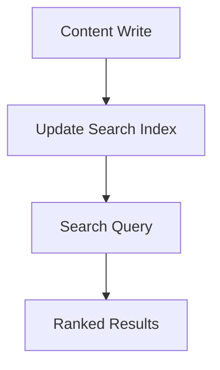

**Diagram sources**
- [search.controller.js](file://backend/src/modules/search/search.controller.js)
- [search.service.js](file://backend/src/modules/search/search.service.js)

**Section sources**
- [search.controller.js](file://backend/src/modules/search/search.controller.js)
- [search.service.js](file://backend/src/modules/search/search.service.js)

### Feed Module
- Responsibilities: Personalized timeline generation and pagination.
- Data Access Patterns: Aggregation of followed users' posts; cursor-based pagination.
- Performance: Redis caching; precomputed feeds; background recomputation.

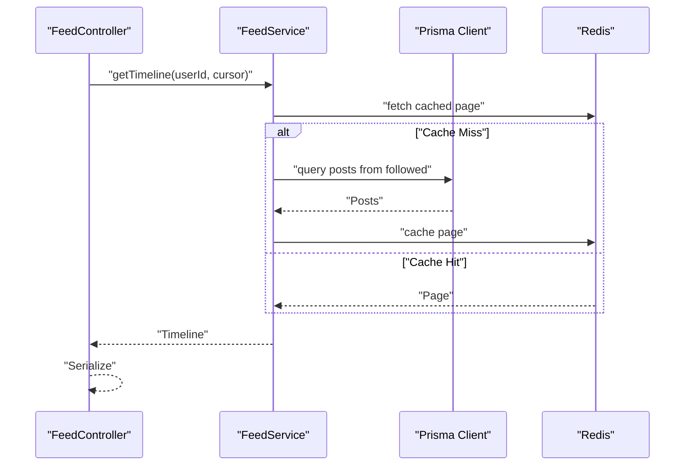

**Diagram sources**
- [feed.controller.js](file://backend/src/modules/feed/feed.controller.js)
- [feed.service.js](file://backend/src/modules/feed/feed.service.js)

**Section sources**
- [feed.controller.js](file://backend/src/modules/feed/feed.controller.js)
- [feed.service.js](file://backend/src/modules/feed/feed.service.js)

### Auth Module
- Responsibilities: Registration, login, logout, password reset, and session management.
- Data Access Patterns: Credential verification, token issuance, refresh handling.
- Security: Rate limiting, secure cookies, CSRF protection, audit logging.

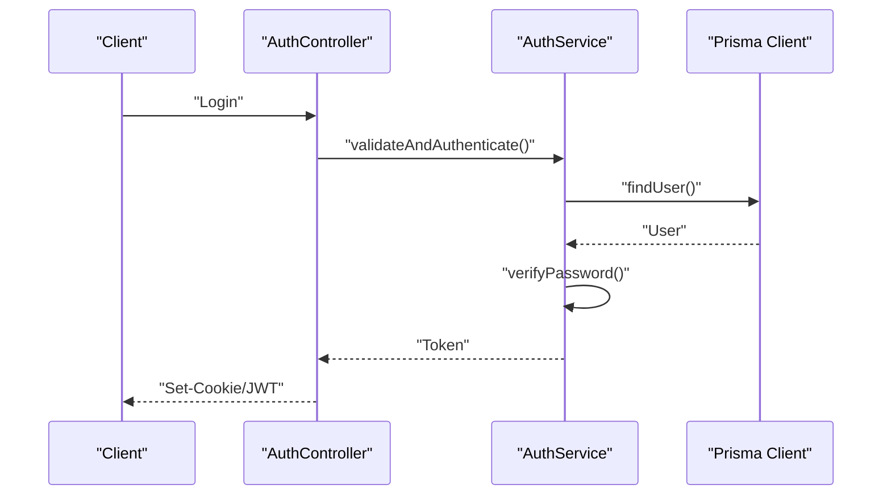

**Diagram sources**
- [auth.controller.js](file://backend/src/modules/auth/auth.controller.js)
- [auth.service.js](file://backend/src/modules/auth/auth.service.js)

**Section sources**
- [auth.controller.js](file://backend/src/modules/auth/auth.controller.js)
- [auth.service.js](file://backend/src/modules/auth/auth.service.js)
- [validate.middleware.js](file://backend/src/middleware/validate.middleware.js)
- [auth.middleware.js](file://backend/src/middleware/auth.middleware.js)

## Dependency Analysis
- Controllers depend on Services for business logic.
- Services depend on Prisma Client for data persistence.
- Services integrate with Redis for caching and S3 for media storage.
- Middleware enforces validation, authentication, and error handling.

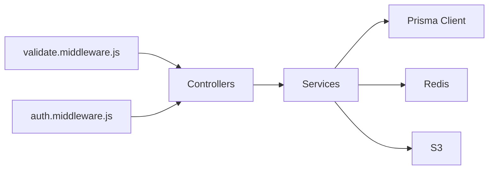

**Diagram sources**
- [validate.middleware.js](file://backend/src/middleware/validate.middleware.js)
- [auth.middleware.js](file://backend/src/middleware/auth.middleware.js)
- [users.controller.js](file://backend/src/modules/users/users.controller.js)
- [posts.controller.js](file://backend/src/modules/posts/posts.controller.js)
- [comments.controller.js](file://backend/src/modules/comments/comments.controller.js)
- [likes.controller.js](file://backend/src/modules/likes/likes.controller.js)
- [follows.controller.js](file://backend/src/modules/follows/follows.controller.js)
- [notifications.controller.js](file://backend/src/modules/notifications/notifications.controller.js)
- [media.controller.js](file://backend/src/modules/media/media.controller.js)
- [search.controller.js](file://backend/src/modules/search/search.controller.js)
- [feed.controller.js](file://backend/src/modules/feed/feed.controller.js)
- [auth.controller.js](file://backend/src/modules/auth/auth.controller.js)

**Section sources**
- [validate.middleware.js](file://backend/src/middleware/validate.middleware.js)
- [auth.middleware.js](file://backend/src/middleware/auth.middleware.js)
- [db.js](file://backend/src/config/db.js)

## Performance Considerations
- Indexing Strategy
  - Users: username, email
  - Posts: authorId, createdAt
  - Comments: postId, parentId, createdAt
  - Likes: userId, targetId, targetType
  - Follows: followerId, followeeId (unique compound)
  - Notifications: recipientId, read, createdAt
- Caching
  - Redis: user profiles, post previews, timelines, media URLs
  - Cache invalidation on writes; TTL for transient data
- Asynchronous Work
  - Background jobs for notifications, search reindexing, analytics
- Pagination
  - Cursor-based pagination for predictable performance
- Query Patterns
  - Denormalized counts for likes/comments to reduce joins
  - Fan-out notifications to avoid expensive joins during hot paths

[No sources needed since this section provides general guidance]

## Troubleshooting Guide
- Common Issues
  - Duplicate key errors on unique fields (username, email, follow pairs)
  - Foreign key violations when deleting referenced records
  - Missing indexes causing slow queries on timelines and searches
- Error Handling
  - Centralized error middleware to translate database errors into API responses
  - Role-based access denied errors for unauthorized operations
- Monitoring
  - Track slow queries, cache hit rates, and error rates
  - Audit logs for sensitive operations (password changes, deletions)

**Section sources**
- [error.middleware.js](file://backend/src/middleware/error.middleware.js)
- [errors.js](file://backend/src/constants/errors.js)
- [roles.js](file://backend/src/constants/roles.js)

## Conclusion
The social media application’s database layer is structured around modular domain services with Prisma as the ORM backbone. While the Prisma schema file is currently empty, the documented entities and relationships reflect the intended design for users, posts, comments, likes, follows, notifications, media, search, feed, and auth. Implementing proper indexing, caching, and asynchronous processing will ensure scalability and responsiveness. Establishing robust validation, access control, and migration procedures will maintain data integrity and evolve the schema safely over time.

[No sources needed since this section summarizes without analyzing specific files]

## Appendices

### Prisma Migration and Schema Evolution
- Migration Workflow
  - Modify Prisma schema to reflect new entities, fields, or indexes
  - Generate migration: prisma migrate dev --name init
  - Review and commit migration files
  - Deploy to staging and production environments
- Version Management
  - Keep migration history linear; avoid altering applied migrations
  - Use descriptive migration names and minimal, atomic changes
- Rollback Strategy
  - Use prisma migrate resolve to mark migrations as resolved
  - Maintain safe rollback steps for critical changes

[No sources needed since this section provides general guidance]

### Data Lifecycle, Retention, and Archival
- Data Lifecycle
  - Creation: validated and persisted via services
  - Active: cached and served to clients
  - Deletion: soft delete for auditability; hard delete after retention period
- Retention Policies
  - User data: retain indefinitely unless requested; enforce GDPR-compliant deletion
  - Posts and comments: keep permanently; mark deleted content for visibility
  - Logs and metrics: short-term retention; long-term archival offloaded
- Archival Rules
  - Cold storage for old media assets; metadata retained in DB
  - Compressed backups with encryption; automated rotation

[No sources needed since this section provides general guidance]

### Security, Privacy, and Access Control
- Data Security
  - Encrypt at rest and in transit; rotate secrets regularly
  - Least privilege for database connections; network-level restrictions
- Privacy
  - Minimize stored PII; anonymize analytics data
  - Respect user consent for data collection and processing
- Access Control
  - Role-based permissions (user, admin)
  - API-level authentication and authorization
  - Audit trails for sensitive actions

[No sources needed since this section provides general guidance]