# Deployment Guide

<cite>
**Referenced Files in This Document**
- [backend/.gitignore](file://backend/.gitignore)
- [backend/package.json](file://backend/package.json)
- [backend/prisma/schema.prisma](file://backend/prisma/schema.prisma)
- [backend/src/app.js](file://backend/src/app.js)
- [backend/src/config/db.js](file://backend/src/config/db.js)
- [backend/src/config/redis.js](file://backend/src/config/redis.js)
- [backend/src/config/s3.js](file://backend/src/config/s3.js)
- [backend/src/constants/errors.js](file://backend/src/constants/errors.js)
- [backend/src/constants/roles.js](file://backend/src/constants/roles.js)
- [backend/src/dto/post.dto.js](file://backend/src/dto/post.dto.js)
- [backend/src/dto/user.dto.js](file://backend/src/dto/user.dto.js)
- [backend/src/middleware/auth.middleware.js](file://backend/src/middleware/auth.middleware.js)
- [backend/src/middleware/error.middleware.js](file://backend/src/middleware/error.middleware.js)
- [backend/src/middleware/rateLimit.middleware.js](file://backend/src/middleware/rateLimit.middleware.js)
- [backend/src/middleware/validate.middleware.js](file://backend/src/middleware/validate.middleware.js)
- [backend/src/modules/auth/auth.controller.js](file://backend/src/modules/auth/auth.controller.js)
- [backend/src/modules/auth/auth.repository.js](file://backend/src/modules/auth/auth.repository.js)
- [backend/src/modules/auth/auth.routes.js](file://backend/src/modules/auth/auth.routes.js)
- [backend/src/modules/auth/auth.service.js](file://backend/src/modules/auth/auth.service.js)
- [backend/src/modules/auth/auth.validation.js](file://backend/src/modules/auth/auth.validation.js)
- [backend/src/modules/comments/comment.controller.js](file://backend/src/modules/comments/comment.controller.js)
- [backend/src/modules/comments/comment.repository.js](file://backend/src/modules/comments/comment.repository.js)
- [backend/src/modules/comments/comment.routes.js](file://backend/src/modules/comments/comment.routes.js)
- [backend/src/modules/comments/comment.service.js](file://backend/src/modules/comments/comment.service.js)
- [backend/src/modules/feed/feed.controller.js](file://backend/src/modules/feed/feed.controller.js)
- [backend/src/modules/feed/feed.repository.js](file://backend/src/modules/feed/feed.repository.js)
- [backend/src/modules/feed/feed.routes.js](file://backend/src/modules/feed/feed.routes.js)
- [backend/src/modules/feed/feed.service.js](file://backend/src/modules/feed/feed.service.js)
- [backend/src/modules/follows/follow.controller.js](file://backend/src/modules/follows/follow.controller.js)
- [backend/src/modules/follows/follow.repository.js](file://backend/src/modules/follows/follow.repository.js)
- [backend/src/modules/follows/follow.routes.js](file://backend/src/modules/follows/follow.routes.js)
- [backend/src/modules/follows/follow.service.js](file://backend/src/modules/follows/follow.service.js)
- [backend/src/modules/likes/like.controller.js](file://backend/src/modules/likes/like.controller.js)
- [backend/src/modules/likes/like.repository.js](file://backend/src/modules/likes/like.repository.js)
- [backend/src/modules/likes/like.routes.js](file://backend/src/modules/likes/like.routes.js)
- [backend/src/modules/likes/like.service.js](file://backend/src/modules/likes/like.service.js)
- [backend/src/modules/media/media.controller.js](file://backend/src/modules/media/media.controller.js)
- [backend/src/modules/media/media.repository.js](file://backend/src/modules/media/media.repository.js)
- [backend/src/modules/media/media.routes.js](file://backend/src/modules/media/media.routes.js)
- [backend/src/modules/media/media.service.js](file://backend/src/modules/media/media.service.js)
- [backend/src/modules/notifications/notification.controller.js](file://backend/src/modules/notifications/notification.controller.js)
- [backend/src/modules/notifications/notification.repository.js](file://backend/src/modules/notifications/notification.repository.js)
- [backend/src/modules/notifications/notification.routes.js](file://backend/src/modules/notifications/notification.routes.js)
- [backend/src/modules/notifications/notification.service.js](file://backend/src/modules/notifications/notification.service.js)
- [backend/src/modules/posts/post.controller.js](file://backend/src/modules/posts/post.controller.js)
- [backend/src/modules/posts/post.repository.js](file://backend/src/modules/posts/post.repository.js)
- [backend/src/modules/posts/post.routes.js](file://backend/src/modules/posts/post.routes.js)
- [backend/src/modules/posts/post.service.js](file://backend/src/modules/posts/post.service.js)
- [backend/src/modules/search/search.controller.js](file://backend/src/modules/search/search.controller.js)
- [backend/src/modules/search/search.repository.js](file://backend/src/modules/search/search.repository.js)
- [backend/src/modules/search/search.routes.js](file://backend/src/modules/search/search.routes.js)
- [backend/src/modules/search/search.service.js](file://backend/src/modules/search/search.service.js)
- [backend/src/modules/users/user.controller.js](file://backend/src/modules/users/user.controller.js)
- [backend/src/modules/users/user.repository.js](file://backend/src/modules/users/user.repository.js)
- [backend/src/modules/users/user.routes.js](file://backend/src/modules/users/user.routes.js)
- [backend/src/modules/users/user.service.js](file://backend/src/modules/users/user.service.js)
- [backend/src/routes/index.js](file://backend/src/routes/index.js)
- [backend/src/utils/helpers.js](file://backend/src/utils/helpers.js)
- [backend/src/utils/logger.js](file://backend/src/utils/logger.js)
- [backend/src/utils/validation.js](file://backend/src/utils/validation.js)
- [frontend/pubspec.yaml](file://frontend/pubspec.yaml)
- [frontend/web/index.html](file://frontend/web/index.html)
- [frontend/android/app/src/main/AndroidManifest.xml](file://frontend/android/app/src/main/AndroidManifest.xml)
- [frontend/ios/Runner/Info.plist](file://frontend/ios/Runner/Info.plist)
- [frontend/linux/CMakeLists.txt](file://frontend/linux/CMakeLists.txt)
- [frontend/windows/CMakeLists.txt](file://frontend/windows/CMakeLists.txt)
- [frontend/macos/Runner/AppDelegate.swift](file://frontend/macos/Runner/AppDelegate.swift)
- [frontend/macos/Runner/MainFlutterWindow.swift](file://frontend/macos/Runner/MainFlutterWindow.swift)
- [frontend/macos/Runner/Info.plist](file://frontend/macos/Runner/Info.plist)
</cite>

## Table of Contents
1. [Introduction](#introduction)
2. [Project Structure](#project-structure)
3. [Core Components](#core-components)
4. [Architecture Overview](#architecture-overview)
5. [Detailed Component Analysis](#detailed-component-analysis)
6. [Dependency Analysis](#dependency-analysis)
7. [Performance Considerations](#performance-considerations)
8. [Troubleshooting Guide](#troubleshooting-guide)
9. [Conclusion](#conclusion)
10. [Appendices](#appendices)

## Introduction
This document provides a comprehensive deployment guide for a social media application with separate frontend (Flutter) and backend (Node.js) components. It covers deployment strategies for web, mobile, and desktop platforms; backend deployment to cloud platforms; containerization with Docker; CI/CD pipeline setup; environment configuration management; secrets handling; database migration procedures; reverse proxy configuration, SSL certificate management, and load balancing setup; monitoring and logging configuration, health checks, and alerting systems; rollback procedures, blue-green deployments, and zero-downtime deployment strategies; scaling considerations, resource optimization, and cost management; and platform-specific deployment guides for AWS and Google Cloud.

## Project Structure
The repository is organized into two primary areas:
- Backend: Node.js application with modular structure under src/modules, configuration under src/config, DTOs under src/dto, middleware under src/middleware, and utilities under src/utils.
- Frontend: Flutter application supporting web, Android, iOS, Linux, macOS, and Windows platforms.

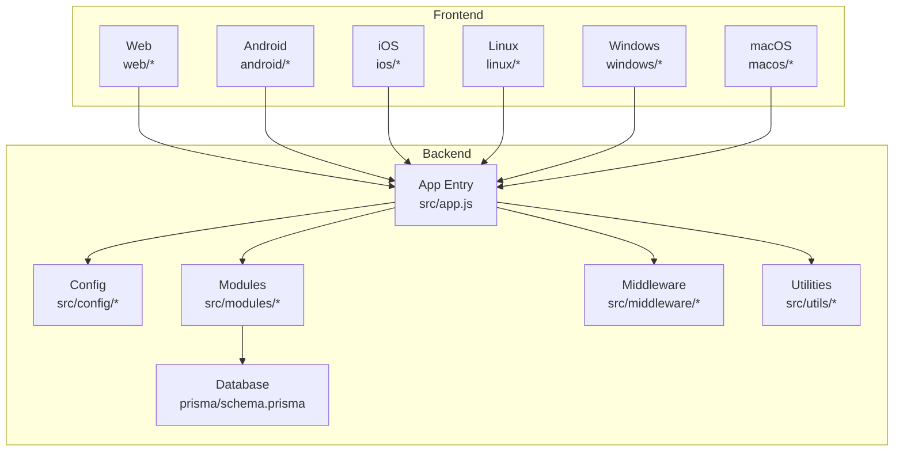

**Diagram sources**
- [backend/src/app.js:1-200](file://backend/src/app.js#L1-L200)
- [backend/src/config/db.js:1-200](file://backend/src/config/db.js#L1-L200)
- [backend/prisma/schema.prisma:1-1](file://backend/prisma/schema.prisma#L1-L1)
- [frontend/web/index.html:1-39](file://frontend/web/index.html#L1-L39)
- [frontend/android/app/src/main/AndroidManifest.xml:1-200](file://frontend/android/app/src/main/AndroidManifest.xml#L1-L200)
- [frontend/ios/Runner/Info.plist:1-200](file://frontend/ios/Runner/Info.plist#L1-L200)
- [frontend/linux/CMakeLists.txt:1-200](file://frontend/linux/CMakeLists.txt#L1-L200)
- [frontend/windows/CMakeLists.txt:1-200](file://frontend/windows/CMakeLists.txt#L1-L200)
- [frontend/macos/Runner/AppDelegate.swift:1-200](file://frontend/macos/Runner/AppDelegate.swift#L1-L200)
- [frontend/macos/Runner/MainFlutterWindow.swift:1-200](file://frontend/macos/Runner/MainFlutterWindow.swift#L1-L200)
- [frontend/macos/Runner/Info.plist:1-200](file://frontend/macos/Runner/Info.plist#L1-L200)

**Section sources**
- [backend/src/app.js:1-200](file://backend/src/app.js#L1-L200)
- [backend/prisma/schema.prisma:1-1](file://backend/prisma/schema.prisma#L1-L1)
- [frontend/web/index.html:1-39](file://frontend/web/index.html#L1-L39)

## Core Components
- Backend application entry initializes the server, loads configuration, registers routes, and connects to external services (database, Redis cache, S3 storage).
- Modular backend architecture organizes features into domain-specific modules (authentication, posts, comments, likes, follows, media, notifications, search, users, feed).
- Middleware stack handles authentication, rate limiting, validation, and error management.
- Utilities provide helpers, logging, and validation functions.
- Frontend supports multiple platforms via Flutter, with platform-specific build configurations and manifests.

Key deployment-relevant files:
- Backend entry and routing: [backend/src/app.js:1-200](file://backend/src/app.js#L1-L200), [backend/src/routes/index.js:1-200](file://backend/src/routes/index.js#L1-L200)
- Configuration: [backend/src/config/db.js:1-200](file://backend/src/config/db.js#L1-L200), [backend/src/config/redis.js:1-200](file://backend/src/config/redis.js#L1-L200), [backend/src/config/s3.js:1-200](file://backend/src/config/s3.js#L1-L200)
- Modules: [backend/src/modules/auth/auth.routes.js:1-200](file://backend/src/modules/auth/auth.routes.js#L1-L200), [backend/src/modules/posts/post.routes.js:1-200](file://backend/src/modules/posts/post.routes.js#L1-L200), [backend/src/modules/comments/comment.routes.js:1-200](file://backend/src/modules/comments/comment.routes.js#L1-L200), [backend/src/modules/likes/like.routes.js:1-200](file://backend/src/modules/likes/like.routes.js#L1-L200), [backend/src/modules/follows/follow.routes.js:1-200](file://backend/src/modules/follows/follow.routes.js#L1-L200), [backend/src/modules/media/media.routes.js:1-200](file://backend/src/modules/media/media.routes.js#L1-L200), [backend/src/modules/notifications/notification.routes.js:1-200](file://backend/src/modules/notifications/notification.routes.js#L1-L200), [backend/src/modules/search/search.routes.js:1-200](file://backend/src/modules/search/search.routes.js#L1-L200), [backend/src/modules/users/user.routes.js:1-200](file://backend/src/modules/users/user.routes.js#L1-L200), [backend/src/modules/feed/feed.routes.js:1-200](file://backend/src/modules/feed/feed.routes.js#L1-L200)
- Middleware: [backend/src/middleware/auth.middleware.js:1-200](file://backend/src/middleware/auth.middleware.js#L1-L200), [backend/src/middleware/rateLimit.middleware.js:1-200](file://backend/src/middleware/rateLimit.middleware.js#L1-L200), [backend/src/middleware/validate.middleware.js:1-200](file://backend/src/middleware/validate.middleware.js#L1-L200), [backend/src/middleware/error.middleware.js:1-200](file://backend/src/middleware/error.middleware.js#L1-L200)
- Utilities: [backend/src/utils/logger.js:1-200](file://backend/src/utils/logger.js#L1-L200), [backend/src/utils/helpers.js:1-200](file://backend/src/utils/helpers.js#L1-L200), [backend/src/utils/validation.js:1-200](file://backend/src/utils/validation.js#L1-L200)
- DTOs: [backend/src/dto/user.dto.js:1-200](file://backend/src/dto/user.dto.js#L1-L200), [backend/src/dto/post.dto.js:1-200](file://backend/src/dto/post.dto.js#L1-L200)
- Constants: [backend/src/constants/errors.js:1-200](file://backend/src/constants/errors.js#L1-L200), [backend/src/constants/roles.js:1-200](file://backend/src/constants/roles.js#L1-L200)
- Database schema: [backend/prisma/schema.prisma:1-1](file://backend/prisma/schema.prisma#L1-L1)
- Frontend configuration: [frontend/pubspec.yaml:1-91](file://frontend/pubspec.yaml#L1-L91), [frontend/web/index.html:1-39](file://frontend/web/index.html#L1-L39)
- Platform manifests: [frontend/android/app/src/main/AndroidManifest.xml:1-200](file://frontend/android/app/src/main/AndroidManifest.xml#L1-L200), [frontend/ios/Runner/Info.plist:1-200](file://frontend/ios/Runner/Info.plist#L1-L200), [frontend/macos/Runner/Info.plist:1-200](file://frontend/macos/Runner/Info.plist#L1-L200)
- Platform build configs: [frontend/linux/CMakeLists.txt:1-200](file://frontend/linux/CMakeLists.txt#L1-L200), [frontend/windows/CMakeLists.txt:1-200](file://frontend/windows/CMakeLists.txt#L1-L200)

**Section sources**
- [backend/src/app.js:1-200](file://backend/src/app.js#L1-L200)
- [backend/src/routes/index.js:1-200](file://backend/src/routes/index.js#L1-L200)
- [backend/src/config/db.js:1-200](file://backend/src/config/db.js#L1-L200)
- [backend/src/config/redis.js:1-200](file://backend/src/config/redis.js#L1-L200)
- [backend/src/config/s3.js:1-200](file://backend/src/config/s3.js#L1-L200)
- [backend/src/modules/auth/auth.routes.js:1-200](file://backend/src/modules/auth/auth.routes.js#L1-L200)
- [backend/src/modules/posts/post.routes.js:1-200](file://backend/src/modules/posts/post.routes.js#L1-L200)
- [backend/src/modules/comments/comment.routes.js:1-200](file://backend/src/modules/comments/comment.routes.js#L1-L200)
- [backend/src/modules/likes/like.routes.js:1-200](file://backend/src/modules/likes/like.routes.js#L1-L200)
- [backend/src/modules/follows/follow.routes.js:1-200](file://backend/src/modules/follows/follow.routes.js#L1-L200)
- [backend/src/modules/media/media.routes.js:1-200](file://backend/src/modules/media/media.routes.js#L1-L200)
- [backend/src/modules/notifications/notification.routes.js:1-200](file://backend/src/modules/notifications/notification.routes.js#L1-L200)
- [backend/src/modules/search/search.routes.js:1-200](file://backend/src/modules/search/search.routes.js#L1-L200)
- [backend/src/modules/users/user.routes.js:1-200](file://backend/src/modules/users/user.routes.js#L1-L200)
- [backend/src/modules/feed/feed.routes.js:1-200](file://backend/src/modules/feed/feed.routes.js#L1-L200)
- [backend/src/middleware/auth.middleware.js:1-200](file://backend/src/middleware/auth.middleware.js#L1-L200)
- [backend/src/middleware/rateLimit.middleware.js:1-200](file://backend/src/middleware/rateLimit.middleware.js#L1-L200)
- [backend/src/middleware/validate.middleware.js:1-200](file://backend/src/middleware/validate.middleware.js#L1-L200)
- [backend/src/middleware/error.middleware.js:1-200](file://backend/src/middleware/error.middleware.js#L1-L200)
- [backend/src/utils/logger.js:1-200](file://backend/src/utils/logger.js#L1-L200)
- [backend/src/utils/helpers.js:1-200](file://backend/src/utils/helpers.js#L1-L200)
- [backend/src/utils/validation.js:1-200](file://backend/src/utils/validation.js#L1-L200)
- [backend/src/dto/user.dto.js:1-200](file://backend/src/dto/user.dto.js#L1-L200)
- [backend/src/dto/post.dto.js:1-200](file://backend/src/dto/post.dto.js#L1-L200)
- [backend/src/constants/errors.js:1-200](file://backend/src/constants/errors.js#L1-L200)
- [backend/src/constants/roles.js:1-200](file://backend/src/constants/roles.js#L1-L200)
- [backend/prisma/schema.prisma:1-1](file://backend/prisma/schema.prisma#L1-L1)
- [frontend/pubspec.yaml:1-91](file://frontend/pubspec.yaml#L1-L91)
- [frontend/web/index.html:1-39](file://frontend/web/index.html#L1-L39)
- [frontend/android/app/src/main/AndroidManifest.xml:1-200](file://frontend/android/app/src/main/AndroidManifest.xml#L1-L200)
- [frontend/ios/Runner/Info.plist:1-200](file://frontend/ios/Runner/Info.plist#L1-L200)
- [frontend/macos/Runner/Info.plist:1-200](file://frontend/macos/Runner/Info.plist#L1-L200)
- [frontend/linux/CMakeLists.txt:1-200](file://frontend/linux/CMakeLists.txt#L1-L200)
- [frontend/windows/CMakeLists.txt:1-200](file://frontend/windows/CMakeLists.txt#L1-L200)

## Architecture Overview
The application follows a modular backend architecture with a clear separation of concerns:
- Backend: Express-based server exposing REST endpoints, integrated with Prisma ORM, Redis caching, and S3-compatible storage.
- Frontend: Flutter application targeting web, Android, iOS, Linux, macOS, and Windows, consuming backend APIs.

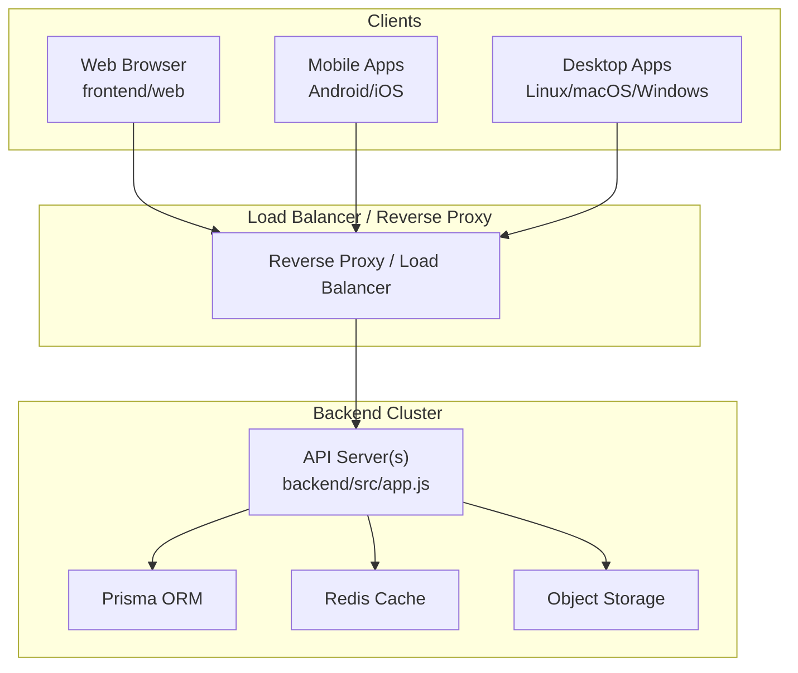

**Diagram sources**
- [backend/src/app.js:1-200](file://backend/src/app.js#L1-L200)
- [backend/src/config/db.js:1-200](file://backend/src/config/db.js#L1-L200)
- [backend/src/config/redis.js:1-200](file://backend/src/config/redis.js#L1-L200)
- [backend/src/config/s3.js:1-200](file://backend/src/config/s3.js#L1-L200)
- [frontend/web/index.html:1-39](file://frontend/web/index.html#L1-L39)
- [frontend/android/app/src/main/AndroidManifest.xml:1-200](file://frontend/android/app/src/main/AndroidManifest.xml#L1-L200)
- [frontend/ios/Runner/Info.plist:1-200](file://frontend/ios/Runner/Info.plist#L1-L200)
- [frontend/macos/Runner/Info.plist:1-200](file://frontend/macos/Runner/Info.plist#L1-L200)

## Detailed Component Analysis

### Backend Deployment Strategy
- Containerization: Package the backend into a Docker image using a minimal base image, copy production dependencies, expose the port, and define an entrypoint command.
- Orchestration: Deploy behind a reverse proxy/load balancer, scale horizontally across multiple instances, and configure health checks.
- Secrets Management: Store sensitive values in environment variables managed by the platform secrets manager; mount as environment variables inside containers.
- Database Migrations: Use Prisma migrations to apply schema changes; run migrations during deployment or via a dedicated job.
- Caching: Configure Redis for session storage and caching; ensure high availability and persistence policies align with SLAs.
- Storage: Configure S3-compatible storage for media uploads; set bucket policies and CORS appropriately.

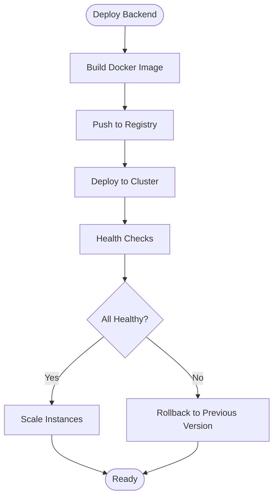

**Diagram sources**
- [backend/src/app.js:1-200](file://backend/src/app.js#L1-L200)
- [backend/src/config/db.js:1-200](file://backend/src/config/db.js#L1-L200)
- [backend/src/config/redis.js:1-200](file://backend/src/config/redis.js#L1-L200)
- [backend/src/config/s3.js:1-200](file://backend/src/config/s3.js#L1-L200)
- [backend/prisma/schema.prisma:1-1](file://backend/prisma/schema.prisma#L1-L1)

**Section sources**
- [backend/src/app.js:1-200](file://backend/src/app.js#L1-L200)
- [backend/src/config/db.js:1-200](file://backend/src/config/db.js#L1-L200)
- [backend/src/config/redis.js:1-200](file://backend/src/config/redis.js#L1-L200)
- [backend/src/config/s3.js:1-200](file://backend/src/config/s3.js#L1-L200)
- [backend/prisma/schema.prisma:1-1](file://backend/prisma/schema.prisma#L1-L1)

### Frontend Deployment Strategy
- Web: Build static assets and host on a CDN or static hosting service; configure base href and service worker behavior.
- Mobile: Publish to respective stores after signing and provisioning profiles; automate builds via CI/CD.
- Desktop: Build platform-specific installers using Flutter’s desktop toolchain; distribute via package managers or direct downloads.

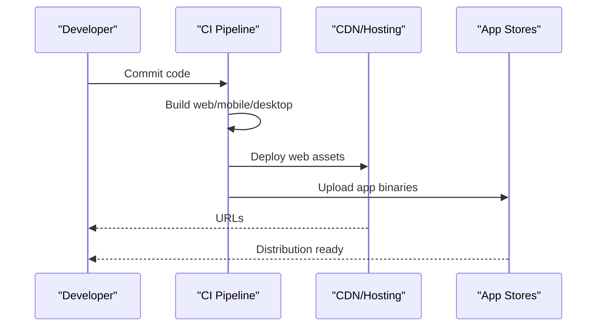

**Diagram sources**
- [frontend/pubspec.yaml:1-91](file://frontend/pubspec.yaml#L1-L91)
- [frontend/web/index.html:1-39](file://frontend/web/index.html#L1-L39)
- [frontend/android/app/src/main/AndroidManifest.xml:1-200](file://frontend/android/app/src/main/AndroidManifest.xml#L1-L200)
- [frontend/ios/Runner/Info.plist:1-200](file://frontend/ios/Runner/Info.plist#L1-L200)
- [frontend/linux/CMakeLists.txt:1-200](file://frontend/linux/CMakeLists.txt#L1-L200)
- [frontend/windows/CMakeLists.txt:1-200](file://frontend/windows/CMakeLists.txt#L1-L200)

**Section sources**
- [frontend/pubspec.yaml:1-91](file://frontend/pubspec.yaml#L1-L91)
- [frontend/web/index.html:1-39](file://frontend/web/index.html#L1-L39)
- [frontend/android/app/src/main/AndroidManifest.xml:1-200](file://frontend/android/app/src/main/AndroidManifest.xml#L1-L200)
- [frontend/ios/Runner/Info.plist:1-200](file://frontend/ios/Runner/Info.plist#L1-L200)
- [frontend/linux/CMakeLists.txt:1-200](file://frontend/linux/CMakeLists.txt#L1-L200)
- [frontend/windows/CMakeLists.txt:1-200](file://frontend/windows/CMakeLists.txt#L1-L200)

### CI/CD Pipeline Setup
- Stages: Build (compile and package), Test (unit/integration), Security Scan, Package, Deploy (staging/production), Post-deploy verification.
- Branching: Feature branches -> pull requests -> main branch protected deployments.
- Canary/BLEED: Route a small percentage of traffic to new versions; monitor metrics before full rollout.
- Rollback: Automated rollback on health check failures or manual intervention.

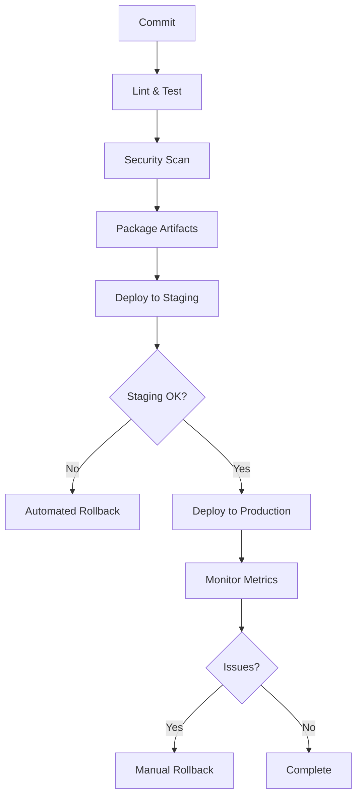

**Diagram sources**
- [backend/src/app.js:1-200](file://backend/src/app.js#L1-L200)
- [backend/src/middleware/error.middleware.js:1-200](file://backend/src/middleware/error.middleware.js#L1-L200)
- [backend/src/utils/logger.js:1-200](file://backend/src/utils/logger.js#L1-L200)

**Section sources**
- [backend/src/app.js:1-200](file://backend/src/app.js#L1-L200)
- [backend/src/middleware/error.middleware.js:1-200](file://backend/src/middleware/error.middleware.js#L1-L200)
- [backend/src/utils/logger.js:1-200](file://backend/src/utils/logger.js#L1-L200)

### Environment Configuration Management and Secrets Handling
- Environment Variables: Define environment-specific variables for database connection, Redis endpoint, S3 credentials, JWT secret, and feature flags.
- Secrets Management: Use platform-managed secrets (e.g., AWS Secrets Manager, Google Secret Manager) and inject into containers as environment variables.
- Configuration Validation: Validate required environment variables at startup and fail fast on missing values.

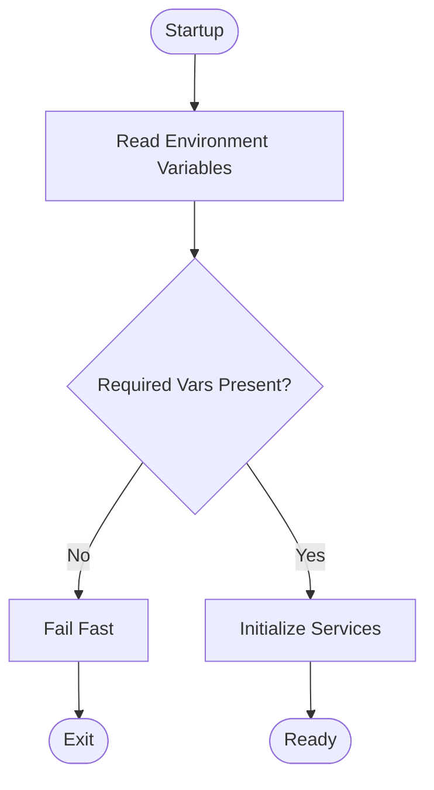

**Diagram sources**
- [backend/src/config/db.js:1-200](file://backend/src/config/db.js#L1-L200)
- [backend/src/config/redis.js:1-200](file://backend/src/config/redis.js#L1-L200)
- [backend/src/config/s3.js:1-200](file://backend/src/config/s3.js#L1-L200)

**Section sources**
- [backend/src/config/db.js:1-200](file://backend/src/config/db.js#L1-L200)
- [backend/src/config/redis.js:1-200](file://backend/src/config/redis.js#L1-L200)
- [backend/src/config/s3.js:1-200](file://backend/src/config/s3.js#L1-L200)

### Database Migration Procedures
- Prisma Migrations: Apply schema changes using Prisma migration commands; keep migration history in version control.
- Pre-deploy Checklist: Run migrations against staging; verify data integrity; confirm rollback plan.
- Zero-Downtime: Use read replicas and careful sequencing to minimize impact.

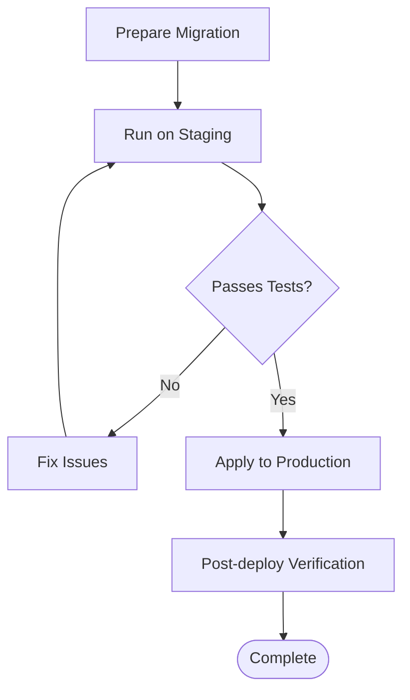

**Diagram sources**
- [backend/prisma/schema.prisma:1-1](file://backend/prisma/schema.prisma#L1-L1)

**Section sources**
- [backend/prisma/schema.prisma:1-1](file://backend/prisma/schema.prisma#L1-L1)

### Reverse Proxy, SSL, and Load Balancing
- Reverse Proxy: Place Nginx or equivalent in front of backend instances; configure SSL termination, gzip compression, and static asset serving for web.
- SSL Certificates: Provision certificates via ACME automation or platform CA; enforce HTTPS redirects.
- Load Balancing: Distribute traffic across backend instances; enable sticky sessions if required; configure health probes.

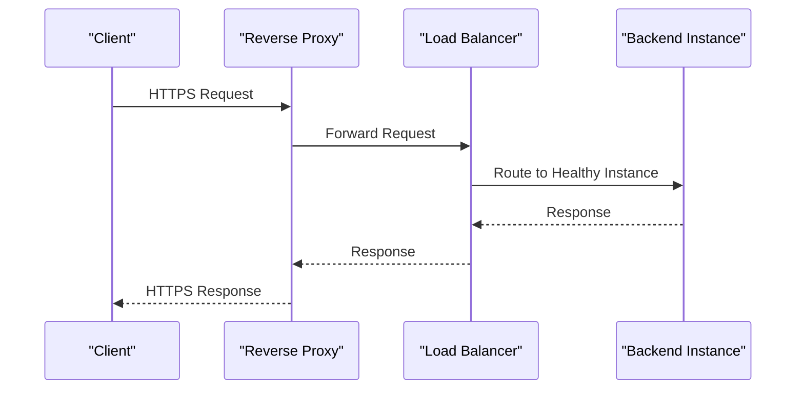

**Diagram sources**
- [backend/src/app.js:1-200](file://backend/src/app.js#L1-L200)
- [frontend/web/index.html:1-39](file://frontend/web/index.html#L1-L39)

**Section sources**
- [backend/src/app.js:1-200](file://backend/src/app.js#L1-L200)
- [frontend/web/index.html:1-39](file://frontend/web/index.html#L1-L39)

### Monitoring, Logging, Health Checks, and Alerting
- Health Checks: Expose a /health endpoint returning status and dependencies’ health.
- Logging: Centralize logs to a log aggregation service; include structured JSON logs with correlation IDs.
- Metrics: Expose Prometheus metrics; monitor latency, error rates, and resource utilization.
- Alerting: Configure alerts for error spikes, degraded response times, and failing health checks.

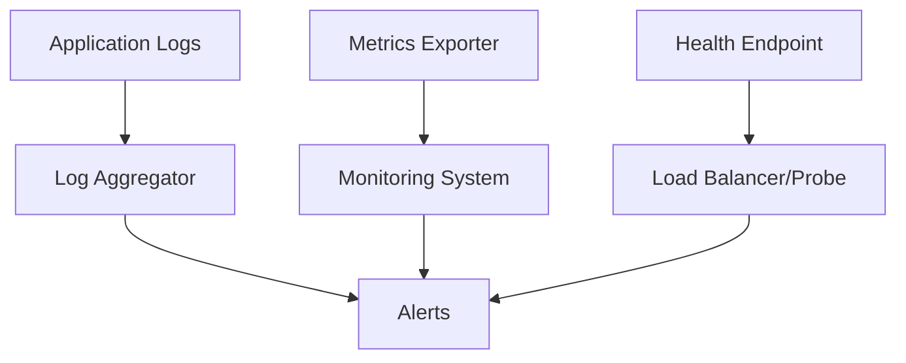

**Diagram sources**
- [backend/src/utils/logger.js:1-200](file://backend/src/utils/logger.js#L1-L200)
- [backend/src/app.js:1-200](file://backend/src/app.js#L1-L200)

**Section sources**
- [backend/src/utils/logger.js:1-200](file://backend/src/utils/logger.js#L1-L200)
- [backend/src/app.js:1-200](file://backend/src/app.js#L1-L200)

### Rollback, Blue-Green, and Zero-Downtime Strategies
- Blue-Green: Maintain two identical environments; switch traffic after validation.
- Canary: Gradually shift traffic to the new version; revert if anomalies detected.
- Rollback: Keep previous container image; redeploy with health checks and automated rollback on failure.

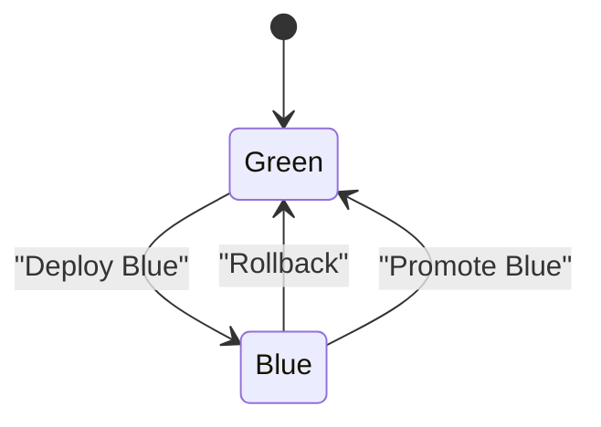

**Diagram sources**
- [backend/src/app.js:1-200](file://backend/src/app.js#L1-L200)

**Section sources**
- [backend/src/app.js:1-200](file://backend/src/app.js#L1-L200)

### Scaling, Resource Optimization, and Cost Management
- Horizontal Scaling: Add backend instances behind a load balancer; ensure stateless design.
- Resource Limits: Set CPU/memory limits per container; autoscale based on metrics.
- Cost Controls: Right-size instances, use reserved capacity where applicable, and monitor spending.

[No sources needed since this section provides general guidance]

### Platform-Specific Deployment Guides

#### AWS Deployment Guide
- Compute: ECS or EKS for container orchestration; EC2 Auto Scaling groups for VM-based deployments.
- Storage: RDS for relational data, ElastiCache for Redis, S3 for media.
- Networking: ALB/NLB for load balancing, ACM for certificates, WAF for protection.
- CI/CD: CodePipeline/CodeBuild with CodeDeploy for blue-green deployments.
- Monitoring: CloudWatch for logs and metrics, X-Ray for tracing.

[No sources needed since this section provides general guidance]

#### Google Cloud Deployment Guide
- Compute: GKE for Kubernetes; Cloud Run for serverless containers.
- Storage: Cloud SQL for PostgreSQL, Memorystore for Redis, Cloud Storage for media.
- Networking: Cloud Load Balancing, Cloud CDN, Certificate Manager.
- CI/CD: Cloud Build and Cloud Deploy for blue-green.
- Monitoring: Cloud Monitoring and Cloud Logging.

[No sources needed since this section provides general guidance]

## Dependency Analysis
The backend depends on configuration modules, middleware, DTOs, constants, and utilities. Modules encapsulate business logic and integrate with external services. Frontend depends on platform-specific build configurations and manifests.

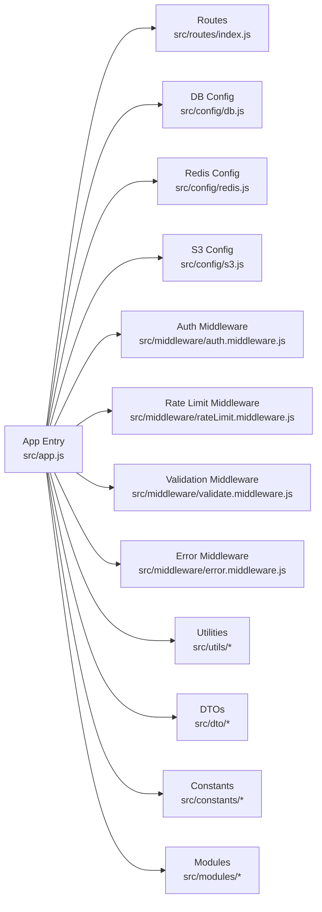

**Diagram sources**
- [backend/src/app.js:1-200](file://backend/src/app.js#L1-L200)
- [backend/src/routes/index.js:1-200](file://backend/src/routes/index.js#L1-L200)
- [backend/src/config/db.js:1-200](file://backend/src/config/db.js#L1-L200)
- [backend/src/config/redis.js:1-200](file://backend/src/config/redis.js#L1-L200)
- [backend/src/config/s3.js:1-200](file://backend/src/config/s3.js#L1-L200)
- [backend/src/middleware/auth.middleware.js:1-200](file://backend/src/middleware/auth.middleware.js#L1-L200)
- [backend/src/middleware/rateLimit.middleware.js:1-200](file://backend/src/middleware/rateLimit.middleware.js#L1-L200)
- [backend/src/middleware/validate.middleware.js:1-200](file://backend/src/middleware/validate.middleware.js#L1-L200)
- [backend/src/middleware/error.middleware.js:1-200](file://backend/src/middleware/error.middleware.js#L1-L200)
- [backend/src/utils/logger.js:1-200](file://backend/src/utils/logger.js#L1-L200)
- [backend/src/utils/helpers.js:1-200](file://backend/src/utils/helpers.js#L1-L200)
- [backend/src/utils/validation.js:1-200](file://backend/src/utils/validation.js#L1-L200)
- [backend/src/dto/user.dto.js:1-200](file://backend/src/dto/user.dto.js#L1-L200)
- [backend/src/dto/post.dto.js:1-200](file://backend/src/dto/post.dto.js#L1-L200)
- [backend/src/constants/errors.js:1-200](file://backend/src/constants/errors.js#L1-L200)
- [backend/src/constants/roles.js:1-200](file://backend/src/constants/roles.js#L1-L200)

**Section sources**
- [backend/src/app.js:1-200](file://backend/src/app.js#L1-L200)
- [backend/src/routes/index.js:1-200](file://backend/src/routes/index.js#L1-L200)
- [backend/src/config/db.js:1-200](file://backend/src/config/db.js#L1-L200)
- [backend/src/config/redis.js:1-200](file://backend/src/config/redis.js#L1-L200)
- [backend/src/config/s3.js:1-200](file://backend/src/config/s3.js#L1-L200)
- [backend/src/middleware/auth.middleware.js:1-200](file://backend/src/middleware/auth.middleware.js#L1-L200)
- [backend/src/middleware/rateLimit.middleware.js:1-200](file://backend/src/middleware/rateLimit.middleware.js#L1-L200)
- [backend/src/middleware/validate.middleware.js:1-200](file://backend/src/middleware/validate.middleware.js#L1-L200)
- [backend/src/middleware/error.middleware.js:1-200](file://backend/src/middleware/error.middleware.js#L1-L200)
- [backend/src/utils/logger.js:1-200](file://backend/src/utils/logger.js#L1-L200)
- [backend/src/utils/helpers.js:1-200](file://backend/src/utils/helpers.js#L1-L200)
- [backend/src/utils/validation.js:1-200](file://backend/src/utils/validation.js#L1-L200)
- [backend/src/dto/user.dto.js:1-200](file://backend/src/dto/user.dto.js#L1-L200)
- [backend/src/dto/post.dto.js:1-200](file://backend/src/dto/post.dto.js#L1-L200)
- [backend/src/constants/errors.js:1-200](file://backend/src/constants/errors.js#L1-L200)
- [backend/src/constants/roles.js:1-200](file://backend/src/constants/roles.js#L1-L200)

## Performance Considerations
- Optimize database queries and indexing; use connection pooling.
- Enable Redis caching for hot data; configure appropriate TTLs.
- Compress responses and leverage CDN for static assets.
- Monitor memory and CPU usage; set autoscaling thresholds.
- Minimize cold starts for serverless deployments.

[No sources needed since this section provides general guidance]

## Troubleshooting Guide
- Health Check Failures: Verify reverse proxy configuration and backend readiness.
- Database Connectivity: Confirm environment variables and network ACLs.
- Redis Issues: Check cluster health and credentials.
- S3 Upload Failures: Validate IAM permissions and bucket policies.
- Frontend Build Errors: Review platform-specific build logs and manifest entries.

**Section sources**
- [backend/src/app.js:1-200](file://backend/src/app.js#L1-L200)
- [backend/src/config/db.js:1-200](file://backend/src/config/db.js#L1-L200)
- [backend/src/config/redis.js:1-200](file://backend/src/config/redis.js#L1-L200)
- [backend/src/config/s3.js:1-200](file://backend/src/config/s3.js#L1-L200)
- [frontend/web/index.html:1-39](file://frontend/web/index.html#L1-L39)
- [frontend/android/app/src/main/AndroidManifest.xml:1-200](file://frontend/android/app/src/main/AndroidManifest.xml#L1-L200)
- [frontend/ios/Runner/Info.plist:1-200](file://frontend/ios/Runner/Info.plist#L1-L200)
- [frontend/macos/Runner/Info.plist:1-200](file://frontend/macos/Runner/Info.plist#L1-L200)

## Conclusion
This guide outlines a robust deployment strategy for the social media application across web, mobile, and desktop platforms, with backend cloud deployment, containerization, CI/CD, environment management, database migrations, reverse proxy and SSL, load balancing, monitoring and alerting, and zero-downtime deployment practices. Adopt platform-specific services on AWS and Google Cloud to optimize reliability, scalability, and cost-efficiency.

[No sources needed since this section summarizes without analyzing specific files]

## Appendices
- Dockerfile template: Build a minimal image, copy runtime dependencies, set working directory, expose port, and define entrypoint.
- Kubernetes manifests: Define Deployments, Services, ConfigMaps, and Secrets for backend services.
- Terraform templates: Provision infrastructure components for databases, caches, and storage on AWS/GCP.
- CI/CD pipeline YAML: Define stages for build, test, scan, package, deploy, and post-deploy verification.

[No sources needed since this section provides general guidance]