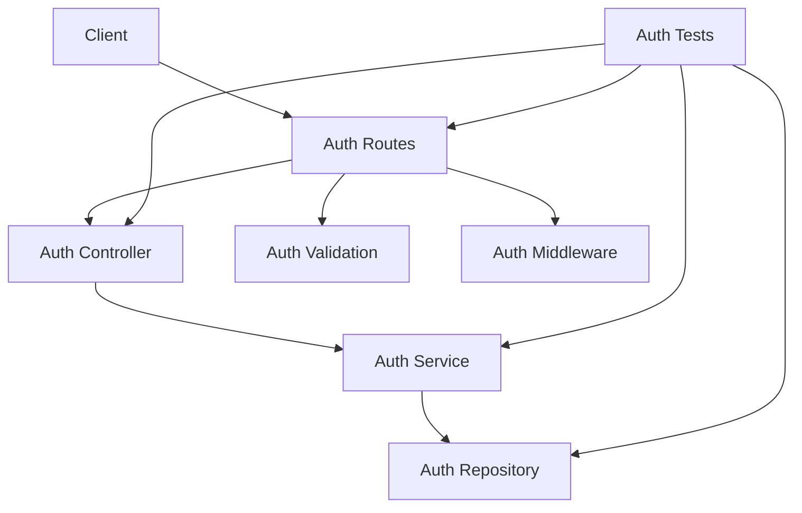
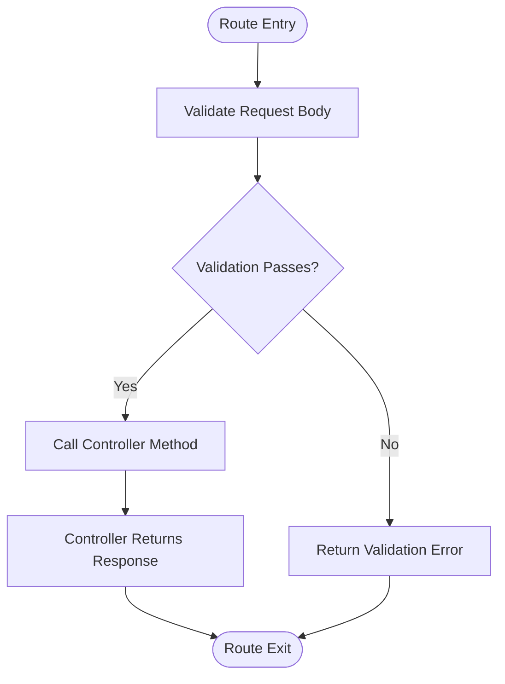
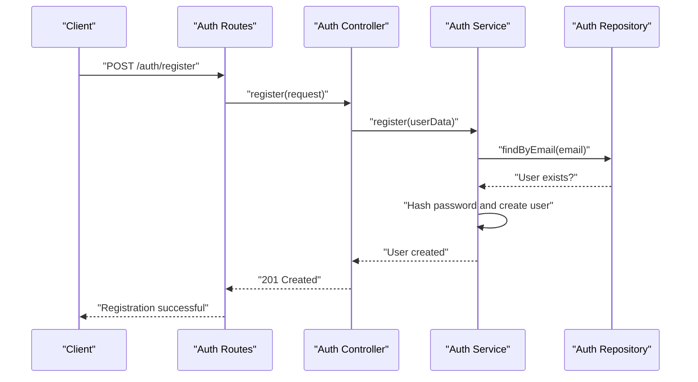
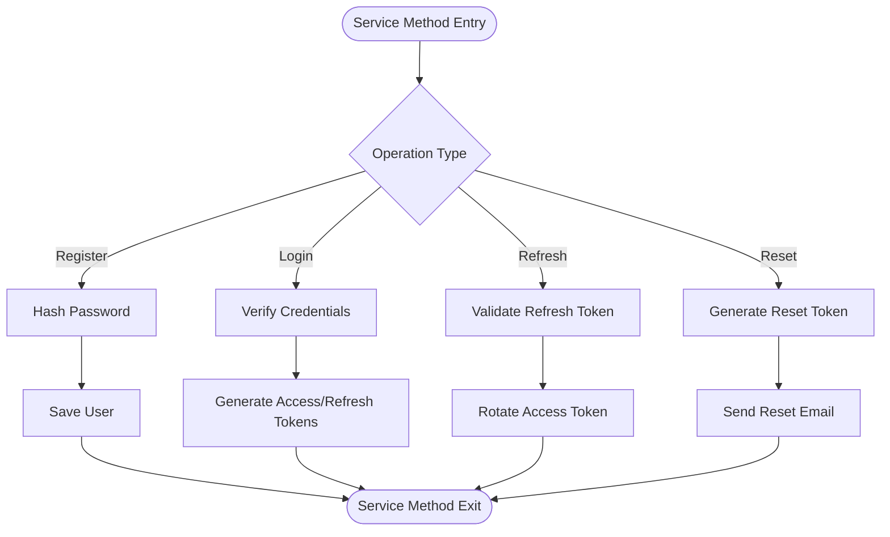
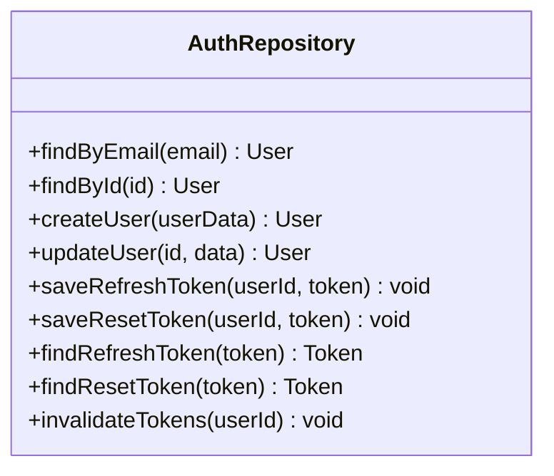
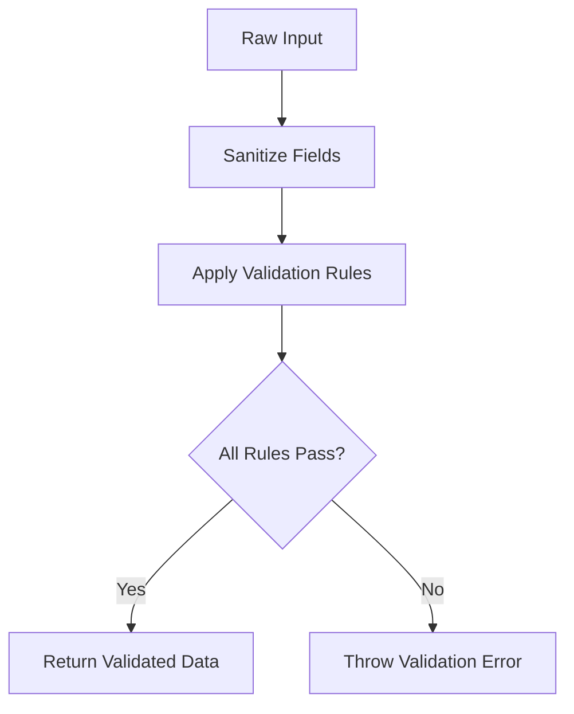
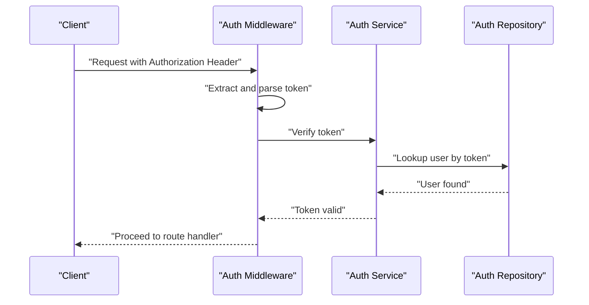
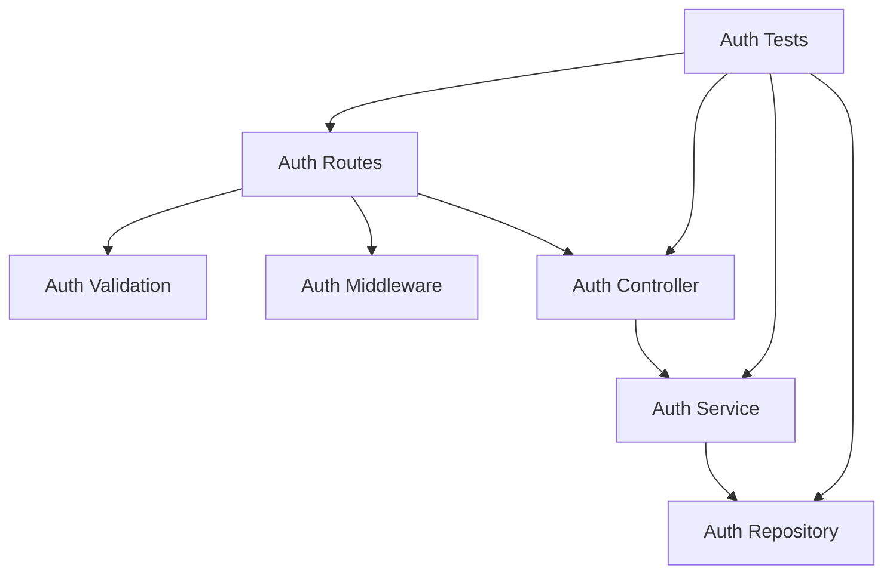

# Authentication System

<cite>
**Referenced Files in This Document**
- [auth.controller.js](file://backend/src/modules/auth/auth.controller.js)
- [auth.service.js](file://backend/src/modules/auth/auth.service.js)
- [auth.repository.js](file://backend/src/modules/auth/auth.repository.js)
- [auth.routes.js](file://backend/src/modules/auth/auth.routes.js)
- [auth.validation.js](file://backend/src/modules/auth/auth.validation.js)
- [auth.middleware.js](file://backend/src/middleware/auth.middleware.js)
- [auth.test.js](file://backend/tests/auth.test.js)
</cite>

## Table of Contents
1. [Introduction](#introduction)
2. [Project Structure](#project-structure)
3. [Core Components](#core-components)
4. [Architecture Overview](#architecture-overview)
5. [Detailed Component Analysis](#detailed-component-analysis)
6. [Dependency Analysis](#dependency-analysis)
7. [Performance Considerations](#performance-considerations)
8. [Troubleshooting Guide](#troubleshooting-guide)
9. [Conclusion](#conclusion)

## Introduction
This document provides comprehensive documentation for the authentication system of the social media application. It covers user registration, login/logout processes, password reset functionality, and session management. It also documents JWT token handling, refresh token rotation, security measures, authentication middleware, role-based access control, and permission systems. Implementation examples for both frontend and backend components are included, along with error handling and security best practices.

## Project Structure
The authentication system is organized into modular components within the backend:
- Routes define the HTTP endpoints for authentication operations.
- Controllers handle incoming requests and orchestrate service logic.
- Services encapsulate business logic and coordinate with repositories.
- Repositories manage data access and persistence.
- Validation enforces input constraints and sanitization.
- Middleware secures routes and manages session/state.
- Tests validate authentication flows and security measures.

```mermaid
graph TB
Routes["Auth Routes<br/>auth.routes.js"] --> Controller["Auth Controller<br/>auth.controller.js"]
Controller --> Service["Auth Service<br/>auth.service.js"]
Service --> Repository["Auth Repository<br/>auth.repository.js"]
Routes --> Validation["Auth Validation<br/>auth.validation.js"]
Routes --> Middleware["Auth Middleware<br/>auth.middleware.js"]
Tests["Auth Tests<br/>auth.test.js"] --> Routes
Tests --> Controller
Tests --> Service
Tests --> Repository
```

**Diagram sources**
- [auth.routes.js:1-1](file://backend/src/modules/auth/auth.routes.js#L1-L1)
- [auth.controller.js:1-1](file://backend/src/modules/auth/auth.controller.js#L1-L1)
- [auth.service.js:1-1](file://backend/src/modules/auth/auth.service.js#L1-L1)
- [auth.repository.js:1-1](file://backend/src/modules/auth/auth.repository.js#L1-L1)
- [auth.validation.js:1-1](file://backend/src/modules/auth/auth.validation.js#L1-L1)
- [auth.middleware.js](file://backend/src/middleware/auth.middleware.js)
- [auth.test.js:1-1](file://backend/tests/auth.test.js#L1-L1)

**Section sources**
- [auth.routes.js:1-1](file://backend/src/modules/auth/auth.routes.js#L1-L1)
- [auth.controller.js:1-1](file://backend/src/modules/auth/auth.controller.js#L1-L1)
- [auth.service.js:1-1](file://backend/src/modules/auth/auth.service.js#L1-L1)
- [auth.repository.js:1-1](file://backend/src/modules/auth/auth.repository.js#L1-L1)
- [auth.validation.js:1-1](file://backend/src/modules/auth/auth.validation.js#L1-L1)
- [auth.middleware.js](file://backend/src/middleware/auth.middleware.js)
- [auth.test.js:1-1](file://backend/tests/auth.test.js#L1-L1)

## Core Components
- Auth Routes: Define endpoints for registration, login, logout, password reset, and protected routes.
- Auth Controller: Coordinates request handling, invokes service methods, and returns standardized responses.
- Auth Service: Implements core authentication logic, including JWT creation, refresh token rotation, and password operations.
- Auth Repository: Manages user data operations, including user lookup, updates, and token storage.
- Auth Validation: Enforces input validation and sanitization for all authentication requests.
- Auth Middleware: Secures routes, validates tokens, and manages session state.
- Auth Tests: Validate authentication flows, error handling, and security measures.

**Section sources**
- [auth.routes.js:1-1](file://backend/src/modules/auth/auth.routes.js#L1-L1)
- [auth.controller.js:1-1](file://backend/src/modules/auth/auth.controller.js#L1-L1)
- [auth.service.js:1-1](file://backend/src/modules/auth/auth.service.js#L1-L1)
- [auth.repository.js:1-1](file://backend/src/modules/auth/auth.repository.js#L1-L1)
- [auth.validation.js:1-1](file://backend/src/modules/auth/auth.validation.js#L1-L1)
- [auth.middleware.js](file://backend/src/middleware/auth.middleware.js)
- [auth.test.js:1-1](file://backend/tests/auth.test.js#L1-L1)

## Architecture Overview
The authentication system follows a layered architecture:
- Presentation Layer: Routes expose endpoints for client interactions.
- Application Layer: Controller orchestrates request/response handling.
- Domain Layer: Service implements business logic and security policies.
- Data Access Layer: Repository handles persistence and retrieval.
- Security Layer: Middleware enforces authentication and authorization checks.

**Diagram sources**
- [auth.routes.js:1-1](file://backend/src/modules/auth/auth.routes.js#L1-L1)
- [auth.controller.js:1-1](file://backend/src/modules/auth/auth.controller.js#L1-L1)
- [auth.service.js:1-1](file://backend/src/modules/auth/auth.service.js#L1-L1)
- [auth.repository.js:1-1](file://backend/src/modules/auth/auth.repository.js#L1-L1)
- [auth.validation.js:1-1](file://backend/src/modules/auth/auth.validation.js#L1-L1)
- [auth.middleware.js](file://backend/src/middleware/auth.middleware.js)
- [auth.test.js:1-1](file://backend/tests/auth.test.js#L1-L1)

## Detailed Component Analysis

### Auth Routes
Auth routes define the HTTP endpoints for authentication operations:
- Registration endpoint: Validates input, creates a new user, and returns appropriate response.
- Login endpoint: Verifies credentials, generates access/refresh tokens, and manages session.
- Logout endpoint: Invalidates tokens and clears session state.
- Password reset endpoint: Initiates reset process and validates reset tokens.
- Protected routes: Require valid authentication and optional authorization checks.

**Diagram sources**
- [auth.routes.js:1-1](file://backend/src/modules/auth/auth.routes.js#L1-L1)
- [auth.validation.js:1-1](file://backend/src/modules/auth/auth.validation.js#L1-L1)

**Section sources**
- [auth.routes.js:1-1](file://backend/src/modules/auth/auth.routes.js#L1-L1)
- [auth.validation.js:1-1](file://backend/src/modules/auth/auth.validation.js#L1-L1)

### Auth Controller
The controller coordinates request handling:
- Delegates validation to the validation module.
- Invokes service methods for business logic.
- Handles errors and returns standardized responses.
- Manages response formatting and status codes.

**Diagram sources**
- [auth.controller.js:1-1](file://backend/src/modules/auth/auth.controller.js#L1-L1)
- [auth.service.js:1-1](file://backend/src/modules/auth/auth.service.js#L1-L1)
- [auth.repository.js:1-1](file://backend/src/modules/auth/auth.repository.js#L1-L1)

**Section sources**
- [auth.controller.js:1-1](file://backend/src/modules/auth/auth.controller.js#L1-L1)
- [auth.service.js:1-1](file://backend/src/modules/auth/auth.service.js#L1-L1)
- [auth.repository.js:1-1](file://backend/src/modules/auth/auth.repository.js#L1-L1)

### Auth Service
The service implements core authentication logic:
- User registration: Hashes passwords, prevents duplicates, and persists user data.
- User login: Verifies credentials, generates JWT access tokens, and refresh tokens.
- Refresh token rotation: Issues new access tokens using valid refresh tokens.
- Password reset: Generates reset tokens, sends emails, and updates passwords securely.
- Session management: Tracks active sessions and invalidates tokens on logout.

**Diagram sources**
- [auth.service.js:1-1](file://backend/src/modules/auth/auth.service.js#L1-L1)
- [auth.repository.js:1-1](file://backend/src/modules/auth/auth.repository.js#L1-L1)

**Section sources**
- [auth.service.js:1-1](file://backend/src/modules/auth/auth.service.js#L1-L1)
- [auth.repository.js:1-1](file://backend/src/modules/auth/auth.repository.js#L1-L1)

### Auth Repository
The repository manages data access:
- User lookup by email or ID.
- User creation and updates.
- Token storage and retrieval for refresh and reset tokens.
- Session tracking and invalidation.

**Diagram sources**
- [auth.repository.js:1-1](file://backend/src/modules/auth/auth.repository.js#L1-L1)

**Section sources**
- [auth.repository.js:1-1](file://backend/src/modules/auth/auth.repository.js#L1-L1)

### Auth Validation
Validation ensures secure and consistent input:
- Registration: Validates email uniqueness, password strength, and required fields.
- Login: Ensures email and password presence.
- Password reset: Validates email format and triggers reset workflow.
- Refresh: Confirms refresh token presence and validity.

**Diagram sources**
- [auth.validation.js:1-1](file://backend/src/modules/auth/auth.validation.js#L1-L1)

**Section sources**
- [auth.validation.js:1-1](file://backend/src/modules/auth/auth.validation.js#L1-L1)

### Auth Middleware
Middleware secures routes and manages session state:
- Authentication: Extracts tokens from headers, verifies JWT, and attaches user context.
- Authorization: Checks roles/permissions for protected routes.
- Session persistence: Maintains session state across requests.
- Error handling: Returns appropriate errors for invalid or missing tokens.

**Diagram sources**
- [auth.middleware.js](file://backend/src/middleware/auth.middleware.js)
- [auth.service.js:1-1](file://backend/src/modules/auth/auth.service.js#L1-L1)
- [auth.repository.js:1-1](file://backend/src/modules/auth/auth.repository.js#L1-L1)

**Section sources**
- [auth.middleware.js](file://backend/src/middleware/auth.middleware.js)
- [auth.service.js:1-1](file://backend/src/modules/auth/auth.service.js#L1-L1)
- [auth.repository.js:1-1](file://backend/src/modules/auth/auth.repository.js#L1-L1)

### Frontend Authentication State Management
Frontend components manage authentication state and protected route handling:
- Authentication state: Stores user data, tokens, and session status.
- Protected route handling: Redirects unauthenticated users and blocks unauthorized access.
- User session persistence: Persists tokens across browser sessions and app restarts.
- Error handling: Displays meaningful messages for authentication failures.

Implementation examples:
- Store tokens in secure storage and attach them to API requests.
- Redirect to login page when tokens expire or are invalid.
- Persist user session using encrypted storage mechanisms.

Security best practices:
- Use secure, httpOnly cookies for tokens when applicable.
- Implement token refresh logic to minimize exposure.
- Clear tokens on logout and handle token expiration gracefully.

### OAuth Integration
OAuth integration enables third-party authentication:
- Provider configuration: Configure OAuth providers (Google, Facebook, etc.).
- Authorization flow: Redirect users to provider for consent.
- Token exchange: Exchange authorization code for access/refresh tokens.
- User synchronization: Map provider profiles to local user accounts.

### Email Verification and Account Activation
Email verification and account activation workflows:
- Verification token generation: Create unique tokens for email verification.
- Email delivery: Send verification emails with secure links.
- Token validation: Verify tokens and activate user accounts.
- Resend verification: Allow users to request new verification emails.

### Role-Based Access Control (RBAC) and Permissions
RBAC and permissions:
- Role assignment: Assign roles (user, admin) during registration or via admin actions.
- Permission checks: Enforce permissions for sensitive operations.
- Route guards: Protect routes based on roles and permissions.
- Dynamic permissions: Support dynamic permission updates and revocation.

## Dependency Analysis
Authentication components depend on each other in a layered manner:
- Routes depend on Validation and Middleware.
- Controller depends on Service.
- Service depends on Repository.
- Tests depend on all components.

**Diagram sources**
- [auth.routes.js:1-1](file://backend/src/modules/auth/auth.routes.js#L1-L1)
- [auth.validation.js:1-1](file://backend/src/modules/auth/auth.validation.js#L1-L1)
- [auth.middleware.js](file://backend/src/middleware/auth.middleware.js)
- [auth.controller.js:1-1](file://backend/src/modules/auth/auth.controller.js#L1-L1)
- [auth.service.js:1-1](file://backend/src/modules/auth/auth.service.js#L1-L1)
- [auth.repository.js:1-1](file://backend/src/modules/auth/auth.repository.js#L1-L1)
- [auth.test.js:1-1](file://backend/tests/auth.test.js#L1-L1)

**Section sources**
- [auth.routes.js:1-1](file://backend/src/modules/auth/auth.routes.js#L1-L1)
- [auth.validation.js:1-1](file://backend/src/modules/auth/auth.validation.js#L1-L1)
- [auth.middleware.js](file://backend/src/middleware/auth.middleware.js)
- [auth.controller.js:1-1](file://backend/src/modules/auth/auth.controller.js#L1-L1)
- [auth.service.js:1-1](file://backend/src/modules/auth/auth.service.js#L1-L1)
- [auth.repository.js:1-1](file://backend/src/modules/auth/auth.repository.js#L1-L1)
- [auth.test.js:1-1](file://backend/tests/auth.test.js#L1-L1)

## Performance Considerations
- Token generation and verification should be optimized to minimize latency.
- Use efficient hashing algorithms for passwords and tokens.
- Implement caching for frequently accessed user data.
- Batch database operations where possible to reduce round trips.
- Monitor and log authentication metrics for performance insights.

## Troubleshooting Guide
Common issues and resolutions:
- Invalid or expired tokens: Implement token refresh and re-authentication flows.
- Duplicate registrations: Enforce unique email constraints and handle conflicts gracefully.
- Password reset failures: Validate reset tokens and ensure secure email delivery.
- Middleware errors: Verify token extraction and parsing logic.
- Test failures: Mock external dependencies and isolate unit tests.

**Section sources**
- [auth.test.js:1-1](file://backend/tests/auth.test.js#L1-L1)
- [auth.middleware.js](file://backend/src/middleware/auth.middleware.js)
- [auth.validation.js:1-1](file://backend/src/modules/auth/auth.validation.js#L1-L1)

## Conclusion
The authentication system provides a robust foundation for user registration, login/logout, password reset, and session management. It incorporates JWT token handling, refresh token rotation, and security measures while supporting role-based access control and permission systems. The modular architecture ensures maintainability and scalability, with clear separation of concerns across routes, controllers, services, repositories, validation, middleware, and tests. By following the implementation examples and security best practices outlined in this document, developers can confidently extend and enhance the authentication system.