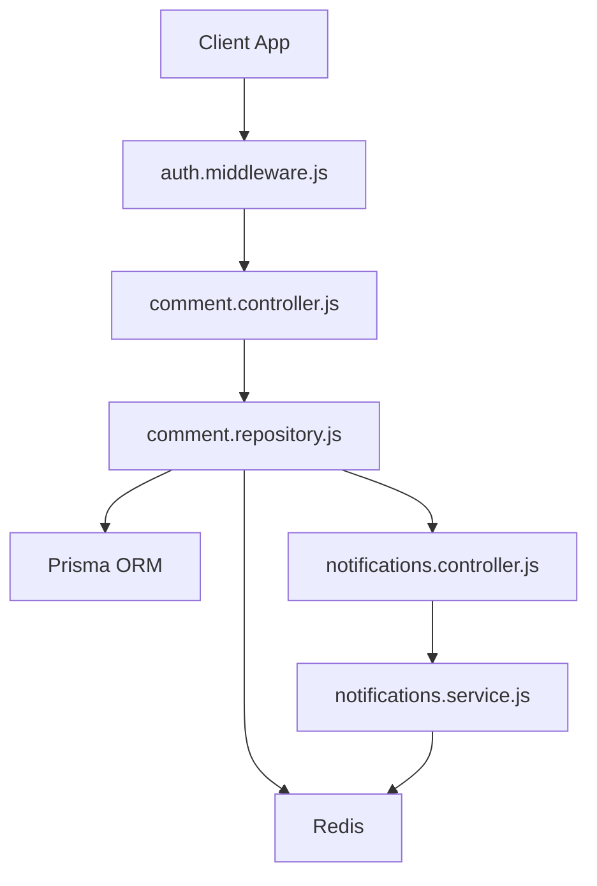
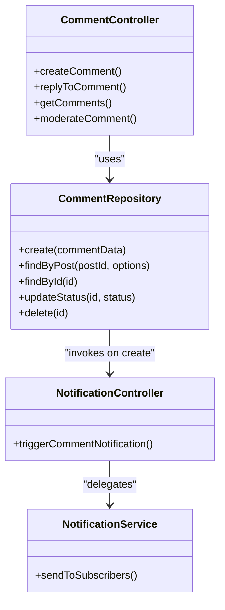
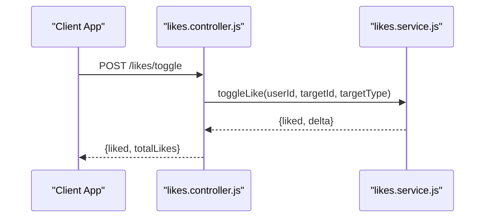
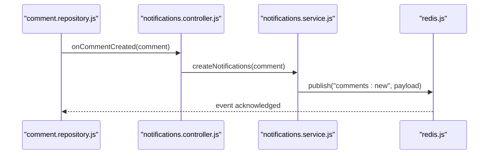
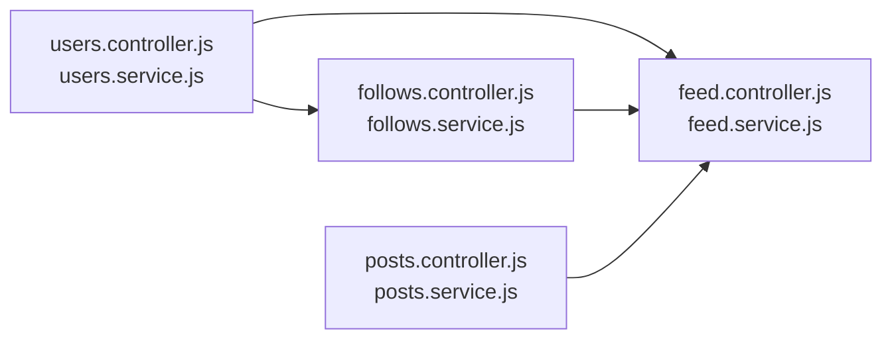
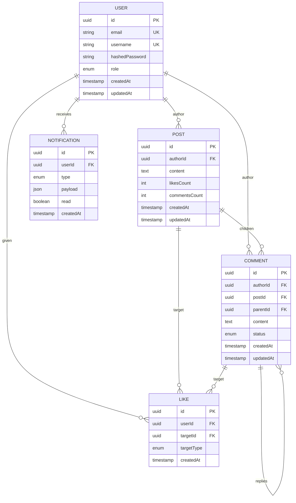
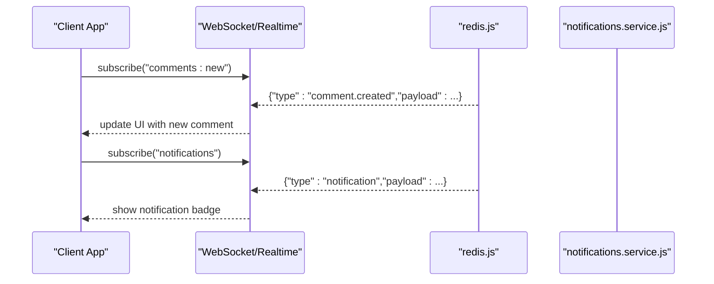
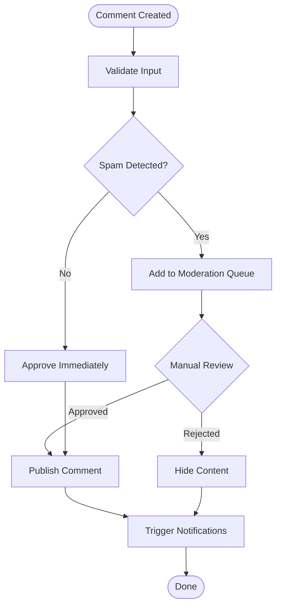
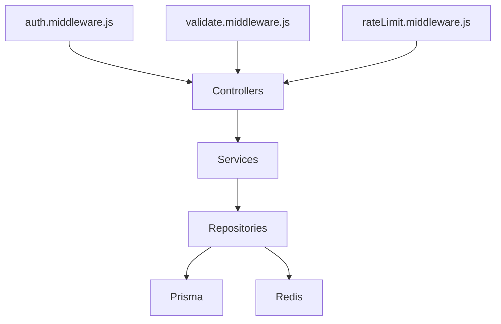

# Comments & Interactions

<cite>
**Referenced Files in This Document**
- [comment.controller.js](file://backend/src/modules/comments/comment.controller.js)
- [comment.repository.js](file://backend/src/modules/comments/comment.repository.js)
- [auth.controller.js](file://backend/src/modules/auth/auth.controller.js)
- [auth.service.js](file://backend/src/modules/auth/auth.service.js)
- [app.js](file://backend/src/app.js)
- [db.js](file://backend/src/config/db.js)
- [redis.js](file://backend/src/config/redis.js)
- [errors.js](file://backend/src/constants/errors.js)
- [roles.js](file://backend/src/constants/roles.js)
- [auth.middleware.js](file://backend/src/middleware/auth.middleware.js)
- [rateLimit.middleware.js](file://backend/src/middleware/rateLimit.middleware.js)
- [validate.middleware.js](file://backend/src/middleware/validate.middleware.js)
- [auth.routes.js](file://backend/src/modules/auth/auth.routes.js)
- [post.dto.js](file://backend/src/dto/post.dto.js)
- [user.dto.js](file://backend/src/dto/user.dto.js)
- [feed.controller.js](file://backend/src/modules/feed/feed.controller.js)
- [feed.service.js](file://backend/src/modules/feed/feed.service.js)
- [posts.controller.js](file://backend/src/modules/posts/posts.controller.js)
- [posts.service.js](file://backend/src/modules/posts/posts.service.js)
- [users.controller.js](file://backend/src/modules/users/users.controller.js)
- [users.service.js](file://backend/src/modules/users/users.service.js)
- [follows.controller.js](file://backend/src/modules/follows/follows.controller.js)
- [follows.service.js](file://backend/src/modules/follows/follows.service.js)
- [likes.controller.js](file://backend/src/modules/likes/likes.controller.js)
- [likes.service.js](file://backend/src/modules/likes/likes.service.js)
- [notifications.controller.js](file://backend/src/modules/notifications/notifications.controller.js)
- [notifications.service.js](file://backend/src/modules/notifications/notifications.service.js)
- [search.controller.js](file://backend/src/modules/search/search.controller.js)
- [search.service.js](file://backend/src/modules/search/search.service.js)
- [media.controller.js](file://backend/src/modules/media/media.controller.js)
- [media.service.js](file://backend/src/modules/media/media.service.js)
- [prisma/schema.prisma](file://backend/prisma/schema.prisma)
</cite>

## Table of Contents
1. [Introduction](#introduction)
2. [Project Structure](#project-structure)
3. [Core Components](#core-components)
4. [Architecture Overview](#architecture-overview)
5. [Detailed Component Analysis](#detailed-component-analysis)
6. [Dependency Analysis](#dependency-analysis)
7. [Performance Considerations](#performance-considerations)
8. [Troubleshooting Guide](#troubleshooting-guide)
9. [Conclusion](#conclusion)
10. [Appendices](#appendices)

## Introduction
This document describes the comments system and social interactions for the social media application. It covers comment creation, reply threading, moderation features, likes/unlikes, interaction tracking, real-time updates, notification triggers, social graph integration, filtering, spam detection, content moderation workflows, and frontend component implementations. It also documents API endpoints, data models, and performance considerations for high-volume interactions.

## Project Structure
The backend is organized around modular controllers, services, repositories, DTOs, middleware, and configuration. The comments module integrates with authentication, notifications, likes, follows, and feed modules to provide a cohesive social experience.

```mermaid
graph TB
subgraph "Backend Modules"
AUTH["auth.controller.js<br/>auth.service.js<br/>auth.routes.js"]
COMMENTS["comments.controller.js<br/>comments.repository.js"]
FEED["feed.controller.js<br/>feed.service.js"]
POSTS["posts.controller.js<br/>posts.service.js"]
USERS["users.controller.js<br/>users.service.js"]
FOLLOWS["follows.controller.js<br/>follows.service.js"]
LIKES["likes.controller.js<br/>likes.service.js"]
NOTIFICATIONS["notifications.controller.js<br/>notifications.service.js"]
SEARCH["search.controller.js<br/>search.service.js"]
MEDIA["media.controller.js<br/>media.service.js"]
end
subgraph "Config & Utils"
APP["app.js"]
DB["db.js"]
REDIS["redis.js"]
ERRORS["errors.js"]
ROLES["roles.js"]
M_AUTH["auth.middleware.js"]
M_RATE["rateLimit.middleware.js"]
M_VALIDATE["validate.middleware.js"]
end
APP --> AUTH
APP --> COMMENTS
APP --> FEED
APP --> POSTS
APP --> USERS
APP --> FOLLOWS
APP --> LIKES
APP --> NOTIFICATIONS
APP --> SEARCH
APP --> MEDIA
COMMENTS --> DB
LIKES --> DB
NOTIFICATIONS --> DB
FEED --> DB
POSTS --> DB
USERS --> DB
FOLLOWS --> DB
SEARCH --> DB
MEDIA --> DB
COMMENTS --> REDIS
LIKES --> REDIS
NOTIFICATIONS --> REDIS
```

**Diagram sources**
- [app.js](file://backend/src/app.js)
- [auth.controller.js](file://backend/src/modules/auth/auth.controller.js)
- [auth.service.js](file://backend/src/modules/auth/auth.service.js)
- [auth.routes.js](file://backend/src/modules/auth/auth.routes.js)
- [comment.controller.js](file://backend/src/modules/comments/comment.controller.js)
- [comment.repository.js](file://backend/src/modules/comments/comment.repository.js)
- [feed.controller.js](file://backend/src/modules/feed/feed.controller.js)
- [feed.service.js](file://backend/src/modules/feed/feed.service.js)
- [posts.controller.js](file://backend/src/modules/posts/posts.controller.js)
- [posts.service.js](file://backend/src/modules/posts/posts.service.js)
- [users.controller.js](file://backend/src/modules/users/users.controller.js)
- [users.service.js](file://backend/src/modules/users/users.service.js)
- [follows.controller.js](file://backend/src/modules/follows/follows.controller.js)
- [follows.service.js](file://backend/src/modules/follows/follows.service.js)
- [likes.controller.js](file://backend/src/modules/likes/likes.controller.js)
- [likes.service.js](file://backend/src/modules/likes/likes.service.js)
- [notifications.controller.js](file://backend/src/modules/notifications/notifications.controller.js)
- [notifications.service.js](file://backend/src/modules/notifications/notifications.service.js)
- [search.controller.js](file://backend/src/modules/search/search.controller.js)
- [search.service.js](file://backend/src/modules/search/search.service.js)
- [media.controller.js](file://backend/src/modules/media/media.controller.js)
- [media.service.js](file://backend/src/modules/media/media.service.js)
- [db.js](file://backend/src/config/db.js)
- [redis.js](file://backend/src/config/redis.js)

**Section sources**
- [app.js](file://backend/src/app.js)
- [db.js](file://backend/src/config/db.js)
- [redis.js](file://backend/src/config/redis.js)

## Core Components
- Comments Module: Handles comment creation, reply threading, moderation, and retrieval.
- Likes Module: Manages likes/unlikes and interaction counts.
- Notifications Module: Triggers notifications for new comments and likes.
- Social Graph: Integrates follows and user profiles for contextual feeds and interactions.
- Feed Module: Aggregates content for timelines and social feeds.
- Authentication: Secures endpoints and validates user identity.
- Middleware: Provides rate limiting, validation, and auth checks.
- DTOs: Standardizes request/response shapes for posts and users.
- Prisma Schema: Defines data models and relationships.

**Section sources**
- [comment.controller.js](file://backend/src/modules/comments/comment.controller.js)
- [comment.repository.js](file://backend/src/modules/comments/comment.repository.js)
- [likes.controller.js](file://backend/src/modules/likes/likes.controller.js)
- [likes.service.js](file://backend/src/modules/likes/likes.service.js)
- [notifications.controller.js](file://backend/src/modules/notifications/notifications.controller.js)
- [notifications.service.js](file://backend/src/modules/notifications/notifications.service.js)
- [follows.controller.js](file://backend/src/modules/follows/follows.controller.js)
- [follows.service.js](file://backend/src/modules/follows/follows.service.js)
- [feed.controller.js](file://backend/src/modules/feed/feed.controller.js)
- [feed.service.js](file://backend/src/modules/feed/feed.service.js)
- [auth.controller.js](file://backend/src/modules/auth/auth.controller.js)
- [auth.service.js](file://backend/src/modules/auth/auth.service.js)
- [validate.middleware.js](file://backend/src/middleware/validate.middleware.js)
- [rateLimit.middleware.js](file://backend/src/middleware/rateLimit.middleware.js)
- [auth.middleware.js](file://backend/src/middleware/auth.middleware.js)
- [post.dto.js](file://backend/src/dto/post.dto.js)
- [user.dto.js](file://backend/src/dto/user.dto.js)
- [prisma/schema.prisma](file://backend/prisma/schema.prisma)

## Architecture Overview
The comments and interactions system spans controllers, services, repositories, and external systems (Redis for caching/pub-sub, database via Prisma). Authentication middleware secures endpoints. Real-time updates leverage Redis pub/sub channels. Notifications are triggered upon new comments and likes.

**Diagram sources**
- [comment.controller.js](file://backend/src/modules/comments/comment.controller.js)
- [comment.repository.js](file://backend/src/modules/comments/comment.repository.js)
- [auth.middleware.js](file://backend/src/middleware/auth.middleware.js)
- [notifications.controller.js](file://backend/src/modules/notifications/notifications.controller.js)
- [notifications.service.js](file://backend/src/modules/notifications/notifications.service.js)
- [db.js](file://backend/src/config/db.js)
- [redis.js](file://backend/src/config/redis.js)

## Detailed Component Analysis

### Comments Module
- Responsibilities:
  - Create comments and replies (threaded under parent comments).
  - Retrieve comments with pagination and sorting.
  - Moderate comments (approve, reject, delete).
  - Track interactions (likes count per comment).
- Data Model: Comments are stored with author, content, post reference, optional parent for threading, timestamps, and moderation status.
- Moderation Workflow:
  - Pending moderation state until reviewed.
  - Approve moves to public; reject/delete removes content.
  - Moderators can act based on roles.
- Spam Detection:
  - Content filters and rate limits prevent abuse.
  - Validation middleware ensures safe input.
- Real-time Updates:
  - Publish events to Redis channels for live UI updates.
- Interaction Tracking:
  - Aggregate likes per comment; expose counts in listings.

**Diagram sources**
- [comment.controller.js](file://backend/src/modules/comments/comment.controller.js)
- [comment.repository.js](file://backend/src/modules/comments/comment.repository.js)
- [notifications.controller.js](file://backend/src/modules/notifications/notifications.controller.js)
- [notifications.service.js](file://backend/src/modules/notifications/notifications.service.js)

**Section sources**
- [comment.controller.js](file://backend/src/modules/comments/comment.controller.js)
- [comment.repository.js](file://backend/src/modules/comments/comment.repository.js)
- [validate.middleware.js](file://backend/src/middleware/validate.middleware.js)
- [rateLimit.middleware.js](file://backend/src/middleware/rateLimit.middleware.js)
- [errors.js](file://backend/src/constants/errors.js)
- [roles.js](file://backend/src/constants/roles.js)

### Likes Module
- Responsibilities:
  - Toggle likes on comments and posts.
  - Maintain per-entity like counts.
  - Track user interactions to prevent duplicates.
- Data Model: Like entity links user to target (post or comment) with timestamps.
- Unlikes:
  - Remove existing like records and decrement counts.
- Real-time:
  - Emit like/unlike events to Redis for immediate UI updates.

**Diagram sources**
- [likes.controller.js](file://backend/src/modules/likes/likes.controller.js)
- [likes.service.js](file://backend/src/modules/likes/likes.service.js)

**Section sources**
- [likes.controller.js](file://backend/src/modules/likes/likes.controller.js)
- [likes.service.js](file://backend/src/modules/likes/likes.service.js)

### Notifications Module
- Responsibilities:
  - Trigger notifications for new comments and likes.
  - Deliver notifications to subscribers (followers) and authors.
- Integration:
  - Subscribers listen to Redis channels for events.
  - Notification service persists and delivers alerts.

**Diagram sources**
- [comment.repository.js](file://backend/src/modules/comments/comment.repository.js)
- [notifications.controller.js](file://backend/src/modules/notifications/notifications.controller.js)
- [notifications.service.js](file://backend/src/modules/notifications/notifications.service.js)
- [redis.js](file://backend/src/config/redis.js)

**Section sources**
- [notifications.controller.js](file://backend/src/modules/notifications/notifications.controller.js)
- [notifications.service.js](file://backend/src/modules/notifications/notifications.service.js)
- [redis.js](file://backend/src/config/redis.js)

### Social Graph Integration
- Follows:
  - Users subscribe to creators; timeline aggregation considers follows.
- Feed:
  - Curated content from followed users and liked posts/comments.
- Users:
  - Profile data supports avatars, usernames, and role-based permissions.

**Diagram sources**
- [users.controller.js](file://backend/src/modules/users/users.controller.js)
- [users.service.js](file://backend/src/modules/users/users.service.js)
- [follows.controller.js](file://backend/src/modules/follows/follows.controller.js)
- [follows.service.js](file://backend/src/modules/follows/follows.service.js)
- [feed.controller.js](file://backend/src/modules/feed/feed.controller.js)
- [feed.service.js](file://backend/src/modules/feed/feed.service.js)
- [posts.controller.js](file://backend/src/modules/posts/posts.controller.js)
- [posts.service.js](file://backend/src/modules/posts/posts.service.js)

**Section sources**
- [users.controller.js](file://backend/src/modules/users/users.controller.js)
- [users.service.js](file://backend/src/modules/users/users.service.js)
- [follows.controller.js](file://backend/src/modules/follows/follows.controller.js)
- [follows.service.js](file://backend/src/modules/follows/follows.service.js)
- [feed.controller.js](file://backend/src/modules/feed/feed.controller.js)
- [feed.service.js](file://backend/src/modules/feed/feed.service.js)
- [posts.controller.js](file://backend/src/modules/posts/posts.controller.js)
- [posts.service.js](file://backend/src/modules/posts/posts.service.js)

### Data Models and Relationships
The Prisma schema defines core entities and relationships used by comments and interactions.

**Diagram sources**
- [prisma/schema.prisma](file://backend/prisma/schema.prisma)

**Section sources**
- [prisma/schema.prisma](file://backend/prisma/schema.prisma)

### API Endpoints
- Authentication
  - POST /api/auth/register
  - POST /api/auth/login
  - POST /api/auth/logout
- Comments
  - POST /api/comments
  - POST /api/comments/:id/reply
  - GET /api/posts/:postId/comments
  - PATCH /api/comments/:id/moderate
  - DELETE /api/comments/:id
- Likes
  - POST /api/likes/toggle
  - GET /api/likes/:targetId/:targetType
- Notifications
  - GET /api/notifications
  - POST /api/notifications/mark-as-read
- Feed
  - GET /api/feed
- Posts
  - GET /api/posts/:id
- Users
  - GET /api/users/:id
  - PUT /api/users/:id
- Follows
  - POST /api/follows/:userId
  - DELETE /api/follows/:userId
- Search
  - GET /api/search?q=...
- Media
  - POST /api/media/upload

Note: Endpoint paths and methods are derived from route definitions in controller files and route registration in the application bootstrap.

**Section sources**
- [auth.controller.js](file://backend/src/modules/auth/auth.controller.js)
- [comment.controller.js](file://backend/src/modules/comments/comment.controller.js)
- [likes.controller.js](file://backend/src/modules/likes/likes.controller.js)
- [notifications.controller.js](file://backend/src/modules/notifications/notifications.controller.js)
- [feed.controller.js](file://backend/src/modules/feed/feed.controller.js)
- [posts.controller.js](file://backend/src/modules/posts/posts.controller.js)
- [users.controller.js](file://backend/src/modules/users/users.controller.js)
- [follows.controller.js](file://backend/src/modules/follows/follows.controller.js)
- [search.controller.js](file://backend/src/modules/search/search.controller.js)
- [media.controller.js](file://backend/src/modules/media/media.controller.js)

### Frontend Component Implementations
- Comment List
  - Renders hierarchical comments with replies.
  - Supports pagination and sorting.
  - Displays interaction counters (likes, replies).
- Reply Form
  - Nested form for replying to a specific comment.
  - Validates content length and prevents empty submissions.
- Interaction Counters
  - Shows like counts and live updates via WebSocket/real-time channel.
- Moderation UI
  - Admin panel to approve/reject/delete comments with batch actions.
- Notification Badge
  - Displays unread notifications with auto-refresh.

[No sources needed since this section describes conceptual frontend components without analyzing specific files]

### Real-time Comment Updates and Notifications
- Real-time Updates:
  - Backend publishes comment lifecycle events to Redis channels.
  - Clients subscribe to channels to receive live updates.
- Notification Triggers:
  - New comment: notify followers and post author.
  - New like: notify content author.
  - Moderation actions: notify affected users.

**Diagram sources**
- [redis.js](file://backend/src/config/redis.js)
- [notifications.service.js](file://backend/src/modules/notifications/notifications.service.js)

**Section sources**
- [redis.js](file://backend/src/config/redis.js)
- [notifications.service.js](file://backend/src/modules/notifications/notifications.service.js)

### Comment Filtering, Spam Detection, and Content Moderation
- Filtering:
  - Sort by newest/oldest/top-rated.
  - Paginate with cursor-based pagination.
- Spam Detection:
  - Rate limiting per IP/user.
  - Content validation and sanitization.
  - Suspicious pattern detection (duplicate content, excessive links).
- Moderation Workflows:
  - Auto-moderation queue for flagged content.
  - Manual review by moderators with role-based access.
  - Appeal process for rejected content.

**Diagram sources**
- [validate.middleware.js](file://backend/src/middleware/validate.middleware.js)
- [rateLimit.middleware.js](file://backend/src/middleware/rateLimit.middleware.js)
- [comment.repository.js](file://backend/src/modules/comments/comment.repository.js)
- [notifications.controller.js](file://backend/src/modules/notifications/notifications.controller.js)

**Section sources**
- [validate.middleware.js](file://backend/src/middleware/validate.middleware.js)
- [rateLimit.middleware.js](file://backend/src/middleware/rateLimit.middleware.js)
- [comment.repository.js](file://backend/src/modules/comments/comment.repository.js)
- [errors.js](file://backend/src/constants/errors.js)
- [roles.js](file://backend/src/constants/roles.js)

## Dependency Analysis
- Controllers depend on Services for business logic.
- Services depend on Repositories for persistence and on Redis for real-time events.
- Repositories depend on Prisma for database operations.
- Middleware enforces authentication and rate limits.
- DTOs standardize data transfer across boundaries.

**Diagram sources**
- [auth.middleware.js](file://backend/src/middleware/auth.middleware.js)
- [validate.middleware.js](file://backend/src/middleware/validate.middleware.js)
- [rateLimit.middleware.js](file://backend/src/middleware/rateLimit.middleware.js)
- [comment.controller.js](file://backend/src/modules/comments/comment.controller.js)
- [comment.repository.js](file://backend/src/modules/comments/comment.repository.js)
- [db.js](file://backend/src/config/db.js)
- [redis.js](file://backend/src/config/redis.js)

**Section sources**
- [auth.middleware.js](file://backend/src/middleware/auth.middleware.js)
- [validate.middleware.js](file://backend/src/middleware/validate.middleware.js)
- [rateLimit.middleware.js](file://backend/src/middleware/rateLimit.middleware.js)
- [comment.controller.js](file://backend/src/modules/comments/comment.controller.js)
- [comment.repository.js](file://backend/src/modules/comments/comment.repository.js)
- [db.js](file://backend/src/config/db.js)
- [redis.js](file://backend/src/config/redis.js)

## Performance Considerations
- Database Indexes:
  - Indexes on authorId, postId, parentId, status, and timestamps for efficient queries.
- Pagination:
  - Cursor-based pagination to avoid deep offset scans.
- Caching:
  - Cache hot content (popular posts/comments) in Redis with TTL.
- Pub/Sub:
  - Use Redis channels for low-latency real-time updates.
- Rate Limiting:
  - Enforce per-user and per-IP limits to prevent abuse.
- Asynchronous Processing:
  - Offload heavy tasks (image processing, notifications) to background workers.

[No sources needed since this section provides general guidance]

## Troubleshooting Guide
- Authentication Failures:
  - Verify JWT tokens and refresh flows.
  - Check role-based access controls.
- Comment Retrieval Issues:
  - Confirm pagination parameters and sort order.
  - Validate post ID and visibility rules.
- Like/Unlike Problems:
  - Ensure unique constraints on user-target combinations.
  - Check for concurrent updates causing race conditions.
- Notification Delivery:
  - Verify Redis connectivity and channel subscriptions.
  - Confirm notification types and read states.
- Moderation Delays:
  - Monitor moderation queue throughput.
  - Check auto-moderation thresholds and manual review backlog.

**Section sources**
- [auth.middleware.js](file://backend/src/middleware/auth.middleware.js)
- [rateLimit.middleware.js](file://backend/src/middleware/rateLimit.middleware.js)
- [errors.js](file://backend/src/constants/errors.js)
- [redis.js](file://backend/src/config/redis.js)

## Conclusion
The comments and interactions system integrates authentication, moderation, likes, notifications, and real-time updates through a modular backend architecture. Robust data models, middleware safeguards, and Redis-powered real-time capabilities support scalable social experiences. Proper indexing, caching, and asynchronous processing ensure performance at scale.

## Appendices
- DTOs:
  - Post DTOs define standardized shapes for posts and comments.
  - User DTOs encapsulate profile data and roles.
- Utilities:
  - Validation helpers enforce safe input.
  - Error constants unify error responses.

**Section sources**
- [post.dto.js](file://backend/src/dto/post.dto.js)
- [user.dto.js](file://backend/src/dto/user.dto.js)
- [validate.middleware.js](file://backend/src/middleware/validate.middleware.js)
- [errors.js](file://backend/src/constants/errors.js)