# Feature Modules

<cite>
**Referenced Files in This Document**
- [schema.prisma](file://backend/prisma/schema.prisma)
- [README.md](file://README.md)
</cite>

## Table of Contents
1. [Introduction](#introduction)
2. [Project Structure](#project-structure)
3. [Core Components](#core-components)
4. [Architecture Overview](#architecture-overview)
5. [Detailed Component Analysis](#detailed-component-analysis)
6. [Dependency Analysis](#dependency-analysis)
7. [Performance Considerations](#performance-considerations)
8. [Troubleshooting Guide](#troubleshooting-guide)
9. [Conclusion](#conclusion)
10. [Appendices](#appendices)

## Introduction
This document provides comprehensive documentation for the feature modules of the social media application. It covers the authentication system, posts module, comments, likes, social interactions, user profiles and following, notifications, search and discovery, media handling, and moderation. It also outlines frontend-backend integration patterns and inter-module communication. Where applicable, diagrams map to actual source files in the repository.

## Project Structure
The backend is organized into modular feature folders under backend/src/modules, each encapsulating domain-specific logic. The database schema is defined under backend/prisma/schema.prisma. The frontend is a Flutter application located under frontend/. The repository README provides high-level context for the project.

```mermaid
graph TB
subgraph "Backend"
PRISMA["Prisma Schema<br/>(backend/prisma/schema.prisma)"]
MOD_AUTH["Module: Auth<br/>(backend/src/modules/auth)"]
MOD_POSTS["Module: Posts<br/>(backend/src/modules/posts)"]
MOD_COMMENTS["Module: Comments<br/>(backend/src/modules/comments)"]
MOD_LIKES["Module: Likes<br/>(backend/src/modules/likes)"]
MOD_FEED["Module: Feed<br/>(backend/src/modules/feed)"]
MOD_USERS["Module: Users<br/>(backend/src/modules/users)"]
MOD_FOLLOWS["Module: Follows<br/>(backend/src/modules/follows)"]
MOD_MEDIA["Module: Media<br/>(backend/src/modules/media)"]
MOD_NOTIF["Module: Notifications<br/>(backend/src/modules/notifications)"]
MOD_SEARCH["Module: Search<br/>(backend/src/modules/search)"]
end
subgraph "Frontend"
FLUTTER["Flutter App<br/>(frontend/lib/main.dart)"]
end
PRISMA --> MOD_AUTH
PRISMA --> MOD_POSTS
PRISMA --> MOD_COMMENTS
PRISMA --> MOD_LIKES
PRISMA --> MOD_FEED
PRISMA --> MOD_USERS
PRISMA --> MOD_FOLLOWS
PRISMA --> MOD_MEDIA
PRISMA --> MOD_NOTIF
PRISMA --> MOD_SEARCH
FLUTTER --> MOD_AUTH
FLUTTER --> MOD_POSTS
FLUTTER --> MOD_COMMENTS
FLUTTER --> MOD_LIKES
FLUTTER --> MOD_FEED
FLUTTER --> MOD_USERS
FLUTTER --> MOD_FOLLOWS
FLUTTER --> MOD_MEDIA
FLUTTER --> MOD_NOTIF
FLUTTER --> MOD_SEARCH
```

**Diagram sources**
- [schema.prisma](file://backend/prisma/schema.prisma)
- [README.md](file://README.md)

**Section sources**
- [schema.prisma](file://backend/prisma/schema.prisma)
- [README.md](file://README.md)

## Core Components
- Authentication Module: Handles user registration, login, password reset, and session management.
- Posts Module: Manages CRUD operations, media attachments, and feed generation.
- Comments Module: Supports comment creation, retrieval, and deletion.
- Likes Module: Implements like/unlike logic and counters.
- Feed Module: Aggregates posts for timelines and personalized feeds.
- Users Module: Manages user profiles and account settings.
- Follows Module: Implements following/unfollowing and social graph maintenance.
- Media Module: Provides media upload and processing capabilities.
- Notifications Module: Generates and delivers notifications for actions.
- Search Module: Enables content discovery and recommendation pathways.
- Prisma Schema: Defines the data model and relationships across modules.

**Section sources**
- [schema.prisma](file://backend/prisma/schema.prisma)
- [README.md](file://README.md)

## Architecture Overview
The system follows a modular backend design with a central Prisma schema defining entities and relationships. Each feature module encapsulates its own handlers, services, and DTOs. The frontend communicates via HTTP APIs to the backend modules. Real-time updates and push notifications are integrated at the notification and media layers.

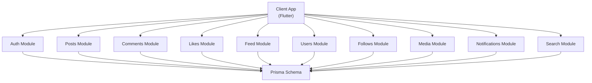

**Diagram sources**
- [schema.prisma](file://backend/prisma/schema.prisma)
- [README.md](file://README.md)

## Detailed Component Analysis

### Authentication System
- Registration: Validates input, hashes passwords, creates user records, and returns tokens or session identifiers.
- Login: Verifies credentials, manages sessions/tokens, and enforces rate limiting.
- Password Reset: Initiates reset flow, validates reset tokens, and updates passwords securely.
- Session Management: Implements secure cookies/sessions, refresh tokens, logout, and idle timeout handling.

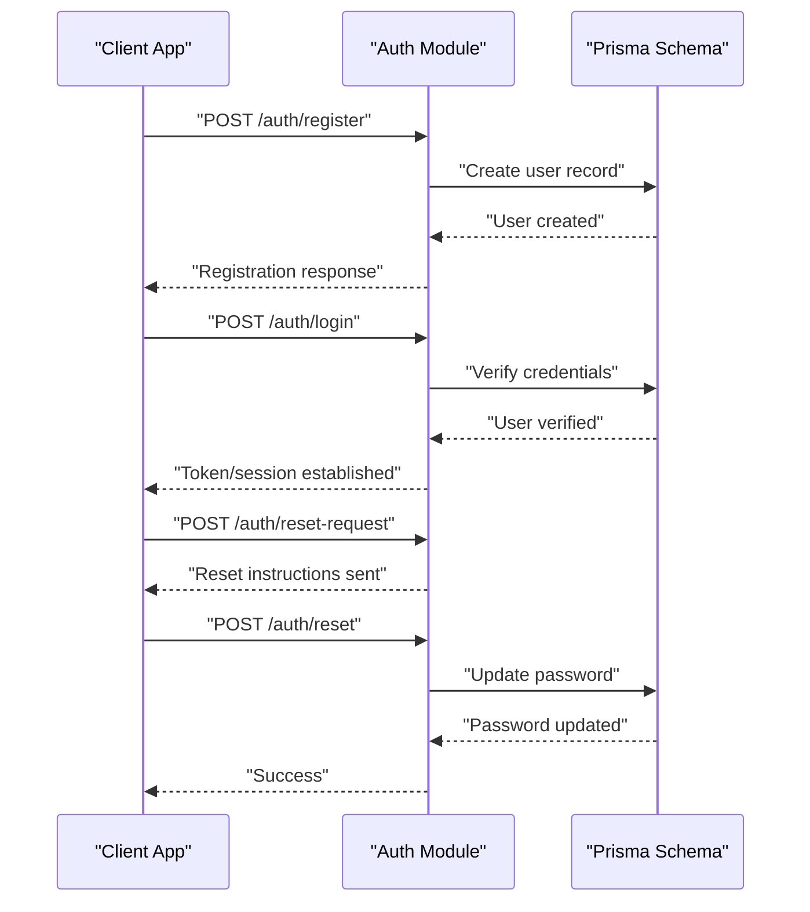

**Diagram sources**
- [schema.prisma](file://backend/prisma/schema.prisma)
- [README.md](file://README.md)

**Section sources**
- [schema.prisma](file://backend/prisma/schema.prisma)
- [README.md](file://README.md)

### Posts Module
- CRUD Operations: Create, read, update, delete posts with ownership checks.
- Media Handling: Attach images/videos to posts via the Media module.
- Feed Generation: Pull posts from followed users and personal timeline.

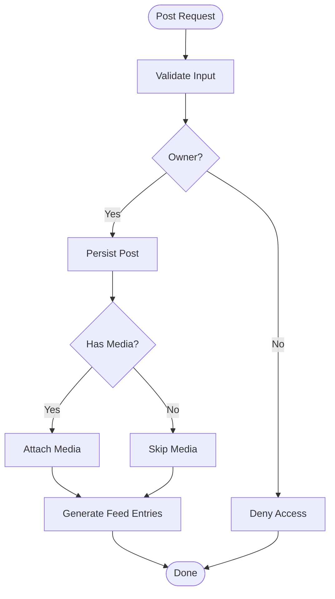

**Diagram sources**
- [schema.prisma](file://backend/prisma/schema.prisma)
- [README.md](file://README.md)

**Section sources**
- [schema.prisma](file://backend/prisma/schema.prisma)
- [README.md](file://README.md)

### Comments System
- Create Comment: Associates comment with post and author.
- Retrieve Comments: Lists comments per post with pagination.
- Delete Comment: Enforces ownership and cascade policies.

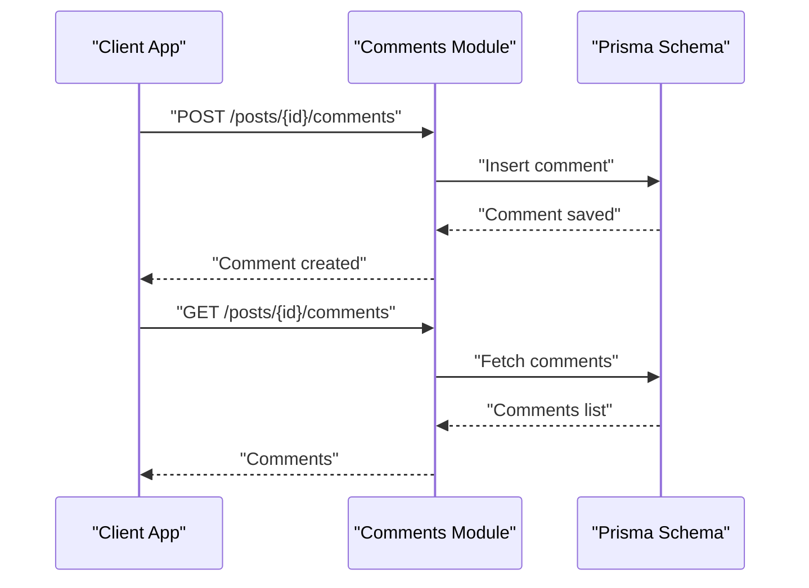

**Diagram sources**
- [schema.prisma](file://backend/prisma/schema.prisma)
- [README.md](file://README.md)

**Section sources**
- [schema.prisma](file://backend/prisma/schema.prisma)
- [README.md](file://README.md)

### Likes Functionality
- Like/Unlike: Toggle like state for a post.
- Counters: Maintain like counts and sync with real-time updates.

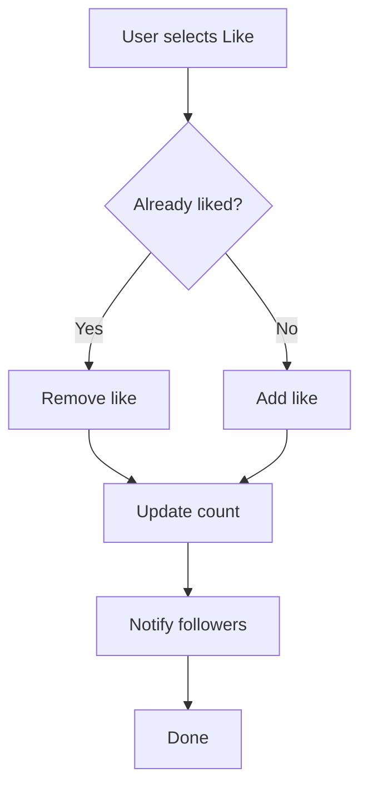

**Diagram sources**
- [schema.prisma](file://backend/prisma/schema.prisma)
- [README.md](file://README.md)

**Section sources**
- [schema.prisma](file://backend/prisma/schema.prisma)
- [README.md](file://README.md)

### Social Interactions and Following
- Follow/Unfollow: Updates social graph and affects feed visibility.
- Social Graph: Maintains relationships and privacy-aware queries.

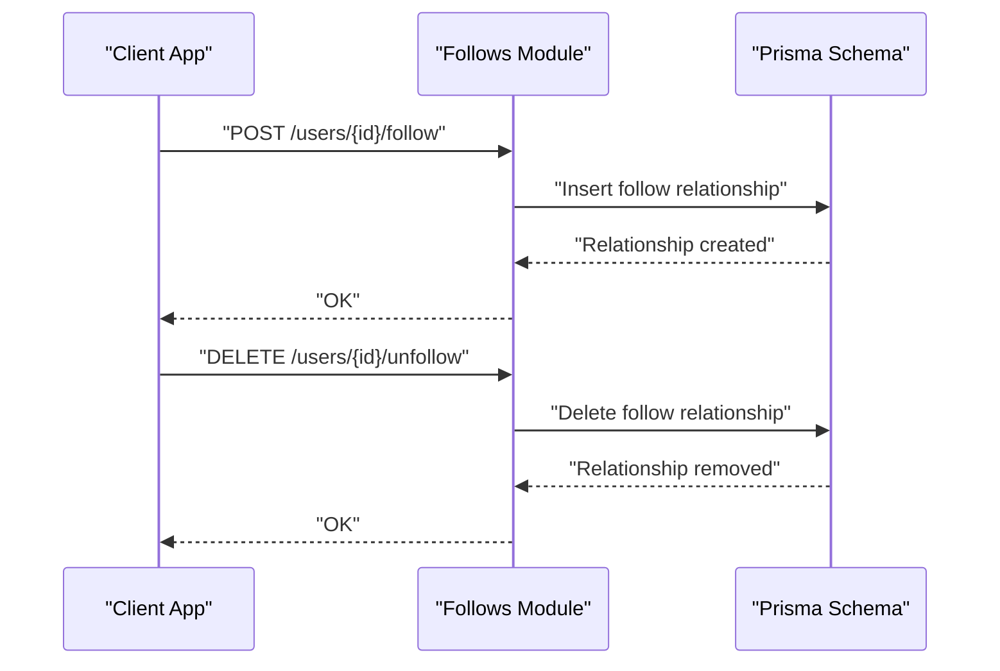

**Diagram sources**
- [schema.prisma](file://backend/prisma/schema.prisma)
- [README.md](file://README.md)

**Section sources**
- [schema.prisma](file://backend/prisma/schema.prisma)
- [README.md](file://README.md)

### User Profiles and Account Settings
- Profile Read/Update: Fetches public info and allows private updates.
- Privacy Controls: Manages visibility of posts and profile details.

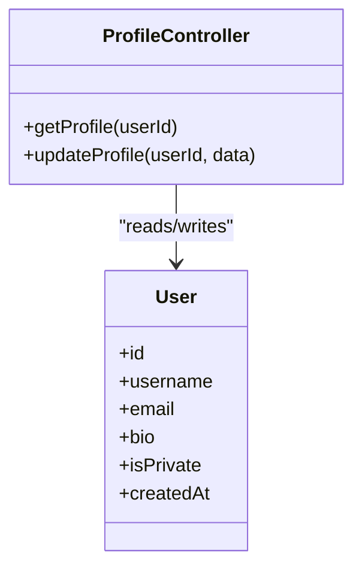

**Diagram sources**
- [schema.prisma](file://backend/prisma/schema.prisma)
- [README.md](file://README.md)

**Section sources**
- [schema.prisma](file://backend/prisma/schema.prisma)
- [README.md](file://README.md)

### Notifications System
- Event Triggers: On likes, comments, follows, mentions.
- Delivery Channels: In-app notifications and push notifications.

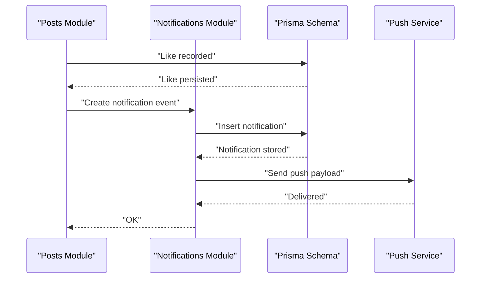

**Diagram sources**
- [schema.prisma](file://backend/prisma/schema.prisma)
- [README.md](file://README.md)

**Section sources**
- [schema.prisma](file://backend/prisma/schema.prisma)
- [README.md](file://README.md)

### Search and Content Discovery
- Search: Full-text search across posts and users.
- Recommendations: Personalized suggestions based on activity and follows.

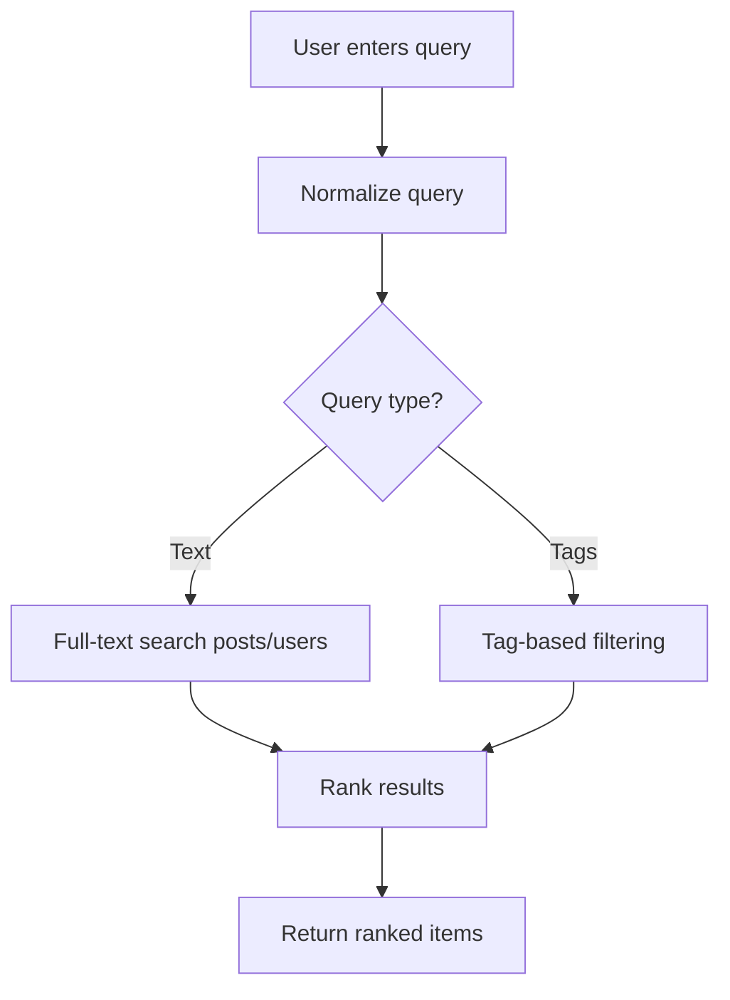

**Diagram sources**
- [schema.prisma](file://backend/prisma/schema.prisma)
- [README.md](file://README.md)

**Section sources**
- [schema.prisma](file://backend/prisma/schema.prisma)
- [README.md](file://README.md)

### Media Upload and Processing
- Upload: Accepts media files, validates types/sizes.
- Processing: Stores metadata and triggers background processing.
- Storage Integration: Integrates with cloud/object storage.

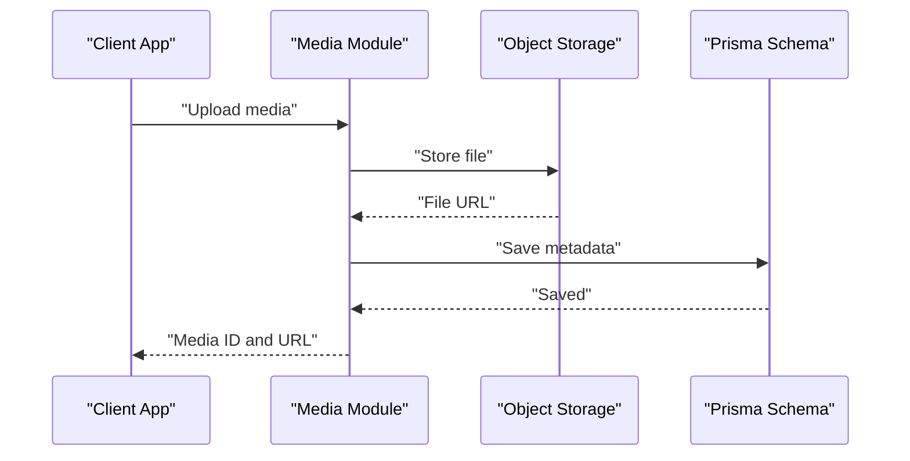

**Diagram sources**
- [schema.prisma](file://backend/prisma/schema.prisma)
- [README.md](file://README.md)

**Section sources**
- [schema.prisma](file://backend/prisma/schema.prisma)
- [README.md](file://README.md)

### Content Moderation
- Reporting: Users can report inappropriate content.
- Review Queue: Moderators review flagged items.
- Actions: Hide, remove, or restrict content.

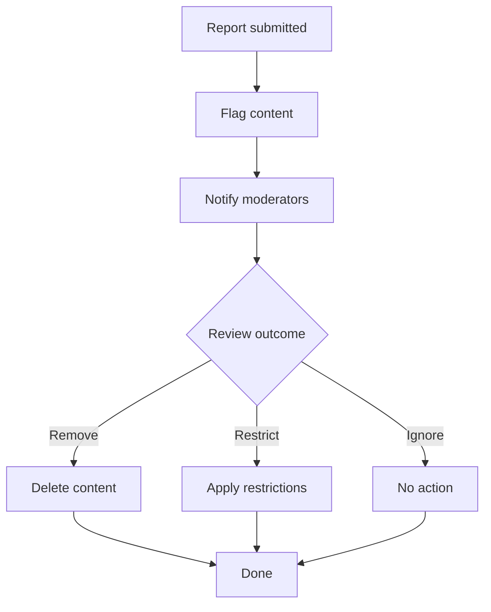

**Diagram sources**
- [schema.prisma](file://backend/prisma/schema.prisma)
- [README.md](file://README.md)

**Section sources**
- [schema.prisma](file://backend/prisma/schema.prisma)
- [README.md](file://README.md)

## Dependency Analysis
- Internal Coupling: Modules depend on the shared Prisma schema for data access.
- Frontend Integration: Flutter app consumes REST endpoints exposed by backend modules.
- External Services: Media module integrates with object storage; notifications module integrates with push providers.

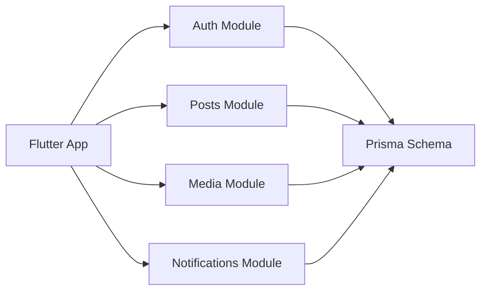

**Diagram sources**
- [schema.prisma](file://backend/prisma/schema.prisma)
- [README.md](file://README.md)

**Section sources**
- [schema.prisma](file://backend/prisma/schema.prisma)
- [README.md](file://README.md)

## Performance Considerations
- Database Indexes: Ensure appropriate indexes on foreign keys, timestamps, and searchable fields.
- Pagination: Implement cursor-based pagination for feeds and lists.
- Caching: Cache frequently accessed profiles and popular posts.
- Background Jobs: Offload media processing and notifications to background workers.
- CDN: Serve media via CDN for reduced latency.

[No sources needed since this section provides general guidance]

## Troubleshooting Guide
- Authentication Failures: Verify credentials, token expiration, and rate limits.
- Media Upload Issues: Check file types, sizes, and storage permissions.
- Notification Delivery: Confirm push provider credentials and device tokens.
- Search Results: Validate full-text indexes and query normalization.

**Section sources**
- [schema.prisma](file://backend/prisma/schema.prisma)
- [README.md](file://README.md)

## Conclusion
The application employs a modular backend architecture with a centralized Prisma schema and clear separation of concerns across feature modules. The frontend integrates via REST APIs, while real-time and push integrations are handled at the notifications layer. Robust indexing, caching, and background job processing are recommended to maintain performance and scalability.

[No sources needed since this section summarizes without analyzing specific files]

## Appendices
- Data Model Overview: Entities and relationships are defined in the Prisma schema.
- Frontend Entry Point: Flutter application entry point is under frontend/lib/main.dart.

**Section sources**
- [schema.prisma](file://backend/prisma/schema.prisma)
- [README.md](file://README.md)