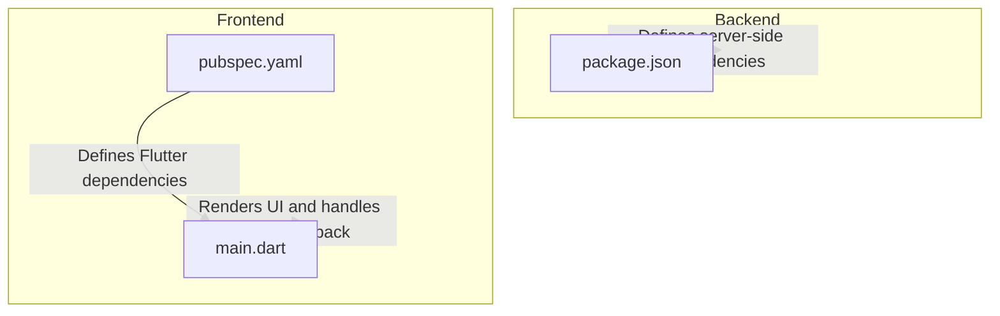
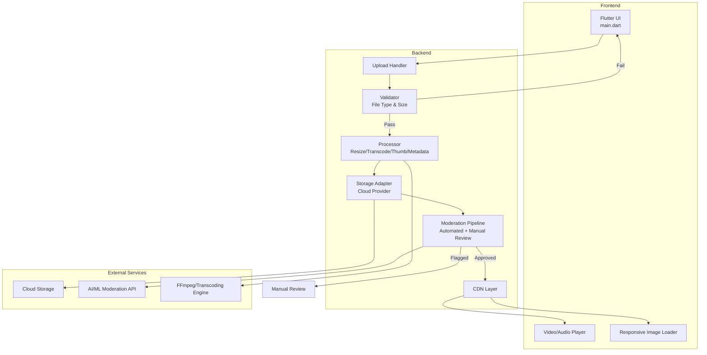
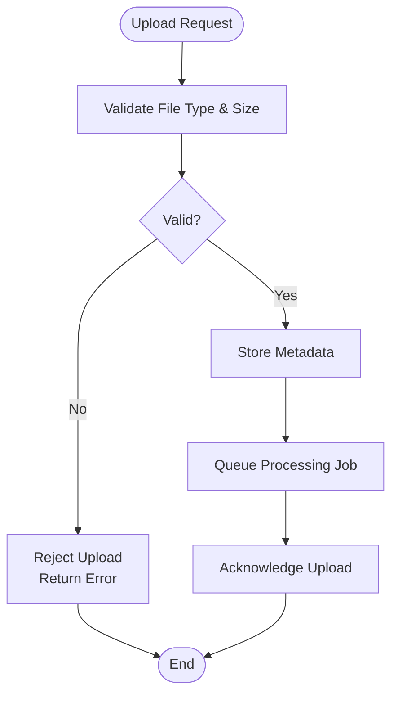
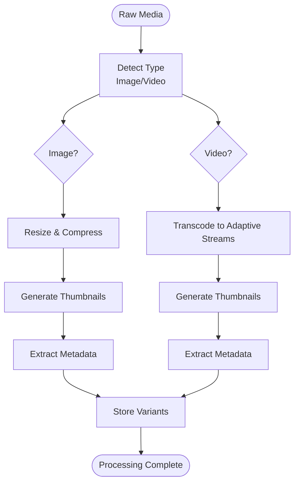
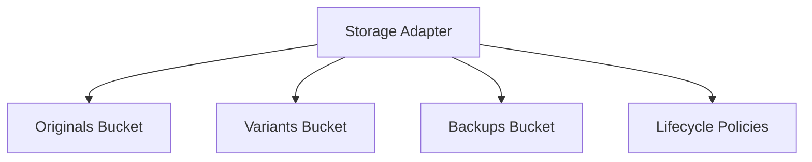
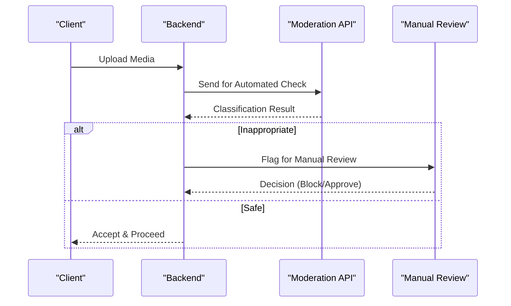
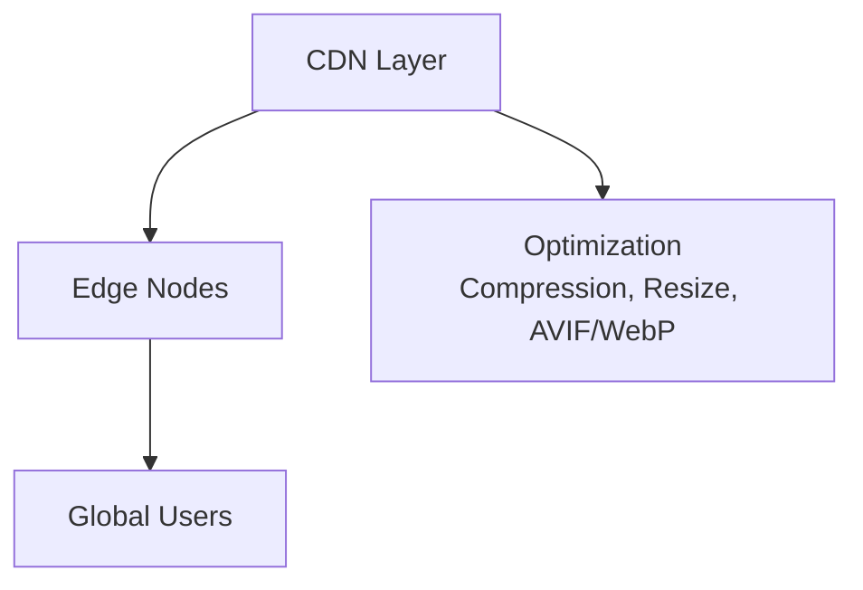
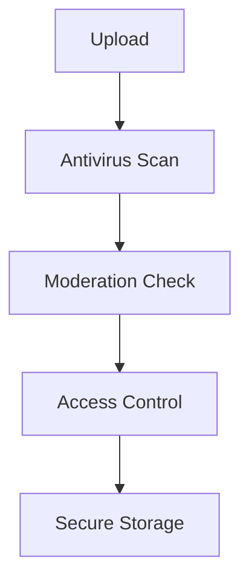
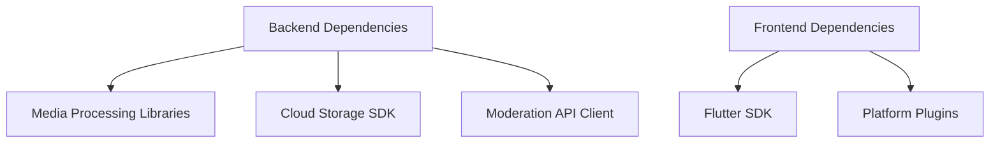

# Media & Content Management

<cite>
**Referenced Files in This Document**
- [package.json](file://backend/package.json)
- [pubspec.yaml](file://frontend/pubspec.yaml)
- [main.dart](file://frontend/lib/main.dart)
</cite>

## Table of Contents
1. [Introduction](#introduction)
2. [Project Structure](#project-structure)
3. [Core Components](#core-components)
4. [Architecture Overview](#architecture-overview)
5. [Detailed Component Analysis](#detailed-component-analysis)
6. [Dependency Analysis](#dependency-analysis)
7. [Performance Considerations](#performance-considerations)
8. [Troubleshooting Guide](#troubleshooting-guide)
9. [Conclusion](#conclusion)

## Introduction
This document provides comprehensive documentation for media and content management capabilities within the social media application. It focuses on image and video upload, processing, and storage integration, along with file format support, size limitations, compression strategies, content moderation workflows, CDN integration, image optimization, responsive media delivery, video transcoding, thumbnail generation, metadata extraction, backup and archiving policies, and security considerations including virus scanning and inappropriate content detection. The backend and frontend configurations are analyzed to understand current integrations and guide future enhancements.

## Project Structure
The repository is organized into a frontend (Flutter) and backend (Node.js) structure. The backend package configuration defines dependencies and scripts, while the frontend defines platform-specific build settings and dependencies. These configurations inform how media assets are integrated and delivered across platforms.

**Diagram sources**
- [package.json](file://backend/package.json)
- [pubspec.yaml](file://frontend/pubspec.yaml)
- [main.dart](file://frontend/lib/main.dart)

**Section sources**
- [package.json](file://backend/package.json)
- [pubspec.yaml](file://frontend/pubspec.yaml)
- [main.dart](file://frontend/lib/main.dart)

## Core Components
- Backend media services: The backend package configuration lists Node.js dependencies and scripts that can be extended to integrate media processing libraries, cloud storage SDKs, and moderation APIs.
- Frontend media rendering: The Flutter application entry point initializes the UI and can be extended to handle media playback, responsive layouts, and CDN asset delivery.

Key areas to implement:
- Upload pipeline: Validate file types, enforce size limits, and route to appropriate processors.
- Processing pipeline: Resize images, transcode videos, generate thumbnails, and extract metadata.
- Storage integration: Persist processed assets to cloud storage with versioning and lifecycle policies.
- Moderation: Automated filtering via AI/ML APIs and manual review workflows.
- Delivery: Serve optimized assets via CDN with responsive breakpoints and lazy loading.

**Section sources**
- [package.json](file://backend/package.json)
- [pubspec.yaml](file://frontend/pubspec.yaml)
- [main.dart](file://frontend/lib/main.dart)

## Architecture Overview
The media and content management architecture integrates frontend and backend components to deliver a robust solution for uploading, processing, storing, moderating, and serving media assets.

**Diagram sources**
- [package.json](file://backend/package.json)
- [pubspec.yaml](file://frontend/pubspec.yaml)
- [main.dart](file://frontend/lib/main.dart)

## Detailed Component Analysis

### Upload Pipeline
- Purpose: Receive media files from clients, validate formats and sizes, and enqueue processing tasks.
- Responsibilities:
  - Validate MIME types against supported formats.
  - Enforce maximum file size limits.
  - Sanitize filenames and generate unique identifiers.
  - Store original metadata and queue asynchronous jobs for processing.

**Diagram sources**
- [package.json](file://backend/package.json)

**Section sources**
- [package.json](file://backend/package.json)

### Processing Pipeline
- Purpose: Transform raw media into optimized variants for storage and delivery.
- Responsibilities:
  - Image processing: Resize to multiple breakpoints, apply compression, convert formats.
  - Video processing: Transcode to adaptive bitrate streams, generate thumbnails, extract metadata.
  - Thumbnail generation: Create preview images at multiple resolutions.
  - Metadata extraction: Capture EXIF, duration, codec info, and aspect ratio.

**Diagram sources**
- [package.json](file://backend/package.json)

**Section sources**
- [package.json](file://backend/package.json)

### Storage Integration
- Purpose: Persist processed media assets with scalability and durability.
- Responsibilities:
  - Use cloud storage with versioning and lifecycle policies.
  - Maintain separate buckets/containers for originals, variants, and backups.
  - Implement signed URLs for secure access and CDN distribution.

**Diagram sources**
- [package.json](file://backend/package.json)

**Section sources**
- [package.json](file://backend/package.json)

### Content Moderation Workflows
- Purpose: Prevent inappropriate content and ensure compliance.
- Responsibilities:
  - Automated filtering: Integrate AI/ML moderation APIs for image and video classification.
  - Manual review: Flag flagged items for human review with escalation paths.
  - Policy enforcement: Block or quarantine content based on moderation outcomes.

**Diagram sources**
- [package.json](file://backend/package.json)

**Section sources**
- [package.json](file://backend/package.json)

### CDN Integration and Responsive Delivery
- Purpose: Optimize global delivery and reduce latency.
- Responsibilities:
  - Serve assets via CDN with caching strategies.
  - Provide responsive breakpoints for images and adaptive streaming for videos.
  - Implement lazy loading and preloading for improved UX.

**Diagram sources**
- [pubspec.yaml](file://frontend/pubspec.yaml)
- [main.dart](file://frontend/lib/main.dart)

**Section sources**
- [pubspec.yaml](file://frontend/pubspec.yaml)
- [main.dart](file://frontend/lib/main.dart)

### Security Considerations
- Purpose: Protect the system from malicious uploads and inappropriate content.
- Responsibilities:
  - Virus scanning: Integrate antivirus scanning during ingestion.
  - Inappropriate content detection: Use AI/ML moderation APIs.
  - Access control: Enforce authentication and authorization for uploads and downloads.
  - Secure storage: Encrypt at rest and use signed URLs for temporary access.

**Diagram sources**
- [package.json](file://backend/package.json)

**Section sources**
- [package.json](file://backend/package.json)

## Dependency Analysis
- Backend dependencies: The backend package configuration lists Node.js dependencies that can be extended to include media processing libraries, cloud storage SDKs, and moderation service clients.
- Frontend dependencies: The Flutter pubspec configuration defines platform-specific dependencies and build settings that influence how media assets are packaged and delivered.

**Diagram sources**
- [package.json](file://backend/package.json)
- [pubspec.yaml](file://frontend/pubspec.yaml)

**Section sources**
- [package.json](file://backend/package.json)
- [pubspec.yaml](file://frontend/pubspec.yaml)

## Performance Considerations
- Asynchronous processing: Offload heavy tasks (transcoding, resizing) to background workers to avoid blocking requests.
- Compression strategies: Apply lossless or lossy compression based on content type and quality requirements.
- CDN caching: Configure cache-control headers and vary-by-device to maximize hit rates.
- Lazy loading: Defer non-critical media until needed to improve initial load times.
- Adaptive streaming: Use HLS/DASH for videos to adjust quality dynamically based on network conditions.

## Troubleshooting Guide
- Upload failures: Validate file types and sizes before processing. Log errors and return actionable messages to clients.
- Processing timeouts: Increase worker concurrency and optimize processor configurations. Monitor queue depths and retry failed jobs.
- CDN delivery issues: Verify signed URLs, cache invalidation, and edge node health. Confirm responsive breakpoints and fallbacks.
- Moderation false positives/negatives: Retrain moderation models with domain-specific datasets and implement feedback loops for continuous improvement.

## Conclusion
The media and content management system integrates frontend and backend components to provide a scalable, secure, and efficient solution for handling images and videos. By implementing robust upload validation, automated processing, secure storage, and intelligent moderation workflows, the system ensures high-quality user experiences while maintaining compliance and performance standards. Future enhancements should focus on expanding automation, optimizing delivery, and strengthening security measures.