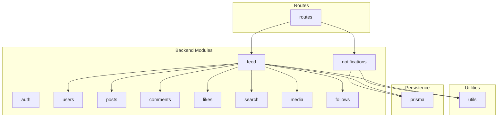
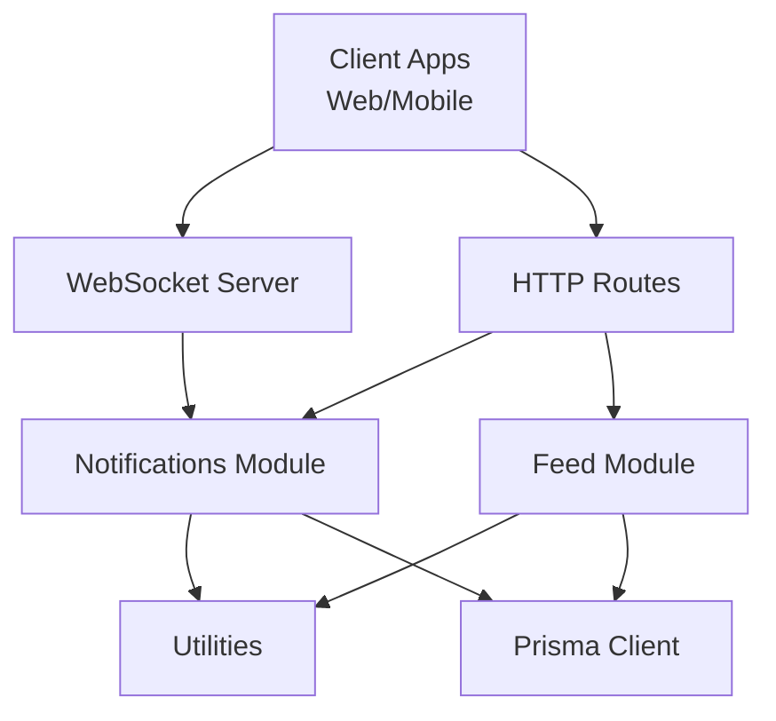
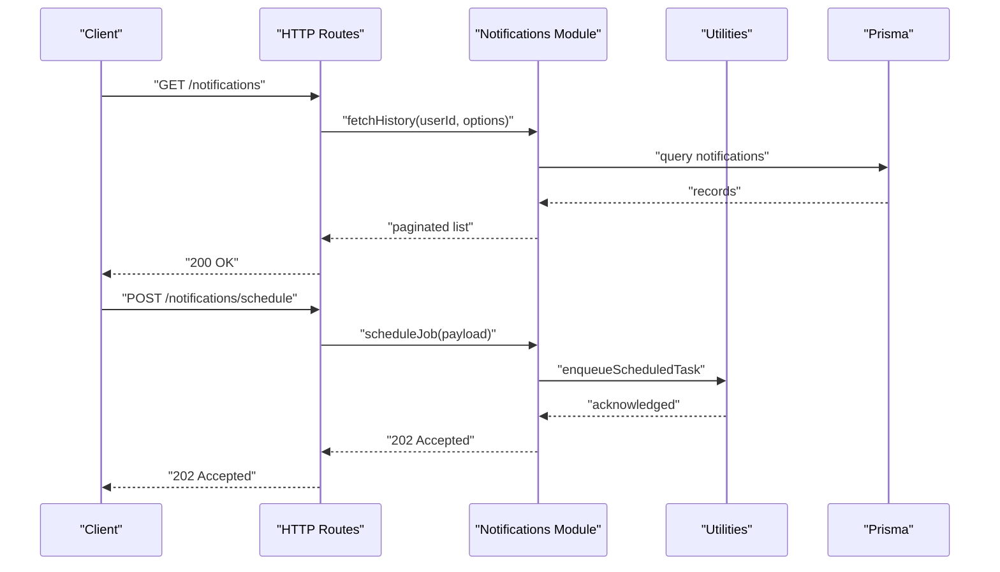
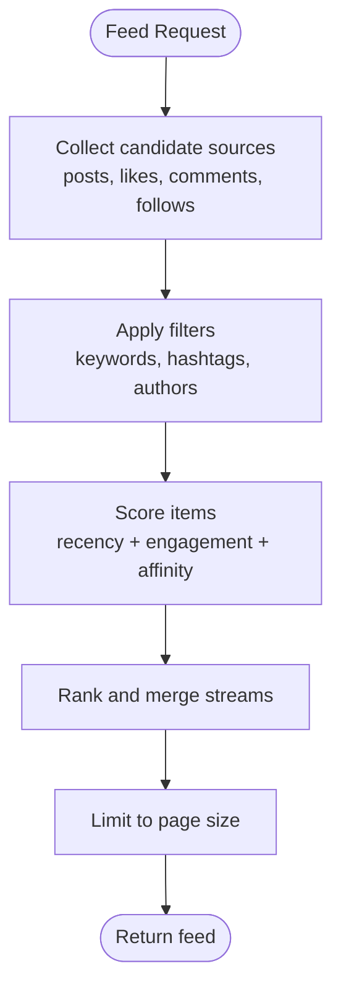
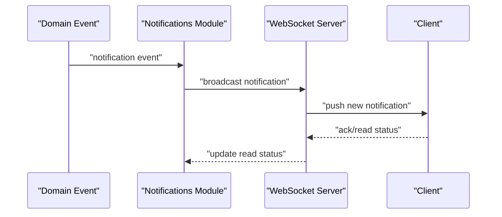
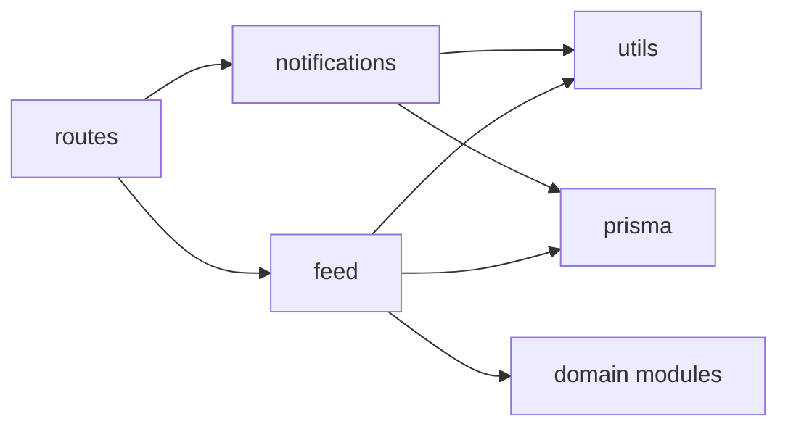

# Notifications & Feed

<cite>
**Referenced Files in This Document**
- [backend/src/modules/notifications](file://backend/src/modules/notifications)
- [backend/src/modules/feed](file://backend/src/modules/feed)
- [backend/src/routes](file://backend/src/routes)
- [backend/src/utils](file://backend/src/utils)
- [backend/prisma](file://backend/prisma)
</cite>

## Table of Contents
1. [Introduction](#introduction)
2. [Project Structure](#project-structure)
3. [Core Components](#core-components)
4. [Architecture Overview](#architecture-overview)
5. [Detailed Component Analysis](#detailed-component-analysis)
6. [Dependency Analysis](#dependency-analysis)
7. [Performance Considerations](#performance-considerations)
8. [Troubleshooting Guide](#troubleshooting-guide)
9. [Conclusion](#conclusion)

## Introduction
This document describes the notifications and feed systems of the social media application. It covers real-time notifications, notification types, and delivery mechanisms; feed generation algorithms, content ranking, and personalization strategies; push notifications, email notifications, and in-app notification handling; notification preferences, opt-out functionality, and notification history; feed filtering, content discovery, and recommendation algorithms; real-time updates via WebSockets, notification batching, and performance optimization for high-frequency updates; and notification scheduling, delivery reliability, and user preference management.

## Project Structure
The backend is organized into modular packages under backend/src/modules. Two key modules relevant to this document are:
- notifications: responsible for generating, storing, and delivering notifications across channels (push, email, in-app).
- feed: responsible for constructing user feeds, applying ranking and personalization, and supporting discovery and filtering.

Additional supporting areas:
- routes: HTTP endpoints that expose APIs for notifications and feed.
- utils: shared utilities for scheduling, batching, and other cross-cutting concerns.
- prisma: database schema and client for persistence.

**Diagram sources**
- [backend/src/modules/notifications](file://backend/src/modules/notifications)
- [backend/src/modules/feed](file://backend/src/modules/feed)
- [backend/src/routes](file://backend/src/routes)
- [backend/src/utils](file://backend/src/utils)
- [backend/prisma](file://backend/prisma)

**Section sources**
- [backend/src/modules/notifications](file://backend/src/modules/notifications)
- [backend/src/modules/feed](file://backend/src/modules/feed)
- [backend/src/routes](file://backend/src/routes)
- [backend/src/utils](file://backend/src/utils)
- [backend/prisma](file://backend/prisma)

## Core Components
- Notification service
  - Generates notification events from domain actions (e.g., likes, comments, follows).
  - Stores notifications in the database with metadata (type, target user, read status, timestamps).
  - Supports delivery channels: push, email, and in-app storage.
  - Manages user preferences and opt-out settings.
  - Provides notification history retrieval and pagination.

- Feed service
  - Builds user-specific feeds from multiple sources (posts, likes, comments, follows).
  - Applies ranking and personalization heuristics (recency, engagement, user relationships).
  - Supports filtering and discovery features (hashtags, content types, user-specified filters).
  - Integrates with search and recommendation subsystems.

- Real-time delivery
  - WebSocket connections for live in-app notifications.
  - Batching and throttling for high-frequency updates.
  - Scheduling for delayed or periodic notifications.

- Persistence
  - Prisma schema defines notification and feed-related entities and relationships.
  - Utilities handle database transactions, indexing, and performance tuning.

**Section sources**
- [backend/src/modules/notifications](file://backend/src/modules/notifications)
- [backend/src/modules/feed](file://backend/src/modules/feed)
- [backend/src/utils](file://backend/src/utils)
- [backend/prisma](file://backend/prisma)

## Architecture Overview
The notifications and feed systems integrate through shared routes and utilities, with persistence handled by Prisma. The feed service depends on multiple domain modules to assemble content, while the notifications service listens to domain events and emits notifications accordingly.

**Diagram sources**
- [backend/src/routes](file://backend/src/routes)
- [backend/src/modules/notifications](file://backend/src/modules/notifications)
- [backend/src/modules/feed](file://backend/src/modules/feed)
- [backend/src/utils](file://backend/src/utils)
- [backend/prisma](file://backend/prisma)

## Detailed Component Analysis

### Notifications Service
Responsibilities:
- Event-driven generation: listens to domain events (like/comment/follow) and creates notification records.
- Delivery orchestration: routes notifications to appropriate channels (push, email, in-app) based on user preferences.
- Preference management: reads and applies user notification settings (opt-in/out per type/channel).
- History and pagination: exposes endpoints to list recent notifications with read/unread status.
- Reliability: retries transient failures, deduplicates, and ensures eventual consistency.

Real-time delivery:
- WebSocket endpoint streams new notifications to connected clients.
- Batch updates reduce network overhead during bursts.

Scheduling:
- Scheduled jobs emit delayed notifications (e.g., daily summaries).

**Diagram sources**
- [backend/src/routes](file://backend/src/routes)
- [backend/src/modules/notifications](file://backend/src/modules/notifications)
- [backend/src/utils](file://backend/src/utils)
- [backend/prisma](file://backend/prisma)

**Section sources**
- [backend/src/modules/notifications](file://backend/src/modules/notifications)
- [backend/src/routes](file://backend/src/routes)
- [backend/src/utils](file://backend/src/utils)
- [backend/prisma](file://backend/prisma)

### Feed Service
Responsibilities:
- Feed assembly: aggregates content from posts, likes, comments, follows, and media interactions.
- Ranking: scores items by recency, engagement metrics, and user affinity.
- Personalization: tailors content based on user relationships, interests, and past behavior.
- Filtering: supports keyword, hashtag, author, and content-type filters.
- Discovery: integrates with search and recommendation engines.

**Diagram sources**
- [backend/src/modules/feed](file://backend/src/modules/feed)

**Section sources**
- [backend/src/modules/feed](file://backend/src/modules/feed)

### Real-Time Updates via WebSockets
- WebSocket server maintains per-user connections.
- On domain events, the notifications service publishes to a channel.
- WebSocket handler forwards new notifications to connected clients.
- Batching reduces message volume; throttling prevents overload.

**Diagram sources**
- [backend/src/modules/notifications](file://backend/src/modules/notifications)

**Section sources**
- [backend/src/modules/notifications](file://backend/src/modules/notifications)

### Notification Types and Delivery Mechanisms
- Types: mentions, likes, comments, follows, system alerts, digests.
- Channels: push notifications (device tokens), email, in-app timeline.
- Preferences: per-type and per-channel opt-in/out; defaults applied for new users.
- Opt-out: global and per-type toggles; immediate effect on delivery.

**Section sources**
- [backend/src/modules/notifications](file://backend/src/modules/notifications)

### Notification History and Pagination
- Retrieve paginated notifications with read/unread indicators.
- Support for filtering by type, date range, and read status.
- Efficient queries with proper indexing on user ID, timestamps, and status.

**Section sources**
- [backend/src/modules/notifications](file://backend/src/modules/notifications)
- [backend/prisma](file://backend/prisma)

### Feed Filtering, Content Discovery, and Recommendations
- Filters: text search, hashtags, author lists, content categories.
- Discovery: trending topics, suggested creators, related content.
- Recommendations: collaborative filtering, content-based similarity, and hybrid scoring.

**Section sources**
- [backend/src/modules/feed](file://backend/src/modules/feed)

### Scheduling, Batching, and Reliability
- Scheduling: cron-like tasks for periodic notifications (daily/weekly).
- Batching: group frequent updates into fewer messages.
- Reliability: retry policies, deduplication, idempotent handlers, dead-letter queues for failed deliveries.

**Section sources**
- [backend/src/utils](file://backend/src/utils)
- [backend/src/modules/notifications](file://backend/src/modules/notifications)

## Dependency Analysis
High-level dependencies:
- routes depend on notifications and feed modules.
- notifications depends on utils for scheduling/batching and prisma for persistence.
- feed depends on prisma and multiple domain modules for content assembly.
- WebSocket server depends on notifications for real-time updates.

**Diagram sources**
- [backend/src/routes](file://backend/src/routes)
- [backend/src/modules/notifications](file://backend/src/modules/notifications)
- [backend/src/modules/feed](file://backend/src/modules/feed)
- [backend/src/utils](file://backend/src/utils)
- [backend/prisma](file://backend/prisma)

**Section sources**
- [backend/src/routes](file://backend/src/routes)
- [backend/src/modules/notifications](file://backend/src/modules/notifications)
- [backend/src/modules/feed](file://backend/src/modules/feed)
- [backend/src/utils](file://backend/src/utils)
- [backend/prisma](file://backend/prisma)

## Performance Considerations
- Indexing: ensure database indexes on user ID, timestamps, and status for fast queries.
- Pagination: always limit and offset; avoid N+1 queries when loading associated entities.
- Batching: coalesce frequent updates; throttle bursty traffic.
- Caching: cache frequently accessed user preferences and feed segments.
- Asynchronous processing: offload heavy work to background jobs.
- Connection pooling: tune pool sizes for WebSocket and database connections.

[No sources needed since this section provides general guidance]

## Troubleshooting Guide
Common issues and resolutions:
- Missing notifications
  - Verify user preferences and opt-out settings.
  - Confirm delivery channel availability (device token, email address).
  - Check scheduled job logs for failures.

- Stale or missing real-time updates
  - Reconnect WebSocket clients on disconnect.
  - Validate batch sizes and throttling thresholds.
  - Inspect broadcast pipeline for errors.

- Slow feed rendering
  - Review query plans and add missing indexes.
  - Reduce payload size; lazy-load associations.
  - Implement caching for popular feed segments.

- Duplicate notifications
  - Add deduplication keys and idempotency checks.
  - Ensure atomic event handling with transactional writes.

**Section sources**
- [backend/src/modules/notifications](file://backend/src/modules/notifications)
- [backend/src/modules/feed](file://backend/src/modules/feed)
- [backend/src/utils](file://backend/src/utils)
- [backend/prisma](file://backend/prisma)

## Conclusion
The notifications and feed systems are designed around event-driven generation, flexible delivery channels, and robust real-time updates. The feed leverages multiple ranking and personalization strategies to improve discoverability, while the notifications service enforces user preferences and reliability. Together, they provide a scalable foundation for engaging users with timely and relevant content.

[No sources needed since this section summarizes without analyzing specific files]