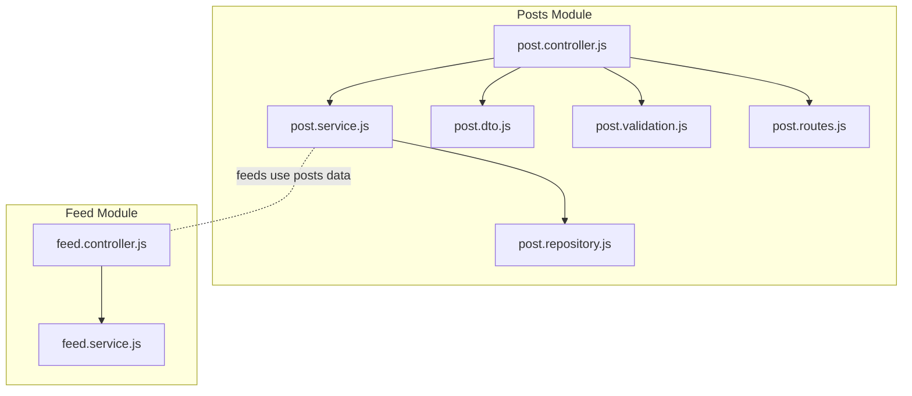
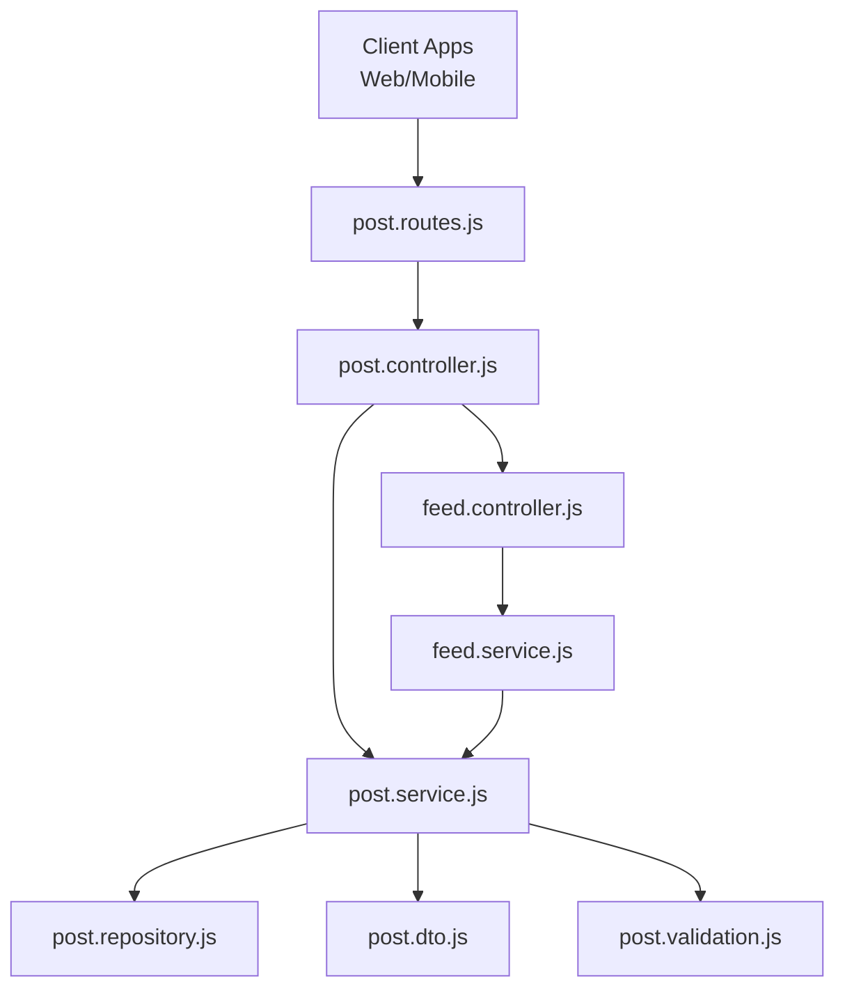
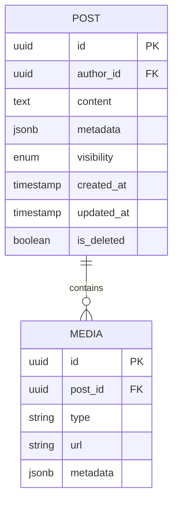
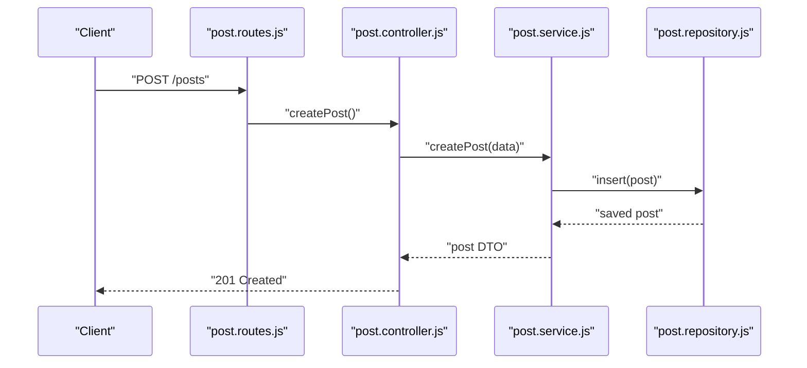
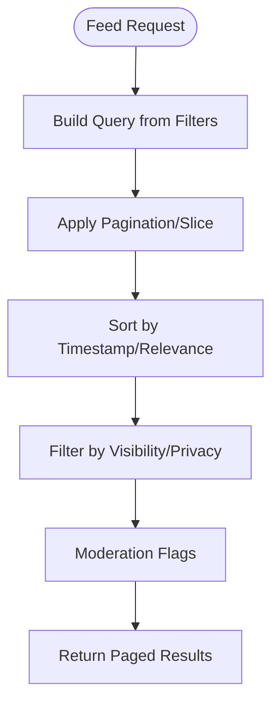
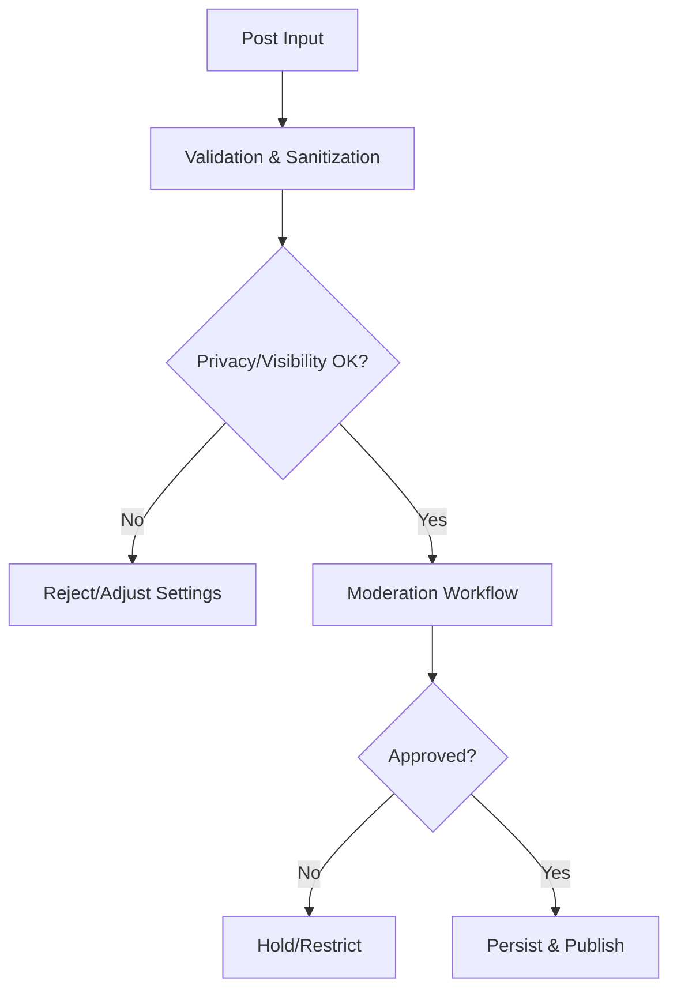
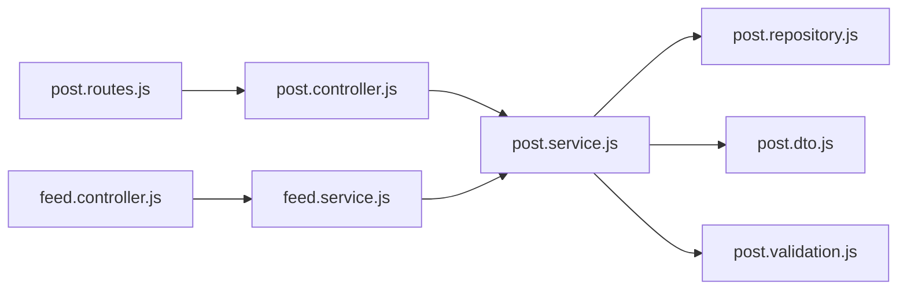

# Posts Management

<cite>
**Referenced Files in This Document**
- [post.controller.js](file://backend/src/modules/posts/post.controller.js)
- [post.service.js](file://backend/src/modules/posts/post.service.js)
- [post.repository.js](file://backend/src/modules/posts/post.repository.js)
- [post.validation.js](file://backend/src/modules/posts/post.validation.js)
- [post.routes.js](file://backend/src/modules/posts/post.routes.js)
- [post.dto.js](file://backend/src/dto/post.dto.js)
- [feed.controller.js](file://backend/src/modules/feed/feed.controller.js)
- [feed.service.js](file://backend/src/modules/feed/feed.service.js)
- [post.test.js](file://backend/tests/post.test.js)
</cite>

## Table of Contents
1. [Introduction](#introduction)
2. [Project Structure](#project-structure)
3. [Core Components](#core-components)
4. [Architecture Overview](#architecture-overview)
5. [Detailed Component Analysis](#detailed-component-analysis)
6. [Dependency Analysis](#dependency-analysis)
7. [Performance Considerations](#performance-considerations)
8. [Troubleshooting Guide](#troubleshooting-guide)
9. [Conclusion](#conclusion)

## Introduction
This document describes the posts management system for a social media application. It covers the data model, CRUD operations, media attachments, rich content formatting, feed generation, pagination, sorting, visibility and privacy controls, moderation features, real-time updates, infinite scrolling, performance optimizations, API endpoints, frontend integration patterns, and error handling strategies. The backend is organized around modular controllers, services, repositories, DTOs, validations, and routes under the posts module.

## Project Structure
The posts module resides under the backend server code and includes:
- Controllers: handle HTTP requests and responses for posts
- Services: encapsulate business logic for post operations
- Repositories: abstract database interactions
- DTOs: define request/response data structures
- Validation: enforce input constraints
- Routes: register API endpoints for posts

**Diagram sources**
- [post.controller.js](file://backend/src/modules/posts/post.controller.js)
- [post.service.js](file://backend/src/modules/posts/post.service.js)
- [post.repository.js](file://backend/src/modules/posts/post.repository.js)
- [post.dto.js](file://backend/src/dto/post.dto.js)
- [post.validation.js](file://backend/src/modules/posts/post.validation.js)
- [post.routes.js](file://backend/src/modules/posts/post.routes.js)
- [feed.controller.js](file://backend/src/modules/feed/feed.controller.js)
- [feed.service.js](file://backend/src/modules/feed/feed.service.js)

**Section sources**
- [post.controller.js](file://backend/src/modules/posts/post.controller.js)
- [post.service.js](file://backend/src/modules/posts/post.service.js)
- [post.repository.js](file://backend/src/modules/posts/post.repository.js)
- [post.validation.js](file://backend/src/modules/posts/post.validation.js)
- [post.routes.js](file://backend/src/modules/posts/post.routes.js)
- [post.dto.js](file://backend/src/dto/post.dto.js)
- [feed.controller.js](file://backend/src/modules/feed/feed.controller.js)
- [feed.service.js](file://backend/src/modules/feed/feed.service.js)

## Core Components
- Post controller: orchestrates request handling, delegates to service, and returns responses
- Post service: implements business logic for create, update, delete, and retrieve operations
- Post repository: handles persistence and queries against the data store
- Post DTO: defines structured input/output shapes for posts
- Post validation: enforces field constraints and sanitization
- Post routes: registers endpoints for CRUD operations and related actions

Key responsibilities:
- Create/edit/delete/retrieve posts
- Attach and manage media assets
- Support rich content formatting
- Generate feeds and apply pagination/sorting
- Enforce visibility and privacy rules
- Moderate content and handle moderation workflows
- Enable real-time updates and infinite scrolling

**Section sources**
- [post.controller.js](file://backend/src/modules/posts/post.controller.js)
- [post.service.js](file://backend/src/modules/posts/post.service.js)
- [post.repository.js](file://backend/src/modules/posts/post.repository.js)
- [post.validation.js](file://backend/src/modules/posts/post.validation.js)
- [post.routes.js](file://backend/src/modules/posts/post.routes.js)
- [post.dto.js](file://backend/src/dto/post.dto.js)

## Architecture Overview
The posts module follows a layered architecture:
- Presentation layer: routes and controllers
- Application layer: services
- Domain/persistence layer: repositories
- Data transfer layer: DTOs and validations

**Diagram sources**
- [post.routes.js](file://backend/src/modules/posts/post.routes.js)
- [post.controller.js](file://backend/src/modules/posts/post.controller.js)
- [post.service.js](file://backend/src/modules/posts/post.service.js)
- [post.repository.js](file://backend/src/modules/posts/post.repository.js)
- [post.dto.js](file://backend/src/dto/post.dto.js)
- [post.validation.js](file://backend/src/modules/posts/post.validation.js)
- [feed.controller.js](file://backend/src/modules/feed/feed.controller.js)
- [feed.service.js](file://backend/src/modules/feed/feed.service.js)

## Detailed Component Analysis

### Post Data Model and Media Attachments
- Data model: includes fields for author, content, metadata, visibility, timestamps, and optional media references
- Rich content: supports formatted text; sanitization and validation applied during create/update
- Media handling: associates media assets with posts via identifiers; repository persists and retrieves media records
- Content moderation: integrates with moderation workflows to flag, review, and restrict content

**Diagram sources**
- [post.repository.js](file://backend/src/modules/posts/post.repository.js)
- [post.dto.js](file://backend/src/dto/post.dto.js)

**Section sources**
- [post.repository.js](file://backend/src/modules/posts/post.repository.js)
- [post.dto.js](file://backend/src/dto/post.dto.js)

### CRUD Operations and API Endpoints
- Create post: validates input, applies formatting, persists record, attaches media if present, triggers notifications
- Retrieve post: fetches by ID with visibility checks
- Update post: enforces ownership and visibility rules, applies sanitization
- Delete post: soft-delete or hard-delete based on policy
- List posts: paginated, sorted, filtered by visibility and privacy

**Diagram sources**
- [post.routes.js](file://backend/src/modules/posts/post.routes.js)
- [post.controller.js](file://backend/src/modules/posts/post.controller.js)
- [post.service.js](file://backend/src/modules/posts/post.service.js)
- [post.repository.js](file://backend/src/modules/posts/post.repository.js)

**Section sources**
- [post.routes.js](file://backend/src/modules/posts/post.routes.js)
- [post.controller.js](file://backend/src/modules/posts/post.controller.js)
- [post.service.js](file://backend/src/modules/posts/post.service.js)
- [post.repository.js](file://backend/src/modules/posts/post.repository.js)

### Feed Generation, Pagination, and Sorting
- Feed generation: aggregates posts from followed users and public posts based on visibility
- Pagination: offset/limit or cursor-based pagination to support infinite scrolling
- Sorting: newest-first by default; optional sort by relevance, likes, or comments
- Filtering: excludes deleted or moderated posts; respects user privacy settings

**Diagram sources**
- [feed.controller.js](file://backend/src/modules/feed/feed.controller.js)
- [feed.service.js](file://backend/src/modules/feed/feed.service.js)
- [post.repository.js](file://backend/src/modules/posts/post.repository.js)

**Section sources**
- [feed.controller.js](file://backend/src/modules/feed/feed.controller.js)
- [feed.service.js](file://backend/src/modules/feed/feed.service.js)
- [post.repository.js](file://backend/src/modules/posts/post.repository.js)

### Visibility Settings, Privacy Controls, and Moderation
- Visibility: public, followers-only, private
- Privacy controls: enforce ownership and relationship checks
- Moderation: flag content, queue for review, restrict visibility, or remove content
- Enforcement: validated in service layer before persistence or exposure

**Diagram sources**
- [post.validation.js](file://backend/src/modules/posts/post.validation.js)
- [post.service.js](file://backend/src/modules/posts/post.service.js)
- [post.repository.js](file://backend/src/modules/posts/post.repository.js)

**Section sources**
- [post.validation.js](file://backend/src/modules/posts/post.validation.js)
- [post.service.js](file://backend/src/modules/posts/post.service.js)
- [post.repository.js](file://backend/src/modules/posts/post.repository.js)

### Real-Time Updates and Infinite Scrolling
- Real-time: push updates via WebSocket or server-sent events when posts are created/updated/deleted
- Infinite scrolling: client polls or subscribes to paginated endpoints; server returns next page markers
- Optimistic updates: client-side cache updates with fallbacks on server acknowledgment

[No sources needed since this section provides general guidance]

### Frontend Integration Patterns
- Use DTOs to standardize payload shapes
- Implement retry/backoff for transient errors
- Debounce search/filter inputs; throttle pagination requests
- Cache posts locally with ETags or Last-Modified headers

[No sources needed since this section provides general guidance]

## Dependency Analysis
The posts module depends on:
- Routes to controllers
- Controllers to services
- Services to repositories, DTOs, and validations
- Feed module consumes posts data for feed generation

**Diagram sources**
- [post.routes.js](file://backend/src/modules/posts/post.routes.js)
- [post.controller.js](file://backend/src/modules/posts/post.controller.js)
- [post.service.js](file://backend/src/modules/posts/post.service.js)
- [post.repository.js](file://backend/src/modules/posts/post.repository.js)
- [post.dto.js](file://backend/src/dto/post.dto.js)
- [post.validation.js](file://backend/src/modules/posts/post.validation.js)
- [feed.controller.js](file://backend/src/modules/feed/feed.controller.js)
- [feed.service.js](file://backend/src/modules/feed/feed.service.js)

**Section sources**
- [post.routes.js](file://backend/src/modules/posts/post.routes.js)
- [post.controller.js](file://backend/src/modules/posts/post.controller.js)
- [post.service.js](file://backend/src/modules/posts/post.service.js)
- [post.repository.js](file://backend/src/modules/posts/post.repository.js)
- [post.dto.js](file://backend/src/dto/post.dto.js)
- [post.validation.js](file://backend/src/modules/posts/post.validation.js)
- [feed.controller.js](file://backend/src/modules/feed/feed.controller.js)
- [feed.service.js](file://backend/src/modules/feed/feed.service.js)

## Performance Considerations
- Indexing: ensure efficient lookups on author, visibility, timestamps, and foreign keys
- Caching: cache frequently accessed posts and feed slices; invalidate on mutations
- Pagination: prefer cursor-based pagination for deep paging stability
- Lazy loading: defer media metadata until needed
- Background jobs: offload heavy tasks (image resizing, moderation) to workers
- Compression: compress responses for media-heavy payloads

[No sources needed since this section provides general guidance]

## Troubleshooting Guide
Common issues and resolutions:
- Validation failures: ensure DTOs match expected shapes; log invalid fields
- Permission denied: verify ownership and privacy rules before mutating
- Duplicate or malformed content: sanitize and normalize inputs
- Feed inconsistencies: reconcile cache and database; handle race conditions
- Media upload errors: validate file types/sizes; retry transient failures

**Section sources**
- [post.validation.js](file://backend/src/modules/posts/post.validation.js)
- [post.service.js](file://backend/src/modules/posts/post.service.js)
- [post.test.js](file://backend/tests/post.test.js)

## Conclusion
The posts management system is structured around clear separation of concerns: routes, controllers, services, repositories, DTOs, and validations. It supports robust CRUD operations, media handling, rich content formatting, feed generation with pagination and sorting, visibility and privacy controls, and moderation workflows. Real-time updates and infinite scrolling can be integrated via subscriptions and cursor-based pagination. Performance can be optimized through indexing, caching, and background processing. The provided API endpoints and frontend patterns enable scalable and maintainable integrations.