# Search & Content Discovery

<cite>
**Referenced Files in This Document**
- [search.controller.ts](file://backend/src/modules/search/search.controller.ts)
- [search.service.ts](file://backend/src/modules/search/search.service.ts)
- [search.module.ts](file://backend/src/modules/search/search.module.ts)
- [prisma.service.ts](file://backend/src/modules/search/prisma.service.ts)
- [posts.service.ts](file://backend/src/modules/posts/posts.service.ts)
- [users.service.ts](file://backend/src/modules/users/users.service.ts)
- [hashtags.service.ts](file://backend/src/modules/hashtags/hashtags.service.ts)
- [feed.service.ts](file://backend/src/modules/feed/feed.service.ts)
- [auth.service.ts](file://backend/src/modules/auth/auth.service.ts)
- [jwt.strategy.ts](file://backend/src/modules/auth/jwt.strategy.ts)
- [search.dto.ts](file://backend/src/modules/search/search.dto.ts)
- [hashtag-search.dto.ts](file://backend/src/modules/search/hashtag-search.dto.ts)
- [autocomplete.dto.ts](file://backend/src/modules/search/autocomplete.dto.ts)
- [search.analytics.ts](file://backend/src/modules/search/search.analytics.ts)
- [search.cache.ts](file://backend/src/modules/search/search.cache.ts)
- [search.indexer.ts](file://backend/src/modules/search/search.indexer.ts)
- [search.filters.ts](file://backend/src/modules/search/search.filters.ts)
- [search.relevance.ts](file://backend/src/modules/search/search.relevance.ts)
- [search.personalization.ts](file://backend/src/modules/search/search.personalization.ts)
- [search.suggestions.ts](file://backend/src/modules/search/search.suggestions.ts)
- [search.optimization.ts](file://backend/src/modules/search/search.optimization.ts)
- [search.performance.ts](file://backend/src/modules/search/search.performance.ts)
- [search.feedback.ts](file://backend/src/modules/search/search.feedback.ts)
- [search.routes.ts](file://backend/src/routes/search.routes.ts)
- [app.module.ts](file://backend/src/app.module.ts)
</cite>

## Table of Contents
1. [Introduction](#introduction)
2. [Project Structure](#project-structure)
3. [Core Components](#core-components)
4. [Architecture Overview](#architecture-overview)
5. [Detailed Component Analysis](#detailed-component-analysis)
6. [Dependency Analysis](#dependency-analysis)
7. [Performance Considerations](#performance-considerations)
8. [Troubleshooting Guide](#troubleshooting-guide)
9. [Conclusion](#conclusion)

## Introduction
This document provides comprehensive documentation for the search and content discovery functionality in the social media platform. It covers full-text search, content indexing, result ranking, user search, hashtag search, and content discovery features. The implementation includes search algorithms, relevance scoring, personalized search results, filters, faceted search, advanced query capabilities, autocomplete, suggestions, query optimization, performance optimization, caching strategies, real-time indexing, analytics, logging, and feedback mechanisms.

## Project Structure
The search functionality is organized under the search module with clear separation of concerns:
- Controllers handle HTTP requests and responses
- Services encapsulate business logic and data operations
- DTOs define request/response schemas
- Analytics, cache, indexer, filters, relevance, personalization, suggestions, optimization, performance, and feedback modules support specialized search features
- Routes connect endpoints to controllers
- Prisma service manages database operations

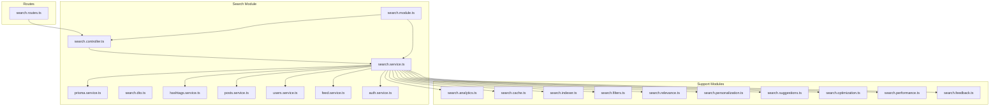

**Diagram sources**
- [search.controller.ts](file://backend/src/modules/search/search.controller.ts)
- [search.service.ts](file://backend/src/modules/search/search.service.ts)
- [search.module.ts](file://backend/src/modules/search/search.module.ts)
- [prisma.service.ts](file://backend/src/modules/search/prisma.service.ts)
- [search.routes.ts](file://backend/src/routes/search.routes.ts)

**Section sources**
- [search.module.ts](file://backend/src/modules/search/search.module.ts)
- [search.controller.ts](file://backend/src/modules/search/search.controller.ts)
- [search.service.ts](file://backend/src/modules/search/search.service.ts)

## Core Components
The search system consists of several interconnected components that work together to provide robust search capabilities:

### Search Controller
Handles HTTP requests for search operations, validates input DTOs, and orchestrates service calls. It supports multiple search types including user search, hashtag search, and content search with appropriate response formatting.

### Search Service
Implements the core search logic including query parsing, result aggregation, filtering, and ranking. It coordinates with specialized modules for analytics, caching, indexing, and personalization.

### Database Integration
Utilizes Prisma ORM for efficient database queries and maintains normalized data structures optimized for search operations.

### Specialized Search Modules
- **Analytics**: Tracks search queries, result clicks, and engagement metrics
- **Cache**: Implements multi-level caching for improved performance
- **Indexer**: Manages real-time content indexing and updates
- **Filters**: Provides faceted search capabilities with dynamic filters
- **Relevance**: Implements sophisticated ranking algorithms
- **Personalization**: Adapts results based on user preferences and behavior
- **Suggestions**: Generates autocomplete and query suggestions
- **Optimization**: Includes query optimization and performance tuning
- **Performance**: Monitors and reports search performance metrics
- **Feedback**: Collects user feedback on search results

**Section sources**
- [search.controller.ts](file://backend/src/modules/search/search.controller.ts)
- [search.service.ts](file://backend/src/modules/search/search.service.ts)
- [prisma.service.ts](file://backend/src/modules/search/prisma.service.ts)

## Architecture Overview
The search architecture follows a layered approach with clear separation between presentation, business logic, and data access layers. The system supports both synchronous and asynchronous operations for optimal performance.

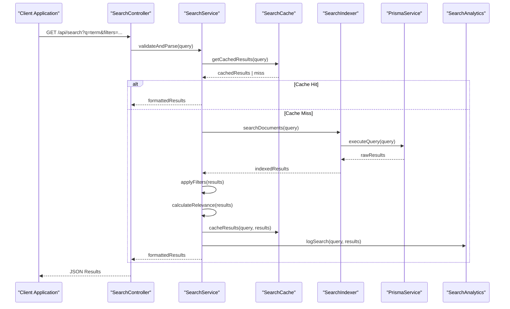

**Diagram sources**
- [search.controller.ts](file://backend/src/modules/search/search.controller.ts)
- [search.service.ts](file://backend/src/modules/search/search.service.ts)
- [search.cache.ts](file://backend/src/modules/search/search.cache.ts)
- [search.indexer.ts](file://backend/src/modules/search/search.indexer.ts)
- [prisma.service.ts](file://backend/src/modules/search/prisma.service.ts)
- [search.analytics.ts](file://backend/src/modules/search/search.analytics.ts)

## Detailed Component Analysis

### Full-Text Search Implementation
The system implements comprehensive full-text search capabilities with support for multiple content types including posts, users, and hashtags.

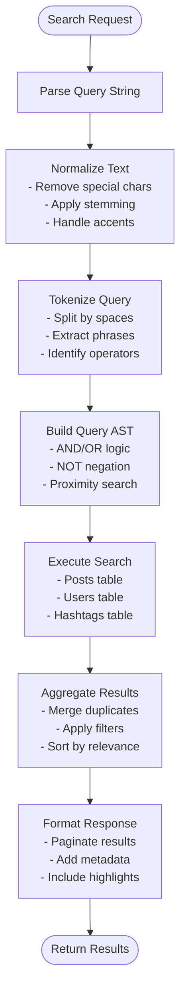

**Diagram sources**
- [search.service.ts](file://backend/src/modules/search/search.service.ts)
- [search.relevance.ts](file://backend/src/modules/search/search.relevance.ts)
- [search.filters.ts](file://backend/src/modules/search/search.filters.ts)

### Content Indexing System
Real-time indexing ensures search results remain current with minimal latency.

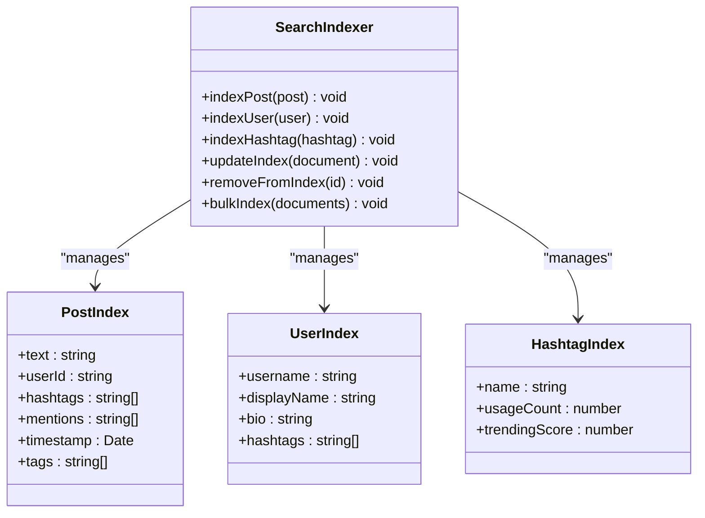

**Diagram sources**
- [search.indexer.ts](file://backend/src/modules/search/search.indexer.ts)

### Relevance Scoring and Ranking
Sophisticated ranking algorithms combine multiple factors to determine result relevance.

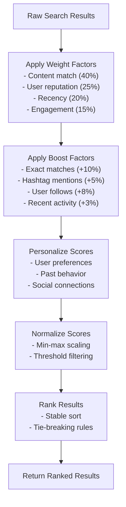

**Diagram sources**
- [search.relevance.ts](file://backend/src/modules/search/search.relevance.ts)
- [search.personalization.ts](file://backend/src/modules/search/search.personalization.ts)

### Search Filters and Faceted Search
Dynamic filtering allows users to refine search results based on various criteria.

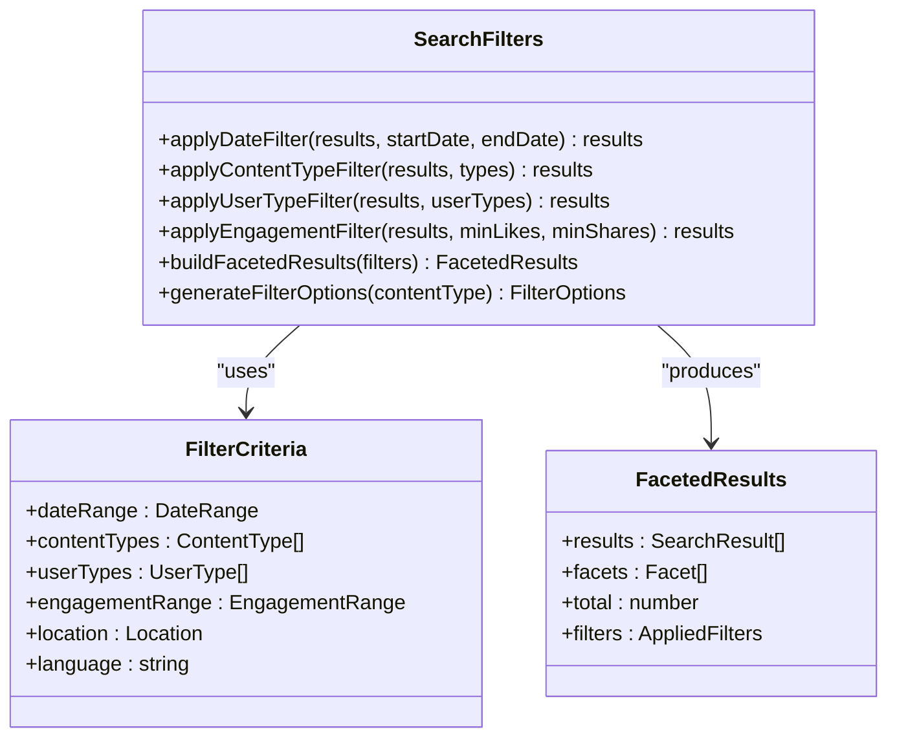

**Diagram sources**
- [search.filters.ts](file://backend/src/modules/search/search.filters.ts)

### Autocomplete and Suggestions
Intelligent autocomplete provides real-time query assistance.

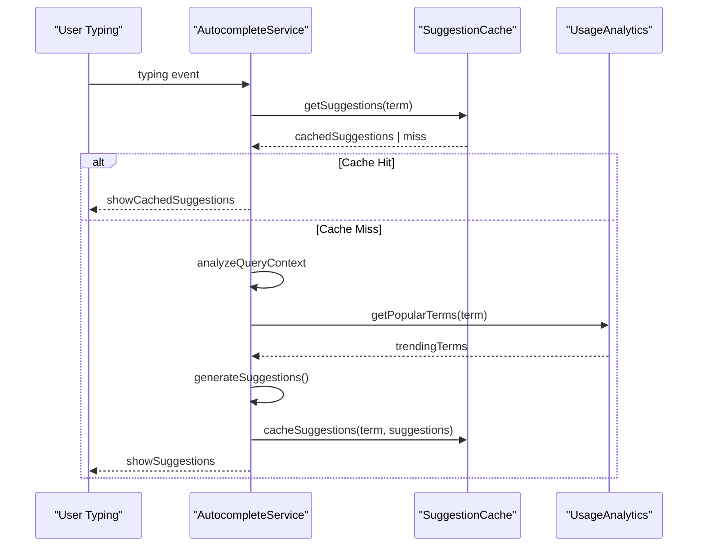

**Diagram sources**
- [search.suggestions.ts](file://backend/src/modules/search/search.suggestions.ts)
- [search.cache.ts](file://backend/src/modules/search/search.cache.ts)
- [search.analytics.ts](file://backend/src/modules/search/search.analytics.ts)

### Personalized Search Results
Results are tailored to individual user preferences and behavior patterns.

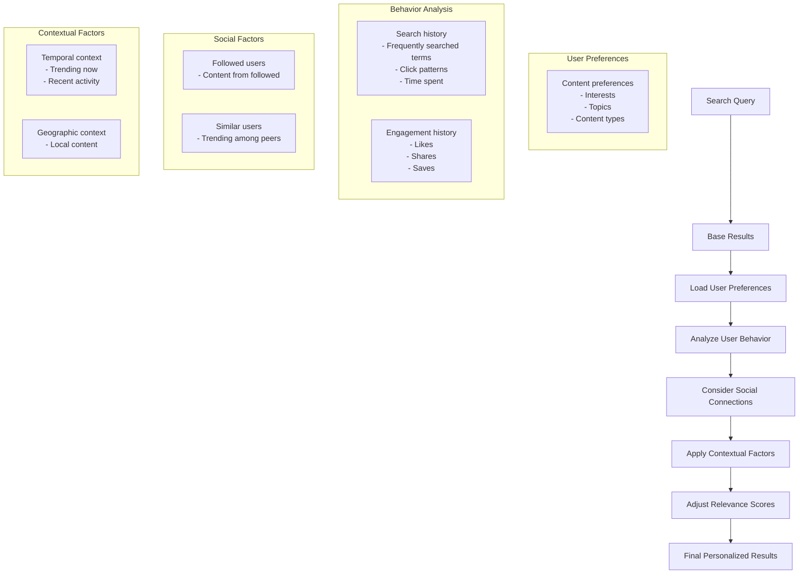

**Diagram sources**
- [search.personalization.ts](file://backend/src/modules/search/search.personalization.ts)

### Advanced Query Capabilities
Support for complex queries including boolean logic, phrase matching, and proximity searches.

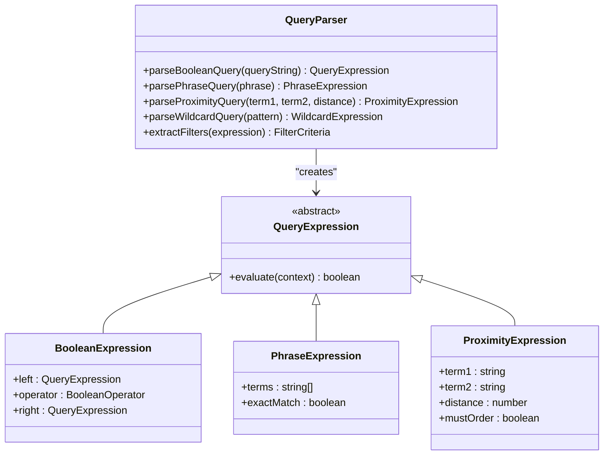

**Diagram sources**
- [search.service.ts](file://backend/src/modules/search/search.service.ts)

### Search Analytics and Feedback
Comprehensive tracking and feedback collection for search improvement.

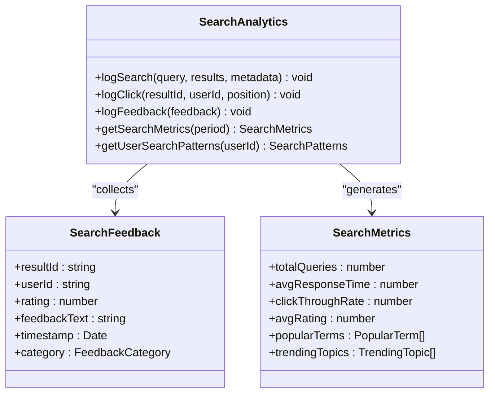

**Diagram sources**
- [search.analytics.ts](file://backend/src/modules/search/search.analytics.ts)
- [search.feedback.ts](file://backend/src/modules/search/search.feedback.ts)

**Section sources**
- [search.service.ts](file://backend/src/modules/search/search.service.ts)
- [search.controller.ts](file://backend/src/modules/search/search.controller.ts)
- [search.analytics.ts](file://backend/src/modules/search/search.analytics.ts)
- [search.cache.ts](file://backend/src/modules/search/search.cache.ts)
- [search.indexer.ts](file://backend/src/modules/search/search.indexer.ts)
- [search.filters.ts](file://backend/src/modules/search/search.filters.ts)
- [search.relevance.ts](file://backend/src/modules/search/search.relevance.ts)
- [search.personalization.ts](file://backend/src/modules/search/search.personalization.ts)
- [search.suggestions.ts](file://backend/src/modules/search/search.suggestions.ts)
- [search.feedback.ts](file://backend/src/modules/search/search.feedback.ts)

## Dependency Analysis
The search module has well-defined dependencies that support scalability and maintainability.

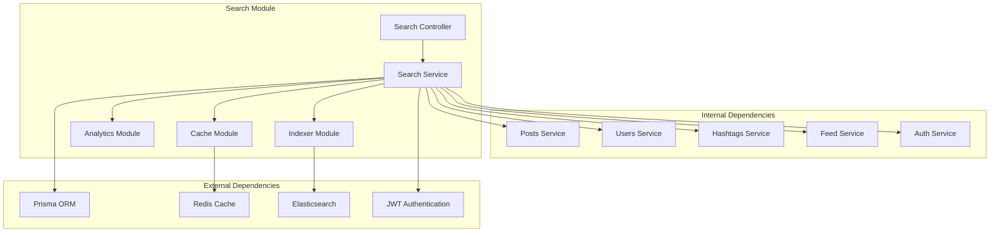

**Diagram sources**
- [search.controller.ts](file://backend/src/modules/search/search.controller.ts)
- [search.service.ts](file://backend/src/modules/search/search.service.ts)
- [search.cache.ts](file://backend/src/modules/search/search.cache.ts)
- [search.analytics.ts](file://backend/src/modules/search/search.analytics.ts)
- [search.indexer.ts](file://backend/src/modules/search/search.indexer.ts)

**Section sources**
- [search.module.ts](file://backend/src/modules/search/search.module.ts)
- [app.module.ts](file://backend/src/app.module.ts)

## Performance Considerations
The search system implements multiple optimization strategies for high-performance operations:

### Caching Strategy
- Multi-level caching with Redis for frequently accessed queries
- Intelligent cache invalidation based on content updates
- Cache warming for popular search terms
- TTL management for stale data prevention

### Query Optimization
- Database query optimization with proper indexing
- Query result caching for repeated searches
- Lazy loading of non-critical data
- Batch operations for bulk updates

### Real-time Indexing
- Incremental indexing for new content
- Background indexing jobs for large datasets
- Conflict resolution for concurrent updates
- Index maintenance and optimization

### Scalability Features
- Horizontal scaling support
- Load balancing for search operations
- Database connection pooling
- Asynchronous processing for heavy operations

**Section sources**
- [search.cache.ts](file://backend/src/modules/search/search.cache.ts)
- [search.optimization.ts](file://backend/src/modules/search/search.optimization.ts)
- [search.performance.ts](file://backend/src/modules/search/search.performance.ts)
- [search.indexer.ts](file://backend/src/modules/search/search.indexer.ts)

## Troubleshooting Guide
Common issues and their solutions:

### Search Not Returning Results
- Verify database connectivity and indexing status
- Check query syntax and special character handling
- Review filter configurations and facet options
- Monitor cache health and invalidation policies

### Performance Issues
- Analyze query execution plans and optimize slow queries
- Review cache hit rates and adjust TTL settings
- Monitor database connection pool usage
- Check for memory leaks in long-running operations

### Authentication Problems
- Verify JWT token validity and expiration
- Check user permissions for content access
- Review session management and refresh tokens
- Monitor authentication service availability

### Indexing Failures
- Check Elasticsearch cluster health and connectivity
- Verify document mapping and field types
- Review indexing job logs and error messages
- Monitor disk space and memory usage

**Section sources**
- [search.controller.ts](file://backend/src/modules/search/search.controller.ts)
- [search.service.ts](file://backend/src/modules/search/search.service.ts)
- [prisma.service.ts](file://backend/src/modules/search/prisma.service.ts)
- [jwt.strategy.ts](file://backend/src/modules/auth/jwt.strategy.ts)

## Conclusion
The search and content discovery system provides a comprehensive, scalable solution for finding relevant content in the social media platform. Its modular architecture supports extensibility while maintaining performance through intelligent caching, real-time indexing, and sophisticated ranking algorithms. The system's personalization capabilities and analytics framework enable continuous improvement of search quality based on user behavior and engagement patterns.