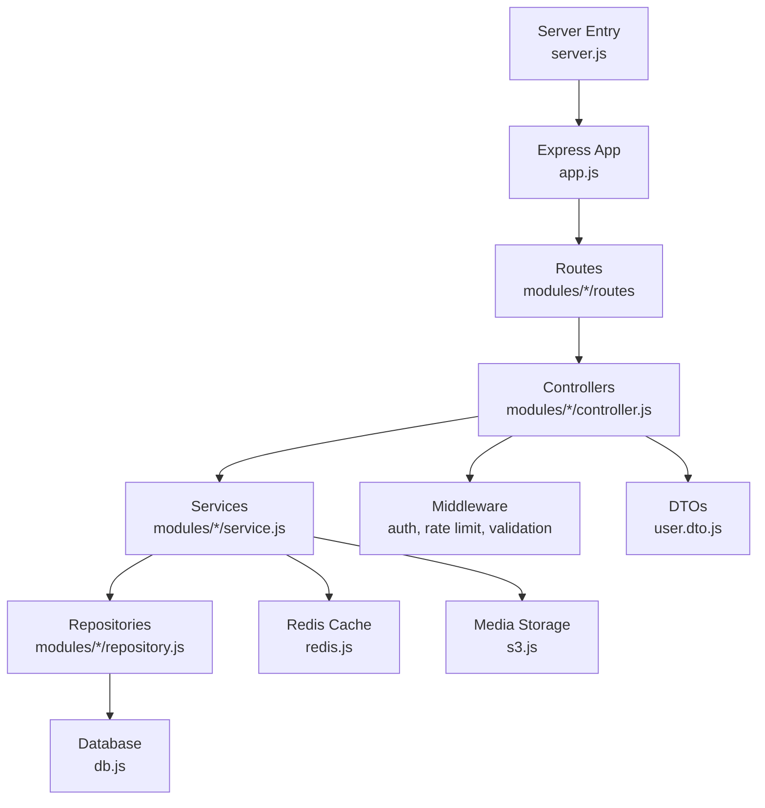
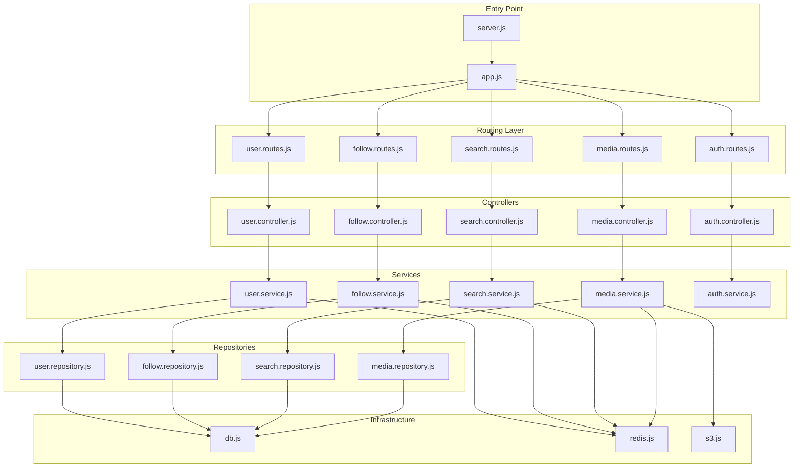
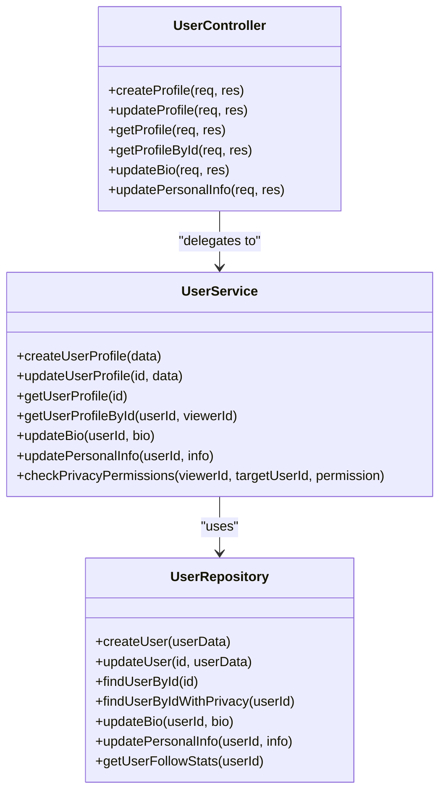
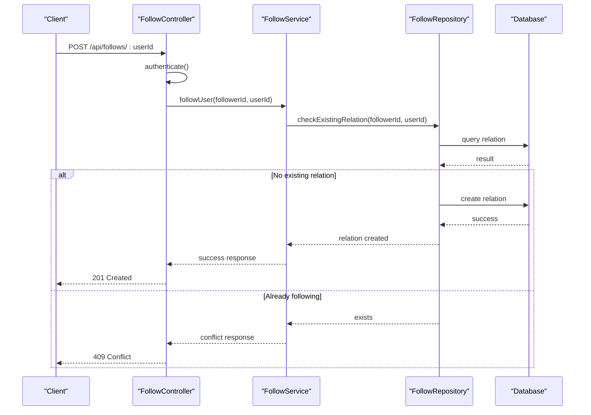
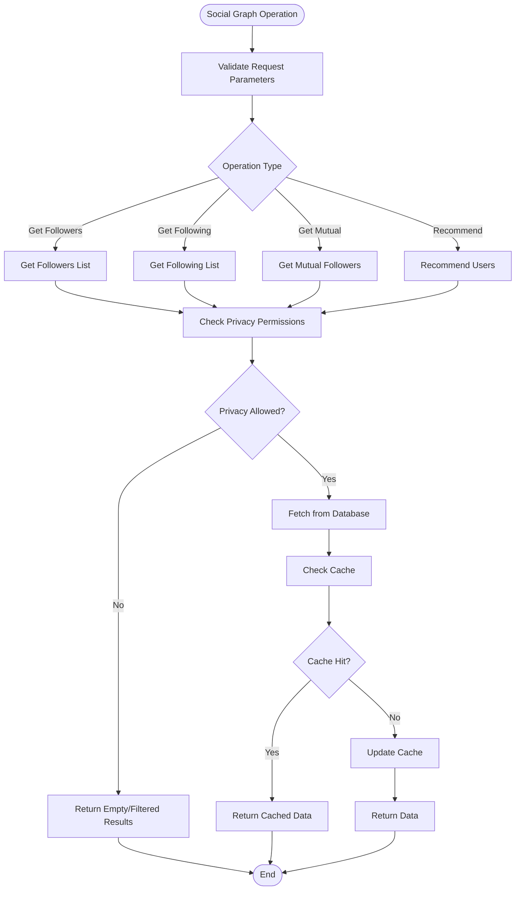
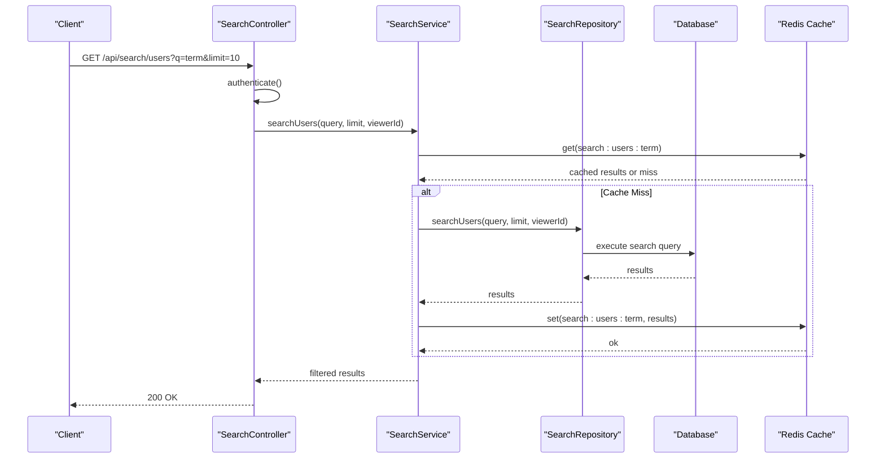
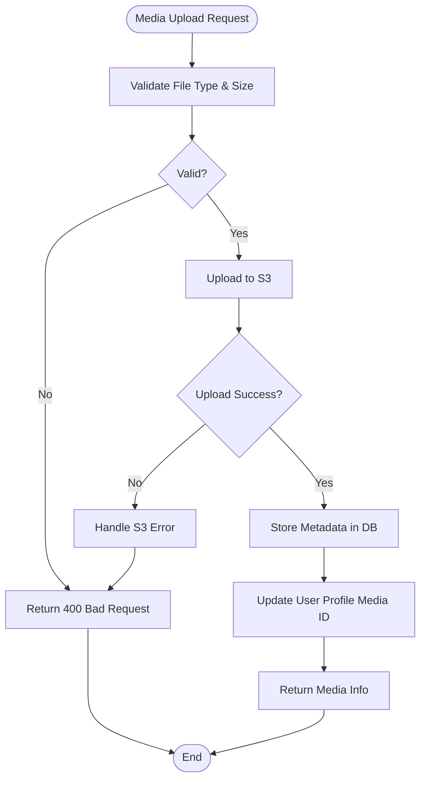
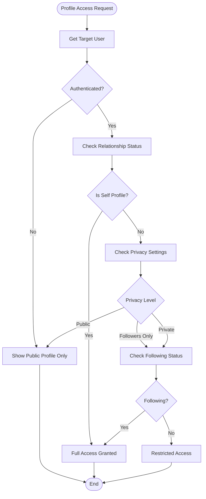
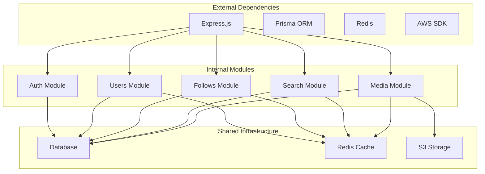

# User Profiles & Social Graph

<cite>
**Referenced Files in This Document**
- [server.js](file://backend/server.js)
- [app.js](file://backend/src/app.js)
- [db.js](file://backend/src/config/db.js)
- [redis.js](file://backend/src/config/redis.js)
- [s3.js](file://backend/src/config/s3.js)
- [errors.js](file://backend/src/constants/errors.js)
- [roles.js](file://backend/src/constants/roles.js)
- [user.dto.js](file://backend/src/dto/user.dto.js)
- [auth.middleware.js](file://backend/src/middleware/auth.middleware.js)
- [error.middleware.js](file://backend/src/middleware/error.middleware.js)
- [rateLimit.middleware.js](file://backend/src/middleware/rateLimit.middleware.js)
- [validate.middleware.js](file://backend/src/middleware/validate.middleware.js)
- [auth.controller.js](file://backend/src/modules/auth/auth.controller.js)
- [auth.service.js](file://backend/src/modules/auth/auth.service.js)
- [auth.routes.js](file://backend/src/modules/auth/auth.routes.js)
- [auth.validation.js](file://backend/src/modules/auth/auth.validation.js)
- [user.controller.js](file://backend/src/modules/users/user.controller.js)
- [user.repository.js](file://backend/src/modules/users/user.repository.js)
- [user.routes.js](file://backend/src/modules/users/user.routes.js)
- [user.service.js](file://backend/src/modules/users/user.service.js)
- [follow.controller.js](file://backend/src/modules/follows/follow.controller.js)
- [follow.repository.js](file://backend/src/modules/follows/follow.repository.js)
- [follow.routes.js](file://backend/src/modules/follows/follow.routes.js)
- [follow.service.js](file://backend/src/modules/follows/follow.service.js)
- [search.controller.js](file://backend/src/modules/search/search.controller.js)
- [search.repository.js](file://backend/src/modules/search/search.repository.js)
- [search.routes.js](file://backend/src/modules/search/search.routes.js)
- [search.service.js](file://backend/src/modules/search/search.service.js)
- [media.controller.js](file://backend/src/modules/media/media.controller.js)
- [media.repository.js](file://backend/src/modules/media/media.repository.js)
- [media.routes.js](file://backend/src/modules/media/media.routes.js)
- [media.service.js](file://backend/src/modules/media/media.service.js)
</cite>

## Table of Contents
1. [Introduction](#introduction)
2. [Project Structure](#project-structure)
3. [Core Components](#core-components)
4. [Architecture Overview](#architecture-overview)
5. [Detailed Component Analysis](#detailed-component-analysis)
6. [Dependency Analysis](#dependency-analysis)
7. [Performance Considerations](#performance-considerations)
8. [Troubleshooting Guide](#troubleshooting-guide)
9. [Conclusion](#conclusion)

## Introduction
This document provides comprehensive documentation for user profiles and the social graph system in the backend. It covers profile creation, editing, and display; the following/follower system and social graph management; user relationship tracking; privacy settings and visibility controls; content filtering based on relationships; user search, recommendations, and social discovery; profile media management; bio editing; personal information handling; API endpoints for profile operations, social graph queries, and relationship management; and performance optimization strategies for large social graphs along with privacy considerations.

## Project Structure
The backend is organized around modular components under the src/modules directory, with shared configuration, DTOs, middleware, and routes. The primary modules relevant to user profiles and social graph are:
- Users: Profile management, user CRUD, and user-related operations
- Follows: Following/follower relationships and social graph queries
- Search: User search and discovery
- Media: Profile media management (images, videos)
- Auth: Authentication and authorization for protected operations

**Diagram sources**
- [server.js:1-50](file://backend/server.js#L1-L50)
- [app.js:1-100](file://backend/src/app.js#L1-L100)
- [user.controller.js:1-200](file://backend/src/modules/users/user.controller.js#L1-L200)
- [follow.controller.js:1-200](file://backend/src/modules/follows/follow.controller.js#L1-L200)
- [search.controller.js:1-200](file://backend/src/modules/search/search.controller.js#L1-L200)
- [media.controller.js:1-200](file://backend/src/modules/media/media.controller.js#L1-L200)
- [auth.controller.js:1-200](file://backend/src/modules/auth/auth.controller.js#L1-L200)
- [db.js:1-100](file://backend/src/config/db.js#L1-L100)
- [redis.js:1-100](file://backend/src/config/redis.js#L1-L100)
- [s3.js:1-100](file://backend/src/config/s3.js#L1-L100)

**Section sources**
- [server.js:1-50](file://backend/server.js#L1-L50)
- [app.js:1-100](file://backend/src/app.js#L1-L100)

## Core Components
- User Management Module: Handles profile creation, updates, retrieval, and personal information management
- Follows Module: Manages following/follower relationships, social graph queries, and relationship operations
- Search Module: Provides user search, recommendations, and social discovery
- Media Module: Manages profile media uploads, storage, and retrieval
- Auth Module: Provides authentication and authorization for protected profile operations
- Middleware: Shared middleware for authentication, validation, rate limiting, and error handling
- Configuration: Database connection, Redis caching, and S3 media storage configuration

Key responsibilities:
- Profile CRUD operations with privacy-aware visibility controls
- Social graph maintenance and relationship tracking
- Content filtering based on follower/following relationships
- Efficient search and discovery mechanisms
- Secure media handling and storage
- Robust error handling and validation

**Section sources**
- [user.controller.js:1-200](file://backend/src/modules/users/user.controller.js#L1-L200)
- [follow.controller.js:1-200](file://backend/src/modules/follows/follow.controller.js#L1-L200)
- [search.controller.js:1-200](file://backend/src/modules/search/search.controller.js#L1-L200)
- [media.controller.js:1-200](file://backend/src/modules/media/media.controller.js#L1-L200)
- [auth.controller.js:1-200](file://backend/src/modules/auth/auth.controller.js#L1-L200)

## Architecture Overview
The system follows a layered architecture with clear separation of concerns:
- Entry point initializes Express app and loads configuration
- Routes define API endpoints grouped by domain (users, follows, search, media)
- Controllers handle HTTP requests, delegate to services, and return responses
- Services encapsulate business logic and orchestrate repositories
- Repositories manage database operations and caching
- Configuration provides external service integrations (DB, Redis, S3)

**Diagram sources**
- [server.js:1-50](file://backend/server.js#L1-L50)
- [app.js:1-100](file://backend/src/app.js#L1-L100)
- [user.routes.js:1-200](file://backend/src/modules/users/user.routes.js#L1-L200)
- [follow.routes.js:1-200](file://backend/src/modules/follows/follow.routes.js#L1-L200)
- [search.routes.js:1-200](file://backend/src/modules/search/search.routes.js#L1-L200)
- [media.routes.js:1-200](file://backend/src/modules/media/media.routes.js#L1-L200)
- [auth.routes.js:1-200](file://backend/src/modules/auth/auth.routes.js#L1-L200)
- [user.controller.js:1-200](file://backend/src/modules/users/user.controller.js#L1-L200)
- [follow.controller.js:1-200](file://backend/src/modules/follows/follow.controller.js#L1-L200)
- [search.controller.js:1-200](file://backend/src/modules/search/search.controller.js#L1-L200)
- [media.controller.js:1-200](file://backend/src/modules/media/media.controller.js#L1-L200)
- [auth.controller.js:1-200](file://backend/src/modules/auth/auth.controller.js#L1-L200)
- [user.service.js:1-200](file://backend/src/modules/users/user.service.js#L1-L200)
- [follow.service.js:1-200](file://backend/src/modules/follows/follow.service.js#L1-L200)
- [search.service.js:1-200](file://backend/src/modules/search/search.service.js#L1-L200)
- [media.service.js:1-200](file://backend/src/modules/media/media.service.js#L1-L200)
- [auth.service.js:1-200](file://backend/src/modules/auth/auth.service.js#L1-L200)
- [user.repository.js:1-200](file://backend/src/modules/users/user.repository.js#L1-L200)
- [follow.repository.js:1-200](file://backend/src/modules/follows/follow.repository.js#L1-L200)
- [search.repository.js:1-200](file://backend/src/modules/search/search.repository.js#L1-L200)
- [media.repository.js:1-200](file://backend/src/modules/media/media.repository.js#L1-L200)
- [db.js:1-100](file://backend/src/config/db.js#L1-L100)
- [redis.js:1-100](file://backend/src/config/redis.js#L1-L100)
- [s3.js:1-100](file://backend/src/config/s3.js#L1-L100)

## Detailed Component Analysis

### User Management Module
Handles profile creation, editing, and display with privacy-aware operations.

**Diagram sources**
- [user.controller.js:1-200](file://backend/src/modules/users/user.controller.js#L1-L200)
- [user.service.js:1-200](file://backend/src/modules/users/user.service.js#L1-L200)
- [user.repository.js:1-200](file://backend/src/modules/users/user.repository.js#L1-L200)

Key features:
- Profile creation with validation and privacy defaults
- Editable bio and personal information fields
- Privacy-aware profile retrieval (public vs private)
- Relationship-based visibility controls
- Follow statistics and engagement metrics

**Section sources**
- [user.controller.js:1-200](file://backend/src/modules/users/user.controller.js#L1-L200)
- [user.service.js:1-200](file://backend/src/modules/users/user.service.js#L1-L200)
- [user.repository.js:1-200](file://backend/src/modules/users/user.repository.js#L1-L200)
- [user.dto.js:1-200](file://backend/src/dto/user.dto.js#L1-L200)

### Following/Follower System
Manages relationships and social graph operations.

**Diagram sources**
- [follow.controller.js:1-200](file://backend/src/modules/follows/follow.controller.js#L1-L200)
- [follow.service.js:1-200](file://backend/src/modules/follows/follow.service.js#L1-L200)
- [follow.repository.js:1-200](file://backend/src/modules/follows/follow.repository.js#L1-L200)

Core operations:
- Follow/unfollow users
- Retrieve followers and following lists
- Check relationship status
- Social graph traversal for recommendations
- Privacy-aware relationship visibility

**Section sources**
- [follow.controller.js:1-200](file://backend/src/modules/follows/follow.controller.js#L1-L200)
- [follow.service.js:1-200](file://backend/src/modules/follows/follow.service.js#L1-L200)
- [follow.repository.js:1-200](file://backend/src/modules/follows/follow.repository.js#L1-L200)

### Social Graph Management
Tracks user relationships and enables social discovery.

**Diagram sources**
- [follow.service.js:1-200](file://backend/src/modules/follows/follow.service.js#L1-L200)
- [follow.repository.js:1-200](file://backend/src/modules/follows/follow.repository.js#L1-L200)
- [redis.js:1-100](file://backend/src/config/redis.js#L1-L100)

**Section sources**
- [follow.service.js:1-200](file://backend/src/modules/follows/follow.service.js#L1-L200)
- [follow.repository.js:1-200](file://backend/src/modules/follows/follow.repository.js#L1-L200)

### User Search and Discovery
Provides user search, recommendations, and social discovery features.

**Diagram sources**
- [search.controller.js:1-200](file://backend/src/modules/search/search.controller.js#L1-L200)
- [search.service.js:1-200](file://backend/src/modules/search/search.service.js#L1-L200)
- [search.repository.js:1-200](file://backend/src/modules/search/search.repository.js#L1-L200)
- [redis.js:1-100](file://backend/src/config/redis.js#L1-L100)

Features:
- Full-text search across usernames and bios
- Privacy-aware search results
- Recommendation engine using social connections
- Cached search results for performance
- Rate-limited search operations

**Section sources**
- [search.controller.js:1-200](file://backend/src/modules/search/search.controller.js#L1-L200)
- [search.service.js:1-200](file://backend/src/modules/search/search.service.js#L1-L200)
- [search.repository.js:1-200](file://backend/src/modules/search/search.repository.js#L1-L200)

### Profile Media Management
Handles media uploads, storage, and retrieval for user profiles.

**Diagram sources**
- [media.controller.js:1-200](file://backend/src/modules/media/media.controller.js#L1-L200)
- [media.service.js:1-200](file://backend/src/modules/media/media.service.js#L1-L200)
- [media.repository.js:1-200](file://backend/src/modules/media/media.repository.js#L1-L200)
- [s3.js:1-100](file://backend/src/config/s3.js#L1-L100)

Capabilities:
- Secure file upload with type and size validation
- S3 integration for scalable media storage
- Database metadata tracking (URLs, thumbnails, alt text)
- Profile image association and updates
- Media access control and privacy enforcement

**Section sources**
- [media.controller.js:1-200](file://backend/src/modules/media/media.controller.js#L1-L200)
- [media.service.js:1-200](file://backend/src/modules/media/media.service.js#L1-L200)
- [media.repository.js:1-200](file://backend/src/modules/media/media.repository.js#L1-L200)

### Privacy Settings and Visibility Controls
Enforces privacy policies and visibility restrictions across profile operations.

**Diagram sources**
- [user.service.js:1-200](file://backend/src/modules/users/user.service.js#L1-L200)
- [user.repository.js:1-200](file://backend/src/modules/users/user.repository.js#L1-L200)

Privacy enforcement:
- Public profiles visible to all users
- Followers-only profiles require following relationship
- Private profiles restricted to followers only
- Personal information hidden based on privacy settings
- Relationship-based content filtering

**Section sources**
- [user.service.js:1-200](file://backend/src/modules/users/user.service.js#L1-L200)
- [user.repository.js:1-200](file://backend/src/modules/users/user.repository.js#L1-L200)

## Dependency Analysis
The system exhibits strong modularity with clear dependency boundaries and low coupling between modules.

**Diagram sources**
- [server.js:1-50](file://backend/server.js#L1-L50)
- [app.js:1-100](file://backend/src/app.js#L1-L100)
- [db.js:1-100](file://backend/src/config/db.js#L1-L100)
- [redis.js:1-100](file://backend/src/config/redis.js#L1-L100)
- [s3.js:1-100](file://backend/src/config/s3.js#L1-L100)

Key dependency characteristics:
- Loose coupling through well-defined interfaces
- Shared infrastructure (DB, Redis, S3) accessed via repositories/services
- Clear separation of concerns across modules
- Minimal circular dependencies

**Section sources**
- [server.js:1-50](file://backend/server.js#L1-L50)
- [app.js:1-100](file://backend/src/app.js#L1-L100)

## Performance Considerations
Optimization strategies for large-scale social graphs and profile operations:

### Caching Strategy
- Redis cache for frequently accessed user data, search results, and social graph edges
- Cache invalidation on profile updates and relationship changes
- Multi-level caching (application cache + Redis) for optimal performance

### Database Optimization
- Proper indexing on user IDs, usernames, and privacy settings
- Efficient JOIN queries for social graph operations
- Pagination for large follower/following lists
- Connection pooling for database connections

### Media Optimization
- CDN integration for media delivery
- Lazy loading for profile images
- Thumbnail generation and caching
- Efficient S3 bucket organization

### API Optimization
- Rate limiting to prevent abuse
- Response compression for large payloads
- Efficient serialization of social graph data
- Batch operations for multiple relationship queries

## Troubleshooting Guide
Common issues and their resolutions:

### Authentication and Authorization
- Verify JWT tokens in request headers
- Check user permissions for protected operations
- Review role-based access controls

### Database Connectivity
- Confirm database connection string and credentials
- Verify Prisma schema matches database structure
- Check for connection pool exhaustion

### Redis Issues
- Validate Redis server connectivity
- Monitor cache hit ratios
- Check for memory pressure

### Media Upload Problems
- Verify S3 bucket permissions
- Check file size limits and allowed types
- Review upload progress and error logs

**Section sources**
- [auth.middleware.js:1-200](file://backend/src/middleware/auth.middleware.js#L1-L200)
- [error.middleware.js:1-200](file://backend/src/middleware/error.middleware.js#L1-L200)
- [errors.js:1-200](file://backend/src/constants/errors.js#L1-L200)

## Conclusion
The user profiles and social graph system provides a robust foundation for social media functionality with strong privacy controls, efficient performance optimizations, and clear architectural boundaries. The modular design enables easy maintenance and extension while the comprehensive middleware stack ensures security and reliability. The system scales effectively through caching, database optimization, and CDN integration, making it suitable for large user bases and extensive social graphs.