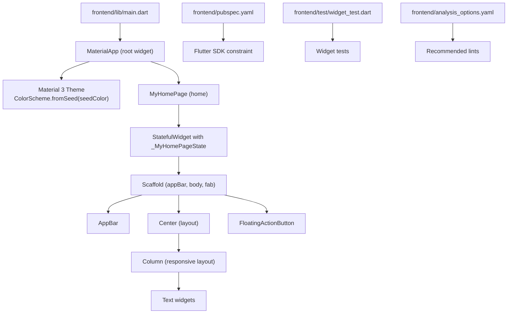
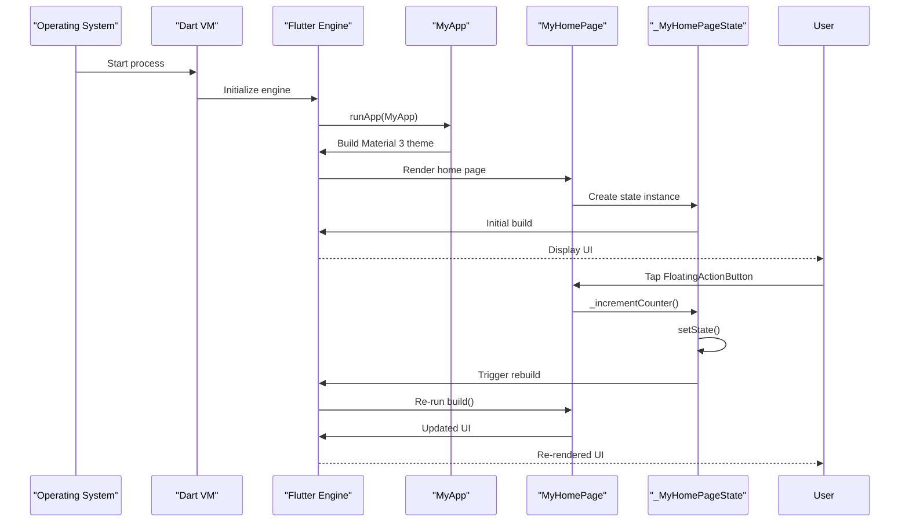
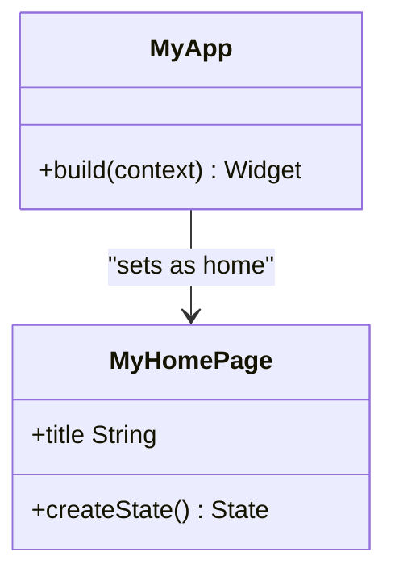
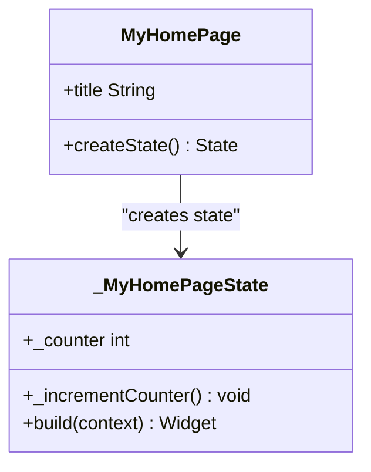
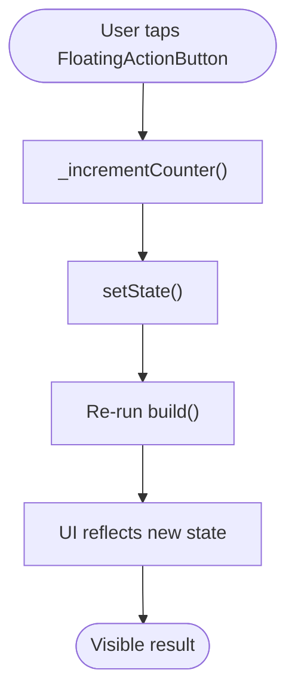
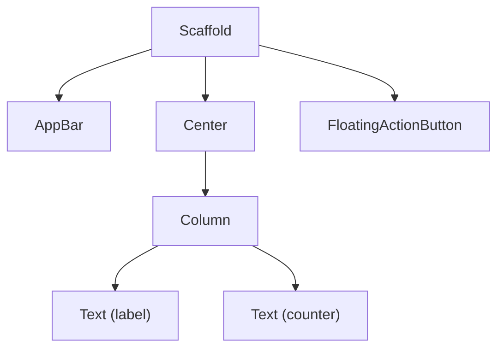
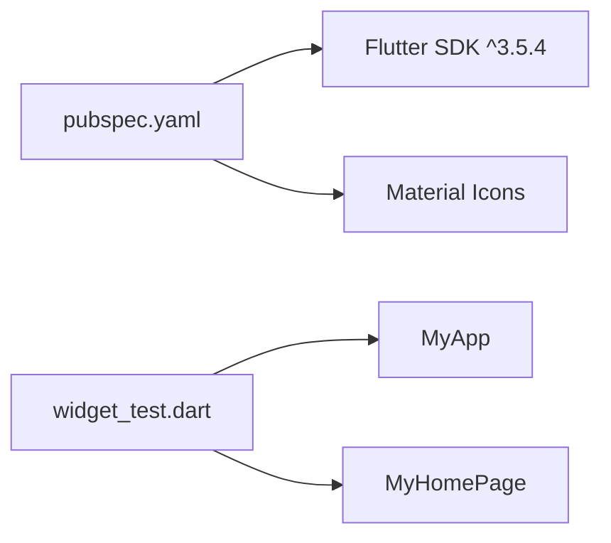

# Flutter Fundamentals

<cite>
**Referenced Files in This Document**
- [main.dart](file://frontend/lib/main.dart)
- [pubspec.yaml](file://frontend/pubspec.yaml)
- [widget_test.dart](file://frontend/test/widget_test.dart)
- [README.md](file://frontend/README.md)
- [analysis_options.yaml](file://frontend/analysis_options.yaml)
</cite>

## Table of Contents
1. [Introduction](#introduction)
2. [Project Structure](#project-structure)
3. [Core Components](#core-components)
4. [Architecture Overview](#architecture-overview)
5. [Detailed Component Analysis](#detailed-component-analysis)
6. [Dependency Analysis](#dependency-analysis)
7. [Performance Considerations](#performance-considerations)
8. [Troubleshooting Guide](#troubleshooting-guide)
9. [Conclusion](#conclusion)
10. [Appendices](#appendices)

## Introduction
This document explains Flutter fundamentals using the provided social media app codebase. It covers the widget-based architecture, the build method pattern, state management via StatelessWidget and StatefulWidget, Material Design principles with Material 3, the application entry point, and how the MyApp widget initializes the app. It also demonstrates reactive UI updates, the widget tree hierarchy, and practical examples of theming and responsive design. Finally, it describes Flutter’s hot reload workflow and development practices.

## Project Structure
The Flutter project is organized around a small but instructive example that showcases core concepts:
- Application entry point: main.dart
- Package configuration: pubspec.yaml
- Tests: widget_test.dart
- Linting configuration: analysis_options.yaml
- Project overview: README.md

**Diagram sources**
- [main.dart:1-126](file://frontend/lib/main.dart#L1-L126)
- [pubspec.yaml:1-91](file://frontend/pubspec.yaml#L1-L91)
- [widget_test.dart:1-31](file://frontend/test/widget_test.dart#L1-L31)
- [analysis_options.yaml:1-29](file://frontend/analysis_options.yaml#L1-L29)

**Section sources**
- [main.dart:1-126](file://frontend/lib/main.dart#L1-L126)
- [pubspec.yaml:1-91](file://frontend/pubspec.yaml#L1-L91)
- [README.md:1-17](file://frontend/README.md#L1-L17)

## Core Components
This section introduces the foundational Flutter concepts demonstrated in the codebase.

- Application entry point and initialization
  - The app starts at the main function, which calls runApp with the root widget MyApp. This establishes the widget tree and triggers the first build.
  - Reference: [main.dart:3-5](file://frontend/lib/main.dart#L3-L5)

- Root widget: MyApp (StatelessWidget)
  - MyApp is a StatelessWidget that defines the app’s theme and sets the home page.
  - It configures Material 3 with a dynamic ColorScheme derived from a seed color and enables Material 3.
  - Reference: [main.dart:7-37](file://frontend/lib/main.dart#L7-L37)

- Home page: MyHomePage (StatefulWidget)
  - MyHomePage is a StatefulWidget with a corresponding State class (_MyHomePageState).
  - It maintains a counter field and exposes a method to increment it, calling setState to trigger a rebuild.
  - Reference: [main.dart:39-55](file://frontend/lib/main.dart#L39-L55), [main.dart:57-69](file://frontend/lib/main.dart#L57-L69)

- Reactive UI and build method pattern
  - The build method runs whenever the framework determines the UI needs to update.
  - In this example, tapping the FloatingActionButton invokes setState, which causes the build method to rerun and update the UI.
  - Reference: [main.dart:71-125](file://frontend/lib/main.dart#L71-L125)

- Layout and responsive design
  - The home page uses Scaffold, AppBar, Center, and Column to arrange content responsively.
  - Column uses mainAxisAlignment to center children vertically, demonstrating a responsive layout pattern.
  - Reference: [main.dart:79-124](file://frontend/lib/main.dart#L79-L124)

- Theming with Material 3
  - The app applies Material 3 by setting useMaterial3 to true and deriving a ColorScheme from a seed color.
  - UI elements like AppBar and Text use Theme data to maintain visual consistency.
  - Reference: [main.dart:13-36](file://frontend/lib/main.dart#L13-L36), [main.dart:84](file://frontend/lib/main.dart#L84), [main.dart:113](file://frontend/lib/main.dart#L113)

**Section sources**
- [main.dart:3-5](file://frontend/lib/main.dart#L3-L5)
- [main.dart:7-37](file://frontend/lib/main.dart#L7-L37)
- [main.dart:39-55](file://frontend/lib/main.dart#L39-L55)
- [main.dart:57-69](file://frontend/lib/main.dart#L57-L69)
- [main.dart:71-125](file://frontend/lib/main.dart#L71-L125)
- [main.dart:79-124](file://frontend/lib/main.dart#L79-L124)
- [main.dart:13-36](file://frontend/lib/main.dart#L13-L36)

## Architecture Overview
The app follows a classic Flutter architecture:
- Entry point initializes the app with a root widget.
- MyApp configures the theme and navigation target.
- MyHomePage renders the primary screen and manages local state.
- The framework rebuilds widgets reactively when state changes.

**Diagram sources**
- [main.dart:3-5](file://frontend/lib/main.dart#L3-L5)
- [main.dart:7-37](file://frontend/lib/main.dart#L7-L37)
- [main.dart:39-55](file://frontend/lib/main.dart#L39-L55)
- [main.dart:57-69](file://frontend/lib/main.dart#L57-L69)
- [main.dart:71-125](file://frontend/lib/main.dart#L71-L125)

## Detailed Component Analysis

### MyApp: Application Root and Theme
- Purpose: Defines the app’s global theme and sets the initial route/home page.
- Material 3: Enables Material 3 and derives a ColorScheme from a seed color for consistent theming.
- Home page: Sets the home screen to MyHomePage with a title prop passed down.

**Diagram sources**
- [main.dart:7-37](file://frontend/lib/main.dart#L7-L37)
- [main.dart:39-55](file://frontend/lib/main.dart#L39-L55)

**Section sources**
- [main.dart:7-37](file://frontend/lib/main.dart#L7-L37)
- [main.dart:39-55](file://frontend/lib/main.dart#L39-L55)

### MyHomePage: StatefulWidget and Local State
- Purpose: Demonstrates stateful UI with a counter managed locally.
- State management: Uses setState to update internal state and trigger rebuilds.
- UI composition: Uses Scaffold, AppBar, Center, Column, Text, and FloatingActionButton.

**Diagram sources**
- [main.dart:39-55](file://frontend/lib/main.dart#L39-L55)
- [main.dart:57-69](file://frontend/lib/main.dart#L57-L69)

**Section sources**
- [main.dart:39-55](file://frontend/lib/main.dart#L39-L55)
- [main.dart:57-69](file://frontend/lib/main.dart#L57-L69)
- [main.dart:71-125](file://frontend/lib/main.dart#L71-L125)

### Reactive Updates and Hot Reload Workflow
- setState triggers a rebuild of the widget subtree.
- Hot reload preserves application state while applying code changes instantly.
- Tests demonstrate verifying UI updates after state changes.

**Diagram sources**
- [main.dart:60-69](file://frontend/lib/main.dart#L60-L69)
- [main.dart:71-125](file://frontend/lib/main.dart#L71-L125)

**Section sources**
- [main.dart:60-69](file://frontend/lib/main.dart#L60-L69)
- [main.dart:71-125](file://frontend/lib/main.dart#L71-L125)
- [widget_test.dart:13-30](file://frontend/test/widget_test.dart#L13-L30)

### Widget Composition and Responsive Patterns
- Scaffold provides a complete app shell with top app bar, body, and floating action button.
- Center and Column create a vertically centered, responsive layout.
- Text widgets adapt to theme-provided typography.

**Diagram sources**
- [main.dart:79-124](file://frontend/lib/main.dart#L79-L124)

**Section sources**
- [main.dart:79-124](file://frontend/lib/main.dart#L79-L124)

## Dependency Analysis
- Flutter SDK: The project targets a specific SDK version to ensure compatibility.
- Material icons: The project uses Material icons via the Material package.
- Testing: The test suite exercises the UI and verifies state-driven updates.

**Diagram sources**
- [pubspec.yaml:21-48](file://frontend/pubspec.yaml#L21-L48)
- [widget_test.dart:8-11](file://frontend/test/widget_test.dart#L8-L11)

**Section sources**
- [pubspec.yaml:21-48](file://frontend/pubspec.yaml#L21-L48)
- [widget_test.dart:8-11](file://frontend/test/widget_test.dart#L8-L11)

## Performance Considerations
- Rebuild optimization: Flutter optimizes rebuild performance, enabling developers to rebuild subtrees efficiently when state changes.
- Material 3: Using Material 3 with a dynamic ColorScheme helps maintain consistent visuals and reduces manual theming overhead.
- Layout primitives: Prefer lightweight layout widgets (Center, Column) for simple screens to keep the build cost low.

[No sources needed since this section provides general guidance]

## Troubleshooting Guide
- Verifying state changes: Use widget tests to assert UI updates after state mutations.
- Linting: Recommended lints improve code quality and consistency.
- Getting started: The project README links to official Flutter resources for learning and troubleshooting.

**Section sources**
- [widget_test.dart:13-30](file://frontend/test/widget_test.dart#L13-L30)
- [analysis_options.yaml:8-29](file://frontend/analysis_options.yaml#L8-L29)
- [README.md:9-16](file://frontend/README.md#L9-L16)

## Conclusion
This codebase demonstrates Flutter’s core concepts in a concise form: a root StatelessWidget configures the theme and navigation, a StatefulWidget manages local state, and the reactive framework updates the UI through setState and rebuilds. Material 3 theming and responsive layouts are applied using standard Flutter widgets. The test suite validates state-driven UI behavior, and the project’s configuration supports a smooth development workflow with linting and SDK constraints.

[No sources needed since this section summarizes without analyzing specific files]

## Appendices
- Development workflow highlights:
  - Entry point: main initializes the app with runApp.
  - Hot reload: Preserves state while applying code changes.
  - Tests: widget_test.dart validates UI behavior after state changes.

**Section sources**
- [main.dart:3-5](file://frontend/lib/main.dart#L3-L5)
- [widget_test.dart:13-30](file://frontend/test/widget_test.dart#L13-L30)