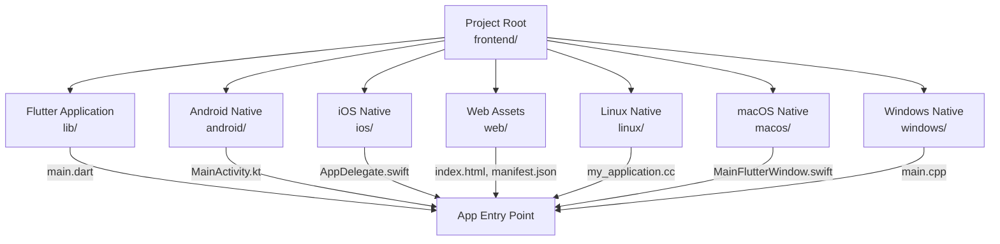
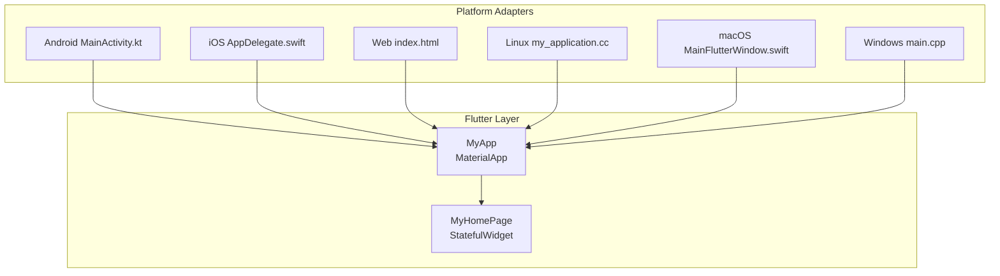
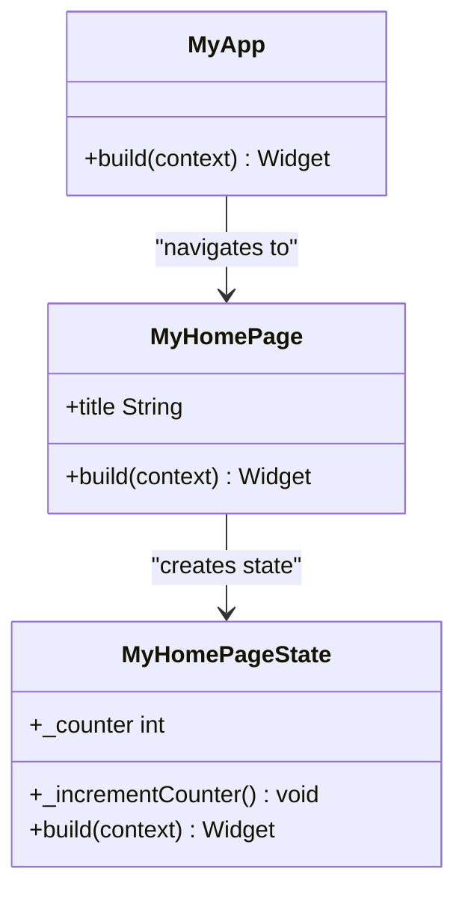
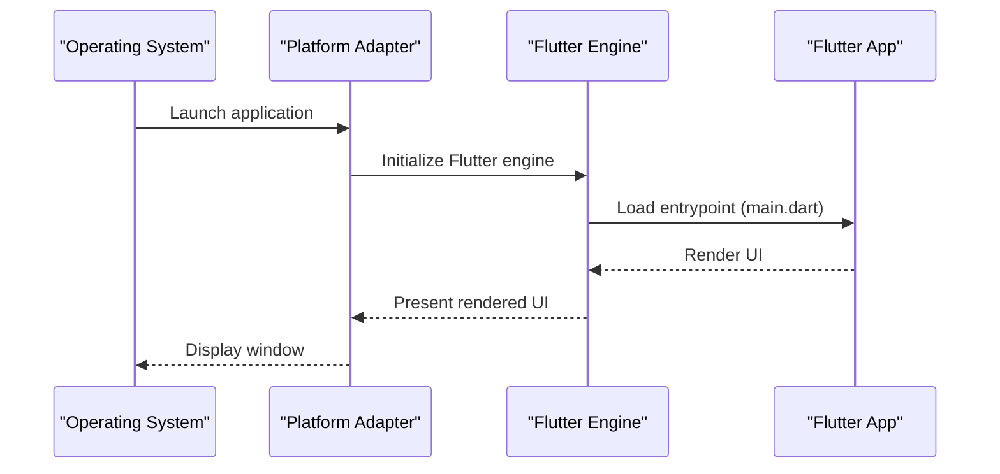
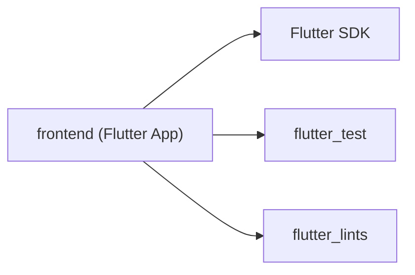
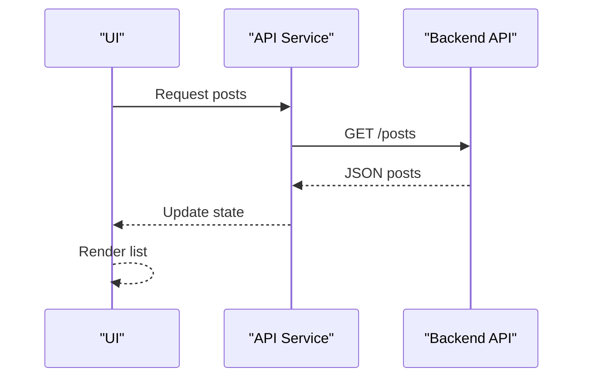

# Frontend Development

<cite>
**Referenced Files in This Document**
- [main.dart](file://frontend/lib/main.dart)
- [pubspec.yaml](file://frontend/pubspec.yaml)
- [README.md](file://frontend/README.md)
- [analysis_options.yaml](file://frontend/analysis_options.yaml)
- [widget_test.dart](file://frontend/test/widget_test.dart)
- [MainActivity.kt](file://frontend/android/app/src/main/kotlin/com/example/frontend/MainActivity.kt)
- [AppDelegate.swift](file://frontend/ios/Runner/AppDelegate.swift)
- [index.html](file://frontend/web/index.html)
- [manifest.json](file://frontend/web/manifest.json)
- [my_application.cc](file://frontend/linux/my_application.cc)
- [MainFlutterWindow.swift](file://frontend/macos/Runner/MainFlutterWindow.swift)
- [main.cpp](file://frontend/windows/runner/main.cpp)
</cite>

## Table of Contents
1. [Introduction](#introduction)
2. [Project Structure](#project-structure)
3. [Core Components](#core-components)
4. [Architecture Overview](#architecture-overview)
5. [Detailed Component Analysis](#detailed-component-analysis)
6. [Dependency Analysis](#dependency-analysis)
7. [Performance Considerations](#performance-considerations)
8. [Troubleshooting Guide](#troubleshooting-guide)
9. [Conclusion](#conclusion)
10. [Appendices](#appendices)

## Introduction
This document provides comprehensive frontend development guidance for a Flutter-based social media application. It covers the Flutter application structure, widget hierarchy, navigation patterns, and state management approaches. It also documents platform-specific implementations for Android, iOS, Web, Linux, macOS, and Windows, along with UI component development guidelines, responsive design patterns, cross-platform considerations, backend API integration, authentication flows, real-time features, styling and theming, asset management, performance optimization, platform-specific configurations, build processes, and deployment strategies.

## Project Structure
The frontend project is organized into platform-specific native entry points and shared Flutter code. The structure supports building for six platforms: Android, iOS, Web, Linux, macOS, and Windows. Shared application logic resides under the Flutter lib directory, while platform-specific configurations live under android/, ios/, web/, linux/, macos/, and windows/.

**Diagram sources**
- [main.dart](file://frontend/lib/main.dart)
- [MainActivity.kt](file://frontend/android/app/src/main/kotlin/com/example/frontend/MainActivity.kt)
- [AppDelegate.swift](file://frontend/ios/Runner/AppDelegate.swift)
- [index.html](file://frontend/web/index.html)
- [manifest.json](file://frontend/web/manifest.json)
- [my_application.cc](file://frontend/linux/my_application.cc)
- [MainFlutterWindow.swift](file://frontend/macos/Runner/MainFlutterWindow.swift)
- [main.cpp](file://frontend/windows/runner/main.cpp)

**Section sources**
- [README.md](file://frontend/README.md)
- [pubspec.yaml](file://frontend/pubspec.yaml)

## Core Components
The core application entry point initializes the app with a Material theme and a home page. The home page demonstrates stateful widget behavior and Material components.

- Application bootstrap and theme configuration
  - The app sets up a Material theme with Material 3 and a seed color scheme.
  - The home page is configured as the initial route.
  - Reference: [main.dart](file://frontend/lib/main.dart)

- Stateful home page
  - Demonstrates a stateful widget with a counter and a floating action button.
  - Shows how setState triggers rebuilds and updates the UI.
  - Reference: [main.dart](file://frontend/lib/main.dart)

- Testing and quality
  - A smoke test verifies the counter increments after tapping the floating action button.
  - Lint rules are enforced via analysis_options.yaml.
  - References:
    - [widget_test.dart](file://frontend/test/widget_test.dart)
    - [analysis_options.yaml](file://frontend/analysis_options.yaml)

**Section sources**
- [main.dart](file://frontend/lib/main.dart)
- [widget_test.dart](file://frontend/test/widget_test.dart)
- [analysis_options.yaml](file://frontend/analysis_options.yaml)

## Architecture Overview
The Flutter app follows a conventional structure with a root widget that configures the theme and routing, and a home page that manages local state. Platform adapters (native entry points) initialize the Flutter engine and hand off control to the Flutter app.

**Diagram sources**
- [main.dart](file://frontend/lib/main.dart)
- [MainActivity.kt](file://frontend/android/app/src/main/kotlin/com/example/frontend/MainActivity.kt)
- [AppDelegate.swift](file://frontend/ios/Runner/AppDelegate.swift)
- [index.html](file://frontend/web/index.html)
- [my_application.cc](file://frontend/linux/my_application.cc)
- [MainFlutterWindow.swift](file://frontend/macos/Runner/MainFlutterWindow.swift)
- [main.cpp](file://frontend/windows/runner/main.cpp)

## Detailed Component Analysis

### Application Entry and Theme
- Material theme configuration
  - Uses Material 3 with a seed-based color scheme.
  - Applies a global theme to the app.
  - Reference: [main.dart](file://frontend/lib/main.dart)

- Home page scaffold
  - Includes an app bar, centered column layout, and a floating action button.
  - Demonstrates state updates via setState.
  - Reference: [main.dart](file://frontend/lib/main.dart)

**Diagram sources**
- [main.dart](file://frontend/lib/main.dart)

**Section sources**
- [main.dart](file://frontend/lib/main.dart)

### Navigation Patterns
- Single-route demonstration
  - The current implementation sets a single home route.
  - For a social media app, introduce a router to manage multiple screens (e.g., Feed, Profile, Notifications).
  - Consider using named routes or a navigation controller to manage transitions.
  - Reference: [main.dart](file://frontend/lib/main.dart)

### State Management Approaches
- Local state with setState
  - Demonstrated by the counter increment in the home page.
  - Suitable for small, isolated UI state.
  - Reference: [main.dart](file://frontend/lib/main.dart)

- Recommended patterns for a social media app
  - Provider/ChangeNotifier for reactive UI updates.
  - Riverpod for scalable, testable state.
  - Bloc/Cubit for complex business logic.
  - References:
    - [main.dart](file://frontend/lib/main.dart)
    - [analysis_options.yaml](file://frontend/analysis_options.yaml)

### Platform-Specific Implementations

#### Android
- Activity configuration
  - MainActivity extends FlutterActivity to embed Flutter in a native Android activity.
  - Reference: [MainActivity.kt](file://frontend/android/app/src/main/kotlin/com/example/frontend/MainActivity.kt)

- Build and packaging
  - Gradle scripts define dependencies and build variants.
  - Manifest entries configure app metadata and permissions.
  - References:
    - [MainActivity.kt](file://frontend/android/app/src/main/kotlin/com/example/frontend/MainActivity.kt)

#### iOS
- App lifecycle
  - AppDelegate registers plugins and handles app launch.
  - Reference: [AppDelegate.swift](file://frontend/ios/Runner/AppDelegate.swift)

- Asset catalogs and Info.plist
  - App icons and launch screens are configured via XCAssets and Info.plist.
  - References:
    - [AppDelegate.swift](file://frontend/ios/Runner/AppDelegate.swift)

#### Web
- HTML shell
  - index.html sets up base href, meta tags, manifest, and script loading for Flutter.
  - Reference: [index.html](file://frontend/web/index.html)

- Progressive Web App (PWA)
  - manifest.json defines app metadata, display mode, theme colors, and icon assets.
  - Reference: [manifest.json](file://frontend/web/manifest.json)

#### Linux
- GTK window integration
  - my_application.cc creates a GTK window, sets up a header bar, and hosts the Flutter view.
  - Reference: [my_application.cc](file://frontend/linux/my_application.cc)

#### macOS
- NSWindow integration
  - MainFlutterWindow initializes a FlutterViewController and registers plugins.
  - Reference: [MainFlutterWindow.swift](file://frontend/macos/Runner/MainFlutterWindow.swift)

#### Windows
- Win32 window integration
  - main.cpp initializes COM, creates a Flutter window, and runs the message loop.
  - Reference: [main.cpp](file://frontend/windows/runner/main.cpp)

**Diagram sources**
- [main.dart](file://frontend/lib/main.dart)
- [MainActivity.kt](file://frontend/android/app/src/main/kotlin/com/example/frontend/MainActivity.kt)
- [AppDelegate.swift](file://frontend/ios/Runner/AppDelegate.swift)
- [index.html](file://frontend/web/index.html)
- [my_application.cc](file://frontend/linux/my_application.cc)
- [MainFlutterWindow.swift](file://frontend/macos/Runner/MainFlutterWindow.swift)
- [main.cpp](file://frontend/windows/runner/main.cpp)

**Section sources**
- [MainActivity.kt](file://frontend/android/app/src/main/kotlin/com/example/frontend/MainActivity.kt)
- [AppDelegate.swift](file://frontend/ios/Runner/AppDelegate.swift)
- [index.html](file://frontend/web/index.html)
- [manifest.json](file://frontend/web/manifest.json)
- [my_application.cc](file://frontend/linux/my_application.cc)
- [MainFlutterWindow.swift](file://frontend/macos/Runner/MainFlutterWindow.swift)
- [main.cpp](file://frontend/windows/runner/main.cpp)

### UI Component Development Guidelines
- Material 3 compliance
  - Use Material 3 components and dynamic color theming.
  - Reference: [main.dart](file://frontend/lib/main.dart)

- Responsive layouts
  - Prefer flexible layouts (Column, Row, LayoutBuilder) to adapt to varying screen sizes.
  - Use MediaQuery to adjust spacing and typography.

- Accessibility
  - Provide semantic labels and contrast ratios aligned with the theme.
  - Reference: [main.dart](file://frontend/lib/main.dart)

- Reusability
  - Extract common UI into reusable widgets and pass data via strongly-typed constructors.

### Styling and Theming
- Global theme
  - Configure colorScheme and useMaterial3 in MaterialApp.
  - Reference: [main.dart](file://frontend/lib/main.dart)

- Typography and spacing
  - Leverage Theme.of(context).textTheme and consistent padding/sizing tokens.

- Platform-specific themes
  - Respect platform conventions (e.g., iOS status bar styles, macOS title bars).

### Asset Management
- Adding assets
  - Use the assets section in pubspec.yaml to declare images and fonts.
  - Reference: [pubspec.yaml](file://frontend/pubspec.yaml)

- Resolution-aware images
  - Provide multiple resolutions for crisp rendering on high-DPI displays.
  - Reference: [pubspec.yaml](file://frontend/pubspec.yaml)

- Fonts
  - Add custom fonts under the fonts section in pubspec.yaml.
  - Reference: [pubspec.yaml](file://frontend/pubspec.yaml)

### Backend API Integration
- HTTP client
  - Use a dedicated service layer to encapsulate API calls (e.g., Dio, http).
  - Manage base URLs, headers, and interceptors centrally.

- Authentication flows
  - Token storage (secure storage) and refresh strategies.
  - Protected routes and automatic logout on token expiration.

- Real-time features
  - WebSocket or server-sent events for live updates.
  - State synchronization with local cache.

### Real-Time Features
- Event-driven UI updates
  - Subscribe to streams or channels and update state accordingly.
  - Debounce or batch updates to maintain performance.

- Offline-first strategies
  - Queue pending actions and sync when connectivity resumes.

### Performance Optimization
- Build variants
  - Use release builds for production deployments.
  - Enable tree shaking and minification.

- Rendering performance
  - Use const constructors where possible.
  - Avoid unnecessary rebuilds with keys and immutable widgets.

- Memory management
  - Dispose of subscriptions and timers.
  - Use lazy loading for lists and grids.

- Network optimization
  - Implement caching, compression, and efficient pagination.

### Cross-Platform Considerations
- Feature parity
  - Abstract platform-specific code behind interfaces.
  - Use conditional compilation or platform channels sparingly.

- Platform conventions
  - Respect platform UX patterns (e.g., bottom navigation on mobile, sidebar on desktop).

- Build and deployment
  - Automate builds per platform with CI/CD pipelines.

## Dependency Analysis
The project’s dependencies are minimal in the provided configuration, focusing on Flutter SDK and testing. For a social media app, expand dependencies to include networking, state management, and platform-specific plugins.

**Diagram sources**
- [pubspec.yaml](file://frontend/pubspec.yaml)

**Section sources**
- [pubspec.yaml](file://frontend/pubspec.yaml)

## Performance Considerations
- Optimize widget trees
  - Keep rebuild scopes narrow; use const widgets and keys.
- Minimize allocations
  - Reuse objects and avoid closures in build methods.
- Efficient asset loading
  - Preload critical assets and use placeholders.
- Network efficiency
  - Compress payloads, implement caching, and handle retries gracefully.

## Troubleshooting Guide
- Hot reload and restart
  - State resets on restart; use hot reload for iterative development.
  - Reference: [main.dart](file://frontend/lib/main.dart)

- Tests
  - Run widget tests to verify UI behavior.
  - Reference: [widget_test.dart](file://frontend/test/widget_test.dart)

- Linting
  - Enforce code quality with flutter_lints.
  - Reference: [analysis_options.yaml](file://frontend/analysis_options.yaml)

- Platform-specific issues
  - Android: Ensure MainActivity extends FlutterActivity.
    - Reference: [MainActivity.kt](file://frontend/android/app/src/main/kotlin/com/example/frontend/MainActivity.kt)
  - iOS: Register plugins in AppDelegate.
    - Reference: [AppDelegate.swift](file://frontend/ios/Runner/AppDelegate.swift)
  - Web: Verify base href and manifest configuration.
    - References:
      - [index.html](file://frontend/web/index.html)
      - [manifest.json](file://frontend/web/manifest.json)
  - Linux/macOS/Windows: Confirm native entry points initialize the Flutter engine.
    - References:
      - [my_application.cc](file://frontend/linux/my_application.cc)
      - [MainFlutterWindow.swift](file://frontend/macos/Runner/MainFlutterWindow.swift)
      - [main.cpp](file://frontend/windows/runner/main.cpp)

**Section sources**
- [main.dart](file://frontend/lib/main.dart)
- [widget_test.dart](file://frontend/test/widget_test.dart)
- [analysis_options.yaml](file://frontend/analysis_options.yaml)
- [MainActivity.kt](file://frontend/android/app/src/main/kotlin/com/example/frontend/MainActivity.kt)
- [AppDelegate.swift](file://frontend/ios/Runner/AppDelegate.swift)
- [index.html](file://frontend/web/index.html)
- [manifest.json](file://frontend/web/manifest.json)
- [my_application.cc](file://frontend/linux/my_application.cc)
- [MainFlutterWindow.swift](file://frontend/macos/Runner/MainFlutterWindow.swift)
- [main.cpp](file://frontend/windows/runner/main.cpp)

## Conclusion
This document outlined the Flutter application structure, state management, navigation, and platform-specific implementations for Android, iOS, Web, Linux, macOS, and Windows. It provided guidance on UI development, theming, assets, backend integration, real-time features, performance, and troubleshooting. For a production social media app, extend the architecture with robust state management, modular UI components, secure authentication, and scalable backend integration.

## Appendices

### Build and Deployment Strategies
- Android
  - Use Gradle to assemble debug/release APK/APKs.
  - Configure signing for release builds.
  - Reference: [MainActivity.kt](file://frontend/android/app/src/main/kotlin/com/example/frontend/MainActivity.kt)

- iOS
  - Archive via Xcode or xcodebuild; export for distribution.
  - Manage provisioning profiles and entitlements.
  - Reference: [AppDelegate.swift](file://frontend/ios/Runner/AppDelegate.swift)

- Web
  - Build with flutter build web; host static assets on a CDN or hosting provider.
  - Reference:
    - [index.html](file://frontend/web/index.html)
    - [manifest.json](file://frontend/web/manifest.json)

- Linux
  - Build with flutter build linux; package as DEB/RPM or AppImage.
  - Reference: [my_application.cc](file://frontend/linux/my_application.cc)

- macOS
  - Build with flutter build macos; package as DMG/APP.
  - Reference: [MainFlutterWindow.swift](file://frontend/macos/Runner/MainFlutterWindow.swift)

- Windows
  - Build with flutter build windows; package as installer or ZIP.
  - Reference: [main.cpp](file://frontend/windows/runner/main.cpp)

### Example API Workflow (Sequence)

[No sources needed since this diagram shows a conceptual workflow]