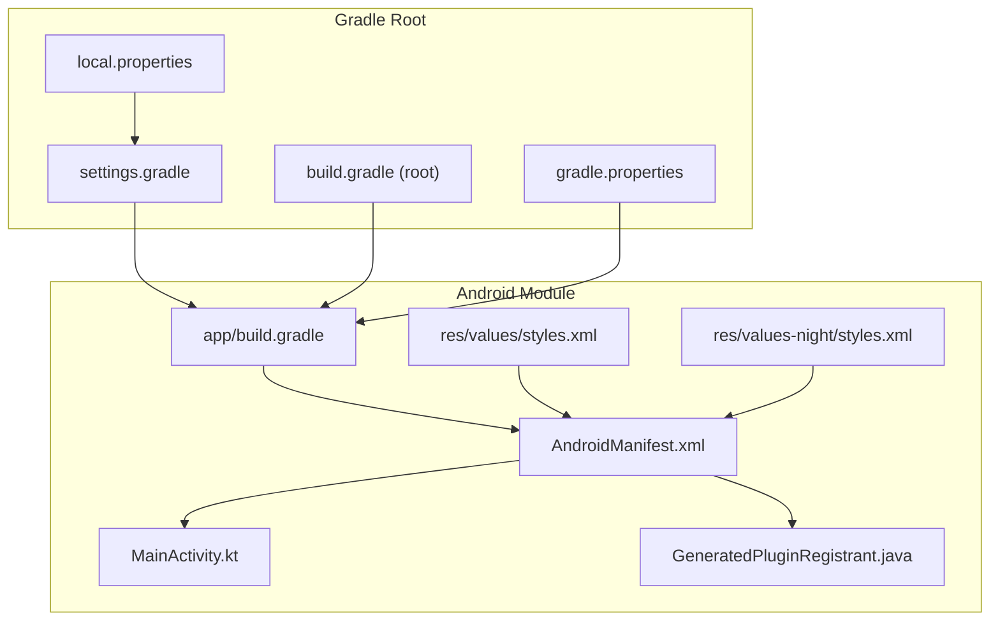
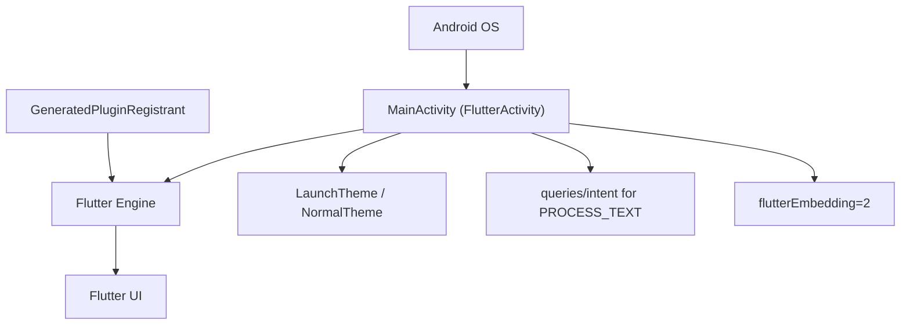
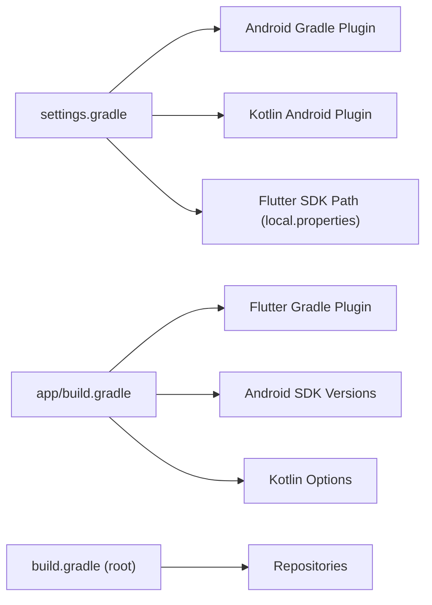

# Android Implementation

<cite>
**Referenced Files in This Document**
- [MainActivity.kt](file://frontend/android/app/src/main/kotlin/com/example/frontend/MainActivity.kt)
- [AndroidManifest.xml](file://frontend/android/app/src/main/AndroidManifest.xml)
- [styles.xml](file://frontend/android/app/src/main/res/values/styles.xml)
- [styles.xml (night)](file://frontend/android/app/src/main/res/values-night/styles.xml)
- [debug AndroidManifest.xml](file://frontend/android/app/src/debug/AndroidManifest.xml)
- [profile AndroidManifest.xml](file://frontend/android/app/src/profile/AndroidManifest.xml)
- [build.gradle (app)](file://frontend/android/app/build.gradle)
- [build.gradle (root)](file://frontend/android/build.gradle)
- [settings.gradle](file://frontend/android/settings.gradle)
- [gradle.properties](file://frontend/android/gradle.properties)
- [GeneratedPluginRegistrant.java](file://frontend/android/app/src/main/java/io/flutter/plugins/GeneratedPluginRegistrant.java)
- [local.properties](file://frontend/android/local.properties)
- [pubspec.yaml](file://frontend/pubspec.yaml)
</cite>

## Table of Contents
1. [Introduction](#introduction)
2. [Project Structure](#project-structure)
3. [Core Components](#core-components)
4. [Architecture Overview](#architecture-overview)
5. [Detailed Component Analysis](#detailed-component-analysis)
6. [Dependency Analysis](#dependency-analysis)
7. [Performance Considerations](#performance-considerations)
8. [Troubleshooting Guide](#troubleshooting-guide)
9. [Conclusion](#conclusion)

## Introduction
This document explains the Android implementation of the Flutter social media app. It focuses on the Android embedding pattern used by the app, the Android manifest configuration, Gradle build setup, resource handling, and integration with Flutter plugins. It also outlines Android-specific UI adaptations, hardware acceleration, and performance characteristics derived from the current configuration.

## Project Structure
The Android module resides under frontend/android and contains:
- The Android application module (app/)
- Gradle configuration files at the root (settings.gradle, build.gradle, gradle.properties)
- Android resources (themes, drawables)
- The main activity configured as a FlutterActivity
- Plugin registration scaffolding

**Diagram sources**
- [build.gradle (app):1-45](file://frontend/android/app/build.gradle#L1-L45)
- [AndroidManifest.xml:1-46](file://frontend/android/app/src/main/AndroidManifest.xml#L1-L46)
- [styles.xml:1-19](file://frontend/android/app/src/main/res/values/styles.xml#L1-L19)
- [styles.xml (night):1-19](file://frontend/android/app/src/main/res/values-night/styles.xml#L1-L19)
- [MainActivity.kt:1-6](file://frontend/android/app/src/main/kotlin/com/example/frontend/MainActivity.kt#L1-L6)
- [GeneratedPluginRegistrant.java:1-20](file://frontend/android/app/src/main/java/io/flutter/plugins/GeneratedPluginRegistrant.java#L1-L20)
- [settings.gradle:1-26](file://frontend/android/settings.gradle#L1-L26)
- [build.gradle (root):1-19](file://frontend/android/build.gradle#L1-L19)
- [gradle.properties:1-4](file://frontend/android/gradle.properties#L1-L4)
- [local.properties:1-2](file://frontend/android/local.properties#L1-L2)

**Section sources**
- [build.gradle (app):1-45](file://frontend/android/app/build.gradle#L1-L45)
- [AndroidManifest.xml:1-46](file://frontend/android/app/src/main/AndroidManifest.xml#L1-L46)
- [styles.xml:1-19](file://frontend/android/app/src/main/res/values/styles.xml#L1-L19)
- [styles.xml (night):1-19](file://frontend/android/app/src/main/res/values-night/styles.xml#L1-L19)
- [MainActivity.kt:1-6](file://frontend/android/app/src/main/kotlin/com/example/frontend/MainActivity.kt#L1-L6)
- [GeneratedPluginRegistrant.java:1-20](file://frontend/android/app/src/main/java/io/flutter/plugins/GeneratedPluginRegistrant.java#L1-L20)
- [settings.gradle:1-26](file://frontend/android/settings.gradle#L1-L26)
- [build.gradle (root):1-19](file://frontend/android/build.gradle#L1-L19)
- [gradle.properties:1-4](file://frontend/android/gradle.properties#L1-L4)
- [local.properties:1-2](file://frontend/android/local.properties#L1-L2)

## Core Components
- MainActivity.kt: Declares the main Android Activity as a FlutterActivity, enabling Flutter’s Android embedding.
- AndroidManifest.xml: Defines the application, activity, themes, intent filters, queries, and Flutter embedding metadata.
- Resource themes: Provide light/dark launch and normal themes for the activity window.
- Gradle configuration: Applies Android and Kotlin plugins, configures SDK versions via Flutter tooling, sets up build types and signing, and integrates the Flutter Gradle plugin.
- Plugin registration: GeneratedPluginRegistrant.java is present but currently registers no plugins; it serves as a placeholder for plugin registration.

**Section sources**
- [MainActivity.kt:1-6](file://frontend/android/app/src/main/kotlin/com/example/frontend/MainActivity.kt#L1-L6)
- [AndroidManifest.xml:1-46](file://frontend/android/app/src/main/AndroidManifest.xml#L1-L46)
- [styles.xml:1-19](file://frontend/android/app/src/main/res/values/styles.xml#L1-L19)
- [styles.xml (night):1-19](file://frontend/android/app/src/main/res/values-night/styles.xml#L1-L19)
- [build.gradle (app):1-45](file://frontend/android/app/build.gradle#L1-L45)
- [GeneratedPluginRegistrant.java:1-20](file://frontend/android/app/src/main/java/io/flutter/plugins/GeneratedPluginRegistrant.java#L1-L20)

## Architecture Overview
The Android app embeds Flutter via FlutterActivity. The activity is declared in the manifest with standard Android configuration changes and hardware acceleration enabled. The Flutter engine initializes the app and applies themes defined in resources. Plugins are registered through GeneratedPluginRegistrant during engine initialization.

**Diagram sources**
- [AndroidManifest.xml:1-46](file://frontend/android/app/src/main/AndroidManifest.xml#L1-L46)
- [MainActivity.kt:1-6](file://frontend/android/app/src/main/kotlin/com/example/frontend/MainActivity.kt#L1-L6)
- [GeneratedPluginRegistrant.java:1-20](file://frontend/android/app/src/main/java/io/flutter/plugins/GeneratedPluginRegistrant.java#L1-L20)

## Detailed Component Analysis

### MainActivity.kt
- Purpose: Extends FlutterActivity to enable Flutter embedding in the Android app.
- Implications: The app uses Flutter’s Android embedding, which influences how the engine initializes, handles lifecycle events, and manages platform channels.

**Section sources**
- [MainActivity.kt:1-6](file://frontend/android/app/src/main/kotlin/com/example/frontend/MainActivity.kt#L1-L6)

### AndroidManifest.xml
- Application metadata: Application label, icon, and Flutter embedding version are declared.
- Activity configuration:
  - Exported for launcher visibility.
  - Single top launch mode with specific task affinity.
  - Hardware acceleration enabled.
  - Comprehensive configChanges covering orientation, keyboard, screen sizes, density, UI mode, and font scale.
  - Soft input mode set to resize the window.
- Themes:
  - NormalTheme meta-data applied to the activity.
- Intent filter: Declares the main launcher action and category.
- Queries: Declares PROCESS_TEXT intent support for text processing.
- GeneratedPluginRegistrant metadata: Included for Flutter tooling.

**Section sources**
- [AndroidManifest.xml:1-46](file://frontend/android/app/src/main/AndroidManifest.xml#L1-L46)

### Resource Themes (Light/Dark)
- LaunchTheme: Provides splash background using a drawable for both light and dark modes.
- NormalTheme: Sets the window background to the system background for both light and dark modes.
- These themes align with Flutter embedding v2 behavior.

**Section sources**
- [styles.xml:1-19](file://frontend/android/app/src/main/res/values/styles.xml#L1-L19)
- [styles.xml (night):1-19](file://frontend/android/app/src/main/res/values-night/styles.xml#L1-L19)

### Gradle Build Configuration
- Plugins:
  - Android Application plugin.
  - Kotlin Android plugin.
  - Flutter Gradle plugin applied after Android/Kotlin.
- Android block:
  - Namespace and compile/target/min SDK from Flutter tooling.
  - Java 8 compatibility for both source and target.
  - Default config mirrors Flutter versioning and SDK selection.
  - Build types:
    - Release type currently inherits debug signing config for convenience.
- Flutter block:
  - Source points to the Flutter project root.

**Section sources**
- [build.gradle (app):1-45](file://frontend/android/app/build.gradle#L1-L45)

### Root and Settings Gradle
- Root build.gradle:
  - Repositories configured.
  - Subprojects share a common build directory layout.
- settings.gradle:
  - Locates Flutter SDK via local.properties.
  - Includes the Flutter tooling build.
  - Declares plugin versions for Android Gradle, Kotlin, and Flutter plugin loader.
  - Includes the app module.

**Section sources**
- [build.gradle (root):1-19](file://frontend/android/build.gradle#L1-L19)
- [settings.gradle:1-26](file://frontend/android/settings.gradle#L1-L26)
- [local.properties:1-2](file://frontend/android/local.properties#L1-L2)

### Debug and Profile Manifests
- Debug and profile manifests declare the INTERNET permission required for development and hot reload.

**Section sources**
- [debug AndroidManifest.xml:1-8](file://frontend/android/app/src/debug/AndroidManifest.xml#L1-L8)
- [profile AndroidManifest.xml:1-8](file://frontend/android/app/src/profile/AndroidManifest.xml#L1-L8)

### Plugin Registration
- GeneratedPluginRegistrant.java exists but currently contains an empty registration method. When plugins are added, they will be registered here during engine initialization.

**Section sources**
- [GeneratedPluginRegistrant.java:1-20](file://frontend/android/app/src/main/java/io/flutter/plugins/GeneratedPluginRegistrant.java#L1-L20)

### Asset and Resource Handling
- pubspec.yaml indicates the app uses Material icons and includes a commented section for assets and fonts. While the current configuration does not define explicit assets, the Flutter tooling will package assets according to the Flutter section in pubspec.yaml.

**Section sources**
- [pubspec.yaml:54-91](file://frontend/pubspec.yaml#L54-L91)

## Dependency Analysis
The Android module depends on:
- AndroidX and Jetifier enabled globally via gradle.properties.
- Android Gradle plugin and Kotlin Android plugin versions declared in settings.gradle.
- Flutter Gradle plugin applied in the app module.
- Local Flutter SDK path resolved via local.properties.

**Diagram sources**
- [settings.gradle:1-26](file://frontend/android/settings.gradle#L1-L26)
- [local.properties:1-2](file://frontend/android/local.properties#L1-L2)
- [build.gradle (app):1-45](file://frontend/android/app/build.gradle#L1-L45)
- [build.gradle (root):1-19](file://frontend/android/build.gradle#L1-L19)

**Section sources**
- [settings.gradle:1-26](file://frontend/android/settings.gradle#L1-L26)
- [build.gradle (app):1-45](file://frontend/android/app/build.gradle#L1-L45)
- [gradle.properties:1-4](file://frontend/android/gradle.properties#L1-L4)
- [local.properties:1-2](file://frontend/android/local.properties#L1-L2)
- [build.gradle (root):1-19](file://frontend/android/build.gradle#L1-L19)

## Performance Considerations
- Hardware acceleration: Enabled at the activity level, improving rendering performance for the Flutter UI.
- Java 8 bytecode compatibility: Ensures modern language features and compatibility with Android SDKs.
- Gradle JVM tuning: Heap and metaspace sizing configured in gradle.properties to reduce OOM risks during builds.
- Build type signing: Release currently uses debug signing for development convenience; production should configure proper release signing.

[No sources needed since this section provides general guidance]

## Troubleshooting Guide
- Internet permission in debug/profile: Ensure INTERNET permission is present in debug and profile manifests for development features.
- Flutter embedding version: Confirm flutterEmbedding metadata is present in the manifest for proper engine initialization.
- Plugin registration: Verify GeneratedPluginRegistrant is updated when adding plugins; otherwise, platform channels may not connect.
- Resource themes: If the launch screen or theme appears incorrect, review LaunchTheme and NormalTheme in values and values-night resource folders.
- Build signing: For distribution, configure a release signingConfig in the app module build types.

**Section sources**
- [debug AndroidManifest.xml:1-8](file://frontend/android/app/src/debug/AndroidManifest.xml#L1-L8)
- [profile AndroidManifest.xml:1-8](file://frontend/android/app/src/profile/AndroidManifest.xml#L1-L8)
- [AndroidManifest.xml:1-46](file://frontend/android/app/src/main/AndroidManifest.xml#L1-L46)
- [GeneratedPluginRegistrant.java:1-20](file://frontend/android/app/src/main/java/io/flutter/plugins/GeneratedPluginRegistrant.java#L1-L20)
- [styles.xml:1-19](file://frontend/android/app/src/main/res/values/styles.xml#L1-L19)
- [styles.xml (night):1-19](file://frontend/android/app/src/main/res/values-night/styles.xml#L1-L19)
- [build.gradle (app):33-39](file://frontend/android/app/build.gradle#L33-L39)

## Conclusion
The Android implementation of the Flutter social media app uses FlutterActivity for embedding, standard Android configuration in the manifest, and Gradle setup aligned with Flutter tooling. The current configuration enables hardware-accelerated rendering, comprehensive configuration change handling, and development-friendly defaults. For production, ensure proper release signing and consider adding plugins and assets as the app evolves.