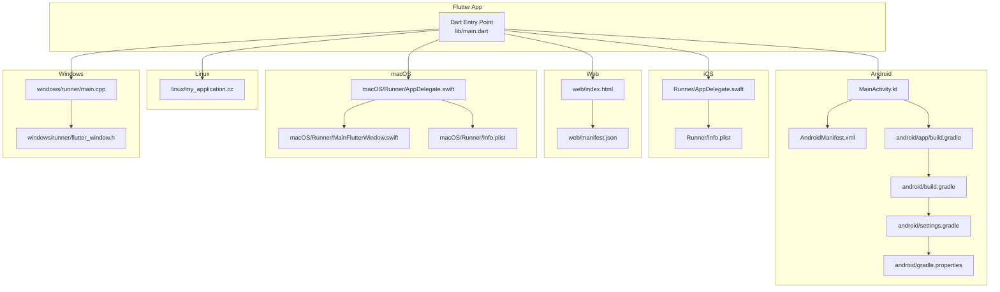
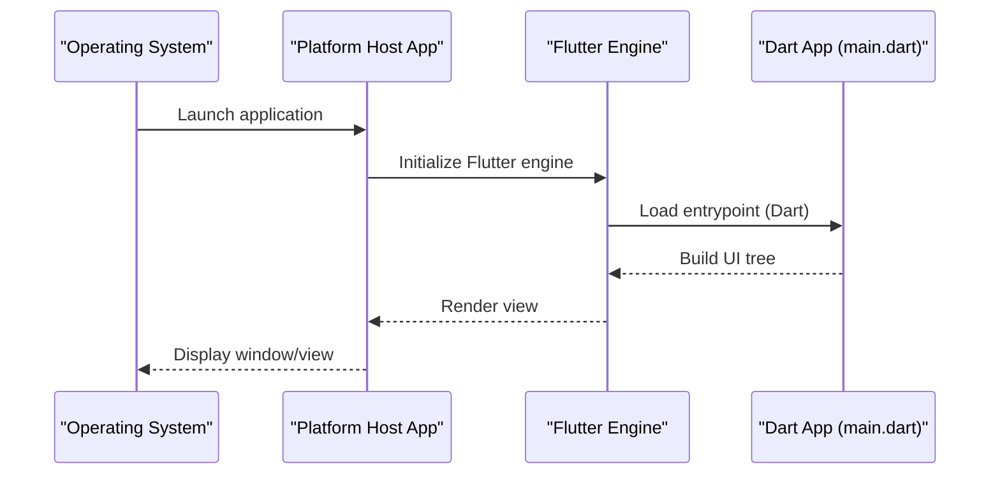
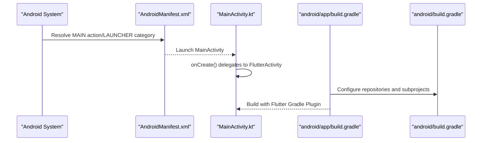
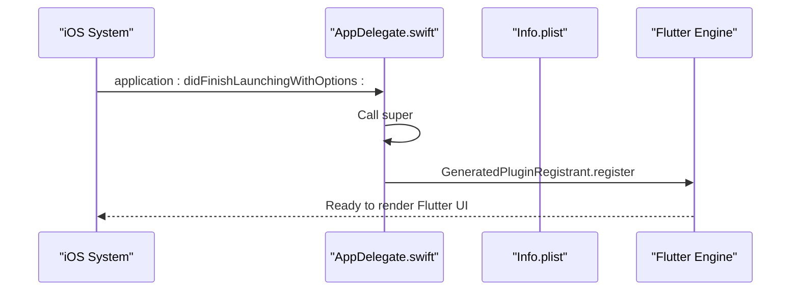
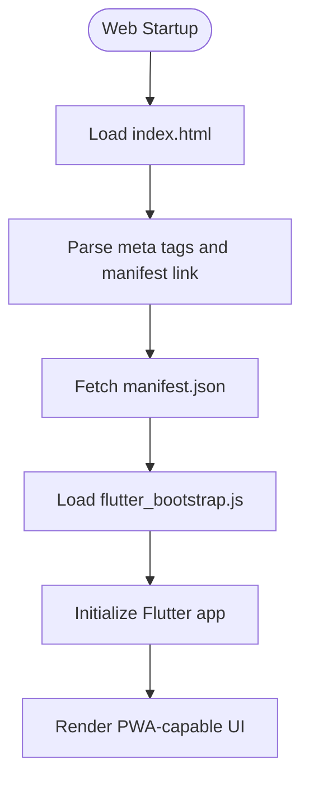
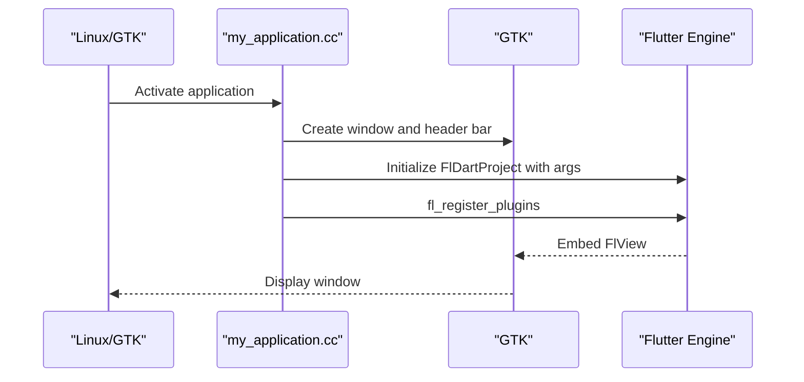
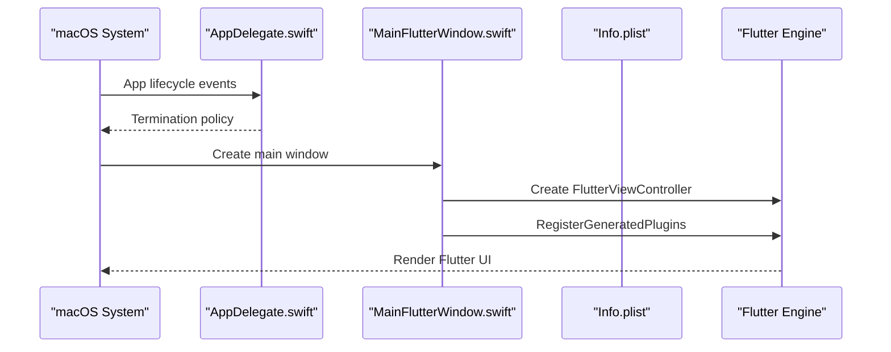
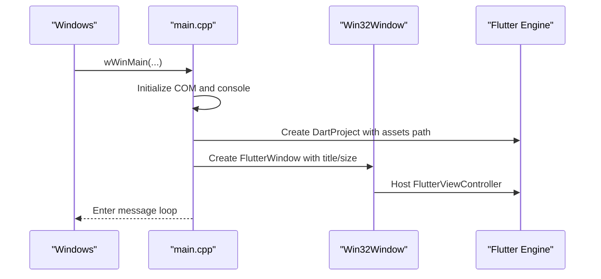
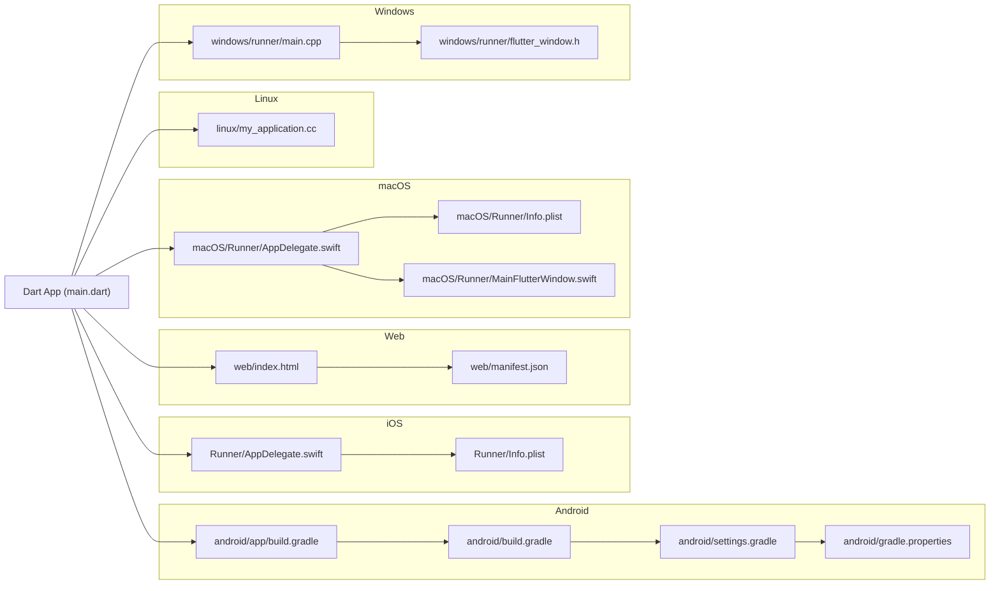

# Platform Implementations

<cite>
**Referenced Files in This Document**
- [main.dart](file://frontend/lib/main.dart)
- [MainActivity.kt](file://frontend/android/app/src/main/kotlin/com/example/frontend/MainActivity.kt)
- [AndroidManifest.xml](file://frontend/android/app/src/main/AndroidManifest.xml)
- [build.gradle (Android App)](file://frontend/android/app/build.gradle)
- [build.gradle (Android Root)](file://frontend/android/build.gradle)
- [gradle.properties](file://frontend/android/gradle.properties)
- [settings.gradle](file://frontend/android/settings.gradle)
- [AppDelegate.swift (iOS)](file://frontend/ios/Runner/AppDelegate.swift)
- [Info.plist (iOS)](file://frontend/ios/Runner/Info.plist)
- [index.html (Web)](file://frontend/web/index.html)
- [manifest.json (Web)](file://frontend/web/manifest.json)
- [my_application.cc (Linux)](file://frontend/linux/my_application.cc)
- [AppDelegate.swift (macOS)](file://frontend/macos/Runner/AppDelegate.swift)
- [MainFlutterWindow.swift (macOS)](file://frontend/macos/Runner/MainFlutterWindow.swift)
- [Info.plist (macOS)](file://frontend/macos/Runner/Info.plist)
- [main.cpp (Windows)](file://frontend/windows/runner/main.cpp)
- [flutter_window.h (Windows)](file://frontend/windows/runner/flutter_window.h)
- [pubspec.yaml](file://frontend/pubspec.yaml)
</cite>

## Table of Contents
1. [Introduction](#introduction)
2. [Project Structure](#project-structure)
3. [Core Components](#core-components)
4. [Architecture Overview](#architecture-overview)
5. [Detailed Component Analysis](#detailed-component-analysis)
6. [Dependency Analysis](#dependency-analysis)
7. [Performance Considerations](#performance-considerations)
8. [Troubleshooting Guide](#troubleshooting-guide)
9. [Conclusion](#conclusion)
10. [Appendices](#appendices)

## Introduction
This document describes the platform implementations for a Flutter social media app across Android, iOS, Web, Linux, macOS, and Windows. It explains how each platform integrates with Flutter, how the app is configured at the OS level, and how platform-specific assets and behaviors are handled. It also outlines cross-platform considerations and how platform channels can be used to communicate between Dart and native code.

## Project Structure
The project is organized into platform-specific folders under the Flutter frontend directory. Each platform provides its own entry points, configuration files, and assets:
- Android: activity, manifest, Gradle build scripts, and Kotlin entry point
- iOS: AppDelegate and Info.plist
- Web: index.html and manifest.json
- Linux: GTK-based application entry point
- macOS: AppDelegate, MainFlutterWindow, and Info.plist
- Windows: Win32 window host and Flutter controller

**Diagram sources**
- [main.dart:1-126](file://frontend/lib/main.dart#L1-L126)
- [MainActivity.kt:1-6](file://frontend/android/app/src/main/kotlin/com/example/frontend/MainActivity.kt#L1-L6)
- [AndroidManifest.xml:1-46](file://frontend/android/app/src/main/AndroidManifest.xml#L1-L46)
- [build.gradle (Android App):1-45](file://frontend/android/app/build.gradle#L1-L45)
- [build.gradle (Android Root):1-19](file://frontend/android/build.gradle#L1-L19)
- [settings.gradle:1-26](file://frontend/android/settings.gradle#L1-L26)
- [gradle.properties:1-4](file://frontend/android/gradle.properties#L1-L4)
- [AppDelegate.swift (iOS):1-14](file://frontend/ios/Runner/AppDelegate.swift#L1-L14)
- [Info.plist (iOS):1-50](file://frontend/ios/Runner/Info.plist#L1-L50)
- [index.html (Web):1-39](file://frontend/web/index.html#L1-L39)
- [manifest.json (Web):1-36](file://frontend/web/manifest.json#L1-L36)
- [my_application.cc (Linux):1-125](file://frontend/linux/my_application.cc#L1-L125)
- [AppDelegate.swift (macOS):1-10](file://frontend/macos/Runner/AppDelegate.swift#L1-L10)
- [MainFlutterWindow.swift (macOS):1-16](file://frontend/macos/Runner/MainFlutterWindow.swift#L1-L16)
- [Info.plist (macOS):1-33](file://frontend/macos/Runner/Info.plist#L1-L33)
- [main.cpp (Windows):1-44](file://frontend/windows/runner/main.cpp#L1-L44)
- [flutter_window.h (Windows):1-34](file://frontend/windows/runner/flutter_window.h#L1-L34)

**Section sources**
- [pubspec.yaml:1-91](file://frontend/pubspec.yaml#L1-L91)

## Core Components
- Dart entry point initializes the app shell and UI.
- Android uses a FlutterActivity as the main entry point and registers plugins via GeneratedPluginRegistrant.
- iOS uses a FlutterAppDelegate and registers plugins in application lifecycle.
- Web relies on index.html and manifest.json for bootstrapping and PWA metadata.
- Linux uses a GTK-based application that hosts the Flutter view.
- macOS uses an AppDelegate and a MainFlutterWindow to embed Flutter.
- Windows uses a Win32 window host to run Flutter.

**Section sources**
- [main.dart:1-126](file://frontend/lib/main.dart#L1-L126)
- [MainActivity.kt:1-6](file://frontend/android/app/src/main/kotlin/com/example/frontend/MainActivity.kt#L1-L6)
- [AndroidManifest.xml:1-46](file://frontend/android/app/src/main/AndroidManifest.xml#L1-L46)
- [AppDelegate.swift (iOS):1-14](file://frontend/ios/Runner/AppDelegate.swift#L1-L14)
- [index.html (Web):1-39](file://frontend/web/index.html#L1-L39)
- [my_application.cc (Linux):1-125](file://frontend/linux/my_application.cc#L1-L125)
- [AppDelegate.swift (macOS):1-10](file://frontend/macos/Runner/AppDelegate.swift#L1-L10)
- [MainFlutterWindow.swift (macOS):1-16](file://frontend/macos/Runner/MainFlutterWindow.swift#L1-L16)
- [main.cpp (Windows):1-44](file://frontend/windows/runner/main.cpp#L1-L44)

## Architecture Overview
The app’s runtime architecture is consistent across platforms: a Dart entry point launches the Flutter engine, which renders the UI. Platform-specific host apps initialize the engine and register plugins. On mobile/desktop, the host app creates the window and embeds the Flutter view; on web, the browser loads the HTML bootstrap script.

**Diagram sources**
- [main.dart:1-126](file://frontend/lib/main.dart#L1-L126)
- [MainActivity.kt:1-6](file://frontend/android/app/src/main/kotlin/com/example/frontend/MainActivity.kt#L1-L6)
- [AppDelegate.swift (iOS):1-14](file://frontend/ios/Runner/AppDelegate.swift#L1-L14)
- [my_application.cc (Linux):1-125](file://frontend/linux/my_application.cc#L1-L125)
- [AppDelegate.swift (macOS):1-10](file://frontend/macos/Runner/AppDelegate.swift#L1-L10)
- [main.cpp (Windows):1-44](file://frontend/windows/runner/main.cpp#L1-L44)

## Detailed Component Analysis

### Android Implementation
- MainActivity.kt extends FlutterActivity, delegating lifecycle to Flutter.
- AndroidManifest.xml declares the main Activity, exported launch intent, hardware acceleration, and embedding metadata. It also declares queries for text processing.
- Gradle configuration sets repositories, buildDir, and evaluation dependencies. The Android app Gradle applies Android/Kotlin plugins and the Flutter Gradle plugin, sets SDK versions from Flutter, and defaults to debug signing for release builds.

**Diagram sources**
- [AndroidManifest.xml:1-46](file://frontend/android/app/src/main/AndroidManifest.xml#L1-L46)
- [MainActivity.kt:1-6](file://frontend/android/app/src/main/kotlin/com/example/frontend/MainActivity.kt#L1-L6)
- [build.gradle (Android App):1-45](file://frontend/android/app/build.gradle#L1-L45)
- [build.gradle (Android Root):1-19](file://frontend/android/build.gradle#L1-L19)

**Section sources**
- [MainActivity.kt:1-6](file://frontend/android/app/src/main/kotlin/com/example/frontend/MainActivity.kt#L1-L6)
- [AndroidManifest.xml:1-46](file://frontend/android/app/src/main/AndroidManifest.xml#L1-L46)
- [build.gradle (Android App):1-45](file://frontend/android/app/build.gradle#L1-L45)
- [build.gradle (Android Root):1-19](file://frontend/android/build.gradle#L1-L19)
- [gradle.properties:1-4](file://frontend/android/gradle.properties#L1-L4)
- [settings.gradle:1-26](file://frontend/android/settings.gradle#L1-L26)

### iOS Implementation
- AppDelegate.swift subclasses FlutterAppDelegate and registers plugins during application launch.
- Info.plist defines bundle identifiers, supported orientations, and enables indirect input events and minimum frame duration on iPhone.

**Diagram sources**
- [AppDelegate.swift (iOS):1-14](file://frontend/ios/Runner/AppDelegate.swift#L1-L14)
- [Info.plist (iOS):1-50](file://frontend/ios/Runner/Info.plist#L1-L50)

**Section sources**
- [AppDelegate.swift (iOS):1-14](file://frontend/ios/Runner/AppDelegate.swift#L1-L14)
- [Info.plist (iOS):1-50](file://frontend/ios/Runner/Info.plist#L1-L50)

### Web Implementation
- index.html sets the base href, PWA-related meta tags, favicon, and loads the Flutter bootstrap script. It references manifest.json for PWA configuration.
- manifest.json defines app name, display mode, background/theme colors, orientation, and icon assets.

**Diagram sources**
- [index.html (Web):1-39](file://frontend/web/index.html#L1-L39)
- [manifest.json (Web):1-36](file://frontend/web/manifest.json#L1-L36)

**Section sources**
- [index.html (Web):1-39](file://frontend/web/index.html#L1-L39)
- [manifest.json (Web):1-36](file://frontend/web/manifest.json#L1-L36)

### Linux Implementation
- The Linux application is a GTK-based host that creates a window, sets a header bar conditionally based on the window manager, initializes a Flutter project with Dart entrypoint arguments, and registers plugins. It links against GTK and Flutter.

**Diagram sources**
- [my_application.cc (Linux):1-125](file://frontend/linux/my_application.cc#L1-L125)

**Section sources**
- [my_application.cc (Linux):1-125](file://frontend/linux/my_application.cc#L1-L125)

### macOS Implementation
- AppDelegate.swift controls termination behavior after the last window closes.
- MainFlutterWindow creates a FlutterViewController and registers plugins during awakeFromNib.
- Info.plist defines bundle metadata and deployment target.

**Diagram sources**
- [AppDelegate.swift (macOS):1-10](file://frontend/macos/Runner/AppDelegate.swift#L1-L10)
- [MainFlutterWindow.swift (macOS):1-16](file://frontend/macos/Runner/MainFlutterWindow.swift#L1-L16)
- [Info.plist (macOS):1-33](file://frontend/macos/Runner/Info.plist#L1-L33)

**Section sources**
- [AppDelegate.swift (macOS):1-10](file://frontend/macos/Runner/AppDelegate.swift#L1-L10)
- [MainFlutterWindow.swift (macOS):1-16](file://frontend/macos/Runner/MainFlutterWindow.swift#L1-L16)
- [Info.plist (macOS):1-33](file://frontend/macos/Runner/Info.plist#L1-L33)

### Windows Implementation
- main.cpp initializes COM, creates a Flutter project with data assets, constructs a Win32 window, and runs the message loop. It sets Dart entrypoint arguments from the command line and configures window size and close behavior.
- flutter_window.h defines the FlutterWindow class that hosts the Flutter view.

**Diagram sources**
- [main.cpp (Windows):1-44](file://frontend/windows/runner/main.cpp#L1-L44)
- [flutter_window.h (Windows):1-34](file://frontend/windows/runner/flutter_window.h#L1-L34)

**Section sources**
- [main.cpp (Windows):1-44](file://frontend/windows/runner/main.cpp#L1-L44)
- [flutter_window.h (Windows):1-34](file://frontend/windows/runner/flutter_window.h#L1-L34)

### Cross-Platform Considerations and Platform Channels
- The app’s Dart entry point is shared across platforms. Platform-specific differences are encapsulated in each platform’s host app and configuration files.
- Platform channels enable communication between Dart and native code. While not shown in the current files, typical usage involves:
  - Declaring MethodChannels in Dart
  - Implementing handlers in each platform’s native code (e.g., Android’s Java/Kotlin, iOS’s Objective-C/Swift, Linux/macOS/Windows C++)
  - Using platform-specific APIs for features like device sensors, file system access, or OS integrations

[No sources needed since this section provides general guidance]

### Platform-Specific Asset Handling
- Android: Resources under res/ (drawables, styles) define launch themes and densities. The manifest references app icon and label.
- iOS: Assets are managed via XCAssets and Info.plist keys for display name and bundle identifiers.
- Web: index.html and manifest.json define PWA metadata and icons; icons are served from web/icons.
- Linux/macOS/Windows: Assets are bundled via Flutter tooling and installed into the application bundle during build.

**Section sources**
- [AndroidManifest.xml:1-46](file://frontend/android/app/src/main/AndroidManifest.xml#L1-L46)
- [Info.plist (iOS):1-50](file://frontend/ios/Runner/Info.plist#L1-L50)
- [index.html (Web):1-39](file://frontend/web/index.html#L1-L39)
- [manifest.json (Web):1-36](file://frontend/web/manifest.json#L1-L36)

## Dependency Analysis
The build and configuration dependencies vary by platform but share common patterns:
- Android Gradle builds depend on Flutter Gradle plugin and Android/Kotlin plugins.
- iOS depends on Flutter tooling and standard Apple frameworks.
- Web depends on HTML and PWA manifests.
- Linux/macOS/Windows depend on Flutter tooling and platform SDKs.

**Diagram sources**
- [main.dart:1-126](file://frontend/lib/main.dart#L1-L126)
- [build.gradle (Android App):1-45](file://frontend/android/app/build.gradle#L1-L45)
- [build.gradle (Android Root):1-19](file://frontend/android/build.gradle#L1-L19)
- [settings.gradle:1-26](file://frontend/android/settings.gradle#L1-L26)
- [gradle.properties:1-4](file://frontend/android/gradle.properties#L1-L4)
- [AppDelegate.swift (iOS):1-14](file://frontend/ios/Runner/AppDelegate.swift#L1-L14)
- [Info.plist (iOS):1-50](file://frontend/ios/Runner/Info.plist#L1-L50)
- [index.html (Web):1-39](file://frontend/web/index.html#L1-L39)
- [manifest.json (Web):1-36](file://frontend/web/manifest.json#L1-L36)
- [my_application.cc (Linux):1-125](file://frontend/linux/my_application.cc#L1-L125)
- [AppDelegate.swift (macOS):1-10](file://frontend/macos/Runner/AppDelegate.swift#L1-L10)
- [MainFlutterWindow.swift (macOS):1-16](file://frontend/macos/Runner/MainFlutterWindow.swift#L1-L16)
- [Info.plist (macOS):1-33](file://frontend/macos/Runner/Info.plist#L1-L33)
- [main.cpp (Windows):1-44](file://frontend/windows/runner/main.cpp#L1-L44)
- [flutter_window.h (Windows):1-34](file://frontend/windows/runner/flutter_window.h#L1-L34)

**Section sources**
- [build.gradle (Android App):1-45](file://frontend/android/app/build.gradle#L1-L45)
- [build.gradle (Android Root):1-19](file://frontend/android/build.gradle#L1-L19)
- [settings.gradle:1-26](file://frontend/android/settings.gradle#L1-L26)
- [gradle.properties:1-4](file://frontend/android/gradle.properties#L1-L4)
- [AppDelegate.swift (iOS):1-14](file://frontend/ios/Runner/AppDelegate.swift#L1-L14)
- [Info.plist (iOS):1-50](file://frontend/ios/Runner/Info.plist#L1-L50)
- [index.html (Web):1-39](file://frontend/web/index.html#L1-L39)
- [manifest.json (Web):1-36](file://frontend/web/manifest.json#L1-L36)
- [my_application.cc (Linux):1-125](file://frontend/linux/my_application.cc#L1-L125)
- [AppDelegate.swift (macOS):1-10](file://frontend/macos/Runner/AppDelegate.swift#L1-L10)
- [MainFlutterWindow.swift (macOS):1-16](file://frontend/macos/Runner/MainFlutterWindow.swift#L1-L16)
- [Info.plist (macOS):1-33](file://frontend/macos/Runner/Info.plist#L1-L33)
- [main.cpp (Windows):1-44](file://frontend/windows/runner/main.cpp#L1-L44)
- [flutter_window.h (Windows):1-34](file://frontend/windows/runner/flutter_window.h#L1-L34)

## Performance Considerations
- Android: Keep hardware acceleration enabled and minimize heavy work on the main thread. Use release builds with appropriate signing and proguard rules.
- iOS: Enable Metal/Vulkan offscreen rendering where applicable and keep animations smooth by avoiding expensive computations on the UI thread.
- Web: Serve compressed assets, leverage PWA caching, and defer non-critical JavaScript until after initial boot.
- Linux/macOS/Windows: Use AOT builds for production, avoid blocking the UI thread, and optimize graphics rendering.

[No sources needed since this section provides general guidance]

## Troubleshooting Guide
- Android
  - Verify MainActivity is exported and the launcher Intent filter is present in the manifest.
  - Ensure Gradle repositories and Flutter plugin versions are aligned.
  - Confirm minSdk/targetSdk align with Flutter SDK expectations.
- iOS
  - Confirm AppDelegate registers plugins and Info.plist keys are set for orientations and capabilities.
- Web
  - Validate base href and manifest.json paths; ensure icons exist at the specified locations.
- Linux/macOS/Windows
  - Ensure Flutter tooling is initialized and plugins are registered in the platform host.
  - Check window creation and message loop initialization.

**Section sources**
- [AndroidManifest.xml:1-46](file://frontend/android/app/src/main/AndroidManifest.xml#L1-L46)
- [build.gradle (Android App):1-45](file://frontend/android/app/build.gradle#L1-L45)
- [AppDelegate.swift (iOS):1-14](file://frontend/ios/Runner/AppDelegate.swift#L1-L14)
- [Info.plist (iOS):1-50](file://frontend/ios/Runner/Info.plist#L1-L50)
- [index.html (Web):1-39](file://frontend/web/index.html#L1-L39)
- [manifest.json (Web):1-36](file://frontend/web/manifest.json#L1-L36)
- [my_application.cc (Linux):1-125](file://frontend/linux/my_application.cc#L1-L125)
- [AppDelegate.swift (macOS):1-10](file://frontend/macos/Runner/AppDelegate.swift#L1-L10)
- [MainFlutterWindow.swift (macOS):1-16](file://frontend/macos/Runner/MainFlutterWindow.swift#L1-L16)
- [main.cpp (Windows):1-44](file://frontend/windows/runner/main.cpp#L1-L44)

## Conclusion
The Flutter social media app is structured to leverage platform-specific strengths while maintaining a unified Dart codebase. Each platform’s host app and configuration files integrate the Flutter engine and register plugins appropriately. Following the platform-specific guidelines ensures reliable builds, correct asset handling, and optimal user experiences across Android, iOS, Web, Linux, macOS, and Windows.

## Appendices
- Versioning and build metadata are defined in pubspec.yaml and propagate to platform-specific identifiers as per Flutter conventions.

**Section sources**
- [pubspec.yaml:1-91](file://frontend/pubspec.yaml#L1-L91)