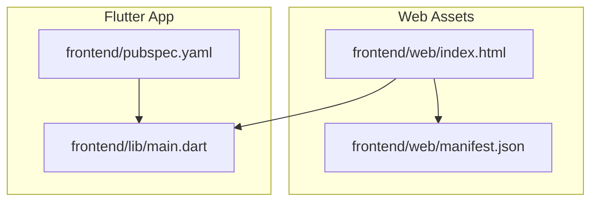
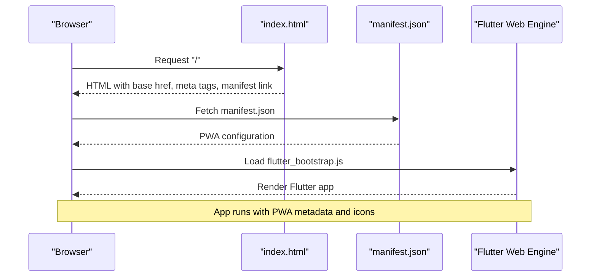
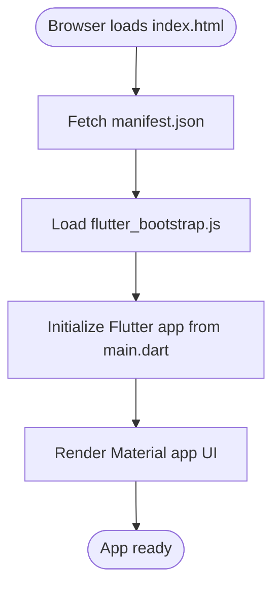
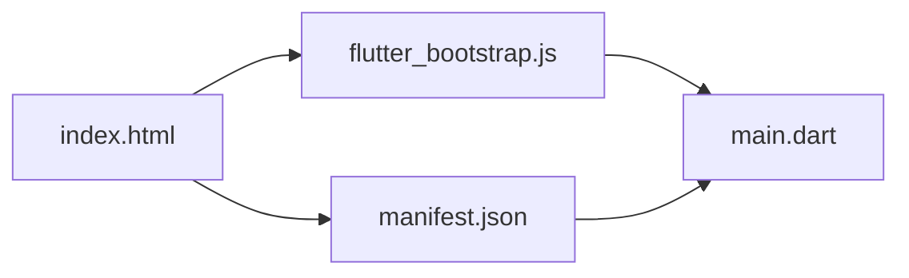

# Web Implementation

<cite>
**Referenced Files in This Document**
- [index.html](file://frontend/web/index.html)
- [manifest.json](file://frontend/web/manifest.json)
- [pubspec.yaml](file://frontend/pubspec.yaml)
- [main.dart](file://frontend/lib/main.dart)
- [README.md](file://frontend/README.md)
</cite>

## Table of Contents
1. [Introduction](#introduction)
2. [Project Structure](#project-structure)
3. [Core Components](#core-components)
4. [Architecture Overview](#architecture-overview)
5. [Detailed Component Analysis](#detailed-component-analysis)
6. [Dependency Analysis](#dependency-analysis)
7. [Performance Considerations](#performance-considerations)
8. [Troubleshooting Guide](#troubleshooting-guide)
9. [Conclusion](#conclusion)
10. [Appendices](#appendices)

## Introduction
This document explains the web implementation of the Flutter social media app. It focuses on the HTML template, Progressive Web App (PWA) configuration, browser compatibility considerations, SEO metadata, and deployment strategies tailored for the web platform. The goal is to help developers understand how the app boots on the web, how PWA features are configured, and how to optimize for performance and compatibility.

## Project Structure
The web-specific assets reside under the frontend/web directory. The key files are:
- index.html: The HTML shell that loads the Flutter web bootstrap script and registers the PWA manifest.
- manifest.json: The PWA manifest defining app identity, icons, theme colors, and display mode.
- pubspec.yaml: Flutter configuration that enables Material Icons and can include assets for the app.

**Diagram sources**
- [index.html](file://frontend/web/index.html)
- [manifest.json](file://frontend/web/manifest.json)
- [pubspec.yaml](file://frontend/pubspec.yaml)
- [main.dart](file://frontend/lib/main.dart)

**Section sources**
- [index.html](file://frontend/web/index.html)
- [manifest.json](file://frontend/web/manifest.json)
- [pubspec.yaml](file://frontend/pubspec.yaml)
- [main.dart](file://frontend/lib/main.dart)

## Core Components
This section documents the essential web bootstrapping and PWA configuration.

- HTML Template and Meta Tags
  - Character encoding and compatibility: UTF-8 and IE=edge are set for compatibility.
  - Description: A default meta description is present for SEO.
  - iOS meta tags: Enables standalone iOS PWA behavior and sets the touch icon.
  - Favicon: A PNG favicon is linked.
  - Title: Sets the document title.
  - Manifest: Links to the PWA manifest file.
  - Base href: Placeholder for base path replacement during build.
  - Bootstrap script: Loads the Flutter web bootstrap asynchronously.

- PWA Manifest
  - Identity: App name and short name.
  - Navigation: start_url set to ".".
  - Display: standalone.
  - Colors: background_color and theme_color configured.
  - Orientation: portrait-primary.
  - Icons: Standard and maskable PNG icons at multiple sizes.
  - Applications: prefer_related_applications is false.

- Flutter Configuration
  - Material Icons: Enabled via uses-material-design.
  - Assets: The pubspec does not declare custom assets in this snapshot; any web assets would be added here.

**Section sources**
- [index.html](file://frontend/web/index.html)
- [manifest.json](file://frontend/web/manifest.json)
- [pubspec.yaml](file://frontend/pubspec.yaml)

## Architecture Overview
The web runtime integrates the Flutter web engine with the browser via a minimal HTML shell. The PWA manifest is loaded by the browser to enable installation and native-like behavior.

**Diagram sources**
- [index.html](file://frontend/web/index.html)
- [manifest.json](file://frontend/web/manifest.json)

## Detailed Component Analysis

### HTML Template Analysis
The index.html file serves as the web entrypoint. It:
- Defines the base href for routing when hosted under a subpath.
- Declares meta tags for character encoding, compatibility, description, and iOS PWA support.
- Links to the PWA manifest and favicon.
- Loads the Flutter bootstrap script asynchronously to avoid blocking rendering.

Best practices derived from this template:
- Keep meta description meaningful for SEO.
- Ensure the base href aligns with hosting path when deploying to subpaths.
- Link a high-quality manifest and appropriate icons.

**Section sources**
- [index.html](file://frontend/web/index.html)

### PWA Manifest Analysis
The manifest.json defines:
- Identity and navigation behavior via name, short_name, and start_url.
- Display mode for a native-like experience.
- Theming via background_color and theme_color.
- Orientation preferences.
- Icons for standard and maskable purposes across multiple resolutions.

Recommendations:
- Replace default description with a concise, keyword-rich description.
- Ensure all icon sizes are available and match the intended launcher appearance.
- Consider adding related applications if applicable.

**Section sources**
- [manifest.json](file://frontend/web/manifest.json)

### Flutter Boot Process on Web
The Flutter app initializes from main.dart and renders a Material app scaffold. On web, the HTML template loads the Flutter web engine, which mounts the Flutter app tree into the DOM.

**Diagram sources**
- [index.html](file://frontend/web/index.html)
- [main.dart](file://frontend/lib/main.dart)

**Section sources**
- [main.dart](file://frontend/lib/main.dart)

### SEO Metadata Management
Current state:
- A default meta description exists in index.html.
- No Open Graph or Twitter Cards meta tags are present.

Recommendations:
- Add og:title, og:description, og:image, og:url, og:type for social sharing.
- Add twitter:card, twitter:title, twitter:description, twitter:image for Twitter preview.
- Ensure canonical URLs and structured data if content pages are added later.

Note: These additions should be made in index.html alongside existing meta tags.

**Section sources**
- [index.html](file://frontend/web/index.html)

### Browser Compatibility and Polyfills
Observations:
- The template sets X-UA-Compatible to IE=edge for legacy Internet Explorer compatibility.
- No explicit polyfills are included in index.html.

Guidance:
- Modern browsers generally support Flutter web without extra polyfills.
- If targeting older environments, consider adding polyfills for missing APIs (e.g., Promise, fetch) and testing across supported browsers.
- Validate behavior in Safari, Chrome, Firefox, and Edge.

**Section sources**
- [index.html](file://frontend/web/index.html)

### Web-Specific Asset Handling
Observations:
- The pubspec does not declare custom assets in this snapshot.
- The manifest links to icons under icons/, but the icons directory is not present in the repository snapshot.

Recommendations:
- Add web-specific assets (images, fonts) to pubspec.yaml under the flutter assets section if used.
- Ensure icon assets referenced by manifest.json are present in the web directory.
- Use appropriate image formats and sizes for performance.

**Section sources**
- [pubspec.yaml](file://frontend/pubspec.yaml)
- [manifest.json](file://frontend/web/manifest.json)

### Service Worker and Offline Capabilities
Observations:
- No service worker file is present in the repository snapshot.
- The manifest does not declare a service worker.

Recommendations:
- Implement a service worker to enable offline caching, push notifications, and background sync.
- Register the service worker from the Flutter app after the initial render.
- Define cache strategies for static assets and dynamic content.

Note: Implementing a service worker is outside the current repository snapshot but is essential for robust offline behavior.

**Section sources**
- [index.html](file://frontend/web/index.html)
- [manifest.json](file://frontend/web/manifest.json)

## Dependency Analysis
The web runtime depends on:
- index.html for bootstrapping and linking the manifest.
- manifest.json for PWA metadata and icons.
- Flutter engine bootstrap script for rendering the app.
- main.dart for the application entrypoint.

**Diagram sources**
- [index.html](file://frontend/web/index.html)
- [manifest.json](file://frontend/web/manifest.json)
- [main.dart](file://frontend/lib/main.dart)

**Section sources**
- [index.html](file://frontend/web/index.html)
- [manifest.json](file://frontend/web/manifest.json)
- [main.dart](file://frontend/lib/main.dart)

## Performance Considerations
- Asynchronous bootstrap: The bootstrap script is loaded asynchronously to prevent render-blocking.
- Minimal HTML: Keep the HTML template lean; defer heavy initialization to the Flutter app.
- Asset optimization: Compress images and fonts; serve modern formats (AVIF/WEBP) where supported.
- Caching: Implement HTTP caching headers for static assets; leverage a CDN for global distribution.
- Bundle size: Tree-shake unused code; split assets and lazy-load non-critical features.
- Rendering: Prefer lightweight widgets and avoid unnecessary rebuilds in Flutter.

[No sources needed since this section provides general guidance]

## Troubleshooting Guide
Common issues and checks:
- App not loading on subpath: Verify base href matches the hosting path.
- PWA not installing: Confirm manifest.json is served with correct MIME type and accessible at the root.
- Icons missing: Ensure icon files referenced by manifest.json exist in the web directory.
- Legacy browser issues: Test with X-UA-Compatible and add polyfills if needed.
- SEO problems: Add Open Graph and Twitter meta tags in index.html.

**Section sources**
- [index.html](file://frontend/web/index.html)
- [manifest.json](file://frontend/web/manifest.json)
- [README.md](file://frontend/README.md)

## Conclusion
The Flutter web implementation for this social media app uses a minimal HTML template and a PWA manifest to deliver a native-like experience. While the current snapshot lacks a service worker and web-specific assets, the foundation supports progressive enhancement. By adding proper SEO metadata, optimizing assets, and implementing a service worker, the app can achieve strong performance, compatibility, and user experience on the web.

[No sources needed since this section summarizes without analyzing specific files]

## Appendices
- Deployment checklist:
  - Build with flutter build web.
  - Host index.html and assets at the web root or configured base path.
  - Ensure manifest.json is served with application/manifest+json.
  - Verify icons are present and accessible.
  - Configure CDN and caching headers.
  - Test installation, offline behavior, and social sharing previews.

[No sources needed since this section provides general guidance]