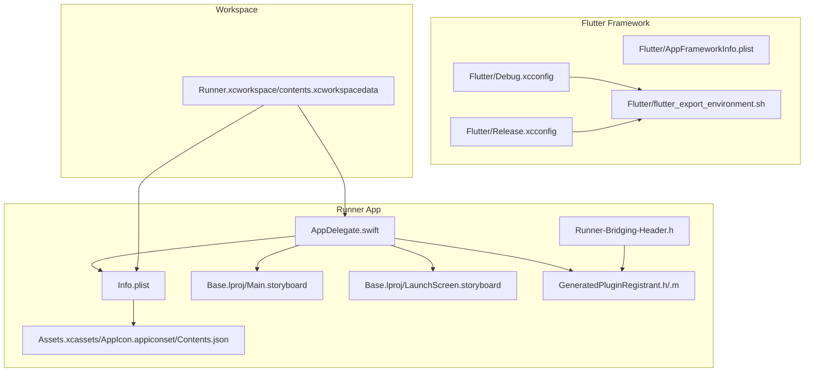
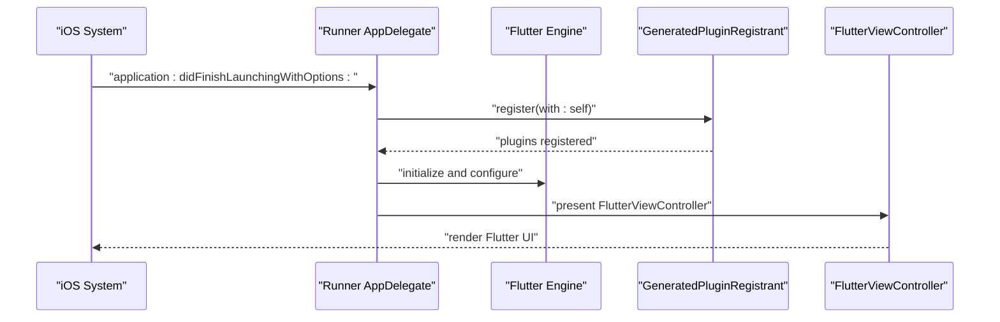
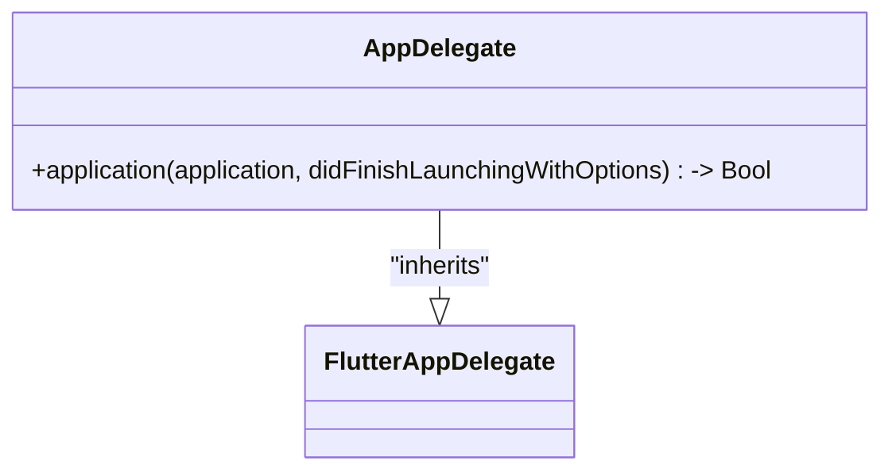
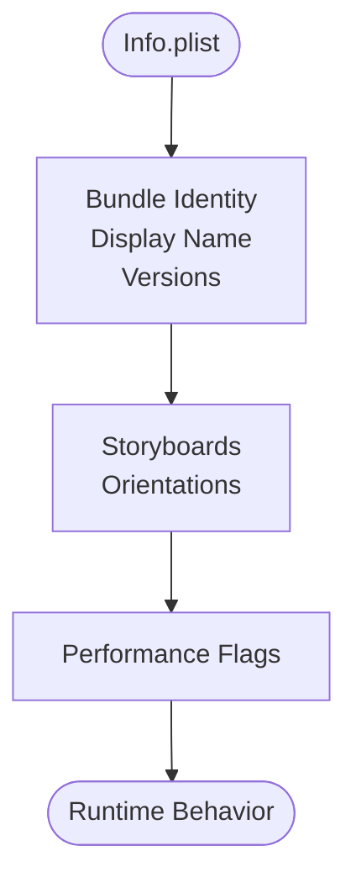
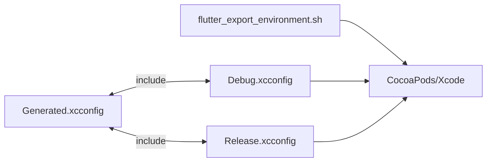
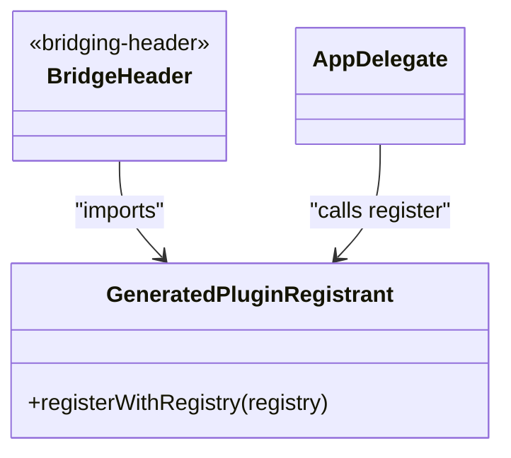
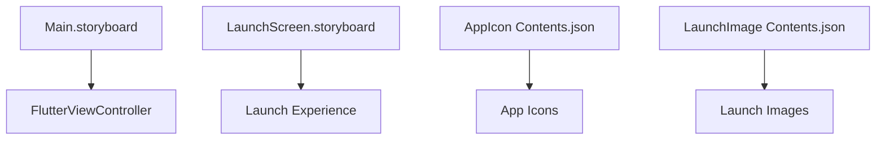
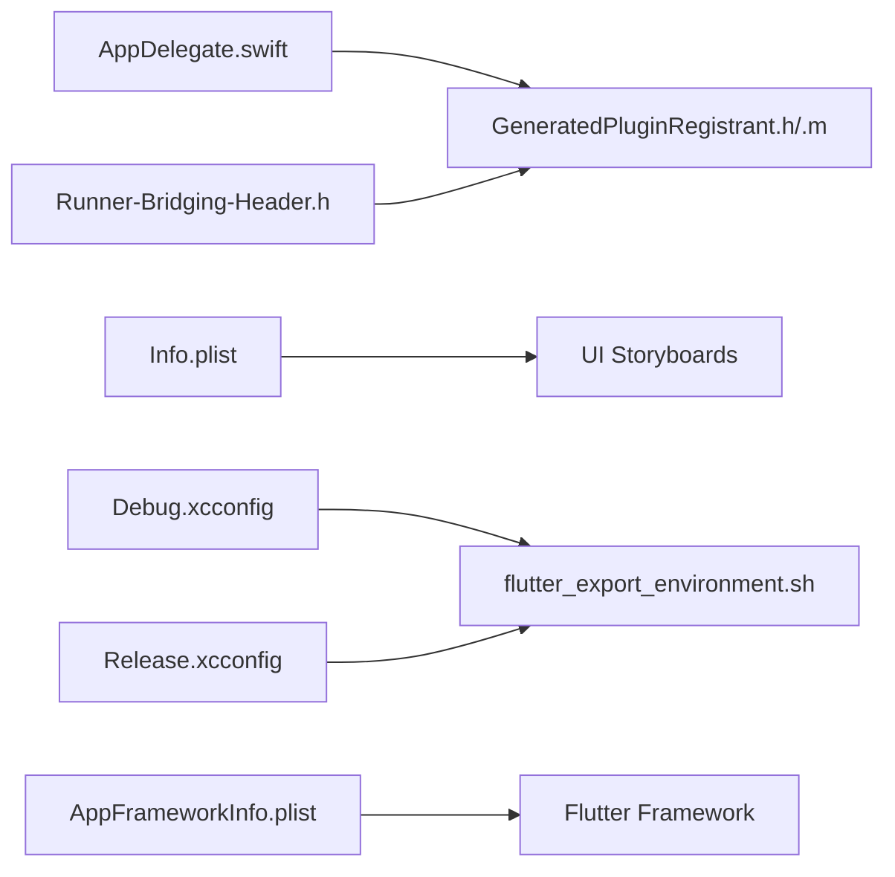

# iOS Implementation

<cite>
**Referenced Files in This Document**
- [AppDelegate.swift](file://frontend/ios/Runner/AppDelegate.swift)
- [Info.plist](file://frontend/ios/Runner/Info.plist)
- [AppFrameworkInfo.plist](file://frontend/ios/Flutter/AppFrameworkInfo.plist)
- [Runner.xcworkspace contents](file://frontend/ios/Runner.xcworkspace/contents.xcworkspacedata)
- [Debug.xcconfig](file://frontend/ios/Flutter/Debug.xcconfig)
- [Release.xcconfig](file://frontend/ios/Flutter/Release.xcconfig)
- [Runner-Bridging-Header.h](file://frontend/ios/Runner/Runner-Bridging-Header.h)
- [GeneratedPluginRegistrant.h](file://frontend/ios/Runner/GeneratedPluginRegistrant.h)
- [GeneratedPluginRegistrant.m](file://frontend/ios/Runner/GeneratedPluginRegistrant.m)
- [flutter_export_environment.sh](file://frontend/ios/Flutter/flutter_export_environment.sh)
- [LaunchScreen.storyboard](file://frontend/ios/Runner/Base.lproj/LaunchScreen.storyboard)
- [Main.storyboard](file://frontend/ios/Runner/Base.lproj/Main.storyboard)
- [AppIcon Contents.json](file://frontend/ios/Runner/Assets.xcassets/AppIcon.appiconset/Contents.json)
- [LaunchImage Contents.json](file://frontend/ios/Runner/Assets.xcassets/LaunchImage.imageset/Contents.json)
</cite>

## Table of Contents
1. [Introduction](#introduction)
2. [Project Structure](#project-structure)
3. [Core Components](#core-components)
4. [Architecture Overview](#architecture-overview)
5. [Detailed Component Analysis](#detailed-component-analysis)
6. [Dependency Analysis](#dependency-analysis)
7. [Performance Considerations](#performance-considerations)
8. [Troubleshooting Guide](#troubleshooting-guide)
9. [Conclusion](#conclusion)
10. [Appendices](#appendices)

## Introduction
This document explains the iOS implementation of the Flutter social media app. It focuses on the iOS-specific configuration and integration points required to build, sign, and deploy the app. Topics include the AppDelegate setup, Info.plist configuration, Xcode workspace and build configurations, iOS deployment targets, UI storyboards and assets, Swift/Objective-C interoperability via the bridging header, and Flutter plugin registration. Guidance is provided for code signing, provisioning profiles, and preparing for App Store deployment.

## Project Structure
The iOS project resides under the Flutter module at frontend/ios/Runner. Key areas:
- Application entry and lifecycle: AppDelegate.swift
- App metadata and permissions: Runner/Info.plist
- Flutter framework metadata: Flutter/AppFrameworkInfo.plist
- Build configurations: Flutter/*.xcconfig
- Environment export script: Flutter/flutter_export_environment.sh
- UI assets and storyboards: Runner/Assets.xcassets and Runner/Base.lproj
- Plugin registration: Runner/GeneratedPluginRegistrant.* and Runner/Runner-Bridging-Header.h

**Diagram sources**
- [AppDelegate.swift:1-14](file://frontend/ios/Runner/AppDelegate.swift#L1-L14)
- [Info.plist:1-50](file://frontend/ios/Runner/Info.plist#L1-L50)
- [Main.storyboard:1-27](file://frontend/ios/Runner/Base.lproj/Main.storyboard#L1-L27)
- [LaunchScreen.storyboard:1-38](file://frontend/ios/Runner/Base.lproj/LaunchScreen.storyboard#L1-L38)
- [AppIcon Contents.json:1-123](file://frontend/ios/Runner/Assets.xcassets/AppIcon.appiconset/Contents.json#L1-L123)
- [Runner-Bridging-Header.h:1-2](file://frontend/ios/Runner/Runner-Bridging-Header.h#L1-L2)
- [GeneratedPluginRegistrant.h:1-20](file://frontend/ios/Runner/GeneratedPluginRegistrant.h#L1-L20)
- [GeneratedPluginRegistrant.m:1-15](file://frontend/ios/Runner/GeneratedPluginRegistrant.m#L1-L15)
- [AppFrameworkInfo.plist:1-27](file://frontend/ios/Flutter/AppFrameworkInfo.plist#L1-L27)
- [Debug.xcconfig:1-2](file://frontend/ios/Flutter/Debug.xcconfig#L1-L2)
- [Release.xcconfig:1-2](file://frontend/ios/Flutter/Release.xcconfig#L1-L2)
- [flutter_export_environment.sh:1-14](file://frontend/ios/Flutter/flutter_export_environment.sh#L1-L14)
- [Runner.xcworkspace contents:1-8](file://frontend/ios/Runner.xcworkspace/contents.xcworkspacedata#L1-L8)

**Section sources**
- [AppDelegate.swift:1-14](file://frontend/ios/Runner/AppDelegate.swift#L1-L14)
- [Info.plist:1-50](file://frontend/ios/Runner/Info.plist#L1-L50)
- [AppFrameworkInfo.plist:1-27](file://frontend/ios/Flutter/AppFrameworkInfo.plist#L1-L27)
- [Runner.xcworkspace contents:1-8](file://frontend/ios/Runner.xcworkspace/contents.xcworkspacedata#L1-L8)
- [Debug.xcconfig:1-2](file://frontend/ios/Flutter/Debug.xcconfig#L1-L2)
- [Release.xcconfig:1-2](file://frontend/ios/Flutter/Release.xcconfig#L1-L2)
- [flutter_export_environment.sh:1-14](file://frontend/ios/Flutter/flutter_export_environment.sh#L1-L14)
- [Runner-Bridging-Header.h:1-2](file://frontend/ios/Runner/Runner-Bridging-Header.h#L1-L2)
- [GeneratedPluginRegistrant.h:1-20](file://frontend/ios/Runner/GeneratedPluginRegistrant.h#L1-L20)
- [GeneratedPluginRegistrant.m:1-15](file://frontend/ios/Runner/GeneratedPluginRegistrant.m#L1-L15)
- [LaunchScreen.storyboard:1-38](file://frontend/ios/Runner/Base.lproj/LaunchScreen.storyboard#L1-L38)
- [Main.storyboard:1-27](file://frontend/ios/Runner/Base.lproj/Main.storyboard#L1-L27)
- [AppIcon Contents.json:1-123](file://frontend/ios/Runner/Assets.xcassets/AppIcon.appiconset/Contents.json#L1-L123)
- [LaunchImage Contents.json:1-24](file://frontend/ios/Runner/Assets.xcassets/LaunchImage.imageset/Contents.json#L1-L24)

## Core Components
- AppDelegate.swift: Minimal FlutterAppDelegate subclass that registers plugins during application launch.
- Info.plist: Defines bundle identifiers, display names, supported orientations, launch storyboard, and runtime flags.
- Flutter AppFrameworkInfo.plist: Declares the Flutter app framework’s bundle identity and minimum OS version.
- Build configurations: Debug.xcconfig and Release.xcconfig include Generated.xcconfig and are used by Xcode build phases.
- Environment export: flutter_export_environment.sh exports Flutter build environment variables consumed by CocoaPods and Xcode.
- Bridging header: Runner-Bridging-Header.h imports GeneratedPluginRegistrant.h to expose plugin registration to Objective-C/Swift.
- Plugin registrants: GeneratedPluginRegistrant.h/.m provide the registry interface for plugins.

**Section sources**
- [AppDelegate.swift:1-14](file://frontend/ios/Runner/AppDelegate.swift#L1-L14)
- [Info.plist:1-50](file://frontend/ios/Runner/Info.plist#L1-L50)
- [AppFrameworkInfo.plist:1-27](file://frontend/ios/Flutter/AppFrameworkInfo.plist#L1-L27)
- [Debug.xcconfig:1-2](file://frontend/ios/Flutter/Debug.xcconfig#L1-L2)
- [Release.xcconfig:1-2](file://frontend/ios/Flutter/Release.xcconfig#L1-L2)
- [flutter_export_environment.sh:1-14](file://frontend/ios/Flutter/flutter_export_environment.sh#L1-L14)
- [Runner-Bridging-Header.h:1-2](file://frontend/ios/Runner/Runner-Bridging-Header.h#L1-L2)
- [GeneratedPluginRegistrant.h:1-20](file://frontend/ios/Runner/GeneratedPluginRegistrant.h#L1-L20)
- [GeneratedPluginRegistrant.m:1-15](file://frontend/ios/Runner/GeneratedPluginRegistrant.m#L1-L15)

## Architecture Overview
The iOS app integrates Flutter as a framework embedded in the Runner app. At startup, the AppDelegate initializes the Flutter engine and registers plugins. The main UI is presented by a FlutterViewController loaded from Main.storyboard. Assets and storyboards define the launch experience and app iconography.

**Diagram sources**
- [AppDelegate.swift:1-14](file://frontend/ios/Runner/AppDelegate.swift#L1-L14)
- [GeneratedPluginRegistrant.h:1-20](file://frontend/ios/Runner/GeneratedPluginRegistrant.h#L1-L20)
- [GeneratedPluginRegistrant.m:1-15](file://frontend/ios/Runner/GeneratedPluginRegistrant.m#L1-L15)
- [Main.storyboard:1-27](file://frontend/ios/Runner/Base.lproj/Main.storyboard#L1-L27)

## Detailed Component Analysis

### AppDelegate.swift
- Purpose: Subclass FlutterAppDelegate to participate in the iOS application lifecycle.
- Behavior: Registers plugins during application launch and defers to the superclass for engine initialization.
- Notes: The @main attribute indicates the app’s entry point. The method signature aligns with UIApplicationDelegate.

**Diagram sources**
- [AppDelegate.swift:1-14](file://frontend/ios/Runner/AppDelegate.swift#L1-L14)

**Section sources**
- [AppDelegate.swift:1-14](file://frontend/ios/Runner/AppDelegate.swift#L1-L14)

### Info.plist
- Bundle identity and metadata: Defines development region, executable, bundle identifier, display name, and versioning.
- UI and orientation: Specifies launch storyboard, main storyboard, supported device orientations for iPhone and iPad, and input event support.
- Performance flags: Includes frame duration and indirect input events toggles.

**Diagram sources**
- [Info.plist:1-50](file://frontend/ios/Runner/Info.plist#L1-L50)

**Section sources**
- [Info.plist:1-50](file://frontend/ios/Runner/Info.plist#L1-L50)

### Flutter AppFrameworkInfo.plist
- Declares the Flutter framework bundle identity and minimum OS version for the embedded framework.

**Section sources**
- [AppFrameworkInfo.plist:1-27](file://frontend/ios/Flutter/AppFrameworkInfo.plist#L1-L27)

### Build Configurations and Environment
- Debug.xcconfig and Release.xcconfig include Generated.xcconfig, ensuring consistent build settings across configurations.
- flutter_export_environment.sh exports FLUTTER_ROOT, FLUTTER_APPLICATION_PATH, and Flutter build/version variables used by CocoaPods and Xcode.

**Diagram sources**
- [Debug.xcconfig:1-2](file://frontend/ios/Flutter/Debug.xcconfig#L1-L2)
- [Release.xcconfig:1-2](file://frontend/ios/Flutter/Release.xcconfig#L1-L2)
- [flutter_export_environment.sh:1-14](file://frontend/ios/Flutter/flutter_export_environment.sh#L1-L14)

**Section sources**
- [Debug.xcconfig:1-2](file://frontend/ios/Flutter/Debug.xcconfig#L1-L2)
- [Release.xcconfig:1-2](file://frontend/ios/Flutter/Release.xcconfig#L1-L2)
- [flutter_export_environment.sh:1-14](file://frontend/ios/Flutter/flutter_export_environment.sh#L1-L14)

### Swift/Objective-C Interoperability and Plugin Registration
- Runner-Bridging-Header.h imports GeneratedPluginRegistrant.h, enabling Swift code to access the plugin registry.
- GeneratedPluginRegistrant.h defines the interface for registering plugins with a Flutter plugin registry.
- GeneratedPluginRegistrant.m provides an empty implementation; plugin registration is orchestrated by the Flutter toolchain.

**Diagram sources**
- [Runner-Bridging-Header.h:1-2](file://frontend/ios/Runner/Runner-Bridging-Header.h#L1-L2)
- [GeneratedPluginRegistrant.h:1-20](file://frontend/ios/Runner/GeneratedPluginRegistrant.h#L1-L20)
- [GeneratedPluginRegistrant.m:1-15](file://frontend/ios/Runner/GeneratedPluginRegistrant.m#L1-L15)
- [AppDelegate.swift:1-14](file://frontend/ios/Runner/AppDelegate.swift#L1-L14)

**Section sources**
- [Runner-Bridging-Header.h:1-2](file://frontend/ios/Runner/Runner-Bridging-Header.h#L1-L2)
- [GeneratedPluginRegistrant.h:1-20](file://frontend/ios/Runner/GeneratedPluginRegistrant.h#L1-L20)
- [GeneratedPluginRegistrant.m:1-15](file://frontend/ios/Runner/GeneratedPluginRegistrant.m#L1-L15)
- [AppDelegate.swift:1-14](file://frontend/ios/Runner/AppDelegate.swift#L1-L14)

### UI Storyboards and Assets
- Main.storyboard: Defines the initial FlutterViewController that renders the Flutter UI.
- LaunchScreen.storyboard: Provides a launch screen with centered branding.
- Assets: AppIcon.appiconset and LaunchImage.imageset define app icons and launch images for various device sizes.

**Diagram sources**
- [Main.storyboard:1-27](file://frontend/ios/Runner/Base.lproj/Main.storyboard#L1-L27)
- [LaunchScreen.storyboard:1-38](file://frontend/ios/Runner/Base.lproj/LaunchScreen.storyboard#L1-L38)
- [AppIcon Contents.json:1-123](file://frontend/ios/Runner/Assets.xcassets/AppIcon.appiconset/Contents.json#L1-L123)
- [LaunchImage Contents.json:1-24](file://frontend/ios/Runner/Assets.xcassets/LaunchImage.imageset/Contents.json#L1-L24)

**Section sources**
- [Main.storyboard:1-27](file://frontend/ios/Runner/Base.lproj/Main.storyboard#L1-L27)
- [LaunchScreen.storyboard:1-38](file://frontend/ios/Runner/Base.lproj/LaunchScreen.storyboard#L1-L38)
- [AppIcon Contents.json:1-123](file://frontend/ios/Runner/Assets.xcassets/AppIcon.appiconset/Contents.json#L1-L123)
- [LaunchImage Contents.json:1-24](file://frontend/ios/Runner/Assets.xcassets/LaunchImage.imageset/Contents.json#L1-L24)

## Dependency Analysis
- AppDelegate depends on GeneratedPluginRegistrant for plugin registration.
- The bridging header exposes GeneratedPluginRegistrant to Swift.
- Build configurations and environment scripts influence CocoaPods integration and Xcode build settings.
- Info.plist controls runtime behavior and UI presentation.

**Diagram sources**
- [AppDelegate.swift:1-14](file://frontend/ios/Runner/AppDelegate.swift#L1-L14)
- [GeneratedPluginRegistrant.h:1-20](file://frontend/ios/Runner/GeneratedPluginRegistrant.h#L1-L20)
- [GeneratedPluginRegistrant.m:1-15](file://frontend/ios/Runner/GeneratedPluginRegistrant.m#L1-L15)
- [Runner-Bridging-Header.h:1-2](file://frontend/ios/Runner/Runner-Bridging-Header.h#L1-L2)
- [Info.plist:1-50](file://frontend/ios/Runner/Info.plist#L1-L50)
- [Main.storyboard:1-27](file://frontend/ios/Runner/Base.lproj/Main.storyboard#L1-L27)
- [Debug.xcconfig:1-2](file://frontend/ios/Flutter/Debug.xcconfig#L1-L2)
- [Release.xcconfig:1-2](file://frontend/ios/Flutter/Release.xcconfig#L1-L2)
- [flutter_export_environment.sh:1-14](file://frontend/ios/Flutter/flutter_export_environment.sh#L1-L14)
- [AppFrameworkInfo.plist:1-27](file://frontend/ios/Flutter/AppFrameworkInfo.plist#L1-L27)

**Section sources**
- [AppDelegate.swift:1-14](file://frontend/ios/Runner/AppDelegate.swift#L1-L14)
- [GeneratedPluginRegistrant.h:1-20](file://frontend/ios/Runner/GeneratedPluginRegistrant.h#L1-L20)
- [GeneratedPluginRegistrant.m:1-15](file://frontend/ios/Runner/GeneratedPluginRegistrant.m#L1-L15)
- [Runner-Bridging-Header.h:1-2](file://frontend/ios/Runner/Runner-Bridging-Header.h#L1-L2)
- [Info.plist:1-50](file://frontend/ios/Runner/Info.plist#L1-L50)
- [Main.storyboard:1-27](file://frontend/ios/Runner/Base.lproj/Main.storyboard#L1-L27)
- [Debug.xcconfig:1-2](file://frontend/ios/Flutter/Debug.xcconfig#L1-L2)
- [Release.xcconfig:1-2](file://frontend/ios/Flutter/Release.xcconfig#L1-L2)
- [flutter_export_environment.sh:1-14](file://frontend/ios/Flutter/flutter_export_environment.sh#L1-L14)
- [AppFrameworkInfo.plist:1-27](file://frontend/ios/Flutter/AppFrameworkInfo.plist#L1-L27)

## Performance Considerations
- Indirect input events: Enabled in Info.plist to improve responsiveness for external input devices.
- Minimum frame duration: Disabled on phone-grade devices to allow lower latency rendering when appropriate.
- Build configurations: Ensure Debug vs Release settings are applied consistently to avoid performance regressions in production builds.

[No sources needed since this section provides general guidance]

## Troubleshooting Guide
- Plugin registration issues: Verify that the bridging header imports GeneratedPluginRegistrant and that AppDelegate calls the registration routine during launch.
- Build environment mismatches: Confirm flutter_export_environment.sh is sourced by Xcode and CocoaPods; mismatched FLUTTER_ROOT or paths cause build failures.
- Storyboard/UI inconsistencies: Ensure Main.storyboard defines a FlutterViewController and that Info.plist references the correct storyboard names.
- Asset resolution: Validate asset catalog entries for app icons and launch images match the expected filenames and scales.

**Section sources**
- [Runner-Bridging-Header.h:1-2](file://frontend/ios/Runner/Runner-Bridging-Header.h#L1-L2)
- [GeneratedPluginRegistrant.h:1-20](file://frontend/ios/Runner/GeneratedPluginRegistrant.h#L1-L20)
- [GeneratedPluginRegistrant.m:1-15](file://frontend/ios/Runner/GeneratedPluginRegistrant.m#L1-L15)
- [AppDelegate.swift:1-14](file://frontend/ios/Runner/AppDelegate.swift#L1-L14)
- [flutter_export_environment.sh:1-14](file://frontend/ios/Flutter/flutter_export_environment.sh#L1-L14)
- [Info.plist:1-50](file://frontend/ios/Runner/Info.plist#L1-L50)
- [Main.storyboard:1-27](file://frontend/ios/Runner/Base.lproj/Main.storyboard#L1-L27)
- [AppIcon Contents.json:1-123](file://frontend/ios/Runner/Assets.xcassets/AppIcon.appiconset/Contents.json#L1-L123)
- [LaunchImage Contents.json:1-24](file://frontend/ios/Runner/Assets.xcassets/LaunchImage.imageset/Contents.json#L1-L24)

## Conclusion
The iOS implementation centers on a minimal AppDelegate that registers Flutter plugins, a well-defined Info.plist for runtime behavior, and a clean separation between Swift and Objective-C via the bridging header. Build configurations and environment exports integrate seamlessly with Flutter tooling. The UI is driven by Flutter via a storyboard-managed FlutterViewController, while assets and storyboards handle branding and launch experiences. For production, ensure proper code signing, provisioning profiles, and App Store packaging steps are configured in Xcode.

[No sources needed since this section summarizes without analyzing specific files]

## Appendices
- Xcode workspace: The workspace references the Runner project and coordinates build settings across the module.
- Deployment target: The Flutter framework declares a minimum OS version; ensure the Runner app’s deployment target meets or exceeds this requirement in Xcode.

**Section sources**
- [Runner.xcworkspace contents:1-8](file://frontend/ios/Runner.xcworkspace/contents.xcworkspacedata#L1-L8)
- [AppFrameworkInfo.plist:1-27](file://frontend/ios/Flutter/AppFrameworkInfo.plist#L1-L27)