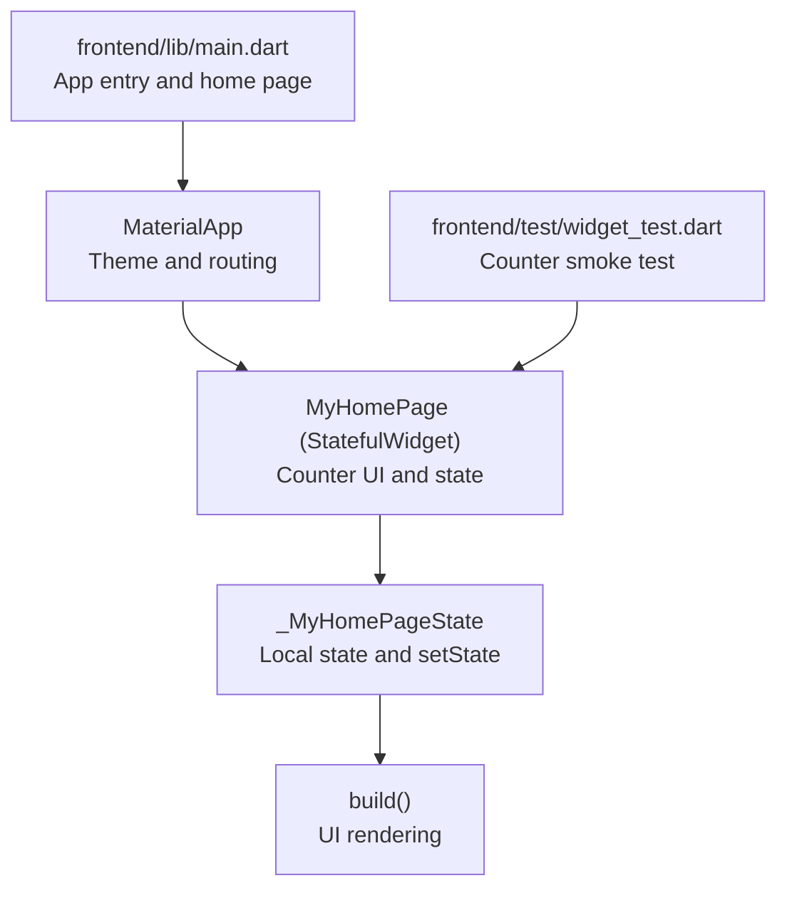
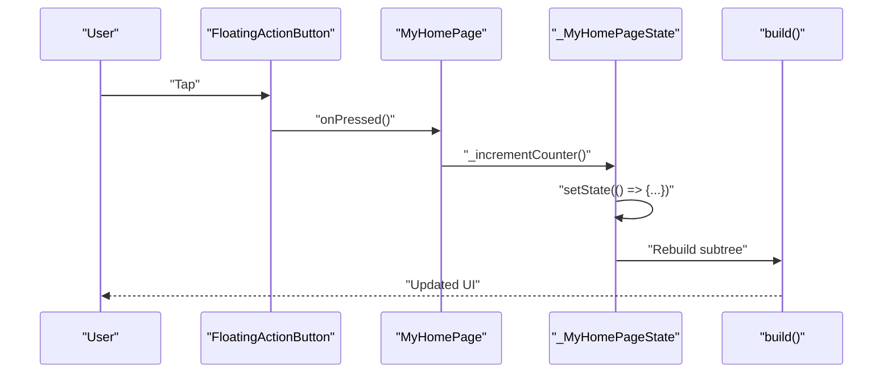
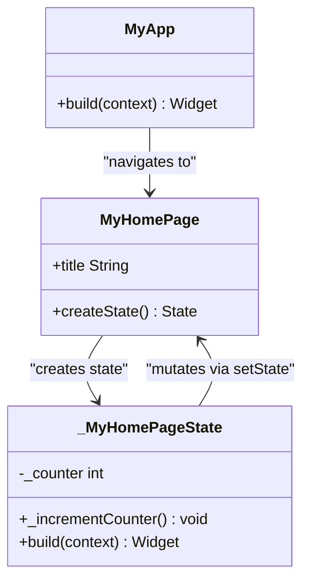
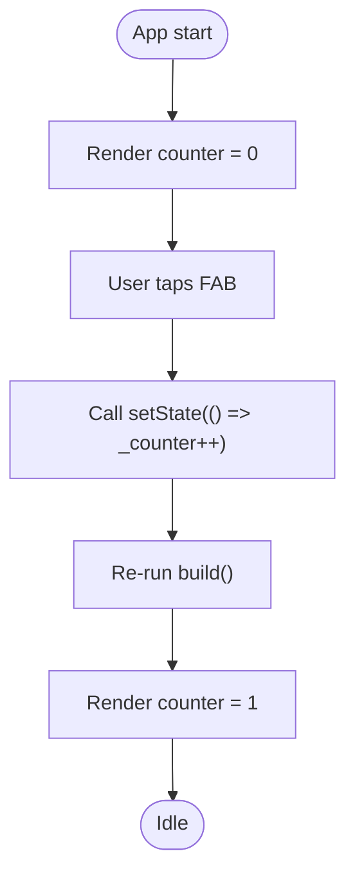
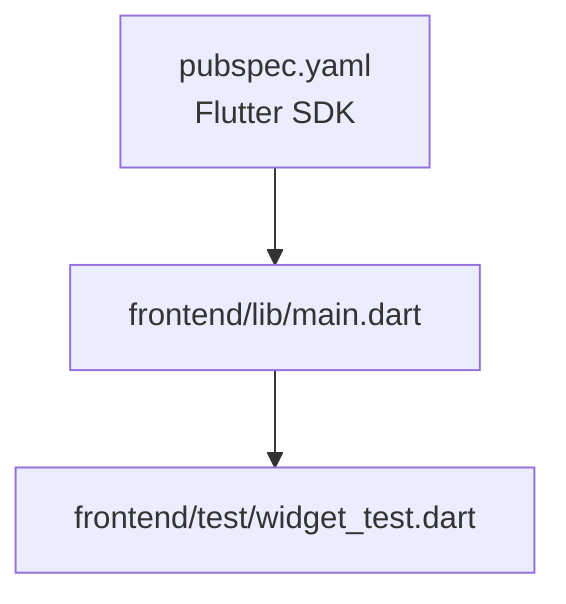

# State Management & Data Flow

<cite>
**Referenced Files in This Document**
- [main.dart](file://frontend/lib/main.dart)
- [widget_test.dart](file://frontend/test/widget_test.dart)
- [pubspec.yaml](file://frontend/pubspec.yaml)
- [analysis_options.yaml](file://frontend/analysis_options.yaml)
</cite>

## Table of Contents
1. [Introduction](#introduction)
2. [Project Structure](#project-structure)
3. [Core Components](#core-components)
4. [Architecture Overview](#architecture-overview)
5. [Detailed Component Analysis](#detailed-component-analysis)
6. [Dependency Analysis](#dependency-analysis)
7. [Performance Considerations](#performance-considerations)
8. [Troubleshooting Guide](#troubleshooting-guide)
9. [Conclusion](#conclusion)
10. [Appendices](#appendices)

## Introduction
This document explains the state management approach used in the Flutter social media app’s frontend. The current implementation relies on Flutter’s built-in StatefulWidget and setState for managing local UI state. The counter example demonstrates how state changes propagate through the build method to update the UI. We also provide best practices for choosing state management solutions, data flow patterns, widget communication, and performance considerations. Finally, we outline future considerations for adopting advanced state management solutions as the application grows.

## Project Structure
The Flutter app is minimal and focused on demonstrating local state management. The primary entry point initializes the app and sets up a themed Material app. The home page is a StatefulWidget containing a counter and a floating action button. Tests validate the counter behavior.

**Diagram sources**
- [main.dart](file://frontend/lib/main.dart)
- [widget_test.dart](file://frontend/test/widget_test.dart)

**Section sources**
- [main.dart](file://frontend/lib/main.dart)
- [pubspec.yaml](file://frontend/pubspec.yaml)

## Core Components
- MyApp: Stateless root widget that configures the app theme and navigates to the home page.
- MyHomePage: A StatefulWidget that encapsulates local UI state and renders the counter UI.
- _MyHomePageState: Holds the counter value and exposes setState to trigger UI rebuilds.
- Floating action button: Triggers increment via a callback that calls setState internally.

Key behaviors:
- The counter starts at zero and increments on each button press.
- setState schedules a rebuild of the widget subtree, ensuring the UI reflects the updated state.
- The test verifies initial state and post-increment state transitions.

**Section sources**
- [main.dart](file://frontend/lib/main.dart)
- [widget_test.dart](file://frontend/test/widget_test.dart)

## Architecture Overview
The app follows a unidirectional data flow centered on local state:
- User interaction triggers a callback in the StatefulWidget.
- The callback invokes setState with a state mutation closure.
- setState marks the widget as needing rebuild.
- The framework runs build, recomputes UI, and updates the screen.

**Diagram sources**
- [main.dart](file://frontend/lib/main.dart)

## Detailed Component Analysis

### Local State with StatefulWidget and setState
- State container: _MyHomePageState stores the counter value and exposes a method to mutate it safely.
- Mutation mechanism: _incrementCounter wraps the mutation inside setState to schedule a rebuild.
- UI rendering: build constructs the AppBar, Centered column, and FloatingActionButton, reading the current counter value.

**Diagram sources**
- [main.dart](file://frontend/lib/main.dart)

**Section sources**
- [main.dart](file://frontend/lib/main.dart)

### Counter Example Workflow
- Initial render: The counter displays zero.
- Interaction: Tapping the floating action button triggers the increment callback.
- State update: setState updates the internal counter value.
- Rebuild: The framework re-runs build, reflecting the new value in the UI.
- Test verification: The widget test asserts initial and post-increment states.

**Diagram sources**
- [main.dart](file://frontend/lib/main.dart)
- [widget_test.dart](file://frontend/test/widget_test.dart)

**Section sources**
- [main.dart](file://frontend/lib/main.dart)
- [widget_test.dart](file://frontend/test/widget_test.dart)

### Best Practices for State Management in Flutter
- Use local state (StatefulWidget + setState) for small, isolated UI concerns such as counters, toggles, and form inputs within a single widget subtree.
- Keep state close to where it is used to minimize prop drilling and reduce complexity.
- Prefer immutable updates when possible to simplify reasoning about state transitions.
- Avoid performing heavy work inside setState; offload to isolates or background tasks if needed.
- Use keys and const constructors judiciously to help the framework reuse widgets efficiently.

[No sources needed since this section provides general guidance]

### Data Flow Patterns and Widget Communication
- Parent-to-child: Pass immutable data down via constructor parameters to child widgets.
- Child-to-parent: Use callbacks (functional arguments) to notify parents of events or state changes.
- Sibling communication: Elevate shared state to a common ancestor and pass it down as needed.
- Global state: Reserve for truly global concerns (themes, user sessions). For larger apps, adopt scalable solutions later.

[No sources needed since this section provides general guidance]

### Performance Considerations for State Updates
- Rebuild scope: setState triggers a rebuild of the widget subtree rooted at the StatefulWidget. Keep the state scoped narrowly to avoid unnecessary rebuilds.
- Use const widgets and const constructors to enable identity checks and reuse.
- Split large widgets into smaller, stateless widgets that can be memoized.
- Avoid rebuilding expensive subtrees by isolating state and using selective setState calls.
- Profile with DevTools to identify hot paths and excessive rebuilds.

[No sources needed since this section provides general guidance]

### Future State Management Solutions
As the application grows, consider migrating to scalable solutions:
- Provider: Lightweight dependency injection and reactive updates with ChangeNotifier or ValueListenableBuilder.
- Riverpod: Modern, testable, and composable provider with improved ergonomics and runtime safety.
- Bloc/Cubit: Event-driven patterns suited for complex business logic and state machines.

Migration strategy:
- Start with local state for small UI concerns.
- Gradually introduce Provider/Riverpod for shared business logic and cross-cutting concerns.
- Use Bloc/Cubit for complex workflows and state machines.
- Maintain backward compatibility by wrapping legacy StatefulWidget code with providers or riverpod notifiers.

[No sources needed since this section provides general guidance]

## Dependency Analysis
The project currently depends only on the Flutter SDK and Material components. There are no external state management dependencies at this time.

**Diagram sources**
- [pubspec.yaml](file://frontend/pubspec.yaml)
- [main.dart](file://frontend/lib/main.dart)
- [widget_test.dart](file://frontend/test/widget_test.dart)

**Section sources**
- [pubspec.yaml](file://frontend/pubspec.yaml)

## Performance Considerations
- Minimize rebuilds by scoping state precisely where it is needed.
- Use const widgets and immutable data structures to improve equality checks.
- Avoid synchronous heavy work in build or setState closures.
- Leverage DevTools profiling to detect and resolve performance bottlenecks.

[No sources needed since this section provides general guidance]

## Troubleshooting Guide
Common issues and remedies:
- UI not updating after state change: Ensure the mutation occurs inside setState and that the affected widget is a descendant of the StatefulWidget.
- Excessive rebuilds: Narrow the state scope, split widgets, and use const constructors.
- Test failures for state transitions: Confirm the test triggers the button tap and pumps the widget tree afterward.

**Section sources**
- [main.dart](file://frontend/lib/main.dart)
- [widget_test.dart](file://frontend/test/widget_test.dart)

## Conclusion
The current implementation demonstrates Flutter’s native state management using StatefulWidget and setState, exemplified by the counter example. It is well-suited for small, localized UI concerns. As the social media app evolves, adopt scalable solutions like Provider, Riverpod, or Bloc to manage global and complex state effectively while maintaining performance and testability.

[No sources needed since this section summarizes without analyzing specific files]

## Appendices
- Linting configuration follows Flutter’s recommended rules to encourage clean, maintainable code.

**Section sources**
- [analysis_options.yaml](file://frontend/analysis_options.yaml)