# UI Components & Navigation

<cite>
**Referenced Files in This Document**
- [main.dart](file://frontend/lib/main.dart)
- [pubspec.yaml](file://frontend/pubspec.yaml)
- [widget_test.dart](file://frontend/test/widget_test.dart)
- [index.html](file://frontend/web/index.html)
- [manifest.json](file://frontend/web/manifest.json)
</cite>

## Table of Contents
1. [Introduction](#introduction)
2. [Project Structure](#project-structure)
3. [Core Components](#core-components)
4. [Architecture Overview](#architecture-overview)
5. [Detailed Component Analysis](#detailed-component-analysis)
6. [Dependency Analysis](#dependency-analysis)
7. [Performance Considerations](#performance-considerations)
8. [Troubleshooting Guide](#troubleshooting-guide)
9. [Conclusion](#conclusion)
10. [Appendices](#appendices)

## Introduction
This document provides comprehensive UI components documentation for the Flutter social media app interface. It focuses on the core UI building blocks used in the application, including AppBar, Scaffold, FloatingActionButton, and Material Design widgets. It also explains navigation patterns, route management, screen transitions, responsive design principles, adaptive layouts, state management for the home page, theming and Material 3 implementation, asset and icon management, web-specific UI adaptations, and guidelines for reusable components and consistent UI patterns.

## Project Structure
The Flutter application is structured around a minimal but instructive UI scaffold. The primary entry point initializes the app with a Material 3 theme and sets the home page. The home page demonstrates a stateful UI with a counter, an AppBar, a central body layout, and a floating action button. Web support is configured via HTML and PWA manifest files.

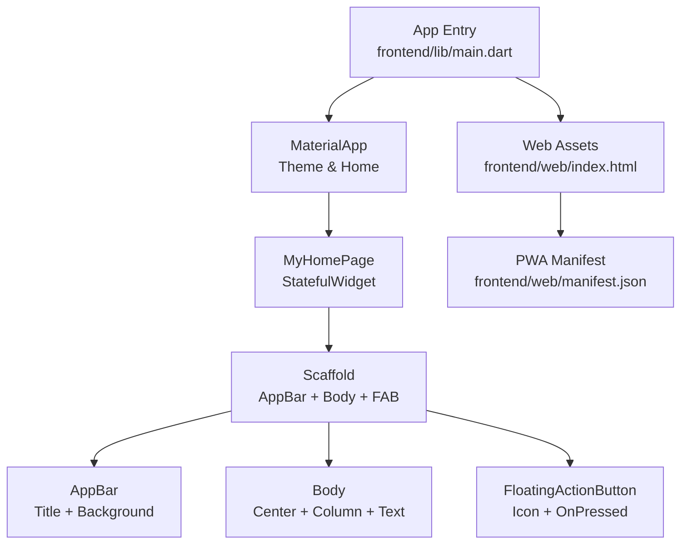

**Diagram sources**
- [main.dart:3-37](file://frontend/lib/main.dart#L3-L37)
- [main.dart:39-125](file://frontend/lib/main.dart#L39-L125)
- [index.html:1-39](file://frontend/web/index.html#L1-L39)
- [manifest.json:1-36](file://frontend/web/manifest.json#L1-L36)

**Section sources**
- [main.dart:3-37](file://frontend/lib/main.dart#L3-L37)
- [main.dart:39-125](file://frontend/lib/main.dart#L39-L125)
- [index.html:1-39](file://frontend/web/index.html#L1-L39)
- [manifest.json:1-36](file://frontend/web/manifest.json#L1-L36)

## Core Components
This section documents the core UI components used in the application and how they are composed to form the home page.

- MaterialApp
  - Initializes the app with a theme and sets the home page.
  - Uses Material 3 with a seed-based color scheme.
  - Reference: [main.dart:13-35](file://frontend/lib/main.dart#L13-L35)

- MyHomePage (StatefulWidget)
  - A stateful widget that manages a counter and triggers rebuilds via setState.
  - Holds a title property passed from the parent.
  - Reference: [main.dart:39-55](file://frontend/lib/main.dart#L39-L55)

- Scaffold
  - The root layout container for the home page, providing structure for AppBar, body, and floating action button.
  - Reference: [main.dart:79-124](file://frontend/lib/main.dart#L79-L124)

- AppBar
  - Displays the page title and applies background color from the current theme.
  - Reference: [main.dart:80-88](file://frontend/lib/main.dart#L80-L88)

- Body Layout (Center + Column + Text)
  - Centers content vertically and horizontally, displaying instructional text and the current counter value using the theme’s headline text style.
  - Reference: [main.dart:89-117](file://frontend/lib/main.dart#L89-L117)

- FloatingActionButton
  - Triggers incrementation of the counter and displays an add icon with a tooltip.
  - Reference: [main.dart:118-122](file://frontend/lib/main.dart#L118-L122)

- Theming and Material 3
  - The app uses a seed-based ColorScheme and enables Material 3.
  - References:
    - [main.dart:15-32](file://frontend/lib/main.dart#L15-L32)
    - [pubspec.yaml:59](file://frontend/pubspec.yaml#L59)

- Asset and Icon Management
  - Material icons are enabled via the Flutter manifest.
  - References:
    - [pubspec.yaml:56-59](file://frontend/pubspec.yaml#L56-L59)
    - [main.dart:121](file://frontend/lib/main.dart#L121)

**Section sources**
- [main.dart:13-35](file://frontend/lib/main.dart#L13-L35)
- [main.dart:39-55](file://frontend/lib/main.dart#L39-L55)
- [main.dart:79-124](file://frontend/lib/main.dart#L79-L124)
- [main.dart:80-88](file://frontend/lib/main.dart#L80-L88)
- [main.dart:89-117](file://frontend/lib/main.dart#L89-L117)
- [main.dart:118-122](file://frontend/lib/main.dart#L118-L122)
- [pubspec.yaml:56-59](file://frontend/pubspec.yaml#L56-L59)

## Architecture Overview
The application follows a straightforward composition pattern:
- MyApp builds a MaterialApp with a theme and a home page.
- MyHomePage is a StatefulWidget that encapsulates UI state and rebuild logic.
- Scaffold organizes the AppBar, body, and FAB.
- The app leverages Material 3 theming and supports web deployment via index.html and a PWA manifest.

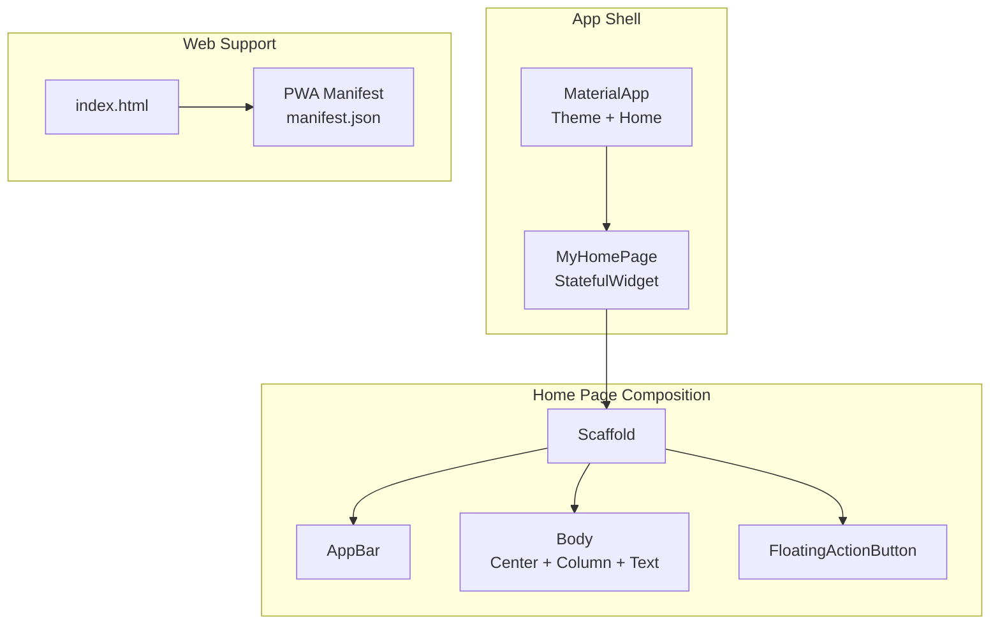

**Diagram sources**
- [main.dart:13-35](file://frontend/lib/main.dart#L13-L35)
- [main.dart:39-125](file://frontend/lib/main.dart#L39-L125)
- [index.html:1-39](file://frontend/web/index.html#L1-L39)
- [manifest.json:1-36](file://frontend/web/manifest.json#L1-L36)

## Detailed Component Analysis

### AppBar Component
- Purpose: Provides a top app bar with a title and themed background.
- Behavior: Uses the inverse primary color from the current theme for contrast.
- Integration: Works seamlessly with Scaffold and respects Material 3 color tokens.
- References:
  - [main.dart:80-88](file://frontend/lib/main.dart#L80-L88)

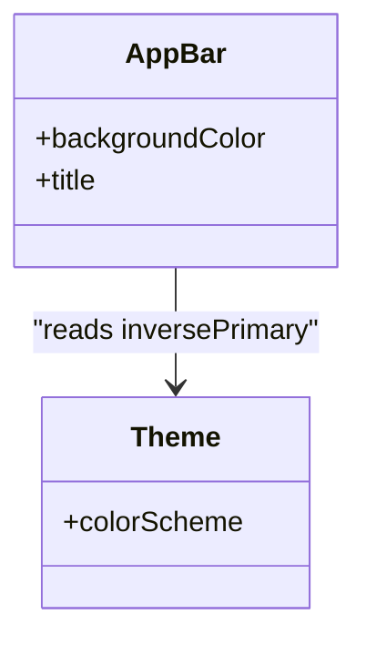

**Diagram sources**
- [main.dart:80-88](file://frontend/lib/main.dart#L80-L88)

**Section sources**
- [main.dart:80-88](file://frontend/lib/main.dart#L80-L88)

### Scaffold Component
- Purpose: Serves as the root layout container for the home page.
- Behavior: Hosts AppBar, body, and FloatingActionButton; manages safe areas and responsive spacing.
- References:
  - [main.dart:79-124](file://frontend/lib/main.dart#L79-L124)

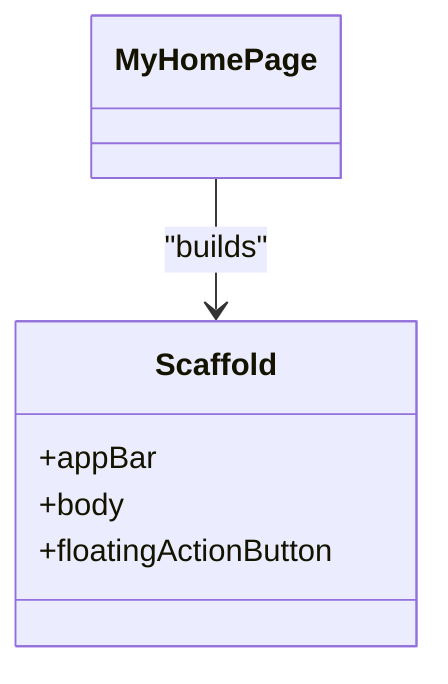

**Diagram sources**
- [main.dart:79-124](file://frontend/lib/main.dart#L79-L124)

**Section sources**
- [main.dart:79-124](file://frontend/lib/main.dart#L79-L124)

### FloatingActionButton Component
- Purpose: Provides a prominent call-to-action button.
- Behavior: Taps trigger state updates; uses Material icons and tooltips.
- References:
  - [main.dart:118-122](file://frontend/lib/main.dart#L118-L122)

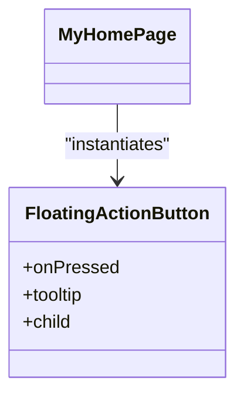

**Diagram sources**
- [main.dart:118-122](file://frontend/lib/main.dart#L118-L122)

**Section sources**
- [main.dart:118-122](file://frontend/lib/main.dart#L118-L122)

### Home Page State Management and Counter Functionality
- Stateful widget: MyHomePage maintains a counter in its state.
- Rebuild mechanism: setState triggers a rebuild of the UI subtree.
- Interaction: The FAB invokes the increment function, updating the counter and re-rendering the body text.
- References:
  - [main.dart:57-69](file://frontend/lib/main.dart#L57-L69)
  - [main.dart:71-124](file://frontend/lib/main.dart#L71-L124)

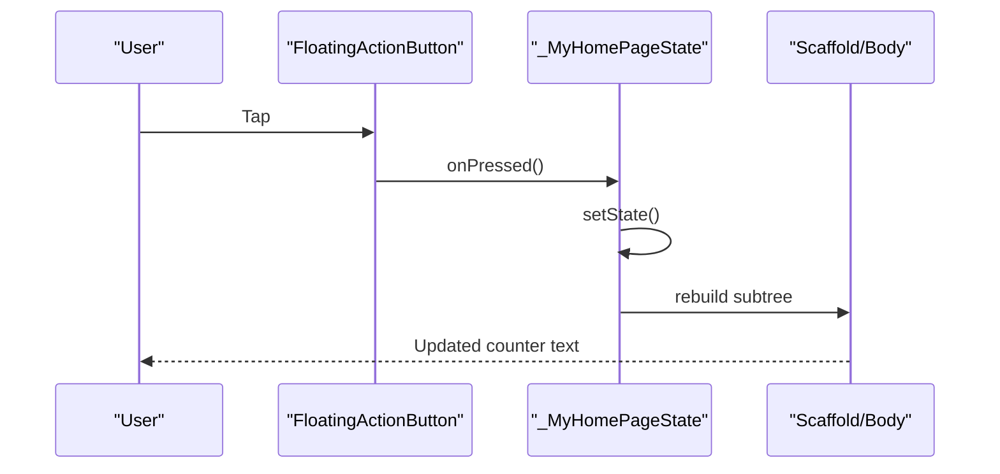

**Diagram sources**
- [main.dart:57-69](file://frontend/lib/main.dart#L57-L69)
- [main.dart:118-122](file://frontend/lib/main.dart#L118-L122)
- [main.dart:71-124](file://frontend/lib/main.dart#L71-L124)

**Section sources**
- [main.dart:57-69](file://frontend/lib/main.dart#L57-L69)
- [main.dart:71-124](file://frontend/lib/main.dart#L71-L124)

### Theming System and Material 3 Implementation
- Seed-based color scheme: The theme derives colors from a seed color for consistent palettes.
- Material 3 enablement: Material 3 is turned on for modern design tokens and dynamic color where supported.
- Typography: The body text uses the theme’s headlineMedium text style.
- References:
  - [main.dart:15-32](file://frontend/lib/main.dart#L15-L32)
  - [main.dart:113](file://frontend/lib/main.dart#L113)
  - [pubspec.yaml:59](file://frontend/pubspec.yaml#L59)

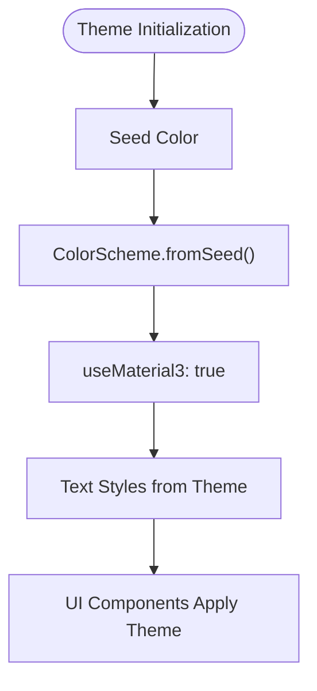

**Diagram sources**
- [main.dart:15-32](file://frontend/lib/main.dart#L15-L32)
- [main.dart:113](file://frontend/lib/main.dart#L113)

**Section sources**
- [main.dart:15-32](file://frontend/lib/main.dart#L15-L32)
- [main.dart:113](file://frontend/lib/main.dart#L113)
- [pubspec.yaml:59](file://frontend/pubspec.yaml#L59)

### Responsive Design and Adaptive Layouts
- Center alignment: The body uses Center to keep content centered both vertically and horizontally.
- Column arrangement: Column stacks children along the main axis with MainAxisAlignment.center for vertical centering.
- Adaptive behavior: These layouts adapt to varying screen sizes without explicit breakpoints.
- References:
  - [main.dart:89-117](file://frontend/lib/main.dart#L89-L117)

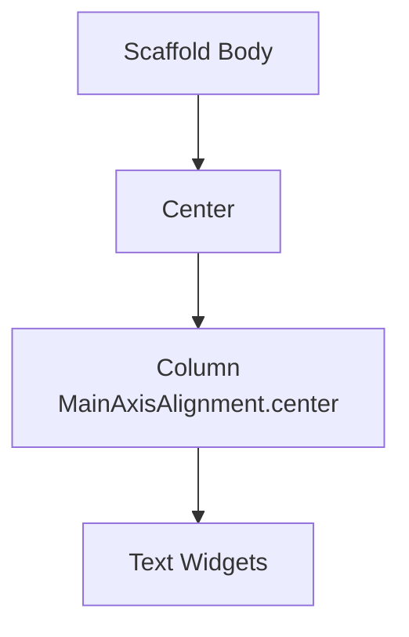

**Diagram sources**
- [main.dart:89-117](file://frontend/lib/main.dart#L89-L117)

**Section sources**
- [main.dart:89-117](file://frontend/lib/main.dart#L89-L117)

### Navigation Patterns, Route Management, and Screen Transitions
- Current state: The app uses a single home page via the home property of MaterialApp.
- Navigation extension points:
  - Add named routes or use Navigator.push for additional screens.
  - Use MaterialPageRoute for standard transitions.
  - Consider Hero animations or custom transitions for richer UX.
- References:
  - [main.dart:34](file://frontend/lib/main.dart#L34)

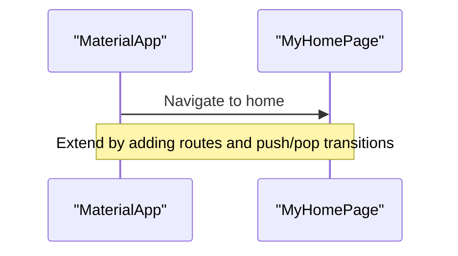

**Diagram sources**
- [main.dart:34](file://frontend/lib/main.dart#L34)

**Section sources**
- [main.dart:34](file://frontend/lib/main.dart#L34)

### Asset Management, Icon Usage, and Web-Specific UI Adaptations
- Material icons: Enabled via the Flutter manifest; used by FloatingActionButton.
- Web bootstrap: index.html loads the Flutter web bootstrap script.
- PWA configuration: manifest.json defines app metadata, display mode, theme color, and icons.
- References:
  - [pubspec.yaml:56-59](file://frontend/pubspec.yaml#L56-L59)
  - [main.dart:121](file://frontend/lib/main.dart#L121)
  - [index.html:36](file://frontend/web/index.html#L36)
  - [manifest.json:1-36](file://frontend/web/manifest.json#L1-L36)

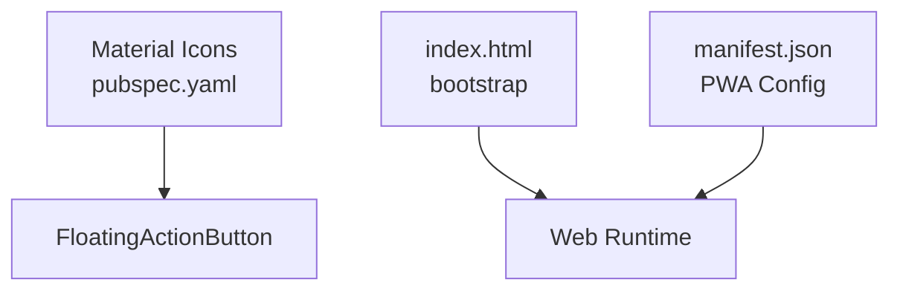

**Diagram sources**
- [pubspec.yaml:56-59](file://frontend/pubspec.yaml#L56-L59)
- [main.dart:121](file://frontend/lib/main.dart#L121)
- [index.html:36](file://frontend/web/index.html#L36)
- [manifest.json:1-36](file://frontend/web/manifest.json#L1-L36)

**Section sources**
- [pubspec.yaml:56-59](file://frontend/pubspec.yaml#L56-L59)
- [main.dart:121](file://frontend/lib/main.dart#L121)
- [index.html:36](file://frontend/web/index.html#L36)
- [manifest.json:1-36](file://frontend/web/manifest.json#L1-L36)

### Guidelines for Reusable Components and Consistent UI Patterns
- Encapsulate repeated UI into widgets:
  - Extract common layouts (headers, cards, lists) into separate widgets.
  - Pass data via strongly typed constructors to enforce consistency.
- Leverage themes:
  - Define shared text styles, shapes, and color roles in ThemeData.
  - Use Theme.of(context) to ensure components adapt to platform and user preferences.
- Keep state local:
  - Prefer passing callbacks and values up to parent widgets to manage global state.
- Accessibility and responsiveness:
  - Use semantic properties and readable text scales.
  - Test layouts across breakpoints and orientations.
- Testing:
  - Add widget tests to verify interactions (e.g., tapping the FAB increments the counter).
  - References:
    - [widget_test.dart:14-29](file://frontend/test/widget_test.dart#L14-L29)

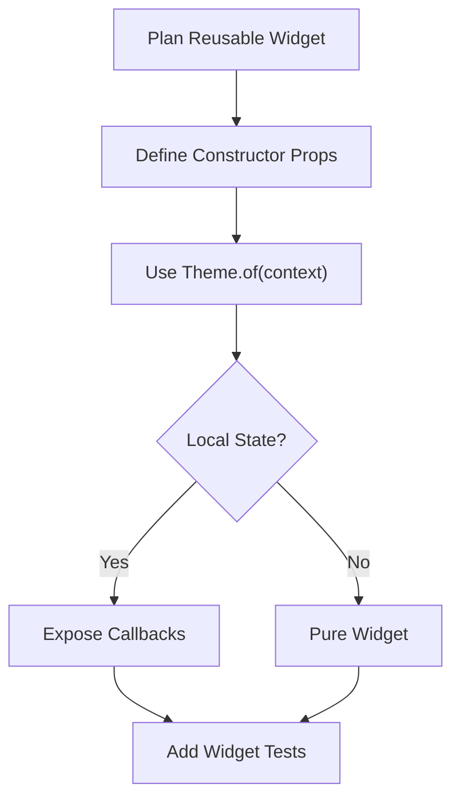

**Diagram sources**
- [widget_test.dart:14-29](file://frontend/test/widget_test.dart#L14-L29)

**Section sources**
- [widget_test.dart:14-29](file://frontend/test/widget_test.dart#L14-L29)

## Dependency Analysis
This section outlines the dependencies among the core UI components and external configurations.

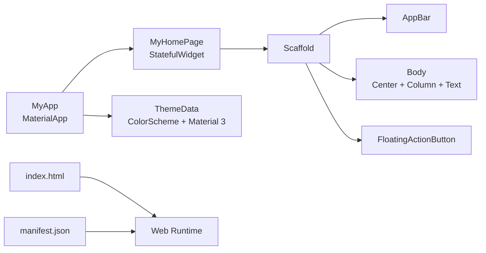

**Diagram sources**
- [main.dart:13-35](file://frontend/lib/main.dart#L13-L35)
- [main.dart:39-125](file://frontend/lib/main.dart#L39-L125)
- [index.html:36](file://frontend/web/index.html#L36)
- [manifest.json:1-36](file://frontend/web/manifest.json#L1-L36)

**Section sources**
- [main.dart:13-35](file://frontend/lib/main.dart#L13-L35)
- [main.dart:39-125](file://frontend/lib/main.dart#L39-L125)
- [index.html:36](file://frontend/web/index.html#L36)
- [manifest.json:1-36](file://frontend/web/manifest.json#L1-L36)

## Performance Considerations
- Keep rebuild scopes small: Only update the smallest subtree necessary when state changes occur.
- Avoid heavy computations in build methods; cache derived values when appropriate.
- Use const constructors for immutable widgets to enable bit-wise equality checks.
- Prefer IndexedStack or similar patterns for tabbed interfaces to preserve state across views.
- For web, ensure assets are optimized and loaded efficiently; leverage PWA caching via the manifest.

## Troubleshooting Guide
- Counter does not update after tapping the FAB:
  - Ensure the onPressed callback is wired to the state increment method.
  - Verify setState is called within the stateful widget.
  - References:
    - [main.dart:57-69](file://frontend/lib/main.dart#L57-L69)
    - [main.dart:118-122](file://frontend/lib/main.dart#L118-L122)

- Theme colors not applied:
  - Confirm useMaterial3 is enabled and ColorScheme.fromSeed is set.
  - Ensure widgets read colors via Theme.of(context).
  - References:
    - [main.dart:15-32](file://frontend/lib/main.dart#L15-L32)
    - [main.dart:84](file://frontend/lib/main.dart#L84)
    - [main.dart:113](file://frontend/lib/main.dart#L113)

- Icons not rendering:
  - Confirm uses-material-design is enabled in pubspec.yaml.
  - Verify icon names are valid Material icons.
  - References:
    - [pubspec.yaml:56-59](file://frontend/pubspec.yaml#L56-L59)
    - [main.dart:121](file://frontend/lib/main.dart#L121)

- Web app not loading:
  - Check index.html loads the bootstrap script.
  - Validate manifest.json entries and paths.
  - References:
    - [index.html:36](file://frontend/web/index.html#L36)
    - [manifest.json:1-36](file://frontend/web/manifest.json#L1-L36)

**Section sources**
- [main.dart:57-69](file://frontend/lib/main.dart#L57-L69)
- [main.dart:84](file://frontend/lib/main.dart#L84)
- [main.dart:113](file://frontend/lib/main.dart#L113)
- [pubspec.yaml:56-59](file://frontend/pubspec.yaml#L56-L59)
- [main.dart:121](file://frontend/lib/main.dart#L121)
- [index.html:36](file://frontend/web/index.html#L36)
- [manifest.json:1-36](file://frontend/web/manifest.json#L1-L36)

## Conclusion
The application demonstrates a clean, extensible foundation for a Flutter social media UI. It leverages Material 3 theming, a stateful home page with a counter, and a well-structured Scaffold with AppBar and FloatingActionButton. The design is responsive by default and web-ready via index.html and a PWA manifest. By following the guidelines for reusable components, consistent theming, and robust testing, teams can scale the UI while maintaining visual coherence and performance.

## Appendices
- Testing reference for the counter smoke test:
  - [widget_test.dart:14-29](file://frontend/test/widget_test.dart#L14-L29)