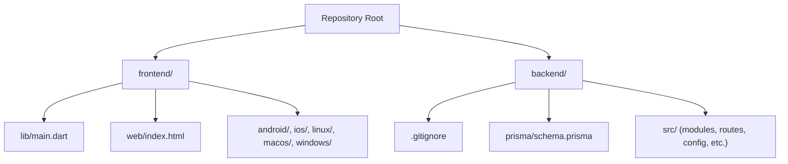
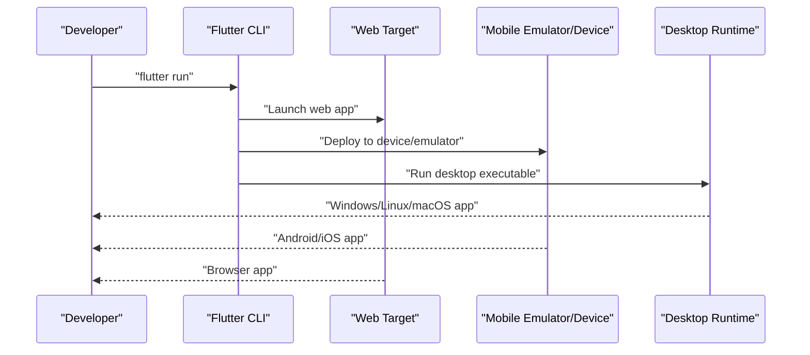
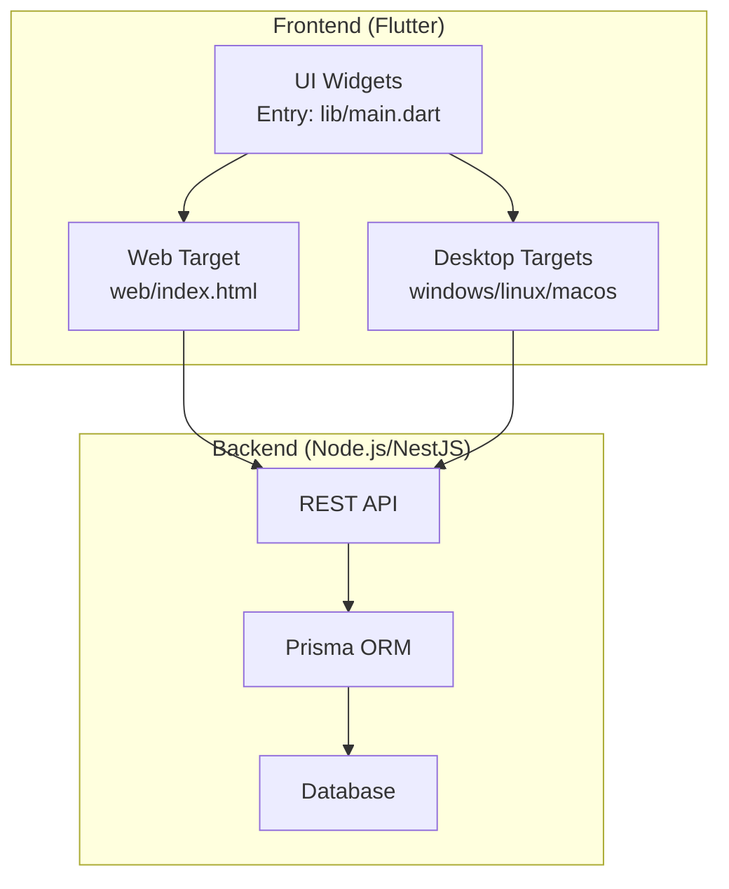

# Getting Started

<cite>
**Referenced Files in This Document**
- [pubspec.yaml](file://frontend/pubspec.yaml)
- [README.md](file://frontend/README.md)
- [main.dart](file://frontend/lib/main.dart)
- [index.html](file://frontend/web/index.html)
- [windows main.cpp](file://frontend/windows/runner/main.cpp)
- [linux my_application.cc](file://frontend/linux/my_application.cc)
- [macos flutter_export_environment.sh](file://frontend/macos/Flutter/ephemeral/flutter_export_environment.sh)
- [.gitignore](file://backend/.gitignore)
- [schema.prisma](file://backend/prisma/schema.prisma)
</cite>

## Table of Contents
1. [Introduction](#introduction)
2. [Project Structure](#project-structure)
3. [Prerequisites](#prerequisites)
4. [Environment Setup](#environment-setup)
5. [Installation Steps](#installation-steps)
6. [Running the Application](#running-the-application)
7. [Architecture Overview](#architecture-overview)
8. [Verification Checklist](#verification-checklist)
9. [Troubleshooting Guide](#troubleshooting-guide)
10. [Next Steps](#next-steps)

## Introduction
This guide helps you install, configure, and run the social media app locally. The project consists of:
- Frontend built with Flutter (supports web, mobile, and desktop targets)
- Backend using NestJS/Node.js with Prisma ORM

It covers prerequisites, environment configuration, step-by-step installation for both frontend and backend, and how to run the app across platforms.

## Project Structure
At a high level, the repository is organized into two primary folders:
- frontend: Flutter application with platform-specific configurations for Android, iOS, Web, Linux, macOS, and Windows
- backend: Node.js server with modular structure under src/modules and database schema under prisma

**Diagram sources**
- [main.dart:1-126](file://frontend/lib/main.dart#L1-L126)
- [index.html:1-38](file://frontend/web/index.html#L1-L38)
- [.gitignore:1-1](file://backend/.gitignore#L1-L1)
- [schema.prisma:1-1](file://backend/prisma/schema.prisma#L1-L1)

**Section sources**
- [main.dart:1-126](file://frontend/lib/main.dart#L1-L126)
- [index.html:1-38](file://frontend/web/index.html#L1-L38)
- [.gitignore:1-1](file://backend/.gitignore#L1-L1)
- [schema.prisma:1-1](file://backend/prisma/schema.prisma#L1-L1)

## Prerequisites
Ensure your machine meets the following requirements before proceeding:
- Operating system: Windows, macOS, or Linux
- Flutter SDK: Compatible with the SDK constraint declared in the Flutter project configuration
- Dart SDK: Bundled with Flutter
- Node.js: Required for backend development and Prisma tooling
- npm or yarn: Package manager for Node.js
- Git: For version control and cloning the repository
- Optional: Android Studio/Xcode for mobile builds; Visual Studio Code recommended for Flutter development

Tip: The Flutter project declares an SDK constraint; align your Flutter/Dart versions accordingly.

**Section sources**
- [pubspec.yaml:21-23](file://frontend/pubspec.yaml#L21-L23)

## Environment Setup
Configure your development environment as follows:

- Install Flutter:
  - Follow the official installation steps for your OS.
  - Verify installation with flutter doctor.

- Install Node.js and npm:
  - Download and install Node.js LTS.
  - Confirm installation via node -v and npm -v.

- Set up Prisma:
  - Prisma CLI is used for schema introspection and migrations.
  - Install globally if needed: npm install -g prisma
  - Ensure Prisma is available in your PATH.

- IDE:
  - Recommended: Visual Studio Code with Flutter and Dart extensions.
  - Enable formatting and linting per the project’s analysis options.

**Section sources**
- [pubspec.yaml:21-23](file://frontend/pubspec.yaml#L21-L23)
- [schema.prisma:1-1](file://backend/prisma/schema.prisma#L1-L1)

## Installation Steps

### Backend (Node.js + NestJS + Prisma)
1. Navigate to the backend directory.
2. Install dependencies:
   - Use npm install or your preferred package manager.
   - The backend’s dependency list is minimal; ensure node_modules is not committed (.gitignore is configured).
3. Prisma setup:
   - Initialize Prisma if needed: npx prisma init
   - Review the schema file to define your database model.
   - Apply migrations to your database as appropriate for your environment.

Notes:
- The backend currently contains a placeholder Prisma schema file; update it with your entity definitions.
- The backend’s package metadata is minimal; confirm your runtime dependencies are installed.

**Section sources**
- [.gitignore:1-1](file://backend/.gitignore#L1-L1)
- [schema.prisma:1-1](file://backend/prisma/schema.prisma#L1-L1)

### Frontend (Flutter)
1. Navigate to the frontend directory.
2. Install dependencies:
   - Run flutter pub get to fetch Dart packages.
   - Flutter will resolve dependencies based on pubspec.yaml.
3. Verify Flutter environment:
   - Run flutter doctor to check for missing tools or SDK mismatches.

Notes:
- The project README provides general Flutter guidance for first-time users.
- The main entry point is lib/main.dart, which bootstraps the app.

**Section sources**
- [pubspec.yaml:1-91](file://frontend/pubspec.yaml#L1-L91)
- [README.md:1-17](file://frontend/README.md#L1-L17)
- [main.dart:1-126](file://frontend/lib/main.dart#L1-L126)

## Running the Application

### Local Development
- Start the backend:
  - From the backend directory, run the development server using your preferred Node.js workflow.
  - Ensure your database is reachable and migrations are applied.

- Start the frontend:
  - From the frontend directory, run flutter run to launch on your connected device/emulator or a selected target.

### Platform Targets
- Web:
  - The frontend includes a web folder with index.html and manifest.json.
  - Use flutter run -d chrome or flutter run -d web-server to launch the web app.

- Mobile:
  - Android/iOS require connected devices or emulators.
  - Use flutter run to deploy to a connected device or default emulator.

- Desktop:
  - Linux/macOS/Windows targets are supported.
  - Windows entry point is windows/runner/main.cpp.
  - Linux entry point is linux/my_application.cc.
  - macOS exports environment variables for Flutter builds.

**Diagram sources**
- [index.html:1-38](file://frontend/web/index.html#L1-L38)
- [windows main.cpp:1-43](file://frontend/windows/runner/main.cpp#L1-L43)
- [linux my_application.cc:35-71](file://frontend/linux/my_application.cc#L35-L71)
- [macos flutter_export_environment.sh:1-12](file://frontend/macos/Flutter/ephemeral/flutter_export_environment.sh#L1-L12)

**Section sources**
- [index.html:1-38](file://frontend/web/index.html#L1-L38)
- [windows main.cpp:1-43](file://frontend/windows/runner/main.cpp#L1-L43)
- [linux my_application.cc:35-71](file://frontend/linux/my_application.cc#L35-L71)
- [macos flutter_export_environment.sh:1-12](file://frontend/macos/Flutter/ephemeral/flutter_export_environment.sh#L1-L12)

## Architecture Overview
High-level architecture:
- Frontend (Flutter): Cross-platform UI that communicates with the backend API.
- Backend (Node.js/NestJS): Serves REST endpoints and integrates with Prisma for data access.
- Database: Managed via Prisma; schema is defined in backend/prisma/schema.prisma.

**Diagram sources**
- [main.dart:1-126](file://frontend/lib/main.dart#L1-L126)
- [index.html:1-38](file://frontend/web/index.html#L1-L38)
- [windows main.cpp:1-43](file://frontend/windows/runner/main.cpp#L1-L43)
- [linux my_application.cc:35-71](file://frontend/linux/my_application.cc#L35-L71)
- [schema.prisma:1-1](file://backend/prisma/schema.prisma#L1-L1)

## Verification Checklist
- Backend
  - Dependencies installed (no errors after npm install).
  - Prisma initialized and schema updated.
  - Database reachable and migrations applied.
- Frontend
  - flutter pub get succeeds.
  - flutter doctor reports no critical issues.
  - flutter run launches successfully on at least one target (e.g., web or desktop).
- Cross-cutting
  - No uncommitted node_modules (respect .gitignore).
  - Environment variables for backend are configured as needed.

**Section sources**
- [.gitignore:1-1](file://backend/.gitignore#L1-L1)
- [pubspec.yaml:1-91](file://frontend/pubspec.yaml#L1-L91)
- [main.dart:1-126](file://frontend/lib/main.dart#L1-L126)

## Troubleshooting Guide
- Flutter doctor shows missing tools:
  - Install missing SDKs or IDE plugins as indicated.
- Backend dependency issues:
  - Clear cache and reinstall: delete node_modules and run npm install again.
  - Ensure package.json is valid and dependencies are compatible.
- Prisma schema errors:
  - Initialize Prisma if missing: npx prisma init.
  - Define models in prisma/schema.prisma and apply migrations.
- Web app not loading:
  - Confirm web/index.html is present and accessible.
  - Use flutter run -d chrome to launch the web target.
- Desktop app crashes immediately:
  - Verify platform-specific entry points (windows/runner/main.cpp, linux/my_application.cc).
  - Rebuild the desktop target after changes.
- macOS build environment:
  - Ensure FLUTTER_ROOT and related environment variables are set as exported by the ephemeral script.

**Section sources**
- [index.html:1-38](file://frontend/web/index.html#L1-L38)
- [windows main.cpp:1-43](file://frontend/windows/runner/main.cpp#L1-L43)
- [linux my_application.cc:35-71](file://frontend/linux/my_application.cc#L35-L71)
- [macos flutter_export_environment.sh:1-12](file://frontend/macos/Flutter/ephemeral/flutter_export_environment.sh#L1-L12)
- [schema.prisma:1-1](file://backend/prisma/schema.prisma#L1-L1)

## Next Steps
- Define your database schema in prisma/schema.prisma and generate client/migrations.
- Implement backend modules under backend/src/modules and connect them to routes.
- Extend the Flutter UI in lib/ to integrate with backend APIs.
- Add environment variables for backend configuration and secure secrets.
- Set up CI/CD pipelines for automated testing and deployment.