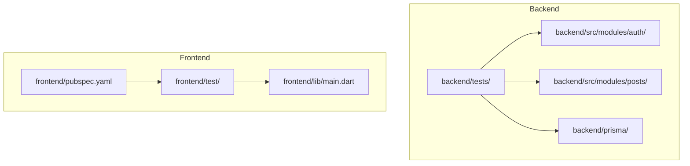
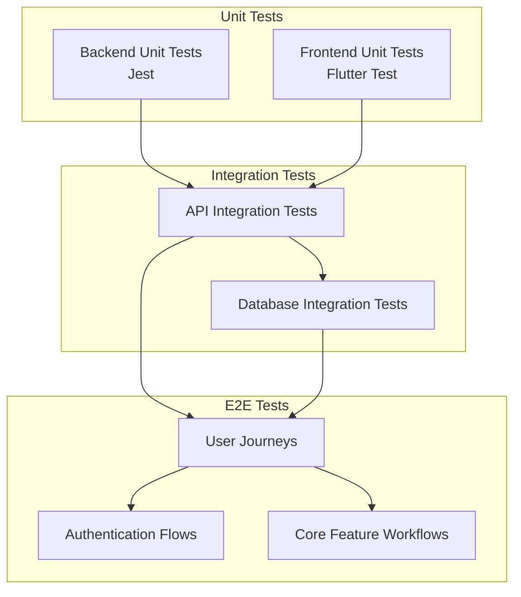
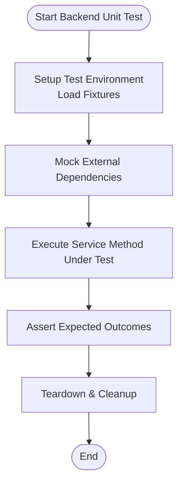
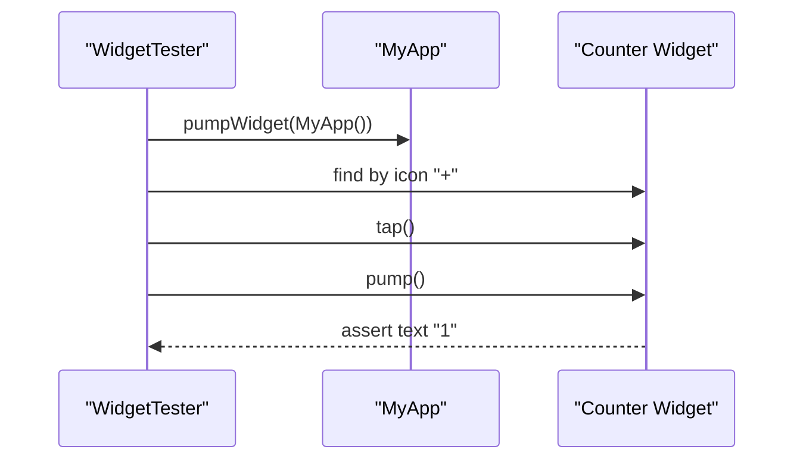
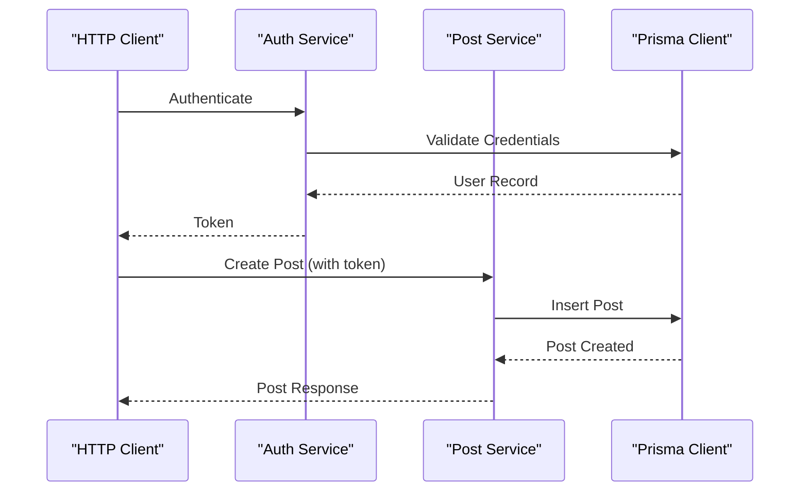
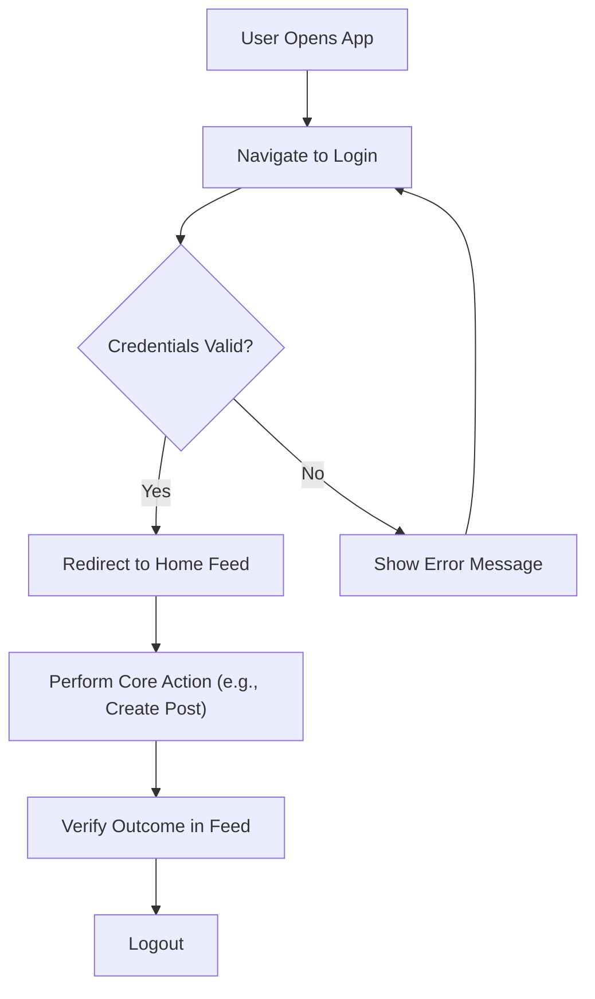
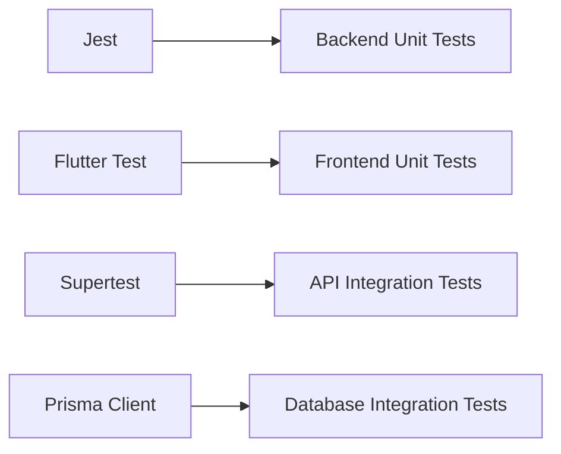

# Testing Strategy

<cite>
**Referenced Files in This Document**
- [auth.test.js](file://backend/tests/auth.test.js)
- [post.test.js](file://backend/tests/post.test.js)
- [widget_test.dart](file://frontend/test/widget_test.dart)
- [pubspec.yaml](file://frontend/pubspec.yaml)
- [auth.service.js](file://backend/src/modules/auth/auth.service.js)
- [post.service.js](file://backend/src/modules/posts/post.service.js)
</cite>

## Table of Contents
1. [Introduction](#introduction)
2. [Project Structure](#project-structure)
3. [Core Components](#core-components)
4. [Architecture Overview](#architecture-overview)
5. [Detailed Component Analysis](#detailed-component-analysis)
6. [Dependency Analysis](#dependency-analysis)
7. [Performance Considerations](#performance-considerations)
8. [Troubleshooting Guide](#troubleshooting-guide)
9. [Conclusion](#conclusion)
10. [Appendices](#appendices)

## Introduction
This document outlines a comprehensive testing strategy for the social media application, covering unit testing for both frontend and backend, integration testing for APIs and database operations, end-to-end workflows, performance testing, and CI/CD automation. It consolidates the current state of testing artifacts and proposes actionable improvements to ensure robust, maintainable, and reliable software delivery.

## Project Structure
The repository is organized into two primary areas:
- Backend: Modular Node.js application under development with a dedicated tests directory and module-based structure.
- Frontend: Flutter application with a minimal widget test scaffold and standard Flutter dependencies.

Current testing artifacts:
- Backend tests directory exists but contains placeholder files.
- Frontend includes a default widget test scaffold and Flutter test dev dependency declared in pubspec.

**Diagram sources**
- [auth.test.js](file://backend/tests/auth.test.js)
- [post.test.js](file://backend/tests/post.test.js)
- [pubspec.yaml](file://frontend/pubspec.yaml)
- [auth.service.js](file://backend/src/modules/auth/auth.service.js)
- [post.service.js](file://backend/src/modules/posts/post.service.js)

**Section sources**
- [auth.test.js:1-1](file://backend/tests/auth.test.js#L1-L1)
- [post.test.js:1-1](file://backend/tests/post.test.js#L1-L1)
- [pubspec.yaml:1-91](file://frontend/pubspec.yaml#L1-L91)

## Core Components
This section identifies the core components relevant to testing and their roles:
- Backend modules under test:
  - Authentication service module
  - Posts service module
- Frontend:
  - Default widget test scaffold
  - Flutter test framework dependency

Current state highlights:
- Backend tests are placeholders and require implementation.
- Frontend test scaffolding is present and ready for expansion.

**Section sources**
- [auth.service.js:1-1](file://backend/src/modules/auth/auth.service.js#L1-L1)
- [post.service.js:1-1](file://backend/src/modules/posts/post.service.js#L1-L1)
- [widget_test.dart:1-31](file://frontend/test/widget_test.dart#L1-L31)

## Architecture Overview
The testing architecture aligns with a layered approach:
- Unit tests for backend services and frontend widgets
- Integration tests validating API endpoints and database interactions
- End-to-end tests covering critical user journeys
- CI pipelines automating unit, integration, and end-to-end checks

[No sources needed since this diagram shows conceptual workflow, not actual code structure]

## Detailed Component Analysis

### Backend Unit Testing Strategy
- Framework: Jest (recommended)
- Scope:
  - Mock external dependencies (e.g., database clients, third-party APIs)
  - Isolate service logic and DTO validations
  - Use in-memory test databases for deterministic outcomes
- Test Case Design Patterns:
  - Arrange-Act-Assert pattern
  - Parameterized tests for boundary conditions
  - Snapshot tests for response structures
- Mocking Strategies:
  - Use Jest mocks for service dependencies
  - Replace database calls with mock repositories
- Test Data Management:
  - Centralized fixtures for requests and responses
  - Seed test database with deterministic datasets
- Coverage Targets:
  - Aim for >80% line and branch coverage per module

[No sources needed since this diagram shows conceptual workflow, not actual code structure]

**Section sources**
- [auth.test.js:1-1](file://backend/tests/auth.test.js#L1-L1)
- [post.test.js:1-1](file://backend/tests/post.test.js#L1-L1)

### Frontend Unit Testing Strategy
- Framework: Flutter Test (already declared in dev dependencies)
- Scope:
  - Widget tests for UI components
  - Integration tests for navigation and stateful widgets
- Test Case Design Patterns:
  - Use WidgetTester to simulate user interactions
  - Verify UI state transitions and rendering
- Mocking Strategies:
  - Mock service layers and repositories
  - Stub network calls with test doubles
- Test Data Management:
  - Provide test models and fixtures via dependency injection
- Coverage Targets:
  - Target >70% widget and integration coverage

**Diagram sources**
- [widget_test.dart:13-30](file://frontend/test/widget_test.dart#L13-L30)

**Section sources**
- [pubspec.yaml:39-48](file://frontend/pubspec.yaml#L39-L48)
- [widget_test.dart:1-31](file://frontend/test/widget_test.dart#L1-L31)

### Integration Testing Approaches
- API Endpoints:
  - Use supertest or axios interceptors to validate HTTP responses
  - Test CRUD operations for posts and auth flows
- Database Operations:
  - Use Prisma test client with transaction rollbacks
  - Validate referential integrity and constraints
- Cross-Module Functionality:
  - Orchestrate tests spanning auth, posts, and notifications
  - Simulate real-world workflows (e.g., post creation triggers notifications)

[No sources needed since this diagram shows conceptual workflow, not actual code structure]

**Section sources**
- [auth.service.js:1-1](file://backend/src/modules/auth/auth.service.js#L1-L1)
- [post.service.js:1-1](file://backend/src/modules/posts/post.service.js#L1-L1)

### End-to-End Testing for Critical Workflows
- Authentication Flows:
  - Registration → Login → Logout
  - Password reset and session invalidation
- Core Feature Workflows:
  - Create post → Like/Comment → Feed visibility
  - Search users and follow/unfollow
- E2E Tools:
  - Detox for native apps
  - Appium or Flutter Driver for cross-platform
- Data Management:
  - Provision clean test accounts and content per scenario
  - Use deterministic seeds for reproducibility

[No sources needed since this diagram shows conceptual workflow, not actual code structure]

**Section sources**
- [auth.service.js:1-1](file://backend/src/modules/auth/auth.service.js#L1-L1)
- [post.service.js:1-1](file://backend/src/modules/posts/post.service.js#L1-L1)

### Performance, Load, and Stress Testing
- Performance Testing:
  - Measure response latency and throughput for key endpoints
  - Use tools like Artillery or k6 for scripted load tests
- Load Testing:
  - Gradually increase concurrent users and monitor resource utilization
- Stress Testing:
  - Push beyond capacity to identify failure points and recovery behavior
- Reporting:
  - Capture metrics (p50, p95, p99), error rates, and resource consumption

[No sources needed since this section provides general guidance]

### Continuous Integration and Automated Testing
- Pipelines:
  - Unit tests on pull requests
  - Integration tests against ephemeral environments
  - E2E tests on scheduled runs or selected branches
- Quality Gates:
  - Enforce minimum coverage thresholds
  - Fail builds on test regressions or flaky tests
- Artifact Management:
  - Store test reports and coverage artifacts
  - Archive performance benchmarks over time

[No sources needed since this section provides general guidance]

## Dependency Analysis
- Backend dependencies relevant to testing:
  - Jest ecosystem for unit and integration tests
  - Supertest or similar for HTTP assertions
  - In-memory databases for isolation
- Frontend dependencies relevant to testing:
  - Flutter test framework (declared)
  - Additional drivers for E2E testing (to be added)

[No sources needed since this diagram shows conceptual relationships, not specific code structure]

**Section sources**
- [pubspec.yaml:39-48](file://frontend/pubspec.yaml#L39-L48)

## Performance Considerations
- Favor lightweight, deterministic fixtures for fast tests
- Use parallelization judiciously to avoid resource contention
- Prefer pure functions and dependency injection to simplify mocking
- Monitor memory usage during long-running test suites

[No sources needed since this section provides general guidance]

## Troubleshooting Guide
- Common Issues:
  - Flaky tests due to timing or shared state
  - External dependency timeouts
  - Inconsistent test data across runs
- Remediation:
  - Add explicit waits and retries for async operations
  - Use isolated test databases and deterministic seeds
  - Reduce global state and encapsulate side effects
- Debugging Tips:
  - Run failing tests in isolation
  - Log intermediate states and payloads
  - Use snapshot tests to capture expected outputs

[No sources needed since this section provides general guidance]

## Conclusion
The application currently has foundational scaffolding for testing in both backend and frontend. The proposed strategy emphasizes implementing comprehensive unit and integration tests, expanding E2E coverage for critical workflows, and establishing CI pipelines with quality gates. By adopting structured patterns, robust mocking, and performance-focused practices, the team can deliver a reliable and maintainable platform.

[No sources needed since this section summarizes without analyzing specific files]

## Appendices
- Test Coverage Targets:
  - Backend: >80% line and branch coverage
  - Frontend: >70% widget and integration coverage
- Recommended Tools:
  - Backend: Jest, Supertest, Prisma, Artillery/k6
  - Frontend: Flutter Test, Detox/Appium, Flutter Driver

[No sources needed since this section provides general guidance]